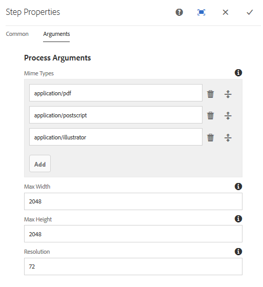
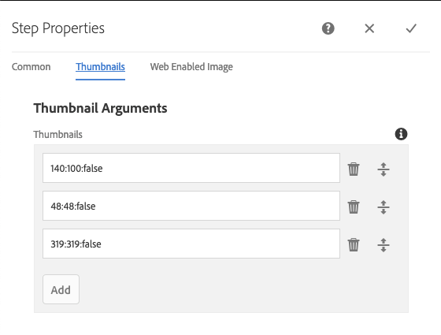
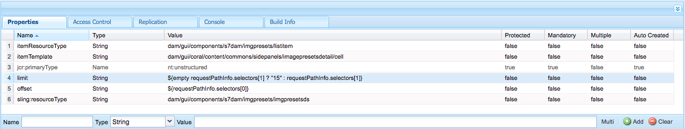
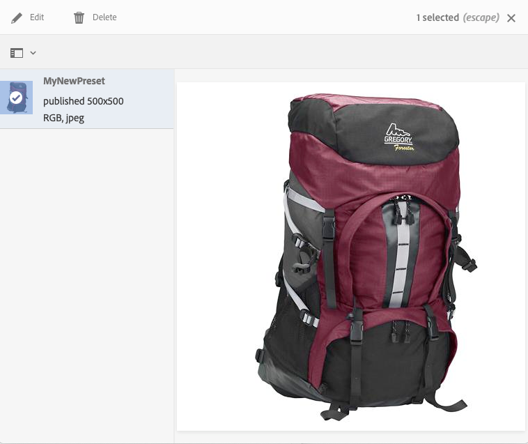

# Gerenciar predefinições de imagem{#managing-image-presets}

As Predefinições de imagem permitem que o Adobe Experience Manager Assets forneça imagens dinamicamente em diferentes tamanhos, em diferentes formatos ou com outras propriedades de imagem geradas dinamicamente. Cada predefinição de imagem representa uma coleção predefinida de comandos de dimensionamento e formatação para a exibição de imagens. Ao criar uma Predefinição de imagem, você escolhe um tamanho para a entrega da imagem. Você também escolhe comandos de formatação para que a aparência da imagem seja otimizada quando ela for entregue para visualização.

Os administradores podem criar predefinições para exportar ativos. Os usuários podem escolher uma predefinição ao exportar imagens, o que também reformata imagens para as especificações especificadas pelo administrador.

Também é possível criar Predefinições de imagem responsivas. Se você aplicar uma Predefinição de imagem responsiva aos seus ativos, eles mudam dependendo do dispositivo ou tamanho da tela em que são exibidos. É possível configurar Predefinições de imagem para usar CMYK no espaço de cores, além de RGB ou Cinza.

Esta seção descreve como criar, modificar e gerenciar predefinições de imagem. É possível aplicar uma predefinição de imagem a uma imagem sempre que ela for visualizada. Consulte [Aplicar predefinições de imagem](/help/assets/dynamic-media/image-presets.md).

>[!NOTE]
>
>A geração de imagens inteligentes funciona com suas Predefinições de imagem existentes e usa inteligência nos últimos milissegundos do delivery para reduzir ainda mais o tamanho do arquivo de imagem com base na velocidade do navegador ou da conexão de rede. Consulte [Smart Imaging](/help/assets/dynamic-media/imaging-faq.md) para obter mais informações.

## Saiba mais sobre predefinições de imagem {#understanding-image-presets}

Como uma macro, uma Predefinição de imagem é uma coleção predefinida de comandos de dimensionamento e formatação salvos com um nome. Para entender como as Predefinições de imagem funcionam, suponha que seu site exija que cada imagem do produto seja exibida em tamanhos, formatos e taxas de compactação diferentes para entrega de desktops e dispositivos móveis.

Você pode criar duas Predefinições de imagem: 500 x 500 pixels para desktop e 150 x 150 pixels para móvel. Você cria duas Predefinições de Imagem, uma chamada `Enlarge` para exibir imagens a 500x500 pixels e outra chamada `Thumbnail` para exibir imagens a 150 x 150 pixels. Para entregar imagens no tamanho `Enlarge` e `Thumbnail`, o Experience Manager encontra a definição de `Enlarge Image Preset` e `Thumbnail Image Preset`. Em seguida, o Experience Manager gera dinamicamente uma imagem com as especificações de tamanho e formatação de cada Predefinição de imagem.

Imagens com tamanho reduzido quando entregues dinamicamente podem perder nitidez e detalhes. Por esse motivo, cada Predefinição de imagem contém controles de formatação para otimizar uma imagem quando ela é entregue em um tamanho específico. Esses controles garantem que suas imagens sejam nítidas e claras quando forem entregues ao seu site ou aplicativo.

Os administradores podem criar Predefinições de imagem. Para criar uma Predefinição de imagem, comece do zero ou a partir de uma predefinição existente e salve com um novo nome.

## Gerenciar predefinições de imagem {#managing-image-presets-1}

Para gerenciar suas Predefinições de imagem no Experience Manager, selecione o logotipo Experience Manager para acessar o console de navegação global e, em seguida, selecione o ícone Ferramentas e navegue até **[!UICONTROL Assets]** > **[!UICONTROL Predefinições de imagem]**.


>[!NOTE]
>
>Todas as predefinições de imagem criadas também estão disponíveis como representações dinâmicas ao visualizar ou entregar ativos.
>
>Você precisa *não* publicar predefinições de imagem, pois as predefinições de imagem são publicadas automaticamente.
>
>Consulte [Publicar Predefinições De Imagem](#publishing-image-presets).

>[!NOTE]
>
>O sistema mostra várias representações quando você seleciona **[!UICONTROL Representações]** na Exibição de detalhes de um ativo. É possível aumentar ou diminuir o número de Predefinições de imagem exibidas. Consulte [Aumentar o número de predefinições de imagens exibidas](#increasing-or-decreasing-the-number-of-image-presets-that-display).

## Como as predefinições de imagem se relacionam com representações {#how-image-presets-relate-to-renditions}

As predefinições de imagem definem como o Dynamic Media fornece imagens, incluindo dimensionamento, formatação, compactação e outros parâmetros de exibição. As predefinições não geram representações sozinhas. Em vez disso, eles dependem de representações que são criadas quando os ativos são processados.

### Geração de representação no AEM as a Cloud Service{#rendition-generation-in-aemaacs}

No AEM as a Cloud Service, as representações são geradas usando os [Microsserviços de ativos](https://experienceleague.adobe.com/pt-br/docs/experience-manager-cloud-service/content/assets/manage/asset-microservices-configure-and-use#). O fluxo de trabalho do Ativo de atualização do DAM não está disponível para personalização no Cloud Service.

As considerações importantes incluem o seguinte:

* As representações são geradas no momento do upload.
* As alterações em um perfil de processamento afetam os ativos recém-carregados. Os ativos existentes devem ser reprocessados se novas representações forem necessárias.
* A personalização do modelo de fluxo de trabalho não é compatível com o AEM as a Cloud Service para geração de representação.

As predefinições de imagem fazem referência às representações disponíveis no momento do delivery. Verifique se as representações necessárias existem antes de configurar ou usar as Predefinições de imagem.

**Para controlar quais representações são geradas:**

1. Crie ou edite um [Perfil de Processamento](https://experienceleague.adobe.com/pt-br/docs/experience-manager-cloud-service/content/assets/manage/asset-microservices-configure-and-use#).
2. Configure as definições de representação necessárias.
3. Aplique o perfil de processamento à pasta apropriada.

Quando os ativos são carregados para uma pasta que tem um Perfil de processamento aplicado, os Microserviços de ativos geram automaticamente as representações definidas.

<!--
### Adobe Illustrator (AI), PostScript&reg; (EPS), and PDF file formats {#adobe-illustrator-ai-postscript-eps-and-pdf-file-formats}

If you intend to support the ingestion of AI, EPS, and PDF files so that you can generate dynamic renditions of these file formats, review the following information before you create Image Presets.

Adobe Illustrator's file format is a variant of PDF. The main differences, in the context of Experience Manager Assets, are the following:

* Adobe Illustrator documents consist of a single page with multiple layers. Each layer is extracted as a PNG subasset under the main Illustrator asset.
* PDF documents consist of one or more pages. Each page is extracted as a single page PDF subasset under the main multi-page PDF document.

The `Create Sub Asset process` component creates the subassets within the overall `DAM Update Asset` workflow. To see this process component within the workflow, navigate to **[!UICONTROL Tools]** > **[!UICONTROL Workflow]** > **[!UICONTROL Models]** > **[!UICONTROL DAM Update Asset]** > **[!UICONTROL Edit]**.

See also [Viewing pages of a multi-page file](/help/assets/manage-linked-subassets.md#view-pages-of-a-multi-page-file).

You can view the subassets or the pages when you open the asset, select the Content menu, and select **[!UICONTROL Subassets]** or **[!UICONTROL Pages]**. The subassets are real assets. The `Create Sub Asset` workflow component extracts the PDF pages. They are then stored as `page1.pdf`, `page2.pdf`, and so on, below the main asset. After they are stored, the `DAM Update Asset` workflow processes them.

To use Dynamic Media to preview and generate dynamic renditions for AI, EPS or PDF files, the following processing steps are required:

1. In the `DAM Update Asset` workflow, the `Rasterize PDF/AI Image Preview Rendition` process component rasterizes the first page of the original asset &ndash; using the configured resolution &ndash; into a `cqdam.preview.png` rendition.

1. The `Dynamic Media Process Image Assets` process component within the workflow optimizes the `cqdam.preview.png` rendition into a PTIFF.

>[!NOTE]
>
>In the DAM Update Asset workflow, the **[!UICONTROL EPS thumbnails]** step generates thumbnails for EPS files.

#### PDF/AI/EPS asset metadata properties {#pdf-ai-eps-asset-metadata-properties}

| **Metadata property** |**Description** |
|---|---|
| `dam:Physicalwidthininches` |Document width in inches. |
| `dam:Physicalheightininches` |Document height in inches. |

You access `Rasterize PDF/AI Image Preview Rendition` process component options by way of the `DAM Update Asset` workflow.

Select Adobe Experience Manager in the upper left, the click **[!UICONTROL Tools]** > **[!UICONTROL Workflow]** > **[!UICONTROL Models]**. On the Workflow Models page, select **[!UICONTROL DAM Update Asset]**, then on the toolbar select **[!UICONTROL Edit]**. On the DAM Update Asset workflow page, double-select the `Rasterize PDF/AI Image Preview Rendition` process component to open its Step Properties dialog box.

#### Rasterize PDF/AI Image Preview Rendition options {#rasterize-pdf-ai-image-preview-rendition-options}



Arguments to rasterize PDF or AI workflow

|Process Argument | Default setting | Description |
|---|---|---|
| Mime Types | application/pdf<br>application/postscript<br>application/illustrator| List of document mime-types that are considered to be PDF or Illustrator documents. |
| Max Width | 2048 | Maximum width of the generated preview rendition, in pixels.|
| Max Height | 2048| Maximum height of the generated preview rendition, in pixels. |
| Resolution | 72 | Resolution to rasterize the first page, in ppi (pixels per inch). |

Using the default process arguments, the first page of a PDF/AI document is rasterized at 72 ppi and the generated preview image is sized at 2048 x 2048 pixels. For a typical deployment, you can increase the resolution to a minimum of 150 ppi or more. For example, a US letter size document at 300 ppi requires a maximum width and height of 2550 x 3300 pixels, respectively.

Max Width and Max Height limit the resolution at which to rasterize. For example, if the maximums are unchanged, and Resolution is set to 300 ppi, a US Letter document is rasterized at 186 ppi. That is, the document is 1581 x 2046 pixels.

The `Rasterize PDF/AI Image Preview Rendition` process component has a maximum defined to ensure that it does not create overly large images in memory. Such large images can overflow the memory provided to the JVM (Java&trade; Virtual Machine). Care must be taken to provide the JVM with enough memory to manage the configured number of parallel workflows, with each having the potential to create an image at the maximum configured size. -->

<!--
### InDesign (INDD) file format {#indesign-indd-file-format}

If you intend to support the ingestion of INDD files so that you can generate dynamic rendition of this file format, review the following information before you create Image Presets.

For InDesign files, sub assets are extracted only if the Adobe InDesign Server is integrated with Experience Manager. Referenced assets are linked based on their metadata. InDesign Server is not required for linking. However, the referenced assets must be present within Experience Manager before the InDesign files are processed for the links to be created between the InDesign files and the referenced assets.

See [Integrate Experience Manager Assets with InDesign Server](/help/assets/indesign.md).

The Media Extraction process component in the `DAM Update Asset` workflow runs several pre-configured Extend Scripts to process InDesign files.


The ExtendScript paths in the arguments of the Media Extraction process component in the DAM Update Asset workflow.

The following scripts are used by Dynamic Media integration:


|ExtendScript name | Default | Description |
|---|---|---|
| ThumbnailExport.jsx | Yes  | Generates a 300 PPI `thumbnail.jpg` rendition that is optimized and turned into a PTIFF rendition by `Dynamic Media Process Image Assets` process component.  |
| JPEGPagesExport.jsx | Yes | Generates a 300 PPI JPEG subasset for each page. The JPEG subasset is a real asset stored under the InDesign asset. The `DAM Update Asset` workflow optimizes and converts it into a PTIFF. |
| PDFPagesExport.jsx | No | Generates a PDF subasset for each page. The PDF subasset gets processed as described earlier. Because the PDF contains a single page only, no subassets are generated. |
-->

<!--
### Configure the image thumbnail size {#configuring-image-thumbnail-size}

You can configure the size of thumbnails by configuring those settings in the **[!UICONTROL DAM Update Asset]** workflow. There are two steps in the workflow where you can configure the thumbnail size of image assets. One (**[!UICONTROL Dynamic Media Process Image Assets]**) is used for dynamic image assets. The other (**[!UICONTROL Process Thumbnails]**) is used for static thumbnail generation or when all other processes fail to generate thumbnails. Regardless, *both* must have the same settings.

The **[!UICONTROL Dynamic Media Process Image Assets]** step uses the image server to generate thumbnails, independently of the configuration applied to the **[!UICONTROL Process Thumbnails]** step. Generating thumbnails through the **[!UICONTROL Process Thumbnails]** step is the slowest and most memory intensive way to create thumbnails.

Thumbnail sizing is defined in the following format: **[!UICONTROL width:height:center]**, for example, `80:80:false`. The width and height determine the size in pixels of the thumbnail. The center value is either false or true. If set to true, it indicates that the thumbnail image has exactly the size given in the configuration. If the resized image is smaller, it is centered within the thumbnail.

>[!NOTE]
>
>* Thumbnail sizes for EPS files are configured in the **[!UICONTROL EPS thumbnails]** step, in the **[!UICONTROL Arguments]** tab under Thumbnails.
>
>* Thumbnail sizes for videos are configured in the **[!UICONTROL FFmpeg thumbnails]** step, in the **[!UICONTROL Process]** tab under **[!UICONTROL Arguments]**.
>

**To configure the image thumbnail size:**

1. Navigate to **[!UICONTROL Tools]** > **[!UICONTROL Workflow]** > **[!UICONTROL Models]** > **[!UICONTROL DAM Update Asset]** > **[!UICONTROL Edit]**.
1. Select the **[!UICONTROL Dynamic Media Process Image Assets]** step and select the **[!UICONTROL Thumbnails]** tab. Change the thumbnail size, as needed, then select **[!UICONTROL OK]**.

   

1. Select the **[!UICONTROL Process Thumbnails]** step, then select the **[!UICONTROL Thumbnails]** tab. Change the thumbnail size, as needed, then select **[!UICONTROL OK]**.

   >[!NOTE]
   >
   >The values in the thumbnails argument in the **[!UICONTROL Process Thumbnails]** step must match the thumbnails argument in the **[!UICONTROL Dynamic Media Process Image Assets]** step.

1. Select **[!UICONTROL Save]** to save the changes to the workflow.
-->

## Aumentar ou diminuir o número de predefinições de imagens exibidas {#increasing-or-decreasing-the-number-of-image-presets-that-display}

As predefinições de imagem criadas estão disponíveis como representações dinâmicas ao visualizar ativos. O Experience Manager mostra várias representações dinâmicas ao visualizar um ativo de **[!UICONTROL Exibição detalhada > Representações]**. É possível aumentar ou diminuir o limite de representações exibidas.

**Para aumentar ou diminuir o número de predefinições de imagens exibidas:**

1. Navegue até CRXDE Lite ([https://localhost:4502/crx/de](https://localhost:4502/crx/de)).
1. Navegue até o nó da listagem de predefinições de imagens em `/libs/dam/gui/coral/content/commons/sidepanels/imagepresetsdetail/imgagepresetslist`

   

1. Na propriedade **[!UICONTROL limit]**, altere o **[!UICONTROL Value]**, que é definido como 15 por padrão, para o número desejado.
1. Navegar até a fonte de dados de predefinição de imagem em `/libs/dam/gui/coral/content/commons/sidepanels/imagepresetsdetail/imgagepresetslist/datasource`

   

1. Na propriedade limit, altere o número para o número desejado, por exemplo, `{empty requestPathInfo.selectors[1] ? "20" : requestPathInfo.selectors[1]}`
1. Selecione **[!UICONTROL Salvar tudo]**.

## Criar predefinições de imagem {#creating-image-presets}

Criar predefinições de imagem para aplicar configurações de forma consistente nas imagens ao visualizar ou publicar.

>[!NOTE]
>
>Se estiver usando o Internet Explorer 9, a criação de uma predefinição não aparecerá na lista de predefinições imediatamente após salvar. Para contornar esse problema, desabilite o cache do IE9.

Se sua intenção for oferecer suporte à assimilação de arquivos AI, PDF e EPS para que você possa gerar a representação dinâmica desses formatos de arquivo, revise as informações a seguir antes de criar Predefinições de imagem.

Consulte os formatos de arquivo do [Adobe Illustrator (AI), PostScript® (EPS) e PDF](#adobe-illustrator-ai-postscript-eps-and-pdf-file-formats).

Se você pretende suportar a assimilação de arquivos INDD para gerar uma representação dinâmica desse formato de arquivo, revise as informações a seguir antes de criar Predefinições de imagem.

Consulte o [formato de arquivo do InDesign (INDD)](#indesign-indd-file-format).

**Para criar predefinições de imagem:**

1. No Experience Manager, selecione o logotipo do Experience Manager para acessar o console de navegação global e vá para **[!UICONTROL Ferramentas]** > **[!UICONTROL Assets]** > **[!UICONTROL Predefinições de imagem]**.
1. Selecione **[!UICONTROL Criar]**.

   

   >[!NOTE]
   >
   >Para tornar esta Predefinição de imagem responsiva, apague os valores nos campos **[!UICONTROL largura]** e **[!UICONTROL altura]** e deixe-os em branco.

1. Na janela **[!UICONTROL Editar Predefinição de Imagem]**, insira valores nas guias **[!UICONTROL Básico]** e **[!UICONTROL Avançado]** conforme apropriado, incluindo um nome. As opções são descritas em [Opções de predefinição de imagem](#image-preset-options). As predefinições aparecem no painel à esquerda e podem ser usadas junto com outros ativos.

   

1. Selecione **[!UICONTROL Salvar]**.

## Criar uma predefinição de imagem responsiva {#creating-a-responsive-image-preset}

Para criar uma Predefinição de imagem responsiva, execute as etapas em [Criar predefinições de imagem](#creating-image-presets). Ao inserir a altura e a largura na janela **[!UICONTROL Editar predefinição de imagem]**, apague os valores e deixe-os em branco.

Deixá-los em branco informa ao Experience Manager que essa Predefinição de imagem é responsiva. Você pode ajustar os outros valores conforme apropriado.

>[!NOTE]
>
>Para ver os botões **[!UICONTROL URL]** e **[!UICONTROL RESS]** ao aplicar uma Predefinição de imagem a um ativo, o ativo deve ser publicado.
>
>
>
>As predefinições de imagem e os ativos de imagem são publicados automaticamente.

### Opções de predefinição de imagem {#image-preset-options}

Ao criar ou editar Predefinições de imagem, você tem as opções descritas nesta seção. Além disso, a Adobe recomenda que essas opções de &quot;práticas recomendadas&quot; comecem:

* **[!UICONTROL Formato]** (guia **[!UICONTROL Básico]**) - Selecione **[!UICONTROL JPEG]** ou outro formato que atenda aos seus requisitos. Todos os navegadores da Web são compatíveis com o formato de imagem JPEG; ele oferece um bom equilíbrio entre arquivos pequenos e qualidade de imagem. No entanto, as imagens no formato JPEG usam um esquema de compactação com perdas que pode apresentar artefatos de imagem indesejados se a configuração de compactação for muito baixa. Por esse motivo, a Adobe recomenda definir a qualidade de compactação como 75. Essa configuração oferece um bom equilíbrio entre a qualidade da imagem e o tamanho pequeno de arquivo.

* **[!UICONTROL Habilitar nitidez simples]** - Não selecione **[!UICONTROL Habilitar nitidez simples]** (este filtro de nitidez oferece menos controle do que as configurações Tirar nitidez da máscara).

* **[!UICONTROL Nitidez: Modo De Reamostragem]** - Selecione **[!UICONTROL Sharp2]**.

### Opções da guia Básico {#basic-tab-options}

| Texto | Descrição |
| --- | --- |
| **Nome** | Insira um nome descritivo sem espaços em branco. Para ajudar os usuários a identificarem essa predefinição de imagem, inclua a especificação do tamanho da imagem no nome. |
| **Largura e Altura** | Insira, em pixels, o tamanho da imagem. A largura e a altura devem ser maiores que 0 pixels. Se um dos valores for 0, nenhuma predefinição será criada. Se ambos os valores estiverem em branco, uma Predefinição de imagem responsiva será criada. |
| **Formato** | Escolha um formato no menu.<br>Escolher **JPEG** oferece as seguintes outras opções:<br>· **Qualidade** - A escala de qualidade do JPEG é de 1 a 100. A escala fica visível quando você arrasta o controle deslizante.<br>· **Habilitar Redução de Resolução de Crominância do JPG** - Como o olho é menos sensível a informações de cores de alta frequência do que a luminosidade de alta frequência, as imagens do JPEG dividem as informações da imagem em componentes de luminosidade e cor. Quando uma imagem do JPEG é compactada, o componente de luminosidade é deixado com a resolução total, enquanto os componentes de cor têm uma resolução mais baixa para calcular a média de grupos de pixels. A redução da resolução reduz o volume de dados para metade ou um terço com impacto mínimo na qualidade aparente. A redução da resolução não é aplicável a imagens em tons de cinza. Essa técnica reduz a quantidade de compactação útil para imagens com alto contraste (por exemplo, imagens com texto sobreposto).<br><br>Escolher **GIF** ou **GIF com alfa** fornece estas opções adicionais de **Quantização de Cores do GIF**:<br>· **Tipo** - Selecionar **Adaptável** (padrão), **Web** ou **Macintosh**. Se você selecionar **GIF com Alpha**, a opção Macintosh não estará disponível.<br>· **Pontilhamento** - Selecionar **Difuso** ou **Desativado**.<br>· **Número de Cores** - Insira um número de 2 a 256.<br>· **Lista de Cores** - Insira uma lista separada por vírgulas. Por exemplo, para branco, cinza e preto, digite `000000,888888,ffffff`.<br><br>Escolher **PDF**, **TIFF** ou **TIFF com alfa** fornece esta opção adicional:<br>· **Compactação** - Selecione um algoritmo de compactação. As opções de algoritmo para o PDF são **None**, **Zip** e **Jpeg**; para o TIFF, são **None**, **LZW**, **Jpeg** e **Zip**; e para o TIFF com Alpha são **None**, **LZW** e **Zip**.<br><br>Escolher **PNG**, **PNG com Alpha** ou **EPS** não fornece opções adicionais. |
| **Nitidez** | Selecione **Habilitar Nitidez Simples** para aplicar um filtro de nitidez básico à imagem depois de todo o dimensionamento. A nitidez pode ajudar a compensar o desfoque que pode ocorrer ao exibir uma imagem de tamanho diferente. |

### Opções da guia Avançadas {#advanced-tab-options}

<table>
 <tbody>
  <tr>
   <td><strong>Texto</strong></td>
   <td><strong>Descrição</strong></td>
  </tr>
  <tr>
   <td><strong>Espaço de cor</strong></td>
   <td>Selecione <strong>RGB, CMYK</strong> ou <strong>Tons de Cinza</strong> para o espaço de cores.</td>
  </tr>
  <tr>
   <td><strong>Perfil de cor</strong></td>
   <td>Selecione o perfil de espaço de cores de saída no qual você deseja converter o ativo se ele for diferente do perfil de trabalho.</td>
  </tr>
  <tr>
   <td><strong>Renderizar recuo</strong></td>
   <td>Você pode substituir a tentativa de renderização padrão. As tentativas de renderização determinam o que acontece com as cores que não podem ser reproduzidas no perfil de cores de destino (fora do gamut). A intenção de renderização é ignorada se não for compatível com o perfil ICC.
    <ul>
     <li>Selecione <strong>Perceptivo</strong> para compactar o gamut total de um espaço de cores em outro espaço de cores quando uma ou mais cores da imagem original estiverem fora do gamut do espaço de cores de destino.</li>
     <li>Selecione <strong>Colorimétrica relativa</strong> quando uma cor no espaço de cores atual estiver fora do gamut no espaço de cores de destino. E você deseja mapeá-la para a gama de cores de destino mais próxima sem alterar outras cores. </li>
     <li>Selecione <strong>Saturação</strong> se desejar reproduzir a saturação de cores da imagem original ao converter para o espaço de cores de destino. </li>
     <li>Selecione <strong>Colorimétrica Absoluta</strong> para combinar exatamente as cores sem nenhum ajuste para o ponto branco ou para o ponto preto, o que alteraria o brilho da imagem.</li>
    </ul> </td>
  </tr>
  <tr>
   <td><strong>Compensação de pontos pretos</strong></td>
   <td>Selecione essa opção se o perfil de saída suportar esse recurso. A compensação de Blackpoint é ignorada se não for compatível com o perfil ICC especificado.</td>
  </tr>
  <tr>
   <td><strong>Pontilhamento</strong></td>
   <td>Selecione essa opção para evitar ou reduzir possíveis artefatos de banda de cores. </td>
  </tr>
  <tr>
   <td><strong>Tipo de nitidez</strong></td>
   <td><p>Selecione <strong>Nenhum</strong>, <strong>Nitidez</strong> ou <strong>Tirar nitidez da máscara</strong>. </p>
    <ul>
     <li>Selecione <strong>Nenhum</strong> se desejar desabilitar a nitidez.</li>
     <li>Selecione <strong>Nitidez </strong>para aplicar um filtro de nitidez básico à imagem depois de todo o dimensionamento. A nitidez pode ajudar a compensar o desfoque que pode ocorrer ao exibir uma imagem de tamanho diferente. </li>
     <li>Selecione <strong> Tirar nitidez da máscara</strong> se desejar ajustar um efeito de filtro de nitidez na imagem final com resolução reduzida. É possível controlar a intensidade do efeito, o raio do efeito (medido em pixels) e um limite de contraste que é ignorado. Esse efeito usa as mesmas opções do filtro "Tirar nitidez da máscara" do Photoshop.</li>
    </ul> <p>Em <strong>Tirar nitidez da máscara</strong>, você tem as seguintes opções:</p>
    <ul>
     <li><strong>Quantidade</strong> - Controla a quantidade de contraste aplicada aos pixels de borda. O valor padrão do número real é 1,0. Para imagens de alta resolução, é possível aumentá-las para até 5,0. Pense na Quantidade como uma medida da intensidade do filtro.</li>
     <li><strong>Raio</strong> - Determina o número de pixels em torno dos pixels de borda que afetam a nitidez. Para imagens de alta resolução, digite um número real de 1 a 2. Um valor baixo aplica nitidez apenas aos pixels da borda; um valor alto aplica nitidez a uma faixa mais ampla de pixels. O valor correto depende do tamanho da imagem.</li>
     <li><strong>Limite</strong> - Determina o intervalo de contraste que deve ser ignorado quando o filtro Tirar nitidez da máscara é aplicado. Em outras palavras, essa opção define a quantidade de pixels com nitidez que deve diferir da área ao redor para ser considerada como pixels de borda e com nitidez. Para evitar a introdução de ruídos, experimente valores inteiros de 2 a 20. </li>
     <li><strong>Aplicar a</strong> - Determina se a desnitidez se aplica a cada cor ou brilho.</li>
    </ul>
    <div>
      A nitidez é descrita em
     <a href="https://experienceleague.adobe.com/pt-br/docs/experience-manager-learn/assets/dynamic-media/images/dynamic-media-image-sharpening-feature-video-use#dynamic-media">Usando nitidez de imagem com vídeo do Experience Manager Dynamic Media</a>, no tópico da Ajuda <a href="https://experienceleague.adobe.com/pt-br/docs/dynamic-media-classic/using/master-files/sharpening-image#master-files">Nitidez de uma imagem</a> online e em <a href="https://experienceleague.adobe.com/docs/dynamic-media-classic/assets/s7_sharpening_images.pdf?lang=pt-BR">Práticas recomendadas para nitidez de imagens no Dynamic Media Classic</a> baixáveis do PDF.
    </div> </td>
  </tr>
  <tr>
   <td><strong>Modo de nova amostra</strong></td>
   <td>Selecione uma opção de <strong>Modo de reamostragem</strong>. Essas opções deixam a imagem mais nítida quando a resolução é reduzida:
    <ul>
     <li><strong>Bilinear</strong> - O método mais rápido de reamostragem. Alguns artefatos de suavização são visíveis.</li>
     <li><strong>Bi-Cubic</strong> - aumenta o uso do CPU, mas produz imagens mais nítidas com menos artefatos de suavização visíveis.</li>
     <li><strong>Sharp2</strong> - pode produzir resultados ligeiramente mais nítidos do que o Bi-Cubic, mas com um custo de CPU ainda maior.</li>
     <li><strong>Bi-Sharp</strong> - Seleciona o reamostragem padrão do Photoshop para reduzir o tamanho da imagem, que é chamado de <strong>bicubic sharper</strong> no Adobe Photoshop.</li>
     <li><strong>Cada Cor</strong> e <strong>Brilho</strong> - cada método pode ser baseado em cor ou brilho. Por padrão, <strong>cada Cor</strong> está selecionada.</li>
    </ul> </td>
  </tr>
  <tr>
   <td><strong>Resolução de impressão</strong></td>
   <td>Selecione uma resolução para imprimir esta imagem; o padrão é 72 pixels.</td>
  </tr>
  <tr>
   <td><strong>Modificador de imagem</strong></td>
   <td><p>Além das configurações de imagem comuns disponíveis na interface, o Dynamic Media oferece suporte a várias modificações de imagem avançadas que você pode especificar no campo <strong>Modificadores de imagem</strong>. Estes parâmetros são definidos na <a href="https://experienceleague.adobe.com/pt-br/docs/dynamic-media-developer-resources/image-serving-api/image-serving-api/http-protocol-reference/syntax-and-features/image-serving-http/c-command-overview">referência de comando do Protocolo do Servidor de Imagens</a>.</p> <p>Importante: a seguinte funcionalidade listada na API não é compatível:</p>
    <ul>
     <li>Modelos básicos e comandos de renderização de texto: <code>text= textAngle= textAttr= textFlowPath= textFlowXPath= textPath=</code> e <code>textPs=</code></li>
     <li>Comandos de localização: <code>locale=</code> e <code>req=xlate</code></li>
     <li><code>req=set</code> não está disponível para uso geral.</li>
     <li><code>req=mbrset</code></li>
     <li><code>req=saveToFile</code></li>
     <li><code>req=targets</code></li>
     <li><code>template=</code></li>
     <li>Serviços não essenciais do Dynamic Media: SVG, renderização de imagem e Web para impressão</li>
    </ul> </td>
  </tr>
 </tbody>
</table>

## Definir opções de Predefinição de imagem com modificadores de imagem {#defining-image-preset-options-with-image-modifiers}

Além das opções disponíveis nas guias Básico e Avançado, é possível definir modificadores de imagem para oferecer mais opções ao definir Predefinições de imagem. A Renderização de Imagens depende da API de Renderização de Imagens do Dynamic Media e é definida em detalhes na [Referência do Protocolo HTTP](https://experienceleague.adobe.com/pt-br/docs/dynamic-media-developer-resources/image-serving-api/image-rendering-api/http-protocol-reference/c-ir-introduction#image-rendering-api).

A seguir estão alguns exemplos básicos do que você pode fazer com modificadores de imagem.

>[!NOTE]
>
>Alguns modificadores de imagem [não podem ser usados no Experience Manager](#advanced-tab-options).

* [op_invert](https://experienceleague.adobe.com/pt-br/docs/dynamic-media-developer-resources/image-serving-api/image-serving-api/http-protocol-reference/command-reference/r-op-invert) - Inverte cada componente de cor para um efeito de imagem negativo.

  ```xml {.line-numbers}
  &op_invert=1
  ```

  

* [op_blur](https://experienceleague.adobe.com/pt-br/docs/dynamic-media-developer-resources/image-serving-api/image-serving-api/http-protocol-reference/command-reference/r-op-blur) - Aplica um filtro de desfoque à imagem.

  ```xml {.line-numbers}
  &op_blur=7
  ```

  

* Comandos combinados - op_blur e op-invert

  ```xml {.line-numbers}
  &op_invert=1&op_blur=7
  ```

  

* [op_brightness](https://experienceleague.adobe.com/pt-br/docs/dynamic-media-developer-resources/image-serving-api/image-serving-api/http-protocol-reference/command-reference/r-op-brightness) - Diminui ou aumenta o brilho.

  ```xml {.line-numbers}
  &op_brightness=58
  ```

  

* [opac](https://experienceleague.adobe.com/pt-br/docs/dynamic-media-developer-resources/image-serving-api/image-serving-api/http-protocol-reference/command-reference/r-opac) - Ajusta a opacidade da imagem. Permite diminuir a opacidade do primeiro plano.

  ```xml {.line-numbers}
  opac=29
  ```

  

## Editar predefinições de imagem {#modifying-image-presets}

1. No Experience Manager, selecione o logotipo do Experience Manager para acessar o console de navegação global e vá para **[!UICONTROL Ferramentas]** > **[!UICONTROL Assets]** > **[!UICONTROL Predefinições de imagem]**.

   

1. Selecione uma predefinição e, em seguida, **[!UICONTROL Editar]**. A janela **[!UICONTROL Editar predefinição de imagem]** é aberta.
1. Faça alterações e selecione **[!UICONTROL Salvar]** para salvar as alterações ou **[!UICONTROL Cancelar]** para cancelar as alterações.

## Publicar predefinições de imagem {#publishing-image-presets}

As predefinições de imagem são publicadas automaticamente.

## Excluir predefinições de imagem {#deleting-image-presets}

1. No Experience Manager, selecione o logotipo Experience Manager para acessar o console de navegação global e selecione o ícone Ferramentas.
1. Navegue até **[!UICONTROL Assets]** > **[!UICONTROL Predefinições de imagem]**.
1. Selecione uma predefinição e, em seguida, **[!UICONTROL Excluir]**. O Dynamic Media confirma que você deseja excluí-lo. Selecione **[!UICONTROL Excluir]** para remover ou selecione **[!UICONTROL Cancelar]** para retornar às Predefinições de Imagem.
