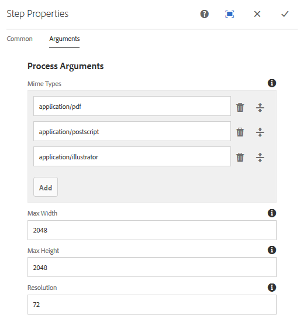

# Gerenciando predefinições de imagens{#managing-image-presets}

As predefinições de imagens permitem que o AEM Assets forneça dinamicamente imagens de tamanhos diferentes, formatos diferentes ou com outras propriedades de imagem geradas dinamicamente. Cada predefinição de imagem representa uma coleção predefinida de comandos de tamanho e formato para a exibição de imagens. Ao criar uma predefinição de imagem, escolha um tamanho para o delivery de imagem. Você também escolhe comandos de formatação para que a aparência da imagem seja otimizada quando a imagem for entregue para exibição.

Os administradores podem criar predefinições para exportar ativos. Os usuários podem escolher uma predefinição ao exportar imagens, o que também reformata as imagens de acordo com as especificações especificadas pelo administrador.

Também é possível criar predefinições de imagens que respondem. Se você aplicar uma predefinição de imagem responsiva aos seus ativos, eles serão alterados dependendo do dispositivo ou do tamanho da tela em que são exibidos. É possível configurar predefinições de imagens para usar CMYK no espaço de cores, além de RGB ou cinza.

Esta seção descreve como criar, modificar e gerenciar predefinições de imagens. É possível aplicar uma predefinição de imagem a uma imagem sempre que ela for pré-visualização. Consulte [Aplicação de predefinições de imagens](/help/assets/dynamic-media/image-presets.md).

>[!NOTE]
>
>A geração de imagens inteligentes funciona com as predefinições de imagens existentes e usa inteligência no último milissegundo do delivery para reduzir ainda mais o tamanho do arquivo de imagem com base na velocidade do navegador ou da conexão de rede. Consulte [Imagens inteligentes](/help/assets/dynamic-media/imaging-faq.md) para obter mais informações.

## Noções básicas sobre predefinições de imagens {#understanding-image-presets}

Como uma macro, uma predefinição de imagem é uma coleção predefinida de comandos de dimensionamento e formatação salvos com um nome. Para entender como as predefinições de imagens funcionam, suponha que seu site exija que cada imagem de produto apareça em tamanhos diferentes, formatos diferentes e taxas de compactação para desktop e delivery móvel.

É possível criar duas predefinições de imagens: uma com 500 x 500 pixels para a versão para desktop e 150 x 150 pixels para a versão para dispositivos móveis. Você cria duas predefinições de imagens, uma chamada `Enlarge` para exibir imagens a 500x500 pixels e outra chamada `Thumbnail` para exibir imagens a 150 x 150 pixels. Para fornecer imagens nos tamanhos `Enlarge` e `Thumbnail`, AEM a definição de Predefinição de ampliação de imagem e Predefinição de miniatura. Em seguida, AEM gera dinamicamente uma imagem no tamanho e nas especificações de formatação de cada predefinição de imagem.

As imagens que são reduzidas em tamanho quando entregues dinamicamente podem perder nitidez e detalhes. Por esse motivo, cada predefinição de imagem contém controles de formatação para otimizar uma imagem quando ela é entregue em um tamanho específico. Esses controles garantem que suas imagens sejam nítidas e claras quando forem entregues ao seu site ou aplicativo.

Os administradores podem criar predefinições de imagens. Para criar uma predefinição de imagem, é possível criar um start do zero ou start de uma existente e salvá-la com um novo nome.

## Gerenciando predefinições de imagens {#managing-image-presets-1}

Você gerencia as predefinições de imagens em AEM tocando ou clicando no logotipo AEM para acessar o console de navegação global e, em seguida, tocando ou clicando no ícone Ferramentas e navegando até **[!UICONTROL Ativos > Predefinições de imagem]**.


>[!NOTE]
>
>Todas as predefinições de imagens criadas também estão disponíveis como representações dinâmicas quando você pré-visualização ou entrega ativos.
>
>Você *não* precisa publicar predefinições de imagens, pois as predefinições de imagens são publicadas automaticamente.
>
>Consulte [Predefinições de Imagem de Publicação.](#publishing-image-presets)

>[!NOTE]
>
>O sistema exibe várias representações quando você seleciona **[!UICONTROL Representações]** na Visualização Detalhe de um ativo. Você pode aumentar ou diminuir o número de predefinições de imagens exibidas. Consulte [Aumentando o número de predefinições de imagens que exibem](#increasing-or-decreasing-the-number-of-image-presets-that-display).

### Formatos de arquivo Adobe Illustrator (AI), Postscript (EPS) e PDF {#adobe-illustrator-ai-postscript-eps-and-pdf-file-formats}

Se você pretende oferecer suporte à ingestão de arquivos AI, EPS e PDF para que você possa gerar representações dinâmicas desses formatos de arquivo, talvez você queira revisar as seguintes informações antes de criar predefinições de imagem.

O formato de arquivo Adobe Illustrator é uma variante do PDF. As principais diferenças, no contexto da AEM Assets, são as seguintes:

* Os documentos Adobe Illustrator consistem em uma única página com várias camadas. Cada camada é extraída como um subativo PNG sob o ativo principal da Illustrator.
* DOCUMENTOS PDF consistem em uma ou mais páginas. Cada página é extraída como um subativo PDF de página única sob o documento PDF de várias páginas principal.

Os subativos são criados pelo componente `Create Sub Asset process` dentro do fluxo de trabalho geral `DAM Update Asset`. Para ver esse componente de processo no fluxo de trabalho, toque em **[!UICONTROL Ferramentas > Fluxo de trabalho > Modelos > Ativo de atualização do DAM > Editar]**.

<!-- See also [Viewing pages of a multi-page file](/help/assets/manage-linked-subassets.md#view-pages-of-a-multi-page-file). -->

Você pode visualização os subativos ou as páginas ao abrir o ativo, tocar no menu Conteúdo e selecionar **[!UICONTROL Subassets]** ou **[!UICONTROL Páginas]**. Os subativos são ativos reais. Ou seja, as páginas de PDF são extraídas pelo componente de fluxo de trabalho `Create Sub Asset`. Eles são armazenados como `page1.pdf`, `page2.pdf` e assim por diante, abaixo do ativo principal. Depois de armazenados, o fluxo de trabalho `DAM Update Asset` processa-os.

Para usar o Dynamic Media para pré-visualização e gerar renderizações dinâmicas para arquivos AI, EPS ou PDF, são necessárias as seguintes etapas de processamento:

1. No fluxo de trabalho `DAM Update Asset`, o componente de processo `Rasterize PDF/AI Image Preview Rendition` rasteriza a primeira página do ativo original - usando a resolução configurada - em uma execução `cqdam.preview.png`.

1. A renderização `cqdam.preview.png` é então otimizada em um PTIFF pelo componente de processo `Dynamic Media Process Image Assets` dentro do fluxo de trabalho.

>[!NOTE]
>
>No fluxo de trabalho do ativo de atualização do DAM, a etapa de **[!UICONTROL Miniaturas do EPS]** gera miniaturas para arquivos EPS.

#### Propriedades de metadados de ativos PDF/AI/EPS {#pdf-ai-eps-asset-metadata-properties}

| **Propriedade Metadata** | **Descrição** |
|---|---|
| dam:Physicalwidthininches | Largura do documento em polegadas. |
| dam:Physicalheightininches | Altura do documento em polegadas. |

Você acessa `Rasterize PDF/AI Image Preview Rendition` as opções do componente de processo por meio do fluxo de trabalho `DAM Update Asset`.

Toque em Adobe Experience Manager no canto superior esquerdo, navegue até **[!UICONTROL Ferramentas > Fluxo de trabalho > Modelos]**. Na página Modelos de fluxo de trabalho, selecione **[!UICONTROL Ativo de atualização do DAM]** e, na barra de ferramentas, toque em **[!UICONTROL Editar]**. Na página de fluxo de trabalho Atualizar ativo DAM, toque no duplo do componente de processo `Rasterize PDF/AI Image Preview Rendition` para abrir a caixa de diálogo Propriedades da etapa.

#### Rasterizar opções de representação de Pré-visualização de imagem PDF/AI {#rasterize-pdf-ai-image-preview-rendition-options}



Argumentos para rasterizar o fluxo de trabalho de PDF ou AI

<table>
 <tbody>
  <tr>
   <td><strong>Argumento do processo</strong></td>
   <td><strong>Configuração padrão</strong></td>
   <td><strong>Descrição</strong></td>
  </tr>
  <tr>
   <td>Tipos de mime</td>
   <td><p>application/pdf</p> <p>application/postscript</p> <p>application/illustrator<br /> </p> </td>
   <td>Lista de tipos MIME de documentos considerados documentos PDF ou Illustrator.<br /> </td>
  </tr>
  <tr>
   <td>Largura máxima</td>
   <td>2048</td>
   <td>Largura máxima da representação de pré-visualização gerada, em pixels.<br /> </td>
  </tr>
  <tr>
   <td>Altura máxima</td>
   <td>2048</td>
   <td>Altura máxima da representação de pré-visualização gerada, em pixels.<br /> </td>
  </tr>
  <tr>
   <td>Resolução</td>
   <td>72</td>
   <td>Resolução para rasterizar a primeira página, em ppi (pixels por polegada).</td>
  </tr>
 </tbody>
</table>

Usando os argumentos de processo padrão, a primeira página de um documento PDF/AI é rasterizada em 72 ppi e a imagem de pré-visualização gerada é dimensionada em 2048 x 2048 pixels. Para uma implantação típica, você pode aumentar a resolução para um mínimo de 150 ppi ou mais. Por exemplo, um documento tamanho carta dos EUA a 300 ppi requer uma largura e altura máximas de 2550 x 3300 pixels, respectivamente.

Largura máxima e Altura máxima limitam a resolução na qual rasterizar. Por exemplo, se os máximos estiverem inalterados e a Resolução for definida como 300 ppi, um documento Carta dos EUA será rasterizado em 186 ppi. Ou seja, o documento é de 1581 x 2046 pixels.

O componente de processo `Rasterize PDF/AI Image Preview Rendition` tem um máximo definido para garantir que não crie imagens excessivamente grandes na memória. Essas imagens grandes podem estender a memória fornecida para a JVM (Java Virtual Machine). É necessário ter cuidado para fornecer à JVM memória suficiente para gerenciar o número configurado de workflows paralelos, cada um com potencial para criar uma imagem no tamanho máximo configurado.

### Formato de arquivo INDD (InDesign) {#indesign-indd-file-format}

Se você pretende suportar a ingestão de arquivos INDD para que possa gerar a representação dinâmica desse formato de arquivo, é recomendável revisar as seguintes informações antes de criar predefinições de imagem.

Para arquivos de InDesign, os subativos são extraídos somente se o servidor Adobe InDesign estiver integrado ao AEM. Os ativos referenciados são vinculados com base em seus metadados. InDesign Server não é necessário para vinculação. No entanto, os ativos referenciados devem estar presentes no AEM antes que os arquivos de InDesign sejam processados para que os links sejam criados entre os arquivos de InDesign e os ativos referenciados.

<!-- See [Integrating AEM Assets with InDesign Server](/help/assets/indesign.md). -->

O componente de processo de Extração de mídia no fluxo de trabalho `DAM Update Asset` executa vários Scripts Extend pré-configurados para processar arquivos de InDesign.


Os caminhos do ExtendScript nos argumentos do componente de processo de Extração de mídia no fluxo de trabalho do Ativo de atualização do DAM.

Os seguintes scripts são usados pela integração do Dynamic Media:

<table>
 <tbody>
  <tr>
   <td><strong>Estender nome do script</strong></td>
   <td><strong>Padrão</strong></td>
   <td><strong>Descrição</strong></td>
  </tr>
  <tr>
   <td>ThumbnailExport.jsx</td>
   <td>Sim</td>
   <td>Gera uma execução de 300 ppi <code>thumbnail.jpg</code> que é otimizada e transformada em uma execução PTIFF pelo componente de processo <code>Dynamic Media Process Image Assets</code>.<br /> </td>
  </tr>
  <tr>
   <td>JPEGPagesExport.jsx</td>
   <td>Sim</td>
   <td>Gera um subativo JPEG de 300 ppi para cada página. O subativo JPEG é um ativo real armazenado no ativo do InDesign. Ele também é otimizado e transformado em um PTIFF pelo fluxo de trabalho <code>DAM Update Asset</code>.<br /> </td>
  </tr>
  <tr>
   <td>PDFPagesExport.jsx</td>
   <td>Não</td>
   <td>Gera um subativo PDF para cada página. O subativo PDF é processado conforme descrito anteriormente. Como o PDF contém apenas uma única página, nenhum subativo é gerado.<br /> </td>
  </tr>
 </tbody>
</table>

### Configuração do tamanho da miniatura da imagem {#configuring-image-thumbnail-size}

Você pode configurar o tamanho das miniaturas configurando essas configurações no fluxo de trabalho **[!UICONTROL DAM Update Asset]**. Há duas etapas no fluxo de trabalho nas quais você pode configurar o tamanho da miniatura dos ativos de imagem. Embora um (**[!UICONTROL Dynamic Media Process Image Assets]**) seja usado para ativos de imagem dinâmica e o outro (**[!UICONTROL Processar miniaturas]**) para geração de miniaturas estáticas ou quando todos os outros processos não geram miniaturas, *ambos* devem ter as mesmas configurações.

Com a etapa **[!UICONTROL Ativos de imagem de processo do Dynamic Media]**, as miniaturas são geradas pelo servidor de imagem e essa configuração é independente da configuração aplicada à etapa **[!UICONTROL Processar miniaturas]**. Gerar miniaturas por meio da etapa **[!UICONTROL Processar miniaturas]** é a maneira mais lenta e intensiva de memória para criar miniaturas.

O dimensionamento de miniaturas é definido no seguinte formato: **[!UICONTROL width:height:center]**, por exemplo *80:80:false*. A largura e a altura determinam o tamanho em pixels da miniatura; o valor central é falso ou verdadeiro e, se definido como verdadeiro, indica que a imagem em miniatura tem exatamente o tamanho fornecido na configuração. Se a imagem redimensionada for menor, ela será centralizada na miniatura.

>[!NOTE]
>
>* O tamanho de miniatura dos arquivos EPS é configurado na etapa **[!UICONTROL Miniaturas do EPS]**, na guia **[!UICONTROL Argumentos]**, em Miniaturas.
   >
   >
* O tamanho da miniatura de vídeos é configurado na etapa de **[!UICONTROL Miniaturas do FFmpeg]**, na guia **[!UICONTROL Processo]**, em **[!UICONTROL Argumentos]**.

>


**Para configurar o tamanho da miniatura da imagem**

1. Toque em **[!UICONTROL Ferramentas > Fluxo de trabalho > Modelos > Ativo de atualização do DAM > Editar]**.
1. Toque na etapa **[!UICONTROL Dynamic Media Process Image Assets]** e toque na guia **[!UICONTROL Miniaturas]**. Altere o tamanho da miniatura, conforme necessário, e toque em **[!UICONTROL OK]**.

   

1. Toque na etapa **[!UICONTROL Processar miniaturas]** e toque na guia **[!UICONTROL Miniaturas]**. Altere o tamanho da miniatura, conforme necessário, e toque em **[!UICONTROL OK]**.

   >[!NOTE]
   >
   >Os valores no argumento de miniaturas da etapa **[!UICONTROL Processar miniaturas]** devem corresponder ao argumento de miniaturas na etapa **[!UICONTROL Ativos de imagem do processo do Dynamic Media]**.

1. Toque em **[!UICONTROL Salvar]** para salvar as alterações no fluxo de trabalho.

### Aumentar ou diminuir o número de predefinições de imagens que exibem {#increasing-or-decreasing-the-number-of-image-presets-that-display}

As predefinições de imagens criadas estão disponíveis como representações dinâmicas quando você pré-visualização ativos. AEM mostra uma variedade de representações dinâmicas ao exibir ativos de **[!UICONTROL Visualização de detalhes > Representações]**. Você pode aumentar ou diminuir o limite de representações exibidas.

**Para aumentar ou diminuir o número de predefinições de imagens exibidas**

1. Navegue até CRXDE Lite ([https://localhost:4502/crx/de](https://localhost:4502/crx/de)).
1. Navegue até o nó de listagem predefinido de imagem em `/libs/dam/gui/coral/content/commons/sidepanels/imagepresetsdetail/imgagepresetslist`

   

1. Na propriedade **[!UICONTROL limit]**, altere o **[!UICONTROL Value]**, que é definido como 15 por padrão, para o número desejado.
1. Navegue até a fonte de dados predefinida de imagem em `/libs/dam/gui/coral/content/commons/sidepanels/imagepresetsdetail/imgagepresetslist/datasource`

   

1. Na propriedade limit, altere o número para o número desejado, por exemplo `{empty requestPathInfo.selectors[1] ? "20" : requestPathInfo.selectors[1]}`
1. Toque em **[!UICONTROL Salvar tudo]**.

### Criando uma predefinição de imagem {#creating-image-presets}

Criar uma predefinição de imagem permite aplicar essas configurações a qualquer imagem ao visualizar ou publicar.

>[!NOTE]
>
>Se estiver usando o Internet Explorer 9, a criação de uma predefinição não será exibida na lista predefinida imediatamente após salvar. Para contornar esse problema, desative o cache do IE9.

Se você pretende oferecer suporte à inclusão de arquivos AI, PDF e EPS para que possa gerar a representação dinâmica desses formatos de arquivo, é recomendável revisar as seguintes informações antes de criar predefinições de imagem.
Consulte [Adobe Illustrator (AI), Postscript (EPS) e formatos de arquivo PDF](#adobe-illustrator-ai-postscript-eps-and-pdf-file-formats).

Se você pretende suportar a ingestão de arquivos INDD para que possa gerar a representação dinâmica desse formato de arquivo, é recomendável revisar as seguintes informações antes de criar predefinições de imagem.
Consulte [formato de arquivo de InDesign (INDD)](#indesign-indd-file-format).

**Para criar uma predefinição de imagem**

1. Em AEM, toque no logotipo AEM para acessar o console de navegação global e, em seguida, toque em **[!UICONTROL Ferramentas > Ativos > Predefinições de imagem]**.
1. Clique em **[!UICONTROL Criar]**. A janela **[!UICONTROL Editar predefinição de imagem]** é aberta.

   

   >[!NOTE]
   >
   >Para tornar essa predefinição de imagem responsiva, apague os valores nos campos **[!UICONTROL largura]** e **[!UICONTROL altura]** e deixe-os em branco.

1. Insira valores nas guias **[!UICONTROL Básico]** e **[!UICONTROL Avançado]**, conforme apropriado, incluindo um nome. As opções são descritas em [Opções de predefinição de imagem](#image-preset-options). As predefinições aparecem no painel à esquerda e podem ser usadas junto com outros ativos.

   

1. Clique em **[!UICONTROL Salvar]**.

### Criando uma predefinição de imagem responsiva {#creating-a-responsive-image-preset}

Para criar uma predefinição de imagem responsiva, execute as etapas em [Criando predefinições de imagem](#creating-image-presets). Ao digitar a altura e a largura na janela **[!UICONTROL Editar predefinição de imagem]**, apague os valores e deixe-os em branco.

Deixá-los em branco informa AEM que essa predefinição de imagem é responsiva. Você pode ajustar os outros valores conforme apropriado.

>[!NOTE]
>
>O ativo deve ser publicado para ver os botões **[!UICONTROL URL]** e **[!UICONTROL RESS]** ao aplicar uma predefinição de imagem a um ativo.
>
>
>
>Observe que as predefinições de imagens e os ativos de imagem são publicados automaticamente.

### Opções de predefinição de imagem {#image-preset-options}

Ao criar ou editar predefinições de imagens, você tem as opções descritas nesta seção. Além disso, o Adobe recomenda essas opções de &quot;práticas recomendadas&quot; para o start:

* **[!UICONTROL Formatar]** (guia **[!UICONTROL Básico]**) - Selecione **[!UICONTROL JPEG]** ou outro formato que atenda aos requisitos. Todos os navegadores da Web são compatíveis com o formato de imagem JPEG; ele oferece um bom equilíbrio entre arquivos pequenos e qualidade de imagem. No entanto, as imagens no formato JPEG usam um esquema de compactação com perdas que pode apresentar artefatos de imagem indesejados se a configuração de compactação for muito baixa. Por esse motivo, a Adobe recomenda definir a qualidade de compactação como 75. Essa configuração oferece um bom equilíbrio entre a qualidade da imagem e o tamanho pequeno de arquivo.

* **[!UICONTROL Ativar nitidez simples]** - Não selecione **[!UICONTROL Ativar nitidez simples]** (este filtro de nitidez oferece menos controle do que as configurações Tirar nitidez da máscara).

* **[!UICONTROL Nitidez: Modo]**  de reamostragem - Selecione  **[!UICONTROL Bi-Cubic]**.

#### Opções de guia básicas {#basic-tab-options}

<table>
 <tbody>
  <tr>
   <td><strong>Texto</strong></td>
   <td><strong>Descrição</strong></td>
  </tr>
  <tr>
   <td><strong>Nome</strong></td>
   <td>Digite um nome descritivo sem espaços em branco. Inclua a especificação do tamanho da imagem no nome para ajudar os usuários a identificarem esta predefinição de imagem.</td>
  </tr>
  <tr>
   <td><strong>Largura e altura</strong></td>
   <td>Insira em pixels o tamanho no qual a imagem é entregue. A largura e a altura devem ser maiores que 0 pixels. Se qualquer um dos valores for 0, nenhuma predefinição será criada. Se ambos os valores estiverem em branco, uma predefinição de imagem responsiva será criada.</td>
  </tr>
  <tr>
   <td><strong>Formato</strong></td>
   <td><p>Escolha um formato no menu.</p> <p>Escolher <strong>JPEG</strong> oferta as seguintes opções adicionais:</p>
    <ul>
     <li><strong>Qualidade</strong>  - Controla o nível de compactação JPEG. Essa configuração afeta o tamanho do arquivo e a qualidade da imagem. A escala de qualidade JPEG é 1-100. A escala é visível quando você arrasta o controle deslizante.</li>
     <li><strong>Ativar a Redução</strong>  da Crominância JPG - Como o olho é menos sensível às informações de cores de alta frequência do que a luminância de alta frequência, as imagens JPEG dividem as informações da imagem em luminância e componentes de cor. Quando uma imagem JPEG é compactada, o componente de luminância é deixado em resolução completa, enquanto os componentes de cor têm resolução reduzida, fazendo a média em grupos de pixels. A diminuição da resolução reduz o volume de dados em metade ou um terço, com quase nenhum impacto na qualidade percebida. A redução da resolução não se aplica a imagens em tons de cinza. Essa técnica reduz a quantidade de compactação útil para imagens com alto contraste (por exemplo, imagens com texto sobreposto).</li>
    </ul>
    <div>
      Escolhendo
     <strong>GIF</strong> ou
     <strong>O GIF com alfa</strong> fornece estes
     <strong>Opções de quantificação de cores GIF</strong>:
    </div>
    <ul>
     <li><strong>Tipo  </strong>- Selecione  <strong>Adaptável</strong>  (o padrão),  <strong>Web</strong> ou  <strong>Macintosh</strong>. Se você selecionar <strong>GIF com Alpha</strong>, a opção Macintosh não estará disponível.</li>
     <li><strong>Pontilhamento</strong>  - Selecione  <strong></strong> Diferenciar ou  <strong>Desligar</strong>.</li>
     <li><strong>Número de cores  </strong>- insira um número entre 2 e 256.</li>
     <li><strong>Lista</strong>  colorida: insira uma lista separada por vírgulas. Por exemplo, para branco, cinza e preto, digite 000000,888888,ffff.</li>
    </ul>
    <div>
      Escolhendo
     <strong>PDF</strong>,
     <strong>TIFF</strong>, ou
     <strong>TIFF com alfa</strong> fornece esta opção adicional:
    </div>
    <ul>
     <li><strong>Compactação</strong>  - Selecione um algoritmo de compactação. As opções de algoritmo para PDF são <strong>None</strong>, <strong>Zip</strong> e <strong>Jpeg</strong>; para TIFF são <strong>None</strong>, <strong>LZW</strong>, <strong>Jpeg</strong> e <strong>Zip</strong>; e para TIFF com Alpha são <strong>None</strong>, <strong>LZW</strong> e <strong>Zip</strong>.</li>
    </ul> <p>Escolher <strong>PNG</strong>, <strong>PNG com Alpha,</strong> ou <strong>EPS</strong> não fornece opções adicionais.</p> </td>
  </tr>
  <tr>
   <td><strong>Nitidez</strong></td>
   <td>Selecione a opção <strong>Ativar a Nitidez Simples</strong> para aplicar um filtro básico de nitidez à imagem depois que toda a escala ocorrer. A nitidez pode ajudar a compensar o desfoque que pode resultar na exibição de uma imagem em um tamanho diferente. </td>
  </tr>
 </tbody>
</table>

#### Opções avançadas de guia {#advanced-tab-options}

<table>
 <tbody>
  <tr>
   <td><strong>Texto</strong></td>
   <td><strong>Descrição</strong></td>
  </tr>
  <tr>
   <td><strong>Espaço de cor</strong></td>
   <td>Selecione <strong>RGB, CMYK,</strong> ou <strong>Escala de cinza</strong> para o espaço de cor.</td>
  </tr>
  <tr>
   <td><strong>Perfil de cor</strong></td>
   <td>Selecione o perfil de espaço de cor de saída para o qual o ativo deve ser convertido se for diferente do perfil em funcionamento.</td>
  </tr>
  <tr>
   <td><strong>Renderizar recuo</strong></td>
   <td>Você pode substituir o propósito de renderização padrão. Os propósitos de renderização determinam o que acontece com as cores que não podem ser reproduzidas no perfil de cores do público alvo (fora do gamut). O propósito de renderização será ignorado se não for compatível com o perfil ICC.
    <ul>
     <li>Selecione <strong>Perceptual</strong> para compactar a gama total de um espaço de cor para outro espaço de cor quando uma ou mais cores na imagem original estiverem fora da gama do espaço de cor de destino.</li>
     <li>Selecione <strong>Colorimétrico Relativo</strong> quando uma cor no espaço de cores atual estiver fora do gamut no espaço de cores do público alvo e você quiser mapeá-la para a cor mais próxima possível dentro do gamut do espaço de cores do público alvo sem afetar outras cores. </li>
     <li>Selecione <strong>Saturação</strong> para reproduzir a saturação de cor da imagem original ao converter no espaço de cor do público alvo. </li>
     <li>Selecione <strong>Colorimétrico absoluto</strong> para corresponder as cores exatamente sem nenhum ajuste do ponto branco ou do ponto preto que alteraria o brilho da imagem.</li>
    </ul> </td>
  </tr>
  <tr>
   <td><strong>Compensação de pontos pretos</strong></td>
   <td>Selecione essa opção se o perfil de saída suportar esse recurso. A compensação do ponto de interrupção será ignorada se não for compatível com o perfil ICC especificado.</td>
  </tr>
  <tr>
   <td><strong>Pontilhamento</strong></td>
   <td>Selecione essa opção para possivelmente evitar ou reduzir artefatos de faixas de cores. </td>
  </tr>
  <tr>
   <td><strong>Tipo de nitidez</strong></td>
   <td><p>Selecione <strong>Nenhum</strong>, <strong>Nitidez</strong> ou <strong>Máscara de Nitidez</strong>. </p>
    <ul>
     <li>Selecione <strong>Nenhum</strong> para desativar a nitidez.</li>
     <li>Selecione <strong>Nitidez </strong>para aplicar um filtro básico de nitidez à imagem depois que toda a escala ocorrer. A nitidez pode ajudar a compensar o desfoque que pode resultar na exibição de uma imagem em um tamanho diferente. </li>
     <li>Selecione<strong> Desmarcar máscara</strong> para ajustar um efeito de filtro de nitidez na imagem final com resolução reduzida. É possível controlar a intensidade do efeito, o raio do efeito (medido em pixels) e um limite de contraste que será ignorado. Esse efeito usa as mesmas opções do filtro "Tirar nitidez da máscara" do Photoshop.</li>
    </ul> <p>Em <strong>Máscara de nitidez</strong>, você tem as seguintes opções:</p>
    <ul>
     <li><strong>Quantia</strong>  - Controla a quantidade de contraste aplicada aos pixels da borda. O valor padrão do número real é 1,0. Para imagens de alta resolução, é possível aumentá-las para até 5.0. Pense em Amount como uma medida da intensidade do filtro.</li>
     <li><strong>Raio</strong>  - Determina o número de pixels em torno dos pixels da borda que afetam a nitidez. Para imagens de alta resolução, digite um número real de 1 a 2. Um valor baixo torna nítido apenas os pixels da borda; um valor alto aumenta a nitidez de uma faixa maior de pixels. O valor correto depende do tamanho da imagem.</li>
     <li><strong>Limiar</strong>  - Determina o intervalo de contraste a ser ignorado quando o filtro de máscara de nitidez é aplicado. Em outras palavras, essa opção determina o quão diferentes os pixels com nitidez devem ser da área ao redor antes que sejam considerados pixels de borda e sejam apontados. Para evitar a introdução de ruídos, experimente valores inteiros entre 2 e 20. </li>
     <li><strong>Aplicar a</strong>  - Determina se a nitidez não se aplica a cada cor ou brilho.</li>
    </ul>
    <div>
      A nitidez está descrita em
     <a href="https://docs.adobe.com/content/help/en/dynamic-media-classic/using/assets/sharpening_images.pdf">Apagar imagens</a>.
    </div> </td>
  </tr>
  <tr>
   <td><strong>Modo de nova amostra</strong></td>
   <td>Selecione uma opção <strong>Modo de reamostragem</strong>. Essas opções tornam a imagem nítida quando tem resolução reduzida:
    <ul>
     <li><strong>Bi-Linear</strong>  - o método de reamostragem mais rápido. Alguns artefatos de aliasing são perceptíveis.</li>
     <li><strong>Bi-Cubic</strong>  - aumenta o uso da CPU, mas produz imagens mais nítidas com artefatos de aliasing menos visíveis.</li>
     <li><strong>Sharp2</strong> - Pode produzir resultados ligeiramente mais nítidos que o Bi-Cubic, mas a um custo de CPU ainda maior.</li>
     <li><strong>Bi-Sharp</strong>  - Seleciona o resamplador padrão Photoshop para reduzir o tamanho da imagem, que é chamado de  <strong>Sharperin </strong> bicúbicono Adobe Photoshop.</li>
     <li><strong>Cada </strong> cor e  <strong>brilho</strong>  - cada método pode ser baseado na cor ou no brilho. Por padrão, <strong>Cada Cor</strong> está selecionado.</li>
    </ul> </td>
  </tr>
  <tr>
   <td><strong>Resolução de impressão</strong></td>
   <td>Selecione uma resolução para imprimir esta imagem; 72 pixels é o padrão.</td>
  </tr>
  <tr>
   <td><strong>Modificador de imagem</strong></td>
   <td><p>Além das configurações comuns de imagem disponíveis na interface do usuário, a Dynamic Media oferece suporte a inúmeras modificações avançadas de imagem que você pode especificar no campo <strong>Modificadores de imagem</strong>. Esses parâmetros são definidos na <a href="https://experienceleague.adobe.com/docs/dynamic-media-developer-resources/image-serving-api/image-serving-api/http-protocol-reference/syntax-and-features/image-serving-http/c-command-overview.html">referência de comando do Image Server Protocol</a>.</p> <p>Importante: A seguinte funcionalidade listada na API não é suportada:</p>
    <ul>
     <li>Comandos básicos de formatação e renderização de texto: <code>text= textAngle= textAttr= textFlowPath= textFlowXPath= textPath=</code> e <code>textPs=</code></li>
     <li>Comandos de localização: <code>locale=</code> e <code>req=xlate</code></li>
     <li><code>req=set</code> não está disponível para uso geral.</li>
     <li><code>req=mbrset</code></li>
     <li><code>req=saveToFile</code></li>
     <li><code>req=targets</code></li>
     <li><code>template=</code></li>
     <li>Serviços Dynamic Media não principais: SVG, renderização de imagem e Web para impressão</li>
    </ul> </td>
  </tr>
 </tbody>
</table>

### Definindo opções de predefinição de imagem com modificadores de imagem {#defining-image-preset-options-with-image-modifiers}

Além das opções disponíveis nas guias Básico e Avançado, é possível definir modificadores de imagem para fornecer mais opções ao definir predefinições de imagem. A renderização de imagem depende da API de renderização de imagem da Dynamic Media e é definida em detalhes na [Referência do protocolo HTTP](https://experienceleague.adobe.com/docs/dynamic-media-developer-resources/image-serving-api/image-rendering-api/http-protocol-reference/c-ir-introduction.html#image-rendering-api).

Estes são alguns exemplos básicos do que você pode fazer com modificadores de imagem.

>[!NOTE]
>
>Alguns modificadores de imagem [não podem ser usados em AEM](#advanced-tab-options).

* [op_invert](https://experienceleague.adobe.com/docs/dynamic-media-developer-resources/image-serving-api/image-serving-api/http-protocol-reference/command-reference/r-op-invert.html)  - Inverte cada componente de cor para obter um efeito de imagem negativo.

   ```xml
   &op_invert=1
   ```

   

* [op_blur](https://experienceleague.adobe.com/docs/dynamic-media-developer-resources/image-serving-api/image-serving-api/http-protocol-reference/command-reference/r-op-blur.html)  - Aplica um filtro de desfoque à imagem.

   ```xml
   &op_blur=7
   ```

   

* Comandos combinados - op_blur e op-invert

   ```xml
   &op_invert=1&op_blur=7
   ```

   

* [op_brightness](https://experienceleague.adobe.com/docs/dynamic-media-developer-resources/image-serving-api/image-serving-api/http-protocol-reference/command-reference/r-op-brightness.html)  - Diminui ou aumenta o brilho.

   ```xml
   &op_brightness=58
   ```

   

* [opac](https://experienceleague.adobe.com/docs/dynamic-media-developer-resources/image-serving-api/image-serving-api/http-protocol-reference/command-reference/r-opac.html)  - Ajusta a opacidade da imagem. Permite diminuir a opacidade do primeiro plano.

   ```xml
   opac=29
   ```

   

### Editar predefinições de imagens {#modifying-image-presets}

1. Em AEM, toque no logotipo AEM para acessar o console de navegação global e, em seguida, toque em **[!UICONTROL Ferramentas > Ativos > Predefinições de imagem]**.

   

1. Selecione uma predefinição e clique em **[!UICONTROL Editar]**. A janela **[!UICONTROL Editar predefinição de imagem]** é aberta.
1. Faça alterações e clique em **[!UICONTROL Salvar]** para salvar as alterações ou em **[!UICONTROL Cancelar]** para cancelar as alterações.

### Publicar predefinições de imagens {#publishing-image-presets}

As predefinições de imagens são publicadas automaticamente para você.

### Excluindo predefinições de imagens {#deleting-image-presets}

1. Em AEM, toque no logotipo AEM para acessar o console de navegação global e toque ou clique no ícone Ferramentas e navegue até **[!UICONTROL Ativos > Predefinições de imagem]**.
1. Selecione uma predefinição e clique em **[!UICONTROL Excluir]**. A Dynamic Media confirma que você deseja excluí-lo. Toque em **[!UICONTROL Excluir]** para excluir ou toque em **[!UICONTROL Cancelar]** para suspender.
