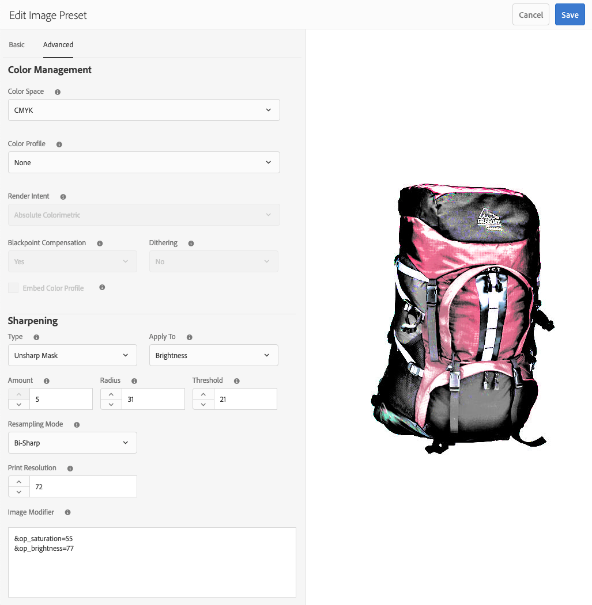

# Gerenciar predefinições da imagem{#managing-image-presets}

As predefinições de imagens permitem que os ativos Adobe Experience Manager forneçam dinamicamente imagens de diferentes tamanhos, formatos diferentes ou com outras propriedades de imagem geradas dinamicamente. Cada predefinição de imagem representa uma coleção predefinida de comandos de tamanho e formato para a exibição de imagens. Ao criar uma Predefinição de imagem, você escolhe um tamanho para a entrega da imagem. Você também escolhe comandos de formatação para que a aparência da imagem seja otimizada quando a imagem for entregue para exibição.

Os administradores podem criar predefinições para exportar ativos. Os usuários podem escolher uma predefinição quando exportam imagens, o que também reformata as imagens para as especificações especificadas pelo administrador.

Também é possível criar predefinições de imagens responsivas. Se você aplicar uma predefinição de imagem responsiva a seus ativos, eles serão alterados dependendo do dispositivo ou do tamanho da tela em que são visualizados. Você pode configurar predefinições de imagens para usar CMYK no espaço de cores, além de RGB ou Cinza.

Esta seção descreve como criar, modificar e gerenciar predefinições de imagens em geral. Você pode aplicar uma predefinição de imagem a uma imagem sempre que visualizá-la. Consulte [Aplicar predefinições de imagem](/help/assets/dynamic-media/image-presets.md).

>[!NOTE]
>
>A geração de imagens inteligentes funciona com as predefinições de imagens existentes e usa inteligência nos últimos milissegundos do delivery para reduzir ainda mais o tamanho do arquivo de imagem com base na velocidade do navegador ou da conexão de rede. Consulte [Imagem inteligente](/help/assets/dynamic-media/imaging-faq.md) para obter mais informações.

## Saiba mais sobre predefinições de imagens {#understanding-image-presets}

Como uma macro, uma Predefinição de imagem é uma coleção predefinida de comandos de dimensionamento e formatação salvos em um nome. Para entender como as Predefinições de imagem funcionam, suponha que o site exija que cada imagem do produto apareça em tamanhos diferentes, formatos diferentes e taxas de compactação para entrega de desktop e dispositivo móvel.

Você pode criar duas predefinições de imagem: um com 500 x 500 pixels para a versão desktop e 150 x 150 pixels para a versão móvel. Você cria duas Predefinições de imagem, uma chamada `Enlarge` para exibir imagens a 500x500 pixels e outra chamada `Thumbnail` para exibir imagens a 150 x 150 pixels. Para entregar imagens no tamanho `Enlarge` e `Thumbnail`, o Experience Manager encontra a definição da Predefinição de ampliação de imagem e da Predefinição de imagem em miniatura. Em seguida, o Experience Manager gera dinamicamente uma imagem no tamanho e nas especificações de formatação de cada Predefinição de imagem.

As imagens que são reduzidas quando entregues dinamicamente podem perder nitidez e detalhes. Por esse motivo, cada Predefinição de imagem contém controles de formatação para otimizar uma imagem quando ela é entregue em um tamanho específico. Esses controles garantem que suas imagens sejam nítidas e claras quando forem entregues ao seu site ou aplicativo.

Os administradores podem criar Predefinições de imagem. Para criar uma predefinição de imagem, você pode começar do zero ou começar com uma existente e salvá-la com um novo nome.

## Gerenciar predefinições da imagem {#managing-image-presets-1}

Gerencie as predefinições de imagens no Experience Manager selecionando o logotipo do Experience Manager para acessar o console de navegação global e, em seguida, selecionando o ícone Ferramentas e navegando até **[!UICONTROL Assets]** > **[!UICONTROL Predefinições de imagem]**.


>[!NOTE]
>
>Todas as predefinições de imagens criadas também estão disponíveis como representações dinâmicas ao visualizar ou entregar ativos.
>
>Você *não* precisa publicar predefinições de imagens, pois as predefinições de imagens são publicadas automaticamente.
>
>Consulte [Publicar predefinições de imagem](#publishing-image-presets).

>[!NOTE]
>
>O sistema mostra várias representações ao selecionar **[!UICONTROL Representações]** na Exibição de Detalhes de um ativo. Você pode aumentar ou diminuir o número de predefinições de imagens exibidas. Consulte [Aumente o número de predefinições de imagens exibidas](#increasing-or-decreasing-the-number-of-image-presets-that-display).

### Adobe Illustrator (AI), PostScript® (EPS) e formatos de arquivo PDF {#adobe-illustrator-ai-postscript-eps-and-pdf-file-formats}

Se você pretende suportar a assimilação de arquivos AI, EPS e PDF para gerar representações dinâmicas desses formatos de arquivo, analise as seguintes informações antes de criar predefinições de imagem.

O formato de arquivo Adobe Illustrator é uma variante do PDF. As principais diferenças, no contexto de Ativos Experience Manager, são as seguintes:

* Os documentos do Adobe Illustrator consistem em uma única página com várias camadas. Cada camada é extraída como um subativo PNG no ativo principal do Illustrator.
* Os documentos PDF consistem em uma ou mais páginas. Cada página é extraída como um subativo PDF de página única sob o documento PDF principal de várias páginas.

Os subativos são criados pelo componente `Create Sub Asset process` dentro do workflow geral `DAM Update Asset`. Para ver esse componente de processo no workflow, navegue até **[!UICONTROL Ferramentas]** > **[!UICONTROL Fluxo de trabalho]** > **[!UICONTROL Modelos]** > **[!UICONTROL Ativo de atualização DAM]** > **[!UICONTROL Editar]**.

<!-- See also [Viewing pages of a multi-page file](/help/assets/manage-linked-subassets.md#view-pages-of-a-multi-page-file). -->

É possível exibir os subativos ou as páginas ao abrir o ativo, selecionar o menu Conteúdo e selecionar **[!UICONTROL Subativos]** ou **[!UICONTROL Páginas]**. Os subativos são ativos reais. Ou seja, as páginas em PDF são extraídas pelo componente `Create Sub Asset` do fluxo de trabalho. Eles são armazenados como `page1.pdf`, `page2.pdf` e assim por diante, abaixo do ativo principal. Depois que são armazenados, o workflow `DAM Update Asset` os processa.

Para usar o Dynamic Media para visualizar e gerar representações dinâmicas para arquivos AI, EPS ou PDF, as seguintes etapas de processamento são necessárias:

1. No workflow `DAM Update Asset`, o componente de processo `Rasterize PDF/AI Image Preview Rendition` rasteriza a primeira página do ativo original - usando a resolução configurada - em uma representação `cqdam.preview.png`.

1. A representação `cqdam.preview.png` é então otimizada em um PTIFF pelo componente de processo `Dynamic Media Process Image Assets` no fluxo de trabalho.

>[!NOTE]
>
>No fluxo de trabalho do ativo de atualização do DAM, a etapa de **[!UICONTROL Miniaturas do EPS]** gera miniaturas para arquivos EPS.

#### Propriedades de metadados de ativos de PDF/AI/EPS {#pdf-ai-eps-asset-metadata-properties}

| **Propriedade de metadados** | **Descrição** |
|---|---|
| dam:Physicalwidthininches | Largura do documento em polegadas. |
| dam:Physicalheightininches | Altura do documento em polegadas. |

Você acessa `Rasterize PDF/AI Image Preview Rendition` as opções do componente de processo por meio do workflow `DAM Update Asset`.

Selecione no Adobe Experience Manager, no canto superior esquerdo, navegue até **[!UICONTROL Ferramentas]** > **[!UICONTROL Fluxo de trabalho]** > **[!UICONTROL Modelos]**. Na página Modelos de fluxo de trabalho , selecione **[!UICONTROL Ativo de atualização do DAM]** e, na barra de ferramentas, selecione **[!UICONTROL Editar]**. Na página do fluxo de trabalho Atualizar ativo do DAM , toque duas vezes no componente do processo `Rasterize PDF/AI Image Preview Rendition` para abrir a caixa de diálogo Propriedades da etapa .

#### Rasterizar opções de representação de visualização de imagem em PDF/AI {#rasterize-pdf-ai-image-preview-rendition-options}


Argumentos para rasterizar o fluxo de trabalho de PDF ou AI

| Argumento do processo | Configuração padrão | Descrição |
|---|---|---|
| Tipos de mime | application/pdf<br>application/postscript<br>application/illustrator | Lista de tipos MIME de documentos considerados documentos PDF ou Illustrator. |
| Largura máxima | 2048 | Largura máxima da representação de visualização gerada, em pixels. |
| Altura máxima | 2048 | Altura máxima da representação de visualização gerada, em pixels. |
| Resolução | 72 | Resolução para rasterizar a primeira página, em ppi (pixels por polegada). |

Usando os argumentos padrão do processo, a primeira página de um documento PDF/AI é rasterizada em 72 ppi e a imagem de visualização gerada é dimensionada em 2048 x 2048 pixels. Para uma implantação típica, é possível aumentar a resolução para um mínimo de 150 ppi ou mais. Por exemplo, um documento de tamanho de letra dos EUA a 300 ppi requer uma largura e altura máximas de 2550 x 3300 pixels, respectivamente.

Largura máxima e Altura máxima limitam a resolução na qual rasterizar. Por exemplo, se os máximos estiverem inalterados e a Resolução for definida como 300 ppi, um documento Carta dos EUA será rasterizado em 186 ppi. Ou seja, o documento tem 1581 x 2046 pixels.

O componente de processo `Rasterize PDF/AI Image Preview Rendition` tem um máximo definido para garantir que não crie imagens excessivamente grandes na memória. Imagens tão grandes podem estender a memória fornecida para a JVM (Java™ Virtual Machine). Deve-se tomar cuidado para fornecer à JVM memória suficiente para gerenciar o número configurado de fluxos de trabalho paralelos, cada um com o potencial de criar uma imagem no tamanho máximo configurado.

### Formato de arquivo INDD (InDesign) {#indesign-indd-file-format}

Se você pretende suportar a assimilação de arquivos INDD para gerar a representação dinâmica desse formato de arquivo, analise as seguintes informações antes de criar predefinições de imagem.

Para arquivos InDesign, os sub-ativos são extraídos somente se o Adobe InDesign Server estiver integrado ao Experience Manager. Os ativos referenciados são vinculados com base em seus metadados. O InDesign Server não é necessário para vinculação. No entanto, os ativos referenciados devem estar presentes no Experience Manager antes que os arquivos do InDesign sejam processados para que os links sejam criados entre os arquivos do InDesign e os ativos referenciados.

<!-- See [Integrate Experience Manager Assets with InDesign Server](/help/assets/indesign.md). -->

O componente do processo de Extração de mídia no workflow `DAM Update Asset` executa vários scripts estendidos pré-configurados para processar arquivos de InDesign.


Os caminhos do ExtendScript nos argumentos do componente do processo de Extração de mídia no fluxo de trabalho do Ativo de atualização DAM .

Os seguintes scripts são usados pela integração do Dynamic Media:


| Nome do ExtendScript | Padrão | Descrição |
|---|---|---|
| ThumbnailExport.jsx | Sim | Gera uma representação de 300 PPI `thumbnail.jpg` que é otimizada e transformada em uma representação PTIFF por `Dynamic Media Process Image Assets` componente do processo. |
| JPEGPagesExport.jsx | Sim | Gera um subativo 300 PPI JPEG para cada página. O subativo JPEG é um ativo real armazenado no ativo do InDesign. Ele também é otimizado e transformado em PTIFF pelo workflow `DAM Update Asset` . |
| PDFPagesExport.jsx | Não | Gera um subativo PDF para cada página. O subativo PDF é processado conforme descrito anteriormente. Como o PDF contém apenas uma página, nenhum subativo é gerado. |

### Configurar o tamanho da miniatura da imagem {#configuring-image-thumbnail-size}

Você pode configurar o tamanho das miniaturas definindo essas configurações no fluxo de trabalho **[!UICONTROL Ativo de atualização do DAM]**. Há duas etapas no fluxo de trabalho, onde você pode configurar o tamanho da miniatura dos ativos de imagem. Um (**[!UICONTROL Ativos de imagem de processo do Dynamic Media]**) é usado para ativos de imagem dinâmicos. O outro (**[!UICONTROL Process Thumbnails]**) é usado para geração de miniaturas estáticas ou quando todos os outros processos não conseguem gerar miniaturas. Independentemente disso, *ambos* devem ter as mesmas configurações.

Com a etapa **[!UICONTROL Ativos de imagem de processo do Dynamic Media]**, as miniaturas são geradas pelo servidor de imagem e essa configuração é independente da configuração aplicada à etapa **[!UICONTROL Processar miniaturas]**. Gerar miniaturas por meio da etapa **[!UICONTROL Processar miniaturas]** é a maneira mais lenta e intensiva de memória para criar miniaturas.

O dimensionamento de miniaturas é definido no seguinte formato: **[!UICONTROL width:height:center]**, por exemplo `80:80:false`. A largura e a altura determinam o tamanho em pixels da miniatura. O valor central é falso ou verdadeiro. Se definido como true, indica que a imagem em miniatura tem exatamente o tamanho fornecido na configuração. Se a imagem redimensionada for menor, ela será centralizada na miniatura.

>[!NOTE]
>
>* Os tamanhos de miniatura dos arquivos EPS são configurados na etapa **[!UICONTROL Miniaturas EPS]**, na guia **[!UICONTROL Argumentos]** em Miniaturas.
   >
   >
* Os tamanhos de miniatura de vídeos são configurados na etapa **[!UICONTROL Miniaturas do FFmpeg]**, na guia **[!UICONTROL Process]** em **[!UICONTROL Argumentos]**.

>


**Para configurar o tamanho da miniatura da imagem:**

1. Navegue até **[!UICONTROL Ferramentas]** > **[!UICONTROL Fluxo de trabalho]** > **[!UICONTROL Modelos]** > **[!UICONTROL Ativo de atualização do DAM]** > **[!UICONTROL Editar]**.
1. Selecione a etapa **[!UICONTROL Ativos de imagem de processo do Dynamic Media]** e selecione a guia **[!UICONTROL Miniaturas]**. Altere o tamanho da miniatura, conforme necessário, e selecione **[!UICONTROL OK]**.

   

1. Selecione a etapa **[!UICONTROL Processar miniaturas]** e selecione a guia **[!UICONTROL Miniaturas]**. Altere o tamanho da miniatura, conforme necessário, e selecione **[!UICONTROL OK]**.

   >[!NOTE]
   >
   >Os valores no argumento de miniaturas da etapa **[!UICONTROL Processar miniaturas]** devem corresponder ao argumento de miniaturas na etapa **[!UICONTROL Ativos de imagem do processo do Dynamic Media]**.

1. Selecione **[!UICONTROL Save]** para guardar as alterações ao fluxo de trabalho.

### Aumente ou diminua o número de predefinições de imagens exibidas {#increasing-or-decreasing-the-number-of-image-presets-that-display}

As predefinições de imagens criadas estão disponíveis como representações dinâmicas ao visualizar ativos. O Experience Manager mostra várias representações dinâmicas ao visualizar um ativo de **[!UICONTROL Exibição de detalhes > Representações]**. Você pode aumentar ou diminuir o limite de representações exibidas.

**Para aumentar ou diminuir o número de predefinições de imagens exibidas:**

1. Navegue até CRXDE Lite ([https://localhost:4502/crx/de](https://localhost:4502/crx/de)).
1. Navegue até o nó da listagem de predefinições de imagens em `/libs/dam/gui/coral/content/commons/sidepanels/imagepresetsdetail/imgagepresetslist`

   

1. Na propriedade **[!UICONTROL limit]**, altere o **[!UICONTROL Value]**, que é definido como 15 por padrão, para o número desejado.
1. Navegue até a fonte de dados da predefinição de imagem em `/libs/dam/gui/coral/content/commons/sidepanels/imagepresetsdetail/imgagepresetslist/datasource`

   

1. Na propriedade limit , altere o número para o número desejado, por exemplo `{empty requestPathInfo.selectors[1] ? "20" : requestPathInfo.selectors[1]}`
1. Selecione **[!UICONTROL Salvar tudo]**.

### Criar predefinições de imagens {#creating-image-presets}

Crie predefinições de imagens para aplicar as configurações de forma consistente nas imagens ao visualizar ou publicar.

>[!NOTE]
>
>Se estiver usando o Internet Explorer 9, a criação de uma predefinição não será exibida na lista predefinida imediatamente após ser salva. Para contornar esse problema, desative o cache do IE9.

Se você pretende suportar a assimilação de arquivos AI, PDF e EPS para gerar a representação dinâmica desses formatos de arquivo, analise as seguintes informações antes de criar predefinições de imagem.

Consulte [Adobe Illustrator (AI), PostScript® (EPS) e formatos de arquivo PDF](#adobe-illustrator-ai-postscript-eps-and-pdf-file-formats).

Se você pretende suportar a assimilação de arquivos INDD para gerar a representação dinâmica desse formato de arquivo, analise as seguintes informações antes de criar predefinições de imagem.

Consulte [InDesign (INDD) file format](#indesign-indd-file-format).

**Para criar predefinições de imagens:**

1. No Experience Manager, selecione o logotipo do Experience Manager para acessar o console de navegação global e, em seguida, vá para **[!UICONTROL Ferramentas]** > **[!UICONTROL Ativos]** > **[!UICONTROL Predefinições de imagem]**.
1. Selecione **[!UICONTROL Criar]**.

   

   >[!NOTE]
   >
   >Para tornar essa predefinição de imagem responsiva, apague os valores nos campos **[!UICONTROL largura]** e **[!UICONTROL altura]** e deixe-os em branco.

1. Na janela **[!UICONTROL Edit Image Preset]**, digite valores nas guias **[!UICONTROL Basic]** e **[!UICONTROL Advanced]**, conforme apropriado, incluindo um nome. As opções são descritas em [Opções de predefinição de imagem](#image-preset-options). As predefinições aparecem no painel à esquerda e podem ser usadas junto com outros ativos.

   

1. Selecione **[!UICONTROL Salvar]**.

### Criação de uma predefinição de imagem responsiva {#creating-a-responsive-image-preset}

Para criar uma predefinição de imagem responsiva, execute as etapas em [Criar predefinições de imagem](#creating-image-presets). Ao inserir a altura e a largura na janela **[!UICONTROL Editar predefinição de imagem]**, apague os valores e deixe-os em branco.

Deixá-los em branco informa ao Experience Manager que essa predefinição de imagem é responsiva. É possível ajustar os outros valores, conforme necessário.

>[!NOTE]
>
>O ativo deve ser publicado para ver os botões **[!UICONTROL URL]** e **[!UICONTROL RESS]** ao aplicar uma predefinição de imagem a um ativo.
>
>
>
>As predefinições de imagens e os ativos de imagem são publicados automaticamente.

### Opções de predefinição de imagem {#image-preset-options}

Ao criar ou editar predefinições de imagens, você tem as opções descritas nesta seção. Além disso, o Adobe recomenda que essas opções de &quot;práticas recomendadas&quot; comecem:

* **[!UICONTROL Formatar]** (guia **[!UICONTROL Básico]**) - Selecione **[!UICONTROL JPEG]** ou outro formato que atenda aos requisitos. Todos os navegadores da Web são compatíveis com o formato de imagem JPEG; ele oferece um bom equilíbrio entre arquivos pequenos e qualidade de imagem. No entanto, as imagens no formato JPEG usam um esquema de compactação com perdas que pode apresentar artefatos de imagem indesejados se a configuração de compactação for muito baixa. Por esse motivo, a Adobe recomenda definir a qualidade de compactação como 75. Essa configuração oferece um bom equilíbrio entre a qualidade da imagem e o tamanho pequeno de arquivo.

* **[!UICONTROL Ativar nitidez simples]** - Não selecione **[!UICONTROL Ativar nitidez simples]** (este filtro de nitidez oferece menos controle do que as configurações Tirar nitidez da máscara).

* **[!UICONTROL Nitidez: Modo de reamostragem]**  - Selecione  **[!UICONTROL Bi-Cubic]**.

#### Opções básicas da guia {#basic-tab-options}

| Texto | Descrição |
| --- | --- |
| **Nome** | Insira um nome descritivo sem espaços em branco. Para ajudar os usuários a identificar essa predefinição de imagem, inclua a especificação do tamanho da imagem no nome. |
| **Largura e altura** | Insira em pixels o tamanho em que a imagem é entregue. A largura e a altura devem ser maiores que 0 pixels. Se um dos valores for 0, nenhuma predefinição será criada. Se ambos os valores estiverem em branco, uma predefinição de imagem responsiva será criada. |
| **Formato** | Escolha um formato no menu .<br>Escolher  **** JPEGoferece as seguintes outras opções:<br> ・  **Qualidade**  - A escala de qualidade JPEG é de 1 a 100. A escala fica visível ao arrastar o controle deslizante.<br>・  **Ativar a redução do crominância JPG**  - Como o olho é menos sensível a informações de cores de alta frequência do que a luminância de alta frequência, as imagens JPEG dividem as informações da imagem em componentes de luminância e cor. Quando uma imagem JPEG é compactada, o componente de luminância é deixado em resolução completa, enquanto os componentes de cor são reduzidos pela média de grupos de pixels. A redução da amostragem reduz o volume de dados em um terço ou metade, quase sem impacto na qualidade percebida. A redução da amostragem não é aplicável a imagens em tons de cinza. Essa técnica reduz a quantidade de compactação útil para imagens com alto contraste (por exemplo, imagens com texto sobreposto).<br><br>Escolher  **** GIFou  **GIF com** alfabeto fornece estas opções adicionais de  **Quantizaçãode cor** GIF:<br>  **Tipo de ・**  - Selecione  **Adaptável**  (padrão),  **Web** ou  **Macintosh**. Se você selecionar **GIF com Alpha**, a opção Macintosh não estará disponível.<br>・  **Pontilhamento**  - Selecione  **** Difusor  **Off**.<br>・  **Número de Cores**  - Insira um número 2 - 256.<br>・  **Lista de cores**  - digite uma lista separada por vírgulas. Por exemplo, para branco, cinza e preto, digite `000000,888888,ffffff`.<br><br>Escolher  **PDF**,  **TIFF** ou  **TIFF com** alfabeto fornece esta opção adicional:<br> ・  **Compressão**  - Selecione um algoritmo de compactação. As opções de algoritmo para PDF são **None**, **Zip** e **Jpeg**; para TIFF são **None**, **LZW**, **Jpeg** e **Zip**; e para TIFF com Alfa são **None**, **LZW** e **Zip**.<br><br>Escolher  **PNG**,  **PNG com Alfa** ou  **** EPS não fornece opções adicionais. |
| **Nitidez** | Selecione **Ativar nitidez simples** para aplicar um filtro de nitidez básico à imagem depois que toda a escala ocorrer. A nitidez pode ajudar a compensar a indefinição que pode resultar na exibição de uma imagem em um tamanho diferente. |

#### Opções avançadas de guia {#advanced-tab-options}

<table>
 <tbody>
  <tr>
   <td><strong>Texto</strong></td>
   <td><strong>Descrição</strong></td>
  </tr>
  <tr>
   <td><strong>Espaço de cor</strong></td>
   <td>Selecione <strong>RGB, CMYK,</strong> ou <strong>Escala de cinza</strong> para o espaço de cores.</td>
  </tr>
  <tr>
   <td><strong>Perfil de cor</strong></td>
   <td>Selecione o perfil de espaço de cores de saída para o qual você deseja converter o ativo se ele for diferente do perfil de trabalho.</td>
  </tr>
  <tr>
   <td><strong>Renderizar recuo</strong></td>
   <td>Você pode substituir a intenção de renderização padrão. As intenções de renderização determinam o que acontece com as cores que não podem ser reproduzidas no perfil de cores de destino (fora do gamut). A intenção de renderização é ignorada se não for compatível com o perfil ICC.
    <ul>
     <li>Selecione <strong>Perceptual</strong> para compactar a gama total de um espaço de cores em outro espaço de cores quando uma ou mais cores na imagem original estiverem fora do gamut do espaço de cores de destino.</li>
     <li>Selecione <strong>Colorimétrica relativa</strong> quando uma cor no espaço de cores atual estiver fora do gamut no espaço de cores de destino. E você quer mapeá-lo para a cor mais próxima possível dentro do gama do espaço de cores alvo sem afetar outras cores. </li>
     <li>Selecione <strong>Saturation</strong> se desejar reproduzir a saturação de cores da imagem original ao converter no espaço de cores de destino. </li>
     <li>Selecione <strong>Colorimétrica Absoluta</strong> para corresponder as cores exatamente sem nenhum ajuste do ponto branco ou do ponto preto que alteraria o brilho da imagem.</li>
    </ul> </td>
  </tr>
  <tr>
   <td><strong>Compensação de pontos pretos</strong></td>
   <td>Selecione esta opção se o perfil de saída suportar este recurso. A compensação de ponto preto é ignorada se não for compatível com o perfil ICC especificado.</td>
  </tr>
  <tr>
   <td><strong>Pontilhamento</strong></td>
   <td>Selecione essa opção para evitar ou reduzir artefatos de faixas de cores. </td>
  </tr>
  <tr>
   <td><strong>Tipo de nitidez</strong></td>
   <td><p>Selecione <strong>None</strong>, <strong>Nitidez</strong> ou <strong>Tirar nitidez da máscara</strong>. </p>
    <ul>
     <li>Selecione <strong>None</strong> se desejar desativar a nitidez.</li>
     <li>Selecione <strong>Nitidez </strong>para aplicar um filtro de nitidez básico à imagem depois que toda a escala ocorrer. A nitidez pode ajudar a compensar a indefinição que pode resultar na exibição de uma imagem em um tamanho diferente. </li>
     <li>Selecione<strong> Tirar nitidez da máscara</strong> se quiser ajustar um efeito de filtro de nitidez na imagem final com resolução reduzida. Você pode controlar a intensidade do efeito, o raio do efeito (medido em pixels) e um limite de contraste que é ignorado. Esse efeito usa as mesmas opções do filtro "Tirar nitidez da máscara" do Photoshop.</li>
    </ul> <p>Em <strong>Tirar nitidez da máscara</strong>, você tem as seguintes opções:</p>
    <ul>
     <li><strong>Quantia</strong>  - Controla a quantidade de contraste aplicado aos pixels da borda. O valor padrão do número real é 1,0. Para imagens de alta resolução, você pode aumentá-lo até 5,0. Considere Quantia como uma medida de intensidade de filtro.</li>
     <li><strong>Raio</strong>  - Determina o número de pixels ao redor dos pixels da borda que afetam a nitidez. Para imagens de alta resolução, insira um número real de 1 a 2. Um valor baixo ajuste a nitidez apenas dos pixels da borda; um valor alto ajuste a nitidez de uma faixa mais ampla de pixels. O valor correto depende do tamanho da imagem.</li>
     <li><strong>Limite</strong>  - Determina o intervalo de contraste a ser ignorado quando o filtro de máscara de nitidez for aplicado. Em outras palavras, essa opção determina o quão diferentes os pixels com nitidez devem ser da área ao redor antes de serem considerados pixels de borda e terem nitidez. Para evitar a introdução de ruído, experimente com valores inteiros de 2 a 20. </li>
     <li><strong>Aplicar a</strong>  - Determina se a nitidez não se aplica a cada cor ou brilho.</li>
    </ul>
    <div>
      A nitidez é descrita em
     <a href="https://experienceleague.adobe.com/docs/experience-manager-learn/assets/dynamic-media/dynamic-media-image-sharpening-feature-video-use.html#dynamic-media">Usando nitidez de imagem com vídeo Experience Manager Dynamic Media</a>, no tópico <a href="https://experienceleague.adobe.com/docs/dynamic-media-classic/using/master-files/sharpening-image.html#master-files">Nitidez de imagem</a> Ajuda online e em <a href="https://experienceleague.adobe.com/docs/dynamic-media-classic/assets/s7_sharpening_images.pdf">Práticas recomendadas para nitidez de imagens no Dynamic Media Classic</a> PDF disponível para download.
    </div> </td>
  </tr>
  <tr>
   <td><strong>Modo de nova amostra</strong></td>
   <td>Selecione uma opção <strong>Modo de reamostragem</strong>. Essas opções aprimoram a imagem quando ela é reduzida:
    <ul>
     <li><strong>Bi-Linear</strong>  - O método de reamostragem mais rápido. Alguns artefatos de aliasing são perceptíveis.</li>
     <li><strong>Bi-Cubic</strong>  - Aumenta o uso da CPU, mas produz imagens mais nítidas com artefatos de aliasing menos notáveis.</li>
     <li><strong>Sharp2</strong> : pode produzir resultados ligeiramente mais nítidos do que o Bi-Cubic, mas a um custo de CPU ainda maior.</li>
     <li><strong>Bi-Sharp</strong>  - Seleciona o resampler padrão do Photoshop para reduzir o tamanho da imagem, que é chamado de  <strong>nitidez bicúbica </strong> no Adobe Photoshop.</li>
     <li><strong>Cada </strong> cor e  <strong>brilho</strong>  - cada método pode ser baseado na cor ou no brilho. Por padrão, <strong>Cada Cor</strong> é selecionada.</li>
    </ul> </td>
  </tr>
  <tr>
   <td><strong>Resolução de impressão</strong></td>
   <td>Selecione uma resolução para imprimir esta imagem; 72 pixels é o padrão.</td>
  </tr>
  <tr>
   <td><strong>Modificador de imagem</strong></td>
   <td><p>Além das configurações de imagem comuns disponíveis na interface do usuário, o Dynamic Media suporta várias modificações de imagem avançadas que você pode especificar no campo <strong>Image Modifiers</strong>. Esses parâmetros são definidos na <a href="https://experienceleague.adobe.com/docs/dynamic-media-developer-resources/image-serving-api/image-serving-api/http-protocol-reference/syntax-and-features/image-serving-http/c-command-overview.html">Referência de comando do Image Server Protocol</a>.</p> <p>Importante: Não há suporte para a seguinte funcionalidade listada na API:</p>
    <ul>
     <li>Modelos básicos e comandos de renderização de texto: <code>text= textAngle= textAttr= textFlowPath= textFlowXPath= textPath=</code> e <code>textPs=</code></li>
     <li>Comandos de localização: <code>locale=</code> e <code>req=xlate</code></li>
     <li><code>req=set</code> não está disponível para uso geral.</li>
     <li><code>req=mbrset</code></li>
     <li><code>req=saveToFile</code></li>
     <li><code>req=targets</code></li>
     <li><code>template=</code></li>
     <li>Serviços Dynamic Media não principais: SVG, renderização de imagem e Web-to-impressão</li>
    </ul> </td>
  </tr>
 </tbody>
</table>

### Definir opções predefinidas de imagem com modificadores de imagem {#defining-image-preset-options-with-image-modifiers}

Além das opções disponíveis nas guias Básico e Avançado , é possível definir modificadores de imagem para fornecer mais opções ao definir predefinições de imagem. A renderização de imagem depende da API de renderização de imagem do Dynamic Media e é definida detalhadamente no [Referência de protocolo HTTP](https://experienceleague.adobe.com/docs/dynamic-media-developer-resources/image-serving-api/image-rendering-api/http-protocol-reference/c-ir-introduction.html#image-rendering-api).

A seguir estão alguns exemplos básicos do que você pode fazer com modificadores de imagem.

>[!NOTE]
>
>Alguns modificadores de imagem [não podem ser usados em Experience Manager](#advanced-tab-options).

* [op_invert](https://experienceleague.adobe.com/docs/dynamic-media-developer-resources/image-serving-api/image-serving-api/http-protocol-reference/command-reference/r-op-invert.html)  - Inverte cada componente de cor para um efeito de imagem negativo.

   ```xml
   &op_invert=1
   ```

   

* [op_blur](https://experienceleague.adobe.com/docs/dynamic-media-developer-resources/image-serving-api/image-serving-api/http-protocol-reference/command-reference/r-op-blur.html)  - Aplica um filtro de desfoque à imagem.

   ```xml
   &op_blur=7
   ```

   

* Comandos combinados - op_blur e op-invert

   ```xml
   &op_invert=1&op_blur=7
   ```

   

* [op_brightness](https://experienceleague.adobe.com/docs/dynamic-media-developer-resources/image-serving-api/image-serving-api/http-protocol-reference/command-reference/r-op-brightness.html)  - Diminui ou aumenta o brilho.

   ```xml
   &op_brightness=58
   ```

   

* [opac](https://experienceleague.adobe.com/docs/dynamic-media-developer-resources/image-serving-api/image-serving-api/http-protocol-reference/command-reference/r-opac.html)  - Ajusta a opacidade da imagem. Permite diminuir a opacidade do primeiro plano.

   ```xml
   opac=29
   ```

   

### Editar predefinições de imagens {#modifying-image-presets}

1. No Experience Manager, selecione o logotipo do Experience Manager para acessar o console de navegação global e, em seguida, vá para **[!UICONTROL Ferramentas]** > **[!UICONTROL Ativos]** > **[!UICONTROL Predefinições de imagem]**.

   

1. Selecione uma predefinição e depois selecione **[!UICONTROL Editar]**. A janela **[!UICONTROL Editar predefinição de imagem]** é aberta.
1. Faça alterações e selecione **[!UICONTROL Salvar]** para salvar suas alterações ou **[!UICONTROL Cancelar]** para cancelar suas alterações.

### Publicar predefinições de imagens {#publishing-image-presets}

As predefinições de imagens são publicadas automaticamente para você.

### Excluir predefinições de imagens {#deleting-image-presets}

1. No Experience Manager, selecione o logotipo do Experience Manager para acessar o console de navegação global e selecione o ícone Ferramentas .
1. Navegue até **[!UICONTROL Assets]** > **[!UICONTROL Predefinições de imagem]**.
1. Selecione uma predefinição e, em seguida, **[!UICONTROL Delete]**. A Dynamic Media confirma que você deseja excluí-la. Selecione **[!UICONTROL Delete]** para remover ou selecione **[!UICONTROL Cancelar]** para retornar às Predefinições de imagem.
