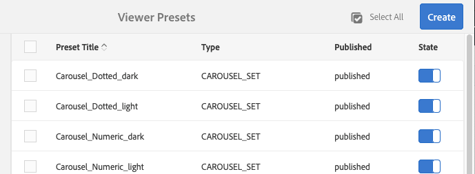

# Gerenciar predefinições do visualizador{#managing-viewer-presets}

Uma predefinição do visualizador é uma coleção de configurações que determinam como os usuários visualizam ativos de mídia avançada em suas telas de computadores e dispositivos móveis. Se você for um administrador, poderá criar Predefinições do visualizador. As configurações estão disponíveis para uma matriz de opções de configuração do visualizador. Por exemplo, você pode alterar o tamanho de exibição do visualizador ou o comportamento de zoom.

<!-- OBSOLETE SDK withdrawn from public view. Available internally only at `http://staging.scene7.com/s7sdk/3.8/docs/jsdoc/symbols/_s7sdk.html` 

For instructions on creating and customizing your own HTML5 viewer presets, see the *Adobe Scene7 HTML5 Viewer SDK*. The SDK is available on the IS publish server embedded in the SDK itself. Each library version has its own SDK documentation included.

Path: `<scene7_domain>/s7sdk/<library_version>/docs/jsdocs/index.html`.
For example, 3.5 SDK: [https://s7d1.scene7.com/s7sdk/3.5/docs/jsdoc/index.html](https://s7d1.scene7.com/s7sdk/3.5/docs/jsdoc/index.html)

-->

Consulte também a [Guia de referência de visualizadores do Dynamic Media](https://experienceleague.adobe.com/docs/dynamic-media-developer-resources.html).

Esta seção descreve como criar, editar e gerenciar predefinições do visualizador. Você pode aplicar uma predefinição do visualizador a um ativo a qualquer momento que o visualizar. Consulte [Aplicar predefinições do visualizador](#applying-a-viewer-preset-to-an-asset).

>[!NOTE]
>
>Editar qualquer *predefinições predefinidas e prontas para uso do visualizador* não é um cenário compatível. Se você tentar editar uma predefinição do visualizador pronta para uso, será solicitado que você salve a predefinição do visualizador usando um novo nome.

## Acessibilidade de teclado para visualizadores {#keyboard-accessibility-for-viewers}

Todos os visualizadores prontos para uso suportam acessibilidade do teclado.

Consulte também [Acessibilidade e navegação do teclado](https://experienceleague.adobe.com/docs/dynamic-media-developer-resources/library/c-keyboard-accessibility.html).

## Gerenciar predefinições do visualizador {#managing-viewer-presets-1}

Você pode adicionar, editar, excluir, publicar, cancelar a publicação e visualizar predefinições do visualizador no Adobe Experience Manager navegando até **[!UICONTROL Ferramentas]** (ícone de martelo) > **[!UICONTROL Ativos] > [!UICONTROL Predefinições do visualizador]**.

>[!NOTE]
>
>Por padrão, o sistema mostra 15 predefinições do visualizador ao selecionar Visualizadores na exibição detalhada de um ativo. Você pode aumentar esse limite. Consulte [Aumentar o número de predefinições do visualizador exibidas](#increasing-the-number-of-viewer-presets-that-display).

### Suporte para visualizador para páginas da Web responsivas projetadas {#viewer-support-for-responsive-designed-web-pages}

Páginas da Web diferentes têm necessidades diferentes. Por exemplo, às vezes, você deseja uma página da Web que forneça um link que abra o Visualizador do HTML5 em uma janela separada do navegador. Em outros casos, é necessário incorporar o Visualizador do HTML5 diretamente na página de hospedagem. No último caso, a página da Web tem um layout estático. Ou é &quot;responsivo&quot; e exibido de forma diferente em diferentes dispositivos ou para tamanhos de janela de navegador diferentes. Para acomodar essas necessidades, todos os visualizadores HTML5 predefinidos e prontos para uso que vêm com o Dynamic Media suportam páginas da Web estáticas e páginas da Web responsivas projetadas.

Consulte [Biblioteca de imagens estáticas responsivas](https://experienceleague.adobe.com/docs/dynamic-media-developer-resources/image-serving-api/image-serving-api/responsive-static-image-library/c-about-responsive-static-image-library.html#about-responsive-image-library) no *Ajuda da API de disponibilização e renderização de imagens do Dynamic Media* para obter mais informações sobre como incorporar visualizadores responsivos às suas páginas da Web.

>[!NOTE]
>
>Publique todos os visualizadores prontos para uso antes de usá-los para os primeiros.
>Consulte [Publicar predefinições do visualizador](#publishing-viewer-presets).

### Compatibilidade do sistema de predefinições do visualizador  {#viewer-preset-system-compatibility}

Todas as predefinições do visualizador prontas para uso que acompanham o Dynamic Media são totalmente compatíveis com os seguintes sistemas:

* Desktops
* Apple iPhone
* Apple iPad
* Android™ Smartphone
* Tablet Android™

<!-- OUTDATED 2/25/22 * For video, extra support for MP4 playback is provided for [BlackBerry&reg;](https://developer.blackberry.com/devzone/develop/supported_media/bb_media_support_at_a_glance.html#kba1328730952678) and [Windows&reg; Phone](https://docs.microsoft.com/en-us/windows/uwp/audio-video-camera/supported-codecs). -->

### Tipos de mídia avançada para predefinições do visualizador {#rich-media-types-for-viewer-presets}

Os administradores podem adicionar e personalizar os seguintes tipos de mídia avançada ao criar predefinições do visualizador.

<table>
 <tbody>
  <tr>
   <td><strong>Conjunto do Carousel</strong>  </td>
   <td>
Pontos de acesso, mapas de imagem ou ambos são adicionados a uma série de duas ou mais imagens. Um cliente pode deslocar as imagens para a esquerda ou para a direita e, em seguida, selecionar um ponto de acesso em uma imagem para obter mais detalhes ou para comprar diretamente da página inicial, categoria ou aterrissagem de um site.
 </td>
  </tr>
    <tr>
   <td><strong>Dimensional</strong>  </td>
   <td>
Exibe cenas 3D que permitem girar, deslocar, ampliar ou reinserir sua câmera.
 </td>
  </tr>
  <tr>
   <td><strong>Flyout Zoom</strong></td>
   <td>
Exibe uma segunda imagem da área com zoom ao lado da imagem original. Não há controles a serem usados; os usuários movem a seleção para a área que desejam visualizar.
 
Ao determinar o uso total da largura de banda para esse visualizador, considere que a imagem principal e a imagem flyout são servidas no visualizador. O tamanho da imagem principal (Largura e Altura do Palco) e o Fator de Zoom determinam o tamanho da imagem do flyout. Para impedir que o tamanho do arquivo flyout se torne muito grande, equilibre esses dois valores: se você tiver um tamanho de imagem principal grande, abaixe o valor de Fator de Zoom. (A Largura do Flyout e a Altura do Flyout determinam o tamanho da janela do flyout, mas não o tamanho da imagem do flyout que é servida no visualizador.)
 
Por exemplo, se o tamanho da imagem principal for 350 por 350 pixels, com um Fator de Zoom de 3, a imagem de flyout resultante será de 1050 por 1050 pixels. Se o tamanho da imagem principal for 300 por 300 pixels, com um Fator de Zoom de 4, a imagem de flyout será de 1200 por 1200 pixels. Dependendo da configuração de qualidade do JPEG (as configurações recomendadas estão entre 80 e 90), é possível diminuir o tamanho do arquivo significativamente. Os fatores de zoom recomendados são de 2,5 a 4, dependendo do tamanho da imagem principal.
 </td>
  </tr>
  <tr>
   <td><strong>Zoom em linha</strong></td>
   <td>Exibe uma imagem da área com zoom no visualizador original. Não há controles para usar. Ou seja, os usuários movem a seleção para a área que desejam visualizar.</td>
  </tr>
  <tr>
   <td><strong>Definição de imagem</strong></td>
   <td>No visualizador de Conjunto de imagens, os usuários podem ver diferentes exibições ou variações de cor de um item selecionando uma imagem em miniatura. Esse visualizador também oferece ferramentas de zoom para examinar imagens de perto.</td>
  </tr>
  <tr>
   <td><strong>Imagem interativa</strong></td>
   <td>Os pontos de acesso são adicionados a partes de uma imagem que um cliente pode selecionar para obter mais detalhes ou para comprar diretamente da página inicial, categoria ou aterrissagem de um site.</td>
  </tr>
  <tr>
   <td><strong>Vídeo interativo</strong></td>
   <td>As miniaturas são adicionadas aos segmentos da linha do tempo em um vídeo, que pode ser selecionado por um cliente para obter mais detalhes ou para comprar diretamente da página inicial, da categoria ou da página inicial de um site.</td>
  </tr>
  <tr>
   <td><strong>Mix de mídia</strong></td>
   <td>Exibe diferentes tipos de mídia em um visualizador. Você pode incluir conjuntos de rotação, conjunto de imagens, imagens e vídeos.</td>
  </tr>
  <tr>
   <td><strong>Imagem panorâmica</strong></td>
   <td>
Os visualizadores Panorâmica Image e PanorâmicaVR renderizam imagens panorâmicas esféricas para mergulhar os usuários em uma experiência de visualização de 360° de uma sala, propriedade, localização ou paisagem.
 
Para que uma imagem carregada seja qualificada como um panorama esférico, ela deve ter um ou ambos os itens a seguir:

    <ul>
     <li>Uma proporção de aspecto de 2:1.</li>
     <li>Marcado com as palavras-chave <code>equirectangular</code>ou <code>spherical</code> e <code>panorama</code>ou <code>spherical </code>e <code>panoramic</code>. Consulte <a href="/help/sites-cloud/authoring/features/tags.md">Uso de tags</a>.</li>
    </ul> 
Tanto a proporção quanto os critérios de palavra-chave se aplicam aos ativos panorâmicos da página de detalhes do ativo e ao componente WCM "Mídia panorâmica".
</td>
  </tr>
    <tr>
   <td><strong>Corte inteligente de vídeo</strong>  </td>
   <td>
Use esse visualizador para detectar e recortar automaticamente o ponto focal em qualquer vídeo.
 </td>
  </tr>
  <tr>
   <td><strong>Grupo de rotação</strong></td>
   <td>Fornece várias visualizações de uma imagem para que os usuários possam girar o objeto para examinar os diferentes lados e ângulos.</td>
  </tr>
  <tr>
   <td><strong>Vídeo 360</strong></td>
   <td>
Use o visualizador de vídeo 360/VR para renderizar vídeos tangulares necessários para uma experiência de visualização imersiva de uma sala, propriedade, local, paisagem ou procedimento médico.
 
Durante a reprodução em uma tela plana, o usuário tem o controle do ângulo de visualização. A reprodução em dispositivos móveis usa os controles giroscópicos incorporados.
 
O visualizador inclui suporte nativo para a entrega de 360 ativos de vídeo. Por padrão, nenhuma configuração adicional é necessária para visualizar ou reproduzir. Você fornece 360 vídeos usando extensões de vídeo padrão, como .mp4, .mkv e .mov. O codec mais comum é o H.264.
 </td>
  </tr>
  <tr>
   <td><strong>Vídeo</strong></td>
   <td>
Reproduz vídeo usando streaming progressivo ou adaptável de taxa de bits. O streaming adaptável da taxa de bits executa automaticamente a detecção de dispositivo e de largura de banda para veicular o vídeo de qualidade certa no formato correto.
 </td>
  </tr>
  <tr>
   <td><strong>Zoom vertical</strong></td>
   <td>
O visualizador de Zoom vertical permite maximizar uma experiência de visualização de imagem de produto para fornecer aos usuários a melhor representação de um produto. A localização vertical das amostras faz o seguinte:

    <ul>
     <li>Garante que as amostras estejam "acima da dobra".  Com amostras horizontais, dependendo do tamanho da tela da área de trabalho do usuário, as amostras não estarão visíveis até que o usuário tenha rolado pela página. Ao colocar as amostras verticalmente no visualizador, ele garante que elas fiquem visíveis, independentemente do tamanho da tela do usuário.</li>
     <li>Maximiza o tamanho da imagem principal.  Com amostras horizontais, é necessário reservar espaço na página para garantir que elas estejam visíveis. Esse posicionamento diminuiu o tamanho da imagem principal. No entanto, com um layout de amostra vertical, não é necessário alocar esse espaço. Dessa forma, você pode maximizar o tamanho da imagem principal.</li>
    </ul> </td>
  </tr>
  <tr>
   <td><strong>Zoom</strong></td>
   <td>Permite que os usuários ampliem a área ao selecioná-la. Os usuários podem selecionar controles para ampliar, reduzir e redefinir a imagem para seu tamanho padrão.</td>
  </tr>
 </tbody>
</table>

### Lista de predefinições do visualizador prontas para uso {#list-of-out-of-the-box-viewer-presets}

A tabela a seguir identifica todas as predefinições predefinidas e predefinidas do visualizador que vêm com o Dynamic Media.

Consulte também [Demonstrações ao vivo](https://landing.adobe.com/en/na/dynamic-media/ctir-2755/live-demos.html).

Para obter informações sobre versões compatíveis de navegadores da Web e sistemas operacionais para visualizadores, consulte as Notas de versão dos visualizadores.

Consulte as &quot;Notas de versão dos visualizadores&quot; no índice do [Guia de referência de visualizadores](https://experienceleague.adobe.com/docs/dynamic-media-developer-resources.html).

>[!NOTE]
>
>Todas as predefinições do visualizador prontas para uso no Dynamic Media são ativadas (ativadas), mas você deve publicá-las.
>Consulte [Publicar predefinições do visualizador](#publishing-viewer-presets).
>
>As novas predefinições do visualizador criadas e adicionadas devem ser ativadas *e *publicadas.
>Consulte [Ativar ou desativar predefinições do visualizador](#activating-or-deactivating-viewer-presets) e [Publicar predefinições do visualizador](#publishing-viewer-presets).

<table>
 <tbody>
  <tr>
   <td><strong>Título da predefinição do visualizador</strong></td>
   <td><strong>Tipo</strong></td>
   <td><strong>Nome do arquivo CSS</strong>  </td>
  </tr>
  <tr>
   <td>Carrossel_Dotted_dark</td>
   <td>Carrossel_Set</td>
   <td><code>html5_carouselviewer_dotted_dark.css</code></td>
  </tr>
  <tr>
   <td>Carrossel_Dotted_light</td>
   <td>Carrossel_Set</td>
   <td><code>html5_carouselviewer_dotted_light.css</code></td>
  </tr>
  <tr>
   <td>Carrossel_Numérico_escuro</td>
   <td>Carrossel_Set</td>
   <td><code>html5_carouselviewer_numeric_dark.css</code></td>
  </tr>
  <tr>
   <td>Carrossel_Numeric_light</td>
   <td>Carrossel_Set</td>
   <td><code>html5_carouselviewer_numeric_light.css</code></td>
  </tr>
  <tr>
   <td>Flyout</td>
   <td>Flyout_Zoom</td>
   <td><code>html5_flyoutviewer.css</code></td>
  </tr>
  <tr>
   <td>ImageSet_dark</td>
   <td>Definição de imagem</td>
   <td><code>html5_zoomviewer_dark.css</code></td>
  </tr>
  <tr>
   <td>ImageSet_light</td>
   <td>Definição de imagem</td>
   <td><code>html5_zoomviewer_light.css</code></td>
  </tr>
  <tr>
   <td>InlineMixedMedia_dark</td>
   <td>Mixed_Media</td>
   <td><code>html5_inlinemixedmediaviewer_dark.css</code></td>
  </tr>
  <tr>
   <td>InlineMixedMedia_light</td>
   <td>Mixed_Media</td>
   <td><code>html5_inlinemixedmediaviewer_light.css</code></td>
  </tr>
  <tr>
   <td>InlineZoom</td>
   <td>Flyout_Zoom</td>
   <td><code>html5_inlinezoomviewer.css</code></td>
  </tr>
  <tr>
   <td>MixedMedia_dark</td>
   <td>Mixed_Media</td>
   <td><code>html5_mixedmediaviewer_dark.css</code></td>
  </tr>
  <tr>
   <td>MixedMedia_light</td>
   <td>Mixed_Media</td>
   <td><code>html5_mixedmediaviewer_light.css</code></td>
  </tr>
  <tr>
   <td>PanorâmicaImage</td>
   <td>Panorâmica_Imagem</td>
   <td><code>html5_panoramicimage.css</code></td>
  </tr>
  <tr>
   <td>PanorâmicaImageVR</td>
   <td>Panorâmica_Imagem</td>
   <td><code>html5_panoramicimage.css</code></td>
  </tr>
  <tr>
   <td>Shoppable_Banner</td>
   <td>Imagem_Interativa</td>
   <td><code>html5_interactiveimage.css</code></td>
  </tr>
  <tr>
   <td>Shoppable_Video_dark</td>
   <td>Interative_Video</td>
   <td><code>html5_interactivevideoviewer_dark.css</code></td>
  </tr>
  <tr>
   <td>Shoppable_Video_light</td>
   <td>Interative_Video</td>
   <td><code>html5_interactivevideovewer_light.css</code></td>
  </tr>
  <tr>
   <td>SpinSet_dark</td>
   <td>Spin_Set</td>
   <td><code>html5_spinviewer_dark.css</code></td>
  </tr>
  <tr>
   <td>SpinSet_light</td>
   <td>Spin_Set</td>
   <td><code>html5_spinviewer_light.css</code></td>
  </tr>
  <tr>
   <td>
Vídeo
 
(Inclui suporte para legendas ocultas)
 </td>
   <td>Vídeo</td>
   <td><code>html5_videoviewer.css</code></td>
  </tr>
  <tr>
   <td>
Video360_social
 
(Inclui controles básicos de reprodução de vídeo, renderização de vídeo é feita no modo estéreo, o controle manual do ponto de exibição está desativado, mas o controle giroscópico está ativado e nenhum recurso de mídia social)
 </td>
   <td>Vídeo_360</td>
   <td><code>html5_video360viewersocial.css</code></td>
  </tr>
  <tr>
   <td>
Video360VR
 
(Projetado para usuários finais que usam óculos de realidade virtual. Inclui controles básicos de reprodução de vídeo e recursos de redes sociais)
 </td>
   <td>Vídeo_360</td>
   <td><code>html5_video360viewer.css</code></td>
  </tr>
  <tr>
   <td>
Vídeo_social
 
(Inclui suporte para legendas ocultas e redes sociais)
 </td>
   <td>Vídeo</td>
   <td><code>html5_videoviewersocial.css</code></td>
  </tr>
  <tr>
   <td>Zoom_escuro  </td>
   <td>Zoom  </td>
   <td><code>html5_basiczoomviewer_dark.css</code></td>
  </tr>
  <tr>
   <td>Zoom_light  </td>
   <td>Zoom</td>
   <td><code>html5_basiczoomviewer_light.css</code></td>
  </tr>
  <tr>
   <td>ZoomVertical_escuro  </td>
   <td>Zoom Vertical</td>
   <td><code>html5_zoomverticalviewer_dark.css</code></td>
  </tr>
  <tr>
   <td>ZoomVertical_Light</td>
   <td>Zoom Vertical</td>
   <td><code>html5_zoomverticalviewer_light.css</code></td>
  </tr>
 </tbody>
</table>

### Matriz de gestos de visualizadores móveis compatíveis {#supported-mobile-viewers-gestures-matrix}

A tabela a seguir identifica os gestos do visualizador móvel que são compatíveis com dispositivos iOS, Android™ 2.x e Android™ 3.x.

<table>
 <tbody>
  <tr>
   <td><strong>Gesto</strong></td>
   <td><strong>Flyout Zoom</strong></td>
   <td><strong>Zoom</strong></td>
   <td><strong>Rotação</strong></td>
  </tr>
  <tr>
   <td>
<strong>Arrastar</strong>
 </td>
   <td>
Canetas
 </td>
   <td>
Canetas
 </td>
   <td>
Canetas
 </td>
  </tr>
  <tr>
   <td>
<strong>Tocar</strong>
 </td>
   <td>
Mostra a janela do flyout
 </td>
   <td>
Mostra ou oculta a interface do usuário
 </td>
   <td>
Mostra ou oculta a interface do usuário
 </td>
  </tr>
  <tr>
   <td>
<strong>Toque duplo</strong>
 </td>
   <td>
Não se aplica
 </td>
   <td>
Amplia ou redefine
 </td>
   <td>
Amplia ou redefine
 </td>
  </tr>
  <tr>
   <td>
<strong>Pinça aberta</strong>
 </td>
   <td>
Não se aplica
 </td>
   <td>
Aumenta o zoom (somente iOS e Android™ 3x)
 </td>
   <td>
Aumenta o zoom (somente iOS e Android™ 3x)
 </td>
  </tr>
  <tr>
   <td>
<strong>Feche a pinça</strong>
 </td>
   <td>
Não se aplica
 </td>
   <td>
Diminui o zoom (somente iOS e Android™ 3x)
 </td>
   <td>
Diminui o zoom (somente iOS e Android™ 3x)
 </td>
  </tr>
  <tr>
   <td>
<strong>Deslizar</strong>
 </td>
   <td>
Rola a barra de amostra
 </td>
   <td>
Rolar imagens
 </td>
   <td>
Rotação
 </td>
  </tr>
  <tr>
   <td>
<strong>Cintilação</strong>
 </td>
   <td>
Rola a barra de amostra
 </td>
   <td>
Rolar imagens
 </td>
   <td>
Rotação
 </td>
  </tr>
 </tbody>
</table>

## Aumentar o número de predefinições do visualizador exibidas {#increasing-the-number-of-viewer-presets-that-display}

O Experience Manager mostra uma grande variedade de predefinições do visualizador ao visualizar ativos do **[!UICONTROL Exibição de detalhes]** > **[!UICONTROL Visualizadores]**. Você pode aumentar ou diminuir o número de visualizadores exibidos.

**Para aumentar o número de predefinições do visualizador exibidas:**

1. Navegue até o CRXDE Lite ([https://localhost:4502/crx/de](https://localhost:4502/crx/de)).
1. Navegue até o nó da listagem de predefinições do visualizador em `/libs/dam/gui/coral/content/commons/sidepanels/viewerpresets/viewerpresetslist`

   

1. Na propriedade **[!UICONTROL limit]**, altere o **[!UICONTROL Value]**, que é definido como 15 por padrão, para o número desejado.
1. Navegue até a fonte de dados predefinida do visualizador em `/libs/dam/gui/coral/content/commons/sidepanels/viewerpresets/viewerpresetslist/datasource`

   

1. Na propriedade limit , altere o número para o número desejado, por exemplo `{empty requestPathInfo.selectors[1] ? "20" : requestPathInfo.selectors[1]}`
1. Selecionar **[!UICONTROL Salvar tudo]**.

## Criar predefinições do visualizador {#creating-a-new-viewer-preset}

A criação de predefinições do visualizador permite aplicar várias configurações para visualizar e interagir com ativos. No entanto, não é necessário criar predefinições do visualizador. Se preferir, você pode usar as predefinições padrão do visualizador pronto para uso que já vêm com o Experience Manager Assets.

Se você optar por criar uma predefinição do visualizador, depois de salvá-la, o estado do visualizador será ativado automaticamente (definido como **[!UICONTROL Ligado]**) na página Predefinições do visualizador . Esse estado significa que está visível no componente Dynamic Media e no componente Mídia interativa e sempre que você visualiza uma imagem ou vídeo.

Algumas predefinições do visualizador têm configurações exclusivas que podem afetar o uso e o comportamento geral do visualizador. Dependendo da predefinição do visualizador que você criar, esteja ciente dessas considerações especiais.

Consulte [Considerações especiais para criar uma predefinição do Visualizador interativo](#special-considerations-for-creating-an-interactive-viewer-preset).

Consulte [Considerações especiais para criar uma predefinição de Visualizador de banner do carrossel](#special-considerations-for-creating-a-carousel-banner-viewer-preset).

**Para criar predefinições do visualizador:**

1. No canto superior esquerdo do Experience Manager, selecione o logotipo Experience Manager e, em seguida, no painel à esquerda, vá para **[!UICONTROL Ferramentas]** (ícone de martelo) > **[!UICONTROL Ativos]** > **[!UICONTROL Predefinições do visualizador]**.

   

1. Na página Predefinições do visualizador , na barra de ferramentas, selecione **[!UICONTROL Criar]**.
1. No **[!UICONTROL Nova predefinição do visualizador]** na caixa de diálogo , na **[!UICONTROL Nome da predefinição]** , insira o nome da nova predefinição. Escolha um nome com cuidado, eles não são editáveis após a seleção **[!UICONTROL Criar]**.

   Quando você salvar a predefinição mais tarde nessas etapas, o nome aparecerá na página Predefinições do visualizador no cabeçalho da coluna Título da predefinição .

1. No menu suspenso Rich Media Type (Tipo de mídia avançada), selecione o tipo de predefinição do visualizador que deseja criar e, no canto superior direito da página, selecione **[!UICONTROL Criar]**.

   Consulte [Tipos de mídia avançada para predefinições do visualizador](#rich-media-types-for-viewer-presets).

1. Na página Editor de predefinições do visualizador , selecione o **[!UICONTROL Aparência]** guia .
1. Siga uma das seguintes opções:

   * No **[!UICONTROL Tipo selecionado]** selecione um componente cujo design visual você deseja personalizar. Como alternativa, você pode selecionar qualquer elemento visual no visualizador para selecioná-lo para configuração.

      O editor visual permite ver qual efeito uma determinada propriedade tem em um estilo. Defina ou ajuste qualquer propriedade para ver instantaneamente qual efeito ela tem no visualizador usando a amostra à esquerda do editor.

      As propriedades de estilo CSS para cada tipo de predefinição do visualizador são descritas em &quot;Personalização *`<viewer name>`* Visualizador&quot; Tópico de Ajuda na [Guia de referência de visualizadores](https://experienceleague.adobe.com/docs/dynamic-media-developer-resources.html). Por exemplo, se você estiver criando uma predefinição do visualizador do tipo `Mixed_Media`, consulte [Personalizar visualizador de mídia mista](https://experienceleague.adobe.com/docs/dynamic-media-developer-resources/library/viewers-aem-assets-dmc/mixed-media/customing-mixed-media/c-html5-mixedmedia-viewer-customizingviewer.html) para obter uma lista e a descrição de cada propriedade.

   * Se você tiver definido as configurações de estilo em um arquivo CSS separado, é possível fazer upload do arquivo CSS para o Experience Manager Assets. Para localizar o arquivo CSS carregado e associá-lo à predefinição do visualizador, selecione **[!UICONTROL Importar CSS]** abaixo do **[!UICONTROL Tipo selecionado]** menu suspenso (se necessário, role o editor visual para cima para vê-lo).

      Ao importar um arquivo CSS, o editor visual verifica se o CSS usa os marcadores do visualizador corretos. Por exemplo, se você estiver criando um visualizador de Zoom, todas as regras de CSS importadas devem ser definidas usando o nome da classe do visualizador `.s7mixedmediaviewer` definido em um elemento de visualizador pai.

      Você pode importar CSS arbitrário e artesanal, desde que ele defina corretamente os marcadores de CSS para um determinado visualizador. (Os marcadores CSS são descritos em qualquer &quot;Personalização *&lt;viewer name=&quot;&quot;>* Visualizador&quot; Tópico de Ajuda na [Guia de referência de visualizadores](https://experienceleague.adobe.com/docs/dynamic-media-developer-resources.html). Por exemplo, se você deseja ler sobre marcadores CSS para o Visualizador de Zoom, consulte [Personalização do Visualizador de Zoom](https://experienceleague.adobe.com/docs/dynamic-media-developer-resources/library/viewers-aem-assets-dmc/zoom/customizing-zoom/c-html5-20-zoom-viewer-customizingviewer.html).) No entanto, é possível que o editor visual não entenda alguns valores de CSS. Nesses casos, o editor visual tenta substituir os erros para que o CSS ainda possa funcionar.
   >[!NOTE]
   >
   >Se preferir editar o CSS diretamente em sua forma bruta, selecione **[!UICONTROL Mostrar/Ocultar CSS]** abaixo do menu suspenso Tipo selecionado (se necessário, role o editor visual para cima para vê-lo).
   >Como o editor visual, quando você altera uma propriedade diretamente no CSS, pode ver instantaneamente qual efeito ela tem na amostra do visualizador. E essa mesma propriedade é atualizada automaticamente ao mesmo tempo no editor visual. Dessa forma, você pode usar o editor de CSS bruto, o editor visual ou ambos alternadamente.

   >[!NOTE]
   >
   >Para arte-final de botão, escolha a imagem 2x e faça upload de arte de alta resolução. Ao trabalhar com imagens interativas e banners que podem ser comprados, você também pode selecionar vários botões de ponto de acesso prontos para uso.

1. (Opcional) Próximo à parte superior da página Editar predefinição do visualizador, selecione **[!UICONTROL Desktop]**, **[!UICONTROL Comprimido]** ou **[!UICONTROL Telefone]** para definir estilos visuais de forma exclusiva para diferentes tipos de dispositivos e telas.
1. Na página Editor de predefinições do visualizador , selecione o **[!UICONTROL Comportamento]** guia . Como alternativa, você pode selecionar qualquer elemento visual no visualizador para selecioná-lo para configuração.
1. No menu suspenso **[!UICONTROL Tipo selecionado]**, selecione um componente cujos comportamentos você deseja alterar.

   Muitos componentes no editor visual têm uma descrição detalhada associada a ela. Essas descrições são exibidas em caixas azuis quando você expande um componente para revelar seus parâmetros associados.

   Alguns tipos de Visualizador têm componentes que permitem especificar comandos do Servidor de imagens em um campo de texto **[!UICONTROL Comando IS]**. Para obter uma lista de comandos que podem ser usados, consulte a [Referência da API de disponibilização de imagens](https://experienceleague.adobe.com/docs/dynamic-media-developer-resources/image-serving-api/image-serving-api/c-is-home.html).

   >[!NOTE]
   >
   >**Se estiver usando um dispositivo de toque, como um telefone ou tablet...**
   >
   >
   >Depois de digitar um valor no campo de texto, selecione outro lugar na interface do usuário para enviar a alteração e fechar o teclado virtual. Se você selecionar **[!UICONTROL Enter]**, nenhuma ação ocorre.

1. Ao lado do canto superior direito da página, selecione **[!UICONTROL Salvar]**.
1. Publique sua nova predefinição do visualizador. É necessário publicar a predefinição para usá-la em seu site.

   Consulte [Predefinições do visualizador de publicação](#publishing-viewer-presets).

### Considerações especiais para criar uma predefinição interativa do visualizador {#special-considerations-for-creating-an-interactive-viewer-preset}

**Sobre modos de exibição para miniaturas de imagem no painel:**

Ao criar ou editar uma predefinição do visualizador de Vídeo interativo, você tem a opção de qual configuração do Modo de exibição usar. Essa opção ocorre ao selecionar `InteractiveSwatches` do **[!UICONTROL Componente selecionado]** menu suspenso abaixo do **[!UICONTROL Comportamento]** guia . O Modo de exibição escolhido afeta a forma como e quando as miniaturas aparecem enquanto o vídeo está sendo reproduzido. Você pode escolher um Modo de exibição `segment` (padrão) ou um Modo de exibição `continuous`.

<table>
 <tbody>
  <tr>
   <td><strong>Modo de exibição</strong></td>
   <td><strong>Descrição</strong></td>
  </tr>
  <tr>
   <td>Segmento</td>
   <td>
<code>Segment </code>é o modo de exibição padrão das predefinições prontas para uso do Visualizador de vídeo interativo <code>Shoppable_Video_light</code> e <code>Shoppable_Video_dark</code> e qualquer predefinição do Visualizador de vídeo interativo que você mesmo criar.
 
Nesse modo, suponha que haja menos miniaturas atribuídas a um segmento de vídeo do que o número de pontos visíveis no painel de exibição. Nesses casos, as miniaturas dos subsegmentos anteriores ou seguintes são <i>not </i>puxado para preencher os pontos vazios no painel. Ou seja, preserva a exibição de amostras atribuídas ao segmento específico do vídeo.
 </td>
  </tr>
  <tr>
   <td>Contínuo</td>
   <td>
Em <code>continuous </code>modo de exibição, suponha que o número de miniaturas em um segmento seja menor que o número visível no painel. Nesses casos, o visualizador inclui automaticamente a exibição de miniaturas do próximo segmento ou do segmento anterior, onde a última miniatura é exibida.
 
O <a href="/help/assets/dynamic-media/interactive-videos.md">vídeo neste tópico</a> é um exemplo da variável <code>continuous </code>modo de exibição.
 </td>
  </tr>
 </tbody>
</table>

**Sobre o comportamento de rolagem automática no visualizador de Vídeo interativo:**

O comportamento de rolagem automática das miniaturas no visualizador de Vídeo interativo funciona independentemente do modo de exibição escolhido.

Ao criar ou editar uma predefinição interativa do visualizador de vídeo, você acessa a opção Rolagem automática na guia Comportamento. Na guia Comportamento , na guia **[!UICONTROL Componentes selecionados]** , selecione **[!UICONTROL InterativeSwatches]**. A caixa de seleção Rolagem automática está listada abaixo do campo de texto Comando IS.

Se desativar a opção **[!UICONTROL Rolagem automática]** (desmarcar a caixa de seleção) na predefinição do visualizador, durante a reprodução do vídeo pelo usuário, o painel exibirá apenas a primeira imagem em miniatura em toda a duração do vídeo. Entretanto, um usuário pode rolar manualmente pelas miniaturas usando os ícones de seta para cima e para baixo, se desejar.

Ao ativar (selecionar) a **[!UICONTROL Rolagem automática]** na predefinição do visualizador as imagens em miniatura atribuídas a um segmento de vídeo são roladas para exibição no início de um segmento durante a reprodução do vídeo. Entretanto, há instâncias em que determinadas miniaturas em um segmento são exibidas com duas vezes mais comprimento no início ou no final delas. Esse comportamento ocorre porque a quantidade de miniaturas em um segmento é maior que o número visível no painel e não é divisível uniformemente.

Para ilustrar, suponha que você tenha um segmento de vídeo de 30 segundos. E há um total de nove miniaturas para serem exibidas nos 30 segundos. Seu navegador é dimensionado de forma que haja quatro posições de miniatura visíveis no painel de exibição. O segmento de tempo do vídeo de 30 segundos é dividido em três subsegmentos. A tabela a seguir mostra o detalhamento de quais miniaturas são exibidas para um determinado subsegmento de tempo:

| **Subsegmento de vídeo** | **Tempo do subsegmento em segundos** | **Miniaturas visíveis no painel** |
|---|---|---|
| 1 | 0-10 | 1, 2, 3, 4 |
| 2 | 10-20 | 4, 5, 6, 7 |
| 3 | 20-30 | 6, 7, 8, 9 |

O subsegmento de vídeo 3 não se estende além das miniaturas atribuídas a ele. Observe também que as miniaturas 4, 6 e 7 são visíveis no painel duas vezes mais longas do que as outras miniaturas.

A lógica que o visualizador usa para quantas miniaturas são exibidas no painel com base no número de posições disponíveis é a seguinte:

* Número de subsegmentos = arredondar para o próximo subsegmento (número de miniaturas/número de slots visíveis no painel de miniatura, com base no tamanho da janela do navegador).
Usando o exemplo na tabela acima, 9 miniaturas / 4 slots = 2,25; a lógica do visualizador arredonda até três subsegmentos.

* Número de miniaturas = arredondar para a próxima miniatura (número de miniaturas / número de subsegmentos de vídeo).
Usando o exemplo na tabela acima, 9 miniaturas / 3 subsegmentos de vídeo = 3 miniaturas.

* Duração do subsegmento = duração total do vídeo / número de subsegmentos do vídeo.
Usando o exemplo na tabela acima, 30 segundos / 3 subsegmentos de vídeo = 10 segundos de exibição de cada subsegmento de vídeo.

#### Considerações especiais para a criação de predefinições do visualizador de banner do carrossel {#special-considerations-for-creating-a-carousel-banner-viewer-preset}

Ao criar predefinições do visualizador de banner do carrossel, a alteração do estilo dos pontos de acesso pode ser acessada da seguinte maneira:

|  | **Descrição** | **Ações** |
|---|---|---|
| **[!UICONTROL Ícone do ponto de acesso]** | Alterar o ícone usado para ponto de acesso | Para alterar a imagem do ícone do ponto de acesso, no **[!UICONTROL Aparência]** guia , em **[!UICONTROL Componente selecionado]**, selecione **[!UICONTROL ImageMapEffect]**. Em **[!UICONTROL Ícone]**, selecione **[!UICONTROL Plano de fundo]** e, no campo **[!UICONTROL Imagem]**, navegue até a imagem de plano de fundo desejada. |

## Ativar ou desativar predefinições do visualizador {#activating-or-deactivating-viewer-presets}

As Predefinições do visualizador disponíveis na interface do usuário dependem de quais estão ativas no modo Autor. Por padrão, uma predefinição do visualizador é &quot;Ativado&quot; depois que você a cria. Se você desligar a predefinição, não a verá no modo Autor. Se a predefinição for publicada, ela sempre será publicada, independentemente de estar sendo ligada ou desligada. Desative as predefinições do visualizador se a lista se tornar muito difícil ou se você não quiser que uma predefinição do visualizador seja disponibilizada para uso.

**Para ativar ou desativar as predefinições do visualizador:**

1. No canto superior esquerdo do Experience Manager, selecione o logotipo Experience Manager e, em seguida, no painel à esquerda, selecione **[!UICONTROL Ferramentas]** (ícone de martelo) > **[!UICONTROL Ativos]** > **[!UICONTROL Predefinições do visualizador]**.
1. Na página Predefinição do visualizador , em **[!UICONTROL Estado]** no cabeçalho da coluna, selecione a opção para ativar ou desativar uma predefinição do visualizador.

   As predefinições do visualizador ativadas têm o botão de alternância exibido à direita, dentro de uma caixa azul; as predefinições do visualizador desativadas têm o botão de alternância exibido à esquerda, dentro de uma caixa cinza-claro.

## Publicar predefinições do visualizador {#publishing-viewer-presets}

Ativar (ou ativar) o estado de uma predefinição do visualizador significa que ela está visível no componente Dynamic Media, no componente Mídia interativa e sempre que você exibe um ativo.

No entanto, para *delivery* um ativo com uma predefinição do visualizador, a predefinição do visualizador também deve ser publicada. Todas as predefinições do visualizador devem ser ativadas *e* publicado para obter o URL ou código incorporado de um ativo. Ative e publique todas as predefinições do visualizador prontas para uso que acompanham o Dynamic Media. As predefinições do visualizador personalizado criadas e adicionadas são ativadas automaticamente, mas também devem ser publicadas.

Consulte [Ativar ou desativar predefinições do visualizador](#activating-or-deactivating-viewer-presets).

Consulte também [Visualização de ativos](/help/assets/dynamic-media/previewing-assets.md).

**Para publicar predefinições do visualizador:**

1. No canto superior esquerdo do Experience Manager, selecione o logotipo Experience Manager e, em seguida, no painel à esquerda, selecione **[!UICONTROL Ferramentas]** (ícone de martelo) > **[!UICONTROL Ativos] > [!UICONTROL Predefinições do visualizador]**.
1. Selecione uma ou mais predefinições do visualizador que você deseja publicar.
1. Na barra de ferramentas, selecione o **[!UICONTROL Publicar]** ícone .

## Classificar predefinições do visualizador {#sorting-viewer-presets}

1. No canto superior esquerdo do Experience Manager, selecione o logotipo Experience Manager e, em seguida, no painel à esquerda, selecione **[!UICONTROL Ferramentas]** (ícone de martelo) > **[!UICONTROL Ativos] > [!UICONTROL Predefinições do visualizador]**.
1. Selecionar **[!UICONTROL Título da predefinição]**, **[!UICONTROL Tipo]**, **[!UICONTROL Publicado]** ou **[!UICONTROL Estado]** para classificar pelo cabeçalho da coluna. Por exemplo, selecione **[!UICONTROL Tipo]**  para classificar os tipos de predefinição do visualizador em ordem alfabética ou não.

## Editar predefinições do visualizador {#editing-viewer-presets}

Editar qualquer *predefinições predefinidas e prontas para uso do visualizador* não é um cenário compatível. Se você editar uma predefinição do visualizador pronta para uso, será solicitado que ela seja salva com um novo nome.

**Para editar as predefinições do visualizador:**

1. No canto superior esquerdo do Experience Manager, selecione o logotipo Experience Manager e, em seguida, no painel à esquerda, selecione **[!UICONTROL Ferramentas]** (ícone de martelo) > **[!UICONTROL Ativo]** > **[!UICONTROL Predefinições do visualizador]**.
1. Selecione uma predefinição marcando a caixa à esquerda do título da predefinição do visualizador.
1. Na barra de ferramentas, selecione **[!UICONTROL Editar]**.
1. No **[!UICONTROL Editor de predefinições do visualizador]** faça as alterações desejadas na predefinição do visualizador, usando as opções encontradas na página **[!UICONTROL Aparência]** e **[!UICONTROL Comportamento]** guias.

   No **[!UICONTROL Aparência]** , próximo ao canto superior esquerdo da página Editor de predefinições do visualizador, selecione **[!UICONTROL Desktop]**, **[!UICONTROL Comprimido]** ou **[!UICONTROL Telefone]** para alterar o modo de apresentação do ativo.

1. Próximo ao canto superior direito da página, execute um dos seguintes procedimentos:

   * Selecionar **[!UICONTROL Salvar]** para salvar suas alterações e retornar à página Predefinição do visualizador .
   * Selecionar **[!UICONTROL Cancelar]** para evitar alterações feitas e retornar à página Predefinição do visualizador .

## Excluir predefinições do visualizador personalizado {#deleting-custom-viewer-presets}

É possível excluir as Predefinições do visualizador que você criou e adicionou ao Dynamic Media.

**Para excluir predefinições do visualizador personalizado:**

1. No canto superior esquerdo do Experience Manager, selecione o logotipo Experience Manager e, em seguida, no painel à esquerda, selecione **[!UICONTROL Ferramentas]** (ícone de martelo) > **[!UICONTROL Ativos] > [!UICONTROL Predefinições do visualizador]**.
1. Na página Predefinições do visualizador , marque um Título de predefinição e selecione o **[!UICONTROL Lixeira]** ícone .
1. Selecione **[!UICONTROL Excluir]**.

## Aplicar predefinições do visualizador a um ativo {#applying-a-viewer-preset-to-an-asset}

Se já tiver publicado o ativo e o visualizador selecionado, os botões **[!UICONTROL URL]** e **[!UICONTROL Incorporar]** aparecerão depois de selecionar uma predefinição do visualizador.

**Para aplicar uma predefinição do visualizador a um ativo:**

1. Abra o ativo e, próximo ao canto superior esquerdo da página, selecione o menu suspenso e selecione **[!UICONTROL Visualizadores]**.

   >[!NOTE]
   >
   >Se já tiver publicado o ativo e o visualizador selecionado, os botões **[!UICONTROL URL]** e **[!UICONTROL Incorporar]** aparecerão depois de selecionar uma predefinição do visualizador.

1. Para aplicá-lo ao ativo, selecione uma predefinição do visualizador no painel esquerdo.

   Você pode [copie o URL para compartilhar](/help/assets/dynamic-media/linking-urls-to-yourwebapplication.md) com outros usuários.

## Entregar ativos com predefinições do visualizador {#delivering-assets-with-viewer-presets}

Para obter os URLs das Predefinições do visualizador, consulte [Vincular URLs à sua aplicação web](/help/assets/dynamic-media/linking-urls-to-yourwebapplication.md). Consulte também [Incorporar o visualizador de vídeo em uma página da Web](/help/assets/dynamic-media/embed-code.md).

Se você estiver usando o Experience Manager como o WCM, poderá adicionar ativos usando as predefinições do visualizador diretamente na página. Consulte [Adicionar ativos Dynamic Media às páginas](/help/assets/dynamic-media/adding-dynamic-media-assets-to-pages.md).
