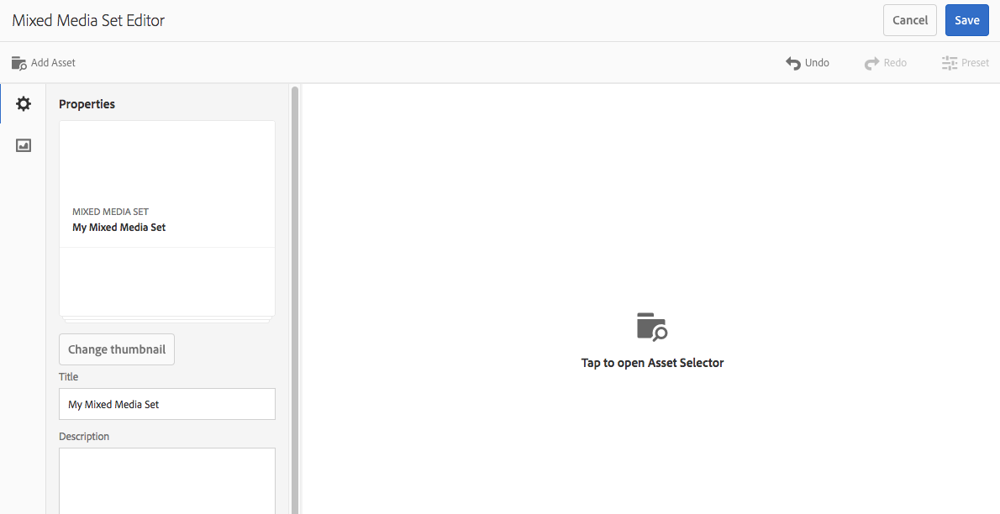

# Conjuntos de mídia mista{#mixed-media-sets}

Os Conjuntos de mídias mistas permitem fornecer uma mistura de imagens, Conjuntos de imagens, Conjuntos de rotação e vídeos em uma apresentação.

Os Conjuntos de mídias mistas são designados por um banner com a palavra **[!UICONTROL MixedMediaSet]**. Além disso, se o Conjunto de mídias mistas for publicado, a data de publicação, indicada pelo ícone **[!UICONTROL Mundo]**, estará no banner junto com a última data de modificação, indicada pelo ícone **[!UICONTROL Lápis]**.

>[!NOTE]
>
>Para obter informações sobre a interface do Assets, consulte [Gerenciar ativos com a interface para toque](/help/assets/manage-digital-assets.md).

## Início rápido: conjuntos de mídia mista {#quick-start-mixed-media-sets}

Para começar a usar rapidamente os Conjuntos de mídias mistas, siga estas etapas:

1. [Fazer upload de ativos](#uploading-assets).

   Comece carregando as imagens e os vídeos dos Conjuntos de mídias mistas. Se necessário, crie seus [Conjuntos de imagens](/help/assets/dynamic-media/image-sets.md) e [Conjuntos de rotação](/help/assets/dynamic-media/spin-sets.md). Como os usuários podem ampliar imagens no Visualizador de conjunto de mídias mistas, certifique-se de ativar o zoom ao escolher imagens. Verifique se as imagens têm pelo menos 2000 pixels no maior tamanho.

   Consulte [Dynamic Media - Formatos de imagem rasterizada compatíveis](/help/assets/file-format-support.md#image-support-dynamic-media) para obter uma lista de formatos compatíveis com Conjuntos de mídias mistas.

1. [Criar conjuntos de mídia mista](#creating-mixed-media-sets).

   Para criar um Conjunto de mídia mista, na página Assets, acesse **[!UICONTROL Criar]** > **[!UICONTROL Conjunto de mix de mídia]** e, em seguida, nomeie o conjunto, escolha os ativos e escolha a ordem em que as imagens serão exibidas.

   Consulte [Trabalhar com seletores](/help/assets/dynamic-media/working-with-selectors.md).

1. Configurar [Predefinições do visualizador de mix de mídia](/help/assets/dynamic-media/managing-viewer-presets.md), conforme necessário.

   Os administradores podem criar ou modificar as Predefinições do visualizador de conjunto de mídia mista. Para ver sua mídia mista com uma predefinição do visualizador, selecione o conjunto de mídias mistas e, no menu suspenso do painel à esquerda, selecione **[!UICONTROL Visualizadores]**.

   Para criar ou editar predefinições do visualizador, navegue até **[!UICONTROL Ferramentas]** > **[!UICONTROL Assets]** > **[!UICONTROL Predefinições do visualizador]**.

   Consulte [Adicionar e editar predefinições do visualizador](/help/assets/dynamic-media/managing-viewer-presets.md).

1. [Visualizar conjuntos de mídia mista](#previewing-mixed-media-sets).

   Selecione o Conjunto de mídias mistas e você poderá visualizá-lo. Para examinar o Conjunto de mídias mistas no Visualizador selecionado, selecione os ícones de miniatura. Você pode escolher Visualizadores diferentes da **[!UICONTROL Visualizadores]** disponível no menu suspenso do painel esquerdo.

1. [Publicar conjuntos de mídia mista](#publishing-mixed-media-sets).

   A publicação de um Conjunto de mídias mistas ativa o URL e a string incorporada. Além disso, você deve [publicar a predefinição do visualizador](/help/assets/dynamic-media/managing-viewer-presets.md#publishing-viewer-presets).

1. [Vincular URLs ao aplicativo web](/help/assets/dynamic-media/linking-urls-to-yourwebapplication.md) ou [Incorporar o visualizador de vídeo ou imagem](/help/assets/dynamic-media/embed-code.md).

   O Adobe Experience Manager Assets cria chamadas de URL para conjuntos de mídia mista e as ativa após a publicação dos conjuntos de mídia mista. É possível copiar esses URLs ao visualizar ativos. Como alternativa, você pode incorporá-los ao seu site.

   Selecione o Conjunto de mídias mistas e, no menu suspenso do painel à esquerda, selecione **[!UICONTROL Visualizadores]**.

   Consulte [Vincular um conjunto de mídias mistas a uma página da Web](/help/assets/dynamic-media/linking-urls-to-yourwebapplication.md) e [Incorporar o visualizador de vídeo ou imagem](/help/assets/dynamic-media/embed-code.md).

Se necessário, é possível editar [Conjuntos de mídia mista](#editing-mixed-media-sets). Além disso, é possível exibir e modificar [Propriedades do conjunto de mix de mídia](/help/assets/manage-digital-assets.md#editing-properties).

>[!NOTE]
>
>Se tiver problemas ao criar conjuntos, consulte [Solução de problemas do Dynamic Media](/help/assets/dynamic-media/troubleshoot-dm.md).

## Fazer upload de ativos {#uploading-assets}

Comece carregando as imagens e os vídeos dos Conjuntos de mídias mistas. Lembre-se de que os usuários podem ampliar imagens no Visualizador de conjunto de mídias mistas. Assim, escolha imagens com essa capacidade de zoom em mente. Verifique se as imagens têm pelo menos 2000 pixels no maior tamanho.

Além disso, caso queira adicionar conjuntos de rotação ou conjuntos de imagem ao conjunto de mídia mista, crie-os também.

Consulte [Dynamic Media - Formatos de imagem rasterizada compatíveis](/help/assets/file-format-support.md#image-support-dynamic-media) para obter uma lista de formatos compatíveis com Conjuntos de mídias mistas.

## Criar conjuntos de mídia mista {#creating-mixed-media-sets}

Você pode adicionar imagens, Conjuntos de imagens, Conjuntos de rotação e vídeos ao conjunto de Mídia mista. Verifique se os arquivos, conjuntos de imagens e conjuntos de rotação estão prontos para publicação antes de adicioná-los ao Conjunto de mídias mistas.

Ao adicionar ativos ao conjunto, eles são automaticamente adicionados em ordem alfanumérica. É possível reordenar ou classificar manualmente os ativos depois de adicionados.

**Para criar Conjuntos de mídia mista:**

1. No Assets, navegue até o local em que deseja criar um conjunto de mídia mista e selecione **[!UICONTROL Criar]** e selecione **[!UICONTROL Conjunto de mix de mídia]**. Além disso, crie o conjunto de dentro de uma pasta que contenha seus ativos. O Editor do conjunto de mídias mistas é exibido.

   

1. No Editor de conjunto de mix de mídia, em **[!UICONTROL Título]**, digite um nome para o Conjunto de mídias mistas. O nome aparece no banner no Conjunto de mídias mistas. Opcionalmente, informe uma descrição.

   

   >[!NOTE]
   >
   >Ao criar o conjunto de mídias mistas, você pode alterar a miniatura desse conjunto ou permitir que o Experience Manager selecione a miniatura automaticamente com base nos ativos no conjunto de mídias mistas. Para selecionar uma miniatura, selecione **[!UICONTROL Alterar miniatura]** e selecione qualquer imagem (você também pode navegar para outras pastas para localizar imagens). Se tiver selecionado uma miniatura e decidir que deseja que o Experience Manager gere um do conjunto de mídias mistas, selecione **[!UICONTROL Alternar para miniatura automática]**.

1. Para selecionar ativos que deseja incluir no Conjunto de mídias mistas, selecione o Seletor de ativos. Selecione-as e selecione **[!UICONTROL Selecionar]**.

   Com o Seletor de ativos, procure por ativos ao digitar uma palavra-chave e selecionar **[!UICONTROL Retornar]**. Aplique filtros para refinar os resultados da pesquisa. Filtre por caminho, coleção, tipo de arquivo e tag. Selecione o filtro e, em seguida, selecione a variável **[!UICONTROL Filtro]** ícone na barra de ferramentas. Altere a exibição ao clicar no ícone **[!UICONTROL Exibição]** e selecionar **[!UICONTROL Exibição em lista]**, **[!UICONTROL Exibição em coluna]** ou **[!UICONTROL Exibição de cartão]**.

   Consulte [Trabalho com seletores](/help/assets/dynamic-media/working-with-selectors.md).

   

1. Reordene os ativos arrastando-os para cima ou para baixo na lista (é necessário selecionar a opção **[!UICONTROL Reordenar]** ), conforme necessário.

   

   Se quiser adicionar miniaturas, selecione o **+** **[!UICONTROL miniatura]** ícone ao lado da imagem e navegue até a miniatura desejada. Quando terminar de selecionar todas as imagens em miniatura, selecione **[!UICONTROL Salvar]**.

   >[!NOTE]
   >
   >Se quiser adicionar ativos, selecione **[!UICONTROL Adicionar ativo]**.

1. Para excluir um ativo, marque a caixa de seleção correspondente e selecione **[!UICONTROL Excluir ativo]**.
1. Para aplicar uma predefinição, selecione **[!UICONTROL Predefinição]** no canto superior direito e selecione uma predefinição para aplicar aos ativos.
1. Selecionar **[!UICONTROL Salvar]**. O Conjunto de mídias mistas criado aparece na pasta em que você o criou.

## Editar conjuntos de mídia mista {#editing-mixed-media-sets}

É possível executar várias tarefas de edição em ativos nos Conjuntos de mídias mistas diretamente na interface do usuário [como faria com qualquer ativo no Assets](/help/assets/manage-digital-assets.md). Você também pode executar as seguintes ações nos Conjuntos de mídias mistas:

* Adicionar ativos ao Conjunto de mídias mistas.
* Reordenar ativos no Conjunto de mídias mistas.
* Excluir ativos no Conjunto de mídias mistas.
* Aplicar predefinições do visualizador.
* Altere a miniatura padrão.

**Para editar Conjuntos de mídias mistas:**

1. Siga um destes procedimentos:

   * Passe o mouse sobre um ativo Conjunto de mídias mistas, em seguida, selecione **[!UICONTROL Editar]** (lápis).
   * Passe o mouse sobre um ativo Conjunto de mídias mistas, selecione **[!UICONTROL Selecionar]** (ícone de marca de seleção), selecione **[!UICONTROL Editar]** na barra de ferramentas.

   * Selecione um ativo Conjunto de mídias mistas e, em seguida, **[!UICONTROL Editar]** (lápis) na barra de ferramentas.

1. No Editor do conjunto de mídias mistas, siga um destes procedimentos:

   * Para reordenar ativos - No painel esquerdo, selecione **[!UICONTROL Assets]** (ícone de figura), arraste um ativo para um novo local.
   * Para adicionar ativos - Na barra de ferramentas, selecione **[!UICONTROL Adicionar ativo]**. Navegue até os ativos. Para cada ativo que deseja adicionar, passe o mouse sobre a imagem do ativo (não o nome do ativo) e selecione o ícone de marca de seleção. No canto superior direito, selecione **[!UICONTROL Selecionar]**.

   * Para excluir um ativo - No painel esquerdo, selecione **[!UICONTROL Assets]** (ícone de figura) e selecione o ativo. Na barra de ferramentas, selecione **[!UICONTROL Excluir ativo]**.

   * Para classificar ativos por seu nome em ordem crescente ou decrescente, no painel esquerdo, selecione **[!UICONTROL Assets]** (ícone de figura). À direita do **[!UICONTROL Assets]** selecione os ícones de circunflexo para cima ou para baixo.

     >[!NOTE]
     >
     >* Para excluir um Conjunto de mídias mistas inteiro, a partir de qualquer modo de exibição (como **[!UICONTROL Exibição de cartão]** ou **[!UICONTROL Exibição de coluna]**) navegar até o Conjunto de mídias mistas. Passe o mouse sobre o ativo e selecione o ícone de marca de seleção para poder selecioná-lo. Pressione **[!UICONTROL Backspace]** no teclado ou selecione **[!UICONTROL Mais]** (três pontos) na barra de ferramentas, selecione **[!UICONTROL Excluir]**.
     >
     >* Edite os ativos em um Conjunto de mídias mistas ao navegar até o conjunto. No painel à esquerda, selecione **[!UICONTROL Definir membros]**, em seguida, selecione a **[!UICONTROL Lápis]** em um ativo individual para abrir a janela de edição.

1. Selecionar **[!UICONTROL Salvar]** quando terminar de editar.

   >[!NOTE]
   >
   >* Para editar os ativos em um Conjunto de mídias mistas - Navegue até o Conjunto de mídias mistas. Selecione (não selecione) o conjunto para que você possa abri-lo na página Visualização do conjunto de Experience Manager. No painel à esquerda, selecione o sinal de seta para baixo para abrir a lista suspensa e selecione **[!UICONTROL Definir membros]**. Na página Definir membros, passe o mouse sobre um ativo e selecione **[!UICONTROL Editar]** (ícone de lápis) para abrir a página de edição.
   >
   >* Para excluir um Conjunto de mídias mistas inteiro - A partir de qualquer modo de exibição (como a Exibição de cartão ou em Coluna), navegue até o Conjunto de mídias mistas. Passe o mouse sobre o conjunto e selecione **[!UICONTROL Selecionar]** (ícone de marca de seleção). Pressione **[!UICONTROL Backspace]** no teclado ou selecione **[!UICONTROL Mais]** (linha de três pontos), selecione **[!UICONTROL Excluir]**.

## Visualizar conjuntos de mídia mista {#previewing-mixed-media-sets}

Consulte [Visualizar ativos](/help/assets/dynamic-media/previewing-assets.md) para obter detalhes sobre como visualizar Conjuntos de mídias mistas.

## Publicar conjuntos de mídia mista {#publishing-mixed-media-sets}

Consulte [Publicar ativos](/help/assets/dynamic-media/publishing-dynamicmedia-assets.md) para obter detalhes sobre como publicar Conjuntos de mídias mistas.

>[!NOTE]
>
>Se o conjunto de mídias mistas não acabar totalmente no serviço de delivery na primeira vez que você publicá-lo, publique o conjunto de mídias mistas uma segunda vez.
