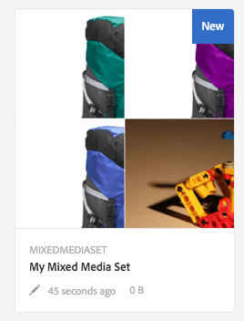

# Conjuntos de mídia mista{#mixed-media-sets}

Os Conjuntos de mídias mistas permitem que você forneça uma combinação de imagens, Conjuntos de imagens, Conjuntos de rotação e vídeos em uma apresentação.

Os Conjuntos de mídias mistas são designados por um banner com a palavra **[!UICONTROL MixedMediaSet]**. Além disso, se o Conjunto de mídias mistas for publicado, a data de publicação, indicada pelo ícone **[!UICONTROL Mundo]**, estará no banner junto com a última data de modificação, indicada pelo ícone **[!UICONTROL Lápis]**.

>[!NOTE]
>
>Para obter informações sobre a interface do usuário do Assets, consulte [Gerenciar ativos com a interface de toque](/help/assets/manage-digital-assets.md).

## Início rápido: Conjuntos de mídia mista {#quick-start-mixed-media-sets}

Para ativar e executar rapidamente com Conjuntos de mídias mistas, siga estas etapas:

1. [Fazer upload de seus ativos](#uploading-assets).

   Comece carregando as imagens e os vídeos dos Conjuntos de mídias mistas. Se necessário, crie seus [Conjuntos de imagens](/help/assets/dynamic-media/image-sets.md) e [Conjuntos de rotação](/help/assets/dynamic-media/spin-sets.md). Como os usuários podem ampliar imagens no Visualizador de conjunto de mídias mistas, verifique se você considera o zoom ao escolher imagens. Certifique-se de que as imagens tenham pelo menos 2000 pixels no tamanho maior.

   Consulte [Dynamic Media - Formatos de imagem rasterizada compatíveis](/help/assets/file-format-support.md#image-support-dynamic-media) para obter uma lista de formatos suportados por Conjuntos de mídias mistas.

1. [Criar conjuntos de mídia mista](#creating-mixed-media-sets).

   Para criar um Conjunto de mídias mistas, na página Ativos, acesse **[!UICONTROL Criar]** > **[!UICONTROL Conjunto de mídias mistas]** e nomeie o conjunto, escolha os ativos e escolha a ordem em que as imagens serão exibidas.

   Consulte [Trabalhar com seletores](/help/assets/dynamic-media/working-with-selectors.md).

1. Configurar [Predefinições do visualizador de mídia mista](/help/assets/dynamic-media/managing-viewer-presets.md), conforme necessário.

   Os administradores podem criar ou modificar as Predefinições do visualizador de conjunto de mídia mista. Para ver sua mídia mista com uma predefinição do visualizador, selecione o conjunto de mídias mistas e, no menu suspenso do painel à esquerda, selecione **[!UICONTROL Visualizadores]**.

   Para criar ou editar predefinições do visualizador, navegue até **[!UICONTROL Ferramentas]** > **[!UICONTROL Ativos]** > **[!UICONTROL Predefinições do visualizador]**.

   Consulte [Adicionar e editar predefinições do visualizador](/help/assets/dynamic-media/managing-viewer-presets.md).

1. [Visualizar conjuntos de mídia mista](#previewing-mixed-media-sets).

   Selecione o Conjunto de mídias mistas e você pode visualizá-lo. Para examinar seu Conjunto de mídias mistas no Visualizador selecionado, selecione os ícones de miniatura. Você pode escolher visualizadores diferentes do **[!UICONTROL Visualizadores]** , disponível no menu suspenso do painel à esquerda.

1. [Publicar conjuntos de mídia mista](#publishing-mixed-media-sets).

   A publicação de um Conjunto de mídias mistas ativa o URL e a cadeia de caracteres de inserção. Além disso, você deve [publicar a predefinição do visualizador](/help/assets/dynamic-media/managing-viewer-presets.md#publishing-viewer-presets).

1. [Vincular URLs ao seu aplicativo web](/help/assets/dynamic-media/linking-urls-to-yourwebapplication.md) ou [Incorporar o visualizador de vídeo ou imagem](/help/assets/dynamic-media/embed-code.md).

   O Adobe Experience Manager Assets cria chamadas de URL para Conjuntos de mídia mista e as ativa após publicar os conjuntos de mídia mista. Você pode copiar esses URLs ao visualizar ativos. Como alternativa, você pode incorporá-los ao seu site.

   Selecione o Conjunto de mídias mistas e, no menu suspenso do painel à esquerda, selecione **[!UICONTROL Visualizadores]**.

   Consulte [Vincular um conjunto de mídias mistas a uma página da Web](/help/assets/dynamic-media/linking-urls-to-yourwebapplication.md) e [Incorporar o visualizador de vídeo ou imagem](/help/assets/dynamic-media/embed-code.md).

Se necessário, é possível editar [Conjuntos de mídia mista](#editing-mixed-media-sets). Além disso, você pode visualizar e modificar [Propriedades do Conjunto de mídias mistas](/help/assets/manage-digital-assets.md#editing-properties).

>[!NOTE]
>
>Se tiver problemas ao criar conjuntos, consulte [Solução de problemas do Dynamic Media](/help/assets/dynamic-media/troubleshoot-dm.md).

## Fazer upload de ativos {#uploading-assets}

Comece carregando as imagens e os vídeos dos Conjuntos de mídias mistas. Lembre-se de que os usuários podem ampliar imagens no Visualizador de conjunto de mídias mistas. Assim, escolha imagens com essa capacidade de zoom em mente. Certifique-se de que as imagens tenham pelo menos 2000 pixels no tamanho maior.

Além disso, se você quiser adicionar conjuntos de rotação ou conjuntos de imagens ao conjunto de mídia mista, crie-os também.

Consulte [Dynamic Media - Formatos de imagem rasterizada compatíveis](/help/assets/file-format-support.md#image-support-dynamic-media) para obter uma lista de formatos suportados por Conjuntos de mídias mistas.

## Criar conjuntos de mídia mista {#creating-mixed-media-sets}

Você pode adicionar imagens, conjuntos de imagens, conjuntos de rotação e vídeos ao seu conjunto de mídias mistas. Verifique se os arquivos, os conjuntos de imagens e os conjuntos de rotação estão prontos para publicação antes de adicioná-los ao Conjunto de mídias mistas.

Ao adicionar ativos ao seu conjunto, eles são automaticamente adicionados em ordem alfanumérica. Você pode reorganizar ou classificar ativos manualmente após sua adição.

**Para criar Conjuntos de mídias mistas:**

1. No Assets, navegue até o local em que deseja criar um conjunto de mídia mista e selecione **[!UICONTROL Criar]** e selecione **[!UICONTROL Conjunto de mídias mistas]**. Além disso, crie o conjunto de dentro de uma pasta que contenha seus ativos. O Editor do conjunto de mídias mistas é exibido.

   

1. No Editor do conjunto de mídias mistas, em **[!UICONTROL Título]**, digite um nome para o Conjunto de mídias mistas. O nome aparece no banner através do Conjunto de mídias mistas. Opcionalmente, informe uma descrição.

   

   >[!NOTE]
   >
   >Ao criar o conjunto de mídias mistas, você pode alterar a miniatura do conjunto de mídias mistas ou permitir que o Experience Manager selecione a miniatura automaticamente com base nos ativos no conjunto de mídias mistas. Para selecionar uma miniatura, selecione **[!UICONTROL Alterar miniatura]** e selecione qualquer imagem (você também pode navegar para outras pastas para localizar imagens). Se tiver selecionado uma miniatura e decidir que deseja que o Experience Manager gere uma a partir do conjunto de mídias mistas, selecione **[!UICONTROL Alterar para Miniatura Automática]**.

1. Para selecionar ativos que deseja incluir no Conjunto de mídias mistas, selecione o Seletor de ativos. Selecione-os e selecione **[!UICONTROL Selecionar]**.

   Com o Seletor de ativos, procure por ativos ao digitar uma palavra-chave e selecionar **[!UICONTROL Retorno]**. Aplique filtros para refinar os resultados da pesquisa. Filtre por caminho, coleção, tipo de arquivo e tag. Selecione o filtro e depois selecione o **[!UICONTROL Filtro]** ícone na barra de ferramentas. Altere a exibição ao clicar no ícone **[!UICONTROL Exibição]** e selecionar **[!UICONTROL Exibição em lista]**, **[!UICONTROL Exibição em coluna]** ou **[!UICONTROL Exibição de cartão]**.

   Consulte [Trabalhar com seletores](/help/assets/dynamic-media/working-with-selectors.md).

   

1. Reorganize os ativos arrastando-os para cima ou para baixo na lista (é necessário selecionar a variável **[!UICONTROL Reordenar]** ícone ), conforme necessário.

   

   Se quiser adicionar miniaturas, selecione a opção **+** **[!UICONTROL miniatura]** ícone ao lado da imagem e navegue até a miniatura desejada. Quando terminar de selecionar todas as imagens em miniatura, selecione **[!UICONTROL Salvar]**.

   >[!NOTE]
   >
   >Se desejar adicionar ativos, selecione **[!UICONTROL Adicionar ativo]**.

1. Para excluir um ativo, marque a caixa de seleção correspondente e selecione **[!UICONTROL Excluir ativo]**.
1. Para aplicar uma predefinição, selecione **[!UICONTROL Predefinição]** no canto superior direito e selecione uma predefinição para aplicar aos ativos.
1. Selecione **[!UICONTROL Salvar]**. O Conjunto de mídias mistas recém-criado é exibido na pasta em que você o criou.

## Editar conjuntos de mídia mista {#editing-mixed-media-sets}

Você pode executar várias tarefas de edição em ativos em Conjuntos de mídias mistas diretamente na interface do usuário [como você faria com qualquer ativo em Ativos](/help/assets/manage-digital-assets.md). Você também pode executar as seguintes ações em Conjuntos de mídias mistas:

* Adicione ativos ao Conjunto de mídias mistas.
* Reordenar ativos no Conjunto de mídias mistas.
* Exclua ativos no Conjunto de mídias mistas.
* Aplicar predefinições do visualizador.
* Altere a miniatura padrão.

**Para editar Conjuntos de mídias mistas:**

1. Siga um destes procedimentos:

   * Passe o mouse sobre um ativo Conjunto de mídias mistas, em seguida, selecione **[!UICONTROL Editar]** (ícone de lápis).
   * Passe o mouse sobre um ativo Conjunto de mídias mistas, selecione **[!UICONTROL Selecionar]** (ícone de marca de seleção), em seguida selecione **[!UICONTROL Editar]** na barra de ferramentas.

   * Selecione um ativo Conjunto de mídias mistas e depois selecione **[!UICONTROL Editar]** (ícone de lápis) na barra de ferramentas.

1. No Editor do conjunto de mídias mistas, siga um destes procedimentos:

   * Para reorganizar ativos - No painel esquerdo, selecione **[!UICONTROL Ativos]** (ícone de imagem), arraste um ativo para um novo local.
   * Para adicionar ativos - Na barra de ferramentas, selecione **[!UICONTROL Adicionar ativo]**. Navegue até os ativos. Para cada ativo que deseja adicionar, passe o mouse sobre a imagem do ativo (não o nome do ativo) e selecione o ícone de marca de seleção. No canto superior direito, selecione **[!UICONTROL Selecionar]**.

   * Para excluir um ativo - No painel esquerdo, selecione **[!UICONTROL Ativos]** (ícone de imagem), em seguida, selecione o ativo. Na barra de ferramentas, selecione **[!UICONTROL Excluir ativo]**.

   * Para classificar ativos pelo nome em ordem crescente ou decrescente, no painel esquerdo, selecione **[!UICONTROL Ativos]** (ícone de imagem). À direita do **[!UICONTROL Ativos]** selecione os ícones de sinal de interpolação para cima ou para baixo.

      >[!NOTE]
      >
      >* Para excluir um Conjunto de mídias mistas inteiro, de qualquer modo de exibição (como **[!UICONTROL Exibição de cartão]** ou **[!UICONTROL Exibição de coluna]**) navegue até o Conjunto de mídias mistas. Passe o mouse sobre o ativo e selecione o ícone de marca de seleção para selecioná-lo. Press **[!UICONTROL Backspace]** no teclado ou selecione **[!UICONTROL Mais]** (três pontos) na barra de ferramentas, em seguida, selecione **[!UICONTROL Excluir]**.
      >
      >* Edite os ativos em um Conjunto de mídias mistas ao navegar até o conjunto. No painel à esquerda, selecione **[!UICONTROL Definir membros]**, em seguida, selecione o **[!UICONTROL Lápis]** ícone em um ativo individual para abrir a janela de edição.

1. Selecionar **[!UICONTROL Salvar]** quando terminar a edição.

   >[!NOTE]
   >
   >* Para editar os ativos em um Conjunto de mídias mistas - Navegue até o Conjunto de mídias mistas. Toque (não selecione) no conjunto para abri-lo na página Visualização do conjunto de Experience Manager. No painel à esquerda, selecione o sinal de seta para baixo para abrir a lista suspensa e selecione **[!UICONTROL Definir membros]**. Na página Definir membros , passe o mouse sobre um ativo e selecione **[!UICONTROL Editar]** (ícone de lápis) para abrir a página de edição.
   >
   >* Para excluir um conjunto de mídia mista inteiro - A partir de qualquer modo de exibição (como a Exibição de cartão ou em Coluna), navegue até o conjunto de mídias mistas. Passe o mouse sobre o conjunto e selecione **[!UICONTROL Selecionar]** (ícone de marca de seleção). Press **[!UICONTROL Backspace]** no teclado ou selecione **[!UICONTROL Mais]** (linha de três pontos), em seguida selecione **[!UICONTROL Excluir]**.

## Visualizar conjuntos de mídia mista {#previewing-mixed-media-sets}

Consulte [Visualizar ativos](/help/assets/dynamic-media/previewing-assets.md) para obter detalhes sobre como visualizar Conjuntos de mídias mistas.

## Publicar conjuntos de mídia mista {#publishing-mixed-media-sets}

Consulte [Publicar ativos](/help/assets/dynamic-media/publishing-dynamicmedia-assets.md) para obter detalhes sobre como publicar Conjuntos de mídias mistas.

>[!NOTE]
>
>Se o conjunto de mídia mista não terminar totalmente no serviço de delivery na primeira vez que você o publicar, publique o conjunto de mídia mista uma segunda vez.
