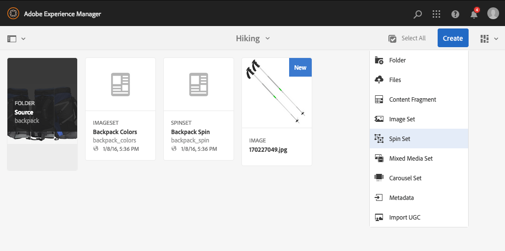

# Conjuntos de rotação{#spin-sets}

Um Conjunto de rotação simula o ato do mundo real de virar um objeto para examiná-lo. Os Conjuntos de rotação permitem a visualização de itens de qualquer ângulo, obtendo os principais detalhes visuais de qualquer ângulo.

Um Conjunto de rotação simula uma experiência de visualização de 360°. O Dynamic Media oferece Conjuntos de rotação de eixo único nos quais os visualizadores podem girar um item. Além disso, os usuários podem aplicar o zoom de forma &quot;livre&quot; e deslocar qualquer uma das visualizações com apenas alguns cliques. Dessa forma, os usuários podem examinar um item mais detalhadamente de um ponto de vista específico.

Os conjuntos de rotação são designados por um banner com a palavra **[!UICONTROL SPINSET]**. Além disso, se o Conjunto de rotação for publicado, a data de publicação, indicada pelo ícone **[!UICONTROL Mundo]**, estará no banner junto com a última data de modificação, indicada pelo ícone **[!UICONTROL Lápis]**.

>[!NOTE]
>
>Para obter informações sobre a interface do usuário do Assets, consulte [Gerenciamento de ativos com a interface para toque](/help/assets/manage-digital-assets.md) e aplique-a a uma nova pasta na qual os ativos do conjunto de imagens são carregados.

Ao criar um Conjunto de rotação, a Adobe recomenda a seguinte prática recomendada e impõe o seguinte limite:

| Tipo de limite | Prática recomendada | Limite imposto |
| --- | --- | --- |
| Número máximo de linhas/colunas por conjunto 2D | 12 a 18 imagens por conjunto | 1000 |

Consulte também [limitações do Dynamic Media](/help/assets/dynamic-media/limitations.md).

## Início rápido: conjuntos de rotação {#quick-start-spin-sets}

Para começar a usar rapidamente os Conjuntos de rotação, siga estas etapas:

1. Opcional. [Crie uma predefinição de conjunto de lotes](/help/assets/dynamic-media/batch-set-presets-dm.md) e aplique-a a uma nova pasta de ativos.

   Uma predefinição de conjunto de lotes pode ajudar a automatizar a criação do conjunto de rotação.

   >[!IMPORTANT]
   >
   >Os conjuntos em lotes são criados pelo IPS (Sistema de produção de imagem) como parte da assimilação de ativos.

1. [Carregue suas imagens para várias exibições](#uploading-assets-for-spin-sets).

   No mínimo, você precisa de 8 a 12 imagens de um item para um Conjunto de rotação unidimensional e 16 a 24 para um Conjunto de rotação bidimensional. As fotos devem ser tiradas em intervalos regulares para dar a impressão de que o item está girando e sendo virado. Por exemplo, se um Conjunto de rotação unidimensional incluir 12 disparos, gire o item 30° (360/12) para cada disparo.

   Consulte [Dynamic Media - Formatos de imagem de varredura compatíveis](/help/assets/file-format-support.md#image-support-dynamic-media) para obter uma lista de formatos compatíveis com Conjuntos de rotação.

1. [Criar Conjuntos de Rotação](#creating-spin-sets).

   Para criar um Conjunto de rotação, selecione **[!UICONTROL Criar]** > **[!UICONTROL Conjunto de rotação]** e nomeie o conjunto, escolha os ativos e a ordem em que as imagens serão exibidas.

   Consulte [Trabalhar com seletores](/help/assets/dynamic-media/working-with-selectors.md).

1. Configure [predefinições do Visualizador de conjunto de rotação](/help/assets/dynamic-media/managing-viewer-presets.md), conforme necessário.

   Os administradores podem criar ou modificar as Predefinições do visualizador de conjunto de rotação. Para ver seu conjunto de rotação com uma predefinição do visualizador, selecione o conjunto de rotação e, no menu suspenso do painel à esquerda, selecione **Visualizadores**.

   Para criar ou editar predefinições do visualizador, consulte **[!UICONTROL Ferramentas]** > **[!UICONTROL Assets]** > **[!UICONTROL Predefinições do Visualizador]**.

   Consulte [Adicionar e editar predefinições do visualizador](/help/assets/dynamic-media/managing-viewer-presets.md).

   É possível visualizar e acessar conjuntos criados por meio de predefinições de conjuntos em lotes de três maneiras diferentes. (Conjuntos criados usando predefinições de conjunto de lotes, *não*, aparecem na interface do usuário.)

1. [Visualizar conjuntos de rotação](/help/assets/dynamic-media/previewing-assets.md).

   Selecione o Conjunto de rotação e você pode visualizá-lo. Gire o grupo de rotação. Você pode escolher visualizadores diferentes no menu **[!UICONTROL Visualizadores]**, disponível no menu suspenso do painel esquerdo.

1. [Publicar Conjuntos de Rotação](/help/assets/dynamic-media/publishing-dynamicmedia-assets.md).

   A publicação de um Conjunto de rotação ativa o URL e a Cadeia de caracteres incorporada. Além disso, você deve [publicar a predefinição do visualizador](/help/assets/dynamic-media/managing-viewer-presets.md).

1. [Vincular URLs ao Aplicativo Web](/help/assets/dynamic-media/linking-urls-to-yourwebapplication.md) ou [Incorporar o Visualizador de Vídeo ou Imagem](/help/assets/dynamic-media/embed-code.md).

   O Adobe Experience Manager Assets cria chamadas de URL para Conjuntos de rotação e as ativa após a publicação dos conjuntos de rotação. É possível copiar esses URLs ao visualizar ativos. Como alternativa, você pode incorporá-los ao seu site.

   Selecione o Conjunto de rotação e, no menu suspenso do painel à esquerda, selecione **[!UICONTROL Visualizadores]**.

   Consulte [Vincular um Conjunto de Rotação a uma página da Web](/help/assets/dynamic-media/linking-urls-to-yourwebapplication.md) e [Incorporar o Visualizador de Vídeo ou Imagem](/help/assets/dynamic-media/embed-code.md).

Se necessário, você pode [editar Conjuntos de rotação](#editing-spin-sets). Além disso, você pode exibir e modificar [propriedades do Conjunto de rotação](/help/assets/manage-digital-assets.md#editing-properties).

## Fazer upload de ativos para Conjuntos de rotação {#uploading-assets-for-spin-sets}

No mínimo, você precisa de 8 a 12 imagens de um item para um Conjunto de rotação unidimensional. As fotos devem ser tiradas em intervalos regulares para dar a impressão de que o item está girando e sendo virado. Por exemplo, se um Conjunto de rotação unidimensional incluir 12 disparos, gire o item 30° (360/12) para cada disparo.

Consulte [Dynamic Media - Formatos de imagem de varredura compatíveis](/help/assets/file-format-support.md#image-support-dynamic-media) para obter uma lista de formatos compatíveis com Conjuntos de rotação.

É possível carregar imagens para os Conjuntos de rotação da mesma maneira que você [carregaria qualquer outro ativo no Experience Manager Assets](/help/assets/manage-digital-assets.md).

### Diretrizes para captura de imagens para seu Spin Set {#guidelines-for-shooting-spin-set-images}

Veja a seguir algumas práticas recomendadas para imagens do conjunto de rotação. Em geral, quanto mais imagens você tiver em um Conjunto de rotação, melhor será o efeito de rotação da imagem. No entanto, a inclusão de muitas imagens no conjunto também aumenta a quantidade de tempo que as imagens levam para serem carregadas. A Experience Manager recomenda estas diretrizes para fotografar imagens para uso em conjuntos de rotação:

* No mínimo, use 8 a 12 imagens em um conjunto de rotação unidimensional e 16 a 24 imagens em um Conjunto de rotação bidimensional. É necessário um mínimo de 8 imagens para girar 360°. Os Conjuntos de rotação unidimensionais são mais comuns, pois criar Conjuntos de rotação bidimensionais é uma tarefa trabalhosa.
* Usar um formato sem perdas; TIFF e PNG são recomendados.
* Mascarar todas as imagens para que o item apareça em branco puro ou em outro plano de fundo de alto contraste. Como opção, adicione sombras.
* Verifique se os detalhes do produto estão bem iluminados e em foco.
* Faça imagens giratórias para roupas de moda com um manequim ou modelo. Muitas vezes, o manequim é mascarado (usando um manequim de vidro) ou um manequim estilizado/costureira é mostrado na imagem. Você pode criar um conjunto de rotação no modelo definindo o número de ângulos. Marque cada ângulo com fita no chão para que você possa guiar o modelo para pisar e olhar na direção de cada tomada.

## Criar conjuntos de rotação {#creating-spin-sets}

Esta seção descreve como criar conjuntos de rotação.

>[!NOTE]
>
>Também é possível criar conjuntos de rotação automaticamente por meio de [predefinições de conjuntos em lotes](/help/assets/dynamic-media/config-dm.md). **Importante:** os conjuntos em lotes são criados pelo IPS (Sistema de produção de imagem) como parte da ingestão de ativos.
>
>Consulte &quot;Criar predefinições de conjunto de lotes para gerar automaticamente Conjuntos de Imagens e Conjuntos de Rotação&quot; em [Configurar Dynamic Media](/help/assets/dynamic-media/config-dm.md).

>[!NOTE]
>
>A ordem em que as imagens aparecem em um conjunto de rotação é importante. Certifique-se de ordená-los para que a rotação seja uma vista suave de 360°.

Ao criar um Conjunto de rotação, a Adobe recomenda a seguinte prática recomendada e impõe o seguinte limite:

| Tipo de limite | Prática recomendada | Limite imposto |
| --- | --- | --- |
| Número máximo de linhas/colunas por conjunto 2D | 12 a 18 imagens por conjunto | 1000 |

Consulte também [limitações do Dynamic Media](/help/assets/dynamic-media/limitations.md).

**Para criar Conjuntos de Rotação:**

1. No Assets, navegue até o local em que deseja criar um conjunto de rotação, selecione **[!UICONTROL Criar]** e **[!UICONTROL Conjunto de Rotação]**. Você também pode criar o conjunto de dentro de uma pasta que contenha seus ativos.

   

1. No Editor de conjunto de rotação, no campo **[!UICONTROL Título]**, digite um nome para o conjunto de rotação. O nome aparece no banner no Spin Set. Opcionalmente, informe uma descrição.

   

   >[!NOTE]
   >
   >Ao criar o conjunto de rotação, você pode alterar a miniatura do conjunto de rotação ou permitir que o Experience Manager selecione a miniatura automaticamente com base nos ativos no conjunto de rotação. Para selecionar uma miniatura, selecione **[!UICONTROL Alterar miniatura]** e selecione qualquer imagem (você também pode navegar para outras pastas para localizar imagens). Se tiver selecionado uma miniatura e decidir que deseja que o Experience Manager gere uma a partir do conjunto de rotação, selecione **[!UICONTROL Alternar para Miniatura automática]**.

1. Siga um destes procedimentos:

   * Próximo ao canto superior esquerdo da página Editor do grupo de rotação, selecione **[!UICONTROL Adicionar ativo]**.

   * Próximo ao meio da página Editor do grupo de rotação, selecione **[!UICONTROL Selecionar para abrir o Seletor de ativos]**.

   Selecione os ativos que deseja incluir no Spin Set. Os ativos selecionados têm um ícone de marca de seleção sobre eles. Quando terminar, próximo ao canto superior direito da página, selecione **[!UICONTROL Selecionar]**.

   Com o Seletor de ativos, procure por ativos ao digitar uma palavra-chave e tocar em **[!UICONTROL Retornar]**. Aplique filtros para refinar os resultados da pesquisa. Filtre por caminho, coleção, tipo de arquivo e tag. Selecione o filtro e o ícone **[!UICONTROL Filtro]** na barra de ferramentas. Altere a exibição ao tocar no ícone Exibir e selecionar **[!UICONTROL Exibição em coluna]**, **[!UICONTROL Exibição de cartão]** ou **[!UICONTROL Exibição em lista]**.

   Consulte [Trabalhar com seletores](/help/assets/dynamic-media/working-with-selectors.md).

   

1. Ao adicionar ativos ao conjunto, eles são automaticamente adicionados em ordem alfanumérica. Você pode reordenar ou classificar manualmente os ativos depois de adicioná-los.

   Se necessário, arraste o ícone Reordenar de um ativo à direita do nome do arquivo do ativo para reordenar imagens para cima ou para baixo na lista definida.

   

   Reordenando o Quadro 11 no conjunto de rotação arrastando-o para um novo local.

1. (Opcional) Siga qualquer um destes procedimentos:

   * Para excluir uma imagem, selecione-a e selecione **[!UICONTROL Excluir ativo]**.

   * Para aplicar uma predefinição, próximo ao canto superior direito da página, selecione **[!UICONTROL Predefinição]** e, em seguida, selecione uma predefinição para aplicar a todos os ativos ao mesmo tempo.

1. Selecione **[!UICONTROL Salvar]**. O conjunto de rotação criado aparece na pasta em que você o criou.

## Visualizar conjuntos de rotação {#viewing-spin-sets}

É possível criar conjuntos de rotação na interface do usuário ou automaticamente usando [predefinições de conjunto de lotes](/help/assets/dynamic-media/config-dm.md). No entanto, conjuntos criados usando predefinições de conjunto de lotes, *não*, aparecerão na interface do usuário. É possível acessar conjuntos criados por meio de predefinições de conjuntos em lotes de três maneiras diferentes. (Esses métodos estão disponíveis mesmo se você tiver criado os conjuntos de rotação na interface do usuário do ).

>[!NOTE]
>
>Você também pode visualizar conjuntos por meio da interface do usuário conforme descrito em [Editar conjuntos de rotação](#editing-spin-sets).

**Para exibir Conjuntos de Rotação:**

1. Ao abrir as propriedades de um ativo individual. As propriedades indicam quais conjuntos o ativo selecionado é membro de (em **[!UICONTROL Membro de Conjuntos]**). Para ver o conjunto inteiro, selecione o nome do conjunto.

   

1. A partir de uma imagem de membro de qualquer conjunto. Selecione o menu **[!UICONTROL Conjuntos]** para exibir os conjuntos dos quais o ativo é membro.

   

1. Na pesquisa, você pode selecionar **[!UICONTROL Filtros]**, expandir o **[!UICONTROL Dynamic Media]** e selecionar **[!UICONTROL Conjuntos]**.

   A pesquisa retorna conjuntos correspondentes que foram criados manualmente na interface do usuário ou criados automaticamente por meio de predefinições de conjunto de lotes. Para conjuntos automatizados, a consulta de pesquisa é conduzida usando o critério de pesquisa `Starts with`, que é diferente da pesquisa do Experience Manager, que é baseada no uso do critério de pesquisa `Contains`. Configurar o filtro como **[!UICONTROL Conjuntos]** é a única maneira de pesquisar conjuntos automatizados.

   

## Editar conjuntos de rotação {#editing-spin-sets}

É possível executar várias tarefas de edição em Conjuntos de rotação, como as seguintes:

* Adicione imagens ao Spin Set.
* Reordenar imagens no Spin Set.
* Excluir ativos no Spin Set.
* Aplicar predefinições do visualizador.
* Exclua o grupo de rotação.

**Para editar Conjuntos de Rotação:**

1. Siga um destes procedimentos:

   * Passe o mouse sobre um ativo de Conjunto de rotação e selecione **[!UICONTROL Editar]** (ícone de lápis).
   * Passe o mouse sobre um ativo de Conjunto de rotação, selecione **[!UICONTROL Selecionar]** (ícone de marca de seleção) e **[!UICONTROL Editar]** na barra de ferramentas.

   * Selecione um ativo de Conjunto de rotação e selecione **[!UICONTROL Editar]** (ícone de lápis) na barra de ferramentas.

1. Para editar o Conjunto de rotação, siga um destes procedimentos:

   * Para reordenar imagens, arraste uma imagem para um novo local (selecione o ícone reordenar para mover itens).
   * Para classificar itens em ordem crescente ou decrescente, selecione o cabeçalho da coluna.
   * Para adicionar ou atualizar um ativo existente, selecione **[!UICONTROL Adicionar ativo]**. Navegue até um ativo, selecione-o e, em seguida, selecione **[!UICONTROL Selecionar]** próximo ao canto superior direito.
Se você excluir a imagem que o Experience Manager usa para a miniatura substituindo-a por outra imagem, o ativo original ainda será exibido.
   * Para excluir um ativo, selecione-o e selecione **[!UICONTROL Excluir ativo]**.
   * Para aplicar uma predefinição, selecione o ícone Predefinição e selecione uma predefinição.
   * Para excluir um Conjunto de rotação inteiro, navegue até o Conjunto de rotação, selecione-o e **[!UICONTROL Excluir]**

   >[!NOTE]
   >
   >Edite as imagens em um Conjunto de imagens ao navegar até o conjunto, selecionar **[!UICONTROL Definir membros]** no painel à esquerda e selecionar o ícone Lápis em um ativo individual para abrir a janela de edição.

1. Selecione **[!UICONTROL Salvar]** ao concluir a edição.

## Visualizar conjuntos de rotação {#previewing-spin-sets}

Consulte [Visualizar ativos](/help/assets/dynamic-media/previewing-assets.md).

## Publicar conjuntos de rotação {#publishing-spin-sets}

Consulte [Publicar ativos](/help/assets/dynamic-media/publishing-dynamicmedia-assets.md).
