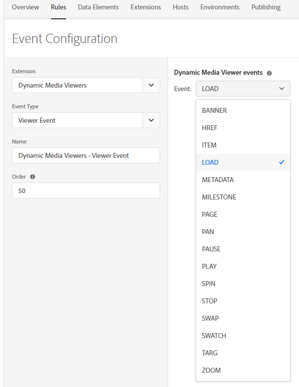
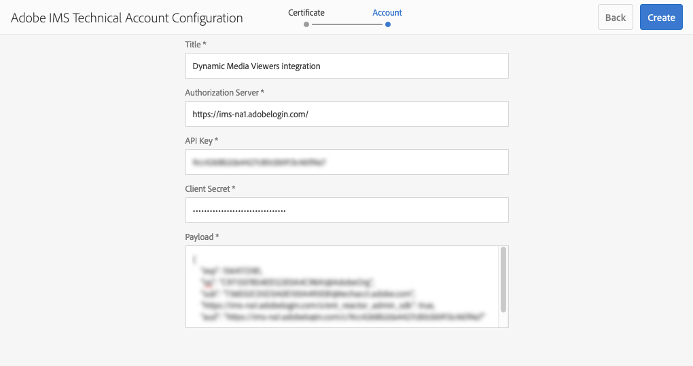
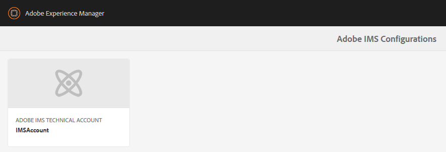

# Integrar visualizadores do Dynamic Media com tags do Analytics e da Adobe Experience Platform {#integrating-dynamic-media-viewers-with-adobe-analytics-and-adobe-launch}

## O que é a integração do Dynamic Media Viewers com as tags Adobe Analytics e Experience Platform? {#what-is-dynamic-media-viewers-integration-with-adobe-analytics-and-adobe-launch}

<!-- Leave this hidden path here; it points to the topic source from Sasha https://wiki.corp.adobe.com/pages/viewpage.action?spaceKey=~oufimtse&title=Dynamic+Media+Viewers+integration+with+Adobe+Launch 

name used to be Experience Platform Launch. Changed to Experience Platform Data Collection-->

*Visualizadores do Dynamic Media* extensão para Tags Experience Platform e Dynamic Media Viewers 5.13, permite que os clientes das Tags Adobe Analytics e Experience Platform usem eventos e dados específicos para os Visualizadores Dynamic Media em sua configuração de Tags Experience Platform.

Essa integração significa que você pode rastrear o uso dos Visualizadores do Dynamic Media em seu site com o Adobe Analytics. Ao mesmo tempo, você pode usar os eventos e os dados expostos pelos visualizadores com qualquer outra extensão de Tags de Experience Platform que venha do Adobe ou de terceiros.

Para saber mais sobre extensões do Adobe ou extensões de terceiros, consulte [extensões do Adobe](https://experienceleague.adobe.com/docs/experience-platform/tags/extensions/overview.html) no Guia do usuário de tags Experience Platform.

**Este tópico destina-se ao seguinte:** Administradores de site, desenvolvedores no programa Adobe Experience Manager e pessoas em Operações.

### Limitações da integração {#limitations-of-the-integration}

* A integração de tags do Experience Platform para visualizadores do Dynamic Media não funciona no nó do autor do Experience Manager. Não é possível ver nenhum rastreamento de uma página WCM até que ela seja publicada.
* A integração de tags Experience Platform para visualizadores do Dynamic Media não é compatível com o modo de operação &quot;pop-up&quot;, em que o URL do visualizador é obtido usando o botão &quot;URL&quot; na página Detalhes do ativo.
* A integração das tags Experience Platform não pode ser usada simultaneamente com os visualizadores herdados Integração do Analytics (por meio da `config2=` parâmetro).
* O suporte para rastreamento de vídeo está limitado apenas ao rastreamento principal de reprodução, conforme descrito em [Visão geral do rastreamento](https://experienceleague.adobe.com/docs/media-analytics/using/tracking/track-av-playback/track-core-overview.html?lang=en#player-events). Especificamente, o rastreamento de QoS, Anúncios, Capítulo/Segmentos ou Erros não é compatível.
* A configuração da Duração do armazenamento para Elementos de dados não é compatível com Elementos de dados que usam o *Visualizadores do Dynamic Media* extensão. A duração do armazenamento deve ser definida como **[!UICONTROL Nenhum]**.

### Casos de uso para a integração do {#use-cases-for-the-integration}

O principal caso de uso para a integração com tags Experience Platform são os clientes que usam Experience Manager Assets e Experience Manager Sites. Nesses cenários, é possível configurar uma integração padrão entre o nó do autor do Experience Manager e as tags do Experience Platform e, em seguida, associar a instância do Sites à propriedade tags do Experience Platform. Depois disso, qualquer componente WCM do Dynamic Media adicionado a uma página do Sites rastreará os dados e eventos dos visualizadores.

Consulte [Rastrear visualizadores do Dynamic Media no Experience Manager Sites](#tracking-dynamic-media-viewers-in-aem-sites).

Um caso de uso secundário compatível com a integração são os clientes que usam somente o Experience Manager Assets ou o Dynamic Media Classic. Nesses casos, você obtém o código incorporado do visualizador e o adiciona à página do site. Em seguida, obtenha o URL de produção da biblioteca de Tags de Experience Platform das Tags de Experience Platform e adicione-o manualmente ao código da página da Web.

Consulte [Rastrear visualizadores do Dynamic Media usando o código incorporado](#tracking-dynamic-media-viewers-using-embed-code).

## Como o rastreamento de dados e eventos funciona na integração {#how-data-and-event-tracking-works-in-the-integration}

A integração aproveita dois tipos separados e independentes de rastreamento do Dynamic Media Viewers: *Adobe Analytics* e *Adobe Analytics para áudio e vídeo*.

### Sobre o rastreamento usando o Adobe Analytics  {#about-tracking-using-adobe-analytics}

O Adobe Analytics permite rastrear as ações executadas pelo usuário quando ele interage com os Visualizadores do Dynamic Media no seu site. O Adobe Analytics também permite rastrear dados específicos do visualizador. Por exemplo, é possível rastrear e registrar eventos de carregamento de exibição junto com o nome do ativo, ações de zoom ocorridas e ações de reprodução de vídeo.

Nas Tags do Experience Platform, os conceitos de *Elementos de dados* e *Regras* trabalhe em conjunto para ativar o rastreamento do Adobe Analytics.

#### Sobre os elementos de dados nas tags Experience Platform {#about-data-elements-in-adobe-launch}

Um elemento de dados nas tags Experience Platform é uma propriedade nomeada cujo valor é definido estaticamente ou calculado dinamicamente com base no estado de uma página da Web ou dados de visualizadores do Dynamic Media.

As opções disponíveis para uma definição de Elemento de dados dependem da lista de Extensões instaladas na Propriedade das Tags de Experience Platform. A extensão &quot;Principal&quot; é pré-instalada e está disponível imediatamente em qualquer configuração. Essa extensão &quot;principal&quot; permite definir um Elemento de dados cujo valor vem do cookie, código JavaScript, sequência de consulta e muitas outras fontes.

Para o rastreamento de Adobe Analytics, várias outras extensões devem ser instaladas, conforme descrito em [Instalação e configuração de extensões](#installing-and-setup-of-extensions). A extensão Visualizadores do Dynamic Media adiciona a capacidade de definir um Elemento de dados cujo valor é um argumento do evento Visualizador dinâmico. Por exemplo, é possível fazer referência ao tipo de visualizador, ou ao nome do ativo relatado pelo visualizador na carga, ao nível de zoom relatado quando o usuário final amplia e muito mais.

A extensão do Visualizador do Dynamic Media mantém os valores de seus Elementos de dados atualizados automaticamente.

Depois de defini-lo, um Elemento de dados pode ser usado em outros locais da interface do usuário de Tags de Experience Platform, usando o widget Seletor de elementos de dados. Especificamente, os Elementos de dados definidos para fins de rastreamento dos Visualizadores do Dynamic Media são referenciados pela Ação Definir variáveis da extensão Adobe Analytics na Regra (veja abaixo).

Consulte [Elementos de dados](https://experienceleague.adobe.com/docs/experience-platform/tags/ui/data-elements.html) no Guia do usuário de tags Experience Platform.

#### Sobre regras nas tags Experience Platform {#about-rules-in-adobe-launch}

Uma regra nas tags Experience Platform é uma configuração agnóstica que define três áreas que compõem uma regra: *Eventos*, *Condições*, e *Ações*:

* *Eventos* (if) informe às Tags do Experience Platform quando acionar uma Regra.
* *Condições* (if) informe às Tags do Experience Platform quais outras restrições permitir ou proibir ao acionar uma Regra.
* *Ações* (então) informe às Tags do Experience Platform o que fazer quando uma Regra for acionada.

As opções disponíveis na seção Eventos, condições e ações dependem das extensões instaladas na propriedade Tags do Experience Platform. A variável *Núcleo* A extensão do é pré-instalada e está disponível pronta para uso em qualquer configuração. A extensão fornece várias opções para Eventos, como ações básicas no nível do navegador que incluem alteração de foco, pressionamentos de tecla e envio de formulários. Também inclui opções para Condições, como valor de cookie, tipo de navegador e muito mais. Para Ações, somente a opção Código personalizado está disponível.

Para rastreamento do Adobe Analytics, várias outras extensões devem ser instaladas, conforme descrito em [Instalação e configuração de extensões](#installing-and-setup-of-extensions). Especificamente:

* A extensão Visualizadores do Dynamic Media estende a lista de Eventos compatíveis para eventos específicos de visualizadores do Dynamic Media, como carga do visualizador, troca de ativos, aumento de zoom e reprodução de vídeo.
* A extensão do Adobe Analytics estende a lista de Ações compatíveis com duas ações necessárias para enviar dados aos servidores de rastreamento: *Definir variáveis* e *Enviar sinal*.

Para rastrear visualizadores do Dynamic Media, é possível usar qualquer um dos seguintes tipos:

* Eventos de extensão do Dynamic Media Viewers, extensão principal ou qualquer outra extensão.
* Condições na definição da Regra. Ou você pode deixar a área de condições vazia.

Na seção Ações, é necessário ter uma *Definir variáveis* ação. Essa ação informa ao Adobe Analytics como preencher variáveis de rastreamento com dados. Ao mesmo tempo, a *Definir variáveis* A ação não envia nada para o servidor de rastreamento.

A variável *Definir variáveis* a ação deve ser seguida de um *Enviar sinal* ação. A variável *Enviar sinal* essa ação realmente envia dados para o servidor de rastreamento do analytics. Ambas as ações, *Definir variáveis* e *Enviar sinal*, vêm da extensão do Adobe Analytics.

Consulte [Regras](https://experienceleague.adobe.com/docs/experience-platform/tags/ui/rules.html) no Guia do usuário de tags Experience Platform.

#### Exemplo de configuração {#sample-configuration}

O exemplo de configuração a seguir nas Tags do Experience Platform demonstra como rastrear um nome de ativo na carga do visualizador.

1. No **[!UICONTROL Elementos de dados]** defina um elemento de dados `AssetName` que faz referência a `asset` parâmetro do `LOAD` na extensão Dynamic Media Viewers.

   

1. No **[!UICONTROL Regras]** defina uma regra *TrackAssetOnLoad*.

   Nesta regra, a variável **[!UICONTROL Evento]** o campo usa o **[!UICONTROL CARREGAR]** na extensão Dynamic Media Viewers.

   

1. A configuração Ação tem dois tipos de Ação da extensão do Adobe Analytics:

   *Definir variáveis*, que mapeiam uma variável de análise de sua escolha para o valor de `AssetName` Elemento de dados.

   *Enviar sinal*, que envia informações de rastreamento para o Adobe Analytics.

   

1. A configuração de regra resultante é exibida da seguinte maneira:

   

### Sobre o Adobe Analytics para áudio e vídeo {#about-adobe-analytics-for-audio-and-video}

Quando uma conta Experience Cloud é assinada para usar o Adobe Analytics para áudio e vídeo, basta ativar o rastreamento de vídeo no *Visualizadores do Dynamic Media* configurações de extensão. As métricas de vídeo são disponibilizadas no Adobe Analytics. O rastreamento de vídeo depende da presença da extensão Adobe Medium Analytics para áudio e vídeo.

Consulte [Instalação e configuração de extensões](#installing-and-setup-of-extensions).

Atualmente, o suporte para rastreamento de vídeo está limitado apenas ao rastreamento de &quot;reprodução principal&quot;, conforme descrito em [Visão geral do rastreamento](https://experienceleague.adobe.com/docs/media-analytics/using/tracking/track-av-playback/track-core-overview.html?lang=en#player-events). Especificamente, o rastreamento de QoS, Anúncios, Capítulo/Segmentos ou Erros não é compatível.

## Usar a extensão Visualizadores do Dynamic Media {#using-the-dynamic-media-viewers-extension}

Tal como mencionado no [Casos de uso para a integração do](#use-cases-for-the-integration), é possível rastrear visualizadores do Dynamic Media com a nova integração de tags Experience Platform no Experience Manager Sites e usando o código de inserção.

### Rastrear visualizadores do Dynamic Media no Experience Manager Sites {#tracking-dynamic-media-viewers-in-aem-sites}

Para rastrear visualizadores do Dynamic Media no Experience Manager Sites, todas as etapas listadas na [Configurar todas as partes da integração](#configuring-all-the-integration-pieces) seção deve ser executada. Especificamente, você deve criar a configuração do IMS e a configuração da nuvem de tags do Experience Platform.

Após a configuração adequada, qualquer visualizador do Dynamic Media adicionado a uma página do Sites, usando um componente WCM compatível com o Dynamic Media, rastreia automaticamente os dados para o Adobe Analytics, o Adobe Analytics para vídeo ou ambos.

Consulte [Adicionar ativos do Dynamic Media a páginas usando o Adobe Sites](/help/assets/dynamic-media/adding-dynamic-media-assets-to-pages.md).

### Rastrear visualizadores do Dynamic Media usando o código incorporado {#tracking-dynamic-media-viewers-using-embed-code}

Os clientes que não usam o Experience Manager Sites, ou incorporam visualizadores do Dynamic Media em páginas da Web fora do Experience Manager Sites, ou ambas, ainda podem usar a integração de tags Experience Platform.

Conclua as etapas de configuração do [Configurar Adobe Analytics](#configuring-adobe-analytics-for-the-integration) e [Configurar tags de Experience Platform](#configuring-adobe-launch-for-the-integration) seções. No entanto, as etapas de configuração relacionadas ao Experience Manager não são necessárias.

Após a configuração adequada, é possível adicionar o suporte a tags Experience Platform a uma página da Web com um visualizador do Dynamic Media.

Consulte [Adicionar o código incorporado das tags Experience Platform](https://experienceleague.adobe.com/docs/platform-learn/implement-in-websites/configure-tags/add-embed-code.html) para saber mais sobre como usar o código incorporado da biblioteca de tags do Experience Platform.

Para saber mais sobre como usar o recurso de código incorporado do Experience Manager Dynamic Media, consulte [Incorporação do visualizador de vídeo ou imagem em uma página da Web](/help/assets/dynamic-media/embed-code.md).

**Rastrear visualizadores do Dynamic Media usando o código incorporado:**

1. Ter uma página da Web pronta para incorporar um visualizador do Dynamic Media.
1. Obtenha o código incorporado para a biblioteca de tags Experience Platform fazendo primeiro logon nas tags Experience Platform (consulte [Configurar tags de Experience Platform](#configuring-adobe-launch-for-the-integration)).
1. Selecionar **[!UICONTROL Propriedade]**, em seguida, selecione a **[!UICONTROL Ambientes]** guia.
1. Selecione o nível de Ambiente relevante para o ambiente da página da Web. Em seguida, no **[!UICONTROL Instalar]** selecione o ícone de caixa.
1. **[!UICONTROL Nas instruções de instalação da Web]** caixa de diálogo, copie o código incorporado completo da biblioteca de tags Experience Platform, juntamente com o `<script/>` específicos.

## Guia de referência para a extensão Visualizadores do Dynamic Media {#reference-guide-for-the-dynamic-media-viewers-extension}

### Sobre a configuração dos Visualizadores do Dynamic Media {#about-the-dynamic-media-viewers-configuration}

A extensão do Visualizador do Dynamic Media será automaticamente integrada à biblioteca de Tags do Experience Platform se as seguintes condições forem verdadeiras:

* Objeto global da biblioteca de tags Experience Platform ( `_satellite`) está presente na página.
* A função de extensão Visualizadores do Dynamic Media `_dmviewers_v001()` está definido em `_satellite`.

* `config2=` O parâmetro do visualizador não está especificado, o que significa que o visualizador não usa a integração do Analytics herdada.

Além disso, há uma opção para desativar explicitamente a integração de Tags de Experience Platform no visualizador, especificando `launch=0` parâmetro na configuração do visualizador. O valor padrão desse parâmetro é `1`.

### Configurar a extensão Visualizadores do Dynamic Media {#configuring-the-dynamic-media-viewers-extension}

A única opção de configuração para a extensão Dynamic Media Viewers é **[!UICONTROL Ativar o Adobe Medium Analytics para áudio e vídeo]**.

Quando você marca (habilita) esta opção e a extensão do Adobe Medium Analytics para áudio e vídeo é instalada e configurada, as métricas de reprodução de vídeo são enviadas para a solução Adobe Analytics para áudio e vídeo. Desativar essa opção desativa o rastreamento de vídeo.

Se você habilitar essa opção *sem* com a extensão Adobe Medium Analytics para áudio e vídeo instalada, a opção não tem efeito.

### Sobre elementos de dados na extensão Visualizadores do Dynamic Media {#about-data-elements-in-the-dynamic-media-viewers-extension}

O único tipo de Elemento de dados fornecido pela extensão Visualizadores do Dynamic Media é o **[!UICONTROL Evento do visualizador]** na lista suspensa **[!UICONTROL Tipo de elemento de dados]**.

Quando selecionado, o editor de Elemento de dados renderiza um formulário com dois campos:

* **[!UICONTROL Tipo de dados do evento de visualizadores do DM]** - uma lista suspensa que identifica todos os eventos do visualizador compatíveis com a extensão do Visualizador do Dynamic Media que têm argumentos, além de um item **[!UICONTROL COMMON]** especial. Um item **[!UICONTROL COMUM]** representa uma lista de parâmetros de evento comuns a todos os tipos de eventos enviados pelos visualizadores.
* **[!UICONTROL Parâmetro de rastreamento]** - um argumento do evento do visualizador do Dynamic Media selecionado.

Consulte a [Guia de referência de visualizadores do Dynamic Media](https://experienceleague.adobe.com/docs/dynamic-media-developer-resources/library/viewers-aem-assets-dmc/c-html5-s7-aem-asset-viewers.html) para obter a lista de eventos compatíveis com cada tipo de visualizador, vá para a seção de visualizador específico e selecione a subseção Suporte para rastreamento do Adobe Analytics. Atualmente, o guia de referência do Dynamic Media Viewers não documenta argumentos de evento.

Agora, vamos considerar o ciclo de vida dos Visualizadores do Dynamic Media *Elemento de dados*. O valor desse Elemento de dados é preenchido depois que o evento do visualizador do Dynamic Media correspondente ocorre na página. Por exemplo, suponha que o Elemento de dados aponte para a variável **[!UICONTROL CARREGAR]** e seu argumento &quot;asset&quot;. O valor desse Elemento de dados recebe dados válidos depois que o visualizador executa o evento LOAD pela primeira vez. Se o elemento de dados apontar para a variável **[!UICONTROL ZOOM]** e seu argumento de &quot;escala&quot;, o valor desse Elemento de dados permanece vazio até que o visualizador envie um **[!UICONTROL ZOOM]** pela primeira vez.

Da mesma forma, os valores dos Elementos de dados são atualizados automaticamente quando o visualizador envia um evento correspondente na página. A atualização de valor acontece mesmo se o evento específico não for definido na configuração Regra. Por exemplo, suponha que Elemento de dados **[!UICONTROL ZoomScale]** é definido para o parâmetro &quot;scale&quot; do evento ZOOM. No entanto, a única regra presente na configuração Regra é acionada pelo **[!UICONTROL CARREGAR]** evento. O valor de **[!UICONTROL ZoomScale]** ainda é atualizado sempre que um usuário executa o zoom dentro do visualizador.

Qualquer visualizador do Dynamic Media tem um identificador exclusivo na página da Web. O Elemento de dados rastreia o próprio valor e o visualizador o preencheu. Por exemplo, suponha que haja vários visualizadores na mesma página e um **[!UICONTROL AssetName]** Elemento de dados que aponta para o **[!UICONTROL CARREGAR]** e seu argumento &quot;asset&quot;. A variável **[!UICONTROL AssetName]** O Elemento de dados mantém uma coleção de nomes de ativos associados a cada visualizador carregado na página.

O valor exato retornado pelo Elemento de dados depende do contexto. Se o elemento de dados for solicitado em uma regra que foi acionada por um evento do visualizador do Dynamic Media, o valor do elemento de dados será retornado para o visualizador que iniciou a regra. E, o Elemento de dados é solicitado em uma Regra que foi acionada por um Evento de alguma outra extensão de Tags de Experience Platform. Nesse ponto, o valor do Elemento de dados vem do visualizador que foi o último a atualizar esse Elemento de dados.

**Considere a seguinte configuração de exemplo:**

* Uma página da Web com dois visualizadores de zoom do Dynamic Media: *visualizador1* e *visualizador2*.

* **[!UICONTROL ZoomScale]** O elemento de dados aponta para a variável **[!UICONTROL ZOOM]** e seu argumento de &quot;escala&quot;.
* **[!UICONTROL TrackPan]** Regra com o seguinte:

   * Usa o visualizador do Dynamic Media **[!UICONTROL PAN]** evento como um acionador.
   * Envia o valor de **[!UICONTROL ZoomScale]** Elemento de dados para o Adobe Analytics.

* **[!UICONTROL TrackKey]** Regra com o seguinte:

   * Usa o evento de pressionamento de tecla da extensão Tags do Experience Platform principal como um acionador.
   * Envia o valor de **[!UICONTROL ZoomScale]** Elemento de dados para o Adobe Analytics.

Agora, suponha que o usuário carregue a página da Web com os dois visualizadores. Entrada *visualizador1*, elas dão zoom para a escala de 50%; em seguida, na *visualizador2*, elas atingem o zoom de 25%. Entrada *visualizador1*, eles deslocam a imagem e, por fim, pressionam uma tecla no teclado.

A atividade do usuário resulta nas duas chamadas de rastreamento a seguir feitas ao Adobe Analytics:

* A primeira chamada ocorre porque **[!UICONTROL TrackPan]** A regra é acionada quando o usuário se conecta *visualizador1*. Essa chamada envia 50% como um valor de **[!UICONTROL ZoomScale]** Elemento de dados porque o elemento de dados sabe que a regra é acionada por *visualizador1* e obtém o valor de escala correspondente;
* A segunda chamada ocorre porque **[!UICONTROL TrackKey]** A regra é acionada quando o usuário pressiona uma tecla no teclado. Essa chamada envia 25% como um valor de **[!UICONTROL ZoomScale]** Elemento de dados porque a Regra não foi acionada pelo visualizador. Dessa forma, o Elemento de dados retorna o valor mais atualizado.

A amostra configurada acima também afeta a duração do valor do Elemento de dados. O valor do Elemento de dados gerenciado pelo Visualizador do Dynamic Media é armazenado no código da biblioteca de Tags do Experience Platform, mesmo depois que o próprio visualizador é descartado na página da Web. Essa funcionalidade significa que, se houver uma Regra acionada por uma extensão de Visualizador que não seja da Dynamic Media e fizer referência a esse Elemento de dados, o Elemento de dados retornará o último valor conhecido. Mesmo que o visualizador não esteja mais presente na página da Web.

Em qualquer caso, os valores de elementos de dados orientados por visualizadores do Dynamic Media não são armazenados no armazenamento local ou no servidor; em vez disso, são mantidos somente na biblioteca de tags Experience Platform do lado do cliente. Os valores desse Elemento de dados desaparecem quando a página da Web é recarregada.

Geralmente, o editor do Elemento de dados é compatível [seleção da duração do armazenamento](https://experienceleague.adobe.com/docs/experience-platform/tags/ui/data-elements.html#create-a-data-element). No entanto, os Elementos de dados que usam a extensão Visualizadores do Dynamic Media só são compatíveis com a opção de duração de armazenamento de **[!UICONTROL Nenhum]**. É possível definir qualquer outro valor na interface do usuário, mas o comportamento do Elemento de dados não é definido nesse caso. A extensão gerencia o valor do Elemento de dados por conta própria: o Elemento de dados que mantém o valor do argumento de evento do visualizador durante todo o ciclo de vida do visualizador.

### Sobre regras na extensão Visualizadores do Dynamic Media {#about-rules-in-the-dynamic-media-viewers-extension}

No Editor de regras, a extensão adiciona novas opções de configuração para o Editor de eventos. Além disso, o editor fornece uma opção para fazer referência manual a parâmetros de eventos no editor de ações como uma opção abreviada, em vez de usar Elementos de dados pré-configurados.

#### Sobre o editor de eventos {#about-the-events-editor}

No Editor de eventos, a extensão Visualizadores do Dynamic Media adiciona uma **[!UICONTROL Tipo de evento]** chamado **[!UICONTROL Evento do visualizador]**.

Quando selecionado, o Editor de eventos renderiza o menu suspenso **[!UICONTROL Eventos do visualizador do Dynamic Media]**, listando todos os eventos disponíveis compatíveis com visualizadores do Dynamic Media.

#### Sobre o editor de ações {#about-the-actions-editor}

A extensão Visualizadores do Dynamic Media permite usar parâmetros de evento de visualizadores do Dynamic Media para mapear variáveis de análise no editor Definir variáveis da extensão do Adobe Analytics.

O método mais simples para fazer isso é concluir o seguinte processo de duas etapas:

* Primeiro, defina um ou mais Elementos de dados, em que cada Elemento de dados representa um parâmetro de um evento do Dynamic Media Viewer.
* Por fim, no editor Definir variáveis da extensão Adobe Analytics, selecione o ícone do seletor de Elemento de dados (três discos empilhados) para abrir a caixa de diálogo Selecionar elemento de dados e, em seguida, selecione um Elemento de dados.

No entanto, é possível usar uma abordagem alternativa e ignorar a criação do Elemento de dados. Você pode fazer referência diretamente a um argumento de um evento do Visualizador do Dynamic Media. Insira o nome totalmente qualificado do argumento de evento na **[!UICONTROL value]** campo de entrada da atribuição de variável do Analytics. Certifique-se de cercar por sinais de porcentagem (%). Por exemplo,

`%event.detail.dm.LOAD.asset%`

Há uma diferença importante entre o uso de elementos de dados e a referência direta ao argumento de evento. Para Elementos de dados, não importa qual evento aciona a ação Definir variáveis. O evento que aciona a regra pode não estar relacionado ao Visualizador dinâmico (como selecionar a página da Web na extensão principal). Mas, ao usar uma referência de argumento direto, é importante garantir que o evento que aciona a regra corresponda ao argumento de evento que ela faz referência.

Por exemplo, a referência `%event.detail.dm.LOAD.asset%` retornará o nome correto do ativo se Regra for acionado pelo evento **[!UICONTROL LOAD]** da extensão do Visualizador do Dynamic Media. No entanto, retorna um valor vazio para qualquer outro evento.

A tabela a seguir lista os eventos do Visualizador do Dynamic Media e seus argumentos compatíveis:

<table>
 <tbody>
  <tr>
   <td>Nome do evento do visualizador</td>
   <td>Referência de argumento</td>
  </tr>
  <tr>
   <td><code>COMMON</code></td>
   <td><code>%event.detail.dm.objID%</code></td>
  </tr>
  <tr>
   <td> </td>
   <td><code>%event.detail.dm.compClass%</code></td>
  </tr>
  <tr>
   <td> </td>
   <td><code>%event.detail.dm.instName%</code></td>
  </tr>
  <tr>
   <td> </td>
   <td><code>%event.detail.dm.timeStamp%</code></td>
  </tr>
  <tr>
   <td><code>BANNER</code>  </td>
   <td><code>%event.detail.dm.BANNER.asset%</code></td>
  </tr>
  <tr>
   <td> </td>
   <td><code>%event.detail.dm.BANNER.frame%</code></td>
  </tr>
  <tr>
   <td> </td>
   <td><code>%event.detail.dm.BANNER.label%</code></td>
  </tr>
  <tr>
   <td><code>HREF</code></td>
   <td><code>%event.detail.dm.HREF.rollover%</code></td>
  </tr>
  <tr>
   <td><code>ITEM</code></td>
   <td><code>%event.detail.dm.ITEM.rollover%</code></td>
  </tr>
  <tr>
   <td><code>LOAD</code></td>
   <td><code>%event.detail.dm.LOAD.applicationname%</code></td>
  </tr>
  <tr>
   <td><strong> </strong></td>
   <td><code>%event.detail.dm.LOAD.asset%</code></td>
  </tr>
  <tr>
   <td><strong> </strong></td>
   <td><code>%event.detail.dm.LOAD.company%</code></td>
  </tr>
  <tr>
   <td><strong> </strong></td>
   <td><code>%event.detail.dm.LOAD.sdkversion%</code></td>
  </tr>
  <tr>
   <td><strong> </strong></td>
   <td><code>%event.detail.dm.LOAD.viewertype%</code></td>
  </tr>
  <tr>
   <td><strong> </strong></td>
   <td><code>%event.detail.dm.LOAD.viewerversion%</code></td>
  </tr>
  <tr>
   <td><code>METADATA</code></td>
   <td><code>%event.detail.dm.METADATA.length%</code></td>
  </tr>
  <tr>
   <td> </td>
   <td><code>%event.detail.dm.METADATA.type%</code></td>
  </tr>
  <tr>
   <td><code>MILESTONE</code></td>
   <td><code>%event.detail.dm.MILESTONE.milestone%</code></td>
  </tr>
  <tr>
   <td><code>PAGE</code></td>
   <td><code>%event.detail.dm.PAGE.frame%</code></td>
  </tr>
  <tr>
   <td> </td>
   <td><code>%event.detail.dm.PAGE.label%</code></td>
  </tr>
  <tr>
   <td><code>PAUSE</code></td>
   <td><code>%event.detail.dm.PAUSE.timestamp%</code></td>
  </tr>
  <tr>
   <td><code>PLAY</code></td>
   <td><code>%event.detail.dm.PLAY.timestamp%</code></td>
  </tr>
  <tr>
   <td><code>SPIN</code></td>
   <td><code>%event.detail.dm.SPIN.framenumber%</code></td>
  </tr>
  <tr>
   <td><code>STOP</code></td>
   <td><code>%event.detail.dm.STOP.timestamp%</code></td>
  </tr>
  <tr>
   <td><code>SWAP</code></td>
   <td><code>%event.detail.dm.SWAP.asset%</code></td>
  </tr>
  <tr>
   <td><code>SWATCH</code></td>
   <td><code>%event.detail.dm.SWATCH.frame%</code></td>
  </tr>
  <tr>
   <td> </td>
   <td><code>%event.detail.dm.SWATCH.label%</code></td>
  </tr>
  <tr>
   <td><code>TARG</code></td>
   <td><code>%event.detail.dm.TARG.frame%</code></td>
  </tr>
  <tr>
   <td> </td>
   <td><code>%event.detail.dm.TARG.label%</code></td>
  </tr>
  <tr>
   <td><code>ZOOM</code></td>
   <td><code>%event.detail.dm.ZOOM.scale%</code></td>
  </tr>
 </tbody>
</table>

## Configurar todas as partes da integração {#configuring-all-the-integration-pieces}

**ANTES DE COMEÇAR**

A Adobe recomenda que você analise completamente toda a documentação antes desta seção para que você entenda a integração completa.

Esta seção explica as etapas de configuração necessárias para integrar visualizadores do Dynamic Media com o Adobe Analytics e o Adobe Analytics para áudio e vídeo. Embora o uso da extensão Dynamic Media Viewers para outros fins em tags Experience Platform seja possível, esses cenários não são abordados nesta documentação.

Você usará os seguintes produtos Adobe para configurar a integração:

* Adobe Analytics - usado para configurar variáveis e relatórios de rastreamento.
* Tags de Experience Platform - usadas para definir uma Propriedade, uma ou mais Regras e um ou mais Elementos de dados para ativar o rastreamento do visualizador.

Além disso, se essa solução de integração for usada com o Experience Manager Sites, a seguinte configuração deverá ser feita:

* [Console do Adobe Developer](https://developer.adobe.com/console/home) - a integração é criada para Tags Experience Platform.
* Nó do autor de Experience Manager - configuração do IMS e configuração da nuvem de Tags de Experience Platform.

Como parte da configuração, verifique se você tem acesso a uma empresa no Adobe Experience Cloud que já tenha as tags Adobe Analytics e Experience Platform ativadas.

## Configurar o Adobe Analytics para a integração {#configuring-adobe-analytics-for-the-integration}

Após configurar o Adobe Analytics, o seguinte é configurado para a integração:

* Um conjunto de relatórios está em vigor e foi selecionado.
* As variáveis do Analytics estão disponíveis para receber dados de rastreamento.
* Os relatórios estão disponíveis para exibir dados coletados no Adobe Analytics.

Consulte também [Guia de implementação do Analytics](https://experienceleague.adobe.com/docs/analytics/implementation/home.html).

**Para configurar o Adobe Analytics para a integração:**

1. Comece acessando o Adobe Analytics pelo Experience Cloud [home page](https://experience.adobe.com/#/home). Na barra de menus, selecione o ícone Soluções (uma tabela de três por três pontos) próximo ao canto superior direito da página e, em seguida, selecione **[!UICONTROL Analytics]**.

   

   Agora selecione um conjunto de relatórios.

### Selecionar um conjunto de relatórios {#selecting-a-report-suite}

1. Próximo ao canto superior direito da página do Adobe Analytics, à direita do campo **[!UICONTROL Pesquisar relatórios]**, selecione o conjunto de relatórios correto na lista suspensa. Se houver vários conjuntos de relatórios disponíveis e você não tiver certeza de qual usar, entre em contato com o administrador do Adobe Analytics, que pode ajudá-lo a selecionar qual usar.

   No exemplo abaixo, um usuário criou um conjunto de relatórios chamado *DynamicMediaViewersExtensionDoc* e o selecionou na lista suspensa. O nome do conjunto de relatórios é apenas um exemplo. O nome do conjunto de relatórios que você selecionar depende de você.

   Se nenhum conjunto de relatórios estiver disponível, você ou o administrador do Adobe Analytics deverá criar um antes de continuar com a configuração.

   Consulte [Relatórios e conjuntos de relatórios](https://experienceleague.adobe.com/docs/analytics/admin/admin-tools/manage-report-suites/report-suites-admin.html) e [Criar um conjunto de relatórios](https://experienceleague.adobe.com/docs/analytics/admin/admin-tools/manage-report-suites/c-new-report-suite/t-create-a-report-suite.html).

   No Adobe Analytics, os conjuntos de relatórios são gerenciados em **[!UICONTROL Admin]** > **[!UICONTROL Conjuntos de relatórios]**.

   

   Agora, configure as variáveis do Adobe Analytics.

### Configurar variáveis do Adobe Analytics {#setting-up-adobe-analytics-variables}

1. Designe uma ou mais variáveis do Adobe Analytics que deseja usar para rastrear o comportamento dos Visualizadores do Dynamic Media na página da Web.

   É possível usar qualquer tipo de variável compatível com o Adobe Analytics. A decisão sobre o tipo de variável (como Tráfego personalizado [props], Conversão [eVar]) é orientado por necessidades específicas da implementação do Analytics.

   Consulte [Visão geral de props e eVars](https://experienceleague.adobe.com/docs/analytics/implementation/vars/page-vars/evar.html#vars).

   Para os fins desta documentação, somente uma variável de Tráfego personalizado (props) é usada porque ela fica disponível em um Relatório do Analytics dentro de alguns minutos após uma ação ocorrer em uma página da Web.

   Para habilitar uma nova variável de Tráfego personalizado, no Adobe Analytics, na barra de ferramentas, acesse **[!UICONTROL Admin]** > **[!UICONTROL Conjuntos de relatórios]**.

1. No **[!UICONTROL Gerenciador de conjunto de relatórios]** selecione o relatório correto e, na barra de ferramentas, vá para **[!UICONTROL Editar configurações]** > **[!UICONTROL Tráfego]** > **[!UICONTROL Variáveis de tráfego]**.
1. Escolha uma variável não usada, dê a ela um nome descritivo ( **[!UICONTROL Ativo do visualizador (prop 30)]**) e altere a caixa de combinação para &quot;Enabled&quot; na coluna Enabled.

   A captura de tela a seguir é um exemplo de uma variável de Tráfego personalizado ( **[!UICONTROL prop30]**) para rastrear um nome de ativo usado pelo visualizador:

   

1. Na parte inferior da lista de variáveis, selecione **[!UICONTROL Salvar]**.

### Configurar um relatório {#setting-up-a-report}

1. Geralmente, a configuração de um relatório no Adobe Analytics é orientada por necessidades específicas do projeto. Dessa forma, a configuração detalhada do relatório está fora do escopo dessa integração.

   No entanto, é suficiente saber que os relatórios de Tráfego personalizado se tornam disponíveis automaticamente no Adobe Analytics depois que você configura as variáveis de Tráfego personalizado no **[Configurar variáveis do Adobe Analytics](#setting-up-adobe-analytics-variables)**.

   Por exemplo, o relatório de **[!UICONTROL Ativo do visualizador (prop 30)]** está disponível no menu Relatórios em **[!UICONTROL Tráfego personalizado]** > **[!UICONTROL Tráfego personalizado 21-30]** > **[!UICONTROL Ativo do visualizador (prop 30)]**.

   Visitar este relatório logo após a criação do **[!UICONTROL Ativo do visualizador (prop 30)]**, não mostra dados; o que é esperado neste momento da integração.

   

## Configurar tags Experience Platform para a integração {#configuring-adobe-launch-for-the-integration}

Após configurar as Tags do Experience Platform, o seguinte é configurado para a integração:

* A criação de uma nova propriedade para manter todas as suas configurações unidas.
* A instalação e a configuração das extensões. O código do lado do cliente de todas as extensões instaladas na propriedade é compilado em conjunto em uma biblioteca. Essa biblioteca é usada pela página da Web posteriormente.
* Configuração dos elementos de dados e regras. Essa configuração define quais dados adquirir dos visualizadores do Dynamic Media, quando acionar a lógica de rastreamento e para onde enviar os dados do visualizador no Adobe Analytics.
* Publicação da biblioteca.

**Para configurar as Tags do Experience Platform para a integração:**

1. Comece acessando as Tags de Experience Platform a partir do Experience Cloud [home page](https://experience.adobe.com/#/home). Na barra de menus, selecione o ícone Soluções (tabela de três por três pontos) próximo ao canto superior direito da página e, em seguida, selecione **[!UICONTROL Tags]**.

   Também é possível [abrir tags Experience Platform diretamente](https://launch.adobe.com/).

   

### Criar uma propriedade nas Tags Experience Platform {#creating-a-property-in-adobe-launch}

Uma propriedade nas Tags de Experience Platform é uma configuração nomeada que mantém todas as suas configurações unidas. Uma biblioteca de definições de configuração é gerada e publicada em diferentes níveis de ambiente (desenvolvimento, armazenamento temporário e produção).

Consulte também [Configurar uma propriedade de toque](https://experienceleague.adobe.com/docs/platform-learn/implement-mobile-sdk/initial-configuration/configure-tags.html).

**Para criar uma propriedade nas Tags Experience Platform:**

1. Em Tags do Experience Platform, selecione **[!UICONTROL Nova propriedade]**.
1. Na caixa de diálogo **[!UICONTROL Criar propriedade]**, no campo **[!UICONTROL Nome]**, digite um nome descritivo, como o título do site. Por exemplo, `DynamicMediaViewersProp.`
1. No **[!UICONTROL Domínios]** insira o domínio do site.
1. Na lista suspensa **[!UICONTROL Opções avançadas]**, ative **[!UICONTROL Configurar para desenvolvimento de extensão (não pode ser modificado posteriormente)]** caso a extensão que você deseja usar (neste caso, *Visualizadores do Dynamic Media*) ainda não tenha sido lançada.

   

1. Selecione **[!UICONTROL Salvar]**.

   Selecione a propriedade criada e prossiga para *Instalação e configuração de extensões*.

### Instalação e configuração de extensões {#installing-and-setup-of-extensions}

Todas as extensões disponíveis nas Tags Experience Platform estão listadas no **[!UICONTROL Extensões]** > **[!UICONTROL Catálogo]**.

Para instalar uma extensão, selecione **[!UICONTROL Instalar]**. Se necessário, execute uma configuração de extensão única e selecione **[!UICONTROL Salvar]**.

Quando necessário, as seguintes extensões devem ser instaladas e configuradas:

* (Obrigatório) *Serviço de ID Experience Cloud* extensão

Nenhuma configuração adicional é necessária, aceite para quaisquer valores propostos. Quando terminar, selecione **[!UICONTROL Salvar]**.

Consulte [Extensão do Experience Cloud Identity Service](https://experienceleague.adobe.com/docs/experience-platform/tags/extensions/client/id-service/overview.html).

* (Obrigatório) *Adobe Analytics* extensão

Para configurar essa extensão, é necessário a ID do conjunto de relatórios encontrada no Adobe Analytics, em **[!UICONTROL Admin]** > **[!UICONTROL Report Suite]**, no âmbito do **[!UICONTROL ID do conjunto de relatórios]** cabeçalho da coluna.

(Para fins de demonstração, a ID do conjunto de relatórios do **[!UICONTROL DynamicMediaViewersExtensionDoc]** O Conjunto de relatórios é usado nas seguintes capturas de tela. Esta ID foi criada e usada em [Selecionar um conjunto de relatórios](#selecting-a-report-suite) anteriormente.)

Na página Instalar extensão, digite a ID do conjunto de relatórios no campo **[!UICONTROL Conjuntos de relatórios]**, no campo **[!UICONTROL Conjuntos de relatórios de preparo]** e no campo **[!UICONTROL Conjuntos de relatórios de produção]**.

*Configure o item a seguir somente se pretender usar o rastreamento de vídeo:*

No **[!UICONTROL Instalar extensão]** página, expandir **[!UICONTROL Geral]** e, em seguida, especifique o Servidor de rastreamento. O servidor de rastreamento segue o modelo `<trackingNamespace>.sc.omtrdc.net`, onde `<trackingNamespace>` são as informações obtidas no email de provisionamento.

Selecione **[!UICONTROL Salvar]**.

Consulte [Extensão do Adobe Analytics](https://experienceleague.adobe.com/docs/experience-platform/tags/extensions/client/analytics/overview.html).

* (Opcional. Obrigatório somente se o rastreamento de vídeo for necessário) *Adobe Medium Analytics para áudio e vídeo* extensão

Preencha o campo servidor de rastreamento. O servidor de rastreamento do *Adobe Medium Analytics para áudio e vídeo* é diferente do servidor de rastreamento usado para o Adobe Analytics. Ele segue o modelo `<trackingNamespace>.hb.omtrdc.net`, onde `<trackingNamespace>` são as informações do email de provisionamento.

Todos os outros campos são opcionais.

Consulte [Extensão Adobe Medium Analytics para áudio e vídeo](https://experienceleague.adobe.com/docs/experience-platform/tags/extensions/client/media-analytics/overview.html).

* (Obrigatório) *Visualizadores do Dynamic Media* extensão

Selecione **[!UICONTROL ativar o Adobe Analytics para Vídeo]** para habilitar (ativar) o rastreamento do Video Heartbeat.

A partir desta redação, o *Visualizadores do Dynamic Media* a extensão só estará disponível se a propriedade Tags de Experience Platform for criada para desenvolvimento.

Consulte [Criar uma propriedade nas Tags Experience Platform](#creating-a-property-in-adobe-launch).

Depois que as extensões forem instaladas e configuradas, no mínimo, as cinco extensões a seguir (quatro se você não estiver rastreando o vídeo) serão listadas na área Extensões > Instaladas.

### Configurar Elementos de Dados e Regras {#setting-up-data-elements-and-rules}

Nas Tags do Experience Platform, crie os Elementos de dados e as Regras necessários para rastrear os visualizadores do Dynamic Media.

Consulte [Como o rastreamento de dados e eventos funciona na integração](#how-data-and-event-tracking-works-in-the-integration) para obter uma visão geral do rastreamento com tags Experience Platform.

Consulte [Exemplo de configuração](#sample-configuration) para obter uma configuração de exemplo nas Tags do Experience Platform que demonstra como rastrear um nome de ativo na carga do visualizador.

Consulte [Configurar a extensão Visualizadores do Dynamic Media](#configuring-the-dynamic-media-viewers-extension) para obter informações detalhadas sobre os recursos da extensão.

### Publicar uma biblioteca {#publishing-a-library}

Para alterar a configuração das Tags de Experience Platform (incluindo Propriedade, Extensões, Regras e Configuração de Elementos de dados), você deve *publicar* essas alterações. A publicação nas Tags do Experience Platform é executada na guia Publicação, na configuração Propriedade.

As tags Experience Platform podem ter vários ambientes de desenvolvimento, um ambiente de preparo e um ambiente de produção. Por padrão, a configuração da nuvem de tags de Experience Platform no Experience Manager aponta o nó do autor de Experience Manager para o ambiente de preparo das tags da plataforma. O nó Publicação do Experience Manager aponta para o ambiente de Produção das Tags do Experience Platform. Essa organização significa que, com as configurações padrão de Experience Manager, é necessário publicar a biblioteca de tags Experience Platform no ambiente de preparo. Isso permite que você o use no autor do Experience Manager. Em seguida, você pode publicá-lo no ambiente de Produção para que ele possa ser usado na publicação do Experience Manager.

Consulte [Ambientes](https://experienceleague.adobe.com/docs/experience-platform/tags/publish/environments/environments.html) para obter mais informações sobre ambientes de Tags do Experience Platform.

A publicação de uma biblioteca envolve estas duas etapas:

* Adicionar e criar uma nova biblioteca incluindo todas as alterações necessárias (novas e atualizações) na biblioteca.
* Subir a biblioteca pelos diferentes níveis de ambiente (de desenvolvimento a preparo e produção).

#### Adicionar e criar uma nova biblioteca {#adding-and-building-a-new-library}

1. Na primeira vez que você abrir a guia Publicação nas Tags do Experience Platform, a lista da biblioteca estará vazia.

   Na coluna à esquerda, selecione **[!UICONTROL Adicionar nova biblioteca]**.

   

1. Na página Criar nova biblioteca, no campo **[!UICONTROL Nome]** insira o nome descritivo da nova biblioteca. Por exemplo,

   *DynamicMediaViewersLib*

   Na lista suspensa Ambiente, escolha o nível Ambiente. Inicialmente, somente o nível de Desenvolvimento está disponível para seleção. Próximo ao lado inferior esquerdo da página, selecione **[!UICONTROL Adicionar todos os recursos alterados]**.

   

1. Próximo ao canto superior direito da página, selecione **[!UICONTROL Salvar e criar para desenvolvimento]**.

   Em alguns minutos, a biblioteca será criada e estará pronta para uso.

   

   >[!NOTE]
   >
   >Na próxima vez que você alterar a configuração de Tags de Experience Platform, acesse o **[!UICONTROL Publicação]** na guia **[!UICONTROL Propriedade]** e selecione a biblioteca criada anteriormente.
   >
   >
   >Na tela de publicação da biblioteca, selecione **[!UICONTROL Adicionar todos os recursos alterados]** e selecione **[!UICONTROL Salvar e criar para desenvolvimento]**.

#### Mover uma biblioteca para cima nos níveis do ambiente {#moving-a-library-up-through-environment-levels}

1. Depois que uma nova biblioteca é adicionada, ela é encontrada no ambiente de desenvolvimento. Para movê-lo para o nível Ambiente de preparo (que corresponde à coluna Enviado), no menu suspenso da biblioteca, selecione **[!UICONTROL Enviar para aprovação]**.

   

1. Na caixa de diálogo de confirmação, selecione **[!UICONTROL Enviar]**.

   Depois que a biblioteca for movida para a coluna Enviado, no menu suspenso da biblioteca, selecione **[!UICONTROL Build para preparo]**.

   

1. Para mover a biblioteca do ambiente de preparo para o ambiente de produção (que é a coluna Publicado), siga um processo semelhante.

   Primeiro, no menu suspenso, selecione **[!UICONTROL Aprovar para publicação]**.

   

1. No menu suspenso, selecione **[!UICONTROL Criar e publicar na produção]**.

   

   Consulte [Publicação](https://experienceleague.adobe.com/docs/experience-platform/tags/publish/overview.html) para obter mais informações sobre o processo de publicação, consulte Tags do Experience Platform.

## Configurar o Adobe Experience Manager para a integração {#configuring-adobe-experience-manager-for-the-integration}

<!-- Prerequisites list below should be verified by Sasha -->

Pré-requisitos:

* O Experience Manager executa as instâncias Autor e Publicar.
* O nó do autor do Experience Manager está configurado no Dynamic Media. <!-- Scene7 run mode (dynamicmedia_s7) -->
* Os componentes do WCM do Dynamic Media são ativados no Experience Manager Sites.

A configuração de Experience Manager consiste nas duas etapas principais a seguir:

* Configuração do IMS Experience Manager.
* Configuração da nuvem de tags Experience Platform.

### Configurar o Experience Manager IMS {#configuring-aem-ims}

1. No autor do Experience Manager, selecione o ícone Ferramentas (martelo) e vá para **[!UICONTROL Segurança]** > **[!UICONTROL Configurações do Adobe IMS]**.

   

1. Na página Configuração IMC de Adobe, próximo ao canto superior esquerdo, selecione **[!UICONTROL Criar]**.
1. No **[!UICONTROL Configurações da conta técnica do Adobe IMS]** página, no campo **[!UICONTROL Solução em nuvem]** selecione **[!UICONTROL Coleta de dados Experience Platform]**.
1. Ativar **[!UICONTROL Criar novo certificado]**, em seguida, no campo de texto, insira qualquer valor significativo para o certificado. Por exemplo, *AdobeLaunchIMSCert*. Selecionar **[!UICONTROL Criar certificado]**.

   A seguinte mensagem Info é exibida:

   *Para recuperar um token de acesso válido, é necessário adicionar a chave pública do novo certificado à conta técnica do Adobe Developer.*

   Para descartar a caixa de diálogo Informações, selecione **[!UICONTROL OK]**.

   

1. Selecionar **[!UICONTROL Baixar chave pública]** para baixar um arquivo de chave pública (`*.crt`) ao seu sistema local.

   >[!NOTE]
   >
   >Neste ponto, ***deixar aberto*** o **[!UICONTROL Configurações da conta técnica do Adobe IMS]** página; ***não*** fechar a página e ***não*** selecionar **[!UICONTROL Próxima]**. Você retornará posteriormente a esta página nas etapas.

   

1. Em uma nova guia do navegador, navegue até o [Console do Adobe Developer](https://developer.adobe.com/console/integrations).

1. No **[!UICONTROL Integrações do console do Adobe I/O]** próximo ao canto superior direito, selecione **[!UICONTROL Nova integração]**.
1. No **[!UICONTROL Criar uma nova integração]** , certifique-se de que **[!UICONTROL Acessar uma API]** for selecionada e, em seguida, selecione **[!UICONTROL Continuar]**.

1. No segundo **[!UICONTROL Criar uma nova integração]** página, habilitar (ativar) a **[!UICONTROL API de tags do Experience Platform]** botão de opção. No canto inferior direito da página, selecione **[!UICONTROL Continuar]**.

   

1. No terceiro **[!UICONTROL Criar uma nova integração]** faça o seguinte:

   * No **[!UICONTROL Nome]** insira o nome descritivo. Por exemplo, *DynamicMediaViewersIO*.

   * No **[!UICONTROL Descrição]** insira a descrição da integração.

   * No **[!UICONTROL Certificados de chave pública]** , carregue seu arquivo de chave pública (`*.crt`) que você baixou anteriormente nessas etapas.

   * No **[!UICONTROL Selecione uma função para a API de tags do Experience Platform]** cabeçalho, selecione **[!UICONTROL Admin]**.

   * No **[!UICONTROL Selecione um ou mais perfis de produto para a API de tags do Experience Platform]** selecione o perfil de produto chamado **[!UICONTROL Tags - &lt;your_company_name>]**.

   

1. Selecionar **[!UICONTROL Criar integração]**.
1. No **[!UICONTROL Integração criada]** selecione **[!UICONTROL Prossiga para os detalhes da integração]**.

   

1. Uma página de detalhes das Integrações é exibida, semelhante ao seguinte:

   >[!NOTE]
   >
   >***Deixe aberta esta página de Detalhes da integração***. Você precisará de várias informações do **[!UICONTROL Visão geral]** e **[!UICONTROL JWT]** guias em instantes.

   
   *Página de detalhes da integração*

1. Retorne à página **[!UICONTROL Configuração de conta técnica do Adobe IMS]** que você deixou aberta anteriormente. No canto superior direito da página, selecione **[!UICONTROL Próxima]** para abrir o **[!UICONTROL Conta]** página no **[!UICONTROL Configurações da conta técnica do Adobe IMS]** janela.

   (Se você tiver fechado a página anteriormente, volte para o autor do Experience Manager e vá para **[!UICONTROL Ferramentas]** > **[!UICONTROL Segurança]** > **[!UICONTROL Configurações do Adobe IMS]**. Selecione **[!UICONTROL Criar]**. No **[!UICONTROL Solução em nuvem]** selecione **[!UICONTROL Tags do Experience Platform]**. Na lista suspensa **[!UICONTROL Certificado]**, selecione o nome do certificado criado anteriormente.

   
   *Configuração de conta técnica do Adobe IMS - Página Certificado*

1. A variável **[!UICONTROL Conta]** A página tem cinco campos que precisam ser preenchidos usando as informações da página Detalhes da integração da etapa anterior.

   
   *Configuração de conta técnica do Adobe IMS - Página Conta*

1. No **[!UICONTROL Conta]** preencha os seguintes campos:

   * **[!UICONTROL Título]** - Insira um título de conta descritivo.
   * **[!UICONTROL Servidor de autorização]** - Retorne à página de detalhes da integração aberta anteriormente. Selecione o **[!UICONTROL JWT]** guia. Copie o nome do servidor - sem o caminho - como destacado abaixo.

   Retorne à página **[!UICONTROL Conta]** e cole o nome no respectivo campo.
Por exemplo, `https://ims-na1.adobelogin.com/`
(o nome do servidor de exemplo é somente para fins explicativos)

   
   *Página de detalhes da integração - guia JWT*

1. **[!UICONTROL Chave da API]** - Retorne à página de detalhes da integração. Selecione o **[!UICONTROL Visão geral]** e, à direita do **[!UICONTROL Chave da API (ID do cliente)]** selecione **[!UICONTROL Copiar]**.

   Retorne à página **[!UICONTROL Conta]** e cole a chave no respectivo campo.

   
   *Página de detalhes da integração*

1. **[!UICONTROL Segredo do cliente]** - Retorne à página Detalhes da integração. No **[!UICONTROL Visão geral]** selecione **[!UICONTROL Recuperar segredo do cliente]**. À direita do **[!UICONTROL Client secret]** selecione **[!UICONTROL Copiar]**.

   Retorne à página **[!UICONTROL Conta]** e cole a chave no respectivo campo.

1. **[!UICONTROL Carga]** - Retorne à página de detalhes da integração. No **[!UICONTROL JWT]** no campo Carga JWT, copie todo o código do objeto JSON.

   Retorne à página **[!UICONTROL Conta]** e cole o código no respectivo campo.

   
   *Página de detalhes da integração - guia JWT*

   A página Conta, com todos os campos preenchidos, é exibida semelhante ao seguinte:

   

1. Próximo ao canto superior direito do **[!UICONTROL Conta]** selecione **[!UICONTROL Criar]**.

   Com o Experience Manager IMS configurado, agora você tem uma nova IMSAccount listada em **[!UICONTROL Configurações do Adobe IMS]**.

   

## Configurar a nuvem de tags do Experience Platform para integração {#configuring-adobe-launch-cloud-for-the-integration}

1. No autor do Experience Manager, próximo ao canto superior esquerdo, selecione o ícone Ferramentas (martelo) e vá para **[!UICONTROL Cloud Service]** > **[!UICONTROL Configurações de tags Experience Platform]**.

   

1. No **[!UICONTROL Configurações de tags Experience Platform]** , no painel esquerdo, selecione um site de Experience Manager para o qual deseja aplicar a configuração de tags de Experience Platform.

   Apenas para fins de amostra, a variável **`We.Retail`** O site está selecionado na captura de tela abaixo.

   

1. Próximo ao canto superior esquerdo da página, selecione **[!UICONTROL Criar]**.
1. No **[!UICONTROL Geral]** página (1/3 páginas) do **[!UICONTROL Criar configuração de tags de Experience Platform]** preencha os seguintes campos:

   * **[!UICONTROL Título]** - Insira um título de configuração descritivo. Por exemplo, `We.Retail Tags cloud configuration`.

   * **[!UICONTROL Configuração IMS da Adobe associada]** - Selecione a configuração IMS criada anteriormente no [Configurar o Experience Manager IMS](#configuring-aem-ims).

   * **[!UICONTROL Empresa]** - No **[!UICONTROL Empresa]** selecione sua empresa de Experience Cloud. A lista é preenchida automaticamente.

   * **[!UICONTROL Propriedade]** - Na lista suspensa Propriedade, selecione a propriedade Tags do Experience Platform que você criou anteriormente. A lista é preenchida automaticamente.

Depois de preencher todos os campos, **[!UICONTROL Geral]** A página será semelhante ao seguinte:

1. Próximo ao canto superior esquerdo, selecione **[!UICONTROL Próxima]**.
1. No **[!UICONTROL Estágios]** página (2/3 páginas) do **[!UICONTROL Criar configuração de tags de Experience Platform]** preencha o seguinte campo:

   No **[!UICONTROL URI da biblioteca]** (Uniform Resource Identifier), verifique o local da versão de preparo da biblioteca de Tags do Experience Platform. O Experience Manager preenche esse campo automaticamente.

   Somente para fins de explicação, essa etapa usa bibliotecas de Tags de Experience Platform implantadas no CDN de Adobe.

   >[!NOTE]
   >
   >Verifique se o URI (Uniform Resource Identifier) da biblioteca preenchida automaticamente não está malformado. Se necessário, corrija-o para que o URI represente um URI relativo a protocolo. Isto é, começa com uma barra dupla.
   >
   >
   >Por exemplo: `//assets.adobetm.com/launch-xxxx`.

   Seu **[!UICONTROL Estágios]** A página provavelmente é semelhante ao seguinte. A variável **[!UICONTROL Arquivar]** e **[!UICONTROL Carregar biblioteca de forma assíncrona]** opções são ***não*** definir:

   

1. Próximo ao canto superior direito, selecione **[!UICONTROL Próxima]**.
1. No **[!UICONTROL Produção]** página (3/3 páginas) do **[!UICONTROL Criar configuração de tags de Experience Platform]** janela, se necessário, corrija o URI de produção preenchido automaticamente de modo semelhante ao que foi feito no **[!UICONTROL Estágios]** página.
1. Próximo ao canto superior direito, selecione **[!UICONTROL Criar]**.

   A nova Configuração da nuvem de tags Experience Platform agora é criada e listada ao lado do site.

1. Selecione a nova Configuração da nuvem de tags de Experience Platform (uma marca de seleção é exibida à esquerda do título da configuração quando ele é selecionado). Na barra de ferramentas, selecione **[!UICONTROL Publish]**.

   

Atualmente, o autor do Experience Manager não é compatível com a integração dos visualizadores do Dynamic Media com as tags de Experience Platform.

No entanto, ela é compatível com o nó de publicação do Experience Manager. Usando as configurações padrão de Configuração em nuvem de tags de Experience Platform, a publicação de Experience Manager usa o ambiente de produção de tags de Experience Platform. Dessa forma, é necessário enviar as atualizações da biblioteca de tags Experience Platform do desenvolvimento para o ambiente de produção sempre durante o teste.

É possível contornar essa limitação. Especifique o URL de desenvolvimento ou de armazenamento temporário da biblioteca de tags Experience Platform na configuração da nuvem de tags Experience Platform para publicação no Experience Manager acima. Isso faz com que o nó de publicação do Experience Manager use a versão de Desenvolvimento ou Preparo da biblioteca de tags do Experience Platform.

Consulte [Integrar tags e Experience Manager do Experience Platform](https://experienceleague.adobe.com/docs/experience-manager-learn/sites/integrations/experience-platform-launch/overview.html#integrations) para obter mais informações sobre como configurar a configuração da nuvem de tags do Experience Platform.
