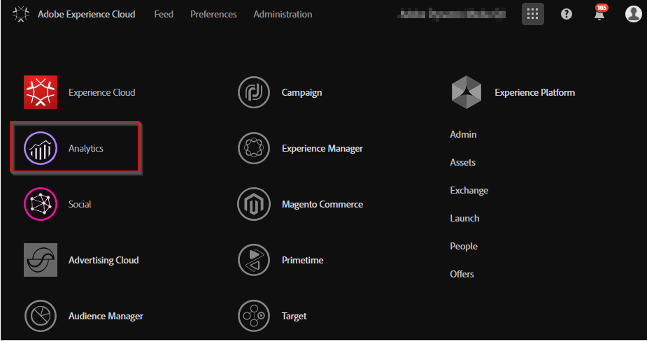

# Integrar visualizadores do Dynamic Media com tags do Adobe Analytics e do Experience Platform {#integrating-dynamic-media-viewers-with-adobe-analytics-and-adobe-launch}

## O que é a integração do Dynamic Media Viewers com as Tags do Adobe Analytics e do Experience Platform? {#what-is-dynamic-media-viewers-integration-with-adobe-analytics-and-adobe-launch}

<!-- Leave this hidden path here; it points to the topic source from Sasha https://wiki.corp.adobe.com/pages/viewpage.action?spaceKey=~oufimtse&title=Dynamic+Media+Viewers+integration+with+Adobe+Launch 

name used to be Experience Platform Launch. Changed to Experience Platform Data Collection-->

A extensão *Visualizadores do Dynamic Media* para Tags do Experience Platform funciona com os Visualizadores do Dynamic Media 5.13. Ela permite que os clientes das Tags do Adobe Analytics e do Experience Platform usem os eventos e dados dos Visualizadores do Dynamic Media em suas configurações de tags.

Essa integração significa que você pode rastrear o uso dos Visualizadores do Dynamic Media em seu site com o Adobe Analytics. Ao mesmo tempo, você pode usar os eventos e os dados expostos pelos visualizadores com qualquer outra extensão de Tags do Experience Platform que venha do Adobe ou de terceiros.

Para saber mais sobre extensões do Adobe ou extensões de terceiros, consulte [extensões do Adobe](https://experienceleague.adobe.com/en/docs/experience-platform/tags/extensions/overview) no Guia do Usuário de Tags da Experience Platform.

**Este tópico é destinado ao seguinte:** administradores de site, desenvolvedores no programa Adobe Experience Manager e pessoas em Operações.

### Limitações da integração {#limitations-of-the-integration}

* A integração de tags do Experience Platform para visualizadores do Dynamic Media não funciona no nó do autor do Experience Manager. Não é possível ver nenhum rastreamento de uma página WCM até que ela seja publicada.
* A integração de tags do Experience Platform para visualizadores do Dynamic Media não é compatível com o modo de operação &quot;pop-up&quot;, no qual o URL do visualizador é obtido usando o botão &quot;URL&quot; na página Detalhes do ativo.
* A integração das Tags do Experience Platform não pode ser usada simultaneamente com visualizadores herdados integração do Analytics (por meio do parâmetro `config2=`).
* O suporte ao rastreamento de vídeo está limitado apenas ao rastreamento principal de reprodução, conforme descrito em [Visão geral do rastreamento](https://experienceleague.adobe.com/en/docs/media-analytics/using/tracking/track-core-overview#player-events). Especificamente, o rastreamento de QoS, Anúncios, Capítulo/Segmentos ou Erros não é compatível.
* A configuração da Duração de Armazenamento para Elementos de Dados não é suportada para Elementos de Dados que usam a extensão *Visualizadores do Dynamic Media*. A Duração do Armazenamento deve ser definida como **[!UICONTROL Nenhuma]**.

### Casos de uso para a integração do {#use-cases-for-the-integration}

O principal caso de uso para a integração com tags da Experience Platform são os clientes que usam Experience Manager Assets e Experience Manager Sites. Nesses cenários, é possível configurar uma integração padrão entre o nó do autor do Experience Manager e as tags do Experience Platform e, em seguida, associar a instância do Sites à propriedade tags do Experience Platform. Depois disso, qualquer componente WCM do Dynamic Media adicionado a uma página Sites rastreará os dados e eventos dos visualizadores.

Consulte [Rastrear visualizadores do Dynamic Media no Experience Manager Sites](#tracking-dynamic-media-viewers-in-aem-sites).

Um caso de uso secundário compatível com a integração são os clientes que usam somente o Experience Manager Assets ou o Dynamic Media Classic. Nesses casos, você obtém o código incorporado do visualizador e o adiciona à página do site. Em seguida, obtenha o URL de produção da biblioteca de tags do Experience Platform nas tags do Experience Platform e adicione-o manualmente ao código da página da Web.

Consulte [Rastrear visualizadores do Dynamic Media usando o código inserido](#tracking-dynamic-media-viewers-using-embed-code).

## Como o rastreamento de dados e eventos funciona na integração {#how-data-and-event-tracking-works-in-the-integration}

A integração aproveita dois tipos separados e independentes de rastreamento de Visualizadores do Dynamic Media: *Adobe Analytics* e *Adobe Analytics para Áudio e Vídeo*.

### Sobre o rastreamento usando o Adobe Analytics {#about-tracking-using-adobe-analytics}

O Adobe Analytics permite rastrear as ações que um usuário realiza quando interage com os Visualizadores do Dynamic Media no seu site. O Adobe Analytics também permite rastrear dados específicos do visualizador. Por exemplo, é possível rastrear e registrar eventos de carregamento de exibição junto com o nome do ativo, ações de zoom ocorridas e ações de reprodução de vídeo.

Nas Tags do Experience Platform, os conceitos de *Elementos de Dados* e *Regras* trabalham juntos para habilitar o rastreamento do Adobe Analytics.

#### Sobre elementos de dados nas tags do Experience Platform {#about-data-elements-in-adobe-launch}

Um elemento de dados nas tags do Experience Platform é uma propriedade nomeada cujo valor é definido estaticamente ou calculado dinamicamente com base no estado de uma página da Web ou dos dados dos visualizadores do Dynamic Media.

As opções disponíveis para uma definição de Elemento de dados dependem da lista de Extensões instaladas na Propriedade de tags do Experience Platform. A extensão &quot;Principal&quot; é pré-instalada e está disponível imediatamente em qualquer configuração. Essa extensão &quot;principal&quot; permite definir um Elemento de dados cujo valor vem do cookie, do código JavaScript, da sequência de consulta e de muitas outras fontes.

Para o rastreamento Adobe Analytics, várias outras extensões devem ser instaladas, conforme descrito em [Instalação e configuração de extensões](#installing-and-setup-of-extensions). A extensão Visualizadores do Dynamic Media adiciona a capacidade de definir um Elemento de dados cujo valor é um argumento do evento Visualizador dinâmico. Por exemplo, é possível fazer referência ao tipo de visualizador, ou ao nome do ativo relatado pelo visualizador na carga, ao nível de zoom relatado quando o usuário final amplia e muito mais.

A extensão do Visualizador do Dynamic Media mantém os valores de seus Elementos de dados atualizados automaticamente.

Depois de defini-lo, um Elemento de dados pode ser usado em outros locais da interface do usuário de Tags do Experience Platform, usando o widget Seletor de elementos de dados. A **Ação Definir Variáveis** da extensão Adobe Analytics em uma regra faz referência a Elementos de Dados definidos para rastreamento de Visualizadores do Dynamic Media (veja abaixo).

Consulte [Elementos de dados](https://experienceleague.adobe.com/en/docs/experience-platform/tags/ui/data-elements) no Guia do Usuário de Marcas do Experience Platform.

#### Sobre regras em tags do Experience Platform {#about-rules-in-adobe-launch}

Uma Regra nas Marcas do Experience Platform é uma configuração agnóstica que define três áreas que compõem uma regra: *Eventos*, *Condições* e *Ações*:

* *Eventos* (if) informam às Marcas do Experience Platform quando acionar uma Regra.
* *As condições* (if) informam às Marcas do Experience Platform quais outras restrições permitir ou proibir ao acionar uma Regra.
* *As ações* (then) informam às Marcas do Experience Platform o que fazer quando uma Regra é acionada.

As opções disponíveis na seção Eventos, condições e ações dependem das extensões instaladas na propriedade Tags do Experience Platform. A extensão *Core* é pré-instalada e está disponível e pronta para uso em qualquer configuração. A extensão fornece várias opções para Eventos, como ações básicas no nível do navegador que incluem alteração de foco, pressionamentos de tecla e envio de formulários. Também inclui opções para Condições, como valor de cookie, tipo de navegador e muito mais. Para Ações, somente a opção Código personalizado está disponível.

Para rastreamento Adobe Analytics, várias outras extensões devem ser instaladas, conforme descrito em [Instalação e configuração de extensões](#installing-and-setup-of-extensions). Especificamente:

* A extensão Visualizadores do Dynamic Media estende a lista de Eventos compatíveis para eventos específicos de visualizadores do Dynamic Media, como carga do visualizador, troca de ativos, aumento de zoom e reprodução de vídeo.
* A extensão do Adobe Analytics estende a lista de Ações com suporte com duas ações necessárias para enviar dados aos servidores de rastreamento: *Definir Variáveis* e *Enviar Beacon*.

Para rastrear visualizadores do Dynamic Media, é possível usar qualquer um dos seguintes tipos:

* Eventos de extensão do Dynamic Media Viewers, extensão Core ou qualquer outra extensão.
* Condições na definição da Regra. Ou você pode deixar a área de condições vazia.

Na seção Ações, é necessário que você tenha uma ação *Definir Variáveis*. Essa ação informa ao Adobe Analytics como preencher variáveis de rastreamento com dados. Ao mesmo tempo, a ação *Definir variáveis* não envia nada para o servidor de rastreamento.

A ação **Enviar Beacon** deve seguir a ação **Definir Variáveis**. A ação *Enviar sinal* envia dados para o servidor de rastreamento de análise. Ambas as ações, *Definir Variáveis* e *Enviar Beacon*, vêm da extensão do Adobe Analytics.

Consulte as [Regras](https://experienceleague.adobe.com/en/docs/experience-platform/tags/ui/rules) no Guia do Usuário de Marcas do Experience Platform.

#### Exemplo de configuração {#sample-configuration}

O exemplo de configuração a seguir nas Tags do Experience Platform demonstra como rastrear um nome de ativo na carga do visualizador.

1. Na guia **[!UICONTROL Elementos de Dados]**, defina um Elemento de Dados `AssetName` que faça referência ao parâmetro `asset` do evento `LOAD` da extensão de Visualizadores do Dynamic Media.

   

1. Na guia **[!UICONTROL Regras]**, defina uma regra *TrackAssetOnLoad*.

   Nesta regra, o campo **[!UICONTROL Evento]** usa o evento **[!UICONTROL LOAD]** da extensão de Visualizadores do Dynamic Media.

   

1. A configuração Ação tem dois tipos de Ação da extensão do Adobe Analytics:

   *Definir Variáveis*, que mapeiam uma variável de análise de sua escolha para o valor de Elemento de Dados `AssetName`.

   *Enviar sinal*, que envia informações de rastreamento para a Adobe Analytics.

   

1. A configuração de regra resultante é exibida da seguinte maneira:

   

### Sobre o Adobe Analytics para áudio e vídeo {#about-adobe-analytics-for-audio-and-video}

Quando uma conta do Experience Cloud é assinada para usar o Adobe Analytics para áudio e vídeo, basta habilitar o rastreamento de vídeo nas configurações de extensão do *Visualizadores do Dynamic Media*. As métricas de vídeo são disponibilizadas no Adobe Analytics. O rastreamento de vídeo depende da presença da extensão Adobe Media Analytics for Audio and Video.

Consulte [Instalação e configuração de extensões](#installing-and-setup-of-extensions).

Atualmente, o suporte para rastreamento de vídeo está limitado apenas ao rastreamento de &quot;reprodução principal&quot;, conforme descrito em [Visão geral do rastreamento](https://experienceleague.adobe.com/en/docs/media-analytics/using/tracking/track-core-overview#player-events). Especificamente, o rastreamento de QoS, Anúncios, Capítulo/Segmentos ou Erros não é compatível.

## Usar a extensão Visualizadores do Dynamic Media {#using-the-dynamic-media-viewers-extension}

Conforme mencionado nos [Casos de uso da integração](#use-cases-for-the-integration), é possível rastrear os visualizadores do Dynamic Media com a nova integração de tags da Experience Platform no Experience Manager Sites e usando o código de inserção.

### Rastrear visualizadores do Dynamic Media no Experience Manager Sites {#tracking-dynamic-media-viewers-in-aem-sites}

Para rastrear visualizadores do Dynamic Media no Experience Manager Sites, todas as etapas listadas na seção [Configurar todas as partes da integração](#configuring-all-the-integration-pieces) devem ser executadas. Especificamente, você deve criar a configuração do IMS e a configuração da nuvem de tags do Experience Platform.

Após a configuração adequada, qualquer visualizador do Dynamic Media adicionado a uma página do Sites, usando um componente WCM compatível com o Dynamic Media, rastreia automaticamente os dados para o Adobe Analytics, o Adobe Analytics para vídeo ou ambos.

Consulte [Adicionar o Dynamic Media Assets a páginas usando o Adobe Sites](/help/assets/dynamic-media/adding-dynamic-media-assets-to-pages.md).

### Rastrear visualizadores do Dynamic Media usando o código de inserção {#tracking-dynamic-media-viewers-using-embed-code}

Os clientes que não usam o Experience Manager Sites ou que não incorporam visualizadores do Dynamic Media em páginas da Web fora do Experience Manager Sites, ou em ambas, ainda podem usar a integração de tags da Experience Platform.

Conclua as etapas de configuração das seções [Configurar Adobe Analytics](#configuring-adobe-analytics-for-the-integration) e [Configurar Tags do Experience Platform](#configuring-adobe-launch-for-the-integration). No entanto, as etapas de configuração relacionadas ao Experience Manager não são necessárias.

Após a configuração adequada, é possível adicionar o suporte a Tags da Experience Platform a uma página da Web com um visualizador do Dynamic Media.

Consulte [Adicionar o código de inserção das marcas do Experience Platform](https://experienceleague.adobe.com/en/docs/platform-learn/implement-in-websites/configure-tags/add-embed-code) para saber mais sobre como usar o código de inserção da biblioteca de marcas do Experience Platform.

Para saber mais sobre como usar o recurso de código incorporado do Experience Manager Dynamic Media, consulte [Incorporação do Visualizador de Vídeo ou Imagem em uma página da Web](/help/assets/dynamic-media/embed-code.md).

**Rastrear visualizadores do Dynamic Media usando o código inserido:**

1. Ter uma página da Web pronta para incorporar um visualizador do Dynamic Media.
1. Para obter o código de inserção da biblioteca de marcas Experience Platform, primeiro faça logon nas marcas Experience Platform (consulte [Configurar marcas Experience Platform](#configuring-adobe-launch-for-the-integration)).
1. Selecione **[!UICONTROL Propriedade]** e clique na guia **[!UICONTROL Ambientes]**.
1. Selecione o nível de Ambiente relevante para o ambiente da página da Web. Em seguida, na coluna **[!UICONTROL Instalar]**, clique no ícone da caixa.
1. **[!UICONTROL Na caixa de diálogo Instruções de Instalação da Web]**, copie o código incorporado completo da biblioteca de marcas da Experience Platform, juntamente com as `<script/>` marcas ao redor.

## Guia de referência para a extensão Visualizadores do Dynamic Media {#reference-guide-for-the-dynamic-media-viewers-extension}

### Sobre a configuração dos Visualizadores do Dynamic Media {#about-the-dynamic-media-viewers-configuration}

A extensão do Visualizador do Dynamic Media será integrada automaticamente à biblioteca de tags da Experience Platform se as seguintes condições forem verdadeiras:

* O objeto global da biblioteca de Tags do Experience Platform ( `_satellite`) está presente na página.
* A função de extensão `_dmviewers_v001()` dos Visualizadores do Dynamic Media está definida em `_satellite`.

* O parâmetro do visualizador `config2=` não foi especificado, o que significa que o visualizador não usa a integração do Analytics herdada.

Além disso, há uma opção para desabilitar explicitamente a integração de Tags do Experience Platform no visualizador, especificando o parâmetro `launch=0` na configuração do visualizador. O valor padrão desse parâmetro é `1`.

### Configurar a extensão Visualizadores do Dynamic Media {#configuring-the-dynamic-media-viewers-extension}

A única opção de configuração para a extensão Visualizadores do Dynamic Media é **[!UICONTROL Habilitar o Adobe Media Analytics para áudio e vídeo]**.

Quando você marca (habilita) essa opção e a extensão do Adobe Media Analytics para áudio e vídeo é instalada e configurada, as métricas de reprodução de vídeo são enviadas para a solução Adobe Analytics para áudio e vídeo. Desativar essa opção desativa o rastreamento de vídeo.

Se você habilitar esta opção *sem* ter a extensão do Adobe Media Analytics para Áudio e Vídeo instalada, a opção não terá efeito.

### Sobre elementos de dados na extensão Visualizadores do Dynamic Media {#about-data-elements-in-the-dynamic-media-viewers-extension}

O único tipo de Elemento de dados fornecido pela extensão Visualizadores do Dynamic Media é o **[!UICONTROL Evento do visualizador]** na lista suspensa **[!UICONTROL Tipo de elemento de dados]**.

Quando selecionado, o editor de Elemento de dados renderiza um formulário com dois campos:

* **[!UICONTROL Tipo de dados do evento de visualizadores do DM]** - uma lista suspensa exibe todos os eventos do visualizador com argumentos suportados pela extensão do Visualizador do Dynamic Media, juntamente com um item **[!UICONTROL COMMON]** especial. Um item **[!UICONTROL COMUM]** representa uma lista de parâmetros de evento comuns a todos os tipos de eventos enviados pelos visualizadores.
* **[!UICONTROL Parâmetro de rastreamento]** - um argumento do evento do visualizador do Dynamic Media selecionado.

Consulte o [guia de referência de Visualizadores do Dynamic Media](https://experienceleague.adobe.com/en/docs/dynamic-media-developer-resources/library/viewers-aem-assets-dmc/c-html5-s7-aem-asset-viewers) para obter a lista de eventos compatíveis com cada tipo de visualizador; vá para a seção de visualizador específica e selecione a subseção Suporte para rastreamento do Adobe Analytics. Atualmente, o guia de referência Visualizadores do Dynamic Media não documenta argumentos de evento.

Agora vamos considerar o ciclo de vida do *Elemento de dados* dos Visualizadores do Dynamic Media. O valor desse Elemento de dados é preenchido depois que o evento correspondente do visualizador do Dynamic Media ocorre na página. Por exemplo, suponha que o Elemento de Dados aponte para o evento **[!UICONTROL LOAD]** e seu argumento &quot;asset&quot;. O valor desse Elemento de dados recebe dados válidos depois que o visualizador executa o evento LOAD pela primeira vez. Se o Elemento de Dados apontar para o evento **[!UICONTROL ZOOM]** e seu argumento de &quot;escala&quot;, o valor desse Elemento de Dados permanecerá vazio até que o visualizador envie um evento **[!UICONTROL ZOOM]** pela primeira vez.

Da mesma forma, os valores dos Elementos de dados são atualizados automaticamente quando o visualizador envia um evento correspondente na página. A atualização de valor acontece mesmo se o evento específico não for definido na configuração Regra. Por exemplo, suponha que o Elemento de dados **[!UICONTROL ZoomScale]** seja definido como o parâmetro &quot;scale&quot; do evento ZOOM. No entanto, o evento **[!UICONTROL LOAD]** é o único acionador na configuração Regra. O valor de **[!UICONTROL ZoomScale]** ainda é atualizado sempre que um usuário executa o zoom dentro do visualizador.

Qualquer visualizador do Dynamic Media tem um identificador exclusivo na página da Web. O Elemento de dados rastreia o próprio valor e o visualizador o preencheu. Por exemplo, suponha que haja vários visualizadores na mesma página e um Elemento de Dados **[!UICONTROL AssetName]** que aponte para o evento **[!UICONTROL LOAD]** e seu argumento &quot;asset&quot;. O Elemento de Dados **[!UICONTROL AssetName]** mantém uma coleção de nomes de ativos associados a cada visualizador carregado na página.

O valor exato retornado pelo Elemento de dados depende do contexto. Se uma Regra acionada por um evento do visualizador do Dynamic Media solicitar o Elemento de dados, o valor será retornado para o visualizador que iniciou a Regra. Se uma regra acionada por um evento de outra extensão de tags da Experience Platform solicitar o elemento de dados, ela seguirá o contexto do evento correspondente. Nesse ponto, o valor do Elemento de dados vem do visualizador que foi o último a atualizar esse Elemento de dados.

**Considere a seguinte configuração de exemplo:**

* Uma página da Web com dois visualizadores de zoom do Dynamic Media: *viewer1* e *viewer2*.

* O Elemento de Dados **[!UICONTROL ZoomScale]** aponta para o evento **[!UICONTROL ZOOM]** e seu argumento de &quot;escala&quot;.
* Regra de **[!UICONTROL TrackPan]** com o seguinte:

   * Usa o evento **[!UICONTROL PAN]** do Visualizador do Dynamic Media como um disparador.
   * Envia o valor do Elemento de Dados **[!UICONTROL ZoomScale]** para o Adobe Analytics.

* Regra **[!UICONTROL TrackKey]** com o seguinte:

   * Usa o evento de pressionamento de tecla da extensão Tags do Experience Platform principal como um acionador.
   * Envia o valor do Elemento de Dados **[!UICONTROL ZoomScale]** para o Adobe Analytics.

Agora, suponha que o usuário carregue a página da Web com os dois visualizadores. No *visualizador1*, eles ampliam para 50% da escala; em seguida, no *visualizador2*, eles ampliam para 25% da escala. No *visualizador1*, eles deslocam a imagem e, por fim, pressionam uma tecla no teclado.

A atividade do usuário resulta nas duas chamadas de rastreamento a seguir feitas ao Adobe Analytics:

* A primeira chamada ocorre porque a Regra de **[!UICONTROL TrackPan]** é acionada quando o usuário realiza um plano no *visualizador1*. Essa chamada envia **50%** como o valor do Elemento de Dados **[!UICONTROL ZoomScale]** porque reconhece que o *visualizador1* acionou a Regra e recupera o valor de escala correspondente;
* A segunda chamada ocorre porque a Regra **[!UICONTROL TrackKey]** é acionada quando o usuário pressiona uma tecla no teclado. Essa chamada envia 25% como o valor do Elemento de Dados **[!UICONTROL ZoomScale]** porque o visualizador não acionou a Regra. Dessa forma, o Elemento de dados retorna o valor mais atualizado.

A amostra configurada acima também afeta a duração do valor do Elemento de dados. O valor do Elemento de dados gerenciado pelo Visualizador do Dynamic Media é armazenado no código da biblioteca de Tags do Experience Platform, mesmo depois que o próprio visualizador é descartado na página da Web. Essa funcionalidade significa que, se uma Regra acionada por uma extensão do Visualizador do Dynamic Media não fizer referência ao Elemento de dados, ela retornará o último valor conhecido. Mesmo que o visualizador não esteja mais presente na página da Web.

Em qualquer caso, os valores de Elementos de dados orientados por Visualizadores do Dynamic Media não são armazenados no armazenamento local ou no servidor; em vez disso, são mantidos somente na biblioteca de Tags da Experience Platform do lado do cliente. Os valores desse Elemento de dados desaparecem quando a página da Web é recarregada.

Geralmente, o editor de Elemento de Dados oferece suporte a [seleção de duração de armazenamento](https://experienceleague.adobe.com/en/docs/experience-platform/tags/ui/data-elements#create-a-data-element). No entanto, os Elementos de Dados que usam a extensão Visualizadores do Dynamic Media só oferecem suporte à opção de duração de armazenamento de **[!UICONTROL Nenhum]**. É possível definir qualquer outro valor na interface do usuário, mas o comportamento do Elemento de dados não é definido nesse caso. A extensão gerencia o valor do Elemento de dados por conta própria: o Elemento de dados que mantém o valor do argumento de evento do visualizador durante todo o ciclo de vida do visualizador.

### Sobre regras na extensão Visualizadores do Dynamic Media {#about-rules-in-the-dynamic-media-viewers-extension}

No Editor de regras, a extensão adiciona novas opções de configuração para o Editor de eventos. Além disso, o editor fornece uma opção para fazer referência a parâmetros de eventos manualmente no editor de ações como uma opção abreviada, em vez de usar Elementos de dados pré-configurados.

#### Sobre o editor de eventos {#about-the-events-editor}

No Editor de eventos, a extensão Visualizadores do Dynamic Media adiciona um **[!UICONTROL Tipo de evento]** chamado **[!UICONTROL Evento do visualizador]**.

Quando selecionado, o Editor de eventos exibe o menu suspenso **[!UICONTROL Eventos do Visualizador do Dynamic Media]**, que lista todos os eventos suportados pelos visualizadores do Dynamic Media.

#### Sobre o editor de ações {#about-the-actions-editor}

A extensão Visualizadores do Dynamic Media permite usar parâmetros de evento de visualizadores do Dynamic Media para mapear para variáveis de análise no editor Definir variáveis da extensão do Adobe Analytics.

O método mais simples para fazer isso é concluir o seguinte processo de duas etapas:

* Primeiro, defina um ou mais Elementos de dados, em que cada Elemento de dados representa um parâmetro de um evento do Visualizador do Dynamic Media.
* Finalmente, no editor Definir variáveis da extensão do Adobe Analytics, clique em  **seletor de Elemento de dados** para abrir a caixa de diálogo Selecionar elemento de dados e clique em um Elemento de dados.

No entanto, é possível usar uma abordagem alternativa e ignorar a criação do Elemento de dados. Faça referência direta a um argumento de um evento do Visualizador do Dynamic Media. Insira o nome totalmente qualificado do argumento de evento no campo de entrada **[!UICONTROL value]** da atribuição de variável do Analytics. Verifique se os sinais de porcentagem (%) estão entre. Por exemplo,

`%event.detail.dm.LOAD.asset%`

Há uma diferença importante entre o uso de elementos de dados e a referência direta ao argumento de evento. Para Elementos de dados, não importa qual evento aciona a ação Definir variáveis. O evento que aciona a regra pode não estar relacionado ao Visualizador dinâmico (como selecionar a página da Web na extensão principal). Mas, ao usar uma referência de argumento direto, é importante garantir que o evento que aciona a regra corresponda ao argumento de evento que ela faz referência.

Por exemplo, se o evento **[!UICONTROL LOAD]** da extensão do Visualizador do Dynamic Media acionar a Regra, a referência `%event.detail.dm.LOAD.asset%` retornará o nome de ativo correto.

No entanto, retorna um valor vazio para qualquer outro evento.

A tabela a seguir lista os eventos do Visualizador do Dynamic Media e seus argumentos compatíveis:

<table>
 <tbody>
  <tr>
   <td>Nome do evento do visualizador</td>
   <td>Referência de argumento</td>
  </tr>
  <tr>
   <td><code>COMMON</code></td>
   <td><code>%event.detail.dm.objID%</code></td>
  </tr>
  <tr>
   <td> </td>
   <td><code>%event.detail.dm.compClass%</code></td>
  </tr>
  <tr>
   <td> </td>
   <td><code>%event.detail.dm.instName%</code></td>
  </tr>
  <tr>
   <td> </td>
   <td><code>%event.detail.dm.timeStamp%</code></td>
  </tr>
  <tr>
   <td><code>BANNER</code>  </td>
   <td><code>%event.detail.dm.BANNER.asset%</code></td>
  </tr>
  <tr>
   <td> </td>
   <td><code>%event.detail.dm.BANNER.frame%</code></td>
  </tr>
  <tr>
   <td> </td>
   <td><code>%event.detail.dm.BANNER.label%</code></td>
  </tr>
  <tr>
   <td><code>HREF</code></td>
   <td><code>%event.detail.dm.HREF.rollover%</code></td>
  </tr>
  <tr>
   <td><code>ITEM</code></td>
   <td><code>%event.detail.dm.ITEM.rollover%</code></td>
  </tr>
  <tr>
   <td><code>LOAD</code></td>
   <td><code>%event.detail.dm.LOAD.applicationname%</code></td>
  </tr>
  <tr>
   <td><strong> </strong></td>
   <td><code>%event.detail.dm.LOAD.asset%</code></td>
  </tr>
  <tr>
   <td><strong> </strong></td>
   <td><code>%event.detail.dm.LOAD.company%</code></td>
  </tr>
  <tr>
   <td><strong> </strong></td>
   <td><code>%event.detail.dm.LOAD.sdkversion%</code></td>
  </tr>
  <tr>
   <td><strong> </strong></td>
   <td><code>%event.detail.dm.LOAD.viewertype%</code></td>
  </tr>
  <tr>
   <td><strong> </strong></td>
   <td><code>%event.detail.dm.LOAD.viewerversion%</code></td>
  </tr>
  <tr>
   <td><code>METADATA</code></td>
   <td><code>%event.detail.dm.METADATA.length%</code></td>
  </tr>
  <tr>
   <td> </td>
   <td><code>%event.detail.dm.METADATA.type%</code></td>
  </tr>
  <tr>
   <td><code>MILESTONE</code></td>
   <td><code>%event.detail.dm.MILESTONE.milestone%</code></td>
  </tr>
  <tr>
   <td><code>PAGE</code></td>
   <td><code>%event.detail.dm.PAGE.frame%</code></td>
  </tr>
  <tr>
   <td> </td>
   <td><code>%event.detail.dm.PAGE.label%</code></td>
  </tr>
  <tr>
   <td><code>PAUSE</code></td>
   <td><code>%event.detail.dm.PAUSE.timestamp%</code></td>
  </tr>
  <tr>
   <td><code>PLAY</code></td>
   <td><code>%event.detail.dm.PLAY.timestamp%</code></td>
  </tr>
  <tr>
   <td><code>SPIN</code></td>
   <td><code>%event.detail.dm.SPIN.framenumber%</code></td>
  </tr>
  <tr>
   <td><code>STOP</code></td>
   <td><code>%event.detail.dm.STOP.timestamp%</code></td>
  </tr>
  <tr>
   <td><code>SWAP</code></td>
   <td><code>%event.detail.dm.SWAP.asset%</code></td>
  </tr>
  <tr>
   <td><code>SWATCH</code></td>
   <td><code>%event.detail.dm.SWATCH.frame%</code></td>
  </tr>
  <tr>
   <td> </td>
   <td><code>%event.detail.dm.SWATCH.label%</code></td>
  </tr>
  <tr>
   <td><code>TARG</code></td>
   <td><code>%event.detail.dm.TARG.frame%</code></td>
  </tr>
  <tr>
   <td> </td>
   <td><code>%event.detail.dm.TARG.label%</code></td>
  </tr>
  <tr>
   <td><code>ZOOM</code></td>
   <td><code>%event.detail.dm.ZOOM.scale%</code></td>
  </tr>
 </tbody>
</table>

## Configurar todas as partes da integração {#configuring-all-the-integration-pieces}

**ANTES DE COMEÇAR**

A Adobe recomenda que você revise completamente toda a documentação antes desta seção para entender a integração completa.

Esta seção explica as etapas de configuração necessárias para integrar visualizadores do Dynamic Media ao Adobe Analytics e Adobe Analytics para áudio e vídeo. Embora o uso da extensão Visualizadores do Dynamic Media para outros propósitos em Tags do Experience Platform seja possível, esses cenários não são abordados nesta documentação.

Você usará os seguintes produtos da Adobe para configurar a integração:

* Adobe Analytics - usado para configurar variáveis e relatórios de rastreamento.
* Tags do Experience Platform - usadas para definir uma Propriedade, uma ou mais Regras e um ou mais Elementos de dados para ativar o rastreamento do visualizador.

Além disso, se essa solução de integração for usada com o Experience Manager Sites, a seguinte configuração deverá ser feita:

* [Adobe Developer Console](https://developer.adobe.com/console/home) - a integração foi criada para as Marcas do Experience Platform.
* Nó do autor do Experience Manager - configuração do IMS e configuração da nuvem de tags do Experience Platform.

Como parte da configuração, verifique se você tem acesso a uma empresa no Adobe Experience Cloud que já tenha as Tags do Adobe Analytics e do Experience Platform ativadas.

## Configurar o Adobe Analytics para a integração {#configuring-adobe-analytics-for-the-integration}

Após configurar o Adobe Analytics, a integração é configurada para o seguinte:

* Um conjunto de relatórios está em vigor e selecionado.
* As variáveis do Analytics estão disponíveis para receber dados de rastreamento.
* Os relatórios estão disponíveis para exibir dados coletados dentro do Adobe Analytics.

Consulte também o [Guia de implementação do Analytics](https://experienceleague.adobe.com/en/docs/analytics/implementation/home).

**Para configurar o Adobe Analytics para a integração:**

1. Comece acessando o Adobe Analytics na [home page](https://experience.adobe.com/#/home) do Experience Cloud. Na barra de menus, clique no ícone  **Soluções** próximo ao canto superior direito da página e selecione **[!UICONTROL Analytics]**.

   

   Agora, selecione um conjunto de relatórios.

### Selecionar um conjunto de relatórios {#selecting-a-report-suite}

1. Próximo ao canto superior direito da página do Adobe Analytics, à direita do campo **[!UICONTROL Pesquisar relatórios]**, selecione o conjunto de relatórios correto na lista suspensa. Se vários conjuntos de relatórios estiverem disponíveis e você não tiver certeza de qual usar, peça ajuda. O administrador do Adobe Analytics pode orientá-lo na seleção do conjunto de relatórios apropriado.

   No exemplo abaixo, um usuário criou um conjunto de relatórios chamado *DynamicMediaViewersExtensionDoc* e o selecionou na lista suspensa. O nome do conjunto de relatórios é apenas um exemplo. O nome do conjunto de relatórios que você selecionar depende de você.

   Se nenhum conjunto de relatórios estiver disponível, você ou o administrador do Adobe Analytics deverá criar um antes de continuar com a configuração.

   Consulte [Relatórios e Conjuntos de Relatórios](https://experienceleague.adobe.com/en/docs/analytics/admin/admin-tools/manage-report-suites/report-suites-admin) e [Criar um conjunto de relatórios](https://experienceleague.adobe.com/en/docs/analytics/admin/admin-tools/manage-report-suites/c-new-report-suite/t-create-a-report-suite).

   No Adobe Analytics, os conjuntos de relatórios são gerenciados em **[!UICONTROL Administrador]** > **[!UICONTROL Conjuntos de relatórios]**.

   

   Agora, configure as variáveis do Adobe Analytics.

### Configurar variáveis do Adobe Analytics {#setting-up-adobe-analytics-variables}

1. Designe uma ou mais variáveis do Adobe Analytics que deseja usar para rastrear o comportamento dos Visualizadores do Dynamic Media na página da Web.

   Você pode usar qualquer tipo de variável compatível com o Adobe Analytics. A implementação do Analytics precisa determinar o tipo de variável apropriado, como Tráfego personalizado (`props`) ou Conversão (`eVar`).

   Consulte [Visão geral de props e eVars](https://experienceleague.adobe.com/en/docs/analytics/implementation/vars/page-vars/evar#vars).

   Para os fins desta documentação, somente uma variável de Tráfego personalizado (props) é usada porque ela fica disponível em um Relatório do Analytics dentro de alguns minutos após uma ação ocorrer em uma página da Web.

   Para habilitar uma nova variável de Tráfego Personalizado no Adobe Analytics, na barra de ferramentas, vá para **[!UICONTROL Administrador]** > **[!UICONTROL Conjuntos de Relatórios]**.

1. Na página **[!UICONTROL Gerenciador de Conjunto de Relatórios]**, selecione o relatório correto.
1. Na barra de ferramentas, clique em **[!UICONTROL Editar configurações]** > **[!UICONTROL Tráfego]** > **[!UICONTROL Variáveis de tráfego]**.
1. Escolha uma variável não usada, dê a ela um nome descritivo (**[!UICONTROL Ativo do visualizador (prop 30)]**) e altere a caixa de combinação para &quot;Habilitado&quot; na coluna Habilitado.

   A captura de tela a seguir é um exemplo de uma variável de Tráfego personalizado (**[!UICONTROL prop30]**) para rastrear um nome de ativo usado pelo visualizador:

   

1. Na parte inferior da lista de variáveis, clique em **[!UICONTROL Salvar]**.

### Configurar um relatório {#setting-up-a-report}

Geralmente, as necessidades específicas do projeto orientam a forma como você configura um relatório no Adobe Analytics. Dessa forma, uma configuração detalhada de relatório está fora do escopo dessa integração.

No entanto, basta saber que os relatórios de Tráfego personalizado ficam disponíveis automaticamente no Adobe Analytics depois que você configura as variáveis de Tráfego personalizado em **[Configurar variáveis do Adobe Analytics](#setting-up-adobe-analytics-variables)**.

Por exemplo, o relatório da variável **[!UICONTROL Ativo do visualizador (prop 30)]** está disponível no menu Relatórios em **[!UICONTROL Tráfego personalizado]** > **[!UICONTROL Tráfego personalizado 21-30]** > **[!UICONTROL Ativo do visualizador (prop 30)]**.

Visitar este relatório logo após a criação do **[!UICONTROL Ativo do visualizador (prop 30)]**, não mostra dados; o que é esperado neste momento da integração.

## Configurar tags do Experience Platform para integração {#configuring-adobe-launch-for-the-integration}

Após configurar as Tags do Experience Platform, os seguintes itens são configurados para a integração:

* A criação de uma nova propriedade para manter todas as suas configurações unidas.
* A instalação e a configuração das extensões. O código do lado do cliente de todas as extensões instaladas na propriedade é compilado em conjunto em uma biblioteca. Essa biblioteca é usada pela página da Web posteriormente.
* Configuração dos elementos de dados e regras. Essa configuração define quais dados adquirir dos visualizadores do Dynamic Media, quando acionar a lógica de rastreamento e para onde enviar os dados do visualizador no Adobe Analytics.
* Publicação da biblioteca.

**Para configurar as Marcas do Experience Platform para a integração:**

1. Comece acessando as Marcas do Experience Platform na [página inicial](https://experience.adobe.com/#/home) do Experience Cloud. Na barra de menus, clique no ícone  **Soluções** próximo ao canto superior direito da página e clique em **[!UICONTROL Marcas]**.

   

### Criar uma propriedade nas Tags do Experience Platform {#creating-a-property-in-adobe-launch}

Uma propriedade nas Tags do Experience Platform é uma configuração nomeada que mantém todas as configurações unidas. Uma biblioteca de definições de configuração é gerada e publicada em diferentes níveis de ambiente (desenvolvimento, armazenamento temporário e produção).

Consulte também [Configurar uma propriedade select](https://experienceleague.adobe.com/en/docs/platform-learn/implement-mobile-sdk/initial-configuration/configure-tags).

**Para criar uma propriedade nas Marcas do Experience Platform:**

1. Em Marcas do Experience Platform, clique em **[!UICONTROL Nova Propriedade]**.
1. Na caixa de diálogo **[!UICONTROL Criar propriedade]**, no campo **[!UICONTROL Nome]**, digite um nome descritivo, como o título do site. Por exemplo, `DynamicMediaViewersProp.`
1. No campo **[!UICONTROL Domínios]**, digite o domínio do seu site.
1. No menu suspenso **[!UICONTROL Opções Avançadas]**, habilite **[!UICONTROL Configurar para desenvolvimento de extensão (não pode ser modificado posteriormente)]** caso a extensão que você deseja usar - neste caso, *Visualizadores do Dynamic Media* - ainda não tenha sido lançada.

   

1. Selecione **[!UICONTROL Salvar]**.

   Selecione a propriedade criada e prossiga para *Instalação e configuração de extensões*.

### Instalação e configuração de extensões {#installing-and-setup-of-extensions}

Todas as extensões disponíveis nas Marcas do Experience Platform estão listadas em **[!UICONTROL Extensões]** > **[!UICONTROL Catálogo]**.

Para instalar uma extensão, clique em **[!UICONTROL Instalar]**. Se necessário, execute uma configuração de extensão única e clique em **[!UICONTROL Salvar]**.

Quando necessário, as seguintes extensões devem ser instaladas e configuradas:

* (Obrigatório) Extensão *Experience Cloud ID Service*

Nenhuma configuração adicional é necessária, exceto para os valores propostos. Quando terminar, clique em **[!UICONTROL Salvar]**.

Consulte [Extensão do Experience Cloud Identity Service](https://experienceleague.adobe.com/en/docs/experience-platform/tags/extensions/client/id-service/overview).

* (Obrigatório) Extensão *Adobe Analytics*

Para configurar essa extensão, você precisa da ID do Conjunto de Relatórios encontrada no Adobe Analytics, em **[!UICONTROL Admin]** > **[!UICONTROL Conjunto de Relatórios]**, no cabeçalho da coluna **[!UICONTROL ID do Conjunto de Relatórios]**.

(Para fins de demonstração, a ID de Conjunto de relatórios do **[!UICONTROL DynamicMediaViewersExtensionDoc]** é usada nas seguintes capturas de tela. Esta ID foi criada e usada em [Selecionar um conjunto de relatórios](#selecting-a-report-suite) anteriormente.)

Na página Instalar extensão, digite a ID do conjunto de relatórios no campo **[!UICONTROL Conjuntos de relatórios]**, no campo **[!UICONTROL Conjuntos de relatórios de preparo]** e no campo **[!UICONTROL Conjuntos de relatórios de produção]**.

*Configure o item a seguir somente se pretender usar o acompanhamento de vídeo:*

Na página **[!UICONTROL Instalar Extensão]**, expanda **[!UICONTROL Geral]** e especifique o servidor de rastreamento. O servidor de rastreamento segue o modelo `<trackingNamespace>.sc.omtrdc.net`, em que `<trackingNamespace>` são as informações obtidas no email de provisionamento.

Selecione **[!UICONTROL Salvar]**.

Consulte [Extensão do Adobe Analytics](https://experienceleague.adobe.com/en/docs/experience-platform/tags/extensions/client/analytics/overview).

* (Opcional. Necessário somente se o rastreamento de vídeo for necessário) *Extensão do Adobe Media Analytics para áudio e vídeo*

Preencha o campo servidor de rastreamento. O servidor de rastreamento da extensão *Adobe Media Analytics for Audio and Video* é diferente do servidor de rastreamento usado para o Adobe Analytics. Ele segue o modelo `<trackingNamespace>.hb.omtrdc.net`, onde `<trackingNamespace>` são as informações do email de provisionamento.

Todos os outros campos são opcionais.

Consulte a [Extensão Adobe Media Analytics para áudio e vídeo](https://experienceleague.adobe.com/en/docs/experience-platform/tags/extensions/client/media-analytics/overview).

* (Obrigatório) Extensão *Visualizadores do Dynamic Media*

Selecione **[!UICONTROL ativar o Adobe Analytics para Vídeo]** para habilitar (ativar) o rastreamento do Video Heartbeat.

No momento da gravação, a extensão *Visualizadores do Dynamic Media* só estará disponível se a Propriedade de Tags do Experience Platform for criada para desenvolvimento.

Consulte [Criar uma propriedade nas Tags do Experience Platform](#creating-a-property-in-adobe-launch).

Depois que as extensões forem instaladas e configuradas, no mínimo, as cinco extensões a seguir (quatro se você não estiver rastreando o vídeo) serão listadas na área Extensões > Instaladas.

### Configurar Elementos de Dados e Regras {#setting-up-data-elements-and-rules}

Nas Tags do Experience Platform, crie os Elementos de dados e as Regras necessários para rastrear os visualizadores do Dynamic Media.

Consulte [Como funciona o rastreamento de dados e eventos na integração](#how-data-and-event-tracking-works-in-the-integration) para obter uma visão geral do rastreamento com Tags do Experience Platform.

Consulte [Configuração de exemplo](#sample-configuration) para obter uma configuração de exemplo em Marcas do Experience Platform que demonstra como rastrear um nome de ativo na carga do visualizador.

Consulte [Configurar a extensão Visualizadores do Dynamic Media](#configuring-the-dynamic-media-viewers-extension) para obter informações detalhadas sobre os recursos da extensão.

### Publicar uma biblioteca {#publishing-a-library}

Para alterar a configuração das Tags do Experience Platform (incluindo Propriedade, Extensões, Regras e Configuração de Elementos de Dados), você deve *publicar* essas alterações. A publicação nas Tags do Experience Platform é executada a partir da guia Publicação na configuração Propriedade.

As tags da Experience Platform podem ter vários ambientes de desenvolvimento, um ambiente de preparo e um ambiente de produção. Por padrão, a configuração da nuvem de tags do Experience Platform no Experience Manager aponta o nó do autor do Experience Manager para o ambiente de preparo de tags da Platform. O nó de publicação do Experience Manager aponta para o ambiente de Produção das tags do Experience Platform. Essa organização significa que, com as configurações padrão do Experience Manager, é necessário publicar a biblioteca de tags do Experience Platform no ambiente de preparo. Isso permite usá-lo no modo de autor no Experience Manager. Em seguida, você pode publicá-lo no ambiente de Produção para que ele possa ser usado na publicação do Experience Manager.

Consulte [Ambientes](https://experienceleague.adobe.com/en/docs/experience-platform/tags/publish/environments/environments) para obter mais informações sobre ambientes de Tags do Experience Platform.

A publicação de uma biblioteca envolve estas duas etapas:

* Adicionar e criar uma nova biblioteca incluindo todas as alterações necessárias (novas e atualizações) na biblioteca.
* Subir a biblioteca pelos diferentes níveis de ambiente (de desenvolvimento a preparo e produção).

#### Adicionar e criar uma nova biblioteca {#adding-and-building-a-new-library}

1. Na primeira vez que você abrir a guia Publicação nas Tags do Experience Platform, a lista da biblioteca estará vazia.

   Na coluna à esquerda, clique em **[!UICONTROL Adicionar nova biblioteca]**.

   

1. Na página Criar nova biblioteca, no campo **[!UICONTROL Nome]**, digite o nome descritivo da nova biblioteca. Por exemplo,

   *DynamicMediaViewersLib*

   Na lista suspensa Ambiente, escolha o nível Ambiente. Inicialmente, somente o nível de Desenvolvimento está disponível para seleção. Próximo ao lado inferior esquerdo da página, clique em **[!UICONTROL Adicionar todos os recursos alterados]**.

   

1. Próximo ao canto superior direito da página, clique em **[!UICONTROL Salvar e criar para desenvolvimento]**.

   Em alguns minutos, a biblioteca será criada e estará pronta para uso.

   

   >[!NOTE]
   >
   >Na próxima vez que você alterar a configuração de Tags do Experience Platform, acesse a guia **[!UICONTROL Publicação]** na configuração **[!UICONTROL Propriedade]** e selecione a biblioteca criada anteriormente.
   >
   >
   >Na tela de publicação da biblioteca, clique em **[!UICONTROL Adicionar todos os recursos alterados]** e em **[!UICONTROL Salvar e criar para desenvolvimento]**.

#### Mover uma biblioteca para cima nos níveis do ambiente {#moving-a-library-up-through-environment-levels}

1. Depois que uma nova biblioteca é adicionada, ela é encontrada no ambiente de desenvolvimento. Para movê-lo para o nível Ambiente de preparo (que corresponde à coluna Enviado), no menu suspenso da biblioteca, clique em **[!UICONTROL Enviar para aprovação]**.

   

1. Na caixa de diálogo de confirmação, clique em **[!UICONTROL Enviar]**.

   Depois que a biblioteca for movida para a coluna Enviado, no menu suspenso da biblioteca, clique em **[!UICONTROL Compilação para Preparo]**.

   

1. Para mover a biblioteca do ambiente de preparo para o ambiente de produção (que é a coluna Publicado), siga um processo semelhante.

   Primeiro, no menu suspenso, clique em **[!UICONTROL Aprovar para publicação]**.

   

1. No menu suspenso, clique em **[!UICONTROL Criar e publicar na produção]**.

   

   Consulte [Publicação](https://experienceleague.adobe.com/en/docs/experience-platform/tags/publish/overview) para obter mais informações sobre o processo de publicação nas Tags do Experience Platform.

## Configurar o Adobe Experience Manager para a integração {#configuring-adobe-experience-manager-for-the-integration}

<!-- Prerequisites list below should be verified by Sasha -->

Pré-requisitos:

* O Experience Manager executa as instâncias de modo de autor e de modo de publicação.
* O nó do autor do Experience Manager é configurado no Dynamic Media. <!-- Scene7 run mode (dynamicmedia_s7) -->
* Os componentes WCM do Dynamic Media são ativados no Experience Manager Sites.

A configuração do Experience Manager consiste nas duas etapas principais a seguir:

* Configuração do Experience Manager IMS.
* Configuração da nuvem de tags da Experience Platform.

### Configurar o Experience Manager IMS {#configuring-aem-ims}

1. No autor do Experience Manager, clique em  **Ferramentas** e vá para **[!UICONTROL Segurança]** > **[!UICONTROL Configurações do Adobe IMS]**.

   

1. Na página Configuração IMC do Adobe, próximo ao canto superior esquerdo, clique em **[!UICONTROL Criar]**.
1. Na página **[!UICONTROL Configuração de conta técnica do Adobe IMS]**, na lista suspensa **[!UICONTROL Solução da nuvem]**, clique em **[!UICONTROL Coleta de dados do Experience Platform]**.
1. Habilite **[!UICONTROL Criar novo certificado]**. Em seguida, no campo de texto, digite qualquer valor significativo para o certificado. Por exemplo, *AdobeLaunchIMSCert*. Clique em **[!UICONTROL Criar certificado]**.

   A seguinte mensagem Info é exibida:

   *Para recuperar um token de acesso válido, é necessário adicionar a chave pública do novo certificado à conta técnica do Adobe Developer!*

   Para fechar a caixa de diálogo Informações, clique em **[!UICONTROL OK]**.

   

1. Selecione **[!UICONTROL Baixar Chave Pública]** para baixar um arquivo de chave pública (`*.crt`) no sistema local.

   >[!NOTE]
   >
   >Neste ponto, ***deixe aberta*** a página **[!UICONTROL Configuração de Conta Técnica do Adobe IMS]**; ***não*** feche a página e ***não*** clique em **[!UICONTROL Avançar]**. Você retornará posteriormente a esta página nas etapas.

   

1. Em uma nova guia do navegador, navegue até a [Adobe Developer Console](https://developer.adobe.com/console/integrations).

1. Na página **[!UICONTROL Integrações do Adobe Developer Console]**, próximo ao canto superior direito, clique em **[!UICONTROL Nova integração]**.
1. Na caixa de diálogo **[!UICONTROL Criar uma nova integração]**, verifique se o botão de opção **[!UICONTROL Acessar uma API]** está selecionado e clique em **[!UICONTROL Continuar]**.

   

1. Na segunda página **[!UICONTROL Criar uma nova integração]**, habilite (ative) o botão de opção **[!UICONTROL API de Tags do Experience Platform]**. No canto inferior direito da página, clique em **[!UICONTROL Continuar]**.

   

1. Na terceira página **[!UICONTROL Criar uma nova integração]**, faça o seguinte:

   * No campo **[!UICONTROL Nome]**, digite um nome descritivo. Por exemplo, *DynamicMediaViewersIO*.

   * No campo **[!UICONTROL Descrição]**, insira uma descrição para a integração.

   * Na área **[!UICONTROL Certificados de chave pública]**, carregue o arquivo de chave pública (`*.crt`) que você baixou anteriormente nessas etapas.

   * No cabeçalho **[!UICONTROL Selecionar uma função para a API de Marcas do Experience Platform]**, clique em **[!UICONTROL Administrador]**.

   * No cabeçalho **[!UICONTROL Selecionar um ou mais perfis de produto para a API de Tags do Experience Platform]**, selecione o perfil de produto chamado **[!UICONTROL Tags - &lt;nome_da_sua_empresa>]**.

   

1. Selecione **[!UICONTROL Criar integração]**.
1. Na página **[!UICONTROL Integração criada]**, clique em **[!UICONTROL Continuar com os detalhes da integração]**.

   

1. Uma página de detalhes das Integrações é exibida, semelhante ao seguinte:

   >[!NOTE]
   >
   >***Deixe aberta esta página de Detalhes da integração***. Você logo precisará de várias informações nas guias **[!UICONTROL Visão geral]** e **[!UICONTROL JWT]**.

   
   *Página de detalhes da integração*

1. Retorne à página **[!UICONTROL Configuração de conta técnica do Adobe IMS]** que você deixou aberta anteriormente. No canto superior direito da página, clique em **[!UICONTROL Avançar]** para abrir a página **[!UICONTROL Conta]** na janela **[!UICONTROL Configuração de conta técnica do Adobe IMS]**.

   (Se você tiver fechado a página antes, volte para o autor do Experience Manager e vá para **[!UICONTROL Ferramentas]** > **[!UICONTROL Segurança]** > **[!UICONTROL Configurações do Adobe IMS]**. Selecione **[!UICONTROL Criar]**. Na lista suspensa **[!UICONTROL Solução da nuvem]**, clique em **[!UICONTROL Marcas do Experience Platform]**. Na lista suspensa **[!UICONTROL Certificado]**, clique no nome do certificado criado anteriormente.

   
   *Configuração de conta técnica do Adobe IMS - Página do certificado*

1. A página **[!UICONTROL Conta]** tem cinco campos que precisam ser preenchidos com as informações da página Detalhes da integração da etapa anterior.

   
   *Configuração de conta técnica do Adobe IMS - Página da conta*

1. Na página **[!UICONTROL Conta]**, preencha os seguintes campos:

   * **[!UICONTROL Título]** - Insira um título de conta descritivo.
   * **[!UICONTROL Servidor de autorização]** - Retorne à página Detalhes da integração que você abriu anteriormente. Selecione a guia **[!UICONTROL JWT]**. Copie o nome do servidor - sem o caminho - como destacado abaixo.

   Retorne à página **[!UICONTROL Conta]** e cole o nome no respectivo campo.
Por exemplo, `https://ims-na1.adobelogin.com/`
(o nome do servidor de exemplo é somente para fins explicativos)

   
   *Página de detalhes da integração - guia JWT*

1. **[!UICONTROL Chave da API]** - Retorne à página de detalhes da integração. Selecione a guia **[!UICONTROL Visão geral]** e, à direita do campo **[!UICONTROL Chave da API (ID do cliente)]**, clique em **[!UICONTROL Copiar]**.

   Retorne à página **[!UICONTROL Conta]** e cole a chave no respectivo campo.

   
   *Página de detalhes da integração*

1. **[!UICONTROL Segredo do cliente]** - Retorne à página Detalhes da integração. Na guia **[!UICONTROL Visão geral]**, clique em **[!UICONTROL Recuperar segredo do cliente]**. À direita do campo **[!UICONTROL Segredo do cliente]**, clique em **[!UICONTROL Copiar]**.

   Retorne à página **[!UICONTROL Conta]** e cole a chave no respectivo campo.

1. **[!UICONTROL Carga]** - Retorne à página Detalhes da integração. Na guia **[!UICONTROL JWT]**, no campo Carga JWT, copie todo o código do objeto JSON.

   Retorne à página **[!UICONTROL Conta]** e cole o código no respectivo campo.

   
   *Página de detalhes da integração - guia JWT*

   A página Conta, com todos os campos preenchidos, é exibida semelhante ao seguinte:

   

1. Próximo ao canto superior direito da página **[!UICONTROL Conta]**, clique em **[!UICONTROL Criar]**.

   Com o Experience Manager IMS configurado, agora você tem uma nova IMSAccount listada em **[!UICONTROL Configurações do Adobe IMS]**.

   

## Configurar a Experience Platform Tags Cloud para integração {#configuring-adobe-launch-cloud-for-the-integration}

1. No modo de autor do Experience Manager, próximo ao canto superior esquerdo, clique em  **Ferramentas** e vá para **[!UICONTROL Cloud Services]** > **[!UICONTROL Configurações de marcas da Experience Platform]**.

   

1. Na página **[!UICONTROL Configurações de Tags do Experience Platform]**, no painel esquerdo, selecione um site do Experience Manager ao qual você deseja aplicar sua Configuração de Tags do Experience Platform.

   Somente para fins de exemplo, o Site **`We.Retail`** está selecionado na captura de tela abaixo.

   

1. Ao lado do canto superior esquerdo da página, clique em **[!UICONTROL Criar]**.
1. Na página **[!UICONTROL Geral]** (1/3 páginas) da janela **[!UICONTROL Criar Configuração de Tags do Experience Platform]**, preencha os seguintes campos:

   * **[!UICONTROL Título]** - Insira um título de configuração descritivo. Por exemplo, `We.Retail Tags cloud configuration`.

   * **[!UICONTROL Configuração IMS da Adobe Associada]** - Selecione a configuração IMS criada anteriormente em [Configurar IMS do Experience Manager](#configuring-aem-ims).

   * **[!UICONTROL Empresa]** - Na lista suspensa **[!UICONTROL Empresa]**, selecione sua empresa do Experience Cloud. A lista é preenchida automaticamente.

   * **[!UICONTROL Propriedade]** - Na lista suspensa Propriedade, selecione a propriedade de marcas Experience Platform que você criou anteriormente. A lista é preenchida automaticamente.

   Depois de preencher todos os campos, sua página **[!UICONTROL Geral]** será semelhante ao seguinte:

   

1. Próximo ao canto superior esquerdo, clique em **[!UICONTROL Avançar]**.
1. Na página **[!UICONTROL Preparo]** (2/3 páginas) da janela **[!UICONTROL Criar configuração de tags do Experience Platform]**, preencha o seguinte campo:

   No campo **[!UICONTROL URI da Biblioteca]** (Uniform Resource Identifier), verifique o local da versão de preparo da sua biblioteca de Marcas do Experience Platform. O Experience Manager preenche esse campo automaticamente.

   Somente para fins de explicação, essa etapa usa bibliotecas de tags do Experience Platform implantadas no Adobe CDN.

   >[!NOTE]
   >
   >Verifique se o URI (Uniform Resource Identifier) da biblioteca preenchida automaticamente está formado corretamente. Se necessário, corrija-o para que o URI represente um URI relativo a protocolo. Isto é, começa com uma barra dupla.
   >
   >
   >Por exemplo: `//assets.adobetm.com/launch-xxxx`.

   Sua página **[!UICONTROL Preparação]** provavelmente é semelhante a esta. As opções **[!UICONTROL Arquivar]** e **[!UICONTROL Carregar Biblioteca de Forma Assíncrona]** estão ***não*** definidas:

   

1. Próximo ao canto superior direito, clique em **[!UICONTROL Avançar]**.
1. Na página **[!UICONTROL Produção]** (3/3 páginas) da janela **[!UICONTROL Criar Configuração de Marcas do Experience Platform]**, se necessário, corrija o URI de produção preenchido automaticamente de modo semelhante ao que foi feito na página **[!UICONTROL Preparação]** anterior.
1. Próximo ao canto superior direito, clique em **[!UICONTROL Criar]**.

   A nova Configuração da nuvem de tags da Experience Platform agora é criada e listada ao lado do site.

1. Selecione a nova Configuração da nuvem de tags da Experience Platform (uma marca de seleção é exibida à esquerda do título da configuração quando ele é selecionado). Na barra de ferramentas, clique em **[!UICONTROL Publicar]**.

   

Atualmente, o autor do Experience Manager não é compatível com a integração dos Visualizadores do Dynamic Media com as Tags do Experience Platform.

No entanto, ela é compatível com o nó de publicação do Experience Manager. Usando as configurações padrão da Configuração na nuvem de tags do Experience Platform, a publicação do Experience Manager usa o ambiente de produção de tags do Experience Platform. Dessa forma, é necessário encaminhar as atualizações da biblioteca de tags do Experience Platform, do desenvolvimento ao ambiente de produção, sempre durante o teste.

É possível contornar essa limitação. Especifique o URL de desenvolvimento ou de preparo da biblioteca de tags do Experience Platform na Configuração da nuvem de tags do Experience Platform para publicação do Experience Manager acima. Isso faz com que o nó de publicação do Experience Manager use a versão de Desenvolvimento ou Preparo da biblioteca de tags da Experience Platform.

Consulte [Integrar tags da Experience Platform e Experience Manager](https://experienceleague.adobe.com/en/docs/experience-manager-learn/sites/integrations/experience-platform-data-collection-tags/overview#integrations) para obter mais informações sobre como definir a configuração da nuvem de tags da Experience Platform.
