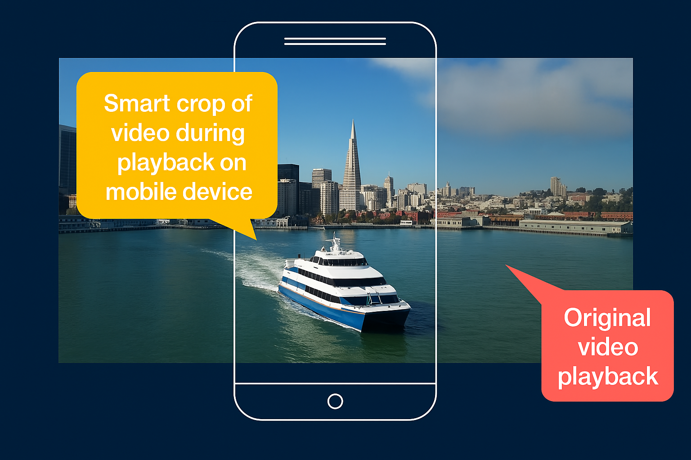

# Perfis de vídeo do Dynamic Media{#video-profiles}

O Dynamic Media já vem com um perfil de Codificação de vídeo adaptável predefinido. As configurações desse perfil pronto para uso são otimizadas para fornecer aos clientes a melhor experiência de visualização possível. Ao codificar os vídeos de origem primária usando o perfil Codificação de vídeo adaptável, durante a reprodução, o reprodutor de vídeo ajusta automaticamente a qualidade do fluxo de vídeo com base na velocidade de conexão com a Internet dos clientes. Essa ação é conhecida como transmissão adaptável de taxa de bits.

Estes são outros fatores que determinam a qualidade dos seus vídeos:

* **Resolução do vídeo de origem primária carregado**

  Se o vídeo MP4 foi gravado em uma resolução mais baixa, como 240p ou 360p, ele não poderá ser transmitido em alta definição.

* **Tamanho do player de vídeo**

  Por padrão, a &quot;Largura&quot; no perfil de Codificação de vídeo adaptável está definida como &quot;Automática&quot;. Novamente, durante a reprodução, a melhor qualidade é usada com base no tamanho do reprodutor.

Consulte [Práticas recomendadas de codificação de vídeo](/help/assets/dynamic-media/video.md#best-practices-for-encoding-videos).

Consulte também [Práticas recomendadas para organizar sua Assets digital para usar Perfis de processamento](/help/assets/organize-assets.md).

>[!NOTE]
>
>Para gerar os metadados de um vídeo e as miniaturas de imagem de vídeo associadas, o próprio vídeo deve passar pelo processo de codificação no Dynamic Media. No Adobe Experience Manager, o fluxo de trabalho **[!UICONTROL Codificação de vídeo do Dynamic Media]** codifica o vídeo se você tiver habilitado o Dynamic Media e configurado os serviços da nuvem de vídeo. Esse fluxo de trabalho captura o histórico do processo de fluxo de trabalho e as informações de falha. Consulte [Monitorar o progresso da codificação de vídeo e da publicação no YouTube](/help/assets/dynamic-media/video.md#monitoring-video-encoding-and-youtube-publishing-progress). Se você tiver habilitado o Dynamic Media e configurado os serviços de nuvem de vídeo, o fluxo de trabalho **[!UICONTROL Codificação de vídeo do Dynamic Media]** será aplicado automaticamente ao carregar um vídeo. (Se você não estiver usando o Dynamic Media, o fluxo de trabalho **[!UICONTROL Ativo de atualização do DAM]** entrará em vigor.)
>
>Os metadados são úteis ao pesquisar ativos. As miniaturas são imagens de vídeo estáticas geradas durante a codificação. Eles são exigidos pelo sistema Experience Manager e usados na interface do usuário para ajudar a identificar visualmente os vídeos na exibição Cartões, na exibição Resultados da pesquisa e na exibição da Lista de ativos. É possível ver as miniaturas geradas ao selecionar o ícone Representações (uma paleta do Painter) de um vídeo codificado.

Quando terminar de criar o Perfil de vídeo, você o aplica a uma ou várias pastas. Consulte [Aplicar um perfil de vídeo às pastas](#applying-a-video-profile-to-folders).

Para definir parâmetros de processamento avançado para outros tipos de ativos, consulte [Configurar processamento de ativos](/help/assets/dynamic-media/config-dm.md#configuring-asset-processing).

Consulte também [Perfis para processamento de metadados, imagens e vídeos](/help/assets/dynamic-media/about-image-video-profiles.md).

## Predefinições de codificação de vídeo adaptável {#adaptive-video-encoding-presets}

A tabela a seguir identifica as práticas recomendadas ao codificar perfis para transmissão contínua de vídeo adaptável para dispositivos móveis e tablets e computadores desktop. É possível usar essas predefinições para qualquer proporção de vídeo.

<table>
 <tbody>
  <tr>
   <td><strong>Codec de formatação do vídeo</strong></td>
   <td><strong>Tamanho do vídeo - Largura (px)</strong></td>
   <td><strong>Tamanho do vídeo - Altura (px)</strong></td>
   <td><strong>Manter taxa de proporção?</strong></td>
   <td><strong>Taxa De Bits Do Vídeo (Kbps)</strong></td>
   <td><strong>Taxa De Quadros Do Vídeo (Fps)</strong></td>
   <td><strong>Codec de áudio</strong></td>
   <td><strong>Taxa De Áudio (Kbps)</strong></td>
  </tr>
  <tr>
   <td>
MP4 H.264 (mp4)
 </td>
   <td>auto</td>
   <td>360</td>
   <td>Sim</td>
   <td>730</td>
   <td>30</td>
   <td>Dolby HE-AAC</td>
   <td>128</td>
  </tr>
  <tr>
   <td>
MP4 H.264 (mp4)
 </td>
   <td>auto</td>
   <td>540</td>
   <td>Sim</td>
   <td>2000  </td>
   <td>30</td>
   <td>Dolby HE-AAC</td>
   <td>128</td>
  </tr>
  <tr>
   <td>
MP4 H.264 (mp4)
 </td>
   <td>auto</td>
   <td>720  </td>
   <td>Sim</td>
   <td>3000  </td>
   <td>30</td>
   <td>Dolby HE-AAC</td>
   <td>128</td>
  </tr>
 </tbody>
</table>

## Sobre o uso de recorte inteligente em Perfis de vídeo {#about-smart-crop-video}

O recorte inteligente para vídeo é um recurso opcional disponível em Perfis de vídeo. É uma ferramenta que usa a IA do Adobe para detectar e recortar automaticamente o ponto focal em qualquer vídeo adaptável ou vídeo progressivo que você tenha carregado, independentemente do tamanho.

Os formatos de vídeo compatíveis com o corte inteligente incluem MP4, MKV, MOV, AVI, FLV e WMV.

O tamanho máximo suportado do arquivo de vídeo para corte inteligente é o seguinte:

* Duração de cinco minutos.
* 30 quadros por segundo (FPS).
* Tamanho do arquivo de 300 MB.

A IA do Adobe é limitada a 9000 quadros. Isto é, cinco minutos a 30 FPS. Se o vídeo tiver um FPS mais alto, a duração máxima de vídeo compatível diminuirá. Por exemplo, um vídeo de 60 FPS deve ter dois minutos e meio de duração para ser compatível com a IA do Adobe e o recorte inteligente.

>[!IMPORTANT]
>
>Para que o recorte inteligente de vídeo funcione, você deve incluir uma ou mais predefinições de codificação de vídeo no seu Perfil de vídeo.

Para usar o recorte inteligente para vídeo, você cria um perfil de codificação de vídeo adaptável ou progressivo. Como parte do seu perfil, use a ferramenta **[!UICONTROL Taxa de Corte Inteligente]** para selecionar taxas de aspecto predefinidas. Por exemplo, depois de definir as predefinições de codificação de vídeo, é possível adicionar uma definição de &quot;Paisagem móvel&quot; com uma proporção de 16x9 e uma definição de &quot;Retrato móvel&quot; com uma proporção de 9x16. Outras proporções de aspecto ou corte que podem ser escolhidas para incluir 1x1, 4x3 e 4x5.

Você pode alternar entre ativado e desativado o recorte inteligente de vídeo no Perfil de vídeo usando o controle deslizante à direita da **[!UICONTROL Taxa de recorte inteligente]** na interface.

Depois de criar e salvar seu Perfil de vídeo, você pode aplicá-lo às pastas desejadas.

Consulte [Aplicar perfis de vídeo a pastas específicas](#applying-video-profiles-to-specific-folders) ou [Aplicar um perfil de vídeo globalmente](#applying-a-video-profile-globally).

Consulte também [Recorte inteligente para imagens](image-profiles.md).

## Criar um perfil de vídeo para transmissão adaptável da taxa de bits {#creating-a-video-encoding-profile-for-adaptive-streaming}

O Dynamic Media já vem com um perfil de Codificação de vídeo adaptável predefinido - um grupo de configurações de upload de vídeo para MP4 H.264 - que é otimizado para obter a melhor experiência de visualização. Você pode usar este perfil quando carregar seus vídeos.

No entanto, se esse perfil predefinido não atender às suas necessidades, você pode optar por criar seu próprio perfil de codificação de vídeo adaptável. Como prática recomendada, ao usar a configuração **[!UICONTROL Codificar para transmissão adaptável]**, todas as predefinições de codificação adicionadas ao perfil são validadas. Essa funcionalidade garante que todos os vídeos tenham a mesma proporção. Além disso, os vídeos codificados são tratados como uma taxa de multibits definida para transmissão.

Ao criar o perfil de codificação de vídeo, você observa que a maioria das opções de codificação é pré-preenchida com configurações padrão recomendadas para ajudar. No entanto, se você selecionar um valor diferente do padrão recomendado, poderá resultar em baixa qualidade de vídeo durante a reprodução e outros problemas de desempenho.

Assim, para todas as predefinições de codificação de vídeo MP4 H.264 no perfil, os seguintes valores são validados para garantir que sejam os mesmos em todas as predefinições individuais de codificação no perfil, possibilitando o streaming da taxa de bits adaptável:

* Codec de formato de vídeo - MP4 H.264 (.mp4)
* Codec de áudio
* Taxa de áudio
* Manter taxa de proporção
* Codificação em dois passos
* Taxa de bits constante
* Perfil H264
* Taxa de amostra do áudio

Se os valores não forem os mesmos, você pode continuar criando o perfil como está. No entanto, a transmissão adaptável da taxa de bits não é possível. Em vez disso, os usuários experimentam transmissão com taxa de bits única. É recomendável editar as configurações de codificação para usar os mesmos valores em predefinições individuais de codificação no perfil. (O editor de Perfil de vídeo/predefinição impõe a paridade das configurações de codificação de vídeo adaptável se a opção &quot;Codificar para transmissão adaptável&quot; estiver ativada.)

Consulte também [Criar um perfil de codificação de vídeo para streaming progressivo](#creating-a-video-encoding-profile-for-progressive-streaming).

Consulte também [Práticas recomendadas de codificação de vídeo](/help/assets/dynamic-media/video.md#best-practices-for-encoding-videos).

Para definir parâmetros de processamento avançado para outros tipos de ativos, consulte [Configurar processamento de ativos](/help/assets/dynamic-media/config-dm.md#configuring-asset-processing).

**Para criar um Perfil de Vídeo para transmissão adaptável da taxa de bits:**

1. Selecione o logotipo do Experience Manager e navegue até **[!UICONTROL Ferramentas]** > **[!UICONTROL Assets]** > **[!UICONTROL Perfis de Vídeo]**.
1. Selecione **[!UICONTROL Criar]**.
1. Insira um nome e uma descrição para o perfil.
1. Na página Criar/Editar Predefinições de Codificação de Vídeo, selecione **[!UICONTROL Adicionar Predefinição de Codificação de Vídeo]**.
1. Na guia **[!UICONTROL Básico]**, defina as opções de vídeo e áudio.
Selecione o ícone de informações ao lado de cada opção para obter mais descrições ou configurações recomendadas com base no codec de formato de vídeo selecionado.
1. No cabeçalho Tamanho do vídeo, verifique se **[!UICONTROL Manter taxa de proporção]** está marcada.
1. Defina a resolução do tamanho do quadro do vídeo em pixels. Use o valor **[!UICONTROL Automático]** para dimensionar automaticamente para corresponder à taxa de proporção de origem (largura e altura). Por exemplo, Automático x 480 ou 640 x Automático.

1. Siga uma das seguintes opções:

   * No campo **[!UICONTROL Largura]**, digite **[!UICONTROL auto]**. No campo **[!UICONTROL Altura]**, digite um valor em pixels.

   * Para ajudá-lo a visualizar o tamanho do vídeo, selecione o ícone Informações (i) à direita de **[!UICONTROL Altura]** para abrir a página Calculadora de tamanho. Use a **[!UICONTROL Calculadora de Tamanho]** para definir as dimensões do vídeo (representadas pela caixa azul) desejadas. Selecione **[!UICONTROL X]** no canto superior direito quando terminar.

1. (Opcional) Selecione a guia **[!UICONTROL Avançado]** e certifique-se de que a caixa de seleção **[!UICONTROL Usar valores padrão]** esteja marcada (recomendado). Como alternativa, modifique as configurações avançadas de vídeo e áudio.
1. No canto superior direito da página, selecione **[!UICONTROL Salvar]** para salvar a predefinição.
1. Siga uma das seguintes opções:
   * Repita as etapas 4 a 10 para criar mais predefinições de codificação. (O streaming de vídeo adaptável requer mais de uma predefinição de vídeo.)
   * Continue com a próxima etapa.

1. (Opcional) Para adicionar o recorte inteligente de vídeo aos vídeos aos quais esse perfil é aplicado, faça o seguinte:
   * Na página Editar perfil de vídeo, à direita do cabeçalho Proporção de corte inteligente, selecione **[!UICONTROL Adicionar novo]**.
   * No campo Nome, digite um nome para a taxa de corte que ajude a identificá-la facilmente.
   * Na lista suspensa **[!UICONTROL Taxa de Corte]**, selecione a taxa que deseja usar.

1. Siga uma das seguintes opções:

   * Continue adicionando novas taxas de corte, conforme necessário.
   * Continue com a próxima etapa.

1. No canto superior direito da página, selecione **[!UICONTROL Salvar]** novamente para salvar o perfil.

Agora é possível aplicar o perfil às pastas que contêm vídeos. Consulte [Aplicar um perfil de vídeo a pastas](#applying-a-video-profile-to-folders) ou [Aplicar um perfil de vídeo globalmente](#applying-a-video-profile-globally).

## Criar um perfil de vídeo para transmissão progressiva {#creating-a-video-encoding-profile-for-progressive-streaming}

Se você optar por não usar a opção **[!UICONTROL Codificar para transmissão adaptável]**, todas as predefinições de codificação adicionadas ao perfil serão tratadas como representações de vídeo individuais para transmissão de streaming com taxa de bits única ou entrega de vídeo progressiva. Além disso, não há validação para garantir que todas as representações de vídeo tenham a mesma proporção.

O codec de formato de vídeo com suporte é H.264 (.mp4). <!-- use to also include WebM but was requested for removal by Riya Midha in email dated October 14, 2024 -->

Consulte também [Criar um perfil de codificação de vídeo para transmissão adaptável da taxa de bits](#creating-a-video-encoding-profile-for-adaptive-streaming).

Consulte também [Práticas recomendadas de codificação de vídeo](/help/assets/dynamic-media/video.md#best-practices-for-encoding-videos).

Para definir parâmetros de processamento avançado para outros tipos de ativos, consulte [Configuração do processamento de ativos](/help/assets/dynamic-media/config-dm.md#configuring-asset-processing).

**Para criar um Perfil de Vídeo para transmissão progressiva:**

1. Selecione o logotipo do Experience Manager e navegue até **[!UICONTROL Ferramentas]** > **[!UICONTROL Assets]** > **[!UICONTROL Perfis de Vídeo]**.
1. Selecione **[!UICONTROL Criar]**.
1. Insira um nome e uma descrição para o perfil.
1. Na página Criar/Editar Predefinições de Codificação de Vídeo, selecione **[!UICONTROL Adicionar Predefinição de Codificação de Vídeo]**.
1. Na guia **[!UICONTROL Básico]**, defina as opções de vídeo e áudio.
Selecione o ícone de informações ao lado de cada opção para obter mais descrições ou configurações recomendadas com base no codec de formato de vídeo selecionado.
1. (Opcional) No cabeçalho Tamanho do vídeo, desmarque **[!UICONTROL Manter taxa de proporção]**.
1. Faça o seguinte:
   * No campo **[!UICONTROL Largura]**, digite **[!UICONTROL auto]**.
   * No campo **[!UICONTROL Altura]**, digite um valor em pixels.
Para ajudá-lo a visualizar o tamanho do vídeo, selecione o ícone Informações de altura para abrir a página **[!UICONTROL Calculadora de tamanho]**. Use a página **[!UICONTROL Calculadora de tamanho]** para definir ainda mais o tamanho do vídeo (caixa azul) como desejar. Quando terminar, no canto superior direito da caixa de diálogo, selecione **[!UICONTROL X]**.
1. (Opcional) Siga um destes procedimentos:

   * Selecione a guia **[!UICONTROL Avançado]** e verifique se a caixa de seleção **[!UICONTROL Usar Valores Padrão]** está marcada (recomendado).

   * Desmarque a caixa de seleção **[!UICONTROL Usar Valores Padrão]** e especifique as configurações de vídeo e áudio desejadas.
Selecione o ícone de informações ao lado de cada opção para obter mais descrições ou configurações recomendadas com base no codec de formato de vídeo selecionado.

1. No canto superior direito da página, selecione **[!UICONTROL Salvar]** para salvar a predefinição.
1. Siga uma das seguintes opções:

   * Repita as etapas 4 a 9 para criar mais predefinições de codificação.
   * Continue com a próxima etapa.

1. (Opcional) Para adicionar o recorte inteligente de vídeo aos vídeos aos quais esse perfil é aplicado, faça o seguinte:

   * Na página Editar perfil de vídeo, à direita do cabeçalho Proporção de corte inteligente, selecione **[!UICONTROL Adicionar novo]**.
   * No campo Nome, digite um nome para a taxa de corte que ajude a identificá-la facilmente.
   * Na lista suspensa **[!UICONTROL Taxa de Corte]**, selecione a taxa que deseja usar.

1. Siga uma das seguintes opções:

   * Continue adicionando novas taxas de corte, conforme necessário.
   * Continue com a próxima etapa.

1. No canto superior direito da página, selecione **[!UICONTROL Salvar]** para salvar o perfil.

Agora é possível aplicar o perfil às pastas que contêm vídeos. Consulte [Aplicar um Perfil de Vídeo a pastas](#applying-a-video-profile-to-folders) ou [Aplicar um Perfil de Vídeo globalmente](#applying-a-video-profile-globally).

## Usar parâmetros de codificação de vídeo adicionados personalizados {#using-custom-added-video-encoding-parameters}

É possível editar um perfil de codificação existente para vídeos, para aproveitar os parâmetros avançados de codificação de vídeo não encontrados na interface do usuário ao criar ou editar um Perfil de vídeo no Experience Manager. É possível adicionar de forma personalizada um ou mais parâmetros avançados, como minBitrate e maxBitrate, ao perfil existente.

**Para usar parâmetros de codificação de vídeo adicionados personalizados:**

1. Selecione o logotipo do Experience Manager e navegue até **[!UICONTROL Ferramentas]** > **[!UICONTROL Geral]** > **[!UICONTROL CRXDE Lite]**.
1. Na página do CRXDE Lite, no painel Explorer à esquerda, navegue até o seguinte:

   `/conf/global/settings/dam/dm/presets/video/*name_of_video_encoding_profile_to_edit`

1. No painel no lado inferior direito da página, na guia Propriedades, especifique o **[!UICONTROL Nome]**, o **[!UICONTROL Tipo]** e o **[!UICONTROL Valor]** do parâmetro que deseja usar.

   Os seguintes parâmetros avançados estão disponíveis para uso:

<table>
 <tbody>
  <tr>
   <td><strong>Nome</strong></td>
   <td><strong>Descrição</strong>  </td>
   <td><strong>Tipo</strong>  </td>
   <td><strong>Valor</strong></td>
  </tr>
  <tr>
   <td><code>h264Level</code></td>
   <td>Nível H.264 a ser usado para codificação. Normalmente, esse nível é determinado automaticamente com base nas configurações de codificação que você está usando.</td>
   <td><code>String</code></td>
   <td>
10 * nível h264
 
Por exemplo, 3,0 = 30, 1,3 = 13)
 
Nenhum valor padrão.
 </td>
  </tr>
  <tr>
   <td><code>keyframe</code></td>
   <td>O número alvo de quadros entre quadros-chave. Calcule esse valor para gerar um quadro principal a cada 2-10 segundos. Por exemplo, em 30 quadros por segundo, o intervalo do quadro principal é de 60 a 300.    Os intervalos de quadro-chave mais baixos melhoram a busca por transmissão e o comportamento de comutação de fluxo para codificações de vídeo adaptáveis, além de melhorarem a qualidade de vídeos com muito movimento. No entanto, como os quadros-chave aumentam o tamanho de um arquivo, um intervalo de quadro-chave menor geralmente resulta em uma qualidade geral de vídeo mais baixa em uma determinada taxa de bits.</td>
   <td><code>String</code></td>
   <td>
Número positivo.
 
O padrão é 300.
 
O valor recomendado para HLS ou DASH (transmissão adaptável da taxa de bits) é de 60 a 90.
 </td>
  </tr>
  <tr>
   <td><code>minBitrate</code></td>
   <td>
Taxa de bits mínima para permitir codificações variáveis de taxa de bits, em Kbps (kilobits por segundo).
 
Esse parâmetro só se aplica quando <strong> Usar taxa de bits constante</strong> é desmarcado na guia Avançado ao criar ou editar um perfil de codificação de vídeo.
 
Consulte também <a href="/help/assets/dynamic-media/video.md#bitrate">Taxa de bits</a>.
 </td>
   <td><code>String</code></td>
   <td>
Número positivo, em Kbps.
 
Nenhum valor padrão.
 </td>
  </tr>
  <tr>
   <td><code>maxBitrate</code></td>
   <td>
Taxa de bits máxima para permitir codificações variáveis de taxa de bits, em Kbps.
 
Esse parâmetro só se aplica quando <strong> Usar taxa de bits constante</strong> é desmarcado na guia Avançado ao criar ou editar um perfil de codificação de vídeo.
 
Consulte também <a href="/help/assets/dynamic-media/video.md#bitrate">Taxa de bits</a>.
 </td>
   <td><code>String</code></td>
   <td>
Número positivo, em Kbps.
 
Nenhum valor padrão. No entanto, o valor recomendado é até duas vezes a taxa de bits da codificação.
 </td>
  </tr>
  <tr>
   <td><code>audioBitrateCustom</code></td>
   <td>Defina o valor como <code>true</code> para forçar uma taxa de bits constante para o fluxo de áudio, se suportado pelo codec de áudio.</td>
   <td><code>String</code></td>
   <td>
<code>true</code>/<code>false</code>
 
O padrão é <code>false</code>.
 
O valor recomendado para HLS ou DASH é <code>false</code>.
 
 
 </td>
  </tr>
 </tbody>
</table>

1. Próximo ao canto inferior direito da página, selecione **[!UICONTROL Adicionar]**.
1. Siga uma das seguintes opções:

   * Repita as etapas 3 e 4 para adicionar outro parâmetro ao perfil de codificação de vídeo.
   * Próximo ao canto superior esquerdo da página, selecione **[!UICONTROL Salvar tudo]**.

1. No canto superior esquerdo da página do CRXDE Lite, selecione o ícone **[!UICONTROL Voltar à página inicial]** para retornar ao Experience Manager.

### Editar um perfil de vídeo {#editing-a-video-encoding-profile}

É possível editar qualquer Perfil de vídeo criado para adicionar, editar ou excluir predefinições de vídeo nesse perfil.

Por padrão, você não pode editar o perfil predefinido **[!UICONTROL Codificação de vídeo adaptável]** que veio com o Dynamic Media. Em vez disso, você pode copiar o perfil facilmente e salvá-lo com um novo nome. É possível editar as predefinições desejadas no perfil copiado.

Consulte também [Práticas recomendadas de codificação de vídeo](/help/assets/dynamic-media/video.md#best-practices-for-encoding-videos).

Para definir parâmetros de processamento avançado para outros tipos de ativos, consulte [Configurar processamento de ativos](/help/assets/dynamic-media/config-dm.md#configuring-asset-processing).

**Para editar um Perfil de Vídeo:**

1. Selecione o logotipo do Experience Manager e navegue até **[!UICONTROL Ferramentas]** > **[!UICONTROL Assets]** > **[!UICONTROL Perfis de Vídeo]**.
1. Na página Perfis de vídeo, marque um nome de Perfil de vídeo.
1. Na barra de ferramentas, selecione **[!UICONTROL Editar]**.
1. Na página Perfil de codificação de vídeo, edite o nome e a descrição, conforme desejado.
1. Como prática recomendada, verifique se a caixa de seleção **[!UICONTROL Codificar para transmissão adaptável]** está marcada.
Selecione o ícone de informações para obter uma descrição da transmissão adaptável da taxa de bits. (Se você estiver editando um Perfil de vídeo progressivo, não marque essa caixa de seleção.)
1. No cabeçalho Predefinições de codificação de vídeo, adicione, edite ou exclua predefinições de codificação de vídeo que compõem o perfil.

   Selecione o ícone de informações ao lado de cada opção nas guias **[!UICONTROL Básico]** e **[!UICONTROL Avançado]** para obter mais descrições ou configurações recomendadas com base no codec de formato de vídeo selecionado.

1. No canto superior direito da página, selecione **[!UICONTROL Salvar]**.

### Copiar um perfil de vídeo {#copying-a-video-encoding-profile}

1. Selecione o logotipo do Experience Manager e navegue até **[!UICONTROL Ferramentas]** > **[!UICONTROL Assets]** > **[!UICONTROL Perfis de Vídeo]**.
1. Na página Perfis de vídeo, marque um nome de Perfil de vídeo.
1. Na barra de ferramentas, selecione **[!UICONTROL Copiar]**.
1. Na página Perfil de codificação de vídeo, digite um novo nome para o perfil.
1. Como prática recomendada, verifique se a caixa de seleção **[!UICONTROL Codificar para transmissão adaptável]** está selecionada. Selecione o ícone de informações para obter uma descrição da transmissão adaptável da taxa de bits. (Se estiver copiando um Perfil de vídeo progressivo, não marque a caixa de seleção.)

   No modo Dynamic Media - Híbrido, se uma predefinição de vídeo WebM fizer parte do Perfil de Vídeo, **[!UICONTROL a codificação para o fluxo adaptável]** não será possível, pois todas as predefinições devem ser MP4.
1. No cabeçalho Predefinições de codificação de vídeo, adicione, edite ou exclua predefinições de codificação de vídeo que compõem o perfil.

   Selecione o ícone de informações ao lado de cada opção nas guias Básico e Avançado para obter as configurações e descrições recomendadas.

1. No canto superior direito da página, selecione **[!UICONTROL Salvar]**.

### Excluir um perfil de vídeo {#deleting-a-video-encoding-profile}

1. Selecione o logotipo do Experience Manager e navegue até **[!UICONTROL Ferramentas]** > **[!UICONTROL Assets]** > **[!UICONTROL Perfis de Vídeo]**.
1. Na página Perfis de vídeo, verifique um ou mais nomes de Perfis de vídeo.
1. Na barra de ferramentas, selecione **[!UICONTROL Excluir]**.
1. Selecione **[!UICONTROL OK]**.

## Aplicar um perfil de vídeo a pastas {#applying-a-video-profile-to-folders}

Quando você atribui um Perfil de vídeo a uma pasta, todas as subpastas herdam automaticamente o perfil da pasta principal. Dessa forma, você pode atribuir apenas um Perfil de vídeo a uma pasta. Dessa forma, considere cuidadosamente a estrutura de pastas de onde você faz upload, armazena, usa e arquiva ativos.

Se você atribuiu um Perfil de vídeo diferente a uma pasta, o novo perfil substituirá o perfil anterior. Os ativos de pasta existentes anteriormente permanecem inalterados. O novo perfil é aplicado aos ativos que são adicionados à pasta posteriormente.

As pastas que têm um perfil atribuído a elas são indicadas na interface do usuário usando o nome do perfil exibido no nome do cartão.

Aplique Perfis de vídeo a pastas específicas ou globalmente a todos os ativos.

Você pode reprocessar ativos em uma pasta que já tenha um Perfil de vídeo existente que você alterou posteriormente. Consulte [Reprocessamento de ativos em uma pasta](/help/assets/dynamic-media/about-image-video-profiles.md#reprocessing-assets).

### Aplicar um perfil de vídeo a pastas específicas {#applying-video-profiles-to-specific-folders}

Aplique um Perfil de Vídeo a uma pasta no menu **[!UICONTROL Ferramentas]** ou, se estiver na pasta, em **[!UICONTROL Propriedades]**. Esta seção descreve como aplicar Perfis de vídeo a pastas de ambas as maneiras.

As pastas que têm um perfil já atribuído a elas são indicadas ao exibir do nome do perfil logo abaixo do nome da pasta.

Consulte também [Reprocessar ativos em uma pasta depois de editar seu perfil de processamento](/help/assets/dynamic-media/about-image-video-profiles.md#reprocessing-assets).

#### Aplicar um perfil de vídeo a pastas por meio da interface do usuário Perfis {#applying-video-profiles-to-folders-by-way-of-the-profiles-user-interface}

1. Selecione o logotipo do Experience Manager e navegue até **[!UICONTROL Ferramentas]** > **[!UICONTROL Assets]** > **[!UICONTROL Perfis de Vídeo]**.
1. Selecione o Perfil de vídeo que deseja aplicar a uma ou várias pastas.
1. Selecione **[!UICONTROL Aplicar perfil às pastas]** e selecione uma ou várias pastas que deseja usar para receber os ativos carregados recentemente e selecione **[!UICONTROL Aplicar]**. As pastas que têm um perfil já atribuído a elas são indicadas ao exibir do nome do perfil logo abaixo do nome da pasta enquanto estão na **[!UICONTROL Exibição de Cartão]**.
Você pode [monitorar o progresso de um trabalho de processamento de Perfil de Vídeo](#monitoring-the-progress-of-an-encoding-job).

#### Aplicar um perfil de vídeo a pastas em Propriedades {#applying-video-profiles-to-folders-from-properties}

1. Selecione o logotipo do Experience Manager e navegue até **[!UICONTROL Assets]** e, em seguida, até a pasta à qual você deseja aplicar um Perfil de Vídeo.
1. Na pasta, marque a marca de seleção para selecioná-la e selecione **[!UICONTROL Propriedades]**.
1. Selecione a guia **[!UICONTROL Perfis de Vídeo]**, selecione o perfil no menu suspenso e selecione **[!UICONTROL Salvar e Fechar]**. As pastas que têm um perfil já atribuído a elas são indicadas ao exibir do nome do perfil logo abaixo do nome da pasta.

   
Você pode [monitorar o progresso de um trabalho de processamento de Perfil de Vídeo](#monitoring-the-progress-of-an-encoding-job).

### Aplicar um perfil de vídeo globalmente {#applying-a-video-profile-globally}

Além de aplicar um perfil a uma pasta, também é possível aplicá-lo globalmente para que qualquer conteúdo carregado nos ativos do Experience Manager em qualquer pasta tenha o perfil selecionado aplicado.

Consulte também [Reprocessar ativos em uma pasta](/help/assets/dynamic-media/about-image-video-profiles.md#reprocessing-assets).

**Para aplicar um Perfil de Vídeo globalmente:**

* Navegue até o CRXDE Lite para o seguinte nó: `/content/dam/jcr:content`. Adicione a propriedade `videoProfile:/libs/settings/dam/video/dynamicmedia/<name of video encoding profile>` e selecione **[!UICONTROL Salvar tudo]**.

  
* Você pode [monitorar o progresso de um trabalho de processamento de Perfil de Vídeo](#monitoring-the-progress-of-an-encoding-job).

## Monitorar o progresso de um trabalho de processamento do Perfil de vídeo {#monitoring-the-progress-of-an-encoding-job}

Um indicador de processamento (ou barra de progresso) é exibido para que você possa monitorar visualmente o progresso de um trabalho de processamento do Perfil de vídeo.

Você também pode exibir o arquivo `error.log` para monitorar o progresso de um trabalho de codificação, para ver se a codificação foi concluída ou para ver quaisquer erros de trabalho. O `error.log` é encontrado na pasta `logs` onde sua instância do Experience Manager está instalada.

## Remover um perfil de vídeo das pastas {#removing-a-video-profile-from-folders}

Ao remover um Perfil de vídeo de uma pasta, todas as subpastas herdam automaticamente a remoção do perfil da pasta principal. No entanto, qualquer processamento de arquivos que tenha ocorrido nas pastas permanece intacto.

Você pode remover um Perfil de Vídeo de uma pasta no menu **[!UICONTROL Ferramentas]** ou, se estiver na pasta, nas **[!UICONTROL Configurações de Pasta]**. Esta seção descreve como remover Perfis de vídeo de pastas de ambas as maneiras.

### Remover um perfil de vídeo das pastas por meio da interface do usuário Perfis {#removing-video-profiles-from-folders-by-way-of-the-profiles-user-interface}

1. Selecione o logotipo do Experience Manager e navegue até **[!UICONTROL Ferramentas]** > **[!UICONTROL Assets]** > **[!UICONTROL Perfis de Vídeo]**.
1. Selecione o Perfil de vídeo que deseja remover de uma ou várias pastas.
1. Selecione **[!UICONTROL Remover Perfil das Pastas]**, selecione uma ou várias pastas que deseja usar para remover o perfil e selecione **[!UICONTROL Remover]**.

   Você pode confirmar que o Perfil de vídeo não é mais aplicado a uma pasta porque o nome não aparece mais abaixo do nome da pasta.

### Remova um Perfil de vídeo das pastas por meio de Propriedades {#removing-video-profiles-from-folders-by-way-of-properties}

1. Selecione o logotipo do Experience Manager, navegue até o **[!UICONTROL Assets]** e, em seguida, acesse a pasta da qual deseja remover um Perfil de Vídeo.
1. Na pasta, marque a marca de seleção para selecioná-la e selecione **[!UICONTROL Propriedades]**.
1. Selecione a guia **[!UICONTROL Perfis de Vídeo]**, selecione **[!UICONTROL Nenhum]** no menu suspenso e selecione **[!UICONTROL Salvar e Fechar]**. As pastas que têm um perfil já atribuído a elas são indicadas ao exibir do nome do perfil logo abaixo do nome da pasta.
