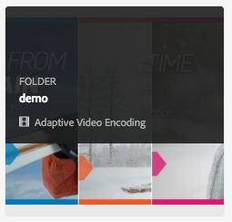

# Video profiles{#video-profiles}

O Dynamic Media já vem com um perfil de Codificação de vídeo adaptável predefinido. As configurações neste perfil predefinido são otimizadas para fornecer aos clientes a melhor experiência de visualização possível. Quando você codifica seus vídeos mestre usando o perfil Adaptive Video Encoding, durante a reprodução o player de vídeo ajusta automaticamente a qualidade do fluxo de vídeo com base na velocidade de conexão com a Internet de seus clientes. Isso é conhecido como streaming adaptável.

Estes são outros fatores que determinam a qualidade de seus vídeos:

* **Resolução do vídeo mestre carregado**

   Se o vídeo MP4 foi gravado em uma resolução mais baixa, como 240p ou 360p, ele não pode ser transmitido em alta definição.

* **Tamanho do player de vídeo**

   Por padrão, a &quot;Largura&quot; no perfil da Codificação de vídeo adaptável é definida como &quot;Auto&quot;. Novamente, durante a reprodução, a melhor qualidade é usada com base no tamanho do player.

Consulte Práticas [recomendadas para codificação](/help/assets/dynamic-media/video.md#best-practices-for-encoding-videos)de vídeo.

Consulte também Práticas [recomendadas para organizar seus ativos digitais para usar perfis](/help/assets/dynamic-media/best-practices-for-file-management.md)de processamento.

>[!NOTE]
>
>Para gerar os metadados de um vídeo e as miniaturas de imagem de vídeo associadas, o próprio vídeo precisa passar pelo processo de codificação no Dynamic Media. No AEM, o fluxo de trabalho Codificação de vídeo **** do Dynamic Media codifica o vídeo se você ativou a mídia dinâmica e configurou os serviços da nuvem de vídeo. Esse fluxo de trabalho captura o histórico do processo de fluxo de trabalho e as informações de falha. Consulte [Monitorando o progresso](/help/assets/dynamic-media/video.md#monitoring-video-encoding-and-youtube-publishing-progress)da codificação de vídeo e da publicação no YouTube. Se você ativou a mídia dinâmica e configurou os serviços da nuvem de vídeo, o fluxo de trabalho Codificação de vídeo **** da Dynamic Media entra em vigor automaticamente quando você carrega um vídeo. (Se você não estiver usando mídia dinâmica, o fluxo de trabalho Atualizar ativo **[!UICONTROL do]** DAM entrará em vigor.)
>
>Os metadados são úteis quando você está procurando ativos. As miniaturas são imagens de vídeo estáticas geradas durante a codificação. Elas são exigidas pelo sistema AEM e usadas na interface do usuário para ajudar a identificar visualmente os vídeos na exibição Cartões, na exibição Resultados da pesquisa e na exibição Lista de ativos. É possível ver as miniaturas geradas ao tocar no ícone Representações (paleta do pintor) de um vídeo codificado.

Quando terminar de criar o perfil de vídeo, aplique-o a uma pasta ou várias pastas. See [Applying a video profile to folders.](#applying-a-video-profile-to-folders)

Para definir parâmetros de processamento avançados para outros tipos de ativos, consulte [Configuração do processamento](/help/assets/dynamic-media/config-dm.md#configuring-asset-processing)de ativos.

Consulte também [Perfis para processar metadados, imagens e vídeos](/help/assets/dynamic-media/processing-profiles.md).

## Predefinições adaptáveis de codificação de vídeo {#adaptive-video-encoding-presets}

A tabela a seguir identifica perfis de codificação de práticas recomendadas para streaming de vídeo adaptável para dispositivos móveis e tablet e computadores desktop. É possível usar essas predefinições para qualquer vídeo com relação de aspecto.

<table>
 <tbody>
  <tr>
   <td><strong>Codec de formatação do vídeo</strong></td>
   <td><strong>Tamanho do vídeo - Largura (px)</strong></td>
   <td><strong>Tamanho do vídeo - Altura (px)</strong></td>
   <td><strong>Manter taxa de proporção?</strong></td>
   <td><strong>Taxa de bits de vídeo (Kbps)</strong></td>
   <td><strong>Taxa De Quadros De Vídeo (Fps)</strong></td>
   <td><strong>Codec de áudio</strong></td>
   <td><strong>Taxa de bits de áudio (Kbps)</strong></td>
  </tr>
  <tr>
   <td>
MP4 H.264 (mp4)
 </td>
   <td>auto</td>
   <td>360</td>
   <td>Sim</td>
   <td>730</td>
   <td>30</td>
   <td>Dolby HE-AAC</td>
   <td>128</td>
  </tr>
  <tr>
   <td>
MP4 H.264 (mp4)
 </td>
   <td>auto</td>
   <td>540</td>
   <td>Sim</td>
   <td>2000  </td>
   <td>30</td>
   <td>Dolby HE-AAC</td>
   <td>128</td>
  </tr>
  <tr>
   <td>
MP4 H.264 (mp4)
 </td>
   <td>auto</td>
   <td>720  </td>
   <td>Sim</td>
   <td>3000  </td>
   <td>30</td>
   <td>Dolby HE-AAC</td>
   <td>128</td>
  </tr>
 </tbody>
</table>

## Sobre o uso do recorte inteligente em perfis de vídeo {#about-smart-crop-video}

Recorte inteligente para vídeo e recurso opcional disponível em Perfis de vídeo - é uma ferramenta que usa o poder da inteligência artificial no Adobe Sensei para detectar e recortar automaticamente o ponto focal em qualquer vídeo adaptável ou progressivo que você tenha carregado, independentemente do tamanho.

Os formatos de vídeo suportados para recorte inteligente incluem MP4, MKV, MOV, AVI, FLV e WMV.

O tamanho máximo de arquivo de vídeo compatível para o recorte inteligente é o seguinte critério:

* Duração de cinco minutos.
* 30 quadros por segundo (FPS).
* 300 MB de tamanho de arquivo.

Observe que o Adobe Sensei está atualmente limitado a 9000 quadros. Ou seja, cinco minutos a 30 QPS. Se o vídeo tiver um FPS maior, a duração máxima do vídeo compatível diminuirá. Por exemplo, um vídeo de 60 FPS deve demorar dois minutos e meio para ser suportado pelo Adobe Sensai e recorte inteligente.

>[!IMPORTANT]
>
>Para que o recorte inteligente de vídeo funcione, é necessário incluir uma ou mais predefinições de codificação de vídeo com o perfil de vídeo.

Para usar o recorte inteligente para vídeo, crie um perfil de codificação de vídeo adaptável ou progressivo. Como parte do seu perfil, use a ferramenta **[!UICONTROL Smart Crop Ratio]** para selecionar proporções predefinidas. Como exemplo, depois de definir as predefinições de codificação de vídeo, você pode adicionar uma definição de &quot;Paisagem móvel&quot; com uma proporção de 16 x 9 e uma definição de &quot;Retrato móvel&quot; com uma proporção de 9 x 16. Outras proporções ou proporções de corte que podem ser escolhidas incluem 1x1, 4x3 e 4x5.

Observe que você pode alternar o recorte inteligente de vídeo no perfil de vídeo para ligar ou desligar usando o controle deslizante à direita da Proporção de recorte **** inteligente na interface do usuário.

Depois de criar e salvar seu perfil de vídeo, você pode aplicá-lo às pastas desejadas.

Consulte [Aplicar perfis de vídeo a pastas](#applying-video-profiles-to-specific-folders) específicas ou [Aplicar um perfil de vídeo globalmente](#applying-a-video-profile-globally).

Consulte também Recorte [inteligente para imagens](image-profiles.md).

## Criação de um perfil de vídeo para streaming adaptável {#creating-a-video-encoding-profile-for-adaptive-streaming}

O Dynamic Media já vem com um perfil de Codificação de vídeo adaptável predefinido - um grupo de configurações de upload de vídeo para MP4 H.264 - que é otimizado para a melhor experiência de visualização. Você pode usar esse perfil ao carregar seus vídeos.

No entanto, se esse perfil predefinido não atender às suas necessidades, você pode optar por criar seu próprio perfil de codificação de vídeo adaptável. Ao usar a configuração **[!UICONTROL Codificar para streaming]** adaptável - como prática recomendada - todas as predefinições de codificação adicionadas ao perfil são validadas para garantir que todos os vídeos tenham a mesma proporção. Além disso, os vídeos codificados são tratados como uma taxa de bits múltipla definida para streaming.

Ao criar o perfil de codificação de vídeo, você observará que a maioria das opções de codificação são preenchidas previamente com as configurações padrão recomendadas para ajudá-lo. No entanto, se você selecionar um valor diferente do padrão recomendado, esteja ciente de que isso pode resultar em baixa qualidade de vídeo durante a reprodução e outros problemas de desempenho.

Assim, para todas as predefinições de codificação de vídeo MP4 H.264 no perfil, os valores a seguir são validados para garantir que sejam os mesmos nas predefinições de codificação individuais no perfil, possibilitando o streaming adaptativo:

* Codec de formato de vídeo - MP4 H.264 (.mp4)
* Codec de áudio
* Taxa de áudio
* Manter taxa de proporção
* Codificação em dois passos
* Taxa de bits constante
* Perfil H264
* Taxa de amostra do áudio

Se os valores não forem os mesmos, você poderá continuar criando o perfil como está. No entanto, lembre-se de que o streaming adaptativo não será possível. Em vez disso, os usuários experimentarão o streaming de taxa de bits única. É recomendável editar as configurações de codificação para usar os mesmos valores em predefinições de codificação individuais no perfil. (Observe que o perfil de vídeo/editor predefinido deve impor a paridade das configurações de codificação de vídeo adaptáveis se &quot;Codificar para transmissão adaptativa&quot; estiver ativado.)

Consulte também [Criar um perfil de codificação de vídeo para streaming](#creating-a-video-encoding-profile-for-progressive-streaming)progressivo.

Consulte também Práticas [recomendadas para codificação](/help/assets/dynamic-media/video.md#best-practices-for-encoding-videos)de vídeo.

Para definir parâmetros de processamento avançados para outros tipos de ativos, consulte [Configuração do processamento](/help/assets/dynamic-media/config-dm.md#configuring-asset-processing)de ativos.

**Para criar um perfil de vídeo para streaming** adaptável,

1. Toque no logotipo do AEM e navegue até **[!UICONTROL Ferramentas]** > **[!UICONTROL Ativos]** > Perfis **[!UICONTROL de]** vídeo.
1. Clique ou toque em **[!UICONTROL Criar]** para adicionar um novo perfil de vídeo.

1. Insira um nome e uma descrição para o perfil.
1. Na página Criar/editar predefinições de codificação de vídeo, toque em **[!UICONTROL Adicionar predefinição]** de codificação de vídeo.
1. Na guia **[!UICONTROL Básico]** , defina as opções de vídeo e áudio.
Toque no ícone de informações ao lado de cada opção para obter descrições adicionais ou configurações recomendadas com base no codec de formato de vídeo selecionado.
1. No cabeçalho Tamanho do vídeo, verifique se a proporção **** Manter está marcada.
1. Defina a resolução do tamanho do quadro de vídeo em pixels. Use o valor **[!UICONTROL Automático]** para dimensionar automaticamente para corresponder à proporção de aspecto de origem (proporção largura/altura). Por exemplo, Auto x 480 ou 640 x Auto.

1. Faça uma das seguintes opções:

   * No campo **[!UICONTROL Largura]** , digite **[!UICONTROL auto]**. No campo **[!UICONTROL Altura]** , insira um valor em pixels.

   * Para ajudar a visualizar o tamanho do vídeo, toque no ícone Informações (i) à direita de **[!UICONTROL Altura]** para abrir a página Calculadora de tamanho. Use a Calculadora **[!UICONTROL de]** tamanho para definir as dimensões do vídeo (representada pela caixa azul) desejada. Toque em **[!UICONTROL X]** no canto superior direito quando terminar.

1. (Opcional) Toque na guia **[!UICONTROL Avançado]** e verifique se a caixa de seleção **[!UICONTROL Usar valores]** padrão está marcada (recomendável). Como alternativa, modifique as configurações avançadas de vídeo e áudio.
1. No canto superior direito da página, toque em **[!UICONTROL Salvar]** para salvar a predefinição.
1. Faça uma das seguintes opções:
   * Repita as etapas de 4 a 10 para criar predefinições de codificação adicionais. (O streaming adaptável de vídeo requer mais de uma predefinição.)
   * Continue com a próxima etapa.

1. (Opcional) Para adicionar o recorte inteligente de vídeo aos vídeos aos quais este perfil será aplicado, faça o seguinte:
   * Na página Editar perfil de vídeo, à direita do cabeçalho Taxa de corte inteligente, toque em **[!UICONTROL Adicionar novo]**.
   * No campo Nome, digite um nome para a proporção de corte que o ajudará a identificá-la facilmente.
   * Na lista suspensa Taxa de **[!UICONTROL corte]** , selecione a proporção que deseja usar.

1. Faça uma das seguintes opções:

   * Continue adicionando novas taxas de corte conforme necessário.
   * Continue com a próxima etapa.

1. No canto superior direito da página, toque em **[!UICONTROL Salvar]** novamente para salvar o perfil.

Agora você pode aplicar o perfil a pastas que contêm vídeos. Consulte [Aplicar um perfil de vídeo a pastas](#applying-a-video-profile-to-folders) ou [Aplicar um perfil de vídeo globalmente](#applying-a-video-profile-globally).

## Criação de um perfil de vídeo para streaming progressivo {#creating-a-video-encoding-profile-for-progressive-streaming}

Se você optar por não usar a opção **[!UICONTROL Codificar para transmissão]** adaptável, lembre-se de que todas as predefinições de codificação adicionadas ao perfil são tratadas como representações de vídeo individuais para transmissão de streaming de taxa de bits única ou entrega de vídeo progressiva. Além disso, não há validação para garantir que todas as execuções de vídeo tenham a mesma proporção.

Os codecs de formato de vídeo suportados são H.264 (.mp4) e WebM.

Consulte também [Criar um perfil de codificação de vídeo para streaming](#creating-a-video-encoding-profile-for-adaptive-streaming)adaptável.

Consulte também Práticas [recomendadas para codificação](/help/assets/dynamic-media/video.md#best-practices-for-encoding-videos)de vídeo.

Para definir parâmetros de processamento avançados para outros tipos de ativos, consulte [Configuração do processamento](/help/assets/dynamic-media/config-dm.md#configuring-asset-processing)de ativos.

**Para criar um perfil de vídeo para streaming progressivo:**

1. Toque no logotipo do AEM e navegue até **[!UICONTROL Ferramentas]** > **[!UICONTROL Ativos]** > Perfis **[!UICONTROL de]** vídeo.
1. Toque em **[!UICONTROL Criar]** para adicionar um novo perfil de vídeo.
1. Insira um nome e uma descrição para o perfil.
1. Na página Criar/editar predefinições de codificação de vídeo, toque em **[!UICONTROL Adicionar predefinição]** de codificação de vídeo.
1. Na guia **[!UICONTROL Básico]** , defina as opções de vídeo e áudio.
Toque no ícone de informações ao lado de cada opção para obter descrições adicionais ou configurações recomendadas com base no codec de formato de vídeo selecionado.
1. (Opcional) No cabeçalho Tamanho do vídeo, desmarque **[!UICONTROL Manter proporção]**.
1. Faça o seguinte:
   * No campo **[!UICONTROL Largura]** , digite **[!UICONTROL auto]**.
   * No campo **[!UICONTROL Altura]** , insira um valor em pixels.
Para ajudar a visualizar o tamanho do vídeo, toque no ícone de informações Altura para abrir a página Calculadora **[!UICONTROL de]** tamanho. Use a página Calculadora **[!UICONTROL de]** tamanho para definir ainda mais a dimensão de vídeo (caixa azul) como desejar. Quando terminar, no canto superior direito da caixa de diálogo, toque em **[!UICONTROL X]**.
1. (Opcional) Execute um dos procedimentos a seguir:

   * Toque na guia **[!UICONTROL Avançado]** e verifique se a caixa de seleção **[!UICONTROL Usar valores]** padrão está marcada (recomendável).

   * Desmarque a caixa de seleção **[!UICONTROL Usar valores]** padrão e especifique as configurações de vídeo e áudio desejadas.
Toque no ícone de informações ao lado de cada opção para obter descrições adicionais ou configurações recomendadas com base no codec de formato de vídeo selecionado.

1. No canto superior direito da página, toque em **[!UICONTROL Salvar]** para salvar a predefinição.
1. Faça uma das seguintes opções:

   * Repita as etapas de 4 a 9 para criar predefinições de codificação adicionais.
   * Continue com a próxima etapa.

1. (Opcional) Para adicionar o recorte inteligente de vídeo aos vídeos aos quais este perfil será aplicado, faça o seguinte:

   * Na página Editar perfil de vídeo, à direita do cabeçalho Taxa de corte inteligente, toque em **[!UICONTROL Adicionar novo]**.
   * No campo Nome, digite um nome para a proporção de corte que o ajudará a identificá-la facilmente.
   * Na lista suspensa Taxa de **[!UICONTROL corte]** , selecione a proporção que deseja usar.

1. Faça uma das seguintes opções:

   * Continue adicionando novas taxas de corte conforme necessário.
   * Continue com a próxima etapa.

1. No canto superior direito da página, toque em **[!UICONTROL Salvar]** para salvar o perfil.

Agora você pode aplicar o perfil a pastas que contêm vídeos. Consulte [Aplicar um perfil de vídeo a pastas](#applying-a-video-profile-to-folders) ou [Aplicar um perfil de vídeo globalmente](#applying-a-video-profile-globally).

## Uso de parâmetros de codificação de vídeo adicionados personalizados {#using-custom-added-video-encoding-parameters}

Você pode editar um perfil de codificação de vídeo existente para aproveitar os parâmetros avançados de codificação de vídeo que não são encontrados na interface do usuário ao criar ou editar um perfil de vídeo no AEM. Você personaliza para adicionar um ou mais parâmetros avançados (como minBitrate e maxBitrate) ao seu perfil existente.

**Para usar parâmetros** de codificação de vídeo adicionados personalizados:

1. Toque no logotipo do AEM e navegue até **[!UICONTROL Ferramentas]** > **[!UICONTROL Geral]** > **[!UICONTROL CRXDE Lite]**.
1. Na página CRXDE Lite, no painel Explorer à esquerda, navegue até o seguinte:

   `/conf/global/settings/dam/dm/presets/video/*name_of_video_encoding_profile_to_edit`

1. No painel no lado inferior direito da página, na guia Propriedades, especifique o **[!UICONTROL Nome]**, o **[!UICONTROL Tipo]** e o **[!UICONTROL Valor]** do parâmetro que deseja usar.

   Os seguintes parâmetros avançados estão disponíveis para uso:

<table>
 <tbody>
  <tr>
   <td><strong>Nome</strong></td>
   <td><strong>Descrição</strong>  </td>
   <td><strong>Tipo</strong>  </td>
   <td><strong>Valor</strong></td>
  </tr>
  <tr>
   <td><code>h264Level</code></td>
   <td>Nível H.264 a ser usado para codificação. Normalmente, isso é determinado automaticamente com base nas configurações de codificação que você está usando.</td>
   <td><code>String</code></td>
   <td>
10 * h264 nível
 
Por exemplo, 3,0 = 30, 1,3 = 13)
 
Nenhum valor padrão.
 </td>
  </tr>
  <tr>
   <td><code>keyframe</code></td>
   <td>O número de destino de quadros entre quadros-chave. Calcule esse valor para gerar um quadro-chave a cada 2-10 segundos. Por exemplo, a 30 quadros por segundo, o intervalo do quadro-chave deve ser de 60 a 300.  Intervalos de quadro-chave   menores melhoram o comportamento de busca de fluxo e troca de fluxo para codificações de vídeo adaptáveis e também podem melhorar a qualidade para vídeos que têm muito movimento. No entanto, como os quadros-chave aumentam o tamanho de um arquivo, um intervalo de quadros-chave mais baixo normalmente resulta em uma qualidade de vídeo geral mais baixa em uma determinada taxa de bits.</td>
   <td><code>String</code></td>
   <td>
Número positivo.
 
O padrão é 300.
 
O valor recomendado para HLS (HTTP Live Streaming) é 60-90.
 </td>
  </tr>
  <tr>
   <td><code>minBitrate</code></td>
   <td>
Taxa de bits mínima para permitir codificações de taxa de bits variável, em Kbps (kilobits por segundo).
 
Esse parâmetro só se aplica quando<strong> a opção Usar taxa de bits</strong> constante é desmarcada na guia Avançado quando você cria ou edita um perfil de codificação de vídeo.
 
Consulte também <a href="/help/assets/dynamic-media/video.md#bitrate">Taxa de bits</a>.
 </td>
   <td><code>String</code></td>
   <td>
Número positivo, em Kbps.
 
Nenhum valor padrão.
 </td>
  </tr>
  <tr>
   <td><code>maxBitrate</code></td>
   <td>
Taxa de bits máxima para permitir codificações de taxa de bits variável, em Kbps.
 
Esse parâmetro só se aplica quando<strong> a opção Usar taxa de bits</strong> constante é desmarcada na guia Avançado quando você cria ou edita um perfil de codificação de vídeo.
 
Consulte também <a href="/help/assets/dynamic-media/video.md#bitrate">Taxa de bits</a>.
 </td>
   <td><code>String</code></td>
   <td>
Número positivo, em Kbps.
 
Nenhum valor padrão. Entretanto, o valor recomendado é até duas vezes maior que a taxa de bits de codificação.
 </td>
  </tr>
  <tr>
   <td><code>audioBitrateCustom</code></td>
   <td>Defina o valor como <code>true</code> para forçar uma taxa de bits constante para o fluxo de áudio, se suportado pelo codec de áudio.</td>
   <td><code>String</code></td>
   <td>
<code>true</code>/<code>false</code>
 
O padrão é <code>false</code>.
 
O valor recomendado para HLS (HTTP Live Streaming) é <code>false</code>.
 
 
 </td>
  </tr>
 </tbody>
</table>

1. Próximo ao canto inferior direito da página, toque em **[!UICONTROL Adicionar]**.
1. Faça uma das seguintes opções:

   * Repita as etapas 3 e 4 para adicionar outro parâmetro ao perfil de codificação de vídeo.
   * Perto do canto superior esquerdo da página, toque em **[!UICONTROL Salvar tudo]**.

1. No canto superior esquerdo da página CRXDE Lite, toque no ícone Início **[!UICONTROL traseiro]** para retornar ao AEM.

### Editar um perfil de vídeo {#editing-a-video-encoding-profile}

Você pode editar qualquer perfil de vídeo criado para adicionar, editar ou excluir predefinições de vídeo dentro desse perfil.

Por padrão, não é possível editar o perfil predefinido e predefinido de codificação **[!UICONTROL de vídeo]** adaptável que acompanha o Dynamic Media. Em vez disso, você pode copiar facilmente o perfil e salvá-lo com um novo nome. Em seguida, é possível editar as predefinições desejadas no perfil copiado.

Consulte também Práticas [recomendadas para codificação](/help/assets/dynamic-media/video.md#best-practices-for-encoding-videos)de vídeo.

Para definir parâmetros de processamento avançados para outros tipos de ativos, consulte [Configuração do processamento](/help/assets/dynamic-media/config-dm.md#configuring-asset-processing)de ativos.

**Para editar um perfil** de vídeo:

1. Toque no logotipo do AEM e navegue até **[!UICONTROL Ferramentas]** > **[!UICONTROL Ativos]** > Perfis **[!UICONTROL de]** vídeo.
1. Na página Perfis de vídeo, verifique o nome de um perfil de vídeo.
1. Na barra de ferramentas, toque em **[!UICONTROL Editar]**.
1. Na página Perfil de codificação de vídeo, edite o nome e a descrição, conforme desejado.
1. Como prática recomendada, verifique se a caixa de seleção **[!UICONTROL Codificar para streaming]** adaptável está selecionada.
Toque no ícone de informações para obter uma descrição do streaming adaptável. (Se você estiver editando um perfil de vídeo progressivo, não marque essa caixa de seleção.)
1. No cabeçalho Predefinições de codificação de vídeo, adicione, edite ou exclua predefinições de codificação de vídeo que compõem o perfil.

   Toque no ícone de informações ao lado de cada opção nas guias **[!UICONTROL Básico]** e **[!UICONTROL Avançado]** para obter descrições adicionais ou configurações recomendadas com base no codec de formato de vídeo selecionado.

1. No canto superior direito da página, toque em **[!UICONTROL Salvar]**.

### Copiar um perfil de vídeo {#copying-a-video-encoding-profile}

1. Toque no logotipo do AEM e navegue até **[!UICONTROL Ferramentas]** > **[!UICONTROL Ativos]** > Perfis **[!UICONTROL de]** vídeo.
1. Na página Perfis de vídeo, verifique o nome de um perfil de vídeo.
1. Na barra de ferramentas, toque em **[!UICONTROL Copiar]**.
1. Na página Perfil de codificação de vídeo, digite um novo nome para o perfil.
1. Como prática recomendada, verifique se a caixa de seleção **[!UICONTROL Codificar para streaming]** adaptável está selecionada. Toque no ícone de informações para obter uma descrição do streaming adaptável. (Se você estiver copiando um perfil de vídeo progressivo, não marque a caixa de seleção.)

   No modo Dynamic Media - Híbrido, se uma predefinição de vídeo WebM fizer parte do perfil de vídeo, a opção **[!UICONTROL Codificar para transmissão]** adaptável não será possível porque todas as predefinições devem ser MP4.
1. No cabeçalho Predefinições de codificação de vídeo, adicione, edite ou exclua predefinições de codificação de vídeo que compõem o perfil.

   Toque no ícone de informações ao lado de cada opção nas guias Básico e Avançado para obter as configurações e descrições recomendadas.

1. No canto superior direito da página, toque em **[!UICONTROL Salvar]**.

### Excluindo um perfil de vídeo {#deleting-a-video-encoding-profile}

1. Toque no logotipo do AEM e navegue até **[!UICONTROL Ferramentas]** > **[!UICONTROL Ativos]** > Perfis **[!UICONTROL de]** vídeo.
1. Na página Perfis de vídeo, verifique um ou mais nomes de perfil de vídeo.
1. Na barra de ferramentas, toque em **[!UICONTROL Excluir]**.
1. Toque em **[!UICONTROL OK]**.

## Aplicar um perfil de vídeo a pastas {#applying-a-video-profile-to-folders}

Quando você atribui um perfil de vídeo a uma pasta, qualquer subpasta herda automaticamente o perfil da pasta pai. Isso significa que você pode atribuir somente um perfil de vídeo a uma pasta. Assim, considere cuidadosamente a estrutura de pastas de onde você carrega, armazena, usa e arquiva ativos.

Se você atribuiu um perfil de vídeo diferente a uma pasta, o novo perfil substituirá o perfil anterior. Os ativos de pasta existentes anteriormente permanecem inalterados. O novo perfil é aplicado aos ativos adicionados posteriormente à pasta.

As pastas que têm um perfil atribuído a ele são indicadas na interface do usuário pelo nome do perfil que aparece no nome do cartão.

Você pode aplicar perfis de vídeo a pastas específicas ou globalmente a todos os ativos.

Você pode reprocessar ativos em uma pasta que já tenha um perfil de vídeo existente que você tenha alterado posteriormente. Consulte [Reprocessando ativos em uma pasta](/help/assets/dynamic-media/processing-profiles.md#reprocessing-assets).

### Aplicar um perfil de vídeo a pastas específicas {#applying-video-profiles-to-specific-folders}

Você pode aplicar um perfil de vídeo a uma pasta no menu **[!UICONTROL Ferramentas]** ou, se estiver na pasta, nas **[!UICONTROL Propriedades]**. Esta seção descreve como aplicar perfis de vídeo a pastas de ambas as maneiras.

As pastas que têm um perfil já atribuído a ele são indicadas pela exibição do nome do perfil logo abaixo do nome da pasta.

See also [Reprocessing assets in a folder after you have edited its processing profile](/help/assets/dynamic-media/processing-profiles.md#reprocessing-assets).

#### Aplicar um perfil de vídeo a pastas por meio da interface do usuário Perfis {#applying-video-profiles-to-folders-by-way-of-the-profiles-user-interface}

1. Toque no logotipo do AEM e navegue até **[!UICONTROL Ferramentas]** > **[!UICONTROL Ativos]** > Perfis **[!UICONTROL de]** vídeo.
1. Selecione o perfil de vídeo que deseja aplicar a uma pasta ou várias pastas.
1. Toque em **[!UICONTROL Aplicar perfil às pastas e selecione a pasta ou várias pastas que deseja usar para receber os ativos carregados recentemente e toque em]** Aplicar ****. As pastas com um perfil já atribuído a ele são indicadas pela exibição do nome do perfil logo abaixo do nome da pasta enquanto estão na exibição ****de cartão.
Você pode [monitorar o progresso de um trabalho](#monitoring-the-progress-of-an-encoding-job)de processamento de perfil de vídeo.

#### Aplicar um perfil de vídeo a pastas a partir de Propriedades {#applying-video-profiles-to-folders-from-properties}

1. Toque ou clique no logotipo do AEM e navegue até **[!UICONTROL Assets]** e, em seguida, para a pasta à qual deseja aplicar um perfil de vídeo.
1. Na pasta, toque na marca de seleção para selecioná-la e, em seguida, toque em **[!UICONTROL Propriedades]**.
1. Selecione a guia Perfis **[!UICONTROL de]** vídeo e selecione o perfil no menu suspenso e clique em **[!UICONTROL Salvar e fechar]**. As pastas que têm um perfil já atribuído a ele são indicadas pela exibição do nome do perfil logo abaixo do nome da pasta.

   Você pode [monitorar o progresso de um trabalho](#monitoring-the-progress-of-an-encoding-job)de processamento de perfil de vídeo.

### Aplicar um perfil de vídeo globalmente {#applying-a-video-profile-globally}

Além de aplicar um perfil a uma pasta, também é possível aplicar um globalmente para que qualquer conteúdo carregado em ativos AEM em qualquer pasta tenha o perfil selecionado aplicado.

Consulte também [Reprocessar ativos em uma pasta](/help/assets/dynamic-media/processing-profiles.md#reprocessing-assets).

**Para aplicar um perfil de vídeo globalmente**,

* Navegue até CRXDE Lite até o seguinte nó: `/content/dam/jcr:content`. Adicione a propriedade `videoProfile:/libs/settings/dam/video/dynamicmedia/<name of video encoding profile>` e toque em **[!UICONTROL Salvar tudo]**.

   
* Você pode [monitorar o progresso de um trabalho](#monitoring-the-progress-of-an-encoding-job)de processamento de perfil de vídeo.

## Monitorando o progresso de um trabalho de processamento de perfil de vídeo {#monitoring-the-progress-of-an-encoding-job}

Um indicador de processamento (ou barra de progresso) é exibido para que você possa monitorar visualmente o progresso de um trabalho de processamento de perfil de vídeo.

Você também pode exibir o `error.log` arquivo para monitorar o progresso de um trabalho de codificação, para ver se a codificação foi concluída ou para ver quaisquer erros de trabalho. O `error.log` está localizado na `logs` pasta onde sua instância do AEM está instalada.

## Remoção de um perfil de vídeo de pastas {#removing-a-video-profile-from-folders}

Quando você remove um perfil de vídeo de uma pasta, qualquer subpasta herda automaticamente a remoção do perfil da pasta pai. No entanto, qualquer processamento de arquivos que tenha ocorrido nas pastas permanece intacto.

Você pode remover um perfil de vídeo de uma pasta no menu **[!UICONTROL Ferramentas]** ou, se estiver na pasta, nas Configurações **[!UICONTROL da]** pasta. Esta seção descreve como remover perfis de vídeo de pastas de ambas as maneiras.

### Remoção de um perfil de vídeo de pastas por meio da interface do usuário Perfis {#removing-video-profiles-from-folders-by-way-of-the-profiles-user-interface}

1. Toque no logotipo do AEM e navegue até **[!UICONTROL Ferramentas]** > **[!UICONTROL Ativos]** > Perfis **[!UICONTROL de]** vídeo.
1. Selecione o perfil de vídeo que deseja remover de uma pasta ou de várias pastas.
1. Toque em **[!UICONTROL Remover perfil das pastas]** e selecione a pasta ou várias pastas que deseja usar para remover o perfil e toque em **[!UICONTROL Remover]**.

   Você pode confirmar que o perfil de vídeo não é mais aplicado a uma pasta porque o nome não aparece mais abaixo do nome da pasta.

### Remover um perfil de vídeo de pastas por meio de Propriedades {#removing-video-profiles-from-folders-by-way-of-properties}

1. Toque ou clique no logotipo do AEM e navegue até **[!UICONTROL Assets]** e, em seguida, para a pasta da qual deseja remover um perfil de vídeo.
1. Na pasta, toque ou clique na marca de seleção para selecioná-la e, em seguida, toque ou clique em **Propriedades]**.
1. Selecione a guia Perfis **[!UICONTROL de]** vídeo e selecione **[!UICONTROL Nenhum]** no menu suspenso e clique em **[!UICONTROL Salvar e fechar]**. As pastas que têm um perfil já atribuído a ele são indicadas pela exibição do nome do perfil logo abaixo do nome da pasta.

