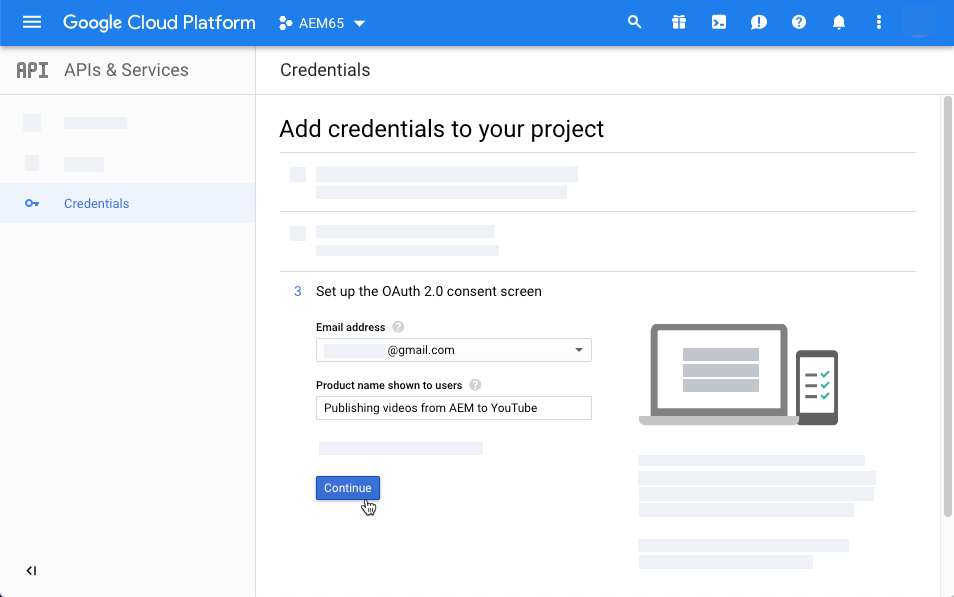

# O vídeo{#video}

Esta seção descreve como trabalhar com vídeo no Dynamic Media.

## Início rápido: Vídeos {#quick-start-videos}

A seguinte descrição passo a passo do fluxo de trabalho foi projetada para ajudá-lo a começar a funcionar rapidamente com conjuntos de vídeo adaptáveis no Dynamic Media. Depois de cada etapa, há referências cruzadas a cabeçalhos de tópicos nos quais você pode encontrar mais informações.

>[!NOTE]
>
>Antes de trabalhar com vídeo no Dynamic Media, verifique se o administrador do AEM já habilitou e configurou os Serviços da Dynamic Media Cloud.
>
>* Consulte [Configuração dos serviços](/help/assets/dynamic-media/config-dm.md#configuring-dynamic-media-cloud-services) da Dynamic Media Cloud em Configuração do Dynamic Media e [Solução de Problemas do Dynamic Media](/help/assets/dynamic-media/troubleshoot-dm.md).
>


1. **Carregue seus vídeos** do Dynamic Media fazendo o seguinte:

   * Crie seu próprio perfil de codificação de vídeo. Ou você pode simplesmente usar o perfil de codificação _de vídeo_ adaptável predefinido que acompanha o Dynamic Media.

      * [Criação de um perfil](/help/assets/dynamic-media/video-profiles.md#creating-a-video-encoding-profile-for-adaptive-streaming)de codificação de vídeo.
      * Saiba mais sobre as práticas [recomendadas para codificação](#best-practices-for-encoding-videos)de vídeo.
   * Associe o perfil de processamento de vídeo a uma ou mais pastas onde você carregará seus vídeos mestre.

      * [Aplicar um perfil de vídeo a pastas](/help/assets/dynamic-media/video-profiles.md#applying-a-video-profile-to-folders).
      * Saiba mais sobre as práticas [recomendadas para organizar seus ativos digitais para usar perfis](/help/assets/dynamic-media/best-practices-for-file-management.md)de processamento.
      * Saiba mais sobre como [organizar ativos](/help/assets/organize-assets.md)digitais.
   * Carregue seus vídeos mestres nas pastas. É possível carregar arquivos de vídeo com até 20 GB cada. Quando você adiciona vídeos à pasta, eles são codificados de acordo com o perfil de processamento de vídeo atribuído à pasta.

      * [Carregue seus vídeos](/help/assets/manage-video-assets.md#upload-and-preview-video-assets).
      * Saiba mais sobre os formatos [de arquivo de entrada](/help/assets/file-format-support.md)suportados.
   * Monitore como a codificação [de vídeo está progredindo](#monitoring-video-encoding-and-youtube-publishing-progress) a partir do ativo ou da exibição do fluxo de trabalho.


1. **Gerencie seus vídeos** do Dynamic Media executando um dos procedimentos a seguir:

   * Organizar, navegar e pesquisar ativos de vídeo

      * [Organização de ativos](/help/assets/organize-assets.md)digitais Saiba mais sobre as práticas [recomendadas para organizar seus ativos digitais para usar perfis de processamento](/help/assets/dynamic-media/best-practices-for-file-management.md)

      * [Pesquisar ativos](/help/assets/search-assets.md#custompredicates) de vídeo ou [Pesquisar ativos](/help/assets/manage-digital-assets.md#search-assets)
   * Visualizar e publicar ativos de vídeo

      * Visualize o vídeo de origem e as representações codificadas do vídeo, juntamente com as miniaturas associadas:
         [Visualizar vídeos](/help/assets/manage-video-assets.md#upload-and-preview-video-assets) ou [Visualizar ativos](/help/assets/dynamic-media/previewing-assets.md)
         [Gerenciamento de execuções de vídeo](/help/assets/manage-digital-assets.md#managing-renditions)


<!-- Commented video-renditions.md as the file is not published yet and will lead to broken link.
        * View the source video and encoded renditions of the video along with its associated thumbnails:
          [Previewing videos](/help/assets/manage-video-assets.md#upload-and-preview-video-assets) or [Previewing assets](/help/assets/dynamic-media/previewing-assets.md)
          [Viewing video renditions](/help/assets/video-renditions.md)
          [Managing video renditions](/help/assets/manage-digital-assets.md#managing-renditions) -->

    * [Gerenciar predefinições do visualizador](/help/assets/dynamic-media/managing-viewer-presets.md)
    * [Ativos de publicação](/help/assets/dynamic-media/publishing-dynamicmedia-assets.md)
    
    * Trabalhar com metadados de vídeo

<!--      * View the properties of an encoded video rendition such as frame rate, audio and video bitrate, and codec:
          [Viewing video rendition properties](/help/assets/video-renditions.md) -->

    * Edite as propriedades do vídeo, como título, descrição e tags, campos de metadados personalizados:
    [Edição de propriedades de vídeo](/help/assets/manage-digital-assets.md#editing-properties)
    
    * [Gerenciamento de metadados para ativos digitais](/help/assets/manage-metadata.md)
    * [Esquemas de metadados](/help/assets/metadata-schemas.md)
    
    * Revise, aprove e anote vídeos e mantenha o controle
    
    de versão completa* [Anotação de vídeos](/help/assets/manage-video-assets.md#anotação-vídeo-assets) ou [Anotações notação de ativos](/help/assets/manage-digital-assets.md#anotação)
    
    * [Criação de uma versão](/help/assets/manage-digital-assets.md#asset-versioning)
    * [Início de um fluxo de trabalho em um ativo](/help/assets/manage-digital-assets.md#início-a-fluxo de trabalho-ativo-ativo)

<!-- Removing assets-workflow.md file link as it is not applicable anymore. Workflows are replaced by processing profiles.
        * [Creating a version](/help/assets/manage-digital-assets.md#asset-versioning)
        * [Applying workflows to assets](/help/assets/assets-workflow.md) or see [Starting a workflow on an asset](/help/assets/manage-digital-assets.md#starting-a-workflow-on-an-asset)
-->

    * [Revisar ativos da pasta](/help/assets/bulk-approval.md)
    * [Projetos](/help/sites-cloud/authoring/projects/overview.md)

1. **Publique seus vídeos** do Dynamic Media executando um dos procedimentos a seguir:

   * Se você estiver usando o Adobe Experience Manager como seu sistema WCM (Web Content Management, Gerenciamento de conteúdo da Web), poderá adicionar vídeos diretamente às páginas da Web.

      * [Adicionar vídeos às suas páginas](/help/assets/dynamic-media/adding-dynamic-media-assets-to-pages.md)da Web.
   * Se você estiver usando um sistema de gerenciamento de conteúdo da Web de terceiros, poderá vincular ou incorporar vídeos às suas páginas da Web.

      * Integrar vídeo usando URL:
         [Vincular URLs do ao aplicativo da Web](/help/assets/dynamic-media/linking-urls-to-yourwebapplication.md).

      * Integre vídeo usando o código incorporado na página da Web:
         [Incorporação do visualizador de vídeo em uma página](/help/assets/dynamic-media/embed-code.md)da Web.
   * [Publicar vídeos no YouTube](#publishing-videos-to-youtube).
   * [Geração de relatórios](#viewing-video-reports)de vídeo.

   * [Adicionar legendas ao vídeo](#adding-captions-to-video).


## Trabalhar com vídeo no Dynamic Media {#working-with-video-in-dynamic-media}

O vídeo no Dynamic Media é uma solução completa que facilita a publicação de vídeo adaptável de alta qualidade para streaming em várias telas, incluindo dispositivos móveis desktop, iOS, Android, Blackberry e Windows. Um Conjunto de vídeos adaptáveis agrupa versões do mesmo vídeo codificadas em diferentes taxas de bits e formatos, como 400 kbps, 800 kbps e 1000 kbps. O computador desktop ou dispositivo móvel detecta a largura de banda disponível.

Por exemplo, em um dispositivo móvel iOS, ele detecta uma largura de banda como 3G, 4G ou Wi-Fi. Em seguida, seleciona automaticamente o vídeo codificado direito entre as várias taxas de bits de vídeo no Conjunto de vídeos adaptáveis. O vídeo é transmitido para desktops, dispositivos móveis ou tablets.

Além disso, a qualidade do vídeo é automaticamente alternada se as condições da rede mudarem no desktop ou no dispositivo móvel. Além disso, se um cliente entrar no modo de tela cheia em um desktop, o Conjunto de vídeos adaptáveis responderá usando uma resolução melhor, melhorando assim a experiência de visualização do cliente. O uso de Conjuntos de vídeo adaptáveis oferece a melhor reprodução possível para clientes que reproduzem vídeo de Mídia dinâmica em várias telas e dispositivos.

A lógica que um player de vídeo usa para determinar qual vídeo codificado reproduzir ou selecionar durante a reprodução é baseada no seguinte algoritmo:

1. O player de vídeo carrega o fragmento de vídeo inicial com base na taxa de bits mais próxima ao valor definido para &quot;taxa de bits inicial&quot; no próprio player.
1. O player de vídeo muda com base nas alterações na velocidade da largura de banda usando os seguintes critérios:

   1. O player escolhe o fluxo de largura de banda mais alta abaixo ou igual à largura de banda estimada.
   1. O player considera apenas 80% da largura de banda disponível. No entanto, se está mudando, é mais conservador em apenas 70% para evitar sobrestimações e imediatamente voltar.

Para obter informações técnicas detalhadas sobre o algoritmo, consulte [https://android.googlesource.com/platform/frameworks/av/+/master/media/libstagefright/httplive/LiveSession.cpp](https://android.googlesource.com/platform/frameworks/av/+/master/media/libstagefright/httplive/LiveSession.cpp)

Para gerenciar um único vídeo e Conjuntos de vídeos adaptáveis, há suporte para o seguinte:

* Carregar vídeo de vários formatos de vídeo e formatos de áudio suportados e codificar vídeo para o formato MP4 H.264 para reprodução em várias telas. Você pode usar predefinições de vídeo adaptáveis predefinidas, predefinições de codificação de vídeo único ou personalizar sua própria codificação para controlar a qualidade e o tamanho do vídeo.

   * Quando um conjunto de vídeo adaptável é gerado, ele inclui vídeos MP4.
   * **Observação**: Os vídeos mestre/fonte não são adicionados a um Conjunto de vídeos adaptáveis.

* Legendagem de vídeo em todos os visualizadores de vídeo HTML5.
* Organize, navegue e pesquise vídeos com suporte total a metadados para o gerenciamento eficiente dos ativos de vídeo.
* Forneça Conjuntos de vídeo adaptáveis para a Web, desktops e dispositivos móveis, incluindo iPhone, iPad, Android, Blackberry e telefone Windows.

O streaming de vídeo adaptativo é suportado em várias plataformas iOS. Consulte Guia [de referência do](https://marketing.adobe.com/resources/help/en_US/s7/viewers_ref/c_html5_video_reference.html)Scene7 Viewers.

O Dynamic Media suporta reprodução de vídeo móvel para vídeo MP4 H.264. Você pode encontrar dispositivos Blackberry compatíveis com este formato de vídeo no seguinte endereço: Formatos de vídeo [suportados no Blackberry](https://support.blackberry.com/kb/articleDetail?ArticleNumber=000005482).

Você pode encontrar dispositivos Windows compatíveis com este formato de vídeo no seguinte endereço: Formatos de vídeo [suportados no Windows Phone](https://msdn.microsoft.com/library/windows/apps/ff462087%28v=vs.105%29.aspx)

* Reproduza o vídeo usando as predefinições do visualizador de vídeo do Dynamic Media, incluindo:

   * Visualizadores de vídeo individuais.
   * Visualizadores de mídia mista que combinam conteúdo de vídeo e imagem.

* Configure players de vídeo para atender às suas necessidades de marca.
* Integre vídeo ao seu site, site móvel ou aplicativo móvel com um URL simples ou código incorporado.

Consulte Exemplo de reprodução [](https://s7d9.scene7.com/s7/uvideo.jsp?asset=GeoRetail/Mop_AVS&config=GeoRetail/Universal_Video1&stageSize=640,480) de vídeo dinâmica.

Consulte também [Visualizadores do AEM e Scene7](https://marketing.adobe.com/resources/help/en_US/s7/viewers_ref/c_html5_s7_aem_asset_viewers.html) e [Visualizadores para ativos AEM somente](https://marketing.adobe.com/resources/help/en_US/s7/viewers_ref/c_html5_aem_asset_viewers.html) no Guia de referência do Adobe Scene7 Viewers.

## Melhores práticas: Uso do visualizador de vídeo HTML5 {#best-practice-using-the-html-video-viewer}

As predefinições do visualizador de vídeo HTML5 do Dynamic Media são players de vídeo robustos. Você pode usá-los para evitar muitos problemas comuns associados à reprodução de vídeo HTML5 e problemas associados a dispositivos móveis, como a falta de entrega de streaming adaptável e o alcance limitado do navegador do desktop.

No lado do design do player, é possível projetar toda a funcionalidade do player de vídeo usando ferramentas padrão de desenvolvimento da Web. Por exemplo, você pode projetar botões, controles e imagens de fundo de pôster personalizadas usando HTML5 e CSS para ajudá-lo a alcançar seus clientes com uma aparência personalizada.

No lado da reprodução do visualizador, ele detecta automaticamente a capacidade de vídeo do navegador. Em seguida, ele serve o vídeo usando HLS (HTTP Live Streaming), também conhecido como streaming de vídeo adaptável. Ou, se esses métodos de entrega não estiverem presentes, o HTML5 progressivo será usado.

Ao combinar em um único player a capacidade de projetar os componentes de reprodução usando HTML5 e CSS, ter reprodução integrada e usar streaming adaptável e progressivo dependendo da capacidade do navegador, você estende o alcance do conteúdo de mídia avançada para usuários de desktop e móveis e garante uma experiência de vídeo otimizada.

Consulte também [Sobre visualizadores](https://marketing.adobe.com/resources/help/en_US/s7/viewers_ref/c_html5_viewers_about.html) HTML5 no Guia de referência do Adobe Scene7 Viewers.

### Reprodução de vídeo em computadores desktop e dispositivos móveis usando o visualizador de vídeo HTML5 {#playback-of-video-on-desktop-computers-and-mobile-devices-using-the-html-video-viewer}

Para streaming de vídeo adaptável para desktop e dispositivos móveis, os vídeos usados para switching de taxa de bits são baseados em todos os vídeos MP4 no Conjunto de vídeos adaptáveis.

A reprodução do vídeo ocorre usando HLS ou download progressivo de vídeo. Em versões anteriores do AEM, como 6.0, 6.1 e 6.2, os vídeos eram transmitidos via HTTP.

No entanto, no AEM 6.3 e em diante, os vídeos agora são transmitidos por HTTPS (ou seja, HLS), pois o URL do serviço de gateway DM sempre usa HTTPS também. Observe que não há impacto do cliente neste comportamento padrão. Ou seja, o streaming de vídeo sempre ocorrerá em HTTPS, a menos que não seja suportado pelo navegador. (consulte a tabela a seguir). Portanto,

* Se você tiver um site HTTPS com streaming de vídeo HTTPS, o streaming está correto.
* Se você tiver um site HTTP com streaming de vídeo HTTPS, o streaming estará correto e não haverá problemas de conteúdo misto no navegador da Web.

HLS é um padrão da Apple para streaming de vídeo adaptável que ajusta automaticamente a reprodução com base na capacidade de largura de banda da rede. Ele também permite que o cliente &quot;procure&quot; qualquer ponto do vídeo sem precisar aguardar o download do restante do vídeo.

O vídeo progressivo é fornecido por meio do download e armazenamento local do vídeo no sistema desktop ou dispositivo móvel de um usuário.

A tabela a seguir descreve o dispositivo, o navegador e o método de reprodução de vídeos em computadores desktop e dispositivos móveis usando o Scene7 Video Viewer.

<table>
 <tbody>
  <tr>
   <td><strong>Device</strong></td>
   <td><strong>Navegador</strong></td>
   <td><strong>Modo de reprodução de vídeo</strong></td>
  </tr>
  <tr>
   <td>Área de trabalho</td>
   <td>Internet Explorer 9 e 10</td>
   <td>Download progressivo.</td>
  </tr>
  <tr>
   <td>Área de trabalho</td>
   <td>Internet Explorer 11+</td>
   <td>No Windows 8 e no Windows 10 - Forçar o uso de HTTPS sempre que HLS for solicitado. Limitação conhecida: O HTTP no HLS não funciona nesta combinação<br /> de navegador/sistema operacional <br /> No Windows 7 - Download progressivo. Usa lógica padrão para selecionar protocolo HTTP versus HTTPS.</td>
  </tr>
  <tr>
   <td>Área de trabalho</td>
   <td>Firefox 23-44</td>
   <td>Download progressivo.</td>
  </tr>
  <tr>
   <td>Área de trabalho</td>
   <td>Firefox 45 ou posterior</td>
   <td>HLS</td>
  </tr>
  <tr>
   <td>Área de trabalho</td>
   <td>Cromo</td>
   <td>HLS</td>
  </tr>
  <tr>
   <td>Área de trabalho</td>
   <td>Safari (Mac)</td>
   <td>HLS</td>
  </tr>
  <tr>
   <td>Móvel</td>
   <td>Chrome (Android 6 ou anterior)</td>
   <td>Download progressivo.</td>
  </tr>
  <tr>
   <td>Móvel</td>
   <td>Chrome (Android 7 ou posterior)</td>
   <td>HLS</td>
  </tr>
  <tr>
   <td>Móvel</td>
   <td>Android (navegador padrão)</td>
   <td>Download progressivo.</td>
  </tr>
  <tr>
   <td>Móvel</td>
   <td>Safari (iOS)</td>
   <td>HLS</td>
  </tr>
  <tr>
   <td>Móvel</td>
   <td>Chrome (iOS)</td>
   <td>HLS</td>
  </tr>
  <tr>
   <td>Móvel</td>
   <td>Blackberry</td>
   <td>HLS</td>
  </tr>
 </tbody>
</table>

## Arquitetura da solução de vídeo Dynamic Media {#architecture-of-dynamic-media-video-solution}

O gráfico a seguir mostra o fluxo de trabalho de criação geral de vídeos que são carregados e codificados por meio do DMGGateway (no modo Híbrido de Dynamic Media) e disponibilizados para consumo público.


## Arquitetura de publicação híbrida para vídeos {#hybrid-publishing-architecture-for-videos}


## Práticas recomendadas para codificação de vídeos {#best-practices-for-encoding-videos}

O fluxo de trabalho Codificação de vídeo **do** Dynamic Media codifica o vídeo se você ativou a mídia dinâmica e configurou os serviços da nuvem de vídeo. Esse fluxo de trabalho captura o histórico do processo de fluxo de trabalho e as informações de falha. Consulte [Monitorando o progresso](#monitoring-video-encoding-and-youtube-publishing-progress)da codificação de vídeo e da publicação no YouTube. Se você ativou a mídia dinâmica e configurou os serviços da nuvem de vídeo, o fluxo de trabalho Codificação de vídeo **** da Dynamic Media entra em vigor automaticamente quando você carrega um vídeo. (Se você não estiver usando mídia dinâmica, o fluxo de trabalho Atualizar ativo **[!UICONTROL do]** DAM entrará em vigor.)

Veja a seguir dicas de práticas recomendadas para a codificação de arquivos de vídeo de origem.

Para obter conselhos sobre a codificação de vídeo, consulte:

* [Streaming 101: Os fundamentos... Codecs, largura de banda, taxa de dados e resolução](https://www.adobe.com/go/learn_s7_streaming101_en).
* [Noções básicas sobre](https://www.adobe.com/go/learn_s7_encoding_en)codificação de vídeo.

### Arquivos de vídeo de origem {#source-video-files}

Ao codificar um arquivo de vídeo, use um arquivo de vídeo de origem com a qualidade mais alta possível. Evite usar arquivos de vídeo previamente codificados, pois esses arquivos já estão compactados, e a codificação adicional cria um vídeo de qualidade inferior.

A tabela a seguir descreve o tamanho recomendado, a proporção e a taxa mínima de bits que seus arquivos de vídeo de origem devem ter antes de codificá-los:

| Tamanho | Taxa de proporção | Taxa mínima de bits |
|--- |--- |--- |
| 1024 X 768 | 4:3 | 4500 kbps para a maioria dos vídeos. |
| 1280 X 720 | 16:9 | 3000 - 6000 kbps, dependendo da quantidade de movimento no vídeo. |
| 1920 X 1080 | 16:9 | 6000 - 8000 kbps, dependendo da quantidade de movimento no vídeo. |

### Obtenção dos metadados de um arquivo {#obtaining-a-file-s-metadata}

É possível obter os metadados de um arquivo ao exibir seus metadados usando uma ferramenta de edição de vídeo ou um aplicativo projetado para obter metadados. Veja a seguir as instruções de uso do MediaInfo, um aplicativo de terceiros, para obter os metadados de um arquivo de vídeo:

1. Ir para esta página da Web: [https://mediainfo.sourceforge.net/en/Download](https://mediainfo.sourceforge.net/en/Download).
1. Selecione e baixe o instalador da versão da GUI e siga as instruções de instalação.
1. Após a instalação, clique com o botão direito do mouse no arquivo de vídeo (somente Windows) e selecione MediaInfo ou abra MediaInfo e arraste o arquivo de vídeo para o aplicativo. Todos os metadados associados ao arquivo de vídeo, incluindo largura, altura e fps.

### Taxa de proporção {#aspect-ratio}

Ao escolher ou criar uma predefinição de codificação de vídeo para o arquivo de vídeo mestre, verifique se a predefinição tem a mesma proporção do arquivo de vídeo mestre. A proporção é a proporção entre a largura e a altura do vídeo.

Para determinar a proporção de um arquivo de vídeo, obtenha os metadados do arquivo e observe a largura e a altura do arquivo (consulte Obter os metadados do arquivo acima). Em seguida, use essa fórmula para determinar a proporção:

largura/altura = proporção

A tabela a seguir descreve como os resultados da fórmula se traduzem em opções de proporção comuns:

| Resultado da fórmula | Taxa de proporção |
|--- |--- |
| 1.33 | 4:3 |
| 0.75 | 3:4 |
| 1.78 | 16:9 |
| 0.56 | 9:16 |

Por exemplo, um vídeo com largura de 1440 x altura de 1080 tem uma proporção largura/altura de 1440/1080 ou 1,33. Nesse caso, escolha uma predefinição de codificação de vídeo com uma proporção de 4:3 para codificar o arquivo de vídeo.

### Taxa de bits {#bitrate}

A taxa de bits é a quantidade de dados que é codificada para formar um único segundo de reprodução de vídeo. A taxa de bits é medida em kilobits por segundo (Kbps).

>[!NOTE]
>
>Como todos os codecs usam compactação com perdas, a taxa de bits é o fator mais importante na qualidade do vídeo. Com a compactação com perdas, quanto mais você compacta um arquivo de vídeo, mais a qualidade é degradada. Por isso, todas as outras características são iguais (resolução, taxa de quadros e codec), quanto menor a taxa de bits, menor a qualidade do arquivo compactado.

Ao selecionar uma codificação de taxa de bits, você pode escolher dois tipos:

* **[!UICONTROL Codificação]** de taxa de bits constante (CBR) - Durante a codificação de CBR, a taxa de bits ou o número de bits por segundo é mantido a mesma durante todo o processo de codificação. A codificação CBR persiste na taxa de dados definida para sua configuração durante todo o vídeo. Além disso, a codificação CBR não otimiza arquivos de mídia para qualidade, mas economiza espaço de armazenamento.
Use o CBR se o vídeo contiver um nível de movimento semelhante em todo o vídeo. O CBR é usado com mais frequência para o conteúdo de vídeo de fluxo contínuo. Consulte também [Uso de parâmetros](/help/assets/dynamic-media/video-profiles.md#using-custom-added-video-encoding-parameters)de codificação de vídeo personalizados.

* **[!UICONTROL Codificação]** de taxa de bits variável (VBR) - A codificação VBR ajusta a taxa de dados para baixo e para o limite máximo definido, com base nos dados exigidos pelo compressor. Isso significa que, durante um processo de codificação VBR, a taxa de bits do arquivo de mídia aumenta ou diminui dinamicamente, dependendo das necessidades de taxa de bits dos arquivos de mídia.
O VBR demora mais para codificar, mas produz os resultados mais favoráveis; a qualidade do arquivo de mídia é superior. O VBR é usado com mais frequência para a entrega progressiva de conteúdo de vídeo em http.

Quando você deve usar VBR versus CRB?
Quando se trata de selecionar VBR versus CBR, é quase sempre recomendável usar VBR para seus arquivos de mídia. O VBR fornece arquivos de maior qualidade a taxas de bits competitivas. Ao usar o VBR, certifique-se de usar com codificação de duas passagens e definir a taxa de bits máxima como 1,5x a taxa de bits do vídeo de destino.

Ao escolher uma predefinição de codificação de vídeo, considere a velocidade de conexão do usuário final de destino. Escolha uma predefinição com uma taxa de dados que seja 80% dessa velocidade. Por exemplo, se a velocidade de conexão do usuário final de destino for de 1000 Kbps, a melhor predefinição será aquela com uma taxa de dados de vídeo de 800 Kbps.

Esta tabela descreve a taxa de dados das velocidades de conexão típicas.

| Velocidade (Kbps) | Tipo de conexão |
|--- |--- |
| 256 | Conexão dial-up. |
| 800 | Conexão móvel típica. Para essa conexão, direcione uma taxa de dados no intervalo de 400 a um máximo de 800 para experiências 3G. |
| 2000 | Conexão típica de desktop de banda larga. Para esta conexão, direcione uma taxa de dados no intervalo de 800 a 2000 Kbps, com a maioria dos alvos com média de 1200 a 1500 Kbps. |
| 5000 | Conexão típica de banda larga alta. Não é recomendável a codificação nesse intervalo superior, pois a entrega de vídeo nessa velocidade não está disponível para a maioria dos consumidores. |

### Resolução {#resolution}

**Resolução **descreve a altura e a largura de um arquivo de vídeo em pixels. A maioria dos vídeos de origem é armazenada em alta resolução (por exemplo, 1920 x 1080). Para fins de streaming, o vídeo de origem é compactado em uma resolução menor (640 x 480 ou menor).

A resolução e a taxa de dados são dois fatores totalmente ligados que determinam a qualidade do vídeo. Para manter a mesma qualidade de vídeo, quanto maior o número de pixels em um arquivo de vídeo (quanto maior a resolução), maior a taxa de dados. Por exemplo, considere o número de pixels por quadro em uma resolução 320 x 240 e um arquivo de vídeo de resolução 640 x 480:

| Resolução | Pixels por quadro |
|--- |--- |
| 320 x 240 | 76,800 |
| 640 x 480 | 307,200 |

O arquivo 640 x 480 tem quatro vezes mais pixels por quadro. Para obter a mesma taxa de dados para essas duas resoluções de exemplo, aplique quatro vezes a compactação ao arquivo 640 x 480, o que pode reduzir a qualidade do vídeo. Portanto, uma taxa de dados de vídeo de 250 Kbps produz uma visualização de alta qualidade em uma resolução de 320 x 240, mas não em uma resolução de 640 x 480.

Em geral, quanto maior for a taxa de dados, melhor será a aparência do vídeo e maior será a resolução usada, maior será a taxa de dados necessária para manter a qualidade de exibição (em comparação com resoluções mais baixas).

Como a resolução e a taxa de dados estão vinculadas, você tem duas opções ao codificar o vídeo:

* Escolha uma taxa de dados e, em seguida, codifique na resolução mais alta que tenha boa aparência na taxa de dados escolhida.
* Escolha uma resolução e, em seguida, codifique na taxa de dados necessária para obter vídeo de alta qualidade na resolução escolhida.

Ao escolher (ou criar) uma predefinição de codificação de vídeo para o arquivo de vídeo mestre, use esta tabela para direcionar a resolução correta:

| Resolução | Altura (pixels) | Tamanho da tela |
|--- |--- |--- |
| 240p | 240 | Tela pequena |
| 300p | 300 | Tela pequena geralmente para dispositivos móveis |
| 360p | 360 | Tela pequena |
| 480p | 480 | Tela média |
| 720p | 720 | Tela grande |
| 1080p | 1080 | Tela grande de alta definição |

### Fps (Quadros por segundo) {#fps-frames-per-second}

Nos Estados Unidos e no Japão, a maioria dos vídeos é fotografados a 29,97 quadros por segundo (fps); na Europa, a maioria dos vídeos são gravados a 25 qps. O filme é filmado a 24 fps.

Escolha uma predefinição de codificação de vídeo que corresponda à taxa fps do arquivo de vídeo mestre. Por exemplo, se o vídeo mestre for 25 fps, escolha uma predefinição de codificação com 25 fps. Por padrão, toda codificação personalizada usa o fps do arquivo de vídeo mestre. Por isso, não é necessário especificar explicitamente a configuração fps ao criar uma predefinição de codificação de vídeo.

### Dimensões de codificação de vídeo {#video-encoding-dimensions}

Para obter resultados ideais, selecione dimensões de codificação de modo que o vídeo de origem seja um múltiplo completo de todos os vídeos codificados.

Para calcular essa proporção, divida a largura de origem por largura codificada para obter a proporção de largura. Em seguida, divida a altura de origem por altura codificada para obter a proporção de altura.

Se a proporção resultante for um inteiro inteiro, isso significa que o vídeo é dimensionado de forma ideal. Se a proporção resultante não for um inteiro, isso afeta a qualidade do vídeo, deixando artefatos de pixel restantes na tela. Esse efeito é mais visível quando o vídeo tem texto.

Por exemplo, suponha que o vídeo de origem seja 1920 x 1080. Na tabela a seguir, os três vídeos codificados fornecem as configurações de codificação ideais para usar.

| Tipo de vídeo | Largura x altura | Proporção de largura | Taxa de altura |
|--- |--- |--- |--- |
| Origem | 1920x1080 | 1 | 1 |
| Codificado | 960 x 540 | 2 | 2 |
| Codificado | 640 x 360 | 3 | 3 |
| Codificado | 480 x 270 | 4 | 4 |

### Formato de arquivo de vídeo codificado {#encoded-video-file-format}

O Dynamic Media recomenda usar predefinições de codificação de vídeo MP4 H.264. Como os arquivos MP4 usam o codec de vídeo H.264, ele fornece vídeo de alta qualidade, mas em um tamanho de arquivo compactado.

## Publicar vídeos no YouTube {#publishing-videos-to-youtube}

Você pode publicar ativos de vídeo do AEM local diretamente em um canal do YouTube que você criou anteriormente.

Para publicar ativos de vídeo no YouTube, configure os ativos AEM com tags. Você associa essas tags a um canal do YouTube. Se a tag de um ativo de vídeo corresponder à tag de um canal do YouTube, o vídeo será publicado no YouTube. A publicação no YouTube ocorre junto com uma publicação normal do vídeo, desde que uma tag associada seja usada.

O YouTube faz sua própria codificação. Dessa forma, o arquivo de vídeo original carregado no AEM é publicado no YouTube em vez de qualquer execução de vídeo criada pela codificação do Dynamic Media. Embora não seja necessário processar vídeos usando o Dynamic Media, espera-se que eles o façam caso uma predefinição do visualizador seja necessária para a reprodução.

Quando você ignora o perfil de processamento de vídeo e publica diretamente no YouTube, isso significa apenas que seu ativo de vídeo no AEM Asset pode não obter uma miniatura visível. Isso também significa que os vídeos não codificados não funcionarão com nenhum dos tipos de ativos de Mídia dinâmica.

A publicação de ativos de vídeo em servidores do YouTube envolve a conclusão das seguintes tarefas para garantir a autenticação segura e segura de servidor para servidor com o YouTube:

1. [Definição das configurações do Google Cloud](#configuring-google-cloud-settings)
1. [Criação de um canal do YouTube](#creating-a-youtube-channel)
1. [Adicionar tags para publicação](#adding-tags-for-publishing)
1. [Ativando o agente de Replicação de Publicação do YouTube](#enabling-the-youtube-publish-replication-agent)
1. [Configuração do YouTube no AEM](#setting-up-youtube-in-aem)
1. [(Opcional) Automatizando a configuração das propriedades padrão do YouTube para os vídeos carregados](#optional-automating-the-setting-of-default-youtube-properties-for-your-uploaded-videos)
1. [Publicar vídeos no seu canal do YouTube](#publishing-videos-to-your-youtube-channel)
1. [(Opcional) Verificação do vídeo publicado no YouTube](/help/assets/dynamic-media/video.md#optional-verifying-the-published-video-on-youtube)
1. [Vincular URLs do YouTube ao seu aplicativo da Web](#linking-youtube-urls-to-your-web-application)

Você também pode [cancelar a publicação de vídeos para removê-los do YouTube](#unpublishing-videos-to-remove-them-from-youtube).

### Definição das configurações do Google Cloud {#configuring-google-cloud-settings}

Para publicar no YouTube, você precisa de uma conta do Google. Se tiver uma conta GMAIL, você já tem uma conta Google; se você não tiver uma conta do Google, poderá criar uma facilmente. Você precisa da conta porque precisa de credenciais para publicar ativos de vídeo no YouTube. Se você já tiver uma conta criada, ignore essa tarefa e prossiga diretamente para [Criar um canal](#creating-a-youtube-channel)do YouTube.

A conta usada com a Google Cloud e a conta do Google usada para o YouTube não precisa ser a mesma.

Esteja ciente de que o Google altera periodicamente a interface do usuário. Dessa forma, as etapas para publicar vídeos no YouTube podem variar um pouco do que está documentado abaixo. Esta advertência também se aplica ao YouTube quando você tenta verificar se os vídeos foram carregados nele.

>[!NOTE]
>
>Os passos a seguir foram precisos no momento desta escrita. Entretanto, o Google atualiza periodicamente seus sites sem aviso prévio. Como tal, essas etapas podem ser um pouco diferentes.

Para definir as configurações do Google Cloud:

1. Crie uma nova conta do Google.
   [https://accounts.google.com/SignUp?service=mail](https://accounts.google.com/SignUp?service=mail)

   Se você já tiver uma conta do Google, vá para a próxima etapa.

1. Vá para [https://cloud.google.com/](https://cloud.google.com/).
1. Na página do Google Cloud, próximo ao canto superior direito, clique em **[!UICONTROL Console]**.

   Se necessário, talvez seja necessário fazer **[!UICONTROL logon]** usando suas credenciais de conta do Google para ver a opção **[!UICONTROL Console]** .

1. Na página Painel, à direita de Plataforma **[!UICONTROL do]** Google Cloud, clique na lista suspensa Projeto para abrir a caixa de diálogo Selecionar um projeto.
1. Na caixa de diálogo Selecionar um projeto, toque em **[!UICONTROL Novo projeto]**.

   

1. Na caixa de diálogo Novo projeto, no campo Nome do projeto, digite o nome do novo projeto.

   Observe que a ID do projeto se baseia no nome do projeto. Como tal, escolha cuidadosamente o nome do projeto; ele não pode ser alterado após ser criado. Além disso, você precisará digitar a mesma ID de projeto novamente quando configurar o YouTube no AEM posteriormente; talvez você queira anotar.

1. Clique em **[!UICONTROL Criar]**.

1. Execute um dos procedimentos a seguir:

   * No Painel do seu projeto, no cartão Introdução, toque em **[!UICONTROL Explorar e habilitar APIs]**.
   * No Painel do seu projeto, no cartão de APIs, toque em **[!UICONTROL Ir para a visão geral]** das APIs.
   

1. Próximo à parte superior da página APIs e serviços, toque em **[!UICONTROL Ativar APIs e serviços]**.
1. Na página Biblioteca de API, no lado esquerdo, em **[!UICONTROL Categoria]**, toque em **[!UICONTROL YouTube]**. No lado direito da página, toque em API **[!UICONTROL de dados do]** YouTube.
1. Na página da API de dados do YouTube v3, toque em **[!UICONTROL Ativar]**.

   

1. Para usar a API, talvez você precise de credenciais. Se necessário, clique em **[!UICONTROL Criar credenciais]**.

   

1. Na etapa 1, na etapa **[!UICONTROL Adicionar credenciais à página do projeto]** , faça o seguinte:

   * Na API **[!UICONTROL Qual você está usando?]** lista suspensa, selecione **[!UICONTROL YouTube Data API v3]**.

   * Em **[!UICONTROL Onde você irá chamar a API?]** lista suspensa, selecione Servidor **[!UICONTROL Web (por exemplo, node.js, Tomcat)]**

   * A partir de **[!UICONTROL Que dados você estará acessando?]** lista suspensa, toque em Dados **** do usuário.
   

1. Toque em **[!UICONTROL Quais credenciais eu preciso?]**
1. Na página **[!UICONTROL Adicionar credenciais ao projeto]** , etapa 2, no cabeçalho **[!UICONTROL Criar uma ID]** de cliente OAuth 2.0, no campo Nome, digite um nome exclusivo, se desejado. Ou você pode usar o nome padrão especificado pelo Google.
1. No cabeçalho Origens **[!UICONTROL Javascript]** Autorizado, no campo de texto, digite o seguinte caminho, substituindo seu próprio domínio e número de porta no caminho, em seguida, pressione **[!UICONTROL Enter]** para adicionar o caminho à lista:

   `https://<servername.domain>:<port_number>`

   Por exemplo, `https://1a2b3c.mycompany.com:4321`

   **Observação**: Os exemplos de caminho acima são destinados apenas para fins ilustrativos.

   

1. No cabeçalho URIs **[!UICONTROL de redirecionamento]** autorizados, no campo de texto, digite o seguinte caminho, substituindo seu próprio domínio e número de porta no caminho, em seguida, pressione **[!UICONTROL Enter]** para adicionar o caminho à lista:

   `https://<servername.domain>:<port_number>/etc/cloudservices/youtube.youtubecredentialcallback.json`

   Por exemplo, `https://1a2b3c.mycompany.com:4321/etc/cloudservices/youtube.youtubecredentialcallback.json`

   **Observação**: O exemplo de caminho acima destina-se apenas a fins de ilustração.

1. Clique em **[!UICONTROL Criar ID]** de cliente OAuth.
1. Na página **[!UICONTROL Adicionar credenciais ao seu projeto]** , etapa 3, no cabeçalho da tela **** Configurar o consentimento OAuth 2.0, selecione o endereço de email do Gmail que você está usando no momento.

   

1. No cabeçalho Nome do **[!UICONTROL produto exibido aos usuários]** , no campo de texto, digite o que deseja mostrar na tela de consentimento.

   A tela de consentimento é exibida para o administrador do AEM quando eles são autenticados no YouTube; O AEM entrará em contato com o YouTube para obter permissão.

1. Clique em **[!UICONTROL Continuar]**.
1. Na página Adicionar credenciais ao seu projeto, etapa 4, no cabeçalho **[!UICONTROL Baixar credenciais]** , toque em **[!UICONTROL Download]**.

   

1. Salve o `client_id.json` arquivo.

   Você precisará desse arquivo json baixado ao configurar o YouTube no Adobe Experience Manager posteriormente.

1. Clique em **[!UICONTROL Concluído]**.

   Desconecte-se da sua conta do Google. Agora você criará um canal do YouTube.

### Criação de um canal do YouTube {#creating-a-youtube-channel}

A publicação de vídeos no YouTube requer um ou mais canais. Se você já tiver criado um canal do YouTube, poderá ignorar essa tarefa e ir para [Adicionar tags para publicação](/help/assets/dynamic-media/video.md#adding-tags-for-publishing).

>[!CAUTION]
>
>Verifique se você já configurou um ou mais canais no YouTube *antes* de adicionar canais em Configurações do YouTube no AEM (consulte [Configuração do YouTube no AEM](#setting-up-youtube-in-aem) abaixo). Se você não fizer isso, não receberá nenhum aviso de nenhum canal existente. No entanto, a autenticação do Google ainda ocorre quando você adiciona um canal, mas não há uma opção para escolher qual canal o vídeo é enviado.

Para criar um canal do YouTube:

1. Acesse [https://www.youtube.com](https://www.youtube.com/) e faça logon usando suas credenciais de conta do Google.
1. No canto superior direito da página do YouTube, clique na imagem do seu perfil (também pode aparecer como uma letra dentro de um círculo colorido sólido) e clique nas configurações **[!UICONTROL do]** YouTube (ícone de engrenagem redonda).
1. Na página Visão geral, no cabeçalho Recursos adicionais, clique em **[!UICONTROL Ver todos os meus canais ou crie um novo canal]**.
1. Na página Canais, clique em **[!UICONTROL Criar um novo canal]**.
1. Na página Conta de marca, no campo Nome da conta de marca, digite um nome comercial ou qualquer outro nome de canal que você escolher onde deseja publicar seus ativos de vídeo e clique em **[!UICONTROL Criar]**.

   Lembre-se do nome inserido aqui, pois será necessário inseri-lo novamente ao configurar o YouTube no AEM.

1. (Opcional) Se necessário, adicione mais canais.

   Agora você adicionará tags para publicação.

### Adicionar tags para publicação {#adding-tags-for-publishing}

Para publicar em seus vídeos no YouTube, o AEM associa tags a um ou mais canais do YouTube. Para adicionar tags para publicação, consulte [Administração de tags](/help/sites-cloud/authoring/features/tags.md).

Ou, se você pretende usar as tags padrão no AEM, ignore essa tarefa e vá para [Ativando o agente](#enabling-the-youtube-publish-replication-agent)de replicação de Publicação do YouTube.

### Ativar o agente de replicação de publicação do YouTube {#enabling-the-youtube-publish-replication-agent}

Depois de ativar o agente de replicação de publicação do YouTube, se você quiser testar a conexão com a conta do Google Cloud, toque em **[!UICONTROL Testar conexão]**. Uma guia do navegador exibe os resultados da conexão. Se você tiver adicionado os Canais do YouTube, uma lista desses Canais será exibida como parte do teste.

1. No canto superior esquerdo do AEM, clique no logotipo do AEM e, no painel esquerdo, clique em **[!UICONTROL Ferramentas]** > **[!UICONTROL Implantação]** > **[!UICONTROL Replicação]** > **[!UICONTROL Agentes no autor]**.
1. Na página Agentes do autor, clique em Publicação no **[!UICONTROL YouTube (YouTube)]**.
1. Na barra de ferramentas, à direita de Configurações, clique em **[!UICONTROL Editar]**.
1. Marque a caixa de seleção **[!UICONTROL Ativado]** para ativar o agente de replicação.
1. Clique em **[!UICONTROL OK]**.

   Agora você configurará o YouTube no AEM.

### Setting up YouTube in AEM {#setting-up-youtube-in-aem}

A partir do AEM 6.4, um novo método de interface de usuário de toque foi introduzido para configurar a publicação do YouTube no AEM. Com base na instância instalada do AEM que você está usando, execute um dos procedimentos a seguir:

* Para configurar o YouTube no AEM antes de 6.4, consulte [Configuração do YouTube no AEM antes de 6.4](/help/assets/dynamic-media/video.md#setting-up-youtube-in-aem-before).
* Para configurar o YouTube no AEM 6.4 ou posterior, consulte [Configuração do YouTube no AEM 6.4 e posterior](#setting-up-youtube-in-aem-and-later).

#### Configuração do YouTube no AEM 6.4 e posterior {#setting-up-youtube-in-aem-and-later}

1. Certifique-se de fazer logon na sua instância do Dynamic Media como um administrador.
1. No canto superior esquerdo do AEM, toque no logotipo do AEM e, em seguida, no painel esquerdo, toque em **[!UICONTROL Ferramentas]**(ícone de martelo) > Serviços **[!UICONTROL da]** nuvem > Configuração **[!UICONTROL de publicação do]** YouTube.
1. Toque em **[!UICONTROL global]** (não o selecione).

1. Near the upper-right corner of the global page, tap **[!UICONTROL Create]**.
1. Na página Criar configuração do YouTube, em Configurações da plataforma do Google Cloud, no campo Nome **[!UICONTROL do]** aplicativo, digite a ID do projeto do Google.

   Você especificou a ID do projeto quando configurou as configurações do Google Cloud anteriormente.
Deixe a página Criar configuração do YouTube aberta; você voltará a isso em um momento.

   

1. Usando um editor de texto simples, abra o arquivo JSON que você baixou e salvou anteriormente na tarefa [Definição das configurações](/help/assets/dynamic-media/video.md#configuring-google-cloud-settings)do Google Cloud.
1. Selecione e copie o texto JSON inteiro.
1. Retorne à caixa de diálogo Configurações da conta do YouTube. No campo Configuração **** JSON, cole o texto JSON.
1. Near the upper-right corner of the page, tap **[!UICONTROL Save]**.

   Agora você configurará canais do YouTube no AEM.

1. Toque em **[!UICONTROL Adicionar canal]**.
1. No campo Nome do canal, digite o nome do canal que você criou na tarefa **[!UICONTROL Adicionando um ou mais canais ao YouTube]** anteriormente.

   Como opção, você pode adicionar uma descrição, se desejar.

1. Toque em **[!UICONTROL Adicionar]**.
1. A autenticação do YouTube/Google é exibida. Se você ainda não estiver conectado à conta do Google Cloud, ignore esta etapa.

   * Digite o nome de usuário e a senha do Google associados à ID do projeto do Google e o texto JSON acima.
   * Dependendo de quantos canais a sua conta tiver visto dois ou mais itens. Selecione um canal. Não selecione o endereço de correio eletrônico; não é um canal.
   * Na próxima página, toque em **[!UICONTROL Aceitar]** para permitir o acesso a este canal.

1. Toque em **[!UICONTROL Permitir]**.

   Agora você configurará tags para publicação.

1. **[!UICONTROL Configuração de tags para publicação]** - Na página Serviços em nuvem > YouTube, toque no ícone de lápis para editar a lista de tags que deseja usar.
1. Toque no ícone da lista suspensa (sinal invertido) para exibir a lista de tags disponíveis no AEM.
1. Toque em uma ou mais tags para adicioná-las.

   Para excluir uma tag adicionada, selecione-a e toque em **[!UICONTROL X]**.

1. Quando terminar de adicionar as tags desejadas, toque em **[!UICONTROL Salvar]**.

   Agora você publica vídeos no seu canal do YouTube.

#### Configuração do YouTube no AEM antes da versão 6.4 {#setting-up-youtube-in-aem-before}

1. Certifique-se de fazer logon na sua instância do Dynamic Media como um administrador.

1. No canto superior esquerdo do AEM, toque no logotipo do AEM e, em seguida, no painel esquerdo, toque em **[!UICONTROL Ferramentas]** (ícone de martelo) > **[!UICONTROL Implantação]** > Serviços **** em nuvem.
1. No título Serviços de terceiros, em YouTube, toque em **[!UICONTROL Configurar agora]**.
1. Na caixa de diálogo Criar configuração, digite um título (obrigatório) e um nome (opcional) nos respectivos campos.
1. Toque em **[!UICONTROL Criar]**.
1. Na caixa de diálogo Configurações da conta do YouTube, no campo Nome **[!UICONTROL do]** aplicativo, digite a ID do projeto do Google.

   Você especificou a ID do projeto quando [configurou as configurações](/help/assets/dynamic-media/video.md#configuring-google-cloud-settings) do Google Cloud anteriormente.
Deixe a caixa de diálogo Configuração de conta do YouTube aberta; você voltará a isso em um momento.

1. Usando um editor de texto simples, abra o arquivo JSON que você baixou e salvou anteriormente na tarefa Configurando as configurações do Google Cloud.
1. Selecione e copie o texto JSON inteiro.
1. Retorne à caixa de diálogo Configurações da conta do YouTube. No campo Configuração **** JSON, cole o texto JSON.
1. Toque em **[!UICONTROL OK]**.

   Agora você configurará canais do YouTube no AEM.

1. À direita de Canais **** disponíveis, toque em **+** (ícone de sinal de mais).
1. Na caixa de diálogo Configurações do canal do YouTube, no campo Título, digite o nome do canal que você criou na tarefa **[!UICONTROL Adicionar um ou mais canais ao YouTube]** anteriormente.

   Como opção, você pode adicionar uma descrição, se desejar.

1. Toque em **[!UICONTROL OK]**.
1. A autenticação do YouTube/Google é exibida. Se você ainda não estiver conectado à conta do Google Cloud, ignore esta etapa.

   * Digite o nome de usuário e a senha do Google associados à ID do projeto do Google e o texto JSON acima.
   * Dependendo de quantos canais a sua conta tiver visto dois ou mais itens. Selecione um canal. Não selecione o endereço de correio eletrônico; não é um canal.
   * Na próxima página, toque em **[!UICONTROL Aceitar]** para permitir o acesso a este canal.

1. Toque em **[!UICONTROL Permitir]**.

   Agora você configurará tags para publicação.

1. **[!UICONTROL Configuração de tags para publicação]** - Na página Serviços em nuvem > YouTube, toque no ícone de lápis para editar a lista de tags que deseja usar.
1. Toque no ícone da lista suspensa (sinal invertido) para exibir a lista de tags disponíveis no AEM.
1. Toque em uma ou mais tags para adicioná-las.

   Para excluir uma tag adicionada, selecione-a e toque em **X**.

1. Quando terminar de adicionar as tags desejadas, toque em **[!UICONTROL OK]**.

   Agora você publica vídeos no seu canal do YouTube.

### (Opcional) Automatizando a configuração das propriedades padrão do YouTube para os vídeos carregados {#optional-automating-the-setting-of-default-youtube-properties-for-your-uploaded-videos}

Como opção, você pode automatizar a configuração das propriedades do YouTube no upload de seus vídeos. Isso é feito criando um perfil de processamento de metadados no AEM.

Para criar o perfil de processamento de metadados, você primeiro copiará valores dos campos Rótulo **[!UICONTROL do]** campo, **[!UICONTROL Mapa para propriedade]** e **[!UICONTROL Opções]** , todos encontrados nos Esquemas de metadados para vídeo. Em seguida, você criará seu perfil de processamento de metadados de vídeo do YouTube adicionando esses valores a ele.

Para automatizar a configuração das propriedades padrão do YouTube para os vídeos carregados:

1. No canto superior esquerdo do AEM, clique no logotipo do AEM e, no painel esquerdo, clique em **[!UICONTROL Ferramentas]** (ícone de martelo) > **[!UICONTROL Ativos]** > Esquemas **[!UICONTROL de metadados]**.
1. Click **[!UICONTROL default]**. (Não adicione uma marca de seleção à caixa de seleção à esquerda de &quot;padrão&quot;.)
1. Na página **[!UICONTROL padrão]** , marque a caixa à esquerda do **[!UICONTROL vídeo]** e clique em **Editar]**.
1. Na página Editor de esquema de metadados, clique na guia **[!UICONTROL Avançado]** .
1. No cabeçalho Publicação no YouTube, clique em Categoria **[!UICONTROL do]** YouTube.
1. No lado direito da página, na guia **[!UICONTROL Configurações]** , faça o seguinte:

   * No campo de texto **[!UICONTROL Mapear para propriedade]** , selecione e copie o valor.
Cole o valor copiado no editor de texto aberto. Você precisará desse valor posteriormente ao criar seu perfil de processamento de metadados. Deixe o editor de texto aberto.

   * Em **[!UICONTROL Opções]**, selecione e copie o valor padrão que deseja usar (como Pessoas e blogs ou Ciência e Tecnologia).
Cole o valor copiado no editor de texto aberto. Você precisará desse valor posteriormente ao criar seu perfil de processamento de metadados. Deixe o editor de texto aberto.

1. No cabeçalho Publicação no YouTube, clique em Privacidade **[!UICONTROL do]** YouTube.
1. No lado direito da página, na guia **[!UICONTROL Configurações]** , faça o seguinte:

   * No campo de texto **[!UICONTROL Mapear para propriedade]** , selecione e copie o valor.
Cole o valor copiado no editor de texto aberto. Você precisará desse valor posteriormente ao criar seu perfil de processamento de metadados. Deixe o editor de texto aberto.

   * Em **[!UICONTROL Opções]**, selecione e copie o valor padrão que deseja usar. Observe que as Opções estão agrupadas em pares de dois. O campo inferior do par é o valor padrão que você deseja copiar, como público, não listado ou privado.
Cole o valor copiado no editor de texto aberto. Você precisará desse valor posteriormente ao criar seu perfil de processamento de metadados. Deixe o editor de texto aberto.

1. Perto do canto superior direito da página do Editor de esquema de metadados, clique em **[!UICONTROL Cancelar]**.
1. No canto superior esquerdo do AEM, toque no logotipo do AEM e, no painel esquerdo, clique em **[!UICONTROL Ferramentas]** (ícone de martelo) > **[!UICONTROL Ativos]** > Perfis **[!UICONTROL de]** metadados.

1. Na página Perfis de metadados, próximo ao canto superior direito da página, clique em **[!UICONTROL Criar]**.
1. Na caixa de diálogo Adicionar perfil de metadados, no campo de texto do título **[!UICONTROL do]** perfil, digite o nome `YouTube Video` e clique em **[!UICONTROL Criar]**.
1. Na página do Editor de perfis de metadados, clique na guia **[!UICONTROL Avançado]** .
1. Adicione os valores de Publicação do YouTube copiados ao perfil, fazendo o seguinte:

   * No lado direito da página, clique na guia **[!UICONTROL Criar formulário]** .
   * (Opcional) Arraste o componente identificado como Cabeçalho **[!UICONTROL de]** seção para a esquerda e solte-o na área de formulário.
   * (Opcional) Clique em Rótulo **[!UICONTROL do]** campo para selecionar o componente.
   * (Opcional) No lado direito da página, na guia Configurações, no campo de texto Rótulo do campo, digite `YouTube Publishing`.
   * Clique na guia **[!UICONTROL Criar formulário]** e arraste o componente denominado Texto **[!UICONTROL com]** vários valores e solte-o abaixo do cabeçalho Publicação **[!UICONTROL no]** YouTube que você acabou de criar.

   * Clique em **[!UICONTROL Field Label** para selecionar o componente.
   * No lado direito da página, na guia Configurações, cole os valores de Publicação do YouTube (valor de Rótulo de campo e Mapa para valor de propriedade) que você copiou anteriormente, em seus respectivos campos no formulário. Cole o valor Opções no campo Valor padrão.

1. Adicione os valores de Privacidade do YouTube copiados ao perfil, fazendo o seguinte:

   * No lado direito da página, clique na guia **[!UICONTROL Criar formulário]** .
   * (Opcional) Arraste o componente identificado como Cabeçalho **[!UICONTROL de]** seção para a esquerda e solte-o na área de formulário.
   * (Opcional) Clique em Rótulo **[!UICONTROL do]** campo para selecionar o componente.
   * (Opcional) No lado direito da página, na guia Configurações, no campo de texto Rótulo do campo, digite `YouTube Privacy`.
   * Clique na guia **[!UICONTROL Criar formulário]** e arraste o componente chamado Texto **[!UICONTROL com]** vários valores e solte-o abaixo do cabeçalho Privacidade **[!UICONTROL do]** YouTube que você acabou de criar.

   * Clique em Rótulo **[!UICONTROL do]** campo para selecionar o componente.
   * No lado direito da página, na guia Configurações, cole os valores de Publicação do YouTube (valor de Rótulo de campo e Mapa para valor de propriedade) que você copiou anteriormente, em seus respectivos campos no formulário. Cole o valor Opções no campo Valor padrão.

1. Near the upper-right corner of the page, click **[!UICONTROL Save]**.
1. Aplique o perfil de metadados de publicação do YouTube às pastas onde você carregará vídeos. Será necessário definir o Perfil de metadados e o Perfil de vídeo.

   Consulte Perfis [de](/help/assets/metadata-profiles.md) metadados e perfis [de](/help/assets/dynamic-media/video-profiles.md)vídeo.

### Publicar vídeos no seu canal do YouTube {#publishing-videos-to-your-youtube-channel}

Agora você associa as tags adicionadas anteriormente aos ativos de vídeo. Esse processo permite que o AEM saiba quais ativos publicar no seu canal do YouTube.

>[!NOTE]
>
>Observe que publicar imediatamente não publica automaticamente no YouTube. Quando o Dynamic Media estiver configurado, há duas opções de publicação para escolher: **[!UICONTROL Imediatamente]** ou **[!UICONTROL Após Ativação]**.
>
>**[!UICONTROL Publicar imediatamente]** significa que o ativo carregado — após ser sincronizado com o IPS — é publicado automaticamente no sistema de entrega. Embora isso seja verdade para o Dynamic Media, não é verdade para o YouTube. Para publicar no YouTube, você deve publicar por meio do AEM Author.

>[!NOTE]
>
>Para publicar conteúdo do YouTube, o AEM usa o fluxo de trabalho **[!UICONTROL Publicar no YouTube]** , que permite que você monitore o progresso e visualize quaisquer informações de falha.
>
>Consulte [Monitorando o progresso](#monitoring-video-encoding-and-youtube-publishing-progress)da codificação de vídeo e da publicação no YouTube.
>
>Para obter informações mais detalhadas sobre o progresso, você pode monitorar o log do YouTube em replicação. Esteja ciente, no entanto, de que esse monitoramento requer acesso do administrador.

Para publicar vídeos no seu canal do YouTube:

1. No AEM, navegue até um ativo de vídeo que você deseja publicar no seu canal do YouTube.
1. Selecione o ativo de vídeo (o conjunto de vídeos adaptáveis).
1. Na barra de ferramentas, clique em **[!UICONTROL Propriedades]**.
1. Na guia Básico, no cabeçalho Metadados, clique em **[!UICONTROL Abrir caixa de diálogo]** de seleção à direita do campo Tags.
1. Na página Selecionar tags, navegue até as tags que deseja usar e selecione uma ou mais tags.

   Lembre-se de que as tags devem ser associadas ao canal do YouTube.

1. In the upper-right corner of the page, click **[!UICONTROL Select]**.
1. No canto superior direito da página de propriedades do vídeo, clique em **[!UICONTROL Salvar e fechar]**.
1. Na barra de ferramentas, clique em Publicação **[!UICONTROL rápida]**.

   Consulte também [Usar o gerenciamento de publicação com o AEM Sites](https://helpx.adobe.com/experience-manager/kt/sites/using/publication-management-feature-video-use.html).

   Como opção, você pode verificar o vídeo publicado em seu canal do YouTube.

### (Opcional) Verificação do vídeo publicado no YouTube {#optional-verifying-the-published-video-on-youtube}

Opcionalmente, você pode monitorar o progresso da publicação no YouTube (ou desfazer a publicação).

Consulte [Monitorando o progresso](#monitoring-video-encoding-and-youtube-publishing-progress)da codificação de vídeo e da publicação no YouTube.

Os tempos de publicação podem variar muito, dependendo de vários fatores que incluem o formato do vídeo mestre, o tamanho do arquivo e o tráfego de upload. O processo de publicação pode levar de alguns minutos a várias horas. Além disso, lembre-se de que os formatos de resolução mais alta são renderizados muito mais lentamente. Por exemplo, 720p e 1080p demoram muito mais para aparecer do que 480p.

Após oito horas, se você ainda vir uma mensagem de status **[!UICONTROL Carregado (processando, aguarde)]**, tente remover o vídeo de nosso site e carregá-lo novamente.

### Linking YouTube URLs to your Web Application {#linking-youtube-urls-to-your-web-application}

Você pode obter uma string de URL do YouTube gerada pelo Dynamic Media após publicar o vídeo. Quando você copia o URL do YouTube, ele aterrissa na Área de transferência para que você possa colá-lo conforme necessário nas páginas do seu site ou aplicativo.

>[!NOTE]
>
>O URL do YouTube não estará disponível para cópia até que você tenha publicado o ativo de vídeo no YouTube.

Para vincular URLs do YouTube ao seu aplicativo da Web:

1. Navegue até o ativo de vídeo publicado *no* YouTube cujo URL você deseja copiar e selecione-o.

   Lembre-se de que os URLs do YouTube só estão disponíveis para cópia *depois* que você *publicar* os ativos de vídeo no YouTube.

1. Na barra de ferramentas, clique em **[!UICONTROL Propriedades]**.
1. Click the **[!UICONTROL Advanced]** tab.
1. Sob o cabeçalho Publicação no YouTube, na Lista de URLs do YouTube, selecione e copie o texto do URL para o navegador da Web para visualizar o ativo ou para adicionar à página de conteúdo da Web.

### Desfazer publicação de vídeos para removê-los do YouTube {#unpublishing-videos-to-remove-them-from-youtube}

Quando você cancela a publicação de um ativo de vídeo no AEM, o vídeo será removido do YouTube.

>[!CAUTION]
>
>Se você remover um vídeo diretamente do YouTube, o AEM desconhece e continua a se comportar como se o vídeo ainda fosse publicado no YouTube. Sempre cancele a publicação de um ativo de vídeo do YouTube por meio do AEM.

>[!NOTE]
>
>Para remover o conteúdo do YouTube, o AEM usa o fluxo de trabalho **[!UICONTROL Desfazer a publicação do YouTube]** , que permite que você monitore o progresso e visualize quaisquer informações de falha.
>
>Consulte [Monitorando o progresso](#monitoring-video-encoding-and-youtube-publishing-progress)da codificação de vídeo e da publicação no YouTube.

Para cancelar a publicação de vídeos para removê-los do YouTube:

1. Navegue até os ativos de vídeo que você deseja cancelar a publicação do seu canal do YouTube.
1. Em um modo de seleção de ativo, selecione um ou mais ativos de vídeo publicados.
1. Na barra de ferramentas, clique em **[!UICONTROL Gerenciar publicação]**. Talvez seja necessário tocar no ícone de três pontos (. . .) na barra de ferramentas para consultar **[!UICONTROL Gerenciar publicação]**.
1. Na página Gerenciar publicação, toque em **[!UICONTROL Cancelar publicação]**.
1. In the upper-right corner of the page, tap **[!UICONTROL Next]**.
1. In the upper-right corner of the page, tap **[!UICONTROL Unpublish]**.

## Monitorando o progresso da codificação de vídeo e da publicação no YouTube {#monitoring-video-encoding-and-youtube-publishing-progress}

Ao carregar um novo vídeo para uma pasta que tenha a codificação de vídeo aplicada ou publicar o vídeo no Youtube, você pode monitorar como a codificação de vídeo/publicação no Youtube está progredindo (ou falhando) de várias maneiras. O progresso real de publicação do YouTube só está disponível por meio dos logs, mas se ele falhar ou for bem-sucedido, será listado de formas adicionais descritas no procedimento a seguir. Além disso, você pode receber notificações por email quando um fluxo de trabalho de publicação ou codificação de vídeo do YouTube for concluído ou interrompido.

### Acompanhamento dos progressos {#monitoring-progress}

Para monitorar o progresso (incluindo a codificação com falha/publicação do YouTube):

1. Visualize o progresso da codificação de vídeo na sua pasta de ativos:

   * Na exibição do cartão, o progresso da codificação de vídeo é exibido no ativo por porcentagem. Se houver um erro, essas informações também serão exibidas no ativo.
   

   * Na exibição de lista, o progresso da codificação de vídeo é exibido na coluna Status **[!UICONTROL de]** processamento. Se houver um erro, essa mensagem será exibida nessa mesma coluna.
   

   Essa coluna não é exibida por padrão. Para ativar a coluna, selecione Configurações **[!UICONTROL de]** exibição no menu suspenso exibições e adicione a coluna Status **[!UICONTROL de]** processamento e toque ou clique em **[!UICONTROL Atualizar]**.

   

1. Exibir o progresso nos detalhes do ativo. Ao tocar ou clicar em um ativo, abra o menu suspenso e selecione **[!UICONTROL Linha do tempo]**. Para restringir isso a atividades de fluxo de trabalho como codificação ou publicação no YouTube, selecione **[!UICONTROL Fluxos de trabalho]**.

   

   Qualquer informação do fluxo de trabalho, como codificação, é exibida na linha do tempo. Para publicação no YouTube, a linha do tempo do Fluxo de trabalho também inclui o nome do canal do YouTube e o URL do vídeo no YouTube. Além disso, você verá notificações de falha na linha do tempo do Fluxo de trabalho depois que a publicação for concluída.

   >[!NOTE]
   >
   >Pode levar muito tempo para que as mensagens de erro/falha sejam finalmente gravadas devido a várias configurações de fluxo de trabalho em **[!UICONTROL tentativas]**, atraso **[!UICONTROL de]** repetição e **[!UICONTROL tempo limite]** em [https://localhost:4502/system/console/configMgr](https://localhost:4502/system/console/configMgr), por exemplo:
   >
   >    * Configuração da fila de trabalhos do Apache Sling
   >    * Manipulador de trabalho externo do processo de fluxo de trabalho do Adobe Granite
   >    * Fila de tempo limite do fluxo de trabalho Granite
   >
   >Você pode ajustar as **[!UICONTROL tentativas]**, o atraso **[!UICONTROL de]** nova tentativa e as propriedades de **[!UICONTROL tempo limite]** nessas configurações.

1. Para fluxos de trabalho em andamento, consulte Instâncias de fluxo de trabalho disponíveis em **[!UICONTROL Ferramentas]** > **[!UICONTROL Fluxo de trabalho]** > **[!UICONTROL Instâncias]**.

   >[!NOTE]
   >
   >Talvez você precise de direitos administrativos para acessar o menu **[!UICONTROL Ferramentas]** .

   

   Selecione a instância e toque ou clique em **[!UICONTROL Abrir histórico]**.

   

   Na área Instâncias do fluxo de trabalho, também é possível suspender, encerrar ou renomear fluxos de trabalho. Consulte [Administração de fluxos de trabalho](/help/sites-cloud/authoring/workflows/overview.md) para obter mais informações.

1. Para tarefas com falha, consulte Falhas de fluxo de trabalho disponíveis em **[!UICONTROL Ferramentas]** > **[!UICONTROL Fluxo de trabalho]** > **[!UICONTROL Falhas]**. A Falha **[!UICONTROL do]** fluxo de trabalho lista todas as atividades do fluxo de trabalho com falha.

   >[!NOTE]
   >
   >Talvez você precise de direitos administrativos para acessar o menu **[!UICONTROL Ferramentas]** .

   

   >[!NOTE]
   >
   >Pode levar muito tempo para que a mensagem de erro seja finalmente gravada devido a várias configurações de fluxo de trabalho em **[!UICONTROL tentativas]**, atraso **[!UICONTROL de]** repetição e **[!UICONTROL tempo limite]** em [https://localhost:4502/system/console/configMgr](https://localhost:4502/system/console/configMgr), por exemplo:
   >
   >
   >
   >    * Configuração da fila de trabalhos do Apache Sling
   >    * Manipulador de trabalho externo do processo de fluxo de trabalho do Adobe Granite
   >    * Fila de tempo limite do fluxo de trabalho Granite
   >
   >
   >Você pode ajustar as **[!UICONTROL tentativas]**, o atraso **[!UICONTROL de]** nova tentativa e as propriedades de **[!UICONTROL tempo limite]** nessas configurações.

1. Para fluxos de trabalho concluídos, consulte Arquivo de fluxo de trabalho disponível em **[!UICONTROL Ferramentas]** > **[!UICONTROL Fluxo de trabalho]** > **[!UICONTROL Arquivar]**. O Arquivo de **[!UICONTROL Fluxo de Trabalho]** lista todas as atividades de fluxo de trabalho concluídas.

   >[!NOTE]
   >
   >Talvez você precise de direitos administrativos para acessar o menu **[!UICONTROL Ferramentas]** .

   

1. Você pode receber notificações por email sobre trabalhos de fluxo de trabalho abortados ou com falha. Essas notificações por email podem ser configuradas por um administrador. See [Configuring email notifications](#configuring-e-mail-notifications).

<!-- EMAIL NOT AVAILABLE IN SKYLINE

#### Configuring e-mail notifications {#configuring-e-mail-notifications}

>[!NOTE]
>
>You may need administrative rights to access the **[!UICONTROL Tools]** menu.

How you configure notification depends on whether you want notifications for YouTube publishing jobs.

* For encoding jobs, you can access the configuration page for all AEM workflow email notifications at **[!UICONTROL Tools]** &gt; **[!UICONTROL Operations]** &gt; **[!UICONTROL Web Console]** and by searching for **[!UICONTROL Day CQ Workflow Email Notification Service]**. You can select or clear the check boxes for **[!UICONTROL Notify on Abort]** or **[!UICONTROL Notify on Complete]** accordingly.

For YouTube publishing jobs, do the following:

1. In AEM, tap **[!UICONTROL Tools]** &gt; **[!UICONTROL Workflow]** &gt; **[!UICONTROL Models]**.
1. On the Workflow Models page, select **[!UICONTROL Publish to YouTube]**, then tap **[!UICONTROL Edit]** on the toolbar.
1. Near the upper-right corner of the Publish to YouTube workflow page, tap **[!UICONTROL Edit]**.
1. Hover the mouse pointer on the YouTube Upload component, then tap once to display the inline toolbar.

   

1. On the inline toolbar, tap the Configuration icon (wrench). Click the **[!UICONTROL Arguments]** tab.

   

1. In the YouTube Upload Process - Step Properties dialog box, tap the **[!UICONTROL Arguments]** tab.

   

1. You can select or clear the following check boxes:

    * Publish Start
    * Publish Failure
    * Publish Completion - includes information on channels and URLs

   Clearing a check box means that you will not receive the specified email notification from the YouTube Publish workflow.

   >[!NOTE]
   >
   >These emails are specific to YouTube and are in addition to the generic workflow email notifications. As a result, you may receive two sets of email notification - the generic notification available in the **[!UICONTROL Day CQ Workflow Email Notification Service]** and one specific to YouTube depending on your configuration settings.

1. When you are finished, near the upper-right corner of the dialog box, tap the **[!UICONTROL Done]** icon (check mark).
1. On the Publish to YouTube workflow page, near the upper-right corner, tap **[!UICONTROL Sync]**.

-->

## Exibição de relatórios de vídeo {#viewing-video-reports}

>[!NOTE]
>
>Os relatórios de vídeo só estão disponíveis quando você executa o Dynamic Media - modo Híbrido.

Os Relatórios de vídeo exibem várias métricas agregadas em um período de tempo especificado para ajudá-lo a monitorar se *os vídeos individuais e agregados publicados estão funcionando como esperado. Os seguintes dados de métricas principais são agregados para todos os vídeos publicados em todo o seu site:

* Vídeos iniciados
* Taxa de Conclusão
* Tempo médio no vídeo
* Tempo total no vídeo
* Vídeos por visita

Uma tabela de todos os vídeos *publicados* também é listada para que você possa rastrear os vídeos mais vistos do seu site com base no total de inicializações.

Quando você toca no nome de um vídeo na lista, ele mostra o relatório de retenção de público-alvo (suspenso) do vídeo na forma de um gráfico de linha. O gráfico exibe o número de visualizações para qualquer momento durante a reprodução do vídeo. Quando o vídeo é reproduzido, a barra vertical é rastreada em sincronização com o indicador de tempo no player. Quedas nos dados do gráfico de linha indicam onde o público-alvo cai do desinteresse.

Se o vídeo foi codificado fora do Adobe Experience Manager Dynamic Media, o gráfico de retenção de público-alvo (suspenso) e os dados de Porcentagem de reprodução na tabela não estão disponíveis.

>[!NOTE]
>
>Os dados de rastreamento e relatório se baseiam exclusivamente no uso do próprio player de vídeo do Dynamic Media e da predefinição associada do player de vídeo. Dessa forma, não é possível rastrear e relatar vídeos que são reproduzidos por meio de outros players de vídeo.

Por padrão, na primeira vez que você digita Relatórios de vídeo, o relatório exibe dados de vídeo que começam no primeiro dia do mês atual e terminam com a data do mês atual. No entanto, você pode substituir o intervalo de datas padrão especificando seu próprio intervalo de datas. Na próxima vez que você inserir os Relatórios de vídeo, o intervalo de datas especificado será usado.

Para que os relatórios de vídeo funcionem corretamente, uma ID de conjunto de relatórios é criada automaticamente quando o Dynamic Media Cloud Services é configurado. Ao mesmo tempo, a ID do conjunto de relatórios é encaminhada para o servidor de publicação para que esteja disponível para o recurso Copiar URL ao visualizar ativos. No entanto, isso requer que o servidor de publicação já esteja configurado. Se o servidor de publicação não estiver configurado, você ainda poderá publicar para ver o relatório de vídeo, no entanto, será necessário retornar à Configuração da Dynamic Media Cloud e tocar em **[!UICONTROL OK]**.

Para exibir relatórios de vídeo:

1. No canto superior esquerdo do AEM, toque no logotipo do AEM e, no painel esquerdo, toque em **[!UICONTROL Ferramentas]** (ícone de martelo) > **[!UICONTROL Ativos]** > Relatórios **[!UICONTROL de]** vídeo.
1. Na página Relatórios de vídeo, execute um dos procedimentos a seguir:

   * Próximo ao canto superior direito, toque no ícone **[UICONTROL Atualizar relatório]** de vídeo.
Você só precisará usar Atualizar se a data final do relatório for o dia atual. Isso garante que você visualize o rastreamento de vídeo que ocorreu desde a última vez que você executou o relatório.

   * Próximo ao canto superior direito, toque no ícone Seletor **[de datas do]** UICONTROL.
Especifique o intervalo de datas de início e término para o qual deseja obter dados de vídeo e toque em **[!UICONTROL Executar relatório]**.
   A caixa de grupo Principais métricas identifica várias medidas agregadas para todos os *vídeos *publicados em seu site.

1. Na tabela que lista os principais vídeos publicados, toque no nome de um vídeo para reproduzi-lo e veja também o relatório de retenção de público-alvo do vídeo (suspenso).

### Exibição de relatórios de vídeo com base em um visualizador de vídeo criado usando o SDK do visualizador Scene7 HMTL5 {#viewing-video-reports-based-on-a-video-viewer-that-you-created-using-the-scene-hmtl-viewer-sdk}

Se você estiver usando um visualizador de vídeo pronto para uso fornecido pelo Dynamic Media, ou se tiver criado uma predefinição de visualizador personalizado com base em um visualizador de vídeo pronto para uso, nenhuma etapa adicional será necessária para exibir relatórios de vídeo. No entanto, se você tiver criado seu próprio visualizador de vídeo com base no Scene7 HTML5 Viewer SDK, use as seguintes etapas para garantir que o visualizador de vídeo esteja enviando eventos de rastreamento para Relatórios de vídeo do Dynamic Media.

Use a Referência dos visualizadores do Scene7 e o Scene7 HTML5 Viewers SDK para criar seus próprios visualizadores de vídeo.

Consulte Guia [de referência do](https://marketing.adobe.com/resources/help/en_US/s7/viewers_ref/index.html)Scene7 Viewers.

<!-- 

SDK ONLY AVAILABLE INTERNALLY NOW

Download the Scene7 HTML Viewer SDK from Adobe Developer Connection.

See [Adobe Developer Connection](https://help.adobe.com/en_US/scene7/using/WSef8d5860223939e2-43dedf7012b792fc1d5-8000.html).

-->

Para exibir os Relatórios de vídeo com base em um visualizador de vídeo criado usando o SDK do visualizador HTML5 Scene7:

1. Navegue até qualquer ativo de vídeo publicado.
1. Próximo ao canto superior esquerdo da página do ativo, na lista suspensa, selecione **[!UICONTROL Visualizadores]**.
1. Selecione qualquer predefinição do visualizador de vídeo e copie o código incorporado.
1. No código incorporado, localize a linha com o seguinte:

   `videoViewer.setParam("config2", "<value>");`

   O `config2` parâmetro ativa o rastreamento em Visualizadores HTML5. Também é uma predefinição específica da empresa que contém as informações de configuração para o Relatório de vídeo e para configurações específicas do Adobe Analytics.

   O valor correto para o parâmetro config2 é encontrado tanto no Código **** Incorporado quanto na função copiar URL **[]** UICONTROL. No URL do comando copiar URL **[do]** UICONTROL, o parâmetro a procurar é `&config2=<value>` . O valor é quase sempre `companypreset`, mas em alguns casos também pode ser `companypreset-1`, `companypreset-2`e assim por diante.

1. No código do visualizador de vídeo personalizado, adicione AppMeasurementBridge .jsp à página do visualizador executando o seguinte procedimento:

   * Primeiro, determine se você precisa do `&preset` parâmetro.
Se o `config2` parâmetro for `companypreset`, você *não *precisa `&preset=parameter`.
Se `config2` houver algo mais, defina o parâmetro predefinido como o `config2` parâmetro. Por exemplo, se `config2=companypreset-2`, adicione `&param2=companypreset-2` ao URL AppMeasurmentBridge.jsp.

   * Em seguida, adicione o script AppMeasurementBridge.jsp:
      `<script language="javascript" type="text/javascript" src="https://s7d1.scene7.com/s7viewers/AppMeasurementBridge.jsp?company=robindallas&preset=companypreset-2"></script>`

1. Crie o componente TrackingManager fazendo o seguinte:

   * Depois de chamar, `s7sdk.Utils.init();` crie uma instância do TrackingManager para rastrear eventos adicionando o seguinte:
      `var trackingManager = new s7sdk.TrackingManager();`

   * Conecte componentes ao TrackingManager fazendo o seguinte:
No manipulador de `s7sdk.Event.SDK_READY` eventos, anexe o componente que deseja rastrear ao TrackingManager.
Por exemplo, se o componente for `videoPlayer`, adicione
      `trackingManager.attach(videoPlayer);`
para anexar o componente ao trackingManager. Para rastrear vários visualizadores em uma página, use vários componentes do gerenciador de rastreamento.

   * Crie o objeto AppMeasurementBridge adicionando o seguinte:

      ```
      var appMeasurementBridge = new AppMeasurementBridge(); appMeasurementBridge.setVideoPlayer(videoPlayer);
      ```

   * Adicione a função de rastreamento adicionando o seguinte:

      ```
      trackingManager.setCallback(appMeasurementBridge.track,
       appMeasurementBridge);
      ```
   O objeto appMeasurementBridge tem uma função de rastreamento integrada. No entanto, você pode fornecer seu próprio suporte para vários sistemas de rastreamento ou outras funcionalidades.

   Para obter mais informações, consulte *Uso do componente* TrackingManager no Guia *do usuário SDK do* Scene7 HTML5 Viewer disponível para download no [Adobe Developer Connection](https://help.adobe.com/en_US/scene7/using/WSef8d5860223939e2-43dedf7012b792fc1d5-8000.html).

## Adicionar legendas ao vídeo {#adding-captions-to-video}

Você pode estender o alcance de seus vídeos aos mercados globais adicionando legendas a vídeos únicos ou a Conjuntos de vídeos adaptáveis. Ao adicionar legendas, você evita a necessidade de dublar o áudio ou a necessidade de usar alto-falantes nativos para regravar o áudio para cada idioma diferente. O vídeo é reproduzido no idioma em que foi gravado. As legendas em idioma estrangeiro são exibidas para que pessoas de idiomas diferentes ainda possam entender a parte de áudio.

A legendagem também permite maior acessibilidade usando legendas para pessoas surdas ou com dificuldades auditivas.

>[!NOTE]
>
>O player de vídeo que você usa deve suportar a exibição de legendas.

O Dynamic Media tem a capacidade de converter arquivos de legenda em formato JSON (JavaScript Object Notation). Essa conversão significa que você pode incorporar o texto JSON em uma página da Web como uma transcrição oculta, mas completa, do vídeo. Os mecanismos de pesquisa podem rastrear e indexar o conteúdo para tornar os vídeos mais facilmente detectáveis e fornecer aos clientes detalhes adicionais sobre o conteúdo do vídeo.

Consulte [Servindo conteúdo](https://marketing.adobe.com/resources/help/en_US/s7/is_ir_api/is_api/c_serving_static_nonimage_contents.html) estático (não imagem) na Ajuda *da API de disponibilização de imagem do* Scene7 para obter mais informações sobre como usar a função JSON em um URL.

**Para adicionar legendas ou legendas ao vídeo**

1. Use um aplicativo ou serviço de terceiros para criar sua legenda/arquivo de legenda.

   Verifique se o arquivo criado segue o padrão WebVTT (Web Video Text Tracks). A extensão de nome de arquivo de legenda é .vtt. Você pode obter mais informações sobre o padrão de legendagem WebVTT.

   Consulte [WebVTT: O formato](https://dev.w3.org/html5/webvtt/)Rastreamento de texto de vídeo da Web.

   Há ferramentas e serviços gratuitos e premium que podem ser usados para criar arquivos de legenda/legenda fora do Dynamic Media. Por exemplo, para criar um arquivo simples de legenda de vídeo sem estilização, você pode usar a seguinte ferramenta gratuita de criação e edição de legendas online:

   [Criador de legendas WebVTT](https://testdrive-archive.azurewebsites.net/Graphics/CaptionMaker/Default.html)

   Para obter melhores resultados, use a ferramenta no Internet Explorer 9 ou superior, Google Chrome ou Safari.

   Na ferramenta, no campo **[!UICONTROL Inserir URL do arquivo]** de vídeo, cole o URL copiado do arquivo de vídeo e clique em **[!UICONTROL Load**. Consulte [Obter um URL para um ativo](/help/assets/dynamic-media/linking-urls-to-yourwebapplication.md#obtaining-a-url-for-an-asset) para obter o URL para o próprio arquivo de vídeo, o qual você pode colar no campo **** Inserir URL do arquivo de vídeo. O Internet Explorer, o Chrome ou o Safari podem reproduzir nativamente o vídeo.

   Siga as instruções na tela do site para criar e salvar seu arquivo WebVTT. Quando terminar, copie o conteúdo do arquivo de legenda e cole-o em um editor de texto simples e salve-o com uma extensão de nome de arquivo .vtt.

   >[!NOTE]
   >
   >Para obter suporte global para legendas de vídeo em vários idiomas, lembre-se de que o padrão WebVTT requer a criação de arquivos .vtt separados e chamadas para cada idioma que você deseja suportar.

   Geralmente, você deseja nomear o arquivo VTT da legenda com o mesmo nome do arquivo de vídeo e anexá-lo à localidade do idioma, como -EN, ou -FR, ou -DE e assim por diante. Ao fazer isso, ele pode ajudá-lo a automatizar a geração de URLs de vídeo usando seu sistema existente de gerenciamento de conteúdo da Web.

1. No AEM, carregue seu arquivo de legenda WebVTT no DAM.
1. Navegue até o ativo de vídeo *publicado* que você deseja associar ao arquivo de legenda que você carregou.

   Lembre-se de que os URLs só estão disponíveis para cópia *depois* que você *publicou* os ativos pela primeira vez.

   Consulte [Publicação de ativos.](/help/assets/dynamic-media/publishing-dynamicmedia-assets.md)

1. Faça uma das seguintes opções:

   * Para obter uma experiência com o visualizador de vídeo pop-up, toque em **[!UICONTROL URL]**. Na caixa de diálogo URL, selecione e copie o URL para a Área de transferência e depois passe o URL para um editor de texto simples. Anexar o URL copiado do vídeo com a seguinte sintaxe:

      `&caption=<server_path>/is/content/<path_to_caption.vtt_file,1>`

      Observe o `,1` no final do caminho da legenda. Imediatamente após a extensão de nome de arquivo .vtt no caminho, você tem a opção de ativar (ativar) ou desativar (desativar) o botão de legenda na barra do player de vídeo, definindo para `,1` ou `,0`, respectivamente.

   * Para obter uma experiência com o visualizador de vídeo incorporado, toque em **[!UICONTROL Incorporar código]**. Na caixa de diálogo Incorporar código, selecione e copie o código incorporado para a Área de transferência e cole o código em um editor de texto simples. Anexe o código incorporado copiado com a seguinte sintaxe:

      `videoViewer.setParam("caption","<path_to_caption.vtt_file,1>");`

      Observe o `,1` no final do caminho da legenda. Imediatamente após a extensão de nome de arquivo .vtt no caminho, você tem a opção de ativar (ativar) ou desativar (desativar) o botão de legenda na barra do player de vídeo, definindo para `,1` ou `,0`, respectivamente.

## Adicionar marcadores de capítulo ao vídeo {#adding-chapter-markers-to-video}

Você pode facilitar a visualização e navegação de vídeos de formulário longos adicionando marcadores de capítulo a vídeos únicos ou a Conjuntos de vídeos adaptáveis. Quando um usuário reproduz o vídeo, ele pode clicar nos marcadores de capítulo na linha do tempo do vídeo (também conhecido como depurador de vídeo) para navegar facilmente até seu ponto de interesse ou imediatamente pular para novo conteúdo, demonstrações, tutoriais e assim por diante.

>[!NOTE]
>
>O player de vídeo usado deve suportar o uso de marcadores de capítulo. Os players de vídeo do Dynamic Media são compatíveis com marcadores de capítulo, mas o uso de players de vídeo de terceiros pode não ser compatível.

Se desejar, você pode criar e marcar seu próprio visualizador de vídeo personalizado com capítulos em vez de usar uma predefinição do visualizador de vídeo. Para obter instruções sobre como criar seu próprio visualizador HTML5 com navegação de capítulo, no guia Adobe Scene7 Viewer SDK para HTML5, consulte o cabeçalho &quot;Personalizando comportamento usando modificadores&quot; nas classes `s7sdk.video.VideoPlayer` e `s7sdk.video.VideoScrubber`. O SDK do Adobe Scene7 Viewer está disponível como download no [Adobe Developer Connection](https://help.adobe.com/en_US/scene7/using/WSef8d5860223939e2-43dedf7012b792fc1d5-8000.html).

Você cria uma lista de capítulos para seu vídeo da mesma forma que cria legendas. Ou seja, você cria um arquivo WebVTT. Observe, no entanto, que esse arquivo deve ser separado de qualquer arquivo de legenda WebVTT que você também esteja usando; não é possível combinar legendas e capítulos em um arquivo WebVTT.

Você pode usar a seguinte amostra como exemplo do formato usado para criar um arquivo WebVTT com navegação de capítulo:

### Arquivo WebVTT com navegação de capítulo de vídeo {#webvtt-file-with-video-chapter-navigation}

```xml
WEBVTT
Chapter 1
00:00.000 --> 01:04.364
The bicycle store behind it all.
Chapter 2
01:04.364 --> 02:00.944
Creative Cloud.
Chapter 3
02:00.944 --> 03:02.937
Ease of management for a working solution.
Chapter 4
03:02.937 --> 03:35.000
Cost-efficient access to rapidly evolving technology.
```

No exemplo acima, `Chapter 1` é o identificador de sinalização e é opcional. A hora de sinalização de `00:00:000 --> 01:04:364` especifica a hora de início e a hora de término do capítulo, no `00:00:000` formato. Os últimos três dígitos são milissegundos e podem ser deixados como `000`, se preferir. O título do capítulo é `The bicycle store behind it all` a descrição real do conteúdo do capítulo. O identificador de sinalização, a hora de início e o título do capítulo são exibidos em um pop-up no player de vídeo quando um usuário posiciona o ponteiro do mouse sobre um ponto de sinalização visual na linha do tempo do vídeo.

Como você está usando um visualizador de vídeo HTML5, verifique se o arquivo de capítulo criado segue o padrão WebVTT (Web Video Text Tracks). A extensão do nome do arquivo do capítulo é .vtt. Você pode obter mais informações sobre o padrão de legendagem WebVTT.

Consulte [WebVTT: O formato de Rastreamento de texto de vídeo da Web](https://dev.w3.org/html5/webvtt/)

**Para adicionar marcadores de capítulo ao vídeo:**

1. Salve o arquivo .vtt na codificação UTF8 para evitar problemas com a execução de caracteres no texto do título do capítulo.

   Geralmente, você deseja nomear o arquivo VTT do capítulo com o mesmo nome do arquivo de vídeo e anexá-lo aos capítulos. Ao fazer isso, ele pode ajudá-lo a automatizar a geração de URLs de vídeo usando seu sistema existente de gerenciamento de conteúdo da Web.
1. No AEM, carregue seu arquivo de capítulo WebVTT.

   Consulte [Upload de ativos](/help/assets/manage-digital-assets.md#uploading-assets).

1. Faça uma das seguintes opções:

   <table>
     <tbody>
      <tr>
       <td>Para uma experiência com o visualizador de vídeo pop-up</td>
       <td>
       <ol>
       <li>Navegue até o ativo de <i>vídeo </i>publicado que você deseja associar ao arquivo de capítulo carregado. Lembre-se de que os URLs só estão disponíveis para cópia <i>depois</i> que você <i>publicou</i> os ativos pela primeira vez. Consulte <a href="/help/assets/dynamic-media/publishing-dynamicmedia-assets.md">Publicação de ativos.</a></li>
       <li>No menu suspenso, em seguida, clique ou toque em <strong>Visualizadores</strong>.</li>
       <li>No painel esquerdo, toque ou clique no nome predefinido do visualizador de vídeo. Uma visualização do vídeo é aberta em uma página separada.</li>
       <li>No painel esquerdo, na parte inferior, clique em <strong>URL</strong>.</li>
       <li>Na caixa de diálogo URL, selecione e copie o URL para a Área de transferência e depois passe o URL para um editor de texto simples.</li>
       <li><br /> Anexe o URL copiado do vídeo com a sintaxe a seguir para associá-lo ao URL copiado ao arquivo do capítulo: <br /> <code>&navigation=<<i>full_copied_URL_path_to_chapter_file</i>.vtt></code><br /> </li>
       </ol> </td>
      </tr>
      <tr>
       <td>Para uma experiência com o visualizador de vídeo incorporado<br /> </td>
       <td>
       <ol>
       <li>Navegue até o ativo de <i>vídeo </i>publicado que você deseja associar ao arquivo de capítulo carregado. Lembre-se de que os URLs só estão disponíveis para cópia <i>depois</i> que você <i>publicou</i> os ativos pela primeira vez. Consulte <a href="/help/assets/dynamic-media/publishing-dynamicmedia-assets.md">Publicação de ativos.</a></li>
       <li>No menu suspenso, em seguida, clique ou toque em <strong>Visualizadores</strong>.</li>
       <li>No painel esquerdo, toque ou clique no nome predefinido do visualizador de vídeo. Uma visualização do vídeo é aberta em uma página separada.</li>
       <li>No painel esquerdo, na parte inferior, clique em <strong>Incorporar</strong>.</li>
       <li>Na caixa de diálogo Incorporar código, selecione e copie o código inteiro para a Área de transferência e cole-o em um editor de texto simples.</li>
       <li>Anexar o código incorporado do vídeo à sintaxe a seguir para associá-lo ao URL copiado ao arquivo do capítulo:<br /> <br /> <code>videoViewer.setParam("navigation","&lt;<i>full_copied_URL_path_to_chapter_file</i>.vtt&gt;"</code></li>
       </ol> </td>
      </tr>
     </tbody>
   </table>

<!--

## About video thumbnails {#about-video-thumbnails}

A video thumbnail is a reduced-size version of a video frame or an image asset representing the video to the customer. The thumbnail should serve to encourage a customer to click on the video.

All videos in AEM must have an associated thumbnail; you cannot delete a thumbnail without replacing it. By default, when you upload a video to AEM, the first frame is used as the thumbnail. However, you can customize the thumbnail for branding purposes or visual search, for example. When you customize a video thumbnail, you can either play the video and pause on the frame you want to use, or you can select an image asset that you have already uploaded and *published* in your digital asset manager.

Note that a custom video thumbnail image that you select from a video is not extracted and saved in the DAM as a separate and distinct asset. However, a custom video thumbnail that you select from an existing image asset is saved to the JCR. The path of the selected asset gets stored under the video asset's node as in the following example path:

`/content/dam/*<folder_name*>/<*video_name*>/jcr:content/manualThumbnail`

The ability to customize a video thumbnail is only available after you have applied a video profile to the folder where the video is located.

### Adding a custom video thumbnail {#adding-a-custom-video-thumbnail}

1. Be sure you have already done the following:

    * Created a folder for your video assets.
    * [Applied a video profile to the folder](/help/assets/dynamic-media/video-profiles.md#applying-a-video-profile-to-folders).

    * [Uploaded your videos to the folder](/help/assets/manage-video-assets.md#upload-and-preview-video-assets).

1. Navigate to an uploaded video asset whose thumbnail image you want to change.
1. In asset selection mode either from **[!UICONTROL List View]** or **[!UICONTROL Card View]**, tap the video asset.
1. On the toolbar, tap the **[!UICONTROL Properties** icon (a circle with an "i" in it).
1. On the video's Properties page, tap **[!UICONTROL Change Thumbnail]**.
1. On the Change Thumbnail page, do one of the following:

    * To use a frame from the video as the new thumbnail:

        * On the toolbar, tap **[!UICONTROL Select Frame from video]**.
        * Tap the Play button, then tap the Pause button on the frame you want to capture as the video's new thumbnail.

    * To use an image asset as the new thumbnail:

        * On the toolbar, tap **[!UICONTROL Select Thumbnail from Assets]**.
        * Tap **[!UICONTROL Select Thumbnail]**.
        * Navigate to a previously uploaded and published image asset you want to use. Note that the asset will automatically be resized to serve as a thumbnail image for the video.
        * Select the image asset, then tap **[!UICONTROL Select]**.

1. On the Change Thumbnail page, tap **[!UICONTROL Save Change]**.
1. On the video's Properties page, in the upper-right corner, tap **[!UICONTROL Save & Close]**.

-->

<!--

## About video thumbnails in Dynamic Media Hybrid mode{#about-video-thumbnails-in-dynamic-media-hybrid-mode}

You can choose from one of ten thumbnail images automatically generated by Dynamic Media to add to your video. The video player displays your selected thumbnail when a video asset is used with the Dynamic Media component in the authoring environment of AEM Sites, AEM Mobile, or AEM Screens. The thumbnail serves as a static picture that best represents the contents of your entire video and further encourages users to click the Play button.

Based on the total time of the video, Dynamic Media captures ten (default) thumbnail images at 1%, 11%, 21%, 31%, 41%, 51%, 61%, 71%, 81%, and 91% into the video. The ten thumbnails persist meaning that if you decide to choose a different thumbnail later on, you do not need to regenerate the series. You preview the ten thumbnail images and then select the one you want to use with your video. If you want to change to default you can use CRXDE Lite to configure the time interval that thumbnail images are generated. For example, if you only wanted to generate a series of four evenly spaced thumbnail images from your video, you can configure the interval time at 24%, 49%, 74%, and 99%.

Ideally, you can add a video thumbnail anytime after you upload your video but before you publish the video on your website.

If you prefer, you can choose to upload a custom thumbnail to represent your video instead of using a thumbnail generated by Dynamic Media. For example, you could create a custom thumbnail image that has the title of your video, an eye-catching opening image, or a very specific image captured from your video. The custom video thumbnail image that you upload should have a maximum resolution of 1280 x 720 pixels (minimum width of 640 pixels) and be no larger than 2MB.

See also [About video thumbnails](/help/assets/dynamic-media/video.md#about-video-thumbnails-in-dynamic-media-scene-mode).

-->

<!--

### Adding a video thumbnail {#adding-a-video-thumbnail}

1. Navigate to an uploaded video asset that you want to add a video thumbnail.
1. In asset selection mode either from the List View or the Card View, tap the video asset.
1. On the toolbar, tap the **[!UICONTROL View Properties]** icon (a circle with an "i" in it).
1. On the video's Properties page, tap **[!UICONTROL Change Thumbnail]**.
1. On the Change Thumbnail page, on the toolbar, tap **[!UICONTROL Select Frame]**.

   Dynamic Media generates a series thumbnail images from your video, based on the default time interval or time interval you customized.

1. Preview the generated thumbnail images, then select the one you want to add to your video.
1. Tap **[!UICONTROL Save Change]**.

   The video's thumbnail image is updated to use the thumbnail you selected. If you later decide to change the thumbnail image, you can return to the **[!UICONTROL Change Thumbnail]** page and select a new one.

   If you configured new default time intervals, or you uploaded a new video to replace the existing video, you will need to have Dynamic Media regenerate the thumbnails.

   See [Configuring the default time interval that video thumbnails are generated](#configuring-the-default-time-interval-that-video-thumbnails-are-generated).

-->

<!--

#### Configuring the default time interval that video thumbnails are generated {#configuring-the-default-time-interval-that-video-thumbnails-are-generated}

When you configure and save the new default time interval, your change automatically applies only to videos that you upload in the future. It does not automatically apply the new default to videos that you previously uploaded. For existing videos, you must regenerate the thumbnails.

See [Adding a video thumbnail](#adding-a-video-thumbnail).

**To configure the default time interval that video thumbnails are generated,**

1. In AEM, tap **[!UICONTROL Tools]** &gt; **[!UICONTROL General]** &gt; **[!UICONTROL CRXDE Lite]**.

1. In the CRXDE Lite page, in the directory panel on the left, navigate t `o etc/dam/imageserver/configuration/jcr:content/settings.`

   if the directory panel is not visible, you may need to tap the &gt;&gt; icon to the left of the Home tab.

1. On the lower-right panel, in the Properties tab, double-tap `thumbnailtime`.
1. In the Edit thumbnailtime dialog box, use the text fields to enter interval values as percentages.

    * Tap the plus sign (+) icon to add one or more interval value fields. You may need to scroll to the bottom of the dialog box to see the icon.
    * Tap the minus sign (-) icon to the right of an interval value field to delete it from the list.
    * Tap the up arrow icon and the down arrow icon to reorder the interval values.

1. Tap **[!UICONTROL OK]** to return to the Properties tab.
1. Near the upper-left corner of the CRXDE Lite page, tap **[!UICONTROL Save All]**, then tap the Back Home icon in the upper-left corner to return to AEM.

   See [Adding a video thumbnail.](#adding-a-video-thumbnail)

-->

<!--

### Adding a custom video thumbnail {#adding-a-custom-video-thumbnail-1}

These steps apply only to Dynamic Media running in Hybrid mode.

T**o add a custom video thumbnail**,

1. Navigate to an uploaded video asset that you want to add a custom video thumbnail.
1. In asset selection mode either from the List View or the Card View, tap the video asset.
1. On the toolbar, tap the **[!UICONTROL View Properties]** icon (a circle with an "i" in it).
1. On the video's Properties page, tap **[!UICONTROL Change Thumbnail]**.
1. On the Change Thumbnail page, on the toolbar, tap **[!UICONTROL Upload New Thumbnail]**.
1. Navigate to a thumbnail image you want to use, select it, then tap **[!UICONTROL Open]** to begin uploading the image into AEM. Following the upload, be sure you publish the image.
1. After you have successfully uploaded and published the image, in the Change Thumbnail page, tap **[!UICONTROL Save Changes]**.

   The custom thumbnail is added to your video.

-->
