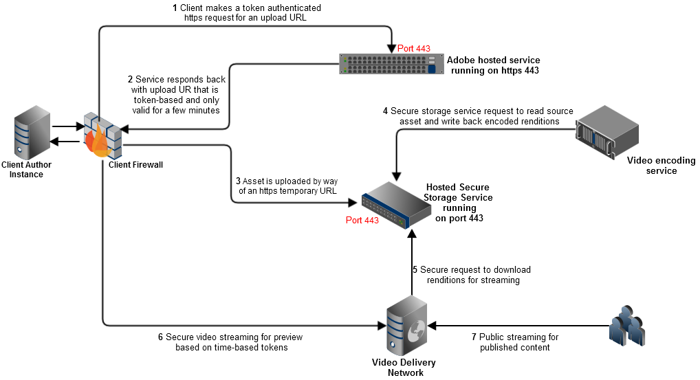
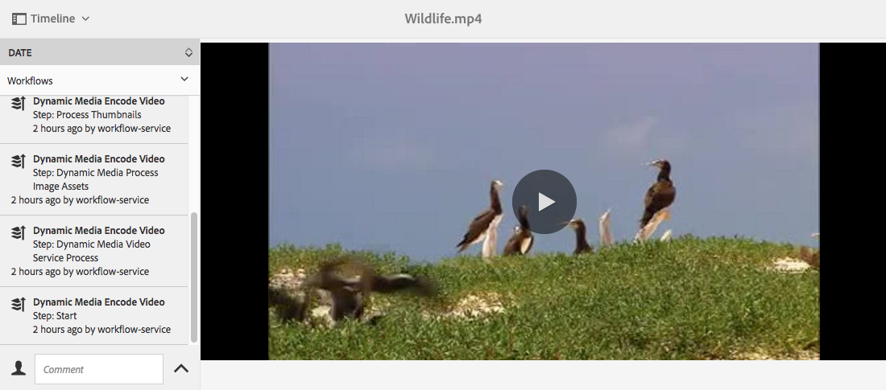

# Vídeo {#video}

Esta seção descreve como trabalhar com vídeo no Dynamic Media.

## Início rápido: vídeos {#quick-start-videos}

A descrição do fluxo de trabalho passo a passo a seguir foi projetada para ajudar você a começar a usar rapidamente os conjuntos de vídeos adaptáveis no Dynamic Media. Após cada etapa, há referências cruzadas para cabeçalhos de tópicos onde você pode encontrar mais informações.

>[!NOTE]
>
>Antes de trabalhar com vídeo no Dynamic Media, verifique se o administrador do Adobe Experience Manager já ativou e configurou o Dynamic Media Cloud Services.
>
>* Consulte [Configurar o Dynamic Media Cloud Services](/help/assets/dynamic-media/config-dm.md#configuring-dynamic-media-cloud-services) em Configuração do Dynamic Media e [Solução de problemas do Dynamic Media](/help/assets/dynamic-media/troubleshoot-dm.md).
>


1. **Fazer upload de vídeos do Dynamic Media** fazendo o seguinte:

   * Crie seu próprio perfil de codificação de vídeo. Ou você pode simplesmente usar a predefinição _Codificação de vídeo adaptável_ que vem com o Dynamic Media.

      * [Criar um perfil de codificação de vídeo](/help/assets/dynamic-media/video-profiles.md#creating-a-video-encoding-profile-for-adaptive-streaming).
      * Saiba mais sobre [Práticas recomendadas para codificação de vídeo](#best-practices-for-encoding-videos).
   * Associe o perfil de processamento de vídeo a uma ou mais pastas nas quais você fará upload dos vídeos de origem primária.

      * [Aplicar um perfil de vídeo a pastas](/help/assets/dynamic-media/video-profiles.md#applying-a-video-profile-to-folders).
      * Saiba mais sobre [Organizar ativos digitais](/help/assets/organize-assets.md).
   * Faça upload dos vídeos de origem principal para as pastas. Quando você adiciona vídeos à pasta, eles são codificados de acordo com o perfil de processamento de vídeo atribuído à pasta.

      * O Dynamic Media suporta principalmente vídeos de formato curto com duração máxima de 30 minutos e resolução mínima superior a 25 x 25.
      * Você pode carregar arquivos de vídeo de até 15 GB cada.
      * [Fazer upload de vídeos](/help/assets/manage-video-assets.md#upload-and-preview-video-assets).
      * Saiba mais sobre [Formatos de arquivo de entrada compatíveis](/help/assets/file-format-support.md).
   * Monitorar como [a codificação de vídeo está em andamento](#monitoring-video-encoding-and-youtube-publishing-progress) na exibição ativo ou fluxo de trabalho.


1. **Gerenciar vídeos do Dynamic Media** executando qualquer um dos procedimentos a seguir:

   * Organize, navegue e pesquise ativos de vídeo

      * [Organizar ativos digitais](/help/assets/organize-assets.md)
      * [Pesquisar ativos de vídeo](/help/assets/search-assets.md#custompredicates) ou [Pesquisar ativos](/help/assets/manage-digital-assets.md#search-assets)
   * Pré-visualizar e publicar ativos de vídeo

      * Visualize o vídeo de origem e as representações codificadas do vídeo, juntamente com suas miniaturas associadas:
         [Visualizar vídeos](/help/assets/manage-video-assets.md#upload-and-preview-video-assets) ou [Visualizar ativos](/help/assets/dynamic-media/previewing-assets.md)
         [Gerenciar representações de vídeo](/help/assets/manage-digital-assets.md#managing-renditions)

      * [Gerenciar predefinições do visualizador](/help/assets/dynamic-media/managing-viewer-presets.md)
      * [Publicar ativos](/help/assets/dynamic-media/publishing-dynamicmedia-assets.md)
   * Trabalhar com metadados de vídeo

      * Edite as propriedades do vídeo, como título, descrição, tags e campos de metadados personalizados:
         [Edição de propriedades do vídeo](/help/assets/manage-digital-assets.md#editing-properties)

      * [Gerenciamento de metadados para ativos digitais](/help/assets/manage-metadata.md)
      * [Esquemas de metadados](/help/assets/metadata-schemas.md)
   * Revise, aprove e anote vídeos e mantenha o controle total de versão

      * [Anotação em vídeos](/help/assets/manage-video-assets.md#annotate-video-assets) ou [Anotação de ativos](/help/assets/manage-digital-assets.md#annotating)

      * [Criação de uma versão](/help/assets/manage-digital-assets.md#asset-versioning)
      * [Iniciar um fluxo de trabalho em um ativo](/help/assets/manage-digital-assets.md#starting-a-workflow-on-an-asset)

      * [Revisar ativos da pasta](/help/assets/bulk-approval.md)
      * [Projetos](/help/sites-cloud/authoring/projects/overview.md)


1. **Publicar seus vídeos do Dynamic Media** executando um dos procedimentos a seguir:

   * Se você usa o Experience Manager como seu sistema WCM (Web Content Management, gerenciamento de conteúdo da Web), é possível adicionar vídeos diretamente às páginas da Web.

      * [Adicionar vídeos às suas páginas da Web](/help/assets/dynamic-media/adding-dynamic-media-assets-to-pages.md).
   * Se você estiver usando um sistema de gerenciamento de conteúdo da Web de terceiros, é possível vincular ou incorporar vídeos às suas páginas da Web.

      * Integrar vídeo usando o URL:
         [Vincular URLs ao aplicativo da Web](/help/assets/dynamic-media/linking-urls-to-yourwebapplication.md).

      * Integrar vídeo usando o código incorporado na página da Web:
         [Incorporar o visualizador de vídeo em uma página da Web](/help/assets/dynamic-media/embed-code.md).
   * [Publicar vídeos no YouTube](#publishing-videos-to-youtube).
   * [Gerar relatórios de vídeo](#viewing-video-reports).

   * [Adicionar legendas ao vídeo](#adding-captions-to-video).


## Trabalhar com vídeo no Dynamic Media {#working-with-video-in-dynamic-media}

O Vídeo no Dynamic Media é uma solução completa que facilita a publicação de vídeo adaptável de alta qualidade para transmissão em várias telas, incluindo desktops, tablets e dispositivos móveis. Um Conjunto de vídeos adaptados agrupa versões do mesmo vídeo codificadas em taxas de bits e formatos diferentes, como 400 kbps, 800 kbps e 1000 kbps. O computador desktop ou dispositivo móvel detecta a largura de banda disponível.

Por exemplo, em um dispositivo móvel iOS, ele detecta uma largura de banda como 3G, 4G ou Wi-Fi. Em seguida, ele seleciona automaticamente o vídeo codificado correto entre as várias taxas de bits de vídeo no Conjunto de vídeos adaptados. O vídeo é transmitido para desktops, dispositivos móveis ou tablets.

Além disso, a qualidade do vídeo é comutada automaticamente de forma dinâmica se as condições da rede forem alteradas no desktop ou no dispositivo móvel. Além disso, se um cliente entrar no modo de tela cheia em um desktop, o Conjunto de vídeos adaptados responderá usando uma resolução melhor, melhorando a experiência de visualização do cliente. O uso dos Conjuntos de vídeos adaptados oferece a melhor reprodução possível para clientes que reproduzem vídeos do Dynamic Media em várias telas e dispositivos.

A lógica que um reprodutor de vídeo usa para determinar qual vídeo codificado reproduzir ou selecionar durante a reprodução se baseia no seguinte algoritmo:

1. O reprodutor de vídeo carrega o fragmento de vídeo inicial com base na taxa de bits mais próxima do valor definido para &quot;taxa de bits inicial&quot; no próprio reprodutor.
1. O reprodutor de vídeo muda com base nas alterações na velocidade da largura de banda, usando os seguintes critérios:

   1. O player escolhe o fluxo de largura de banda mais alto abaixo ou igual à largura de banda estimada.
   1. O player considera apenas 80% da largura de banda disponível. No entanto, se estiver mudando, é mais conservador em apenas 70% para evitar superestimar e voltar imediatamente.

Para obter informações técnicas detalhadas sobre o algoritmo, consulte [https://android.googlesource.com/platform/frameworks/av/+/master/media/libstagefright/httplive/LiveSession.cpp](https://android.googlesource.com/platform/frameworks/av/+/master/media/libstagefright/httplive/LiveSession.cpp)

Para gerenciar vídeos únicos e Conjuntos de vídeos adaptados, o seguinte é suportado:

* Fazer upload de vídeo de vários formatos de vídeo e formatos de áudio suportados e codificar vídeo para o formato MP4 H.264 para reprodução em várias telas. Você pode usar predefinições predefinidas de vídeos adaptáveis, predefinições de codificação de vídeos únicos ou personalizar sua própria codificação para controlar a qualidade e o tamanho do vídeo.

   * Quando um conjunto de vídeos adaptáveis é gerado, ele inclui vídeos MP4.
   * **Nota**: vídeos primários/de origem não são adicionados a um Conjunto de vídeos adaptados.

* Legendagem de vídeo em todos os visualizadores de vídeo HTML5.
* Organize, navegue e pesquise vídeos com suporte completo a metadados para obter um gerenciamento eficiente dos ativos de vídeo.
* Forneça Conjuntos de vídeos adaptados para a Web e para desktops, tablets e dispositivos móveis.

O streaming de vídeo adaptável é suportado em várias plataformas iOS. Consulte [Guia de referência de visualizadores do Dynamic Media](https://experienceleague.adobe.com/docs/dynamic-media-developer-resources/library/viewers-aem-assets-dmc/video/c-html5-video-reference.html).

<!-- OUTDATED 2/28/22 BASED ON CQDOC-18692 Dynamic Media supports mobile video playback for MP4 H.264 video. You can find BlackBerry&reg; devices that support this video format at the following: [Supported video formats on BlackBerry&reg;](https://support.blackberry.com/kb/articleDetail?ArticleNumber=000005482).

OUTDATED 2/28/22 BASED ON CQDOC-18692 You can find Windows&reg; devices that support this video format at the following [Supported video formats on Windows&reg; Phone](https://docs.microsoft.com/en-us/windows/uwp/audio-video-camera/supported-codecs). -->

* Reproduza o vídeo usando as Predefinições do visualizador de vídeo do Dynamic Media, incluindo o seguinte:

   * Visualizadores de vídeo únicos.
   * Visualizadores de mídia mista que combinam conteúdo de vídeo e imagem.

* Configure players de vídeo para atender às suas necessidades de marca.
* Integre vídeo ao seu site, site móvel ou aplicativo móvel com um URL simples ou código integrado.

Consulte [Reprodução dinâmica de vídeo](https://s7d9.scene7.com/s7/uvideo.jsp?asset=GeoRetail/Mop_AVS&amp;config=GeoRetail/Universal_Video1&amp;stageSize=640,480) amostra.

Consulte também [Visualizadores para Experience Manager Assets e Dynamic Media Classic](https://experienceleague.adobe.com/docs/dynamic-media-developer-resources/library/viewers-aem-assets-dmc/c-html5-s7-aem-asset-viewers.html#viewers-aem-assets-dmc) e [Visualizadores somente para o Experience Manager Assets](https://experienceleague.adobe.com/docs/dynamic-media-developer-resources/library/viewers-for-aem-assets-only/c-html5-aem-asset-viewers.html#viewers-for-aem-assets-only) no [Guia de referência de visualizadores do Dynamic Media](https://experienceleague.adobe.com/docs/dynamic-media-developer-resources.html).

## Prática recomendada: uso do visualizador de vídeo HTML5 {#best-practice-using-the-html-video-viewer}

As predefinições do visualizador de vídeo Dynamic Media HTML5 são players de vídeo robustos. Você pode usá-los para evitar muitos problemas comuns associados à reprodução de vídeo HTML5 e problemas associados a dispositivos móveis. Por exemplo, a falta de transmissão adaptável da taxa de bits e o alcance limitado do navegador do desktop.

No lado do design do reprodutor, é possível projetar a funcionalidade dele usando as ferramentas padrão de desenvolvimento na Web. Por exemplo, você pode projetar os botões, os controles e o plano de fundo personalizado da imagem de pôster usando o HTML5 e o CSS para ajudar você a alcançar seus clientes com uma aparência personalizada.

No lado da reprodução do visualizador, ele detecta automaticamente o recurso de vídeo do navegador. Em seguida, ele serve o vídeo usando HLS ou DASH, também conhecido como transmissão de vídeo adaptável. Ou, se esses métodos de delivery não estiverem presentes, será usado o HTML5 progressive.

>[!NOTE]
>
>Para usar o DASH nos seus vídeos, ele precisa primeiro ser habilitado pelo Suporte Técnico Adobe na sua conta. Consulte [Habilitar DASH na sua conta](#enable-dash).)

Você pode combinar em um único player a capacidade de projetar os componentes de reprodução usando HTML5 e CSS. Ele pode ter reprodução integrada e usar transmissão adaptável e progressiva, dependendo da capacidade do navegador. Toda essa funcionalidade significa que você pode estender o alcance do seu conteúdo de mídia avançada para usuários de desktop e dispositivos móveis e garantir uma experiência de vídeo simplificada.

Consulte também [Visualizadores somente para o Experience Manager Assets](https://experienceleague.adobe.com/docs/dynamic-media-developer-resources/library/viewers-for-aem-assets-only/c-html5-aem-asset-viewers.html#viewers-for-aem-assets-only) no [Guia de referência de visualizadores do Dynamic Media](https://experienceleague.adobe.com/docs/dynamic-media-developer-resources.html).


### Reprodução de vídeo em computadores desktop e dispositivos móveis usando o visualizador de vídeo HTML5 {#playback-of-video-on-desktop-computers-and-mobile-devices-using-the-html-video-viewer}

Para streaming de vídeo adaptável de desktop e móvel, os vídeos usados para a alternância da taxa de bits são baseados em todos os vídeos MP4 no Conjunto de vídeos adaptados.

A reprodução de vídeo ocorre usando HLS ou DASH ou download progressivo de vídeo. Em versões anteriores do Experience Manager, como 6.0, 6.1 e 6.2, os vídeos eram transmitidos via HTTP.

No entanto, no Experience Manager 6.3 e posterior, os vídeos agora são transmitidos por HTTPS (ou seja, HLS ou DASH), pois o URL do serviço de gateway do DM também usa HTTPS. Não há impacto para o cliente nesse comportamento padrão. Ou seja, a transmissão de vídeo sempre ocorrerá em HTTPS, a menos que ela não seja suportada pelo navegador. (consulte a tabela abaixo).

Portanto,

* Se você tiver um site HTTPS com transmissão de vídeo HTTPS, a transmissão está boa.
* Se você tiver um site HTTP com transmissão de vídeo HTTPS, a transmissão está boa e não há problemas de conteúdo misto no navegador da Web.

DASH é o padrão internacional e HLS é um padrão da Apple. Ambos são usados para transmissão de vídeo adaptável. E ambas as tecnologias ajustam automaticamente a reprodução com base na capacidade de largura de banda da rede. Ele também permite que o cliente &quot;procure&quot; qualquer ponto do vídeo, sem a necessidade de aguardar o download do restante do vídeo.

O vídeo progressivo é fornecido ao baixar e armazenar o vídeo localmente no sistema de desktop de um usuário ou dispositivo móvel.

A tabela a seguir descreve o dispositivo, o navegador e o método de reprodução de vídeos em computadores desktop e dispositivos móveis que usam o [Visualizador de vídeo Dynamic Media HTML5](https://experienceleague.adobe.com/docs/dynamic-media-developer-resources/library/viewers-for-aem-assets-only/interactive-video/c-html5-aem-int-video.html#interactive-video).

<table>
 <tbody>
  <tr>
   <td><strong>Device</strong></td>
   <td><strong>Navegador</strong></td>
   <td><strong>Modo de reprodução de vídeo</strong></td>
  </tr>
  <tr>
   <td>Área de trabalho</td>
   <td>Internet Explorer 9 e 10</td>
   <td>Download progressivo.</td>
  </tr>
  <tr>
   <td>Área de trabalho</td>
   <td>Internet Explorer 11+</td>
   <td>No Windows® 8 e Windows® 10 - Forçar o uso de HTTPS sempre que DASH ou HLS for solicitado. Limitação conhecida: HTTP no DASH ou HLS não funciona nesta combinação de navegador/sistema operacional<br /> <br /> No Windows® 7 - Download progressivo. Usa lógica padrão para selecionar protocolo HTTP versus HTTPS.</td>
  </tr>
  <tr>
   <td>Área de trabalho</td>
   <td>Firefox 23-44</td>
   <td>Download progressivo.</td>
  </tr>
  <tr>
   <td>Área de trabalho</td>
   <td>Firefox 45 ou posterior</td>
   <td>Transmissão da taxa de bits adaptável HLS ou DASH*</td>
  </tr>
  <tr>
   <td>Área de trabalho</td>
   <td>Chrome</td>
   <td>Transmissão da taxa de bits adaptável HLS ou DASH*</td>
  </tr>
  <tr>
   <td>Área de trabalho</td>
   <td>Safari (Mac)</td>
   <td>Transmissão da taxa de bits adaptável HLS</td>
  </tr>
  <tr>
   <td>Móvel</td>
   <td>Chrome (Android™ 6 ou anterior)</td>
   <td>Download progressivo.</td>
  </tr>
  <tr>
   <td>Móvel</td>
   <td>Chrome (Android™ 7 ou posterior)</td>
   <td>Transmissão adaptável da taxa de bits HLS ou DASH*/td&gt;
  </tr>
  <tr>
   <td>Móvel</td>
   <td>Android™ (navegador padrão)</td>
   <td>Download progressivo.</td>
  </tr>
  <tr>
   <td>Móvel</td>
   <td>Safari (iOS)</td>
   <td>Transmissão da taxa de bits adaptável HLS</td>
  </tr>
  <tr>
   <td>Móvel</td>
   <td>Chrome (iOS)</td>
   <td>Transmissão da taxa de bits adaptável HLS</td>
  </tr>
 </tbody>
</table>

>[!IMPORTANT]
>
>*Para usar o DASH para seus vídeos, primeiro ele deve ser habilitado pelo Suporte Técnico Adobe em sua conta. Consulte [Habilitar DASH na sua conta](#enable-dash).)

<!--  THIS LINE WAS REMOVED FROM THE TABLE ABOVE ON FEB 28, 2022 BASED ON CQDOC 18692 -RSB <tr>
   <td>Mobile</td>
   <td>BlackBerry&reg;</td>
   <td>HLS or DASH</td>
  </tr>
 -->

## Arquitetura da solução de vídeo da Dynamic Media {#architecture-of-dynamic-media-video-solution}

O gráfico a seguir mostra o fluxo de trabalho geral de criação de vídeos que são carregados e codificados por meio do DMGateway (no modo híbrido do Dynamic Media) e disponibilizados para consumo público.



## Arquitetura de publicação híbrida para vídeos {#hybrid-publishing-architecture-for-videos}


## Práticas recomendadas para codificação de vídeos {#best-practices-for-encoding-videos}

A variável **Codificação de vídeo Dynamic Media** o fluxo de trabalho codifica o vídeo se você tiver ativado o Dynamic Media e configurado os Cloud Services de vídeo. Esse fluxo de trabalho captura o histórico do processo de fluxo de trabalho e as informações de falha. Consulte [Monitorar o progresso da codificação de vídeo e da publicação no YouTube](#monitoring-video-encoding-and-youtube-publishing-progress). Se você tiver ativado o Dynamic Media e configurado os Cloud Services de vídeo, a variável **[!UICONTROL Codificação de vídeo Dynamic Media]** o fluxo de trabalho entra em vigor automaticamente ao fazer upload de um vídeo. (Se você não estiver usando o Dynamic Media, a variável **[!UICONTROL Ativo de atualização DAM]** fluxo de trabalho entra em vigor.)

Veja a seguir dicas de práticas recomendadas para a codificação de arquivos de vídeo de origem.

<!-- For advice about video encoding, see the following:

* [Streaming 101: The Basics — Codecs, Bandwidth, Data Rate, and Resolution](https://www.adobe.com/go/learn_s7_streaming101_en).
* [Video Encoding Basics](https://www.adobe.com/go/learn_s7_encoding_en). -->

### Arquivos de vídeo de origem {#source-video-files}

Ao codificar um arquivo de vídeo, use um arquivo de vídeo de origem com a mais alta qualidade possível. Evite usar arquivos de vídeo codificados anteriormente, pois esses arquivos já estão compactados, e codificações adicionais criam um vídeo de qualidade inferior.

* O Dynamic Media suporta principalmente vídeos de formato curto com duração máxima de 30 minutos e resolução mínima superior a 25 x 25.
* Você pode fazer upload de arquivos de vídeo de origem principal de até 15 GB cada.

A tabela a seguir descreve o tamanho recomendado, a taxa de proporção e a taxa de bits mínima que seus arquivos de vídeo de origem devem ter antes de serem codificados:

| Tamanho | Taxa de proporção | Taxa de bits mínima |
|--- |--- |--- |
| 1024 X 768 | 4:3 | 4500 kbps para a maioria dos vídeos. |
| 1280 X 720 | 16:9 | 3000 - 6000 kbps, dependendo da quantidade de movimento no vídeo. |
| 1920 X 1080 | 16:9 | 6000 - 8000 kbps, dependendo da quantidade de movimento no vídeo. |

### Obter os metadados de um arquivo {#obtaining-a-file-s-metadata}

Você pode obter os metadados de um arquivo visualizando os metadados usando uma ferramenta de edição para vídeos ou usando um aplicativo projetado para obter metadados. A seguir estão as instruções para usar o MediaInfo, um aplicativo de terceiros, para obter os metadados de um arquivo de vídeo:

1. Ir para [Download de MediaInfo](https://mediaarea.net/en/MediaInfo/Download).
1. Selecione e baixe o instalador para a versão da GUI e siga as instruções de instalação.
1. Após a instalação, clique com o botão direito no arquivo de vídeo (somente Windows®) e selecione MediaInfo, ou abra MediaInfo e arraste o arquivo de vídeo para o aplicativo. Você verá todos os metadados associados ao arquivo de vídeo, incluindo largura, altura e fps.

### Taxa de proporção {#aspect-ratio}

Ao escolher ou criar uma predefinição de codificação de vídeo para o arquivo de vídeo de origem principal, verifique se a predefinição tem a mesma proporção do arquivo de vídeo de origem principal. A taxa de proporção é a relação entre a largura e a altura do vídeo.

Para determinar a proporção de um arquivo de vídeo, obtenha os metadados do arquivo e observe a largura e a altura do arquivo (consulte Obtenção de metadados de um arquivo acima). Em seguida, use esta fórmula para determinar a proporção:

largura/altura = taxa de proporção

A tabela a seguir descreve como os resultados da fórmula são convertidos em opções comuns de taxa de proporção:

| Resultado da fórmula | Taxa de proporção |
|--- |--- |
| 1.33 | 4:3 |
| 0.75 | 3:4 |
| 1.78 | 16:9 |
| 0.56 | 9:16 |

Por exemplo, um vídeo com largura de 1440 x altura de 1080 tem uma taxa de proporção de 1440/1080 ou 1,33. Nesse caso, você escolhe uma predefinição de codificação de vídeo com uma proporção 4:3 para codificar o arquivo de vídeo.

### Taxa de bits {#bitrate}

Taxa de bits é a quantidade de dados codificados para compor um segundo da reprodução de vídeo. A taxa de bits é medida em kilobits por segundo (Kbps).

>[!NOTE]
>
>Como todos os codecs usam compactação com perdas, a taxa de bits é o fator mais importante na qualidade do vídeo. Com a compactação com perdas, quanto mais você compacta um arquivo de vídeo, mais a qualidade é degradada. Por isso, todas as outras características são iguais (resolução, taxa de quadros e codec), quanto menor a taxa de bits, menor a qualidade do arquivo compactado.

Ao selecionar uma codificação de taxa de bits, há dois tipos que você pode escolher:

* **[!UICONTROL Codificação de taxa de bits constante]** (CBR) - Durante a codificação do CBR, a taxa de bits ou o número de bits por segundo é mantido o mesmo durante todo o processo de codificação. A codificação CBR persiste na taxa de definição de dados para sua configuração ao longo de todo o vídeo. Além disso, a codificação CBR não otimiza os arquivos de mídia para melhorar a qualidade, mas economiza espaço de armazenamento.
Use o CBR se o vídeo tiver um nível de movimento semelhante em todo o vídeo. O CBR é usado com mais frequência para streaming de conteúdo de vídeo. Consulte também [Usar parâmetros de codificação de vídeo adicionados personalizados](/help/assets/dynamic-media/video-profiles.md#using-custom-added-video-encoding-parameters).

* **[!UICONTROL Codificação de taxa de bits variável]** (VBR) - A codificação VBR ajusta a taxa de dados para baixo e para o limite superior definido, com base nos dados exigidos pelo compactador. Essa funcionalidade significa que, durante um processo de codificação de VBR, a taxa de bits do arquivo de mídia aumenta ou diminui dinamicamente, dependendo das necessidades de taxa de bits dos arquivos de mídia.
O VBR demora mais para codificar, mas produz os resultados mais favoráveis; a qualidade do arquivo de mídia é superior. O VBR é usado com mais frequência para entrega progressiva de conteúdo de vídeo http.

Quando você usa VBR versus CRB?
Ao selecionar VBR versus CBR, é quase sempre recomendável usar VBR para seus arquivos de mídia. O VBR fornece arquivos de maior qualidade a taxas de bits competitivas. Ao usar o VBR, certifique-se de usar o com codificação em dois passos e defina a taxa de bits máxima para 1,5 vez a taxa de bits do vídeo de destino.

Ao escolher uma predefinição de codificação de vídeo, considere a velocidade de conexão do usuário final de destino. Escolha uma predefinição com uma taxa de dados que seja 80% dessa velocidade. Por exemplo, se a velocidade de conexão do usuário final de destino for 1000 Kbps, a melhor predefinição é aquela com uma taxa de dados de vídeo de 800 Kbps.

Esta tabela descreve a taxa de dados de velocidades de conexão típicas.

| Velocidade (Kbps) | Tipo de conexão |
|--- |--- |
| 256 | Conexão dial-up. |
| 800 | Conexão móvel típica. Para essa conexão, direcione uma taxa de dados na faixa de 400 a no máximo 800 para experiências 3G. |
| 2000 | Conexão típica de desktop de banda larga. Para essa conexão, direcione uma taxa de dados na faixa de 800-2000 Kbps, com a média da maioria dos targets de 1200-1500 Kbps. |
| 5000 | Conexão típica de alta banda larga. A codificação nesse intervalo superior não é recomendada porque a entrega de vídeo nessa velocidade não está disponível para a maioria dos consumidores. |

### Resolução {#resolution}

**Resolução** descreve a altura e a largura de um arquivo de vídeo em pixels. A maioria dos vídeos de origem é armazenada em alta resolução (por exemplo, 1920 x 1080). Para fins de transmissão, o vídeo de origem é compactado em uma resolução menor (640 x 480 ou menor).

Resolução e taxa de dados são dois fatores vinculados integralmente que determinam a qualidade do vídeo. Para manter a mesma qualidade de vídeo, quanto maior o número de pixels em um arquivo de vídeo (quanto maior a resolução), maior deverá ser a taxa de dados. Por exemplo, considere o número de pixels por quadro em uma resolução de 320 x 240 e um arquivo de vídeo de resolução de 640 x 480:

| Resolução | Pixels por quadro |
|--- |--- |
| 320 x 240 | 76,800 |
| 640 x 480 | 307,200 |

O arquivo de 640 x 480 tem quatro vezes mais pixels por quadro. Para obter a mesma taxa de dados para essas duas resoluções de exemplo, aplique quatro vezes a compactação ao arquivo 640 x 480, o que pode reduzir a qualidade do vídeo. Portanto, uma taxa de dados de vídeo de 250 Kbps produz uma visualização de alta qualidade com resolução de 320 x 240, mas não com resolução de 640 x 480.

Em geral, quanto maior a taxa de dados usada, melhor será a exibição do vídeo e maior será a resolução usada, maior será a taxa de dados que você deve manter a qualidade da visualização (em comparação com resoluções mais baixas).

Como a resolução e a taxa de dados são vinculadas, você tem duas opções ao codificar vídeos:

* Escolha uma taxa de dados e, em seguida, codifique na resolução mais alta que pareça boa na taxa de dados escolhida.
* Escolha uma resolução e codifique na taxa de dados necessária para obter um vídeo de alta qualidade na resolução escolhida.

Ao escolher (ou criar) uma predefinição de codificação de vídeo para o arquivo de vídeo de origem principal, use essa tabela para definir a resolução correta:

| Resolução | Altura (pixels) | Tamanho da tela |
|--- |--- |--- |
| 240p | 240 | Tela pequena |
| 300p | 300 | Tela pequena normalmente para dispositivos móveis |
| 360p | 360 | Tela pequena |
| 480p | 480 | Tela média |
| 720p | 720 | Tela grande |
| 1080p | 1080 | Tela grande de alta definição |

### Fps (Quadros por segundo) {#fps-frames-per-second}

Nos Estados Unidos e no Japão, a maior parte do vídeo é filmado a 29,97 quadros por segundo (fps); na Europa, a maior parte do vídeo é filmado a 25 fps. O filme é filmado a 24 fps.

Escolha uma predefinição de codificação de vídeo que corresponda à taxa de fps do arquivo de vídeo de origem principal. Por exemplo, se o vídeo de origem principal tiver 25 qps, escolha uma predefinição de codificação com 25 qps. Por padrão, toda codificação personalizada usa o fps do arquivo de vídeo de origem principal. Por isso, não é necessário especificar explicitamente a configuração fps ao criar uma predefinição de codificação de vídeo.

### Dimensões de codificação de vídeo {#video-encoding-dimensions}

Para obter resultados ideais, selecione dimensões de codificação de forma que o vídeo de origem seja um múltiplo inteiro de todos os vídeos codificados.

Para calcular essa proporção, divida a largura da origem pela largura codificada para obter a proporção da largura. Em seguida, divida a altura da origem pela altura codificada para obter a proporção da altura.

Se a proporção resultante for um inteiro, significa que o vídeo está dimensionado de maneira ideal. Se a proporção resultante não for um número inteiro, ela afetará a qualidade do vídeo, deixando artefatos de pixel restantes na exibição. Esse efeito é mais perceptível quando o vídeo tem texto.

Por exemplo, suponha que a origem de vídeo seja 1920 x 1080. Na tabela a seguir, os três vídeos codificados fornecem as configurações de codificação ideais para usar.

| Tipo de vídeo | Largura x altura | Proporção de largura | Taxa de altura |
|--- |--- |--- |--- |
| Origem | 1920x1080 | 1 | 1 |
| Codificado | 960 x 540 | 2 | 2 |
| Codificado | 640 x 360 | 3 | 3 |
| Codificado | 480 x 270 | 4 | 4 |

### Formato de arquivo de vídeo codificado {#encoded-video-file-format}

A Dynamic Media recomenda usar predefinições de codificação de vídeo MP4 H.264. Como os arquivos MP4 usam o codec de vídeo H.264, ele fornece vídeo de alta qualidade, mas em um tamanho de arquivo compactado.

### Habilitar DASH na sua conta {#enable-dash}

DASH (Digital Adaptive Streaming over HTTP) é o padrão internacional para streaming de vídeo e é amplamente adotado em diferentes visualizadores de vídeo. Quando o DASH está ativado em sua conta, você tem a opção de escolher entre DASH ou HLS para o streaming de vídeo adaptável. Ou você pode optar por ambos com alternância automática entre players quando **[!UICONTROL automático]** é selecionado como o tipo de reprodução na predefinição do Visualizador.

Alguns dos principais benefícios da ativação do DASH em sua conta incluem:

* Vídeo de fluxo DASH do pacote para transmissão adaptável da taxa de bits. Esse método leva a uma maior eficiência do delivery. A transmissão adaptável garante a melhor experiência de visualização para seus clientes.
* A transmissão otimizada do navegador com players do Dynamic Media alterna entre a transmissão HLS e DASH para garantir a melhor qualidade do serviço. O reprodutor de vídeo alterna automaticamente para HLS quando um navegador Safari é usado.
* Você pode configurar seu método de transmissão preferido (HLS ou DASH) editando a predefinição do visualizador de vídeo.
* A codificação otimizada de vídeo garante que nenhum armazenamento adicional seja usado ao ativar o recurso DASH. Um único conjunto de códigos de vídeo é criado para HLS e DASH para otimizar os custos de armazenamento de vídeo.
* Ajuda a tornar a entrega de vídeo mais acessível para os clientes.
* Obtenha o URL de transmissão por meio de APIs também.

   >[!IMPORTANT]
   >
   >A ativação do DASH em sua conta está disponível atualmente apenas na América do Norte.

Você inicia uma solicitação para usar o DASH; ele não é ativado automaticamente em sua conta.

Para habilitar DASH em sua conta, crie um caso de suporte ao cliente, conforme descrito abaixo. No caso de suporte, especifique que deseja ativar o DASH na conta do Dynamic Media e no Experience Manager.

**Para ativar o DASH na sua conta:**

1. [Use o Admin Console para iniciar a criação de um novo caso de suporte](https://helpx.adobe.com/br/enterprise/using/support-for-experience-cloud.html).
1. Siga as instruções para criar um caso de suporte e, ao mesmo tempo, forneça as seguintes informações:

   * Nome do contato principal, email, telefone.
   * Nome da sua conta do Dynamic Media.
   * Especifique que deseja ativar o DASH na sua conta do Dynamic Media e no Experience Manager.

1. O Suporte ao cliente do Adobe adiciona você à Lista de espera do cliente do DASH com base na ordem em que as solicitações são enviadas.
1. Quando o Adobe estiver pronto para lidar com sua solicitação, o Suporte ao cliente entrará em contato com você para coordenar e definir uma data limite para a ativação do DASH.
1. Você será notificado após a conclusão pelo Suporte ao cliente.
1. Crie seu [predefinição do visualizador de vídeo](/help/assets/dynamic-media/managing-viewer-presets.md#creating-a-new-viewer-preset) como de costume.

## Publicar vídeos no YouTube {#publishing-videos-to-youtube}

Você pode publicar ativos de vídeo gerenciados no Experience Manager Assets diretamente em um canal do YouTube criado anteriormente.

Para publicar ativos de vídeo no YouTube, você marca ativos de vídeo no Experience Manager Assets com tags. Você associa essas tags a um canal do YouTube. Se a tag de um ativo de vídeo corresponder à tag de um canal do YouTube, o vídeo será publicado no YouTube. A publicação na YouTube ocorre junto com uma publicação normal do vídeo, desde que uma tag associada seja usada.

O YouTube faz sua própria codificação. Dessa forma, o arquivo de vídeo original carregado no Experience Manager é publicado no YouTube, em vez de qualquer representação de vídeo criada pela codificação do Dynamic Media. Embora não seja necessário processar vídeos usando o Dynamic Media, espera-se que eles façam isso caso uma predefinição do visualizador seja necessária para a reprodução.

Ao ignorar o perfil de processamento de vídeo e publicar diretamente no YouTube, isso significa simplesmente que o ativo de vídeo no Experience Manager Asset não obtém uma miniatura visualizável. Também significa que os vídeos não codificados não funcionam com nenhum dos tipos de ativos do Dynamic Media.

A publicação de ativos de vídeo em servidores da YouTube envolve a conclusão das seguintes tarefas para garantir uma verificação segura de servidor para servidor com o YouTube:

1. [Definir configurações da Google Cloud](#configuring-google-cloud-settings)
1. [Criar um canal do YouTube](#creating-a-youtube-channel)
1. [Adicionar tags para publicação](#adding-tags-for-publishing)
1. [Configurar o YouTube no Experience Manager](#setting-up-youtube-in-aem)
1. [(Opcional) Automatize a configuração das propriedades padrão do YouTube para os vídeos carregados](#optional-automating-the-setting-of-default-youtube-properties-for-your-uploaded-videos)
1. [Publicar vídeos no seu canal do YouTube](#publishing-videos-to-your-youtube-channel)
1. [(Opcional) Verifique o vídeo publicado no YouTube](/help/assets/dynamic-media/video.md#optional-verifying-the-published-video-on-youtube)
1. [Vincular URLs do YouTube à sua aplicação web](#linking-youtube-urls-to-your-web-application)

Também é possível [desfazer a publicação de vídeos para removê-los do YouTube](#unpublishing-videos-to-remove-them-from-youtube).

### Definir configurações da Google Cloud {#configuring-google-cloud-settings}

Para publicar no YouTube, você precisa de uma conta do Google. Se você tiver uma conta do GMAIL, já terá uma conta do Google; se não tiver uma conta do Google, poderá criar facilmente uma. Você precisa da conta porque precisa de credenciais para publicar ativos de vídeo no YouTube. <!-- hidden March 3 2022 If you have an account already created, then skip this task and proceed directly to [Create a YouTube channel](#creating-a-youtube-channel). -->

A conta usada com a Google Cloud e a conta do Google usada para o YouTube não precisam ser a mesma.

A Google altera periodicamente a interface do usuário. Dessa forma, as etapas para publicar vídeos no YouTube podem variar um pouco do que está documentado abaixo. Esse aviso também se aplica ao YouTube quando você tenta verificar se os vídeos foram carregados para ele.

>[!NOTE]
>
>As etapas a seguir eram precisas no momento da escrita. No entanto, a Google atualiza periodicamente suas páginas da Web em nuvem sem aviso prévio. Dessa forma, algumas opções de configuração podem ser nomeadas de forma um pouco diferente na interface do usuário do Google do nome usado nas etapas.

**Para definir as configurações da Google Cloud:**

1. Crie uma conta do Google.
   [https://accounts.google.com/signup/v2?service=mail&amp;flowName=GlifWebSignIn&amp;flowEntry=SignUp](https://accounts.google.com/signup/v2?service=mail&amp;flowName=GlifWebSignIn&amp;flowEntry=SignUp)

   Se você já tiver uma conta do Google, pule para a próxima etapa.

1. Ir para [https://cloud.google.com/](https://cloud.google.com/).
1. No **[!UICONTROL Google Cloud]** próximo ao canto superior direito, selecione **[!UICONTROL Console]**.

   Se necessário, **[!UICONTROL Fazer logon]** usar as credenciais da conta da Google para ver o **[!UICONTROL Console]** opção.

1. No **[!UICONTROL Painel]** à direita de **[!UICONTROL Google Cloud Platform]**, selecione o **[!UICONTROL Projeto]** lista suspensa para abrir a **[!UICONTROL Selecione um projeto]** caixa de diálogo.
1. No **[!UICONTROL Selecione um projeto]** caixa de diálogo, selecione **[!UICONTROL Novo projeto]**.
1. No **[!UICONTROL Novo projeto]** caixa de diálogo, no campo **[!UICONTROL Nome do projeto]** digite o nome do novo projeto.

   A ID do projeto é baseada no nome do projeto. Sendo assim, escolha o nome do projeto com cuidado; ele não poderá ser alterado após sua criação. Além disso, você deve inserir a mesma ID de projeto novamente ao configurar o YouTube no Experience Manager posteriormente. Portanto, anote.

1. Selecione **[!UICONTROL Criar]**.

1. Siga um destes procedimentos:

   * No Painel do projeto, no campo **[!UICONTROL Introdução]** , selecione **[!UICONTROL Explorar e ativar APIs]**.
   * No Painel do projeto, no campo **[!UICONTROL APIs]** , selecione **[!UICONTROL Ir para a visão geral das APIs]**.

1. Próximo ao meio superior do **[!UICONTROL APIs e serviços]** selecione **[!UICONTROL HABILITAR APIS E SERVIÇOS]**.<!-- NEXT STEP BELOW IS STEP 10 -->
1. No **[!UICONTROL Biblioteca de API]** página, no lado esquerdo, em **[!UICONTROL Categoria]**, selecione **[!UICONTROL YouTube]**. No lado direito da página, selecione **[!UICONTROL YouTube]**.
1. No **[!UICONTROL YouTube]** selecione **[!UICONTROL API de dados do YouTube v3]**.
1. No **[!UICONTROL API de dados do YouTube v3]** selecione **[!UICONTROL GERENCIAR]**.

   

1. Para usar a API, você precisa de credenciais. Se necessário, no lado esquerdo do **[!UICONTROL APIs e serviços]** selecione **[!UICONTROL Credenciais]**.
1. No **[!UICONTROL Credenciais]** próxima à parte superior, selecione **[!UICONTROL CRIAR CREDENCIAIS]** e selecione **[!UICONTROL ID do cliente OAuth]**.
1. No **[!UICONTROL Criar ID do cliente OAuth]** página, no campo **[!UICONTROL Tipo de aplicativo]** selecione **[!UICONTROL aplicação web]**.

   

1. Siga uma das seguintes opções:

   * No **[!UICONTROL Nome]** insira um nome exclusivo para o cliente OAuth 2.0.
   * Use o nome padrão que o Google já forneceu na variável **[!UICONTROL Nome]** campo.

1. No **[!UICONTROL Origens autorizadas do JavaScript]** cabeçalho, selecione **[!UICONTROL ADICIONAR URI]**.

   

1. No **[!UICONTROL URIs]** digite o seguinte caminho, substituindo seu próprio domínio e número de porta no caminho e pressione **[!UICONTROL Enter]** para adicionar o caminho à lista:

   `https://<servername.domain>:<port_number>`

   Por exemplo, `https://1a2b3c.mycompany.com:4321`

   >[!NOTE]
   >
   >O exemplo de caminho URI acima é hipotético e apenas para fins explicativos.

1. No **[!UICONTROL URIs de redirecionamento autorizados]** selecione ADICIONAR URI.
1. No **[!UICONTROL URIs]** digite o seguinte caminho, substituindo seu próprio domínio e número de porta no caminho e pressione **[!UICONTROL Enter]** para adicionar o caminho à lista:

   `https://<servername.domain>:<port_number>/etc/cloudservices/youtube.youtubecredentialcallback.json`

   Por exemplo, `https://1a2b3c.mycompany.com:4321/etc/cloudservices/youtube.youtubecredentialcallback.json`

   >[!NOTE]
   >
   >O exemplo de caminho URI acima é hipotético e apenas para fins explicativos.

1. Próximo à parte inferior do **[!UICONTROL Criar ID do cliente OAuth]** selecione **[!UICONTROL Criar]**.
1. No **[!UICONTROL Cliente OAuth criado]** faça o seguinte:

   * (Opcional) Copie os valores na variável **[!UICONTROL Sua ID do cliente]** e **[!UICONTROL Segredo do cliente]** e salve.
   * Selecionar **[!UICONTROL BAIXAR JSON]**, em seguida, salve o arquivo JSON.

   Você precisará desse arquivo JSON baixado ao configurar o YouTube no Adobe Experience Manager posteriormente.

   

1. No **[!UICONTROL Cliente OAuth criado]** caixa de diálogo, selecione **[!UICONTROL OK]**.
1. Faça logout da sua conta do Google. Agora crie um canal do YouTube.

### Criar um canal do YouTube {#creating-a-youtube-channel}

Para publicar vídeos no YouTube, você precisa ter um ou mais canais. Se você já criou um canal do YouTube, ignore esta tarefa e vá para [Adicionar tags para publicação](/help/assets/dynamic-media/video.md#adding-tags-for-publishing).

>[!CAUTION]
>
>Verifique se você já configurou um ou mais canais no YouTube *antes* você adiciona canais em Configurações do YouTube no Experience Manager (consulte [Configurar o YouTube no Experience Manager](#setting-up-youtube-in-aem) abaixo). Se não conseguir fazer a configuração do canal, você não será avisado de que não há canais. No entanto, a verificação do Google ainda ocorre quando você adiciona um canal, mas não há uma opção para escolher qual canal o vídeo é enviado.

**Para criar um canal do YouTube:**

1. Ir para [https://www.youtube.com](https://www.youtube.com/) e faça logon usando as credenciais da sua conta da Google.
1. No canto superior direito da página do YouTube, selecione a imagem do perfil (ela também pode aparecer como uma letra dentro de um círculo colorido sólido) e, em seguida, selecione **[!UICONTROL Configurações do YouTube]** (ícone de roda dentada).
1. Na página Visão geral, no cabeçalho Recursos adicionais, selecione **[!UICONTROL Ver todos os meus canais ou criar um canal]**.
1. Na página Canais, selecione **[!UICONTROL Criar um novo canal]**.
1. Na página Conta da marca, no campo Nome da conta da marca, digite o nome de uma empresa ou qualquer outro nome de canal que você escolher onde deseja publicar seus ativos de vídeo e selecione **[!UICONTROL Criar]**.

   Lembre-se do nome inserido aqui; você deve inseri-lo novamente quando precisar configurar o YouTube no Experience Manager.

1. (Opcional) Se necessário, adicione mais canais.

   Agora você adiciona tags para publicação.

### Adicionar tags para publicação {#adding-tags-for-publishing}

Para publicar seus vídeos no YouTube, o Experience Manager associa tags a um ou mais canais da YouTube. Para adicionar tags para publicação, consulte [Administrar tags](/help/sites-cloud/authoring/features/tags.md).

Ou, se você pretende usar as tags padrão no Experience Manager, ignore esta tarefa e vá para [Configurar o YouTube no Experience Manager](#setting-up-youtube-in-aem).

>[!NOTE]
>
>Depois que o Cloud Service é configurado, outra configuração não é necessária para habilitar o agente de replicação de publicação do YouTube neste momento. O motivo é porque ele foi ativado quando a configuração do Cloud Service foi salva.

<!-- ### Enabling the YouTube Publish replication agent {#enabling-the-youtube-publish-replication-agent}

After you enable the YouTube Publish replication agent, if you want to test the connection to the Google Cloud account, select **[!UICONTROL Test Connection]**. A browser tab displays the connection results. If you have added YouTube Channels, then a listing of those is displayed as part of the test.

1. In the upper-left corner of Experience Manager, select the Experience Manager logo, then in the left rail, navigate to **[!UICONTROL Tools]** > **[!UICONTROL Deployment]** > **[!UICONTROL Replication]** > **[!UICONTROL Agents on Author]**.
1. On the Agents of Author page, select **[!UICONTROL YouTube Publish (youtube)]**.
1. On the toolbar, to the right of Settings, select **[!UICONTROL Edit]**.
1. Select the **[!UICONTROL Enabled]** checkbox to turn on the replication agent.
1. Select **[!UICONTROL OK]**. -->

### Configurar o YouTube no Experience Manager {#setting-up-youtube-in-aem}

A partir do Experience Manager 6.4, um novo método de interface do usuário de toque foi introduzido para configurar a publicação do YouTube no Experience Manager. Com base na instância instalada do Experience Manager que você está usando, execute um dos procedimentos a seguir:

* Para configurar o YouTube no Experience Manager anterior a 6.4, consulte [Configurar o YouTube no Experience Manager anterior a 6.4](/help/assets/dynamic-media/video.md#setting-up-youtube-in-aem-before).
* Para configurar o YouTube no Experience Manager 6.4 ou posterior, consulte [Configurar o YouTube no Experience Manager 6.4 e mais recente](#setting-up-youtube-in-aem-and-later).

#### Configurar o YouTube no Experience Manager 6.4 e mais recente {#setting-up-youtube-in-aem-and-later}

1. Certifique-se de fazer logon na sua instância do Dynamic Media como Administrador.
1. No canto superior esquerdo do Experience Manager, selecione o logotipo do Experience Manager e, no painel à esquerda, navegue até **[!UICONTROL Ferramentas]**(ícone de martelo) > **[!UICONTROL Cloud Services]** > **[!UICONTROL Configuração de publicação no YouTube]**.
1. Selecionar **[!UICONTROL global]** (não o selecione).

1. Próximo ao canto superior direito da página global, selecione **[!UICONTROL Criar]**.
1. Na página Criar configuração do YouTube, em Configurações da Google Cloud Platform, no campo **[!UICONTROL Nome do aplicativo]**, digite a ID do projeto do Google.

   Você especificou a ID do projeto ao definir as configurações da Google Cloud anteriormente.
Deixe a página Criar configuração do YouTube aberta; você voltará a ela em alguns instantes.

   

1. Usando um editor de texto simples, abra o arquivo JSON baixado e salvo anteriormente na tarefa [Definir configurações da Google Cloud](/help/assets/dynamic-media/video.md#configuring-google-cloud-settings).
1. Selecione e copie todo o texto JSON.
1. Retorne à caixa de diálogo Configurações da conta do YouTube. No campo **[!UICONTROL Configuração JSON]**, cole o texto JSON.
1. Próximo ao canto superior direito da página, selecione **[!UICONTROL Salvar]**.

   Agora, configure os canais do YouTube no Experience Manager.

1. Selecionar **[!UICONTROL Adicionar canal]**.
1. No campo Channel Name, digite o nome do canal criado na tarefa **[!UICONTROL Adição de um ou mais canais ao YouTube]** anterior.

   Opcionalmente, é possível adicionar uma descrição, se desejado.

1. Selecionar **[!UICONTROL Adicionar]**.
1. A verificação YouTube/Google é exibida. Se você ainda não tiver feito logon na conta da Google Cloud, ignore esta etapa.

   * Insira o nome de usuário e a senha do Google associados à ID do projeto do Google e o texto JSON acima.
   * Dependendo de quantos canais sua conta tem, você verá dois ou mais itens. Selecione um canal. Não selecione o endereço de e-mail; ele não é um canal.
   * Na próxima página, selecione **[!UICONTROL Aceitar]** para permitir acesso a este canal.

1. Selecionar **[!UICONTROL Permitir]**.

   Agora, configure tags para publicação.

1. **[!UICONTROL Configuração de tags para publicação]** - Na página Cloud Services > YouTube, selecione o ícone de lápis para editar a lista de tags que deseja usar.
1. Para exibir a lista de tags disponíveis no Experience Manager, selecione o ícone da lista suspensa (sinal de seta invertido).
1. Para adicioná-las, selecione uma ou mais tags.

   Para excluir uma tag adicionada, selecione a tag e **[!UICONTROL X]**.

1. Quando terminar de adicionar as tags desejadas, selecione **[!UICONTROL Salvar]**.

   Agora você publica vídeos no seu canal do YouTube.

#### Configurar o YouTube no Experience Manager anterior a 6.4 {#setting-up-youtube-in-aem-before}

1. Certifique-se de fazer logon na sua instância do Dynamic Media como Administrador.

1. No canto superior esquerdo do Experience Manager, selecione o logotipo do Experience Manager e, no painel à esquerda, navegue até **[!UICONTROL Ferramentas]** (ícone de martelo) > **[!UICONTROL Implantação]** > **[!UICONTROL Cloud Services]**.
1. No cabeçalho Serviços de terceiros, em YouTube, selecione **[!UICONTROL Configurar agora]**.
1. Na caixa de diálogo Criar configuração, insira um título (obrigatório) e nome (opcional) nos respectivos campos.
1. Selecione **[!UICONTROL Criar]**.
1. Na caixa de diálogo Configurações da conta do YouTube, no campo **[!UICONTROL Nome do aplicativo]**, digite a ID do projeto do Google.

   Você especificou a ID do projeto ao [configurações definidas da Google Cloud](/help/assets/dynamic-media/video.md#configuring-google-cloud-settings) anterior.
Deixe aberta a caixa de diálogo Configuração de conta do YouTube; você voltará a ela em alguns instantes.

1. Usando um editor de texto simples, abra o arquivo JSON baixado e salvo anteriormente na tarefa Definição das configurações da Google Cloud.
1. Selecione e copie todo o texto JSON.
1. Retorne à caixa de diálogo Configurações da conta do YouTube. No campo **[!UICONTROL Configuração JSON]**, cole o texto JSON.
1. Selecionar **[!UICONTROL OK]**.

   Agora, configure os canais do YouTube no Experience Manager.

1. À direita de **[!UICONTROL Canais disponíveis]**, selecione **+** (ícone de adição).
1. Na caixa de diálogo Configurações do canal do YouTube, no campo Título, digite o nome do canal criado na tarefa **[!UICONTROL Adicionar um ou mais canais ao YouTube]** anteriormente.

   Opcionalmente, é possível adicionar uma descrição, se desejado.

1. Selecionar **[!UICONTROL OK]**.
1. A verificação YouTube/Google é exibida. Se você ainda não tiver feito logon na conta da Google Cloud, ignore esta etapa.

   * Insira o nome de usuário e a senha do Google associados à ID do projeto do Google e o texto JSON acima.
   * Dependendo de quantos canais sua conta tem, você verá dois ou mais itens. Selecione um canal. Não selecione o endereço de e-mail; ele não é um canal.
   * Na próxima página, selecione **[!UICONTROL Aceitar]** para permitir acesso a este canal.

1. Selecionar **[!UICONTROL Permitir]**.

   Agora, configure tags para publicação.

1. **[!UICONTROL Configuração de tags para publicação]** - Na página Cloud Services > YouTube, selecione o ícone de lápis para editar a lista de tags que deseja usar.
1. Para exibir a lista de tags disponíveis no Experience Manager, selecione o ícone da lista suspensa (sinal de seta invertido).
1. Para adicioná-las, selecione uma ou mais tags.

   Para excluir uma tag adicionada, selecione a tag e **X**.

1. Quando terminar de adicionar as tags desejadas, selecione **[!UICONTROL OK]**.

   Agora você publica vídeos no seu canal do YouTube.

### (Opcional) Automatize a configuração das propriedades padrão do YouTube para os vídeos carregados {#optional-automating-the-setting-of-default-youtube-properties-for-your-uploaded-videos}

Como opção, você pode automatizar a configuração das propriedades do YouTube ao carregar seus vídeos. Crie um perfil de processamento de metadados no Experience Manager.

Para criar o perfil de processamento de metadados, você primeiro copiará valores dos campos **[!UICONTROL Rótulo do campo]**, **[!UICONTROL Mapear para a propriedade]** e **[!UICONTROL Opções]**, todos encontrados nos Esquemas de metadados do vídeo. Em seguida, crie seu perfil de processamento de metadados de vídeo do YouTube adicionando esses valores a ele.

**Para automatizar a configuração das propriedades padrão do YouTube para os vídeos carregados:**

1. No canto superior esquerdo do Experience Manager, selecione o logotipo do Experience Manager e, no painel à esquerda, navegue até **[!UICONTROL Ferramentas]** (ícone de martelo) > **[!UICONTROL Assets]** > **[!UICONTROL Esquemas de metadados]**.
1. Selecionar **[!UICONTROL padrão]**. (Não adicione uma marca de seleção à caixa de seleção à esquerda de &quot;padrão&quot;.)
1. No **[!UICONTROL padrão]** , marque a caixa à esquerda de **[!UICONTROL vídeo]** e selecione **[!UICONTROL Editar]**.
1. Na página Editor de esquema de metadados, selecione a variável **[!UICONTROL Avançado]** guia.
1. No cabeçalho Publicação no YouTube, selecione **[!UICONTROL Categoria do YouTube]**.
1. No lado direito da página, sob a guia **[!UICONTROL Configurações]** faça o seguinte:

   * No **[!UICONTROL Mapear para a propriedade]** selecione e copie o valor.
Cole o valor copiado no editor de texto aberto. Esse valor será necessário posteriormente ao criar o perfil de processamento de metadados. Deixe o editor de texto aberto.

   * Em **[!UICONTROL Opções]**, selecione e copie o valor padrão que deseja usar (como People &amp; Blogs ou Science &amp; Technology).
Cole o valor copiado no editor de texto aberto. Esse valor será necessário posteriormente ao criar o perfil de processamento de metadados. Deixe o editor de texto aberto.

1. No cabeçalho Publicação no YouTube, selecione **[!UICONTROL Privacidade do YouTube]**.
1. No lado direito da página, sob a guia **[!UICONTROL Configurações]** faça o seguinte:

   * No **[!UICONTROL Mapear para a propriedade]** selecione e copie o valor.
Cole o valor copiado no editor de texto aberto. Esse valor será necessário posteriormente ao criar o perfil de processamento de metadados. Deixe o editor de texto aberto.

   * Em **[!UICONTROL Opções]**, selecione e copie o valor padrão que deseja usar. Observe que as Opções são agrupadas em pares de dois. O campo inferior no par é o valor padrão que você deseja copiar, como público, não listado ou privado.
Cole o valor copiado no editor de texto aberto. Esse valor será necessário posteriormente ao criar o perfil de processamento de metadados. Deixe o editor de texto aberto.

1. Próximo ao canto superior direito da página Editor de esquema de metadados, selecione **[!UICONTROL Cancelar]**.
1. No canto superior esquerdo do Experience Manager, selecione o logotipo do Experience Manager e, no painel à esquerda, selecione **[!UICONTROL Ferramentas]** (ícone de martelo) > **[!UICONTROL Assets]** > **[!UICONTROL Perfis de metadados]**.

1. Na página Perfis de metadados, próximo ao canto superior direito da página, selecione **[!UICONTROL Criar]**.
1. Na caixa de diálogo Adicionar perfil de metadados, no **[!UICONTROL Título do perfil]** campo de texto, insira o nome `YouTube Video` e selecione **[!UICONTROL Criar]**.
1. Na página Editor de perfil de metadados, selecione a variável **[!UICONTROL Avançado]** guia.
1. Adicione os valores copiados do YouTube Publishing ao perfil fazendo o seguinte:

   * No lado direito da página, selecione a guia **[!UICONTROL Formulário de criação]** guia.
   * (Opcional) Arraste o componente rotulado **[!UICONTROL Cabeçalho da seção]** à esquerda e solte-a na área de formulário.
   * (Opcional) Selecione **[!UICONTROL Rótulo do campo]** para selecionar o componente.
   * (Opcional) No lado direito da página, na guia Configurações, no campo de texto Rótulo do campo, digite `YouTube Publishing`.
   * Selecione o **[!UICONTROL Formulário de criação]** e arraste o componente rotulado **[!UICONTROL Texto multivalor]** e solte-o abaixo de **[!UICONTROL Publicação no YouTube]** cabeçalho que você criou.

   * Para selecionar o componente, selecione **[!UICONTROL Rótulo do campo]**.
   * No lado direito da página, na guia Configurações, cole os valores de Publicação do YouTube (valor Rótulo do campo e valor Mapear para a propriedade ) que você copiou anteriormente, nos respectivos campos no formulário. Cole o valor de Choices no campo Default Value.

1. Adicione os valores copiados de Privacidade do YouTube ao perfil da seguinte maneira:

   * No lado direito da página, selecione a guia **[!UICONTROL Formulário de criação]** guia.
   * (Opcional) Arraste o componente rotulado **[!UICONTROL Cabeçalho da seção]** à esquerda e solte-a na área de formulário.
   * (Opcional) Selecione **[!UICONTROL Rótulo do campo]** para selecionar o componente.
   * (Opcional) No lado direito da página, na guia Configurações, no campo de texto Rótulo do campo, digite `YouTube Privacy`.
   * Selecione o **[!UICONTROL Formulário de criação]** e arraste o componente rotulado **[!UICONTROL Texto multivalor]** e solte-o abaixo de **[!UICONTROL Privacidade do YouTube]** cabeçalho que você criou.

   * Para selecionar o componente, selecione **[!UICONTROL Rótulo do campo]**.
   * No lado direito da página, na guia Configurações, cole os valores de Publicação do YouTube (valor Rótulo do campo e valor Mapear para a propriedade ) que você copiou anteriormente, nos respectivos campos no formulário. Cole o valor de Choices no campo Default Value.

1. Próximo ao canto superior direito da página, selecione **[!UICONTROL Salvar]**.
1. Aplique o perfil de metadados de Publicação do YouTube às pastas nas quais você fará upload dos vídeos. Você deve ter o Perfil de metadados e o Perfil de vídeo definidos.

   Consulte [Perfis de metadados](/help/assets/metadata-profiles.md) e [Perfis de vídeo](/help/assets/dynamic-media/video-profiles.md).

### Publicar vídeos no seu canal do YouTube {#publishing-videos-to-your-youtube-channel}

Agora você associa as tags adicionadas anteriormente aos ativos de vídeo. Esse processo permite que o Experience Manager saiba quais ativos publicar no canal do YouTube.

>[!NOTE]
>
>Publicar imediatamente não publica automaticamente no YouTube. Quando o Dynamic Media estiver configurado, há duas opções de publicação para escolher: **[!UICONTROL Imediatamente]** ou **[!UICONTROL Após ativação]**.
>
>**[!UICONTROL Publicar imediatamente]** significa que o ativo carregado, após ser sincronizado com o IPS, é publicado automaticamente no sistema de entrega. Embora isso seja verdade para o Dynamic Media, não é verdade para o YouTube. Para publicar no YouTube, você deve publicar por meio do Experience Manager Author.

>[!NOTE]
Para publicar conteúdo do YouTube, o Experience Manager usa o **[!UICONTROL Publicar no YouTube]** fluxo de trabalho, que permite monitorar o progresso e visualizar as informações de falha.
Consulte [Monitorar o progresso da codificação de vídeo e da publicação no YouTube](#monitoring-video-encoding-and-youtube-publishing-progress).
Para obter informações mais detalhadas sobre o progresso, é possível monitorar o log do YouTube em replicação. No entanto, esteja ciente de que esse monitoramento requer acesso de administrador.

**Para publicar vídeos no seu canal do YouTube:**

1. No Experience Manager, navegue até um ativo de vídeo que deseja publicar no canal do YouTube.
1. Selecione o ativo de vídeo (o conjunto de vídeos adaptáveis).
1. Na barra de ferramentas, selecione **[!UICONTROL Propriedades]**.
1. Na guia Básico, no cabeçalho Metadados, selecione **[!UICONTROL Abrir caixa de diálogo da seleção]** à direita do campo Tags.
1. Na página Selecionar tags, navegue até as tags que deseja usar e selecione uma ou mais tags.

   Lembre-se de que as tags devem ser associadas ao canal do YouTube.

1. No canto superior direito da página, selecione **[!UICONTROL Selecionar]**.
1. No canto superior direito da página de propriedades do vídeo, selecione **[!UICONTROL Salvar e fechar]**.
1. Na barra de ferramentas, selecione **[!UICONTROL Publicação rápida]**.

   Consulte também [Usar o gerenciamento de publicação com o Experience Manager Sites](https://experienceleague.adobe.com/docs/experience-manager-learn/sites/page-authoring/publication-management-feature-video-use.html#page-authoring).

   Como opção, verifique o vídeo publicado no canal do YouTube.

### (Opcional) Verifique o vídeo publicado no YouTube {#optional-verifying-the-published-video-on-youtube}

Como opção, é possível monitorar o progresso da publicação (ou do cancelamento da publicação) do YouTube.

Consulte [Monitorar o progresso da codificação de vídeo e da publicação no YouTube](#monitoring-video-encoding-and-youtube-publishing-progress).

Os tempos de publicação podem variar muito dependendo de vários fatores que incluem o formato do vídeo de origem principal, o tamanho do arquivo e o tráfego de upload. O processo de publicação pode levar de alguns minutos a várias horas. Além disso, os formatos de resolução mais alta são renderizados muito mais lentamente. Por exemplo, 720p e 1080p demoram mais para serem exibidos do que 480p.

Após oito horas, se você ainda vir uma mensagem de status que diz **[!UICONTROL Carregado (processando, aguarde)]**, tente remover o vídeo do site e carregá-lo novamente.

### Vincular URLs do YouTube à sua aplicação web {#linking-youtube-urls-to-your-web-application}

Você pode obter uma cadeia de caracteres de URL do YouTube gerada pelo Dynamic Media após a publicação do vídeo. Ao copiar o URL do YouTube, ele é colocado na Área de transferência para que você possa colá-lo conforme necessário nas páginas do seu site ou aplicativo.

>[!NOTE]
O URL do YouTube não estará disponível para cópia até que você tenha publicado o ativo de vídeo no YouTube.

Para vincular URLs do YouTube ao seu aplicativo web:

1. Navegue até a *YouTube publicado* ativo de vídeo cujo URL você deseja copiar, selecione-o.

   Lembre-se de que os URLs do YouTube só estão disponíveis para cópia *após* você tem primeiro *publicado* os ativos de vídeo para o YouTube.

1. Na barra de ferramentas, selecione **[!UICONTROL Propriedades]**.
1. Selecione o **[!UICONTROL Avançado]** guia.
1. No cabeçalho Publicação no YouTube, na Lista de URLs do YouTube, selecione e copie o texto do URL no navegador da Web para visualizar o ativo ou adicionar à página de conteúdo da Web.

### Desfazer a publicação de vídeos para poder removê-los do YouTube {#unpublishing-videos-to-remove-them-from-youtube}

Ao cancelar a publicação de um ativo de vídeo no Experience Manager, o vídeo é removido do YouTube.

>[!CAUTION]
Se você remover um vídeo diretamente do YouTube, o Experience Manager não estará ciente e continuará a se comportar como se o vídeo ainda estivesse publicado no YouTube. Sempre cancele a publicação de um ativo de vídeo do YouTube por meio do Experience Manager.

>[!NOTE]
Para remover conteúdo do YouTube, o Experience Manager usa o **[!UICONTROL Cancelar publicação no YouTube]** fluxo de trabalho, que permite monitorar o progresso e visualizar as informações de falha.
Consulte [Monitorar o progresso da codificação de vídeo e da publicação no YouTube](#monitoring-video-encoding-and-youtube-publishing-progress).

**Para desfazer a publicação de vídeos e removê-los do YouTube:**

1. Navegue até os ativos de vídeo que deseja cancelar a publicação do seu canal do YouTube.
1. Em um modo de seleção de ativo, selecione um ou mais ativos de vídeo publicados.
1. Na barra de ferramentas, selecione **[!UICONTROL Gerenciar publicação]**. Se necessário, selecione o ícone de três pontos (`. . .`) na barra de ferramentas para ver **[!UICONTROL Gerenciar publicação]**.
1. Na página Gerenciar publicação, selecione **[!UICONTROL Cancelar publicação]**.
1. No canto superior direito da página, selecione **[!UICONTROL Próxima]**.
1. No canto superior direito da página, selecione **[!UICONTROL Cancelar publicação]**.

## Monitorar o progresso da codificação de vídeo e da publicação no YouTube {#monitoring-video-encoding-and-youtube-publishing-progress}

Ao fazer upload de um novo vídeo para uma pasta que tenha a codificação de vídeo aplicada ou, você publica o vídeo no YouTube, monitora o andamento (ou a falha) da codificação de vídeo/publicação do Youtube. O progresso real da publicação no YouTube só está disponível por meio dos logs. Mas se falhar ou for bem-sucedido, ele será listado de outras maneiras descritas no procedimento a seguir. Além disso, você recebe notificações por email quando um fluxo de trabalho de publicação ou codificação de vídeo do YouTube é concluído ou interrompido.

### Monitorar progresso {#monitoring-progress}

Você pode monitorar o progresso, incluindo falha de codificação/publicação no YouTube.

1. Exibir o progresso da codificação de vídeo na pasta de ativos:

   * Na exibição de cartão, o progresso de codificação do vídeo é exibido no ativo por porcentagem. Se houver um erro, essas informações também serão exibidas no ativo.

   

   * Na exibição em lista, o progresso de codificação do vídeo é exibido na **[!UICONTROL Status do processamento]** coluna. Se houver um erro, essa mensagem será exibida nessa mesma coluna.

   

   Essa coluna não é exibida por padrão. Para habilitar a coluna, selecione **[!UICONTROL Configurações de exibição]** no menu suspenso exibições e adicione a **[!UICONTROL Status do processamento]** e selecione **[!UICONTROL Atualizar]**.

   

1. Visualize o progresso nos detalhes do ativo. Ao selecionar um ativo, abra o menu suspenso e selecione **[!UICONTROL Linha do tempo]**. Para restringir às atividades de fluxo de trabalho, como codificação ou publicação no YouTube, selecione **[!UICONTROL Fluxos de trabalho]**.

   

   Todas as informações do fluxo de trabalho, como codificação, são exibidas na linha do tempo. Para publicação no YouTube, a linha do tempo do Fluxo de trabalho também inclui o nome do canal do YouTube e o URL do vídeo do YouTube. Além disso, você verá todas as notificações de falha na linha do tempo do fluxo de trabalho depois que a publicação for concluída.

   >[!NOTE]
   Pode levar muito tempo para que as mensagens de erro/falha sejam gravadas devido a várias configurações de fluxo de trabalho no **[!UICONTROL tentativas]**, **[!UICONTROL atraso de repetição]**, e **[!UICONTROL timeout]** de [https://localhost:4502/system/console/configMgr](https://localhost:4502/system/console/configMgr), por exemplo:
   * Configuração da fila de trabalhos do Apache Sling
   * Manipulador de trabalho do processo externo do fluxo de trabalho do Adobe Granite
   * Fila de tempo limite de fluxo de trabalho do Granite

   Você pode ajustar a variável **[!UICONTROL tentativas]**, **[!UICONTROL atraso de repetição]**, e **[!UICONTROL timeout]** nessas configurações.

1. Nos fluxos de trabalho em andamento, consulte Instâncias de fluxo de trabalho disponíveis em **[!UICONTROL Ferramentas]** > **[!UICONTROL Fluxo de trabalho]** > **[!UICONTROL Instâncias]**.

   >[!NOTE]
   Você precisa de direitos administrativos para acessar o **[!UICONTROL Ferramentas]** menu.

   

   Selecione a instância e **[!UICONTROL Abrir histórico]**.

   

   Na área Instâncias de fluxo de trabalho, também é possível suspender, encerrar ou renomear fluxos de trabalho. Consulte [Administrar workflows](/help/sites-cloud/authoring/workflows/overview.md) para obter mais informações.

1. Em tarefas com falha, consulte Falhas de fluxo de trabalho, disponível em **[!UICONTROL Ferramentas]** > **[!UICONTROL Fluxo de trabalho]** > **[!UICONTROL Falhas]**. A **[!UICONTROL Falha do fluxo de trabalho]** lista todas as atividades do fluxo de trabalho com falha.

   >[!NOTE]
   Você precisa de direitos administrativos para acessar o **[!UICONTROL Ferramentas]** menu.

   

   >[!NOTE]
   Pode levar muito tempo para que a mensagem de erro seja gravada devido a várias configurações de fluxo de trabalho **[!UICONTROL tentativas]**, **[!UICONTROL atraso de repetição]**, e **[!UICONTROL timeout]** de [https://localhost:4502/system/console/configMgr](https://localhost:4502/system/console/configMgr), por exemplo:
   * Configuração da fila de trabalhos do Apache Sling
   * Manipulador de trabalho do processo externo do fluxo de trabalho do Adobe Granite
   * Fila de tempo limite de fluxo de trabalho do Granite

   Você pode ajustar a variável **[!UICONTROL tentativas]**, **[!UICONTROL atraso de repetição]**, e **[!UICONTROL timeout]** nessas configurações.

1. Em fluxos de trabalho concluídos, consulte Arquivo de fluxo de trabalho disponível em **[!UICONTROL Ferramentas]** > **[!UICONTROL Fluxo de trabalho]** > **[!UICONTROL Arquivar]**. O **[!UICONTROL Arquivo de fluxo de trabalho]** lista todas as atividades de fluxo de trabalho concluídas.

   >[!NOTE]
   Você precisa de direitos administrativos para acessar o **[!UICONTROL Ferramentas]** menu.

   

1. Você recebe notificações por email sobre tarefas de fluxo de trabalho interrompidas ou com falha. Essas notificações por email podem ser configuradas por um administrador. Consulte [Configurar notificações por email](#configuring-e-mail-notifications).

<!-- EMAIL NOT AVAILABLE IN SKYLINE

#### Configuring e-mail notifications {#configuring-e-mail-notifications}

>[!NOTE]
>
>You may need administrative rights to access the **[!UICONTROL Tools]** menu.

How you configure notification depends on whether you want notifications for YouTube publishing jobs.

* For encoding jobs, you can access the configuration page for all Experience Manager workflow email notifications at **[!UICONTROL Tools]** > **[!UICONTROL Operations]** > **[!UICONTROL Web Console]** and by searching for **[!UICONTROL Day CQ Workflow Email Notification Service]**. You can select or clear the check boxes for **[!UICONTROL Notify on Abort]** or **[!UICONTROL Notify on Complete]** accordingly.

For YouTube publishing jobs, do the following:

1. In Experience Manager, navigate to **[!UICONTROL Tools]** > **[!UICONTROL Workflow]** > **[!UICONTROL Models]**.
1. On the Workflow Models page, select **[!UICONTROL Publish to YouTube]**, then select **[!UICONTROL Edit]** on the toolbar.
1. Near the upper-right corner of the Publish to YouTube workflow page, select **[!UICONTROL Edit]**.
1. Hover the mouse pointer on the YouTube Upload component, then select once to display the inline toolbar.

   

1. On the inline toolbar, select the Configuration icon (wrench). Select the **[!UICONTROL Arguments]** tab.

   

1. In the YouTube Upload Process - Step Properties dialog box, select the **[!UICONTROL Arguments]** tab.

   

1. You can select or clear the following check boxes:

    * Publish Start
    * Publish Failure
    * Publish Completion - includes information on channels and URLs

   Clearing a check box means that you will not receive the specified email notification from the YouTube Publish workflow.

   >[!NOTE]
   >
   >These emails are specific to YouTube and are in addition to the generic workflow email notifications. As a result, you may receive two sets of email notification - the generic notification available in the **[!UICONTROL Day CQ Workflow Email Notification Service]** and one specific to YouTube depending on your configuration settings.

1. When you are finished, near the upper-right corner of the dialog box, select the **[!UICONTROL Done]** icon (check mark).
1. On the Publish to YouTube workflow page, near the upper-right corner, select **[!UICONTROL Sync]**.

-->

## Exibir relatórios de vídeo {#viewing-video-reports}

>[!NOTE]
Os relatórios de vídeo só estão disponíveis quando você executa o Dynamic Media - Modo híbrido.

Os Relatórios de vídeo exibem várias métricas agregadas em um período especificado para ajudar você a monitorar isso *publicado* vídeos individuais e agregados são executados conforme esperado. Os dados das principais métricas a seguir são agregados para todos os vídeos publicados em todo o site:

* Vídeos iniciados
* Taxa de Conclusão
* Tempo médio em vídeo
* Tempo total em vídeo
* Vídeos por visita

Uma tabela de todos *publicado* os vídeos também são listados para que você possa rastrear os vídeos mais visualizados do seu site com base no total de inícios de vídeo.

Ao selecionar um nome de vídeo na lista, ele mostra o relatório de retenção de público-alvo (drop-off) do vídeo no formato de um gráfico de linhas. O gráfico exibe o número de visualizações em um determinado momento durante a reprodução do vídeo. Ao reproduzir o vídeo, a barra vertical é rastreada em sincronização com o indicador de tempo no reprodutor. Quedas nos dados do gráfico de linhas indicam onde o público-alvo cai de desinteresse.

Se o vídeo foi codificado fora do Adobe Experience Manager Dynamic Media, o gráfico de retenção de público-alvo (drop-off) e os dados de Porcentagem de reprodução na tabela não estarão disponíveis.

>[!NOTE]
Os dados de rastreamento e relatórios são baseados exclusivamente no uso do próprio player de vídeo do Dynamic Media e da predefinição do player de vídeo associada. Dessa forma, você não pode rastrear e relatar vídeos que são reproduzidos por meio de outros players de vídeo.

Por padrão, na primeira vez que você insere Relatórios de vídeo, o relatório exibe os dados de vídeo começando no primeiro dia do mês atual e termina com a data do mês atual. No entanto, é possível substituir o intervalo de datas padrão especificando seu próprio intervalo de datas. Na próxima vez que você inserir Relatórios de vídeo, o intervalo de datas especificado será usado.

Para que os relatórios de vídeo funcionem corretamente, uma ID do conjunto de relatórios é criada automaticamente quando o Dynamic Media Cloud Services é configurado. Ao mesmo tempo, a ID do conjunto de relatórios é enviada para o servidor de publicação para que fique disponível para o recurso Copiar URL ao visualizar ativos. No entanto, essa funcionalidade exige que o servidor de publicação já esteja configurado. Se o servidor de publicação não estiver configurado, ainda será possível publicar para ver o relatório de vídeo. No entanto, retorne à Configuração da nuvem do Dynamic Media e selecione **[!UICONTROL OK]**.

**Para exibir relatórios de vídeo:**

1. No canto superior esquerdo do Experience Manager, selecione o logotipo do Experience Manager e, no painel à esquerda, navegue até **[!UICONTROL Ferramentas]** (ícone de martelo) > **[!UICONTROL Assets]** > **[!UICONTROL Relatórios de vídeo]**.
1. Na página Relatórios de vídeo, siga um destes procedimentos:

   * Próximo ao canto superior direito, selecione a **[!UICONTROL Atualizar relatório de vídeo]** ícone.
Você usa Atualizar somente se a data final do relatório for o dia atual. Esse recurso garante que você veja o rastreamento de vídeo que ocorreu desde a última vez que executou o relatório.

   * Próximo ao canto superior direito, selecione a **[!UICONTROL Seletor de data]** ícone.
Especifique o intervalo de datas inicial e final para o qual deseja dados de vídeo e selecione **[!UICONTROL Executar relatório]**.

   A caixa de grupo Métricas Principais identifica várias medidas agregadas para todas *publicado* vídeos em seu site.

1. Na tabela que lista os principais vídeos publicados, selecione um nome de vídeo para reproduzir o vídeo e também veja o relatório de retenção de público-alvo (drop-off) do vídeo.

<!-- OBSOLETE CONTENT OBSOLETE CONTENT - SDK ONLY AVAILABLE INTERNALLY NOW 
### Viewing video reports based on a video viewer that you created using the Dynamic Media HTML5 Viewer SDK {#viewing-video-reports-based-on-a-video-viewer-that-you-created-using-the-scene-hmtl-viewer-sdk}

If you are using an out-of-box video viewer provided by Dynamic Media, or if you created a custom viewer preset based off of an out-of-box video viewer, then no additional steps are required to view video reports. However, if you have created your own video viewer based off the Dynamic Media HTML5 Viewer SDK, then use the following steps to ensure the your video viewer is sending tracking events to Dynamic Media Video Reports.

Use the Dynamic Media Viewers Reference and the Dynamic Media HTML5 Viewers SDK to create your own video viewers.

See [Dynamic Media Viewers Reference Guide](https://experienceleague.adobe.com/docs/dynamic-media-developer-resources/library/home.html).

Download the Scene7 HTML Viewer SDK from Adobe Developer Connection.

See [Adobe Developer Connection](https://help.adobe.com/en_US/scene7/using/WSef8d5860223939e2-43dedf7012b792fc1d5-8000.html).

**To view Video Reports based on a video viewer that you created using the Dynamic Media HTML5 Viewer SDK:**

1. Navigate to any published video asset.
1. Near the upper-left corner of the asset's page, from the drop-down list, select **[!UICONTROL Viewers]**.
1. Select any video viewer preset and copy the embed code.
1. In the embed code, find the line with the following:

   `videoViewer.setParam("config2", "<value>");`

   The `config2` parameter enables tracking in HTML5 Viewers. It is also a company-specific preset that contains the configuration information for Video Reporting, and for customer-specific Adobe Analytics configurations.

   The correct value for the config2 parameter is found in both the **[!UICONTROL Embed Code]** and in the copy **[!UICONTROL URL]** function. In the URL from the copy **[!UICONTROL URL]** command, the parameter to look for is `&config2=<value>` . The value is almost always `companypreset`, but in some instances it can also be `companypreset-1`, `companypreset-2`, and so forth.

1. In your custom video viewer code, add AppMeasurementBridge .jsp to the viewer page by doing the following:

    * First, determine if you need the `&preset` parameter.
      If the `config2` parameter is `companypreset`, you do *not *need `&preset=parameter`.
      If `config2` is anything else, set the preset parameter the same as the `config2` parameter. For example, if `config2=companypreset-2`, add `&param2=companypreset-2` to the AppMeasurmentBridge.jsp URL.

    * Then, add the AppMeasurementBridge.jsp script:
      `<script language="javascript" type="text/javascript" src="https://s7d1.scene7.com/s7viewers/AppMeasurementBridge.jsp?company=robindallas&preset=companypreset-2"></script>`

1. Create the TrackingManager component by doing the following:

    * After calling `s7sdk.Utils.init();` create a TrackingManager instance to track events by adding the following:
      `var trackingManager = new s7sdk.TrackingManager();`

    * Connect components to TrackingManager by doing the following:
      In the `s7sdk.Event.SDK_READY` event handler, attach the component you want to track to the TrackingManager.
      For example, if the component is `videoPlayer`, add
      `trackingManager.attach(videoPlayer);`
      to attach the component to the trackingManager. To track multiple viewers on a page, use multiple tracking mangaer components.

    * Create the AppMeasurementBridge object by adding the following:

      ```
      var appMeasurementBridge = new AppMeasurementBridge(); appMeasurementBridge.setVideoPlayer(videoPlayer);
      ```

    * Add the tracking function by adding the following:

      ```
      trackingManager.setCallback(appMeasurementBridge.track,
       appMeasurementBridge);
      ```

   The appMeasurementBridge object has a built-in track function. OBSOLETE However, you can provide your own to support multiple tracking systems or other functionality.

   For more information, see *Using the TrackingManager Component* in the *Scene7 HTML5 Viewer SDK User Guide* available for download from [Adobe Developer Connection](https://help.adobe.com/en_US/scene7/using/WSef8d5860223939e2-43dedf7012b792fc1d5-8000.html).
 -->

## Adicionar legendas ocultas ao vídeo {#adding-captions-to-video}

Você pode estender o alcance de seus vídeos para mercados globais adicionando legendas ocultas a vídeos únicos ou a Conjuntos de vídeos adaptados. Ao adicionar legendas ocultas, você evita a necessidade de dublar o áudio ou a necessidade de usar alto-falantes nativos para regravar o áudio para cada idioma diferente. O vídeo é reproduzido no idioma em que foi gravado. Legendas em idiomas estrangeiros aparecem para que pessoas de diferentes idiomas ainda possam entender a parte de áudio.

As legendas ocultas também permitem maior acessibilidade para pessoas surdas ou com deficiência auditiva.

>[!NOTE]
O reprodutor de vídeo usado deve oferecer suporte à exibição de legendas ocultas.

Consulte também [Acessibilidade no Dynamic Media](/help/assets/dynamic-media/accessibility-dm.md).

O Dynamic Media pode converter arquivos de legenda para o formato JSON (JavaScript Object Notation). Essa conversão significa que você pode incorporar o texto JSON em uma página da Web como uma transcrição oculta, mas completa, do vídeo. Os mecanismos de pesquisa podem rastrear/indexar o conteúdo para facilitar a descoberta dos vídeos e fornecer aos clientes mais detalhes sobre o conteúdo do vídeo.

Consulte [Veiculação de conteúdo estático (não imagem)](https://experienceleague.adobe.com/docs/dynamic-media-developer-resources/image-serving-api/image-serving-api/c-serving-static-nonimage-contents.html#image-serving-api) para obter mais informações sobre como usar a função JSON em um URL.

**Para adicionar legendas ou legendas ao vídeo:**

1. Use um aplicativo ou serviço de terceiros para criar o arquivo de legenda/subtítulo do vídeo.

   Certifique-se de que o arquivo criado segue o padrão WebVTT (Web Video Text Tracks, Rastreamentos de texto de vídeo na Web). A extensão do nome de arquivo da legenda é .VTT. Você pode obter mais informações sobre o padrão de legendagem WebVTT.

   Consulte [WebVTT: o formato de faixas de texto de vídeo da Web](https://w3c.github.io/webvtt/).

   Há ferramentas e serviços gratuitos e premium que você pode usar para criar arquivos de legenda/subtítulo fora do Dynamic Media. Por exemplo, para criar um arquivo simples de legenda de vídeo sem estilo, é possível usar a seguinte ferramenta online gratuita de criação e edição de legendas:

   [Criador de legendas WebVTT](https://testdrive-archive.azurewebsites.net/Graphics/CaptionMaker/Default.html)

   Para obter melhores resultados, use a ferramenta no Internet Explorer 9 ou superior, Google Chrome ou Safari.

   Na ferramenta, no campo **[!UICONTROL Inserir URL do arquivo de vídeo]** cole o URL copiado do arquivo de vídeo e selecione **[!UICONTROL Carregar]**. Consulte [Obter um URL para um ativo](/help/assets/dynamic-media/linking-urls-to-yourwebapplication.md#obtaining-a-url-for-an-asset) para obter o URL para o próprio arquivo de vídeo, o qual você pode colar na **[!UICONTROL Digite o URL do campo do arquivo de vídeo]**. O Internet Explorer, o Chrome ou o Safari podem reproduzir nativamente o vídeo.

   Agora siga as instruções na tela do site para criar e salvar seu arquivo WebVTT. Quando terminar, copie o conteúdo do arquivo de legenda e cole-o em um editor de texto sem formatação e salve-o com uma extensão de nome de arquivo VTT.

   >[!NOTE]
   Para suporte global de legendas em vídeo em vários idiomas, o padrão WebVTT exige a criação de arquivos .vtt separados e chamadas para cada idioma aceito.

   Geralmente, você deseja nomear o arquivo de legenda VTT com o mesmo nome do arquivo de vídeo e anexá-lo ao idioma local, como -EN, -FR ou -DE. Ao fazer isso, ele pode ajudar você a automatizar a geração dos URLs de vídeo usando seu sistema existente de gerenciamento de conteúdo na Web.

1. No Experience Manager, carregue seu arquivo de legenda WebVTT no DAM.
1. Navegue até a *publicado* o ativo de vídeo que deseja associar ao arquivo de legenda carregado.

   Lembre-se de que os URLs só estão disponíveis para cópia *depois* que você *publicou* os ativos pela primeira vez.

   Consulte [Publicar ativos](/help/assets/dynamic-media/publishing-dynamicmedia-assets.md).

1. Siga uma das seguintes opções:

   * Para obter uma experiência de visualizador de vídeo pop-up, selecione **[!UICONTROL URL]**. Na caixa de diálogo URL, selecione e copie o URL para a Área de transferência e, em seguida, cole o URL em um editor de texto simples. Anexe o URL copiado do vídeo com a seguinte sintaxe:

      `&caption=<server_path>/is/content/<path_to_caption.vtt_file,1>`

      Observe que `,1` no final do caminho da legenda. Imediatamente após a extensão de nome de arquivo VTT no caminho, você pode, como opção, ativar ou desativar o botão de legendas ocultas na barra do reprodutor de vídeo, definindo como `,1` ou `,0`, respectivamente.

   * Para obter uma experiência de visualizador de vídeo incorporado, selecione **[!UICONTROL Código de inserção]**. Na caixa de diálogo Incorporar código, selecione e copie o código incorporado na Área de transferência e, em seguida, cole o código em um editor de texto simples. Anexe o código incorporado copiado com a seguinte sintaxe:

      `videoViewer.setParam("caption","<path_to_caption.vtt_file,1>");`

      Observe que `,1` no final do caminho da legenda. Imediatamente após a extensão de nome de arquivo VTT no caminho, você pode, como opção, ativar ou desativar o botão de legendas ocultas na barra do reprodutor de vídeo, definindo como `,1` ou `,0`, respectivamente.

## Adicionar marcadores de capítulo ao vídeo {#adding-chapter-markers-to-video}

Você pode tornar os vídeos de formulário longos mais fáceis de assistir e navegar adicionando marcadores de capítulo a vídeos únicos ou a Conjuntos de vídeos adaptáveis. Quando um usuário reproduz o vídeo, ele pode selecionar os marcadores de capítulo na linha do tempo do vídeo (também conhecido como depurador do vídeo). Eles podem navegar com facilidade até o ponto de interesse ou saltar imediatamente para novos conteúdos, treinamentos e demonstrações.

>[!NOTE]
O reprodutor de vídeo usado deve aceitar o uso de marcadores de capítulo. Os players de vídeo do Dynamic Media são compatíveis com marcadores de capítulo, mas o uso de players de vídeo de terceiros não pode.

<!-- OBSOLETE CONTENT OBSOLETE CONTENT If desired, you can create and brand your own custom video viewer with chapters instead of using a video viewer preset. For instructions on creating your own HTML5 viewer with chapter navigation, in the Adobe Scene7 Viewer SDK for HTML5 guide, reference the heading "Customizing Behavior Using Modifiers" under the classes `s7sdk.video.VideoPlayer` and `s7sdk.video.VideoScrubber`. The Adobe Scene7 Viewer SDK is available as a download from [Adobe Developer Connection](https://help.adobe.com/en_US/scene7/using/WSef8d5860223939e2-43dedf7012b792fc1d5-8000.html). -->

Uma lista de capítulos é criada para o vídeo da mesma maneira que as legendas. Ou seja, você cria um arquivo WebVTT. Observe, no entanto, que esse arquivo deve ser separado de qualquer arquivo de legenda WebVTT. Não é possível combinar legendas e capítulos em um arquivo WebVTT.

Você pode usar a seguinte amostra como exemplo do formato usado para criar um arquivo WebVTT com navegação de capítulo:

### Arquivo WebVTT com navegação de capítulo de vídeo {#webvtt-file-with-video-chapter-navigation}

```xml {.line-numbers}
WEBVTT
Chapter 1
00:00.000 --> 01:04.364
The bicycle store behind it all.
Chapter 2
01:04.364 --> 02:00.944
Creative Cloud.
Chapter 3
02:00.944 --> 03:02.937
Ease of management for a working solution.
Chapter 4
03:02.937 --> 03:35.000
Cost-efficient access to rapidly evolving technology.
```

No exemplo acima, `Chapter 1` é o identificador de sinalização e é opcional. A hora da indicação de `00:00:000 --> 01:04:364` especifica a hora de início e de término do capítulo, em `00:00:000` formato. Os últimos três dígitos são milissegundos e podem ser deixados como `000`, se preferir. O título do capítulo de `The bicycle store behind it all` é a descrição real do conteúdo do capítulo. O identificador de sinalização, o tempo de sinalização inicial e o título do capítulo são exibidos em um pop-up no reprodutor de vídeo quando um usuário passa o ponteiro do mouse sobre um ponto de sinalização visual na linha do tempo.

Como você está usando um visualizador de vídeo HTML5, certifique-se de que o arquivo de capítulo criado segue o padrão WebVTT (Rastreamento de texto de vídeo da Web). A extensão de nome de arquivo do capítulo é .VTT. Você pode obter mais informações sobre o padrão de legendagem WebVTT.

Consulte [WebVTT: o formato de faixas de texto de vídeo da Web](https://w3c.github.io/webvtt/).

**Para adicionar marcadores de capítulo ao vídeo:**

1. Salve o arquivo VTT na codificação UTF8 para evitar problemas com a representação de caracteres no texto do título do capítulo.

   Geralmente, você deseja nomear o arquivo de VTT do capítulo com o mesmo nome do arquivo de vídeo e anexá-lo com capítulos. Ao fazer isso, ele pode ajudar você a automatizar a geração dos URLs de vídeo usando seu sistema existente de gerenciamento de conteúdo na Web.
1. No Experience Manager, carregue o arquivo de capítulo WebVTT.

   Consulte [Fazer upload de ativos](/help/assets/manage-digital-assets.md#uploading-assets).

1. Siga uma das seguintes opções:

   <table>
     <tbody>
      <tr>
       <td>Para uma experiência de visualizador de vídeo pop-up</td>
       <td>
       <ol>
       <li>Navegue até a <i>publicado </i>ativo de vídeo que você deseja associar ao arquivo de capítulo carregado. Lembre-se de que os URLs só estão disponíveis para cópia <i>depois</i> que você <i>publicou</i> os ativos pela primeira vez. Consulte <a href="/help/assets/dynamic-media/publishing-dynamicmedia-assets.md">Publicação de ativos.</a></li>
       <li>No menu suspenso, selecione <strong>Visualizadores</strong>.</li>
       <li>No painel à esquerda, selecione o nome da predefinição do visualizador de vídeo. Uma visualização do vídeo é aberta em uma página separada.</li>
       <li>No painel esquerdo, na parte inferior, selecione <strong>URL</strong>.</li>
       <li>Na caixa de diálogo URL, selecione e copie o URL para a Área de transferência e, em seguida, cole o URL em um editor de texto simples.</li>
       <li>Anexe o URL copiado do vídeo com a seguinte sintaxe para que você possa associá-lo ao URL copiado para o arquivo de capítulo:<br /> <br /> <code>&navigation=<<i>full_copied_URL_path_to_chapter_file</i>.vtt></code><br /> </li>
       </ol> </td>
      </tr>
      <tr>
       <td>Para uma experiência de visualizador de vídeo incorporado<br /> </td>
       <td>
       <ol>
       <li>Navegue até a <i>publicado </i>ativo de vídeo que você deseja associar ao arquivo de capítulo carregado. Lembre-se de que os URLs só estão disponíveis para cópia <i>depois</i> que você <i>publicou</i> os ativos pela primeira vez. Consulte <a href="/help/assets/dynamic-media/publishing-dynamicmedia-assets.md">Publicação de ativos.</a></li>
       <li>No menu suspenso, selecione <strong>Visualizadores</strong>.</li>
       <li>No painel à esquerda, selecione o nome da predefinição do visualizador de vídeo. Uma visualização do vídeo é aberta em uma página separada.</li>
       <li>No painel esquerdo, na parte inferior, selecione <strong>Incorporar</strong>.</li>
       <li>Na caixa de diálogo Incorporar código, selecione e copie o código inteiro para a Área de transferência e, em seguida, cole-o em um editor de texto simples.</li>
       <li>Anexe o código incorporado do vídeo com a seguinte sintaxe para que você possa associá-lo ao URL copiado para o arquivo de capítulo:<br /> <br /> <code>videoViewer.setParam("navigation","&lt;<i>full_copied_URL_path_to_chapter_file</i>.vtt>"</code></li>
       </ol> </td>
      </tr>
     </tbody>
   </table>

<!--

## About video thumbnails {#about-video-thumbnails}

A video thumbnail is a reduced-size version of a video frame or an image asset representing the video to the customer. The thumbnail should serve to encourage a customer to select the video.

All videos in Experience Manager must have an associated thumbnail; you cannot delete a thumbnail without replacing it. By default, when you upload a video to Experience Manager, the first frame is used as the thumbnail. However, you can customize the thumbnail for branding purposes or visual search, for example. When you customize a video thumbnail, you can either play the video and pause on the frame you want to use, or you can select an image asset that you have already uploaded and *published* in your digital asset manager.

Note that a custom video thumbnail image that you select from a video is not extracted and saved in the DAM as a separate and distinct asset. However, a custom video thumbnail that you select from an existing image asset is saved to the JCR. The path of the selected asset gets stored under the video asset's node as in the following example path:

`/content/dam/*<folder_name*>/<*video_name*>/jcr:content/manualThumbnail`

The ability to customize a video thumbnail is only available after you have applied a video profile to the folder where the video is located.

### Adding a custom video thumbnail {#adding-a-custom-video-thumbnail}

1. Be sure you have already done the following:

    * Created a folder for your video assets.
    * [Applied a video profile to the folder](/help/assets/dynamic-media/video-profiles.md#applying-a-video-profile-to-folders).

    * [Uploaded your videos to the folder](/help/assets/manage-video-assets.md#upload-and-preview-video-assets).

1. Navigate to an uploaded video asset whose thumbnail image you want to change.
1. In asset selection mode either from **[!UICONTROL List View]** or **[!UICONTROL Card View]**, select the video asset.
1. On the toolbar, select the **[!UICONTROL Properties** icon (a circle with an "i" in it).
1. On the video's Properties page, select **[!UICONTROL Change Thumbnail]**.
1. On the Change Thumbnail page, do one of the following:

    * To use a frame from the video as the new thumbnail:

        * On the toolbar, select **[!UICONTROL Select Frame from video]**.
        * Select the Play button, then select the Pause button on the frame you want to capture as the video's new thumbnail.

    * To use an image asset as the new thumbnail:

        * On the toolbar, select **[!UICONTROL Select Thumbnail from Assets]**.
        * Select **[!UICONTROL Select Thumbnail]**.
        * Navigate to a previously uploaded and published image asset you want to use. Note that the asset will automatically be resized to serve as a thumbnail image for the video.
        * Select the image asset, then select **[!UICONTROL Select]**.

1. On the Change Thumbnail page, select **[!UICONTROL Save Change]**.
1. On the video's Properties page, in the upper-right corner, select **[!UICONTROL Save & Close]**.

-->

<!--

## About video thumbnails in Dynamic Media Hybrid mode{#about-video-thumbnails-in-dynamic-media-hybrid-mode}

You can choose from one of ten thumbnail images automatically generated by Dynamic Media to add to your video. The video player displays your selected thumbnail when a video asset is used with the Dynamic Media component in the authoring environment of Experience Manager Sites, Experience Manager Mobile, or Experience Manager Screens. The thumbnail serves as a static picture that best represents the contents of your entire video and further encourages users to select the Play button.

Based on the total time of the video, Dynamic Media captures ten (default) thumbnail images at 1%, 11%, 21%, 31%, 41%, 51%, 61%, 71%, 81%, and 91% into the video. The ten thumbnails persist meaning that if you decide to choose a different thumbnail later on, you do not need to regenerate the series. You preview the ten thumbnail images and then select the one you want to use with your video. If you want to change to default you can use CRXDE Lite to configure the time interval that thumbnail images are generated. For example, if you only wanted to generate a series of four evenly spaced thumbnail images from your video, you can configure the interval time at 24%, 49%, 74%, and 99%.

Ideally, you can add a video thumbnail anytime after you upload your video but before you publish the video on your website.

If you prefer, you can choose to upload a custom thumbnail to represent your video instead of using a thumbnail generated by Dynamic Media. For example, you could create a custom thumbnail image that has the title of your video, an eye-catching opening image, or a very specific image captured from your video. The custom video thumbnail image that you upload should have a maximum resolution of 1280 x 720 pixels (minimum width of 640 pixels) and be no larger than 2MB.

See also [About video thumbnails](/help/assets/dynamic-media/video.md#about-video-thumbnails-in-dynamic-media-scene-mode).

-->

<!--

### Adding a video thumbnail {#adding-a-video-thumbnail}

1. Navigate to an uploaded video asset that you want to add a video thumbnail.
1. In asset selection mode either from the List View or the Card View, select the video asset.
1. On the toolbar, select the **[!UICONTROL View Properties]** icon (a circle with an "i" in it).
1. On the video's Properties page, select **[!UICONTROL Change Thumbnail]**.
1. On the Change Thumbnail page, on the toolbar, select **[!UICONTROL Select Frame]**.

   Dynamic Media generates a series thumbnail images from your video, based on the default time interval or time interval you customized.

1. Preview the generated thumbnail images, then select the one you want to add to your video.
1. Select **[!UICONTROL Save Change]**.

   The video's thumbnail image is updated to use the thumbnail you selected. If you later decide to change the thumbnail image, you can return to the **[!UICONTROL Change Thumbnail]** page and select a new one.

   If you configured new default time intervals, or you uploaded a new video to replace the existing video, you will need to have Dynamic Media regenerate the thumbnails.

   See [Configuring the default time interval that video thumbnails are generated](#configuring-the-default-time-interval-that-video-thumbnails-are-generated).

-->

<!--

#### Configuring the default time interval that video thumbnails are generated {#configuring-the-default-time-interval-that-video-thumbnails-are-generated}

When you configure and save the new default time interval, your change automatically applies only to videos that you upload in the future. It does not automatically apply the new default to videos that you previously uploaded. For existing videos, you must regenerate the thumbnails.

See [Adding a video thumbnail](#adding-a-video-thumbnail).

**To configure the default time interval that video thumbnails are generated,**

1. In Experience Manager, navigate to **[!UICONTROL Tools]** > **[!UICONTROL General]** > **[!UICONTROL CRXDE Lite]**.

1. In the CRXDE Lite page, in the directory panel on the left, navigate t `o etc/dam/imageserver/configuration/jcr:content/settings.`

   if the directory panel is not visible, you may need to select the >> icon to the left of the Home tab.

1. On the lower-right panel, in the Properties tab, double-tap `thumbnailtime`.
1. In the Edit thumbnailtime dialog box, use the text fields to enter interval values as percentages.

    * Select the plus sign (+) icon to add one or more interval value fields. You may need to scroll to the bottom of the dialog box to see the icon.
    * Select the minus sign (-) icon to the right of an interval value field to delete it from the list.
    * Select the up arrow icon and the down arrow icon to reorder the interval values.

1. Select **[!UICONTROL OK]** to return to the Properties tab.
1. Near the upper-left corner of the CRXDE Lite page, select **[!UICONTROL Save All]**, then select the Back Home icon in the upper-left corner to return to Experience Manager.

   See [Adding a video thumbnail](#adding-a-video-thumbnail).

-->

<!--

### Adding a custom video thumbnail {#adding-a-custom-video-thumbnail-1}

These steps apply only to Dynamic Media running in Hybrid mode.

T**o add a custom video thumbnail**,

1. Navigate to an uploaded video asset that you want to add a custom video thumbnail.
1. In asset selection mode either from the List View or the Card View, select the video asset.
1. On the toolbar, select the **[!UICONTROL View Properties]** icon (a circle with an "i" in it).
1. On the video's Properties page, select **[!UICONTROL Change Thumbnail]**.
1. On the Change Thumbnail page, on the toolbar, select **[!UICONTROL Upload New Thumbnail]**.
1. Navigate to a thumbnail image you want to use, select it, then select **[!UICONTROL Open]** to begin uploading the image into Experience Manager. Following the upload, be sure you publish the image.
1. After you have successfully uploaded and published the image, in the Change Thumbnail page, select **[!UICONTROL Save Changes]**.

   The custom thumbnail is added to your video.

-->

## Alterar o URL do Dynamic Media para ativos do Dynamic Media

Os vídeos processados no Dynamic Media podem ser usados por meio de visualizadores prontos para uso e também acessando diretamente os URLs de manifesto e reproduzindo-os por meio de seus próprios visualizadores personalizados. Veja a seguir a API para buscar URLs de manifesto para um vídeo.

### Sobre a API getVideoManifestURI

A variável `getVideoManifestURI`A API é exposta por meio de c`q-scene7-api:com.day.cq.dam.scene7.api` e podem ser usados para gerar os seguintes URLs de manifesto:

```java
/**   
* Returns the manifest url for videos 
* @param resource video resource 
* @param manifestType type of video streaming manifest being requested 
* @param onlyIfPublished return a manifest only if the video is published 
* @return the manifest url for videos 
* 
* @throws Exception 
*/
@Nullable 
String getVideoManifestURI(Resource resource, ManifestType manifestType, boolean onlyIfPublished) throws Exception;
```

#### Parâmetros da API getVideoManifestURI

Essa API inclui os três parâmetros a seguir:

| Parâmetro | Descrição |
| --- | --- |
| `resource` | O recurso correspondente ao vídeo que o Dynamic Media assimilou. |
| `manifestType` | Pode ser `ManifestType.DASH` ou `ManifestType.HLS` |
| `onlyIfPublished` | Definido como verdadeiro caso o uri de manifesto seja gerado somente se for publicado e estiver disponível no nível de entrega. |

Para buscar os URLs de manifesto para vídeos usando o método acima, adicione um [perfil de codificação de vídeo](/help/assets/dynamic-media/video-profiles.md#creating-a-video-encoding-profile-for-adaptive-streaming) para uma pasta &quot;upload videos&quot;. O Dynamic Media processa esses vídeos com base nas codificações encontradas no arquivo de codificação de vídeo atribuído à pasta. Agora é possível invocar a API acima para buscar URLs de manifesto para os vídeos carregados.

### Cenários de erro

A API retorna nulo se houver erros. As exceções são registradas em logs de erro de Experience Manager. Todos esses erros registrados começam com `Could not generate Video Manifest URI`. Os seguintes cenários podem fazer com que esses erros ocorram:

* Um `IllegalArgumentException` é registrado para qualquer um dos seguintes:

   * A variável `resource` o parâmetro transmitido é nulo.
   * A variável `resource` o parâmetro transmitido não é um vídeo.
   * A variável `manifestType` o parâmetro transmitido é nulo.
   * A variável `onlyIfPublished` é passado como true, mas o vídeo não é publicado.
   * O vídeo não foi assimilado usando um conjunto de vídeos adaptáveis do Dynamic Media.

* `IOException` é registrado quando há um problema de conexão com o Dynamic Media.
* `UnsupportedOperationException` é registrado quando um `manifestType` o parâmetro transmitido é `ManifestType.DASH`, enquanto o vídeo não tiver sido processado usando o formato DASH.

<!-- THE REMAINING SECTION IS FOR 6.5 ONLY 

The following is an example of the above API using servlets written in *HTTPWhiteBoard* specification. Select each tab for the code syntax.

>[!BEGINTABS]

>[!TAB Add dependency in pom.xml]

+++**Add dependency in pom.xml** 

```java
dependency> 
     <groupId>com.day.cq.dam</groupId> 
     <artifactId>cq-scene7-api</artifactId> 
     <version>5.12.64</version> 
     <scope>provided</scope> 
</dependency> 
```

+++

>[!TAB Sample servlet]

+++**Sample servlet** 

```java
@Component
        service = Servlet.class 
) 
@HttpWhiteboardServletPattern(value = ManifestServlet.SERVLET_PATTERN) 
@HttpWhiteboardContextSelect(value = Constants.SERVLET_CONTEXT_SELECTOR) 
public class ManifestServlet extends HttpServlet { 

   private static final Logger LOGGER = LoggerFactory.getLogger(ManifestServlet.class); 

   private final ObjectMapper objectMapper; 

    @Reference 
    private Scene7Service scene7Service; 

   public static final String SERVLET_PATTERN = Constants.VIDEO_API_PREFIX + "/manifestUrl"; 

   public ManifestServlet() {
         this.objectMapper = new ObjectMapper(); 
         objectMapper.setSerializationInclusion(JsonInclude.Include.NON_NULL); 
   }

   @Override 

   protected void doGet(HttpServletRequest request, HttpServletResponse response) throws IOException {
        final ResourceResolver resolver = getResourceResolver(request); 
        String assetPath = request.getParameter("assetPath"); 
        String manifest = request.getParameter("manifestType"); 
        String onlyIfPublished = request.getParameter("onlyIfPublished"); 
        Resource resource = resolver.getResource(assetPath); 
        response.setCharacterEncoding(StandardCharsets.UTF_8.toString()); 
        response.setContentType("application/json"); 
        if(resource == null) { 
            LOGGER.info("could not retrieve the resource from JCR"); 
            error("could not retrieve the resource from JCR", response); 
            return; 
        }

        String manifestUri = null; 

        try{ 
            ManifestType manifestType =  ManifestType.DASH; 
            if(manifest != null) { 
                manifestType = ManifestType.valueOf(manifest); 
            } 
            manifestUri = scene7Service.getVideoManifestURI(resource, manifestType, onlyIfPublished != null); 
            objectMapper.writeValue(response.getWriter(), new ManifestUrl(manifestUri)); 
            response.setContentType("application/json"); 
        } catch (Exception e) { 
            LOGGER.error(e.getMessage(), e); 
            error(String.format("Unable to get the manifest url for %s. %s", assetPath, e.getMessage()), response); 
        } 
    } 

    private ResourceResolver getResourceResolver(HttpServletRequest request) { 
        Object rr = request.getAttribute(AuthenticationSupport.REQUEST_ATTRIBUTE_RESOLVER); 
        if (!(rr instanceof ResourceResolver)) { 
            throw new IllegalStateException( 
                    "The request does not seem to have been created via Apache Sling's authentication mechanism."); 
        } else { 
            return (ResourceResolver) rr; 
        } 
    } 

    private void error(String errorMessage, HttpServletResponse response) throws IOException { 
        ManifestUrl errorManifest = new ManifestUrl(null); 
        errorManifest.setErrorMessage(errorMessage); 
        response.setStatus(HttpServletResponse.SC_INTERNAL_SERVER_ERROR); 
        objectMapper.writeValue(response.getWriter(), errorManifest); 
    } 
} 
```

+++

>[!TAB Response Class for servlet]

+++**Response Class for servlet** 

```java
public class ManifestUrl extends VideoResponse { 
     String manifestUrl; 
     public ManifestUrl(String manifestUrl) { 
         this.manifestUrl = manifestUrl; 
     } 
     public String getManifestUrl() { 
         return manifestUrl; 
     } 
} 

public abstract class VideoResponse { 
     String errorString; 

     public String getErrorString() { 
         return errorString; 
     } 

     public void setErrorMessage(String errorString) { 
         this.errorString = errorString; 
     } 
} 
```

+++

>[!TAB Constants file referenced in servlet]

+++**Constants file referenced in servlet** 

```java
public final class Constants { 

     private Constants() { 
     } 

     public static final String VIDEO_API_PREFIX = "/dynamicmedia/video"; 
     public static final String SERVLET_CONTEXT_SELECTOR = "(" + HttpWhiteboardConstants.HTTP_WHITEBOARD_CONTEXT_NAME + "=" + 
             DMSampleApiHttpContext.CONTEXT_NAME + ")"; 

 } 
```

+++

>[!TAB ServletContext]

+++**ServletContext** 

Mount the above servlet using a `servletContext`. The following is an example of `servletContext`. 

```java
public class DMSampleApiHttpContext extends ServletContextHelper { 

 public static final String CONTEXT_NAME = "com.adobe.dmSample"; 
 public static final String CONTEXT_PATH = "/dmSample"; 

 private final MimeTypeService mimeTypeService; 

 private final AuthenticationSupport authenticationSupport; 

 /** 
  * Constructs a new context that will use the given dependencies. 
  * 
  * @param mimeTypeService Used when providing mime type of requests. 
  * @param authenticationSupport Used to authenticate requests with sling. 
  */ 
 @Activate 
 public DMSampleApiHttpContext(@Reference final MimeTypeService mimeTypeService, 
                               @Reference final AuthenticationSupport authenticationSupport) { 
     this.mimeTypeService = mimeTypeService; 
     this.authenticationSupport = authenticationSupport; 
 } 

 // ---------- HttpContext interface ---------------------------------------- 
 /** 
  * Returns the MIME type as resolved by the <code>MimeTypeService</code> or 
  * <code>null</code> if the service is not available. 
  */ 
 @Override 
 public String getMimeType(String name) { 
     MimeTypeService mtservice = mimeTypeService; 
     if (mtservice != null) { 
         return mtservice.getMimeType(name); 
     } 
     return null; 
 } 

 /** 
  * Returns the real context path that is used to mount this context. 
  * @param req servlet request 
  * @return the context path 
  */ 
 public static String getRealContextPath(HttpServletRequest req) { 
     final String path = req.getContextPath(); 
     if (path.equals(CONTEXT_PATH)) { 
         return ""; 
     } 
     return path.substring(CONTEXT_PATH.length()); 
 } 

 /** 
  * Returns a request wrapper that transforms the context path back to the original one 
  * @param req request 
  * @return the request wrapper 
  */ 
 public static HttpServletRequest createContextPathAdapterRequest(HttpServletRequest req) { 
     return new HttpServletRequestWrapper(req) { 

         @Override 
         public String getContextPath() { 
             return getRealContextPath((HttpServletRequest) getRequest()); 
         } 

     }; 

 } 

 /** 
  * Always returns <code>null</code> because resources are all provided 
  * through individual endpoint implementations. 
  */ 
 @Override 
 public URL getResource(String name) { 
     return null; 
 } 

 /** 
  * Tries to authenticate the request using the 
  * <code>SlingAuthenticator</code>. If the authenticator or the Repository 
  * is missing this method returns <code>false</code> and sends a 503/SERVICE 
  * UNAVAILABLE status back to the client. 
  */ 
 @Override 
 public boolean handleSecurity(HttpServletRequest request, 
                               HttpServletResponse response) throws IOException { 

     final AuthenticationSupport authenticator = this.authenticationSupport; 
     if (authenticator != null) { 
         return authenticator.handleSecurity(createContextPathAdapterRequest(request), response); 
     } 

     // send 503/SERVICE UNAVAILABLE, flush to ensure delivery 
     response.sendError(HttpServletResponse.SC_SERVICE_UNAVAILABLE, 
             "AuthenticationSupport service missing. Cannot authenticate request."); 
     response.flushBuffer(); 

     // terminate this request now 
     return false; 
 } 
}
```

+++

>[!ENDTABS]


### Use the sample servlet

You invoke the servlet by performing a `GET` operation at `/dmSample/dynamicmedia/video/manifestUrl`. The following query parameters are passed: 

| Query parameter | Description |
| --- | --- |
| `assetPath` | Mandatory. The path to the video for which `manifestUrl` is generated. |
| `manifestType` | Optional. Parameter can be DASH or HLS. If it is not passed, it defaults to DASH. |
| `onlyIfPublished` | Optional. If passed, the `manifestUrl` is returned only if the video is published.  |

In this example, let us assume the following setup: 

* The company is `samplecompany`.
* The authoring instance is `http://sample-aem-author.com`.
* The folder `/content/dam/video-example` has a video encoding profile applied to it. 
* The video `scenery.mp4` is uploaded to the folder `/content/dam/video-example`.

You can invoke the servlet in following ways: 
     
| Type | Description |
| :--- | --- |
| HLS | `http://sample-aem-author.com/dmSample/dynamicmedia/video/manifestUrl?manifestType=HLS&assetPath=/content/dam/video-example/scenery.mp4`<br><br>In case DASH delivery is enabled:<br>`{"manifestUrl":"https://s7d1.scene7.com/is/content/samplecompany/scenery-AVS.m3u8?packagedStreaming=true"}`<br><br>In case DASH delivery is disabled:<br>`{"manifestUrl":"https://s7d1.scene7.com/is/content/samplecompany/scenery-AVS.m3u8"}` |
| DASH | `http://sample-aem-author.com/dmSample/dynamicmedia/video/manifestUrl?manifestType=DASH&assetPath=/content/dam/video-example/scenery.mp4`<br><br>In case DASH delivery is enabled:<br>`{"manifestUrl":"https://s7d1.scene7.com/is/content/samplecompany/scenery-AVS.mpd"}`<br><br>In case DASH delivery is disabled:<br>`{}` |
| Error: asset path is wrong | `http://sample-aem-author.com/dmSample/dynamicmedia/video/manifestUrl?manifestType=DASH&assetPath=/content/dam/video-example/scennnnnnery.mp4`<br><br>`{"errorString":"could not retrieve the resource from JCR"}` |

-->


