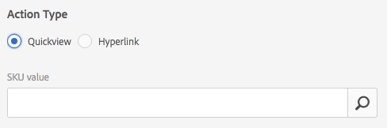

# Trabalhar com seletores no Dynamic Media {#working-with-selectors}

Ao trabalhar com uma Imagem interativa, Vídeo interativo ou Banner de carrossel, você seleciona ativos e seleciona sites e produtos para pontos de acesso e mapas de imagem para os quais vincular. Ao trabalhar com Conjuntos de imagens, Conjuntos de rotação e Conjuntos de multimídia, você também seleciona ativos com o Seletor de ativo.

Este tópico aborda como usar os seletores Produto, Site e Ativo, incluindo a capacidade de navegar, filtrar e classificar dentro dos seletores.

Você acessa os seletores ao criar conjuntos de carrossel, adicionar pontos de acesso e mapas de imagem, criar vídeos e imagens interativas.

Por exemplo, neste Banner de carrossel, você usa o seletor de Produto se estiver vinculando um ponto de acesso ou mapa de imagem a uma página de exibição rápida. Use o seletor de site se estiver vinculando um ponto de acesso ou mapa de imagem a um hiperlink; use o seletor de Ativos ao criar um slide.

Ao selecionar (em vez de inserir manualmente) para onde os pontos de acesso ou mapas de imagem são direcionados, você está usando o seletor. O seletor de site só funcionará se você for um cliente [!DNL Adobe Experience Manager Sites]. O seletor de produto também requer [!DNL Experience Manager Commerce].

## Seleção de produtos no Dynamic Media {#selecting-products}

Use o seletor de produto para escolher um produto quando quiser um ponto de acesso ou mapa de imagem para fornecer uma exibição rápida para um produto específico em seu catálogo de produtos.

1. Navegue até o Conjunto de carrosséis, Imagem interativa ou Vídeo interativo e toque na guia **[!UICONTROL Ações]** (disponível somente se tiver definido um ponto de acesso ou mapa de imagem).

   O seletor de Produto está na área **[!UICONTROL Tipo de Ação]**.

   

1. Toque no ícone **[!UICONTROL Seletor de produto]** (lupa) e navegue até um produto no catálogo.

   

   Você pode filtrar por palavra-chave ou tag tocando em **[!UICONTROL Filtro]** e inserindo palavras-chave, ou selecionando tags, ou ambos.

   

   Você pode alterar o local em que [!DNL Experience Manager] procura dados do produto ao tocar em **[!UICONTROL Procurar]** e navegar para outra pasta.

   

   Toque em **[!UICONTROL Classificar por]** para alterar se [!DNL Experience Manager] classifica por mais recente ou mais antiga a mais recente.

   

   Toque em **[!UICONTROL Visualizar como]** para alterar a exibição de produtos - **[!UICONTROL Exibição em lista]** ou **[!UICONTROL Exibição de cartão]**.

   

1. Após a seleção do produto, o campo é preenchido com a miniatura e o nome do produto.

   

1. Quando estiver no modo **[!UICONTROL Visualização]**, você pode tocar no ponto de acesso ou no mapa de imagem e ver como a Visualização rápida aparece.

   

## Seleção de sites no Dynamic Media {#selecting-sites}

Use o seletor de site para escolher uma página da Web quando quiser que um ponto de acesso ou mapa de imagem vincule a uma página da Web gerenciada em [!DNL Experience Manager] sites.

1. Navegue até o Conjunto de carrosséis, Imagem interativa ou Vídeo interativo e toque na guia **[!UICONTROL Ações]** (disponível somente se tiver definido um ponto de acesso ou mapa de imagem).

   O Seletor de site está na área **[!UICONTROL Tipo de ação]**.

   

1. Toque no ícone do **[!UICONTROL Seletor de sites]** (pasta com lupa) e navegue até uma página no Sites a qual você deseja vincular o ponto de acesso ou mapa de imagem.[!DNL Experience Manager]

   

1. Após a seleção do site, o campo é preenchido com o caminho.

   

1. Quando estiver no modo **[!UICONTROL Visualizar]** se tocar no ponto de acesso ou mapa de imagem, você navegará até a página do site [!DNL Experience Manager] especificada.

## Seleção de ativos no Dynamic Media {#selecting-assets}

Use este seletor para escolher imagens para usar em um Banner de carrossel, um Vídeo interativo, conjuntos de imagens, conjuntos de mídia mista e conjuntos de rotação. Em Vídeo interativo, o seletor de ativos fica disponível ao tocar em **[!UICONTROL Selecionar ativos]** na guia **[!UICONTROL Conteúdo]**. Em Conjuntos de carrossel, o seletor de ativos fica disponível ao criar um slide. Em Conjuntos de imagens, Conjuntos de mídias mistas e Conjuntos de rotação, o seletor de ativo estará disponível ao criar um Conjunto de imagens, Conjunto de mídias mistas ou Conjunto de rotação, respectivamente.

Consulte também [Seletor de ativos](/help/assets/search-assets.md#asset-selector) para obter mais informações.

1. Navegue até o Conjunto de carrossel e crie um slide. Ou navegue até o Vídeo interativo, vá até a guia **[!UICONTROL Conteúdo]** e selecione ativos. Ou crie um Conjunto de mídias mistas, um Conjunto de imagens ou um Conjunto de rotação.
1. Toque no ícone **[!UICONTROL Seletor de ativos]** (pasta com uma lupa) e navegue até um ativo.

   

   Filtre por palavra-chave ou tag tocando em **[!UICONTROL Filtro]** e inserindo palavras-chave, ou adicionando critérios, ou ambos.

   

   Você pode alterar o local em que [!DNL Experience Manager] procura ativos navegando até outra pasta no campo **[!UICONTROL Caminho]**.

   Toque em **[!UICONTROL Coleção]** para pesquisar apenas ativos nas coleções.

   

   Toque em **[!UICONTROL Visualizar como]** para alterar a exibição de produtos - **[!UICONTROL Exibição em lista]**, **[!UICONTROL Exibição em coluna]** ou **[!UICONTROL Exibição de cartão]**.

   

1. Para selecionar o ativo, toque na marca de seleção. O ativo é exibido.

   
 —>
