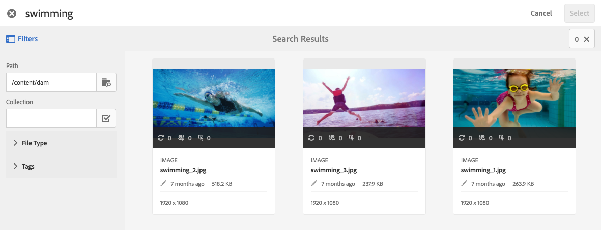

# Trabalhar com seletores no Dynamic Media {#working-with-selectors}

Ao trabalhar com uma Imagem interativa, Vídeo interativo ou Banner do carrossel, você seleciona ativos e seleciona sites e produtos para hotspots e mapas de imagem para serem vinculados. Ao trabalhar com Conjuntos de imagens, Conjuntos de rotação e Conjuntos de multimídia, você também seleciona ativos com o Seletor de ativos.

Este tópico aborda como usar os seletores de Produto, Site e Ativo, incluindo a capacidade de navegar, filtrar e classificar nos seletores.

Você acessa os seletores enquanto cria conjuntos de carrossel, adiciona pontos de acesso e mapas de imagem, criando vídeos e imagens interativos.

Por exemplo, neste banner de carrossel, você usa o seletor de produto se estiver vinculando um ponto de acesso ou mapa de imagem a uma página de visualização rápida. Use o seletor de sites se estiver vinculando um ponto de acesso ou mapa de imagem a um hiperlink; use o seletor de ativos ao criar um slide.

Ao selecionar (em vez de inserir manualmente) para onde os pontos de acesso ou mapas de imagem são direcionados, você está usando o seletor. O Seletor de sites só funciona se você for um cliente do [!DNL Adobe Experience Manager Sites]. O seletor de produtos também requer [!DNL Experience Manager Commerce].

## Selecionar produtos no Dynamic Media {#selecting-products}

Use o seletor de produtos para escolher um produto quando quiser um ponto de acesso ou mapa de imagem que forneça uma exibição rápida para um produto específico em seu catálogo de produtos.

1. Navegue até o Conjunto de carrosséis, Imagem interativa ou Vídeo interativo e selecione a guia **[!UICONTROL Ações]** (disponível somente se tiver definido um ponto de acesso ou mapa de imagem).

   O seletor de Produto está na área **[!UICONTROL Tipo de Ação]**.

   

1. Selecione o ícone (lupa) do **[!UICONTROL Seletor de Produto]** e navegue até um produto no catálogo.

   

   Você pode filtrar por palavra-chave ou marca tocando em **[!UICONTROL Filtrar]** e inserindo palavras-chave, selecionando marcas ou ambos.

   

   Você pode alterar o local em que [!DNL Experience Manager] procura dados de produto tocando em **[!UICONTROL Procurar]** e navegando para outra pasta.

   

   Selecione **[!UICONTROL Classificar por]** para alterar se [!DNL Experience Manager] classifica do mais novo para o mais antigo ou do mais antigo para o mais recente.

   

   Selecione **[!UICONTROL Exibir como]** para alterar a exibição de produtos - **[!UICONTROL Exibição em Lista]** ou **[!UICONTROL Exibição de Cartão]**.

   

1. Depois que o produto é selecionado, o campo é preenchido com o nome e a miniatura do produto.

   

1. No modo de **[!UICONTROL Visualização]**, é possível selecionar o ponto de acesso ou mapa de imagem e ver como a exibição rápida é exibida.

   

## Selecionar sites no Dynamic Media {#selecting-sites}

Use o seletor de sites para escolher uma página da Web quando quiser que um ponto de acesso ou mapa de imagem seja vinculado a uma página da Web gerenciada em [!DNL Experience Manager] sites.

1. Navegue até o Conjunto de carrosséis, Imagem interativa ou Vídeo interativo e selecione a guia **[!UICONTROL Ações]** (disponível somente se tiver definido um ponto de acesso ou mapa de imagem).

   O Seletor de site está na área **[!UICONTROL Tipo de ação]**.

   

1. Selecione o ícone do **[!UICONTROL Seletor de sites]** (pasta com lupa) e navegue até uma página em seus sites do [!DNL Experience Manager] para a qual você deseja vincular o ponto de acesso ou mapa de imagem.

   

1. Depois que o site é selecionado, o campo é preenchido com o caminho.

   

1. Se você selecionar o ponto de acesso ou o mapa de imagem no modo **[!UICONTROL Visualização]**, navegue até a página do site [!DNL Experience Manager] especificada.

## Selecionar ativos no Dynamic Media {#selecting-assets}

Use esse seletor para escolher imagens para usar em um banner de carrossel, um vídeo interativo, conjuntos de imagens, conjuntos de mídia mista e conjuntos de rotação. No Vídeo interativo, o seletor de ativos está disponível ao selecionar **[!UICONTROL Selecionar Assets]** na guia **[!UICONTROL Conteúdo]**. Em Conjuntos de carrossel, o seletor de ativos está disponível ao criar um slide. Em Conjuntos de imagens, Conjuntos de mídias mistas e Conjuntos de rotação, o seletor de ativos fica disponível ao criar um Conjunto de imagens, Conjunto de mídias mistas ou Conjunto de rotação, respectivamente.

Consulte também [Seletor de ativos](/help/assets/search-assets.md#asset-selector) para obter mais informações.

1. Navegue até o Conjunto de carrosséis e crie um slide. Ou navegue até o Vídeo interativo, acesse a guia **[!UICONTROL Conteúdo]** e selecione ativos. Ou crie um Conjunto de mídia mista, Conjunto de imagens ou Conjunto de rotação.
1. Selecione o ícone **[!UICONTROL Seletor de ativos]** (pasta com lupa) e navegue até um ativo.

   

   Filtre por palavra-chave ou marca tocando em **[!UICONTROL Filtrar]** e inserindo palavras-chave, adicionando critérios ou ambos.

   

   Você pode alterar onde [!DNL Experience Manager] procura ativos navegando para outra pasta no campo **[!UICONTROL Caminho]**.

   Selecione **[!UICONTROL Coleção]** para pesquisar apenas por ativos dentro de coleções.

   

   Selecione **[!UICONTROL Exibir como]** para alterar a exibição de produtos - **[!UICONTROL Exibição em Lista]**, **[!UICONTROL Exibição em Coluna]** ou **[!UICONTROL Exibição de Cartão]**.

   

1. Para selecionar o ativo, marque a marca de seleção. O ativo é exibido.

   
—>
