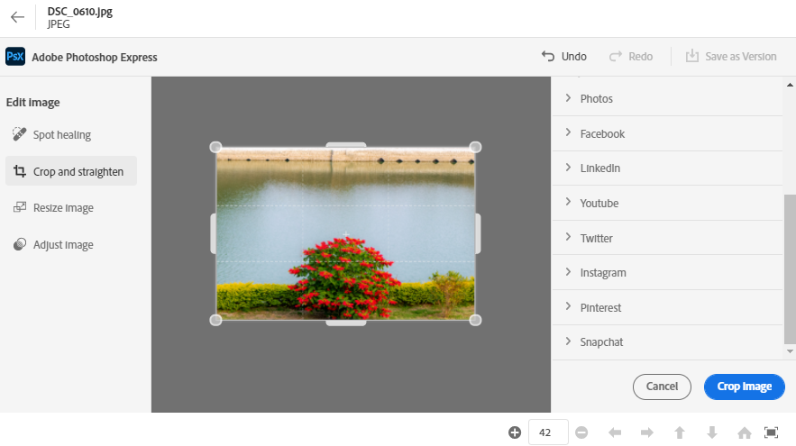

# Editar imagens no [!DNL Assets view] {#edit-images}

[!DNL Assets view] O fornece opções de edição intuitivas viabilizadas pelo [!DNL Adobe Express] e [!DNL Adobe Photoshop Express]. As ações de edição disponíveis usando [!DNL Adobe Express] são Redimensionar imagem, Remover plano de fundo, Cortar imagem e Converter JPEG em PNG.

Após editar uma imagem, você pode salvar a nova imagem como uma nova versão. O controle de versão ajuda você a reverter para o ativo original posteriormente, se necessário. Para editar uma imagem, [abrir sua visualização](/help/assets/navigate-assets-view.md) e clique em **[!UICONTROL Editar imagem]**.

>[!NOTE]
>
>É possível editar imagens de tipos de arquivos PNG e JPEG usando [!DNL Adobe Express].

<!--The editing actions that are available are Spot healing, Crop and straighten, Resize image, and Adjust image.-->

## Editar imagens usando o Adobe Express {#edit-using-express}

>[!CONTEXTUALHELP]
>id="assets_express_integration"
>title="Integração do Adobe Express"
>abstract="Ferramentas de edição de imagens fáceis e intuitivas, viabilizadas pelo Adobe Express, disponíveis diretamente no AEM Assets para aumentar a reutilização de conteúdo e acelerar a velocidade do conteúdo."

### Redimensionar imagem {#resize-image-using-express}

Redimensionar uma imagem para um tamanho específico é um caso de uso comum. O [!DNL Assets view] permite redimensionar rapidamente a imagem para ajustá-la aos tamanhos de foto comuns, fornecendo novas resoluções pré-calculadas para tamanhos de foto específicos. Para redimensionar a imagem usando [!DNL Assets view], siga as etapas abaixo:

1. Selecione uma imagem e clique em **Editar**.
2. Clique em **[!DNL Resize Image]** nas ações rápidas disponíveis no painel esquerdo.
3. Selecione a plataforma de mídia social apropriada na **[!UICONTROL Redimensionar para]** e selecione o tamanho da imagem nas opções exibidas.
4. Dimensione a imagem, se necessário, usando o **[!UICONTROL Escala de imagem]** campo.
5. Clique em **[!DNL Apply]** para aplicar as alterações.
   

   A imagem editada está disponível para download. Você pode salvar o ativo editado como uma nova versão do mesmo ativo ou salvá-lo como um novo ativo.
   

### Remover plano de fundo {#remove-background-using-express}

Você pode remover o plano de fundo de uma imagem em algumas etapas simples, como mencionado abaixo:

1. Selecione uma imagem e clique em **Editar**.
2. Clique em **[!DNL Remove Background]** nas ações rápidas disponíveis no painel esquerdo. O Experience Manager Assets exibe a imagem sem plano de fundo.
3. Clique em **[!DNL Apply]** para aplicar as alterações.
   

   A imagem editada está disponível para download. Você pode salvar o ativo editado como uma nova versão do mesmo ativo ou salvá-lo como um novo ativo.

### Cortar imagem {#crop-image-using-express}

Transformar uma imagem em um tamanho perfeito é fácil usando incorporado [!DNL Adobe Express] ações rápidas.

1. Selecione uma imagem e clique em **Editar**.
2. Clique em **[!DNL Crop Image]** nas ações rápidas disponíveis no painel esquerdo.
3. Arraste as alças nos cantos da imagem para criar o corte desejado.
4. Clique em **[!DNL Apply]**.
   
A imagem cortada está disponível para download. Você pode salvar o ativo editado como uma nova versão do mesmo ativo ou salvá-lo como um novo ativo.

### Converter JPEG em PNG {#convert-jpeg-to-png-using-express}

Você pode converter rapidamente uma imagem de JPEG em um formato PNG usando Adobe Express. Execute as seguintes etapas:

1. Selecione uma imagem e clique em **Editar**.
2. Clique em **[!DNL JPEG to PNG]** nas ações rápidas disponíveis no painel esquerdo.
   
3. Clique em **[!UICONTROL Baixar]**.

### Limitações {#limitations-adobe-express}

* Resolução de imagem suportada: Mínimo - 50 pixels, Máximo - 6000 pixels por dimensão

* Tamanho máximo de arquivo aceito: 17 MB

## Editar imagens usando [!DNL Adobe Photoshop Express] {#edit-using-photoshop-express}

<!--
After editing an image, you can save the new image as a new version. Versioning helps you to revert to the original asset later, if needed. To edit an image, [open its preview](//help/navigate-assets-view.md#preview-assets) and click **[!UICONTROL Edit Image]**  from the rail on the right.

*Figure: The options to edit images are powered by [!DNL Adobe Photoshop Express].*
-->

### Reparar imagens com manchas {#spot-heal-images-using-photoshop-express}

Se houver pequenas manchas ou pequenos objetos em uma imagem, você poderá editar e removê-los usando o recurso de reparo de manchas fornecido pelo Adobe Photoshop.

O pincel seleciona a área retocada e faz com que os pixels reparados se misturem perfeitamente no restante da imagem. Use um tamanho de pincel um pouco maior que o ponto que deseja corrigir.

<!-- 
TBD: See if we should give backlinks to PS docs for these concepts.
For more information about how Spot Healing works in Photoshop, see [retouching and repairing photos](https://helpx.adobe.com/photoshop/using/retouching-repairing-images.html). 
-->

### Recortar e endireitar imagens {#crop-straighten-images-using-photoshop-express}

Usando a opção cortar e endireitar, você pode fazer cortes básicos, girar a imagem, invertê-la na horizontal ou vertical e recortá-la em dimensões adequadas para sites de redes sociais populares.

Para salvar suas edições, clique em **[!UICONTROL Cortar imagem]**. Após a edição, você pode salvar a nova imagem como uma versão.

Muitas opções padrão permitem que você corte a imagem nas melhores proporções que se ajustam a vários perfis e publicações de redes sociais.

### Redimensionar imagem {#resize-image-using-photoshop-express}

Você pode visualizar os tamanhos comuns de fotos em centímetros ou polegadas para conhecer as dimensões. Por padrão, o método de redimensionamento mantém a proporção. Para substituir manualmente a taxa de proporção, clique em .

Insira as dimensões e clique em **[!UICONTROL Redimensionar imagem]** para redimensionar a imagem. Antes de salvar as alterações como uma versão, você pode desfazer todas as alterações feitas antes de salvar clicando em [!UICONTROL Desfazer] ou alterar a etapa específica do processo de edição clicando em [!UICONTROL Reverter].

### Ajustar imagem {#adjust-image-using-photoshop-express}

O [!DNL Assets view] permite ajustar a cor, o tom, o contraste e muito mais, com apenas alguns cliques. Clique em **[!UICONTROL Ajustar imagem]** na janela de edição. As seguintes opções estão disponíveis na barra lateral direita:

* **Popular**: [!UICONTROL Alto contraste e detalhe], [!UICONTROL Contraste dessaturado], [!UICONTROL Foto envelhecida], [!UICONTROL P&amp;B Suave] e [!UICONTROL P&amp;B em tom sépia].
* **Cor**: [!UICONTROL Natural], [!UICONTROL Claro], [!UICONTROL Alto contraste], [!UICONTROL Alto contraste e detalhe], [!UICONTROL Vívido] e [!UICONTROL Fosco].
* **Criativa**: [!UICONTROL Contraste dessaturado], [!UICONTROL Luz fria], [!UICONTROL Turquesa e vermelho], [!UICONTROL Névoa suave], [!UICONTROL Instantâneo vintage], [!UICONTROL Contraste quente], [!UICONTROL Plano e Verde], [!UICONTROL Aumento vermelho fosco], [!UICONTROL Sombras quentes] e [!UICONTROL Foto envelhecida].
* **P&amp;B**: [!UICONTROL Paisagem P&amp;B], [!UICONTROL P&amp;B de alto contraste], [!UICONTROL P&amp;B Forte], [!UICONTROL P&amp;B de baixo contraste], [!UICONTROL P&amp;B plano], [!UICONTROL P&amp;B suave], [!UICONTROL P&amp;B infravermelho], [!UICONTROL P&amp;B em tom selênio], [!UICONTROL P&amp;B em tom sépia] e [!UICONTROL P&amp;B em tom dividido].
* **Vinhetas**: [!UICONTROL Nenhum], [!UICONTROL Leve], [!UICONTROL Médio] e [!UICONTROL Pesado].

<!--
TBD: Insert a video of the available social media options.
-->

### Próximas etapas {#next-steps}

* Forneça feedback sobre o produto usando a opção [!UICONTROL Feedback] disponível na interface de visualização do Assets

* Forneça feedback sobre a documentação usando as opções [!UICONTROL Editar esta página]  ou [!UICONTROL Registrar um problema]  disponíveis na barra lateral direita

* Entre em contato com o [Atendimento ao cliente](https://experienceleague.adobe.com/?support-solution=General&amp;lang=pt-BR#support)

>[!MORELIKETHIS]
>
>* [Exibir o histórico de versões de um ativo](/help/assets/navigate-assets-view.md)
