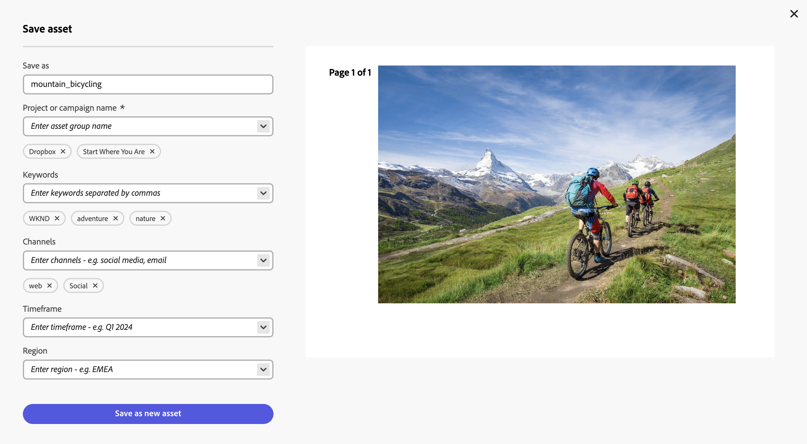

# Editar imagens no Content Hub {#edit-images-content-hub}

O Content Hub permite criar novo conteúdo com o Adobe Express. Você pode editar o conteúdo existente com ferramentas fáceis de usar, produzir variações na marca com modelos e elementos da marca e criar novo conteúdo com os recursos mais recentes da GenAI da Adobe Firefly.

>[!VIDEO](https://video.tv.adobe.com/v/3435003/?learn=on){transcript=true}

## Pré-requisitos {#prereqs-edit-image-content-hub}

Direitos de acesso ao Adobe Express e [usuários do Content Hub com direitos de remixar ativos para novas variações](/help/assets/deploy-content-hub.md#onboard-content-hub-users-remix-assets) podem editar imagens usando o Content Hub.

>[!NOTE]
>
>Você pode editar imagens de tipos de arquivos PNG e JPG/JPEG usando o [!DNL Adobe Express].

## Edição de imagens usando o [!DNL Adobe Express] {#edit-images-using-content-hub}

Para editar imagens usando o Content Hub:

1. Clique em **[!DNL Open in Adobe Express]**, disponível no cartão de ativos da imagem que você precisa editar. Como alternativa, clique na imagem para abrir seus detalhes e clique no logotipo [!DNL Adobe Express]. O editor incorporado do Adobe Express é carregado sem sair do Content Hub.

   Você pode aproveitar a funcionalidade [!DNL Adobe Express] para executar todas as ações relacionadas à edição de imagens, como [redimensionar imagem](https://helpx.adobe.com/express/using/resize-image.html), [remover ou alterar a cor de fundo](https://helpx.adobe.com/express/using/remove-background.html), [recortar imagem](https://helpx.adobe.com/express/using/crop-image.html), combinar a imagem com a imagem ou o texto gerado pela IA e muito mais.

1. Faça as modificações e clique em **[!UICONTROL Salvar]** para salvar o ativo editado em um dos tipos de formato:

   * **[!UICONTROL PNG]** (usado como um formato de imagem de boa qualidade)
   * **[!UICONTROL JPG]** (adequado para arquivos pequenos)
   * **[!UICONTROL PDF]** (adequado para documentos)

   

1. Especifique um nome para o ativo no campo **[!UICONTROL Salvar como]**.

1. Especifique o nome da campanha para seu ativo usando o campo **[!UICONTROL Nome da campanha]**. Você pode usar um nome existente ou criar um novo. À medida que você digita o nome, a Content Hub fornece mais opções. <!--You can define multiple Campaign names for your upload. While you are typing a name, either click anywhere else within the dialog box or press the `,` (Comma) key to register the name.-->

   Como prática recomendada, a Adobe recomenda especificar valores no restante dos campos, bem como criar uma experiência de pesquisa aprimorada para os ativos carregados.

1. [Opcional] Defina valores para os campos **[!UICONTROL Palavras-chave]**, **[!UICONTROL Canais]**, **[!UICONTROL Período]** e **[!UICONTROL Região]**. Marcar e agrupar ativos por palavras-chave, canais e localização permite que todos que usam o conteúdo aprovado da empresa encontrem esses ativos e os mantenham organizados.

1. Clique em **[!UICONTROL Salvar como novo ativo]** para salvar o ativo.

Os administradores também podem configurar os campos obrigatórios e opcionais exibidos ao adicionar ativos ao Content Hub, como nome da campanha, palavras-chave, canais e assim por diante. Para obter mais informações, consulte [Configurar a interface do usuário do Content Hub](configure-content-hub-ui-options.md#configure-upload-options-content-hub).

## Perguntas frequentes {#faqs-edit-images-content-hub}

### Quem pode editar imagens no AEM Assets Content Hub?

Os usuários com direitos para acessar o Adobe Express e o AEM Assets Content Hub, e que têm os direitos de remixar ativos para novas variações, podem editar imagens usando o AEM Assets Content Hub.

### Como editar uma imagem usando o Adobe Express no AEM Assets Content Hub?

Para editar uma imagem no AEM Assets Content Hub, clique em **Abrir no Adobe Express** no cartão de ativos da imagem ou abra os detalhes da imagem e clique no logotipo do Adobe Express. Isso carrega o editor do Adobe Express incorporado no AEM Assets Content Hub, permitindo que você faça suas edições sem sair da plataforma.

### Quais recursos de edição o Adobe Express oferece no AEM Assets Content Hub?

O Adobe Express oferece vários recursos de edição de imagens no AEM Assets Content Hub, incluindo redimensionamento de imagens, remoção ou alteração da cor do plano de fundo, recorte de imagens e combinação com imagens ou texto gerados por IA, entre outros recursos.

### Como posso salvar minhas imagens editadas em quais formatos de arquivo no AEM Assets Content Hub?

Você pode salvar as imagens editadas nos formatos PNG (boa qualidade), JPG (adequado para arquivos pequenos) ou PDF (adequado para documentos) no AEM Assets Content Hub.

### Quais campos devo preencher ao salvar uma imagem editada no AEM Assets Content Hub?

Ao salvar uma imagem editada no AEM Assets Content Hub, especifique um nome para o ativo no campo **Salvar como** e um nome de campanha no campo **Nome da campanha**. A Adobe também recomenda especificar valores em campos adicionais, como Palavras-chave, Canais, Cronograma e Região, para melhorar a capacidade de pesquisa e a organização.

### É possível salvar minhas edições como um novo ativo no AEM Assets Content Hub?

Sim, após a edição, você pode clicar em **Salvar como novo ativo** para salvar suas alterações como um novo ativo no AEM Assets Content Hub.

### Os administradores podem personalizar os campos enquanto fazem upload de ativos para o AEM Assets Content Hub?

Sim, os administradores podem configurar quais campos são obrigatórios ou opcionais ao adicionar ativos ao AEM Assets Content Hub, como nome da campanha, palavras-chave e canais, para atender às necessidades organizacionais. Use a guia **Importar** da interface do usuário de Configuração para configurar os campos.

