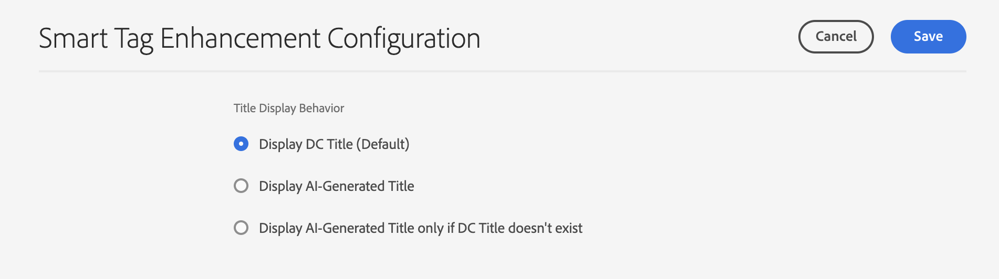

# Aprimoramento da descoberta de conteúdo com metadados gerados por IA {#ai-smart-tags}

| IUs | Link do artigo |
| -------- | ---------------------------- |
| Visualização do Assets | [Clique aqui](/help/assets/ai-generated-metadata-assets-view.md) |
| Exibição do administrador | Este artigo |

Em vez de depender da entrada manual, a IA atribui tags descritivas automaticamente a ativos digitais. Essas tags geradas por IA melhoram a qualidade dos metadados, tornando os ativos mais fáceis de pesquisar, categorizar e recomendar. Essa abordagem não só aumenta a eficiência eliminando a marcação manual, mas também garante a consistência e a escalabilidade em grandes volumes de conteúdo digital. Por exemplo, se o ativo for uma imagem, a IA pode identificar objetos, cenas, emoções ou até mesmo logotipos de marca nele e gerar tags relevantes, como &quot;pôr do sol&quot;, &quot;praia&quot;, &quot;férias&quot; ou &quot;sorrir&quot;. O conteúdo gerado por IA pode aprimorar a pesquisa de ativos aproveitando técnicas de pesquisa semântica e léxica. Veja mais [Pesquisar Assets](search-assets.md). <!--If the asset is a document, AI reads and interprets the text to assign meaningful keywords that summarize its content—such as "climate change," "policy," or "renewable energy.-->

## Como ativar metadados gerados por IA? {#enable-ai-generated-metadata}

Para ativar os metadados gerados por IA:

* A versão mínima necessária do AEM é `20626`.

* Você deve assinar um contrato GenAI Rider. Para obter mais informações, entre em contato com o representante da Adobe.

## Configurar títulos gerados por IA {#configure-ai-generated-titles}

O AEM permite configurar a exibição de títulos de ativos na exibição Cartão ou na exibição em Lista na página Navegar pelos ativos. Você pode optar por exibir o título do ativo definido por você, o título gerado usando IA ou usar o título gerado por IA somente se não houver um título existente para o ativo.

Para configurar títulos gerados por IA:

1. Navegue até **[!UICONTROL Ferramentas > Assets > Configuração do Assets > Configuração do Smart Tag Enhancement]**.

1. Selecione uma das seguintes opções:

   * **Exibir Título de Controlador de Domínio (Padrão)**: especifique o título no campo **[!UICONTROL Título]**, disponível nas propriedades do ativo, para exibi-lo na exibição Cartão ou na exibição em Lista. Se o título do ativo não estiver definido, o AEM Assets exibirá o nome do arquivo.

   * **Exibir título gerado pela IA**: exibe o título gerado pela IA e ignora o título especificado nas propriedades do ativo. Se o título gerado pela IA não estiver disponível para um ativo, o AEM Assets exibirá o título do ativo padrão disponível em suas propriedades.

   * **Exibir o título gerado pela IA somente se o título do controlador de domínio não existir**: o AEM Assets exibe o título gerado pela IA somente se o título do ativo não estiver definido para um ativo.

     

## Uso de metadados gerados por IA {#using-ai-generated-smart-tags}

<!--[!NOTE]
>
>The enhanced smart tags capability is available only for the newly uploaded assets.
-->

Para usar o recurso aprimorado de tags inteligentes, execute as seguintes etapas:

1. Na interface [!DNL Experience Manager], vá para a pasta desejada e clique em **[!UICONTROL Adicionar Assets]**. <!--Alternatively, to update enhanced smart tags in an existing content, click **[!UICONTROL reprocess]**.--> Os formatos de arquivo de imagem compatíveis são `png`, `jpg`, `jpeg`,`psd`, `tiff`, `gif`, `webp`, `crw`, `cr2`, `3fr`, `nef`, `arw` e `bmp`.

1. Espere até que o ativo recém-carregado seja processado. Depois de concluído, vá para as propriedades do ativo.

1. Vá para a guia **[!UICONTROL Gerado por IA]**. Se a versão [!DNL Experience Manager] for incompatível ou não for atualizada, essa guia não estará visível. Os seguintes campos estão lá:

   * **[!UICONTROL Título gerado]:** o título fornece um título claro e conciso que captura a ideia principal de um ativo carregado, facilitando sua compreensão rápida. Ao adicionar um ativo, se você fornecer um título (em `dc:title`), ele será exibido na exibição de navegação dos ativos. Se deixado em branco, um título gerado pela IA será atribuído automaticamente.
   * **[!UICONTROL Descrição gerada]:** A descrição fornece um resumo breve, mas informativo, sobre o que o ativo trata, ajudando os usuários e o módulo de pesquisa a compreender rapidamente sua relevância.
   * **[!UICONTROL Palavras-chave geradas]:** são termos direcionados que representam os principais temas de um ativo, auxiliando na marcação e filtragem de conteúdo.

1. [Opcional] Você pode adicionar outras marcas ou criar as suas próprias se achar que estão faltando marcas relevantes. Para fazer isso, escreva suas marcas no campo **[!UICONTROL Palavras-chave geradas]** e clique em **[!UICONTROL Salvar]**.

## Desativar metadados gerados por IA {#disable-ai-generated-metadata}

Você pode desativar os metadados gerados por IA no nível da pasta. Todas as pastas derivadas herdam as propriedades da pasta principal.

Para desativar os metadados gerados por IA no nível da pasta:

1. Navegue até **[!UICONTROL Adobe Experience Manager > Assets > Arquivos]**.

1. Selecione a pasta e clique em **[!UICONTROL Propriedades]**.

1. Na guia **[!UICONTROL Processamento de ativos]**, navegue até a pasta **[!UICONTROL Melhorias de tags inteligentes para imagens]**. Selecione um dos seguintes valores na lista suspensa:

   * Herdada - A pasta herda as opções ativar ou desativar da pasta principal.

   * Habilitar - Habilita os metadados gerados por IA para a pasta selecionada.

   * Desativar - Desativa os metadados gerados por IA para a pasta selecionada.

     