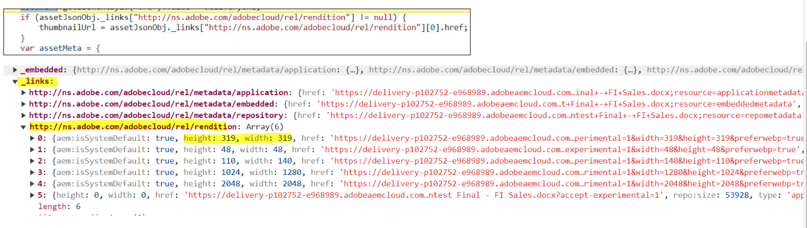

# Integração do Dynamic Media com recursos OpenAPI {#integrate-asset-selector-dynamic-media-open-apis}

O Seletor de ativos permite a integração usando vários aplicativos da Adobe para que eles trabalhem em conjunto de maneira contínua.

## Pré-requisitos {#prereqs-polaris}

Use os seguintes pré-requisitos se estiver integrando o Seletor de ativos ao Dynamic Media com recursos OpenAPI:

* [Métodos de comunicação](/help/assets/overview-asset-selector.md#prereqs)
* Para acessar o Dynamic Media com recursos OpenAPI, você deve ter licenças para:
   * Repositório do Assets (por exemplo, Experience Manager Assets as a Cloud Service).
   * AEM Dynamic Media.
* Somente [ativos aprovados](/help/assets/approve-assets.md) estão disponíveis para uso, garantindo a consistência da marca.

## Integração do Dynamic Media com recursos OpenAPI {#adobe-app-integration-polaris}

A integração do Seletor de ativos com o processo OpenAPI do Dynamic Media envolve várias etapas que incluem a criação de um URL de mídia dinâmica personalizado ou pronto para escolher o URL de mídia dinâmica etc.

### Integrar o Seletor de ativos para Dynamic Media aos recursos da OpenAPI {#integrate-dynamic-media}

As propriedades `rootPath` e `path` não devem fazer parte do Dynamic Media com recursos OpenAPI. Em vez disso, você pode configurar a propriedade `aemTierType`. Veja a seguir a sintaxe da configuração:

```
aemTierType:[1: "delivery"]
```

Essa configuração permite visualizar todos os ativos aprovados sem pastas ou como uma estrutura simples. Para obter mais informações, navegue até a propriedade `aemTierType` em [Propriedades do Seletor de ativos](/help/assets/asset-selector-properties.md).


### Criar um URL de entrega dinâmico a partir de ativos aprovados {#create-dynamic-media-url}

Depois de configurar o Seletor de ativos, um esquema de objetos será usado para criar um URL de entrega dinâmico dos ativos selecionados.
Por exemplo, um esquema de um objeto de uma matriz de objetos que é recebido após a seleção de um ativo:

```
{
"dc:format": "image/jpeg",
"repo:assetId": "urn:aaid:aem:xxxxxxxx-xxxx-xxxx-xxxx-xxxxxxxxxxxx",
"repo:name": "image-7.jpg",
"repo:repositoryId": "delivery-pxxxx-exxxxxx.adobe.com",
...
}
```

Todos os ativos selecionados são carregados pela função `handleSelection` que atua como um objeto JSON. Por exemplo, `JsonObj`. O URL dinâmico de entrega é criado pela combinação das seguintes operadoras:

| Objeto | JSON |
|---|---|
| Host | `assetJsonObj["repo:repositoryId"]` |
| Raiz da API | `/adobe/assets` |
| asset-id | `assetJsonObj["repo:assetId"]` |
| seo-name | `assetJsonObj["repo:name"].split(".").slice(0,-1).join(".")` |
| formato | `.jpg` |

#### Especificação da API de entrega de ativos aprovada {#approved-assets-delivery-api-specification}

Formato de URL:
`https://<delivery-api-host>/adobe/assets/<asset-id>/as/<seo-name>.<format>?<image-modification-query-parameters>`

Onde,

* O host é `https://delivery-pxxxxx-exxxxxx.adobe.com`
* A raiz da API é `"/adobe/assets"`
* `<asset-id>` é o identificador do ativo
* `as` é a parte constante da especificação da API aberta indicando como o ativo deve ser referido
* `<seo-name>` é o nome de um ativo
* `<format>` é o formato de saída
* `<image modification query parameters>` conforme suportado pela especificação da API de entrega dos ativos aprovados

#### API de entrega de representação original de ativos aprovados {#approved-assets-delivery-api}

O URL do delivery dinâmico possui a seguinte sintaxe:
`https://<delivery-api-host>/adobe/assets/<asset-id>/original/as/<seo-name>`, onde,

* O host é `https://delivery-pxxxxx-exxxxxx.adobe.com`
* A raiz da API para Entrega de Representação Original é `"/adobe/assets"`
* `<asset-id>` é um identificador de ativo
* `/original/as` é a parte constante da especificação de API aberta indicando como a representação original deve ser chamada
* `<seo-name>`é o nome do ativo que pode ou não ter uma extensão

### Pronto para escolher o URL de entrega dinâmico {#ready-to-pick-dynamic-delivery-url}

Todos os ativos selecionados são carregados pela função `handleSelection` que atua como um objeto JSON. Por exemplo, `JsonObj`. O URL dinâmico de entrega é criado pela combinação das seguintes operadoras:

| Objeto | JSON |
|---|---|
| Host | `assetJsonObj["repo:repositoryId"]` |
| Raiz da API | `/adobe/assets` |
| asset-id | `assetJsonObj["repo:assetId"]` |
| seo-name | `assetJsonObj["repo:name"]` |

Abaixo estão duas maneiras de percorrer o objeto JSON:



* **Miniatura:** Miniaturas podem ser imagens e ativos são PDF, vídeo, imagens e assim por diante. Embora, você possa usar os atributos de altura e largura da miniatura de um ativo como a representação dinâmica da entrega.
O seguinte conjunto de representações pode ser usado para os ativos do tipo PDF:
Depois que um pdf é selecionado no sidekick, o contexto de seleção oferece as informações abaixo. Abaixo está a maneira de percorrer o objeto JSON:

  <!---->

  Consulte `selection[0].....selection[4]` para obter a matriz de link de representação na captura de tela acima. Por exemplo, as principais propriedades de uma das representações de miniatura incluem:

  ```
  { 
      "height": 319, 
      "width": 319, 
      "href": "https://delivery-pxxxxx-exxxxx.adobeaemcloud.com/adobe/assets/urn:aaid:aem:8560f3a1-d9cf-429d-a8b8-d81084a42d41/as/algorithm design.jpg?width=319&height=319", 
      "type": "image/webp" 
  } 
  ```

Na captura de tela acima, o URL de entrega da representação original do PDF precisará ser incorporado à experiência do Target, se o PDF for necessário, e não sua miniatura. Por exemplo, `https://delivery-pxxxxx-exxxxx.adobeaemcloud.com/adobe/assets/urn:aaid:aem:8560f3a1-d9cf-429d-a8b8-d81084a42d41/original/as/algorithm design.pdf`

* **Vídeo:** Você pode usar a URL do player de vídeo para os ativos do tipo vídeo que usam um iFrame inserido. Você pode usar as seguintes representações de matriz na experiência do target:
  <!---->

  ```
  { 
      "height": 319, 
      "width": 319, 
      "href": "https://delivery-pxxxxx-exxxxx.adobeaemcloud.com/adobe/assets/urn:aaid:aem:2fdef732-a452-45a8-b58b-09df1a5173cd/as/DragDrop.2.jpg?width=319&height=319", 
      "type": "image/webp" 
  } 
  ```

  Consulte `selection[0].....selection[4]` para obter a matriz de link de representação na captura de tela acima. Por exemplo, as principais propriedades de uma das representações de miniatura incluem:

  O trecho de código na captura de tela acima é um exemplo de um ativo de vídeo. Inclui a matriz de links de representações. O `selection[5]` no trecho é o exemplo de miniatura de imagem que pode ser usada como o espaço reservado da miniatura de vídeo na experiência de destino. O `selection[5]` na matriz das representações é para o reprodutor de vídeo. Ele serve uma HTML e pode ser definido como `src` do iframe. Suporta transmissão adaptável de taxa de bits, que é a entrega do vídeo otimizada para a Web.

  No exemplo acima, a URL do reprodutor de vídeo é `https://delivery-pxxxxx-exxxxx.adobeaemcloud.com/adobe/assets/urn:aaid:aem:2fdef732-a452-45a8-b58b-09df1a5173cd/play`

### Configurar filtros personalizados {#configure-custom-filters-dynamic-media-open-api}

O Seletor de ativos do Dynamic Media com recursos OpenAPI permite configurar propriedades personalizadas e filtros com base nelas. A propriedade `filterSchema` é usada para configurar essas propriedades. A personalização pode ser exposta como `metadata.<metadata bucket>.<property name>.` em relação à qual os filtros podem ser configurados, onde,

* `metadata` são as informações de um ativo
* `embedded` é o parâmetro estático usado para configuração e
* `<propertyname>` é o nome do filtro que você está configurando

Para a configuração, as propriedades definidas no nível `jcr:content/metadata/` são expostas como `metadata.<metadata bucket>.<property name>.` para os filtros que você deseja configurar.

Por exemplo, no Seletor de ativos para Dynamic Media com recursos OpenAPI, uma propriedade em `asset jcr:content/metadata/client_name:market` é convertida em `metadata.embedded.client_name:market` para configuração de filtro.

Para obter o nome, é necessário realizar uma atividade única. Faça uma chamada de API de pesquisa para o ativo e obtenha o nome da propriedade (o bucket, essencialmente).

### Interface do usuário do Seletor de ativos para Dynamic Media com recursos OpenAPI {#interface-dynamic-media-open-api}

Após a integração com o Seletor de ativos de microfront-end do Adobe, é possível visualizar a estrutura somente de ativos de todos os ativos aprovados disponíveis no repositório de ativos da Experience Manager.


* **A**: Ocultar/Mostrar painel
* **B**: Assets
* **C**: Classificando
* **D**: Filtros
* **E**: barra de pesquisa
* **F**: Classificando em ordem crescente ou decrescente
* **G**: Cancelar Seleção
* **H**: selecionar um ou vários ativos

>[!NOTE]
>
>As pastas são compatíveis somente ao se conectar ao repositório do autor, e não ao Dynamic Media com o repositório OpenAPI.

>[!MORELIKETHIS]
>
>* [Integrar o Seletor de ativos a vários aplicativos](/help/assets/integrate-asset-selector.md)
>* [Propriedades do Seletor de ativos](/help/assets/asset-selector-properties.md)
>* [Personalizações do Seletor de ativos](/help/assets/asset-selector-customization.md)
