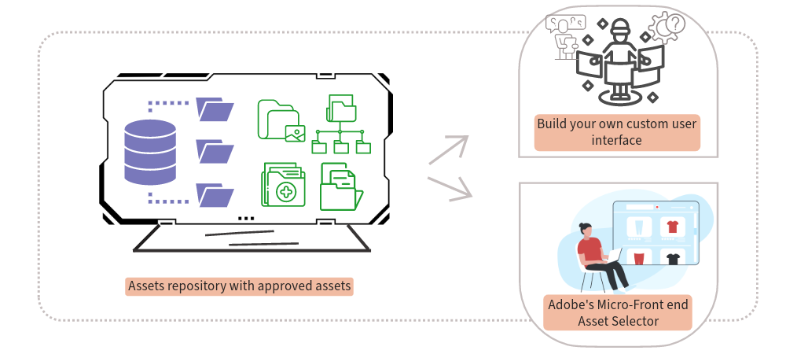

# Integrar o AEM Assets com aplicativos downstream {#integrate-dynamic-media-open-apis}

Todos os [ativos aprovados](/help/assets/approve-assets.md) disponíveis no repositório de ativos da Experience Manager estão disponíveis para entrega em aplicativos downstream.

É possível integrar sua própria interface de usuário personalizada ao repositório do Experience Manager Assets usando as APIs de pesquisa e entrega ou usar o Supervisor de conteúdo da Adobe.

As APIs permitem pesquisar os ativos aprovados no repositório do AEM Assets e, em seguida, entregar os ativos aos aplicativos downstream usando um URL de entrega. Para obter mais informações, consulte as APIs de [Pesquisa](/help/assets/search-assets-api.md) e [Entrega](/help/assets/deliver-assets-apis.md).

O Supervisor de Conteúdo fornece uma interface que se integra facilmente ao repositório do [!DNL Experience Manager Assets as a Cloud Service], para que você possa navegar ou pesquisar ativos digitais aprovados disponíveis no repositório e usá-los na experiência de criação do aplicativo. Para obter mais informações, consulte [Supervisor de Conteúdo](/help/assets/integrate-adobe-non-adobe-applications.md).
