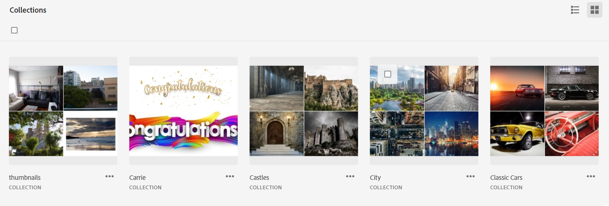
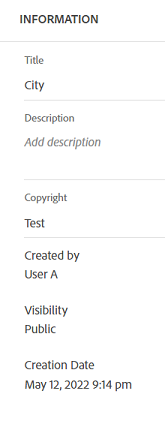

# Gerenciar coleções {#manage-collections}

>[!CONTEXTUALHELP]
>id="assets_collections"
>title="Gerenciar coleções"
>abstract="Uma coleção é um conjunto de ativos, pastas ou outras coleções na visualização Ativos. Use coleções para compartilhar ativos entre usuários. Diferente de pastas, uma coleção pode incluir ativos de locais diferentes. Você pode compartilhar várias coleções com um usuário. Cada coleção contém referências a ativos. A integridade referencial dos ativos é mantida entre as coleções."

Uma coleção é um conjunto de ativos, pastas ou outras coleções na exibição do Adobe Experience Manager Assets. Use coleções para compartilhar ativos entre usuários.

Diferente de pastas, uma coleção pode incluir ativos de locais diferentes.

<!--
You can share collections with various users that are assigned different levels of privileges, including viewing, editing, and so on.
-->

Você pode compartilhar várias coleções com um usuário. Cada coleção contém referências a ativos. A integridade referencial dos ativos é mantida entre as coleções.

Você pode executar as seguintes tarefas para gerenciar e usar coleções:

* [Criar uma coleção](#create-collection)

* [Adicionar ativos a uma coleção](#add-assets-to-collection)

* [Remover ativos de uma coleção](#remove-assets-from-collection)

* [Pesquisar em coleções](#search-collection)

* [Criar uma coleção inteligente](#create-smart-collection)

* [Editar uma coleção inteligente](#edit-smart-collection)

* [Exibir e editar metadados da coleção](#view-edit-collection-metadata)

* [Compartilhar links para coleções](#share-collection-links)

* [Baixar uma coleção](#download-collection)

* [Excluir uma coleção](#delete-collection)

* [Gerenciar permissões para uma coleção privada](#manage-permissions-to-a-private-collection)

## Criar uma coleção {#create-collection}

Para criar uma coleção:

1. Clique em **[!UICONTROL Coleções]** no painel à esquerda, e clique em **[!UICONTROL Criar coleção]**.

1. Especifique um título e uma descrição opcional para a coleção.

1. Selecione se precisar criar uma coleção privada ou uma coleção pública. Uma coleção pública está disponível para visualização e edição a todos os usuários. No entanto, uma coleção privada está disponível para o criador e usuários com privilégios de administrador.

1. Clique em **[!UICONTROL Criar]** para criar a coleção.

<!--
   
   for viewing and editing only to users with the appropriate [permissions](#manage-collection-access).

-->

## Adicionar ativos a uma coleção {#add-assets-to-collection}

Para adicionar ativos a uma coleção:

1. Clique em **[!UICONTROL Ativos]** no painel à esquerda e selecione os ativos que precisam ser adicionados a uma coleção.

1. Clique em **[!UICONTROL Adicionar à coleção]**.

1. Na caixa de diálogos [!UICONTROL Coleções], selecione as coleções às quais adicionar os ativos selecionados.

1. Clique em **[!UICONTROL Adicionar]** para adicionar o ativo às coleções selecionadas.

## Remover ativos de uma coleção {#remove-assets-from-collection}

Para remover ativos de uma coleção:

1. Clique em **[!UICONTROL Coleções]** no painel à esquerda para exibir a lista de coleções.

1. Clique na coleção e selecione os ativos que precisam ser removidos dela.

1. Clique em **[!UICONTROL Remover]**.

## Pesquisar em coleções {#search-collection}

Você pode pesquisar em uma coleção para encontrar facilmente ativos relevantes. Para fazer isso, execute as seguintes etapas:

* Navegue até **[!DNL Collections]**. Na barra de pesquisa, digite uma palavra-chave para localizar a coleção desejada. A barra de pesquisa exibe a localização da coleção selecionada.

* Para refinar os resultados da pesquisa, abra **[!DNL Filters]** e verifique se **[!DNL Collections]** está selecionado em **[!DNL Asset Type]**.

* Na lista suspensa **[!DNL Collection Visibility]**, escolha uma das seguintes opções:

   * **[!DNL All]:** Exibe todas as coleções, independentemente da visibilidade.
   * **[!DNL Public Collection]:** Mostra somente coleções que estão visíveis para todos os usuários.
   * **[!DNL Private Collection]:** Mostra somente coleções que estão restritas ou visíveis para usuários ou grupos específicos.

* Na lista suspensa [!DNL Collection Type], escolha uma das seguintes opções:

   * **[!DNL All]:** Exibe coleções regulares e inteligentes.
   * **[!DNL Collection]:** Mostra as coleções criadas manualmente em que os ativos são adicionados individualmente.
   * **[!DNL Smart Collection]:** Mostra as coleções que incluem automaticamente ativos salvos em [Coleções inteligentes](#manage-smart-collection).

* A lista suspensa **[!DNL Created Date]** permite filtrar coleções com base em quando elas foram criadas. Você pode especificar um intervalo de datas para localizar coleções criadas recentemente ou mais antigas.

  

Para obter mais informações, consulte [pesquisar ativos](search-assets-view.md), [filtrar resultados da pesquisa](search-assets-view.md#refine-search-results) ou [gerenciar pesquisas salvas](search-assets-view.md##saved-search).

## Gerenciar uma coleção inteligente {#manage-smart-collection}

Salve os resultados da pesquisa como uma coleção inteligente para atualizar dinamicamente o conteúdo da coleção. Se houver ativos adicionados ao repositório do Assets View que se encaixem nos critérios de pesquisa definidos na criação da coleção inteligente, o conteúdo da coleção inteligente será atualizado automaticamente ao abri-la.

### Criar uma coleção inteligente {#create-smart-collection}

Para criar uma coleção inteligente:

1. Clique em **[!UICONTROL Filtrar]** e [defina os critérios de pesquisa](search-assets-view.md#refine-search-results).

1. Clique em **[!UICONTROL Salvar como]** e, em seguida, selecione **[!UICONTROL Coleção inteligente]**.

   

1. Na caixa de diálogo [!UICONTROL Criar coleção inteligente], especifique um título e uma descrição para a coleção inteligente.

1. Selecione **[!UICONTROL Coleção pública]** se você precisa que todos os usuários acessem a coleção. Selecione **[!UICONTROL Coleção privada]** se precisa que um grupo limitado de usuários acesse a coleção.

1. Clique em **[!UICONTROL Criar]** para criar a coleção inteligente.

### Editar uma coleção inteligente {#edit-smart-collection}

Para editar uma coleção inteligente:

1. Clique em **[!UICONTROL Coleções]** no painel à esquerda e clique duas vezes no nome da coleção que você precisa editar.

1. Clique em **[!UICONTROL Editar coleção inteligente]**.

1. Na caixa de diálogo [!UICONTROL Editar filtros de coleção inteligente], [atualize os critérios de pesquisa](search-assets-view.md#refine-search-results) para a coleção inteligente.

1. Clique em **[!UICONTROL Salvar]**.

<!--

## Manage access to a Private collection {#manage-collection-access}

The permission management for collections function in the same manner as folders in [!DNL Assets view]. Administrators can manage the access levels for collections available in the repository. As an administrator, you can create user groups and assign permissions to those groups to manage access levels. You can also delegate the permission management privileges to user groups at the collection-level.

For more information, see [Manage permissions for folders and collections](manage-permissions.md).

-->

<!--

## Search a collection {#search-collections}

Click **[!UICONTROL Collections]** in the left rail and use the Search box to specify a text as the criteria to search for a collection. [!DNL Assets view] uses the specified text to search collection names, metadata including tags defined for a collection and returns appropriate results.

>[!NOTE]
>
>Assets view performs search in collections available at the root level. It does not perform search in assets and folders available in collections.

-->

## Exibir e editar metadados da coleção {#view-edit-collection-metadata}

Os metadados da coleção incluem dados sobre a coleção, como título e descrição.

Para exibir e editar metadados da coleção:

1. Clique em **[!UICONTROL Coleções]** no painel à esquerda, selecione uma coleção e clique em **[!UICONTROL Detalhes]**.
1. Visualize os metadados da coleção usando a guia **[!UICONTROL Básico]**.
1. Modifique os campos de metadados, conforme necessário. Você pode modificar os campos [!UICONTROL Título] e [!UICONTROL Descrição].

## Compartilhar links para coleções {#share-collection-links}

O [!DNL Assets view] permite gerar um link e compartilhar coleções e ativos dentro de coleções com participantes externos, que não têm acesso ao aplicativo [!DNL Assets view]. Você pode definir uma data de expiração para o link e, em seguida, compartilhá-la com outras pessoas usando o método de comunicação preferido, como email ou serviços de mensagens. Os recipients do link podem visualizar ativos e baixá-los.

Para obter mais informações sobre como compartilhar links de coleção com participantes externos, consulte [compartilhar links para ativos](/help/assets/share-links-for-assets-view.md).

## Baixar uma coleção {#download-collection}

Para baixar uma coleção:

1. Clique em **[!UICONTROL Coleções]** no painel à esquerda.

1. Selecione a coleção que você precisa baixar e clique em **[!UICONTROL Baixar]**.

1. Na caixa de diálogo [!UICONTROL Baixar ativo], clique em **[!UICONTROL OK]**.

A coleção é baixada como um arquivo .ZIP no computador local.

## Excluir uma coleção {#delete-collection}

Para excluir uma coleção:

1. Clique em **[!UICONTROL Coleções]** no painel à esquerda.

1. Selecione a coleção que precisa ser excluída.

1. Clique em **[!UICONTROL Excluir]**.

## Gerenciar permissões para uma coleção privada{#manage-permissions-private-collection}

Você pode permitir que administradores gerenciem os [níveis de acesso](https://experienceleague.adobe.com/pt-br/docs/experience-manager-assets-essentials/help/get-started-admins/folder-access/manage-permissions) de coleções privadas disponíveis no repositório. É possível atribuir permissões como `Can View` e `Can Edit` a usuários ou a grupos de usuários. Você também pode delegar privilégios de gerenciamento de permissões a grupos de usuários. Usuários que criam coleções privadas são os proprietários dessas coleções. É possível usar a ação [!UICONTROL Gerenciar permissões] para conceder acesso a outras pessoas. Além disso, os administradores podem visualizar e gerenciar permissões das coleções privadas no repositório [!DNL Experience Manager].
<!--
>[!NOTE]
>
>Adobe does not recommend to assign permissions to users.
-->
Para mais informações sobre como atribuir as permissões disponíveis a grupos de usuários, consulte [Adicionar permissões a grupos de usuários](https://experienceleague.adobe.com/pt-br/docs/experience-manager-assets-essentials/help/get-started-admins/folder-access/manage-permissions).

Para mais informações sobre o fluxo de trabalho completo, consulte [gerenciar permissões](https://experienceleague.adobe.com/pt-br/docs/experience-manager-assets-essentials/help/get-started-admins/folder-access/manage-permissions).

## Próximas etapas {#next-steps}

* Forneça feedback sobre o produto usando a opção [!UICONTROL Feedback] disponível na interface de visualização do Assets

* Forneça feedback sobre a documentação usando as opções [!UICONTROL Editar esta página]  ou [!UICONTROL Registrar um problema]  disponíveis na barra lateral direita

* Entre em contato com o [Atendimento ao cliente](https://experienceleague.adobe.com/pt-br?support-solution=General#support)
