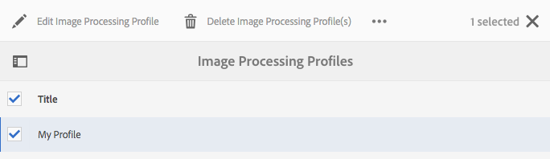

# Gerenciar ativos {#manage-assets}

Este artigo descreve como gerenciar e editar ativos no Adobe Experience Manager Assets. Para gerenciar Fragmentos de conteúdo, consulte [Fragmentos de conteúdo](content-fragments/content-fragments.md) ativos.

## Criar pastas {#creating-folders}

Ao organizar uma coleção de ativos, por exemplo, todas as imagens `Nature`, você pode criar pastas para mantê-las juntas. Você pode usar pastas para categorizar e organizar seus ativos. [!DNL Experience Manager Assets] não exige que você organize ativos em pastas para funcionar melhor.

>[!NOTE]
>
>* O compartilhamento de uma pasta de Ativos do tipo `sling:OrderedFolder` não é suportado ao compartilhar com o Marketing Cloud. Se quiser compartilhar uma pasta, não selecione [!UICONTROL Ordered] ao criar uma pasta.
>* O Experience Manager não permite usar `subassets` palavra como o nome de uma pasta. É uma palavra-chave reservada para nós que contêm subativos para ativos compostos


1. Navegue até o local na pasta de ativos digitais onde deseja criar uma nova pasta. No menu, clique em **[!UICONTROL Create]**. Selecione **[!UICONTROL Nova Pasta]**.
1. No campo **[!UICONTROL Title]**, forneça um nome de pasta. Por padrão, o DAM usa o título fornecido como o nome da pasta. Depois que a pasta for criada, é possível substituir o padrão e especificar outro nome de pasta.
1. Clique em **[!UICONTROL Criar]**. Sua pasta é exibida na pasta de ativos digitais.

Os seguintes caracteres (lista separada por espaços de) não são suportados:

* Um nome de arquivo de ativo não pode conter nenhum destes caracteres: `* / : [ \\ ] | # % { } ? &`
* Um nome de pasta de ativos não pode conter nenhum destes caracteres: `* / : [ \\ ] | # % { } ? \" . ^ ; + & \t`

## Fazer upload de ativos {#uploading-assets}

Consulte [adicionar ativos digitais ao Experience Manager](add-assets.md).

## Detectar ativos duplicados {#detect-duplicate-assets}

<!-- TBD: This feature may not work as documented. See CQ-4283718. Get PM review done. -->

Se um usuário do DAM carregar um ou mais ativos que já existem no repositório, [!DNL Experience Manager] detectará a duplicação e notificará o usuário. A detecção de duplicatas é desativada por padrão, pois pode ter impacto no desempenho dependendo do tamanho do repositório e do número de ativos carregados. Para ativar o recurso, configure [!UICONTROL Adobe AEM Cloud Asset Duplication Detector]. Consulte [como fazer configurações OSGi](https://experienceleague.adobe.com/docs/experience-manager-cloud-service/implementing/deploying/configuring-osgi.html). A detecção de duplicação é baseada no valor exclusivo `dam:sha1` armazenado em `jcr:content/metadata/dam:sha1`. Isso significa que os ativos duplicados são detectados, mesmo se os nomes de arquivo forem diferentes.

Você pode adicionar o arquivo de configuração `/apps/example/config.author/com.adobe.cq.assetcompute.impl.assetprocessor.AssetDuplicationDetector.cfg.json` no código personalizado e o arquivo pode conter o seguinte:

```json
{
  "enabled":true,
  "detectMetadataField":"dam:sha1"
}
```

Depois de habilitado, o Experience Manager envia notificações de ativos duplicados para a Caixa de entrada do Experience Manager. É um resultado agregado para várias duplicatas. Os usuários podem optar por remover os ativos com base nos resultados.


## Visualizar ativos {#previewing-assets}

Para visualizar um ativo, siga estas etapas.

1. Na interface do usuário do Assets, navegue até o local do ativo que deseja visualizar.
1. Toque no ativo desejado para abri-lo.

1. No modo de visualização, as opções de zoom estão disponíveis para [tipos de imagem suportados](/help/assets/file-format-support.md) (com edição interativa).

   Para ampliar um ativo, toque/clique em `+` (ou toque/clique na lupa no ativo). Para diminuir o zoom, toque/clique em `-`. Ao ampliar, você pode observar cuidadosamente qualquer área da imagem ao fazer o panorama. A seta de redefinição do zoom o traz de volta à exibição original.

   Toque em **[!UICONTROL Redefinir]** para redefinir a exibição para o tamanho original.

## Editar propriedades {#editing-properties}

1. Navegue até o local do ativo cujos metadados você deseja editar.

1. Selecione o ativo e toque/clique em **[!UICONTROL Propriedades]** na barra de ferramentas para exibir as propriedades do ativo. Como alternativa, escolha a ação rápida **[!UICONTROL Propriedades]** no cartão de ativos.

   

1. Na página [!UICONTROL Properties], edite as propriedades dos metadados em várias guias. Por exemplo, na guia **[!UICONTROL Basic]**, edite o título, a descrição e assim por diante.

   >[!NOTE]
   >
   >O layout da página [!UICONTROL Propriedades] e as propriedades de metadados disponíveis dependem do esquema de metadados subjacente. Para saber como modificar o layout da página [!UICONTROL Properties], consulte [Esquemas de metadados](/help/assets/metadata-schemas.md).

1. Para programar uma data/hora específica para a ativação do ativo, use o seletor de datas ao lado do campo **[!UICONTROL No horário]**.

   

1. Para desativar o ativo após uma duração específica, escolha a data/hora de desativação do seletor de datas ao lado do campo **[!UICONTROL Hora de desativação]**. A data de desativação deve ser posterior à data de ativação de um ativo. Após o [!UICONTROL Tempo desligado], um ativo e suas representações não estarão disponíveis por meio da interface da Web do Assets ou por meio da API HTTP.

   

1. No campo **[!UICONTROL Tags]**, selecione uma ou mais tags. Para adicionar uma tag personalizada, digite o nome da tag na caixa e selecione a tecla `Enter`. A nova tag é salva em [!DNL Experience Manager].

   O YouTube requer Tags para publicar e ter um link para o YouTube (se um link adequado puder ser encontrado).

   >[!NOTE]
   >
   >Para criar tags, você deve ter permissão de gravação no caminho `/content/cq:tags/default` no repositório CRX.

1. Toque/clique em **[!UICONTROL Salvar e fechar]**.

1. Navegue até a interface do usuário do Assets. As propriedades de metadados editadas, incluindo título, descrição e tags, são exibidas no cartão de ativo na exibição Cartão e em colunas relevantes na exibição Lista.

<!-- TBD: Uncomment after verification for Dec release.

## View asset usage and references {#usage-and-references}

[!DNL Experience Manager] lets you track statistics about usage of a digital asset. The usage statistics include the following:

    * Number of times the asset was viewed or downloaded
    * Channels/devices through which the asset was used
    * Creative solutions where the asset was recently used

To view usage statistics for an asset, in the [!UICONTROL Properties] page, click the **[!UICONTROL Insights]** tab. For more details, see [Assets Insights](assets-insights.md).

[!DNL Experience Manager] also lets you check all the incoming references to an asset, that is, the usage of an asset in remote [!DNL Sites] and in compound assets. Authors of webpages on [!DNL Experience Manager Sites] deployment can use an asset on a remote [!DNL Assets] deployment using the Connected Assets functionality. The [!UICONTROL References] tab in an asset's [!UICONTROL Properties] page lists the local and remote references of the asset. That is, the use of assets in compound assets in [!DNL Assets] and its use in remote [!DNL Sites] pages.

-->

## Copiar ativos {#copying-assets}

Ao copiar um ativo ou uma pasta, todo o ativo ou a pasta é copiada, juntamente com sua estrutura de conteúdo. Um ativo copiado ou uma pasta é duplicado no local de destino. O ativo no local de origem não é alterado.

Alguns atributos exclusivos a uma cópia específica de um ativo não são transportados. Alguns exemplos:

* ID do ativo, data e hora de criação e versões e histórico da versão. Algumas dessas propriedades são indicadas pelas propriedades `jcr:uuid`, `jcr:created` e `cq:name`.

* O tempo de criação e os caminhos referenciados são exclusivos para cada ativo e sua representação.

As outras propriedades e informações de metadados são retidas. Uma cópia parcial não é criada ao copiar um ativo.

1. Na interface do usuário do Assets, selecione um ou mais ativos e toque/clique no ícone **[!UICONTROL Copiar]** na barra de ferramentas. Como alternativa, selecione a ação rápida **[!UICONTROL Copy]**  no cartão de ativos.

   >[!NOTE]
   >
   >Se você usar a ação rápida [!UICONTROL Copiar], poderá copiar apenas um ativo de cada vez.

1. Navegue até o local onde deseja copiar os ativos.

   >[!NOTE]
   >
   >Se você copiar um ativo no mesmo local, [!DNL Experience Manager] gera automaticamente uma variação do nome. Por exemplo, se você copiar um ativo chamado `Square`, [!DNL Experience Manager] gera automaticamente o título para sua cópia como `Square1`.

1. Clique no ícone **[!UICONTROL Colar]** do ativo na barra de ferramentas. Os ativos são copiados para este local.

   

   >[!NOTE]
   >
   >O ícone **[!UICONTROL Colar]** está disponível na barra de ferramentas até que a operação de colar seja concluída.

### Mover ou renomear ativos {#moving-or-renaming-assets}

1. Navegue até o local do ativo que deseja mover.

1. Selecione o ativo e toque/clique no ícone **[!UICONTROL Mover]**  na barra de ferramentas.

1. No assistente Mover ativos , execute um dos seguintes procedimentos:

   * Especifique o nome do ativo após movê-lo. Em seguida, toque/clique em **[!UICONTROL Avançar]** para prosseguir.

   * Toque/clique em **[!UICONTROL Cancelar]** para interromper o processo.
   >[!NOTE]
   >
   >* Você pode especificar o mesmo nome para o ativo se não houver um ativo com esse nome no novo local. No entanto, você deve usar um nome diferente se mover o ativo para um local onde um ativo com o mesmo nome existe. Se você usar o mesmo nome, o sistema gera automaticamente uma variação do nome. Por exemplo, se o ativo tiver o nome Quadrado, o sistema gera o nome Quadrado1 para a cópia.
   >* Ao renomear, o espaço em branco não é permitido no nome do arquivo.


1. Na caixa de diálogo **[!UICONTROL Selecionar destino]**, siga um destes procedimentos:

   * Navegue até o novo local dos ativos e toque/clique em **[!UICONTROL Próximo]** para prosseguir.

   * Toque/clique em **[!UICONTROL Voltar]** para retornar à tela **[!UICONTROL Renomear]**.

1. Se os ativos que estão sendo movidos tiverem páginas, ativos ou coleções de referência, a guia **[!UICONTROL Ajustar referências]** aparecerá ao lado da guia **[!UICONTROL Selecionar destino]**.

   Siga um destes procedimentos na tela **[!UICONTROL Ajustar referências]**:

   * Especifique as referências a serem ajustadas com base nos novos detalhes e toque/clique em **[!UICONTROL Mover]** para prosseguir.

   * Na coluna **[!UICONTROL Ajustar]**, selecione/desmarque referências aos ativos.
   * Toque/clique em **[!UICONTROL Voltar]** para retornar à tela **[!UICONTROL Selecionar destino]**.

   * Toque/clique em **[!UICONTROL Cancelar]** para interromper a operação de movimentação.

   Se você não atualizar referências, elas continuarão apontando para o caminho anterior do ativo. Se você ajustar as referências, elas serão atualizadas para o novo caminho do ativo.

### Gerenciar representações {#managing-renditions}

1. Você pode adicionar ou remover representações de um ativo, exceto o original. Navegue até o local do ativo para o qual deseja adicionar ou remover representações.

1. Toque/clique no ativo para abrir a página de ativos.

   

1. Toque/clique no ícone de Navegação Global e selecione **[!UICONTROL Representações]** na lista.

   

1. No painel **[!UICONTROL Representações]**, visualize a lista de representações geradas para o ativo.

   

   >[!NOTE]
   >
   >Por padrão, [!DNL Experience Manager Assets] não exibe a representação original do ativo no modo de visualização. Se você for um administrador, poderá usar as sobreposições para configurar [!DNL Assets] para exibir as representações originais no modo de visualização.

1. Selecione uma representação para exibir ou excluir a representação.

   **Exclusão de uma representação**

   Selecione uma representação no painel **[!UICONTROL Representações]** e toque/clique no ícone **[!UICONTROL Excluir representação]** na barra de ferramentas. As representações não podem ser excluídas em massa após a conclusão do processamento do ativo. Para ativos individuais, você pode remover as renderizações manualmente da interface do usuário. Para vários ativos, você pode personalizar [!DNL Experience Manager] para excluir representações específicas ou excluir os ativos e fazer upload novamente dos ativos excluídos.

   

   **Upload de uma nova representação**

   Navegue até a página de detalhes do ativo e toque/clique no ícone **[!UICONTROL Adicionar representação]** na barra de ferramentas para fazer upload de uma nova representação do ativo.

   

   >[!NOTE]
   >
   >Se você selecionar uma representação no painel **[!UICONTROL Representações]**, a barra de ferramentas alterará o contexto e exibirá somente as ações relevantes para a representação. As opções, como o ícone Fazer upload da representação, não são exibidas. Para exibir essas opções na barra de ferramentas, navegue até a página de detalhes do ativo.

   Você pode configurar as dimensões para a representação que deseja exibir na página de detalhes de um ativo de imagem ou vídeo. Com base nas dimensões especificadas, os Ativos exibem a representação com as dimensões exatas ou mais próximas.

   Para configurar as dimensões de representação de uma imagem no nível de detalhes do ativo, sobreponha o nó `renditionpicker` (`libs/dam/gui/content/assets/assetpage/jcr:content/body/content/content/items/assetdetail/items/col1/items/assetview/renditionpicker`) e configure o valor da propriedade largura. Configure o **[!UICONTROL tamanho (Longo) em KB]** da propriedade no lugar da largura para personalizar a representação na página Detalhes do ativo com base no tamanho da imagem. Para personalização baseada em tamanho, a propriedade `preferOriginal` atribui preferência ao original se o tamanho da representação correspondente for maior que o original.

   Da mesma forma, é possível personalizar a imagem da página Anotação ao sobrepor `libs/dam/gui/content/assets/annotate/jcr:content/body/content/content/items/content/renditionpicker`.

   

   Para configurar dimensões de representação para um ativo de vídeo, navegue até o nó `videopicker` no repositório CRX no local `/libs/dam/gui/content/assets/assetpage/jcr:content/body/content/content/items/assetdetail/items/col1/items/assetview/videopicker`, sobreponha o nó e edite a propriedade apropriada.

   >[!NOTE]
   >
   >As anotações de vídeo são suportadas somente em navegadores com formatos de vídeo compatíveis com HTML5. Além disso, dependendo do navegador, diferentes formatos de vídeo são compatíveis.

## Excluir ativos {#delete-assets}

Para resolver ou remover as referências recebidas de outras páginas, atualize as referências relevantes antes de excluir um ativo.

Além disso, desative o botão forçar exclusão usando uma sobreposição para impedir que os usuários excluam ativos referenciados e deixem links quebrados.

1. Vá ao local do(s) ativo(s) que deseja excluir.

1. Selecione o ativo e clique em **[!UICONTROL Delete]**  na barra de ferramentas.

1. Na caixa de diálogo de confirmação, clique em:

   * **** Cancelar para interromper a ação
   * **[!UICONTROL Excluir]** para confirmar a ação:

      * Se o ativo não tiver referências, o ativo será excluído.
      * Se o ativo tiver referências, uma mensagem de erro informa que **[!UICONTROL Um ou mais ativos são referenciados]**. Você pode selecionar **[!UICONTROL Forçar exclusão]** ou **[!UICONTROL Cancelar]**.

   >[!NOTE]
   >
   >Você precisa de permissões de exclusão no dam/asset para excluir um ativo. Se você só tiver permissões de modificação, poderá editar os metadados do ativo e adicionar anotações ao ativo. No entanto, não é possível excluir o ativo ou seus metadados.

   >[!NOTE]
   >
   >Para resolver ou remover as referências recebidas de outras páginas, atualize as referências relevantes antes de excluir um ativo. É possível não permitir a exclusão de ativos referenciados, pois isso causa links quebrados. Desative o botão forçar exclusão usando uma sobreposição.

## Baixar ativos {#download-assets}

Consulte [baixar ativos de [!DNL Experience Manager]](/help/assets/download-assets-from-aem.md).

## Publicar ou desfazer a publicação de ativos {#publish-assets}

1. Navegue até o local do ativo ou da pasta de ativos que deseja publicar ou que deseja remover do ambiente de publicação (cancelar a publicação).

1. Selecione o ativo ou a pasta para publicar ou desfazer a publicação e selecione a opção **[!UICONTROL Gerenciar publicação]**  na barra de ferramentas. Como alternativa, para publicar rapidamente, selecione a opção **[!UICONTROL Publicação rápida]** na barra de ferramentas. Se a pasta que você deseja publicar incluir uma pasta vazia, a pasta vazia não será publicada.

1. Selecione a opção **[!UICONTROL Publish]** ou **[!UICONTROL Unpublish]** conforme necessário.

   
   *Figura: Opções de publicação e cancelamento de publicação e a opção de agendamento.*

1. Selecione **[!UICONTROL Agora]** para agir no ativo imediatamente ou selecione **[!UICONTROL Mais Tarde]** para agendar a ação. Selecione uma data e hora se escolher a opção **[!UICONTROL Later]**. Clique em **[!UICONTROL Avançar]**.

1. Ao publicar, se um ativo fizer referência a outros ativos, suas referências serão listadas no assistente. Somente as referências são exibidas, que não são publicadas ou modificadas desde a última publicação. Escolha as referências que deseja publicar.

1. Ao cancelar a publicação, se um ativo fizer referência a outros ativos, escolha as referências que deseja cancelar a publicação. Clique em **[!UICONTROL Cancelar publicação]**. Na caixa de diálogo de confirmação, clique em **[!UICONTROL Cancelar]** para interromper a ação ou clique em **[!UICONTROL Cancelar publicação]** para confirmar que a publicação dos ativos deve ser cancelada na data especificada.

Entenda as seguintes limitações e dicas relacionadas à publicação ou ao cancelamento da publicação de ativos ou pastas:

* A opção para [!UICONTROL Gerenciar publicação] está disponível somente para as contas de usuário que têm permissões de replicação.
* Ao cancelar a publicação de um ativo complexo, cancele a publicação somente do ativo. Evite desfazer a publicação das referências, pois elas podem ser referenciadas por outros ativos publicados.
* Pastas vazias não são publicadas.
* Se você publicar um ativo que está sendo processado, somente o conteúdo original será publicado. As representações estão ausentes. Aguarde até que o processamento seja concluído e publique ou publique novamente o ativo quando o processamento for concluído.

## Grupo de usuários fechado {#closed-user-group}

Um grupo de usuários fechado (CUG) é usado para limitar o acesso a pastas de ativos específicas publicadas a partir de [!DNL Experience Manager]. Se você criar um CUG para uma pasta, o acesso a ela (incluindo ativos e subpastas de pastas) será restrito somente a membros ou grupos atribuídos. Para acessar a pasta, eles devem fazer logon usando suas credenciais de segurança.

Os CUGs são uma maneira extra de restringir o acesso aos seus ativos. Você também pode configurar uma página de logon para a pasta .

1. Selecione uma pasta na interface do usuário do Assets e toque/clique no ícone Propriedades na barra de ferramentas para exibir a página de propriedades.
1. Na guia **[!UICONTROL Permissões]**, adicione membros ou grupos em **[!UICONTROL Grupo de usuários fechado]**.

   

1. Para exibir uma tela de logon quando os usuários acessarem a pasta, selecione a opção **[!UICONTROL Ativar]**. Em seguida, selecione o caminho para uma página de logon em [!DNL Experience Manager] e salve as alterações.

   

   >[!NOTE]
   >
   >Se você não especificar o caminho para uma página de logon, [!DNL Experience Manager] exibirá a página de logon padrão na instância de publicação.

1. Publique a pasta e tente acessá-la da instância de publicação. Uma tela de logon é exibida.
1. Se você for um membro CUG, informe suas credenciais de segurança. A pasta é exibida depois que [!DNL Experience Manager] o autentica.

## Pesquisar ativos {#search-assets}

Pesquisar ativos é fundamental para o uso de um sistema de gerenciamento de ativos digitais — seja para uso adicional por parte dos criadores, para o gerenciamento robusto de ativos pelos usuários e profissionais de marketing ou para administração por administradores de DAM.

Para pesquisas simples, avançadas e personalizadas para descobrir e usar os ativos mais apropriados, consulte [pesquisar ativos em [!DNL Experience Manager]](/help/assets/search-assets.md).

## Ações rápidas {#quick-actions}

Os ícones de ação rápida estão disponíveis para um único ativo por vez. Dependendo do seu dispositivo, execute as seguintes ações para exibir os ícones de ação rápida:

* Dispositivos de toque: Toque e segure. Por exemplo, em um iPad, é possível tocar e segurar um ativo para que as ações rápidas sejam exibidas.
* Dispositivos sem toque: Ponteiro do mouse. Por exemplo, em um dispositivo de desktop, a barra de ação rápida é exibida se você passar o ponteiro do mouse sobre a miniatura do ativo.

## Editar imagens {#editing-images}

As ferramentas de edição na interface [!DNL Experience Manager Assets] permitem executar pequenos trabalhos de edição em ativos de imagem. Você pode recortar, girar, virar e executar outros trabalhos de edição em imagens. Também é possível adicionar mapas de imagem a ativos.

>[!NOTE]
>
>Para alguns componentes, o modo de Tela cheia tem opções adicionais disponíveis.

1. Siga um destes procedimentos para abrir um ativo no modo de edição:

   * Selecione o ativo e clique/toque no ícone **[!UICONTROL Editar]** na barra de ferramentas.
   * Toque/clique no ícone **[!UICONTROL Editar]** que aparece em um ativo na exibição de Cartão.
   * Na página de ativos, toque/clique no ícone **[!UICONTROL Editar]** na barra de ferramentas.

   

1. Para recortar a imagem, toque/clique no ícone **Recortar**.

   

1. Selecione a opção desejada na lista. A área de corte aparece na imagem com base na opção escolhida. A opção **Mão livre** permite cortar a imagem sem restrições de proporção.

   

1. Selecione a área a ser cortada e redimensione-a ou reposicione-a na imagem.
1. Use o ícone **Finish** (canto superior direito) para recortar a imagem. Clicar no ícone **Finish** também aciona a regeneração de representações.

   

1. Use os ícones **Desfazer** e **Refazer** na parte superior direita para reverter para a imagem não cortada ou manter a imagem cortada, respectivamente.

   

1. Toque/clique no ícone Girar apropriado para girar a imagem no sentido horário ou anti-horário.

   

1. Toque/clique no ícone Flip apropriado para inverter a imagem na horizontal ou na vertical.

   

1. Toque/clique no ícone **Finish** para salvar as alterações.

   

>[!NOTE]
>
>A edição de imagens é compatível com formatos de arquivos BMP, GIF, PNG e JPEG.

<!-- You can also add image maps using the image editor. For details, see [Adding Image Maps](/help/assets/image-maps.md). -->

>[!NOTE]
>
>Para editar um arquivo TXT, defina **Day CQ Link Externalizer** no Configuration Manager.

## Linha do tempo {#timeline}

A linha do tempo permite visualizar vários eventos de um item selecionado, como fluxos de trabalho ativos de um ativo, comentários/anotações, registros de atividades e versões.


*assetFigure: Classificar entradas de linha do tempo de um ativo*

>[!NOTE]
>
>No console [Coleções](/help/assets/manage-collections.md#navigate-the-collections-console), a lista **[!UICONTROL Mostrar tudo]** fornece opções para exibir somente comentários e fluxos de trabalho. Além disso, a linha do tempo é exibida somente para coleções de nível superior listadas no console. Ele não é exibido se você navegar dentro de qualquer uma das coleções.

>[!NOTE]
>
>A linha do tempo contém várias [opções específicas para fragmentos de conteúdo](content-fragments/content-fragments.md).

## Anotar {#annotating}

Anotações são comentários ou notas explicativas adicionadas a imagens ou vídeos. As anotações oferecem aos profissionais de marketing a capacidade de colaborar e deixar comentários sobre ativos.

As anotações de vídeo são suportadas apenas em navegadores com formatos de vídeo compatíveis com HTML5. Os formatos de vídeo compatíveis com o Assets dependem do navegador.

>[!NOTE]
>
>Para Fragmentos de conteúdo, as anotações [são criadas no editor de fragmentos](content-fragments/content-fragments.md).

1. Navegue até o local do ativo ao qual deseja adicionar anotações.
1. Toque/clique no ícone **[!UICONTROL Anotar]** de um dos seguintes itens:

   * [Ações rápidas](#quick-actions)
   * Na barra de ferramentas, depois de selecionar o ativo ou navegar até a página de ativos

   

1. Adicione um comentário na caixa **[!UICONTROL Comentário]** na parte inferior da linha do tempo. Como alternativa, marque uma área na imagem e adicione uma anotação na caixa de diálogo **[!UICONTROL Adicionar anotação]**.

   

<!--
1. To notify a user about an annotation, specify the email address of the user and add the comment. For example, to notify Aaron MacDonald about an annotation, enter @aa. Hints for all matching users is displayed in a list. Select Aaron's email address from the list to tag her with the comment. Similarly, you can tag more users anywhere within the annotation or before or after it.
-->

>[!NOTE]
>
>Para um usuário que não seja administrador, as sugestões serão exibidas somente se o usuário tiver permissões de Leitura em `/home` no CRXDE.


1. Depois de adicionar a anotação, clique em **[!UICONTROL Adicionar]** para salvá-la. Uma notificação para a anotação é enviada para Aaron.

   

   >[!NOTE]
   >
   >É possível adicionar várias anotações antes de salvá-las.

1. Toque/clique em **[!UICONTROL Fechar]** para sair do modo Anotar.
1. Para exibir a notificação, faça logon no Assets com as credenciais do Aaron MacDonald e clique no ícone **[!UICONTROL Notifications]** para exibir a notificação.

   >[!NOTE]
   >
   >As anotações também podem ser adicionadas aos ativos de vídeo. Ao anotar vídeos, o reprodutor pausa para permitir que você anote em um quadro. Para obter detalhes, consulte [gerenciamento de ativos de vídeo](manage-video-assets.md).

1. Para escolher uma cor diferente para diferenciar os usuários, clique/toque no ícone Perfil e clique/toque em **[!UICONTROL Minhas preferências]**.

   

   Especifique a cor desejada na caixa **[!UICONTROL Cor da anotação]** e clique/toque em **[!UICONTROL Aceitar]**.

   

>[!NOTE]
>
>Também é possível adicionar anotações a uma coleção. No entanto, se uma coleção contiver coleções secundárias, você poderá adicionar anotações/comentários somente à coleção principal. A opção Anotar não está disponível para coleções secundárias.

### Exibir anotações salvas {#viewing-saved-annotations}

É possível exibir apenas uma anotação por vez.

>[!NOTE]
>
>Se estiver selecionando várias anotações, a anotação mais recente ficará visível na interface do usuário.
>
>A seleção múltipla é suportada apenas para imprimir o ativo anotado como PDF.

1. Para exibir anotações salvas de um ativo, navegue até o local do ativo e abra a página do ativo.

1. Toque/clique no ícone de Navegação global e escolha **[!UICONTROL Linha do tempo]** na lista.

   

1. Na lista **[!UICONTROL Exibir todos]** na linha do tempo, selecione **[!UICONTROL Comentários]** para filtrar os resultados com base em anotações.

   

   Toque/clique em um comentário no painel **[!UICONTROL Linha do tempo]** para exibir a anotação correspondente na imagem.

   

   Toque/clique em **[!UICONTROL Excluir]** para excluir um comentário específico.

### Imprimir anotações {#printing-annotations}

Se um ativo tiver anotações ou tiver sido sujeito a um fluxo de trabalho de revisão, é possível imprimir o ativo junto com anotações e revisar o status como um arquivo PDF para revisão offline.

Você também pode optar por imprimir somente as anotações ou o status da revisão.

>[!NOTE]
>
>É possível selecionar várias anotações ao imprimir o ativo anotado como PDF.

Para imprimir as anotações e o status da revisão, toque/clique no ícone **[!UICONTROL Imprimir]** e siga as instruções do assistente. O ícone **[!UICONTROL Imprimir]** aparece na barra de ferramentas somente quando o ativo tem pelo menos uma anotação ou status de revisão atribuído a ele.

1. Na interface do usuário do Assets, abra a página de visualização de um ativo.
1. Faça uma das seguintes opções:

   * Para imprimir todas as anotações e o status da revisão, pule a etapa 3 e vá diretamente para a etapa 4.
   * Para imprimir anotações específicas e verificar o status, abra a [linha do tempo](/help/assets/manage-digital-assets.md#timeline) e vá para a etapa 3.

1. Para imprimir anotações específicas, selecione as anotações na linha do tempo.

   

   Para imprimir somente o status da revisão, selecione-o na linha do tempo.

   

1. Toque/clique no ícone **[!UICONTROL Imprimir]** na barra de ferramentas.

   

1. Na caixa de diálogo Imprimir, escolha a posição em que deseja que o status das anotações/revisões seja exibido no PDF. Por exemplo, se você quiser que as anotações/status sejam impressas na parte superior direita da página que contém a imagem impressa, use a configuração **Parte superior esquerda**. Ele é selecionado por padrão.

   

   É possível escolher outras configurações, dependendo da posição em que deseja que as anotações/status apareçam no PDF impresso. Se desejar que as anotações/status apareçam em uma página separada do ativo impresso, escolha **[!UICONTROL Próxima página]**.

1. Clique em **[!UICONTROL Imprimir]**. Dependendo da opção escolhida na etapa 2, o PDF gerado exibirá as anotações/os status na posição especificada. Por exemplo, se optar por imprimir as anotações e o status da revisão usando a configuração **Superior esquerdo**, o resultado será semelhante ao arquivo PDF mostrado aqui.

   

1. Baixe ou imprima o PDF usando as opções na parte superior direita.

   

   Para modificar a aparência do arquivo PDF renderizado, por exemplo, a cor da fonte, o tamanho e o estilo, a cor de fundo dos comentários e status, abra a **[!UICONTROL Configuração do PDF de anotação]** no Configuration Manager e modifique as opções desejadas. Por exemplo, para alterar a cor de exibição do status aprovado, modifique o código de cor no campo correspondente. Para obter informações sobre como alterar a cor da fonte das anotações, consulte [Anotar](/help/assets/manage-digital-assets.md#annotating).

   

   Retorne ao arquivo PDF renderizado e atualize-o. O PDF atualizado reflete as alterações feitas.

## Controle de versão de ativos {#asset-versioning}

O controle de versão cria um instantâneo de ativos digitais em um ponto específico do tempo. O controle de versão ajuda a restaurar ativos para um estado anterior posteriormente. Por exemplo, se você deseja desfazer uma alteração feita em um ativo, restaure a versão não editada do ativo.

A seguir estão os cenários em que você cria versões:

* Você modifica uma imagem em um aplicativo diferente e faz upload para os Ativos. Uma versão da imagem é criada para que sua imagem original não seja substituída.
* Você edita os metadados de um ativo.
* Você usa [!DNL Experience Manager] aplicativo de desktop para fazer check-out de um ativo existente e salvar as alterações. Uma nova versão é criada sempre que o ativo é salvo.

Você também pode ativar o controle de versão automático por meio de um fluxo de trabalho. Ao criar uma versão para um ativo, os metadados e as representações são salvos junto com a versão. As representações são alternativas renderizadas das mesmas imagens, por exemplo, uma representação PNG de um arquivo JPEG carregado.

A funcionalidade de controle de versão permite fazer o seguinte:

* Crie uma versão de um ativo.
* Exibir a revisão atual de um ativo.
* Restaure o ativo para uma versão anterior.

1. Navegue até o local do ativo para o qual deseja criar uma versão e toque/clique nele para abrir a página de ativos.

1. Toque/clique no ícone de Navegação global e escolha **[!UICONTROL Linha do tempo]** no menu.

   

1. Toque/clique no ícone **[!UICONTROL Actions]** (seta) na parte inferior para exibir as ações disponíveis que você pode executar no ativo.

   

1. Toque/clique em **[!UICONTROL Salvar como versão]** para criar uma versão para o ativo.

   

1. Adicione um rótulo e comentário e clique em **[!UICONTROL Create]** para criar uma versão. Como alternativa, toque/clique em **Cancelar** para sair da operação.

   

1. Para exibir a nova versão, abra a lista **[!UICONTROL Mostrar tudo]** na linha do tempo da página Detalhes do ativo ou na interface do usuário do Assets e escolha **[!UICONTROL Versões]**. Todas as versões criadas para um ativo são listadas na guia Linha do tempo. Filtre a lista para mostrar Versões ao clicar na seta suspensa e selecionar **[!UICONTROL Versões]** na lista.

   

1. Selecione uma versão específica para o ativo visualizar ou permitir que ele apareça na interface do usuário do Assets.

   

1. Adicione um rótulo e um comentário para a versão para reverter para a versão específica na interface do usuário do Assets.

   

1. Para gerar uma visualização da versão, toque/clique em **[!UICONTROL Visualizar versão]**.
1. Para exibir essa versão na interface do usuário do Assets, selecione **[!UICONTROL Reverter para essa versão]**.
1. Para comparar duas versões, vá para a página de ativos do ativo e toque/clique na versão a ser comparada com a versão atual.

   

1. Na linha do tempo, selecione a versão que deseja comparar e arraste o controle deslizante para a esquerda para sobrepor essa versão à versão atual e compare.

   

### Iniciar um fluxo de trabalho em um ativo {#starting-a-workflow-on-an-asset}

1. Navegue até o local do ativo para o qual deseja iniciar um fluxo de trabalho e toque/clique no ativo para abrir a página de ativo.
1. Toque/clique no ícone de Navegação global e escolha **[!UICONTROL Linha do tempo]** no menu para exibir a linha do tempo.

   

1. Toque/clique no ícone **[!UICONTROL Actions]** (seta) na parte inferior para abrir a lista de ações disponíveis para o ativo.

   

1. Toque/clique em **[!UICONTROL Iniciar fluxo de trabalho]** na lista.

   

1. Na caixa de diálogo **[!UICONTROL Iniciar fluxo de trabalho]**, selecione um modelo de fluxo de trabalho na lista.

   

1. (Opcional) Especifique um título para o fluxo de trabalho, que pode ser usado para fazer referência à instância do fluxo de trabalho.

   

1. Toque/clique em **[!UICONTROL Iniciar]** e em **[!UICONTROL Prosseguir]** na caixa de diálogo para confirmar. Cada etapa do fluxo de trabalho é exibida na linha do tempo como um evento.

   

## Coleções {#collections}

Uma coleção é um conjunto ordenado de ativos. Use coleções para compartilhar ativos entre usuários.

* Uma coleção pode incluir ativos de locais diferentes, pois eles contêm apenas referências a esses ativos. Cada coleção mantém a integridade referencial dos ativos.
* Você pode compartilhar coleções com vários usuários com diferentes níveis de privilégio, incluindo edição, visualização e assim por diante.

Para saber mais sobre o Gerenciamento de coleções, consulte [gerenciar coleções](/help/assets/manage-collections.md).

## Ocultar ativos expirados ao visualizar ativos no aplicativo de desktop ou no Adobe Asset Link {#hide-expired-assets-via-acp-api}

[!DNL Experience Manager] o aplicativo de desktop permite acesso ao repositório DAM do desktop do Windows ou Mac. O Adobe Asset Link permite acesso a ativos a partir dos aplicativos de desktop [!DNL Creative Cloud] compatíveis.

Ao navegar pelos ativos na interface do usuário [!DNL Experience Manager], os ativos expirados não são exibidos. Para evitar visualizar, pesquisar e buscar ativos expirados ao navegar por ativos do aplicativo de desktop e do Asset Link, os administradores podem fazer a seguinte configuração. A configuração funciona para todos os usuários, independentemente do privilégio de administrador.

Execute o seguinte comando CURL. Garanta o acesso de leitura em `/conf/global/settings/dam/acpapi/` para os usuários que acessam ativos. Os usuários que fazem parte do grupo `dam-user` têm a permissão por padrão.

```curl
curl -v -u admin:admin --location --request POST 'http://localhost:4502/conf/global/settings/dam/acpapi/configuration/_jcr_content' \
--header 'Content-Type: application/x-www-form-urlencoded' \
--data-urlencode 'jcr:title=acpapiconfig' \
--data-urlencode 'hideExpiredAssets=true' \
--data-urlencode 'hideExpiredAssets@TypeHint=Boolean' \
--data-urlencode 'jcr:primaryType=nt:unstructured' \
--data-urlencode '../../jcr:primaryType=sling:Folder'
```

Para saber mais, consulte como [procurar ativos do DAM usando o aplicativo de desktop](https://experienceleague.adobe.com/docs/experience-manager-desktop-app/using/using.html#browse-search-preview-assets) e [como usar o Adobe Asset Link](https://helpx.adobe.com/enterprise/admin-guide.html/enterprise/using/manage-assets-using-adobe-asset-link.ug.html).
