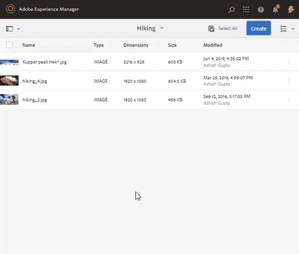

# Manage assets {#manage-assets}

Este artigo descreve como gerenciar e editar ativos nos ativos Adobe Experience Manager (AEM). Para gerenciar os Fragmentos de conteúdo, consulte os ativos [Fragmentos](content-fragments/content-fragments.md) de conteúdo.

## Criar pastas {#creating-folders}

Ao organizar uma coleção de ativos, por exemplo, todas as `Nature` imagens, você pode criar pastas para mantê-las juntas. Você pode usar pastas para categorizar e organizar seus ativos. Os ativos AEM não exigem que você organize ativos em pastas para trabalhar melhor.

>[!NOTE]
>
>O compartilhamento de uma pasta Ativos do tipo `sling:OrderedFolder`não é suportado ao compartilhar com a Marketing Cloud. Se desejar compartilhar uma pasta, não selecione [!UICONTROL Solicitado] ao criar uma pasta.

1. Navegue até o local na pasta de ativos digitais onde deseja criar uma nova pasta. No menu, clique em **[!UICONTROL Criar]**. Selecione **[!UICONTROL Nova pasta]**.
1. No campo **[!UICONTROL Título]** , forneça um nome de pasta. Por padrão, o DAM usa o título fornecido como o nome da pasta. Depois que a pasta for criada, você poderá substituir o padrão e especificar outro nome de pasta.
1. Clique em **[!UICONTROL Criar]**. Sua pasta é exibida na pasta de ativos digitais.

Os seguintes caracteres (lista separada por espaços de) não são suportados:

* Um nome de arquivo de ativo não pode conter nenhum destes caracteres: `* / : [ \\ ] | # % { } ? &`
* O nome da pasta de ativos não pode conter nenhum destes caracteres: `* / : [ \\ ] | # % { } ? \" . ^ ; + & \t`

## Upload assets {#uploading-assets}

Consulte [adicionar ativos digitais ao Experience Manager](add-assets.md)para obter informações detalhadas.

## Visualizar ativos {#previewing-assets}

Para visualizar um ativo, siga estas etapas.

1. Na interface do usuário Ativos, navegue até o local do ativo que deseja visualizar.
1. Toque no ativo desejado para abri-lo.

1. No modo de visualização, as opções de zoom estão disponíveis para os tipos [de imagem](/help/assets/file-format-support.md) suportados (com edição interativa).

   Para aplicar zoom em um ativo, toque/clique `+` (ou toque/clique na lupa do ativo). Para diminuir o zoom, toque/clique em `-`. Ao aplicar zoom, você pode observar cuidadosamente qualquer área da imagem ao aplicar panorama. A seta para redefinir zoom leva você de volta à exibição original.

   Toque em **[!UICONTROL Redefinir]** para redefinir a exibição para o tamanho original.

## Editar propriedades {#editing-properties}

1. Navegue até o local do ativo cujos metadados você deseja editar.

1. Selecione o ativo e toque/clique em **[!UICONTROL Propriedades]** na barra de ferramentas para exibir as propriedades do ativo. Como alternativa, escolha a ação rápida **[!UICONTROL Propriedades]** no cartão de ativos.

   

1. Na página [!UICONTROL Propriedades] , edite as propriedades de metadados em várias guias. Por exemplo, na guia **[!UICONTROL Básico]** , edite o título, a descrição e assim por diante.

   >[!NOTE]
   >
   >O layout da página [!UICONTROL Propriedades] e as propriedades de metadados disponíveis dependem do esquema de metadados subjacente. Para saber como modificar o layout da página [!UICONTROL Propriedades] , consulte Esquemas [de metadados](/help/assets/metadata-schemas.md).

1. Para programar uma data/hora específica para a ativação do ativo, use o seletor de datas ao lado do campo **[!UICONTROL Em tempo]** .

   

1. Para desativar o ativo após uma duração específica, escolha a data/hora de desativação no seletor de datas ao lado do campo Tempo de **[!UICONTROL desativação]** . A data de desativação deve ser posterior à data de ativação de um ativo. Depois do tempo de [!UICONTROL desligado], um ativo e suas representações não estão disponíveis por meio da interface da Web Ativos ou por meio da API HTTP.

   

1. No campo **[!UICONTROL Tags]** , selecione uma ou mais tags. Para adicionar uma tag personalizada, digite o nome da tag na caixa e pressione a tecla Enter. A nova tag é salva no AEM.

   O YouTube requer Tags para publicar e ter um link para o YouTube (se for possível encontrar um link adequado).

   >[!NOTE]
   >
   >Para criar tags, é necessário ter permissão de gravação no `/content/cq:tags/default` caminho no repositório CRX.

1. Para exibir as estatísticas de uso do ativo, clique/toque na guia **[!UICONTROL Insights]** .

   As estatísticas de uso incluem o seguinte:

   * Número de vezes que o ativo foi exibido ou baixado
   * Canais/dispositivos pelos quais o ativo foi usado
   * Soluções criativas onde o ativo foi usado recentemente
   Para obter mais detalhes, consulte [Asset Insights](assets-insights.md).

1. Toque/clique em **[!UICONTROL Salvar e fechar]**.

1. Navegue até a interface do usuário Ativos. As propriedades de metadados editadas, incluindo título, descrição e tags, são exibidas no cartão de ativos na exibição Cartão e nas colunas relevantes na exibição Lista.

## Copiar ativos {#copying-assets}

Quando você copia um ativo ou uma pasta, o ativo inteiro ou a pasta é copiado, juntamente com sua estrutura de conteúdo. Um ativo copiado ou uma pasta é duplicado no local de destino. O ativo no local de origem não é alterado.

Alguns atributos exclusivos a uma cópia específica de um ativo não são transmitidos. Alguns exemplos são:

* Caminho relativo, ID do ativo, data e hora de criação e versões e histórico de versões. Algumas dessas propriedades são indicadas pelas propriedades `dam:relativePath`, `jcr:uuid`, `jcr:created`e `cq:name`.

* O tempo de criação e os caminhos referenciados são exclusivos para cada ativo e cada uma de suas execuções.

As outras propriedades e informações de metadados são mantidas. Uma cópia parcial não é criada ao copiar um ativo.

1. Na interface do usuário do Assets, selecione um ou mais ativos e toque/clique no ícone **[!UICONTROL Copiar]** da barra de ferramentas. Como alternativa, selecione a ação rápida **[!UICONTROL Copiar]**  no cartão de ativos.

   >[!NOTE]
   >
   >Se você usar a ação rápida [!UICONTROL Copiar] , poderá copiar apenas um ativo por vez.

1. Navegue até o local onde deseja copiar os ativos.

   >[!NOTE]
   >
   >Se você copiar um ativo no mesmo local, o AEM gera automaticamente uma variação do nome. Por exemplo, se você copiar um ativo intitulado `Square`, o AEM gera automaticamente o título para sua cópia como `Square1`.

1. Clique no ícone **[!UICONTROL Colar]** ativo na barra de ferramentas. Os ativos são copiados para este local.

   

   >[!NOTE]
   >
   >O ícone **[!UICONTROL Colar]** está disponível na barra de ferramentas até que a operação de colar seja concluída.

### Mover ou renomear ativos {#moving-or-renaming-assets}

1. Navegue até o local do ativo que deseja mover.

1. Selecione o ativo e toque/clique no ícone **[!UICONTROL Mover]** ,  , na barra de ferramentas.

1. No assistente de Ativos de Movimentação, execute um dos procedimentos a seguir:

   * Especifique o nome do ativo depois de movê-lo. Em seguida, toque/clique em **[!UICONTROL Avançar]** para continuar.

   * Toque/clique em **[!UICONTROL Cancelar]** para interromper o processo.
   >[!NOTE]
   >
   >* Você pode especificar o mesmo nome para o ativo se não houver um ativo com esse nome no novo local. No entanto, você deve usar um nome diferente se mover o ativo para um local onde um ativo com o mesmo nome exista. Se você usar o mesmo nome, o sistema gera automaticamente uma variação do nome. Por exemplo, se seu ativo tiver o nome Quadrado, o sistema gera o nome Quadrado1 para sua cópia.
   >* Ao renomear, o espaço em branco não é permitido no nome do arquivo.

1. Na caixa de diálogo **[!UICONTROL Selecionar destino]** , siga um destes procedimentos:

   * Navegue até o novo local dos ativos e toque/clique em **[!UICONTROL Avançar]** para continuar.

   * Toque/clique em **[!UICONTROL Voltar]** para retornar à tela **[!UICONTROL Renomear]** .

1. Se os ativos que estão sendo movidos tiverem páginas, ativos ou coleções de referência, a guia **[!UICONTROL Ajustar referências]** aparecerá ao lado da guia **[!UICONTROL Selecionar destino]** .

   Execute um dos procedimentos a seguir na tela **[!UICONTROL Ajustar referências]** :

   * Especifique as referências a serem ajustadas com base nos novos detalhes e toque/clique em **[!UICONTROL Mover]** para continuar.

   * Na coluna **[!UICONTROL Ajustar]** , selecione/desmarque referências aos ativos.
   * Toque/clique em **[!UICONTROL Voltar]** para retornar à tela **[!UICONTROL Selecionar destino]** .

   * Toque/clique em **[!UICONTROL Cancelar]** para interromper a operação de movimentação.
   Se você não atualizar referências, elas continuarão apontando para o caminho anterior do ativo. Se você ajustar as referências, elas serão atualizadas para o novo caminho do ativo.

### Gerenciar execuções {#managing-renditions}

1. Você pode adicionar ou remover representações de um ativo, exceto o original. Navegue até o local do ativo para o qual você deseja adicionar ou remover representações.

1. Toque/clique no ativo para abrir sua página de ativos.

   

1. Toque/clique no ícone GlobalNav e selecione **[!UICONTROL Representações]** na lista.

   

1. No painel **[!UICONTROL Representações]** , visualize a lista de representações geradas para o ativo.

   

   >[!NOTE]
   >
   >Por padrão, os ativos AEM não exibem a representação original do ativo no modo de visualização. Se você for um administrador, poderá usar sobreposições para configurar os ativos AEM para exibir as representações originais no modo de visualização.

1. Selecione uma representação para exibir ou excluir a representação.

   **Excluindo uma representação**

   Selecione uma representação no painel **[!UICONTROL Representações]** e toque/clique no ícone **[!UICONTROL Excluir representação]** da barra de ferramentas.

   

   **Carregar uma nova execução**

   Navegue até a página de detalhes do ativo e toque/clique no ícone **[!UICONTROL Adicionar representação]** na barra de ferramentas para carregar uma nova representação do ativo.

   

   >[!NOTE]
   >
   >Se você selecionar uma representação no painel **[!UICONTROL Representações]** , a barra de ferramentas alterará o contexto e exibirá somente as ações que são relevantes para a representação. As opções, como o ícone Carregar representação, não são exibidas. Para exibir essas opções na barra de ferramentas, navegue até a página de detalhes do ativo.

   Você pode configurar as dimensões para a representação que deseja exibir na página de detalhes de um ativo de imagem ou vídeo. Com base nas dimensões especificadas, os ativos AEM exibem a representação com as dimensões exatas ou mais próximas.

   Para configurar dimensões de representação de uma imagem no nível de detalhes do ativo, sobreponha o `renditionpicker` nó (`libs/dam/gui/content/assets/assetpage/jcr:content/body/content/content/items/assetdetail/items/col1/items/assetview/renditionpicker`) e configure o valor da propriedade width. Configure o **[!UICONTROL tamanho da propriedade (Longo) em KB]** no lugar da largura para personalizar a representação na página de detalhes do ativo com base no tamanho da imagem. Para personalização baseada em tamanho, a propriedade `preferOriginal` atribui preferência ao original se o tamanho da representação correspondente for maior que o original.

   Da mesma forma, é possível personalizar a imagem da página Anotar sobrepondo `libs/dam/gui/content/assets/annotate/jcr:content/body/content/content/items/content/renditionpicker`.

   

   Para configurar dimensões de representação para um ativo de vídeo, navegue até o `videopicker` nó no repositório CRX no local, sobreponha o nó `/libs/dam/gui/content/assets/assetpage/jcr:content/body/content/content/items/assetdetail/items/col1/items/assetview/videopicker`e edite a propriedade apropriada.

   >[!NOTE]
   >
   >As anotações em vídeo são compatíveis apenas em navegadores com formatos de vídeo compatíveis com HTML5. Além disso, dependendo do navegador, diferentes formatos de vídeo são suportados.

## Delete assets {#delete-assets}

Para resolver ou remover as referências recebidas de outras páginas, atualize as referências relevantes antes de excluir um ativo.

Além disso, desative o botão forçar exclusão usando uma sobreposição para impedir que os usuários excluam ativos referenciados e deixem links quebrados.

1. Vá ao local do(s) ativo(s) que deseja excluir.

1. Selecione o ativo e toque/clique no ícone **[!UICONTROL Excluir]** na barra de ferramentas.

   

1. Na caixa de diálogo de confirmação, clique em:

   * **[!UICONTROL Cancelar]** para parar a ação
   * **[!UICONTROL Excluir]** para confirmar a ação:

      * Se o ativo não tiver referências, ele será excluído.
      * Se o ativo tiver referências, uma mensagem de erro informará que **Um ou mais ativos são referenciados.** Você pode selecionar **[!UICONTROL Forçar exclusão]** ou **[!UICONTROL Cancelar]**.
   >[!NOTE]
   >
   >É necessário excluir permissões no dam/asset para excluir um ativo. Se você tiver apenas permissões de modificação, poderá apenas editar os metadados do ativo e adicionar anotações ao ativo. No entanto, não é possível excluir o ativo ou seus metadados.

   >[!NOTE]
   >
   >Para resolver ou remover as referências recebidas de outras páginas, atualize as referências relevantes antes de excluir um ativo.
   >
   >
   >Além disso, desative o botão forçar exclusão usando uma sobreposição para impedir que os usuários excluam ativos referenciados e deixem links quebrados.

## Baixar ativos {#download-assets}

See [Download assets from AEM](/help/assets/download-assets-from-aem.md).

## Publish assets {#publish-assets}

<!--
>[!NOTE]
>
>For more information specific to Dynamic Media, see [Publishing Dynamic Media Assets.](/help/assets/dynamic-media/publishing-dynamicmedia-assets.md)
-->

1. Navegue até o local dos ativos/pastas que deseja publicar.

1. Selecione a ação rápida **[!UICONTROL Publicar]** no cartão de ativos ou selecione o ativo e toque/clique no ícone Publicação **** rápida na barra de ferramentas.
1. Se o ativo fizer referência a outros ativos, suas referências serão listadas no assistente. Somente as referências que não foram publicadas ou modificadas desde a última vez que foram publicadas/não foram publicadas são exibidas. Escolha as referências que deseja publicar.

   

   >[!NOTE]
   >
   >Se a pasta que deseja publicar incluir uma pasta vazia, a pasta vazia não será publicada.

1. Toque/clique em **[!UICONTROL Publicar]** para confirmar a ativação dos ativos.

>[!CAUTION]
>
>Se você publicar ativos que estão sendo processados, somente o conteúdo original será publicado. As execuções estão faltando. Aguarde a conclusão do processamento e publique ou republique o ativo quando o processamento for concluído.

## Cancelar publicação de ativos {#unpublishing-assets}

1. Navegue até o local da pasta de ativos/ativos que deseja remover do ambiente de publicação (cancelar publicação).

1. Selecione o ativo/pasta para cancelar a publicação e toque/clique no ícone **[!UICONTROL Gerenciar publicação]** na barra de ferramentas.

   

1. Selecione a ação **[!UICONTROL Cancelar publicação]** na lista.

   

1. Para cancelar a publicação do ativo mais tarde, selecione **[!UICONTROL Cancelar publicação mais tarde]** e selecione uma data para cancelar a publicação do ativo.
1. Agende uma data para o ativo ficar indisponível no ambiente de publicação.
1. Se o ativo fizer referência a outros ativos, escolha as referências que deseja cancelar a publicação. Toque/clique em **[!UICONTROL Cancelar publicação]**.
1. Na caixa de diálogo de confirmação, toque/clique em:

   * **[!UICONTROL Cancelar]** para parar a ação
   * **[!UICONTROL Cancele a publicação]** para confirmar que os ativos não foram publicados (não estão mais disponíveis no ambiente de publicação) na data especificada.
   >[!NOTE]
   >
   >Ao cancelar a publicação de um ativo complexo, cancele a publicação somente do ativo. Evite cancelar a publicação das referências, pois elas podem ser referenciadas por outros ativos publicados.

## Closed user group {#closed-user-group}

Um grupo de usuários fechado (CUG) é usado para limitar o acesso a pastas de ativos específicas publicadas do AEM. Se você criar um CUG para uma pasta, o acesso à pasta (incluindo os ativos e as subpastas da pasta) será restrito somente aos membros ou grupos atribuídos. Para acessar a pasta, eles devem fazer logon usando suas credenciais de segurança.

Os CUGs são uma maneira extra de restringir o acesso aos seus ativos. Você também pode configurar uma página de logon para a pasta.

1. Selecione uma pasta na interface do usuário do Assets e toque/clique no ícone Propriedades na barra de ferramentas para exibir a página de propriedades.
1. Na guia **[!UICONTROL Permissões]** , adicione membros ou grupos em Grupo **[!UICONTROL de usuários]** fechado.

   

1. Para exibir uma tela de logon quando os usuários acessarem a pasta, selecione a opção **[!UICONTROL Ativar]** . Em seguida, selecione o caminho para uma página de logon no AEM e salve as alterações.

   

   >[!NOTE]
   >
   >Se você não especificar o caminho para uma página de logon, o AEM exibirá a página de logon padrão na instância de publicação.

1. Publique a pasta e tente acessá-la da instância de publicação. Uma tela de login é exibida.
1. Se você for um membro do CUG, insira suas credenciais de segurança. A pasta é exibida depois que o AEM o autentica.

## Pesquisar ativos {#search-assets}

Pesquisar ativos é fundamental para o uso de um sistema de gerenciamento de ativos digitais — seja para uso adicional por parte de profissionais de criação, para o gerenciamento robusto de ativos pelos usuários e comerciantes de negócios ou para administração por administradores de DAM.

Para obter pesquisas simples, avançadas e personalizadas para descobrir e usar os ativos mais apropriados, consulte Ativos de [pesquisa no AEM](/help/assets/search-assets.md).

## Ações rápidas {#quick-actions}

Os ícones de ação rápida estão disponíveis para um único ativo por vez. Dependendo do seu dispositivo, execute as seguintes ações para exibir os ícones de ação rápida:

* Dispositivos de toque: Toque e segure. Por exemplo, em um iPad, é possível tocar e segurar um ativo para que as ações rápidas sejam exibidas.
* Dispositivos não sensíveis ao toque: Ponteiro do mouse. Por exemplo, em um dispositivo desktop, a barra de ação rápida é exibida se você passar o ponteiro do mouse sobre a miniatura do ativo.

## Editar imagens {#editing-images}

As ferramentas de edição na interface do AEM Assets permitem executar pequenos trabalhos de edição em ativos de imagem. Você pode cortar, girar, virar e executar outras tarefas de edição em imagens. Também é possível adicionar mapas de imagem a ativos.

>[!NOTE]
>
>Para alguns componentes, o modo Tela cheia tem opções adicionais disponíveis.

1. Execute um dos procedimentos a seguir para abrir um ativo no modo de edição:

   * Selecione o ativo e clique/toque no ícone **[!UICONTROL Editar]** na barra de ferramentas.
   * Toque/clique no ícone **[!UICONTROL Editar]** que aparece em um ativo na exibição Cartão.
   * Na página do ativo, toque/clique no ícone **[!UICONTROL Editar]** na barra de ferramentas.
   

1. Para recortar a imagem, toque/clique no ícone **Recortar** .

   

1. Selecione a opção desejada na lista. A área de corte aparece na imagem com base na opção escolhida. A opção **Mão** livre permite cortar a imagem sem restrições de proporção.

   

1. Selecione a área a ser cortada e redimensione ou reposicione-a na imagem.
1. Use o ícone **Concluir** (canto superior direito) para cortar a imagem. Clicar no ícone **Concluir** também aciona a regeneração de execuções.

   

1. Use os ícones **Desfazer** e **Refazer** na parte superior direita para reverter para a imagem não cortada ou manter a imagem recortada, respectivamente.

   

1. Toque/clique no ícone Girar apropriado para girar a imagem no sentido horário ou anti-horário.

   

1. Toque/clique no ícone Virar apropriado para virar a imagem na horizontal ou na vertical.

   

1. Toque/clique no ícone **Concluir** para salvar as alterações.

   

>[!NOTE]
>
>A edição de imagens é compatível com os formatos BMP, GIF, PNG e JPEG.

<!-- You can also add image maps using the image editor. For details, see [Adding Image Maps](/help/assets/image-maps.md). -->

>[!NOTE]
>
>Para editar um arquivo TXT, defina o **Day CQ Link Externalizer** do Configuration Manager.

## Linha do tempo {#timeline}

A linha do tempo permite exibir vários eventos de um item selecionado, como fluxos de trabalho ativos de um ativo, comentários/anotações, registros de atividades e versões.

*Figura: Classificar entradas de linha do tempo de um ativo*

>[!NOTE]
>
>No console Coleções, a lista **[!UICONTROL Mostrar tudo]** fornece opções para exibir somente comentários e fluxos de trabalho. Além disso, a linha do tempo é exibida somente para coleções de nível superior listadas no console. Ela não será exibida se você navegar dentro de qualquer uma das coleções.

>[!NOTE]
>
>A linha do tempo contém várias [opções específicas para fragmentos](content-fragments/content-fragments.md)de conteúdo.

## Anotar {#annotating}

Anotações são comentários ou notas explicativas adicionadas a imagens ou vídeos. As anotações fornecem aos comerciantes a capacidade de colaborar e deixar feedback sobre os ativos.

As anotações de vídeo são compatíveis apenas em navegadores com formatos de vídeo compatíveis com HTML5. Os formatos de vídeo suportados pelo AEM Assets dependem do navegador.

>[!NOTE]
>
>Para Fragmentos de conteúdo, [as anotações são criadas no editor](content-fragments/content-fragments.md)de fragmentos.

1. Navegue até o local do ativo ao qual deseja adicionar anotações.
1. Toque/clique no ícone **[!UICONTROL Anotar]** de um dos seguintes:

   * [Ações rápidas](#quick-actions)
   * Na barra de ferramentas depois de selecionar o ativo ou navegar até a página do ativo
   

1. Adicione um comentário na caixa **[!UICONTROL Comentário]** na parte inferior da linha do tempo. Como alternativa, marque uma área na imagem e adicione uma anotação na caixa de diálogo **[!UICONTROL Adicionar anotação]** .

   

1. Para notificar um usuário sobre uma anotação, especifique o endereço de email do usuário e adicione o comentário. Por exemplo, para notificar Aaron MacDonald sobre uma anotação, digite @aa. As dicas para todos os usuários correspondentes são exibidas em uma lista. Selecione o endereço de email do Aaron na lista para marcá-la com o comentário. Da mesma forma, você pode marcar mais usuários em qualquer lugar dentro da anotação ou antes ou depois dela.

   >[!NOTE]
   >
   >Para um usuário que não seja administrador, as sugestões serão exibidas somente se o usuário tiver permissões de Leitura em */home* no Crx-de.

   

1. Depois de adicionar a anotação, clique em **[!UICONTROL Adicionar]** para salvá-la. Uma notificação para a anotação é enviada para Aaron.

   

   >[!NOTE]
   >
   >É possível adicionar várias anotações antes de salvá-las.

1. Toque/clique em **[!UICONTROL Fechar]** para sair do modo Anotar.
1. Para exibir a notificação, faça logon nos ativos AEM com as credenciais do Aaron MacDonald e clique no ícone **[!UICONTROL Notificações]** para exibir a notificação.

   >[!NOTE]
   >
   >As anotações também podem ser adicionadas aos ativos de vídeo. Ao anotar vídeos, o player pausa para permitir que você anote em um quadro. Para obter detalhes, consulte [Gerenciamento de ativos](manage-video-assets.md)de vídeo.

1. Para escolher uma cor diferente para diferenciar os usuários, clique/toque no ícone Perfil e clique/toque em **[!UICONTROL Minhas preferências]**.

   

   Especifique a cor desejada na caixa Cor **[!UICONTROL da]** anotação e clique/toque em **[!UICONTROL Aceitar]**.

   

>[!NOTE]
>
>Também é possível adicionar anotações a uma coleção. No entanto, se uma coleção contiver coleções secundárias, você poderá adicionar anotações/comentários somente à coleção pai. A opção Anotar não está disponível para coleções secundárias.

### Exibir anotações salvas {#viewing-saved-annotations}

1. Para exibir anotações salvas para um ativo, navegue até o local do ativo e abra a página do ativo para o ativo.

1. Toque/clique no ícone GlobalNav e escolha **[!UICONTROL Linha do tempo]** na lista.

   

1. Na lista **[!UICONTROL Exibir todos]** na linha do tempo, selecione **[!UICONTROL Comentários]** para filtrar os resultados com base em anotações.

   

   Toque/clique em um comentário no painel **[!UICONTROL Linha]** do tempo para exibir a anotação correspondente na imagem.

   

   Toque/clique em **[!UICONTROL Excluir]** para excluir um comentário específico.

### Imprimir anotações {#printing-annotations}

Se um ativo tiver anotações ou tiver sido submetido a um fluxo de trabalho de revisão, você poderá imprimir o ativo junto com anotações e revisar o status como um arquivo PDF para revisão offline.

Você também pode imprimir somente as anotações ou o status da revisão.

Para imprimir as anotações e revisar o status, toque/clique no ícone **[!UICONTROL Imprimir]** e siga as instruções do assistente. O ícone **[!UICONTROL Imprimir]** aparece na barra de ferramentas somente quando o ativo tem pelo menos uma anotação ou status de revisão atribuídos a ele.

1. Na interface do usuário Ativos, abra a página de visualização de um ativo.
1. Faça uma das seguintes opções:

   * Para imprimir todas as anotações e o status da revisão, pule a etapa 3 e vá diretamente para a etapa 4.
   * Para imprimir anotações específicas e revisar o status, abra a [linha do tempo](/help/assets/manage-digital-assets.md#timeline) e vá para a etapa 3.

1. Para imprimir anotações específicas, selecione as anotações na linha do tempo.

   

   Para imprimir somente o status da revisão, selecione-o na linha do tempo.

   

1. Tap/click the **[!UICONTROL Print]** icon from the toolbar.

   

1. Na caixa de diálogo Imprimir, escolha a posição que deseja que o status de anotações/revisão seja exibido no PDF. Por exemplo, se desejar que as anotações/status sejam impressas na parte superior direita da página que contém a imagem impressa, use a configuração **Superior esquerda** . Está selecionado por padrão.

   

   É possível escolher outras configurações, dependendo da posição em que deseja que as anotações/status apareçam no PDF impresso. Se desejar que as anotações/status apareçam em uma página separada do ativo impresso, escolha **[!UICONTROL Próxima página]**.

   >[!NOTE]
   >
   >Anotações extensas podem não ser renderizadas corretamente no arquivo PDF. Para uma renderização ideal, a Adobe recomenda que você limite as anotações a 50 palavras.

1. Toque/clique em **[!UICONTROL Imprimir]**. Dependendo da opção escolhida na etapa 2, o PDF gerado exibirá as anotações/status na posição especificada. Por exemplo, se você optar por imprimir as anotações e o status da revisão usando a configuração **Superior esquerdo** , a saída gerada será semelhante ao arquivo PDF mostrado aqui.

   

1. Baixe ou imprima o PDF usando as opções na parte superior direita.

   

   Para modificar a aparência do arquivo PDF renderizado, por exemplo, a cor, o tamanho e o estilo da fonte, a cor de plano de fundo dos comentários e status, abra a configuração **[!UICONTROL do PDF de]** anotação no Configuration Manager e modifique as opções desejadas. Por exemplo, para alterar a cor de exibição do status aprovado, modifique o código de cor no campo correspondente. Para obter informações sobre como alterar a cor da fonte das anotações, consulte [Anotar](/help/assets/manage-digital-assets.md#annotating).

   

   Retorne ao arquivo PDF renderizado e atualize-o. O PDF atualizado reflete as alterações feitas.

## Controle de versão de ativos {#asset-versioning}

O controle de versão cria um instantâneo de ativos digitais em um ponto específico do tempo. O controle de versão ajuda a restaurar ativos para um estado anterior posteriormente. Por exemplo, se você deseja desfazer uma alteração feita em um ativo, restaure a versão não editada do ativo.

A seguir estão os cenários nos quais você cria versões:

* Você modifica uma imagem em um aplicativo diferente e faz upload para os ativos AEM. Uma versão da imagem é criada para que sua imagem original não seja substituída.
* Edite os metadados de um ativo.
* Use o aplicativo de desktop AEM para fazer check-out de um ativo existente e salvar as alterações. Uma nova versão é criada sempre que o ativo é salvo.

Você também pode ativar o controle automático de versão por meio de um fluxo de trabalho. Quando você cria uma versão para um ativo, os metadados e as execuções são salvos junto com a versão. As execuções são alternativas renderizadas das mesmas imagens, por exemplo, uma execução PNG de um arquivo JPEG carregado.

A funcionalidade de controle de versão permite fazer o seguinte:

* Criar uma versão de um ativo.
* Exibir a revisão atual de um ativo.
* Restaure o ativo para uma versão anterior.

1. Navegue até o local do ativo para o qual deseja criar uma versão e toque/clique nele para abrir sua página de ativo.

1. Toque/clique no ícone GlobalNav e escolha **[!UICONTROL Linha do tempo]** no menu.

   

1. Toque/clique no ícone **[!UICONTROL Ações]** (seta) na parte inferior para exibir as ações disponíveis que podem ser executadas no ativo.

   

1. Toque/clique em **[!UICONTROL Salvar como versão]** para criar uma versão para o ativo.

   

1. Adicione um rótulo e um comentário e clique em **[!UICONTROL Criar]** para criar uma versão. Como alternativa, toque/clique em **Cancelar** para sair da operação.

   

1. Para exibir a nova versão, abra a lista **[!UICONTROL Mostrar tudo]** na linha do tempo na página de detalhes do ativo ou na interface do usuário do Assets e escolha **[!UICONTROL Versões]**. Todas as versões criadas para um ativo são listadas na guia Linha do tempo. Você pode filtrar a lista para mostrar Versões clicando na seta suspensa e selecionando **[!UICONTROL Versões]** na lista.

   

1. Selecione uma versão específica do ativo para visualizá-lo ou permitir que ele apareça na interface do usuário do Assets.

   

1. Adicione um rótulo e um comentário para a versão para reverter para a versão específica na interface do usuário do Assets.

   

1. Para gerar uma visualização para a versão, toque/clique em **[!UICONTROL Visualizar versão]**.
1. Para exibir essa versão na interface do usuário do Assets, selecione **[!UICONTROL Reverter para esta versão]**.
1. Para comparar entre duas versões, vá para a página de ativos do ativo e toque/clique na versão a ser comparada com a versão atual.

   

1. Na linha do tempo, selecione a versão que deseja comparar e arraste o controle deslizante para a esquerda para sobrepor essa versão à versão atual e compare.

   

### Iniciar um fluxo de trabalho em um ativo {#starting-a-workflow-on-an-asset}

1. Navegue até o local do ativo para o qual você deseja iniciar um fluxo de trabalho e toque/clique no ativo para abrir a página do ativo.
1. Toque/clique no ícone GlobalNav e escolha **[!UICONTROL Linha]** do tempo no menu para exibir a linha do tempo.

   

1. Toque/clique no ícone **[!UICONTROL Ações]** (seta) na parte inferior para abrir a lista de ações disponíveis para o ativo.

   

1. Toque/clique em **[!UICONTROL Iniciar fluxo de trabalho]** na lista.

   

1. Na caixa de diálogo **[!UICONTROL Iniciar fluxo de trabalho]** , selecione um modelo de fluxo de trabalho na lista.

   

1. (Opcional) Especifique um título para o fluxo de trabalho, que pode ser usado para fazer referência à instância do fluxo de trabalho.

   

1. Toque/clique em **[!UICONTROL Iniciar]** e, em seguida, toque/clique em **[!UICONTROL Prosseguir]** na caixa de diálogo para confirmar. Cada etapa do fluxo de trabalho é exibida na linha do tempo como um evento.

   

## Coleções {#collections}

Uma coleção é um conjunto ordenado de ativos. Use coleções para compartilhar ativos entre usuários.

* Uma coleção pode incluir ativos de diferentes locais, pois eles só contêm referências a esses ativos. Cada coleção mantém a integridade referencial dos ativos.
* Você pode compartilhar coleções com vários usuários com diferentes níveis de privilégio, incluindo edição, visualização e assim por diante.

Consulte [Gerenciamento de coleções](/help/assets/manage-collections.md) para obter detalhes sobre o gerenciamento de coleções.
