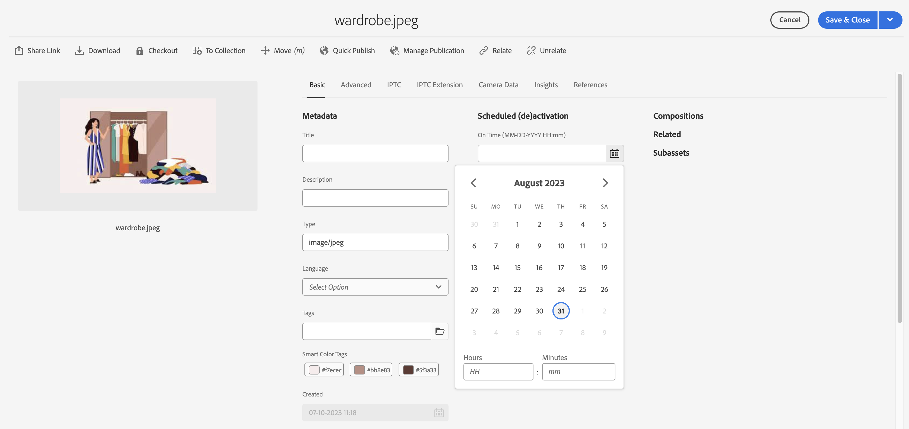

# Gerenciar ativos {#manage-assets}

| Versão | Link do artigo |
| -------- | ---------------------------- |
| AEM 6.5 | [Clique aqui](https://experienceleague.adobe.com/docs/experience-manager-65/assets/managing/manage-assets.html?lang=en) |
| AEM as a Cloud Service | Este artigo |

Este artigo descreve como gerenciar e editar ativos no [!DNL Adobe Experience Manager Assets]. Para gerenciar o [!DNL Content Fragments], consulte [[!DNL Content Fragments]](content-fragments/content-fragments.md) ativos.

## Criar pastas {#creating-folders}

Ao organizar uma coleção de ativos, por exemplo, todas as imagens do `Nature`, você pode criar pastas para mantê-las juntas. Você pode usar pastas para categorizar e organizar seus ativos. [!DNL Experience Manager Assets] não requer que você organize os ativos nas pastas para que funcionem melhor.

>[!NOTE]
>
>* Não há suporte para o compartilhamento de uma pasta Assets do tipo `sling:OrderedFolder` ao compartilhar com a Experience Cloud. Para compartilhar uma pasta, não selecione [!UICONTROL Ordenados] ao criar uma pasta.
>* A Experience Manager não permite usar a palavra `subassets` como o nome de uma pasta. É uma palavra-chave reservada para o nó que contém subativos para ativos compostos

1. Navegue até o local na pasta de ativos digitais em que deseja criar uma pasta. No menu, clique em **[!UICONTROL Criar]**. Selecione **[!UICONTROL Nova Pasta]**.
1. No campo **[!UICONTROL Título]**, forneça um nome de pasta. Por padrão, o DAM usa o título fornecido como o nome da pasta. Depois que a pasta for criada, você poderá substituir o padrão e especificar outro nome de pasta.
1. Clique em **[!UICONTROL Criar]**. Sua pasta é exibida na pasta de ativos digitais.

Os seguintes caracteres (lista separada por espaços de) não são suportados:

* Um nome de arquivo de ativo não pode conter nenhum destes caracteres: `* / : [ \\ ] | # % { } ? &`
* Um nome de pasta de ativos não pode conter nenhum destes caracteres: `* / : [ \\ ] | # % { } ? \" . ^ ; + & \t`

## Upload de ativos {#uploading-assets}

Consulte [adicionar ativos digitais ao Experience Manager](add-assets.md).

## Extrair arquivos ZIP {#extract-zip-archives}

Selecione arquivos ZIP gerenciados no Experience Manager e extraia os arquivos diretamente no Experience Manager sem baixá-los.

Para extrair os arquivos ZIP, execute as seguintes etapas:

1. Selecione o tipo de arquivo ZIP.
1. Clique na opção **[!UICONTROL Extrair Arquivo]**, disponível na barra de ações.
1. Selecione a pasta na qual você precisa salvar os ativos extraídos que estão disponíveis na pasta compactada.
1. Clique em **[!UICONTROL Avançar]**.
1. Selecione o comportamento apropriado para resolver conflitos de nome de arquivo durante a extração. É possível optar por criar uma versão de um ativo existente, substituir o ativo, manter ambos os ativos na pasta de destino ou ignorar a extração do novo ativo.
1. Clique em **[!UICONTROL Extrair]**. O processo de extração de zip é iniciado. Quando o processo estiver concluído, você poderá visualizar os ativos extraídos na pasta de destino.

   

   >[!NOTE]
   >
   >* O tamanho máximo de arquivo ZIP aceito é 15 GB.
   >* É possível extrair no máximo três arquivos ZIP de uma vez.

## Visualizar ativos {#previewing-assets}

Para visualizar um ativo, siga estas etapas.

1. Na interface do usuário do Assets, navegue até o local do ativo que deseja visualizar.
1. Selecione o ativo desejado para abri-lo.
1. No modo de visualização, as opções de zoom estão disponíveis para [tipos de imagem com suporte](/help/assets/file-format-support.md) (com edição interativa).

   Para ampliar um ativo, selecione `+` (ou selecione a lupa no ativo). Para reduzir, selecione `-`. Ao ampliar, você pode observar de perto qualquer área da imagem com um movimento panorâmico. A seta para redefinir zoom leva você de volta à exibição original.

   Selecione **[!UICONTROL Redefinir]** para redefinir o modo de exibição para o tamanho original.

## Editar propriedades {#editing-properties}

1. Navegue até o local do ativo cujos metadados você deseja editar.
1. Selecione o ativo e selecione **[!UICONTROL Propriedades]** na barra de ferramentas para exibir as propriedades do ativo. Como alternativa, escolha a ação rápida **[!UICONTROL Propriedades]** no cartão de ativos.

   

1. Na página [!UICONTROL Propriedades], edite as propriedades de metadados em várias guias. Por exemplo, na guia **[!UICONTROL Básico]**, edite o título, a descrição e assim por diante.

   >[!NOTE]
   >
   >O layout da página [!UICONTROL Propriedades] e as propriedades de metadados disponíveis dependem do esquema de metadados subjacente. Para saber como modificar o layout da página [!UICONTROL Propriedades], consulte [Esquemas de Metadados](/help/assets/metadata-schemas.md).

1. Para programar uma data/hora específica para a ativação do ativo, use o seletor de datas ao lado do campo **[!UICONTROL No horário]**.

   

1. Para desativar o ativo após uma duração específica, escolha a data/hora de desativação no seletor de datas ao lado do campo **[!UICONTROL Tempo de desativação]**. A data de desativação deve ser posterior à data de ativação de um ativo. Após o [!UICONTROL Tempo desligado], um ativo e suas representações não estarão disponíveis nem pela interface da Web do Assets nem pela API HTTP.

   <!---->

1. No campo **[!UICONTROL Marcas]**, selecione uma ou mais marcas. Para adicionar uma marca personalizada, digite o nome da marca na caixa e selecione a chave `Enter`. A nova marca foi salva em [!DNL Experience Manager].

   O YouTube exige que as tags sejam publicadas e tenham um link para o YouTube (se um link adequado puder ser encontrado).

   >[!NOTE]
   >
   >Para criar tags, você deve ter permissão de gravação no caminho `/content/cq:tags/default` no repositório do CRX.

1. Selecione **[!UICONTROL Salvar e fechar]**.
1. Navegue até a interface do usuário do Assets. As propriedades de metadados editadas, incluindo título, descrição e tags, são exibidas no cartão de ativos na exibição Cartão e em colunas relevantes na exibição em Lista.

<!-- TBD: Uncomment after verification for Dec release.

## View asset usage and references {#usage-and-references}

[!DNL Experience Manager] lets you track statistics about usage of a digital asset. The usage statistics include the following:

    * Number of times the asset was viewed or downloaded
    * Channels/devices through which the asset was used
    * Creative solutions where the asset was recently used

To view usage statistics for an asset, in the [!UICONTROL Properties] page, click the **[!UICONTROL Insights]** tab. For more details, see [Assets Insights](assets-insights.md).

[!DNL Experience Manager] also lets you check all the incoming references to an asset, that is, the usage of an asset in remote [!DNL Sites] and in compound assets. Authors of webpages on [!DNL Experience Manager Sites] deployment can use an asset on a remote [!DNL Assets] deployment using the Connected Assets functionality. The [!UICONTROL References] tab in an asset's [!UICONTROL Properties] page lists the local and remote references of the asset. That is, the use of assets in compound assets in [!DNL Assets] and its use in remote [!DNL Sites] pages.

-->

## Copiar ativos {#copying-assets}

Ao copiar um ativo ou uma pasta, o ativo inteiro ou a pasta é copiada, juntamente com sua estrutura de conteúdo. Um ativo ou uma pasta copiada é duplicada no local de destino. O ativo no local de origem não é alterado.

Alguns atributos exclusivos de uma cópia específica de um ativo não são transferidos. Alguns exemplos são:

* ID do ativo, data e hora de criação e versões e histórico de versões. Algumas dessas propriedades são indicadas pelas propriedades `jcr:uuid`, `jcr:created` e `cq:name`.

* O tempo de criação e os caminhos referenciados são exclusivos para cada ativo e cada representação.

As outras propriedades e informações de metadados são retidas. Uma cópia parcial não é criada ao copiar um ativo.

1. Na interface do usuário do Assets, selecione um ou mais ativos e, em seguida, selecione o ícone **[!UICONTROL Copiar]** na barra de ferramentas. Como alternativa, selecione a ação rápida **[!UICONTROL Copiar]**  no cartão de ativos.

   >[!NOTE]
   >
   >Se você usar a ação rápida [!UICONTROL Copiar], só será possível copiar um ativo de cada vez.

1. Navegue até o local onde deseja copiar os ativos.

   >[!NOTE]
   >
   >Se você copiar um ativo no mesmo local, [!DNL Experience Manager] automaticamente gera uma variação do nome. Por exemplo, se você copiar um ativo intitulado `Square`, [!DNL Experience Manager] gerará automaticamente o título para sua cópia como `Square1`.

1. Clique no ícone do ativo **[!UICONTROL Colar]**, na barra de ferramentas. As Assets são copiadas para este local.

   <!---->

   >[!NOTE]
   >
   >O ícone **[!UICONTROL Colar]** fica disponível na barra de ferramentas até que a operação de colagem seja concluída.

### Mover ou renomear ativos {#moving-or-renaming-assets}

1. Navegue até o local do ativo que deseja mover.

1. Selecione o ativo e o ícone **[!UICONTROL Mover]**  da barra de ferramentas.

1. No assistente Mover Assets, siga um destes procedimentos:

   * Especifique o nome do ativo depois que ele for movido. Em seguida, selecione **[!UICONTROL Avançar]** para continuar.

   * Selecione **[!UICONTROL Cancelar]** para parar o processo.

   >[!NOTE]
   >
   >* Você pode especificar o mesmo nome para o ativo se não houver um ativo com esse nome no novo local. No entanto, você deve usar um nome diferente se mover o ativo para um local onde exista um ativo com o mesmo nome. Se você usar o mesmo nome, o sistema gerará automaticamente uma variação do nome. Por exemplo, se o ativo tiver o nome Quadrado, o sistema gera o nome Quadrado1 para sua cópia.
   >* Ao renomear, não é permitido espaço em branco no nome do arquivo.

1. Na caixa de diálogo **[!UICONTROL Selecionar Destino]**, siga um destes procedimentos:

   * Navegue até o novo local dos ativos e selecione **[!UICONTROL Avançar]** para continuar.

   * Selecione **[!UICONTROL Voltar]** para retornar à tela **[!UICONTROL Renomear]**.

1. Se os ativos que estão sendo movidos tiverem páginas de referência, ativos ou coleções, a guia **[!UICONTROL Ajustar Referências]** será exibida ao lado da guia **[!UICONTROL Selecionar Destino]**.

   Siga um destes procedimentos na tela **[!UICONTROL Ajustar Referências]**:

   * Especifique as referências a serem ajustadas com base nos novos detalhes e selecione **[!UICONTROL Mover]** para continuar.

   * Na coluna **[!UICONTROL Ajustar]**, selecione/desmarque referências aos ativos.
   * Selecione **[!UICONTROL Voltar]** para retornar à tela **[!UICONTROL Selecionar destino]**.

   * Selecione **[!UICONTROL Cancelar]** para interromper a operação de movimentação.

   Se você não atualizar as referências, elas continuarão apontando para o caminho anterior do ativo. Se você ajustar as referências, elas serão atualizadas para o novo caminho do ativo.

### Gerenciar representações {#managing-renditions}

1. É possível adicionar ou remover representações de um ativo, exceto o original. Navegue até o local do ativo ao qual deseja adicionar ou remover representações.

1. Selecione o ativo para abrir sua página de ativos.

   <!---->

1. Selecione o ícone GlobalNav e selecione **[!UICONTROL Representações]** na lista.

   

1. No painel **[!UICONTROL Representações]**, exiba a lista de representações geradas para o ativo.

   

   >[!NOTE]
   >
   >Por padrão, [!DNL Experience Manager Assets] não exibe a representação original do ativo no modo de visualização. Se você for um administrador, poderá usar sobreposições para configurar o [!DNL Assets] para exibir representações originais no modo de visualização.

1. Selecione uma representação para exibir ou excluir a representação.

   **Excluindo uma representação**

   Selecione uma representação no painel **[!UICONTROL Representações]** e selecione o ícone **[!UICONTROL Excluir Representação]** na barra de ferramentas. As representações não podem ser excluídas em massa após a conclusão do processamento de ativos. Para ativos individuais, é possível remover representações manualmente da interface do usuário. Para vários ativos, você pode personalizar [!DNL Experience Manager] para excluir representações específicas ou excluir os ativos e recarregar os ativos excluídos.

   

   **Carregando uma nova representação**

   Navegue até a página de detalhes do ativo e selecione o ícone **[!UICONTROL Adicionar representação]** na barra de ferramentas para fazer upload de uma nova representação do ativo.

   <!---->

   >[!NOTE]
   >
   >Se você selecionar uma representação no painel **[!UICONTROL Representações]**, a barra de ferramentas alterará o contexto e exibirá somente as ações relevantes para a representação. As opções, como o ícone Fazer upload da representação, não são exibidas. Para exibir essas opções na barra de ferramentas, navegue até a página de detalhes do ativo.

   É possível configurar as dimensões da representação que deseja exibir na página de detalhes de um ativo de imagem ou vídeo. Com base nas dimensões especificadas, o Assets exibe a representação com as dimensões exatas ou mais próximas.

   Não é possível criar representações com os seguintes prefixos, pois eles são internos ao Adobe:

   * cq5

   * cqdam

   * cq5dam

   Para configurar as dimensões de representação de uma imagem no nível de detalhes do ativo, sobreponha o nó `renditionpicker` (`libs/dam/gui/content/assets/assetpage/jcr:content/body/content/content/items/assetdetail/items/col1/items/assetview/renditionpicker`) e configure o valor da propriedade largura. Configure o **[!UICONTROL tamanho (Longo) em KB]** da propriedade no lugar da largura para personalizar a representação na página Detalhes do ativo com base no tamanho da imagem. Para personalização baseada em tamanho, a propriedade `preferOriginal` atribui preferência ao original se o tamanho da representação correspondente for maior que o original.

   Da mesma forma, você pode personalizar a imagem da página de Anotação sobrepondo `libs/dam/gui/content/assets/annotate/jcr:content/body/content/content/items/content/renditionpicker`.

   <!---->

   Para configurar as dimensões de representação para um ativo de vídeo, navegue até o nó `videopicker` no repositório do CRX no local `/libs/dam/gui/content/assets/assetpage/jcr:content/body/content/content/items/assetdetail/items/col1/items/assetview/videopicker`, sobreponha o nó e edite a propriedade apropriada.

   >[!NOTE]
   >
   >As anotações de vídeo são suportadas somente em navegadores com formatos de vídeo compatíveis com o HTML5. Além disso, dependendo do navegador, diferentes formatos de vídeo são compatíveis. No entanto, o formato de vídeo MXF ainda não é compatível com anotações de vídeo.

## Excluir ativos {#delete-assets}

Para resolver ou remover as referências recebidas de outras páginas, atualize as referências relevantes antes de excluir um ativo.

Além disso, desative o botão Forçar exclusão usando uma sobreposição, para impedir que os usuários excluam os ativos referenciados e deixem links desfeitos.

1. Navegue até o local dos ativos que deseja excluir.

1. Selecione o ativo e clique em **[!UICONTROL Excluir]**  da barra de ferramentas.

1. Na caixa de diálogo de confirmação, clique em:

   * **[!UICONTROL Cancelar]** para parar a ação
   * Clique em **[!UICONTROL Excluir]** para confirmar a ação:

      * Se o ativo não tiver referências, o ativo é excluído.
      * Se o ativo tiver referências, uma mensagem de erro informará que **[!UICONTROL Um ou mais ativos são referenciados]**. Você pode selecionar **[!UICONTROL Forçar Exclusão]** ou **[!UICONTROL Cancelar]**.

   >[!NOTE]
   >
   >Você precisa de permissões de exclusão em dam/asset para poder excluir um ativo. Se você só tiver permissões de modificação, poderá editar os metadados do ativo e adicionar anotações ao ativo. No entanto, não é possível excluir o ativo ou seus metadados.

   >[!NOTE]
   >
   >Para resolver ou remover as referências recebidas de outras páginas, atualize as referências relevantes antes de excluir um ativo. Você pode não permitir a exclusão de ativos referenciados, pois ela causa links desfeitos. Desative o botão forçar exclusão usando uma sobreposição.

## Baixar ativos {#download-assets}

Consulte [baixar ativos de [!DNL Experience Manager]](/help/assets/download-assets-from-aem.md).

## Publicar ou cancelar a publicação de ativos {#publish-assets}

1. Navegue até o local do ativo ou da pasta de ativos que deseja publicar ou remover do ambiente de publicação (cancelar publicação).

1. Selecione o ativo ou a pasta para publicar ou desfazer a publicação e selecione a opção **[!UICONTROL Gerenciar publicação]**  na barra de ferramentas. Como alternativa, para publicar rapidamente, selecione a opção **[!UICONTROL Publicação rápida]** na barra de ferramentas. Se a pasta que você deseja publicar incluir uma pasta vazia, ela não será publicada.

1. Selecione a opção **[!UICONTROL Publicar]** ou **[!UICONTROL Cancelar publicação]**, conforme necessário.

   
   *Figura: as opções Publicar e desfazer a publicação e a opção de agendamento.*

1. Selecione **[!UICONTROL Agora]** para atuar no ativo imediatamente ou selecione **[!UICONTROL Mais tarde]** para agendar a ação. Selecione uma data e hora se você escolher a opção **[!UICONTROL Mais tarde]**. Clique em **[!UICONTROL Avançar]**.

1. Ao publicar, se um ativo fizer referência a outros ativos, suas referências serão listadas no assistente. Somente essas referências são exibidas, não publicadas ou modificadas desde a última publicação. Escolha as referências que deseja publicar.

1. Ao desfazer a publicação, se um ativo fizer referência a outros ativos, escolha as referências que deseja desfazer a publicação. Clique em **[!UICONTROL Desfazer a publicação]**. Na caixa de diálogo de confirmação, clique em **[!UICONTROL Cancelar]** para interromper a ação ou em **[!UICONTROL Cancelar publicação]** para confirmar se a publicação dos ativos será desfeita na data especificada.

Entenda as seguintes limitações e dicas relacionadas à publicação ou ao cancelamento da publicação de ativos ou pastas:

* A opção [!UICONTROL Gerenciar Publicação] está disponível somente para as contas de usuário que têm permissões de replicação.
* Ao desfazer a publicação de um ativo complexo, cancele a publicação somente do ativo. Evite desfazer a publicação das referências, pois elas podem ser referenciadas por outros ativos publicados.
* Pastas vazias não são publicadas.
* Se você publicar um ativo que está sendo processado, somente o conteúdo original será publicado. As representações estão ausentes. Aguarde a conclusão do processamento e publique ou republique o ativo depois que o processamento for concluído.

## Grupo de usuários fechado {#closed-user-group}

Um grupo de usuários fechado (CUG) é usado para limitar o acesso a pastas de ativos específicas publicadas de [!DNL Experience Manager]. Se você criar um CUG para uma pasta, o acesso à pasta (incluindo ativos e subpastas da pasta) será restrito somente aos membros ou grupos atribuídos. Para acessar a pasta, é necessário fazer logon usando suas credenciais de segurança.

Os CUGs são uma maneira extra de restringir o acesso aos seus ativos. Você também pode configurar uma página de logon para a pasta.

1. Selecione uma pasta na interface do usuário do Assets e selecione o ícone Propriedades na barra de ferramentas para exibir a página de propriedades.
1. Na guia **[!UICONTROL Permissões]**, adicione membros ou grupos em **[!UICONTROL Grupo de usuários fechado]**.

   

1. Para exibir uma tela de logon quando os usuários acessarem a pasta, selecione a opção **[!UICONTROL Habilitar]**. Em seguida, selecione o caminho para uma página de logon em [!DNL Experience Manager] e salve as alterações.

   

   >[!NOTE]
   >
   >Se você não especificar o caminho para uma página de logon, [!DNL Experience Manager] exibirá a página de logon padrão na instância de publicação.

1. Publique a pasta e tente acessá-la a partir da instância de publicação. Uma tela de logon é exibida.
1. Se você for um membro CUG, digite suas credenciais de segurança. A pasta é exibida depois que [!DNL Experience Manager] autentica você.

## Pesquisar ativos {#search-assets}

A pesquisa de ativos é essencial para o uso de um sistema de gerenciamento de ativos digitais — seja para uso posterior por criadores, para o gerenciamento robusto de ativos por usuários empresariais e profissionais de marketing ou para administração por administradores de DAM.

Para pesquisas simples, avançadas e personalizadas para descobrir e usar os ativos mais apropriados, consulte [pesquisar ativos em [!DNL Experience Manager]](/help/assets/search-assets.md).

## Ações rápidas {#quick-actions}

Os ícones de ação rápida estão disponíveis para um único ativo de cada vez. Dependendo do dispositivo, execute as seguintes ações para exibir os ícones de ação rápida:

* Dispositivos de toque: toque e segure. Por exemplo, em uma iPad, é possível selecionar e manter um ativo para que as ações rápidas sejam exibidas.
* Dispositivos sem toque: passe o ponteiro do mouse. Por exemplo, em um dispositivo de desktop, a barra de ação rápida é exibida se você passar o ponteiro do mouse sobre a miniatura do ativo.

<!-- Hiding this topic via cqdoc-18707

## Edit images {#editing-images}

The editing tools in the [!DNL Experience Manager Assets] interface let you perform small editing jobs on image assets. You can crop, rotate, flip, and perform other editing jobs on images. You can also add image maps to assets.

>[!NOTE]
>
>For some components, the Full Screen mode has additional options available.

1. Do one of the following to open an asset in edit mode:

    * Select the asset and then select the **[!UICONTROL Edit]** icon in the toolbar.
    * Select the **[!UICONTROL Edit]** icon that appears on an asset in the Card view.
    * In the asset page, select the **[!UICONTROL Edit]** icon in the toolbar.

   

1. To crop the image, select the **Crop** icon.

   

1. Select the desired option from the list. The crop area appears on the image based on the option you choose. The **Free Hand** option lets you crop the image without any aspect ratio restrictions.

   

1. Select the area to be cropped, and resize or reposition it on the image.
1. Use the **Finish** icon (top right corner) to crop the image. Clicking the **Finish** icon also triggers the regeneration of renditions.

   

1. Use the **Undo** and **Redo** icons on the top right to revert to the uncropped image or retain the cropped image, respectively.

   

1. Select the appropriate Rotate icon to rotate the image clockwise or anti-clockwise.

   

1. Select the appropriate Flip icon to flip the image horizontally or vertically.

   

1. Select the **Finish** icon to save the changes.

   

>[!NOTE]
>
>Image editing is supported for BMP, GIF, PNG, and JPEG files formats.

>[!NOTE]
>
>To edit a TXT file, set **Day CQ Link Externalizer** from Configuration Manager.
-->

## Linha do tempo {#timeline}

A linha do tempo permite exibir vários eventos para um item selecionado, como fluxos de trabalho ativos para um ativo, comentários/anotações, logs de atividades e versões.


*Figura: Classificar entradas da linha do tempo de um ativo*

>[!NOTE]
>
>No [console Coleções](/help/assets/manage-collections.md#navigate-the-collections-console), a lista **[!UICONTROL Mostrar tudo]** fornece opções somente para exibir comentários e fluxos de trabalho. Além disso, a linha do tempo é exibida somente para coleções de nível superior listadas no console. Ela não será exibida se você navegar dentro de qualquer uma das coleções.

>[!NOTE]
>
>A linha do tempo contém várias [opções específicas para fragmentos de conteúdo](content-fragments/content-fragments.md).

## Anotar ativos {#annotating}

Anotações são comentários ou notas explicativas adicionados a imagens ou vídeos. As anotações fornecem aos profissionais de marketing a capacidade de colaborar e deixar comentários sobre os ativos.

As anotações de vídeo são suportadas apenas em navegadores com formatos de vídeo compatíveis com o HTML5. Os formatos de vídeo compatíveis com o Assets dependem do navegador. No entanto, o formato de vídeo MXF ainda não é compatível com anotações de vídeo.

>[!NOTE]
>
>Para fragmentos de conteúdo, [as anotações são criadas no editor de fragmento](content-fragments/content-fragments.md).

1. Navegue até o local do ativo ao qual deseja adicionar anotações.
1. Selecione o ícone **[!UICONTROL Anotar]** de um dos seguintes:

   * [Ações rápidas](#quick-actions)
   * Na barra de ferramentas, depois de selecionar o ativo ou navegar até a página do ativo

   <!---->

1. Adicione um comentário na caixa **[!UICONTROL Comentário]** na parte inferior da linha do tempo. Como alternativa, marque uma área na imagem e adicione uma anotação na caixa de diálogo **[!UICONTROL Adicionar anotação]**.

<!-- -->

<!--
1. To notify a user about an annotation, specify the email address of the user and add the comment. For example, to notify Aaron MacDonald about an annotation, enter @aa. Hints for all matching users is displayed in a list. Select Aaron's email address from the list to tag her with the comment. Similarly, you can tag more users anywhere within the annotation or before or after it.
-->

>[!NOTE]
>
>Para um usuário não administrador, as sugestões serão exibidas somente se o usuário tiver permissões de Leitura em `/home` no CRXDE.

<!---->

1. Depois de adicionar a anotação, clique em **[!UICONTROL Adicionar]** para salvá-la. Uma notificação para a anotação é enviada a Aaron.

   <!---->

   >[!NOTE]
   >
   >É possível adicionar várias anotações antes de salvá-las.

1. Selecione **[!UICONTROL Fechar]** para sair do modo de Anotação.
1. Para exibir a notificação, faça logon no Assets com as credenciais de Aaron MacDonald e clique no ícone **[!UICONTROL Notificações]** para exibir a notificação.

   >[!NOTE]
   >
   >As anotações também podem ser adicionadas a ativos de vídeo. Ao anotar vídeos, o reprodutor faz uma pausa para permitir que você faça anotações em um quadro. Para obter detalhes, consulte [gerenciamento de ativos de vídeo](manage-video-assets.md). No entanto, o formato de vídeo MXF ainda não é compatível com anotações de vídeo.

1. Para escolher uma cor diferente para diferenciar os usuários, selecione o ícone Perfil e selecione **[!UICONTROL Minhas Preferências]**.

   <!---->

   Especifique a cor desejada na caixa **[!UICONTROL Cor da anotação]** e selecione **[!UICONTROL Aceitar]**.

<!-- -->

>[!NOTE]
>
>Também é possível adicionar anotações a uma coleção. No entanto, se uma coleção contiver coleções secundárias, você poderá adicionar anotações/comentários somente à coleção principal. A opção Anotar não está disponível para coleções secundárias.

### Exibir anotações salvas {#viewing-saved-annotations}

Você pode exibir somente uma anotação por vez.

>[!NOTE]
>
>Se você estiver selecionando várias anotações, a anotação mais recente estará visível na interface.
>
>A seleção múltipla é compatível somente com a impressão do ativo anotado como PDF.

1. Para visualizar as anotações salvas de um ativo, navegue até o local do ativo e abra a página do ativo.

1. Selecione o ícone GlobalNav e escolha **[!UICONTROL Linha do tempo]** na lista.

   <!---->

1. Na lista **[!UICONTROL Exibir todos]** na linha do tempo, selecione **[!UICONTROL Comentários]** para filtrar os resultados com base em anotações.

   <!---->

   Selecione um comentário no painel **[!UICONTROL Linha do tempo]** para exibir a anotação correspondente na imagem.

   <!---->

   Selecione **[!UICONTROL Excluir]** para excluir um comentário específico.

### Imprimir anotações {#printing-annotations}

Se um ativo tiver anotações ou tiver sido sujeito a um fluxo de trabalho de revisão, você poderá imprimir o ativo junto com as anotações e o status da revisão como um arquivo do PDF para revisão offline.

Também é possível optar por imprimir somente as anotações ou o status da revisão.

>[!NOTE]
>
>É possível selecionar várias anotações ao imprimir o ativo anotado como PDF.

Para imprimir as anotações e revisar o status, selecione o ícone **[!UICONTROL Imprimir]** e siga as instruções do assistente. O ícone **[!UICONTROL Imprimir]** aparece na barra de ferramentas somente quando o ativo tem pelo menos uma anotação ou status de revisão atribuído a ele.

1. Na interface do usuário do Assets, abra a página de visualização de um ativo.
1. Siga uma das seguintes opções:

   * Para imprimir todas as anotações e o status da revisão, ignore a etapa 3 e vá diretamente para a etapa 4.
   * Para imprimir anotações específicas e revisar o status, abra a [linha do tempo](/help/assets/manage-digital-assets.md#timeline) e vá para a etapa 3.

1. Para imprimir anotações específicas, selecione as anotações na linha do tempo.

   <!---->

   Para imprimir somente o status da revisão, selecione-o na linha do tempo.

   <!---->

1. Selecione o ícone **[!UICONTROL Imprimir]** na barra de ferramentas.

   <!---->

1. Na caixa de diálogo Imprimir, escolha a posição em que deseja que o status das anotações/revisões seja exibido no PDF. Por exemplo, se você quiser que as anotações/status sejam impressas no canto superior direito da página que contém a imagem impressa, use a configuração **Canto superior esquerdo**. Ela é selecionada por padrão.

   <!---->

   É possível escolher outras configurações, dependendo da posição em que deseja que as anotações/status apareçam no PDF impresso. Se desejar que as anotações/status apareçam em uma página separada do ativo impresso, escolha **[!UICONTROL Próxima página]**.

1. Clique em **[!UICONTROL Imprimir]**. Dependendo da opção escolhida na etapa 2, o PDF gerado exibirá as anotações/os status na posição especificada. Por exemplo, se optar por imprimir as anotações e o status da revisão usando a configuração **Superior esquerdo**, o resultado será semelhante ao arquivo PDF mostrado aqui.

   <!---->

1. Baixe ou imprima a PDF usando as opções no canto superior direito.

   <!---->

   Para modificar a aparência do arquivo PDF renderizado, por exemplo, a cor da fonte, o tamanho e o estilo, a cor do plano de fundo dos comentários e status, abra a **[!UICONTROL Configuração de PDF de Anotação]** no Configuration Manager e modifique as opções desejadas. Por exemplo, para alterar a cor de exibição do status de aprovado, modifique o código de cor no campo correspondente. Para obter informações sobre como alterar a cor da fonte das anotações, consulte [Anotação](/help/assets/manage-digital-assets.md#annotating).

   Retorne ao arquivo PDF renderizado e atualize-o. A PDF atualizada reflete as alterações feitas.

## Controle de versão de ativos {#asset-versioning}

O controle de versão cria um instantâneo dos ativos digitais em um ponto específico do tempo. O controle de versão ajuda a restaurar ativos para um estado anterior em um momento posterior. Por exemplo, se você deseja desfazer uma alteração feita em um ativo, restaure a versão não editada do ativo.

Veja a seguir os cenários em que você cria versões:

* Você modifica uma imagem em um aplicativo diferente e faz upload para o Assets. Uma versão da imagem é criada para que a imagem original não seja substituída.
* Edite os metadados de um ativo.
* Você usa o aplicativo de desktop [!DNL Experience Manager] para fazer check-out de um ativo existente e salvar suas alterações. Uma nova versão é criada sempre que o ativo é salvo.

Você também pode ativar o controle automático de versão por meio de um fluxo de trabalho. Ao criar uma versão para um ativo, os metadados e as representações são salvos junto com a versão. As representações são alternativas renderizadas das mesmas imagens, por exemplo, uma representação PNG de um arquivo JPEG carregado.

A funcionalidade de controle de versão permite que você faça o seguinte:

* Crie uma versão de um ativo.
* Exibir a revisão atual de um ativo.
* Restaurar o ativo para uma versão anterior.

1. Navegue até o local do ativo para o qual deseja criar uma versão e selecione-o para abrir sua página de ativo.

1. Selecione o ícone GlobalNav e escolha **[!UICONTROL Linha do tempo]** no menu.

   

1. Selecione o ícone **[!UICONTROL Ações]** (seta) na parte inferior para exibir as ações disponíveis que você pode executar no ativo.

   <!---->

1. Selecione **[!UICONTROL Salvar como versão]** para criar uma versão para o ativo.

<!---->

1. Adicione um rótulo e um comentário e clique em **[!UICONTROL Criar]** para criar uma versão. Como alternativa, selecione **Cancelar** para sair da operação.

   <!---->

1. Para exibir a nova versão, abra a lista **[!UICONTROL Mostrar tudo]** na linha do tempo da página Detalhes do ativo ou na interface do usuário do Assets e escolha **[!UICONTROL Versões]**. Todas as versões criadas para um ativo são listadas na guia Linha do tempo. Filtre a lista para mostrar Versões ao clicar na seta suspensa e selecionar **[!UICONTROL Versões]** na lista.

   

1. Selecione uma versão específica do ativo para visualizá-lo ou habilite sua exibição na interface do usuário do Assets.

   

1. Adicione um rótulo e comentário para a versão a ser revertida para a versão específica na interface do usuário do Assets.

   

1. Para gerar uma visualização da versão, selecione **[!UICONTROL Visualizar Versão]**.
1. Para exibir esta versão na interface do usuário do Assets, selecione **[!UICONTROL Reverter para esta Versão]**.
1. Para comparar entre duas versões, vá para a página do ativo e selecione a versão a ser comparada com a versão atual.

   

1. Na linha do tempo, selecione a versão que deseja comparar e arraste o controle deslizante para a esquerda para sobrepor essa versão à versão atual e compare.

   

### Iniciar um fluxo de trabalho em um ativo {#starting-a-workflow-on-an-asset}

1. Navegue até o local do ativo para o qual deseja iniciar um fluxo de trabalho e selecione o ativo para abrir a página do ativo.
1. Selecione o ícone GlobalNav e escolha **[!UICONTROL Linha do tempo]** no menu para exibir a linha do tempo.

   

1. Selecione o ícone **[!UICONTROL Ações]** (seta) na parte inferior para abrir a lista de ações disponíveis para o ativo.

   <!---->

1. Selecione **[!UICONTROL Iniciar Fluxo de Trabalho]** na lista.

   <!---->

1. Na caixa de diálogo **[!UICONTROL Iniciar Fluxo de Trabalho]**, selecione um modelo de fluxo de trabalho da lista.

   <!---->

1. (Opcional) Especifique um título para o workflow, que pode ser usado para fazer referência à instância do workflow.

   <!---->

1. Selecione **[!UICONTROL Iniciar]** e **[!UICONTROL Prosseguir]** na caixa de diálogo para confirmar. Cada etapa do fluxo de trabalho é exibida na linha do tempo como um evento.

   <!---->

## Coleções {#collections}

Uma coleção é um conjunto ordenado de ativos. Use coleções para compartilhar ativos entre usuários.

* Uma coleção pode incluir ativos de locais diferentes, pois eles contêm apenas referências a esses ativos. Cada coleção mantém a integridade referencial dos ativos.
* Você pode compartilhar coleções com vários usuários com diferentes níveis de privilégio, incluindo edição, visualização e assim por diante.

Para saber detalhes do Gerenciamento de coleções, consulte [gerenciar coleções](/help/assets/manage-collections.md).

## Ocultar ativos expirados ao visualizar ativos no aplicativo de desktop ou no Adobe Asset Link {#hide-expired-assets-via-acp-api}

O aplicativo de desktop [!DNL Experience Manager] permite acesso ao repositório DAM a partir da área de trabalho do Windows ou Mac. O Adobe Asset Link permite o acesso a ativos de dentro dos aplicativos de desktop [!DNL Creative Cloud] compatíveis.

Ao navegar pelos ativos na interface do usuário do [!DNL Experience Manager], os ativos expirados não são exibidos. Para impedir a visualização, pesquisa e busca de ativos expirados ao navegar pelos ativos do aplicativo de desktop e do Asset Link, os administradores podem fazer a seguinte configuração. A configuração funciona para todos os usuários, independentemente do privilégio de administrador.

Execute o seguinte comando CURL. Garanta o acesso de leitura em `/conf/global/settings/dam/acpapi/` para os usuários que acessam ativos. Os usuários que fazem parte do grupo `dam-user` têm a permissão por padrão.

```curl
curl -v -u admin:admin --location --request POST 'http://localhost:4502/conf/global/settings/dam/acpapi/configuration/_jcr_content' \
--header 'Content-Type: application/x-www-form-urlencoded' \
--data-urlencode 'jcr:title=acpapiconfig' \
--data-urlencode 'hideExpiredAssets=true' \
--data-urlencode 'hideExpiredAssets@TypeHint=Boolean' \
--data-urlencode 'jcr:primaryType=nt:unstructured' \
--data-urlencode '../../jcr:primaryType=sling:Folder'
```

Para saber mais, veja como [navegar pelos ativos DAM usando o aplicativo de desktop](https://experienceleague.adobe.com/docs/experience-manager-desktop-app/using/using.html#browse-search-preview-assets) e [como usar o Adobe Asset Link](https://helpx.adobe.com/enterprise/admin-guide.html/enterprise/using/manage-assets-using-adobe-asset-link.ug.html).

**Consulte também**

* [Traduzir ativos](translate-assets.md)
* [API HTTP de ativos](mac-api-assets.md)
* [Formatos de arquivo compatíveis com os ativos](file-format-support.md)
* [Pesquisar ativos](search-assets.md)
* [Ativos conectados](use-assets-across-connected-assets-instances.md)
* [Relatórios de ativos](asset-reports.md)
* [Esquemas de metadados](metadata-schemas.md)
* [Baixar ativos](download-assets-from-aem.md)
* [Gerenciar metadados](manage-metadata.md)
* [Pesquisar aspectos](search-facets.md)
* [Gerenciar coleções](manage-collections.md)
* [Importação de metadados em massa](metadata-import-export.md)
* [Publicar o Assets no AEM e no Dynamic Media](/help/assets/publish-assets-to-aem-and-dm.md)
