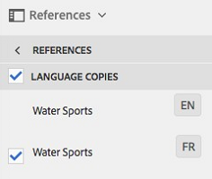

# Gerenciamento de ativos compostos {#managing-compound-assets}

Os ativos Adobe Experience Manager (AEM) podem identificar se um arquivo carregado contém referências a ativos que já existem no repositório. Este recurso está disponível somente para formatos de arquivo suportados. Se o ativo carregado contiver referências a ativos AEM, um link bidirecional será criado entre os ativos carregados e referenciados.

Além de eliminar a redundância, a referência aos ativos AEM nos aplicativos da Adobe Creative Cloud melhora a colaboração e aumenta a eficiência e a produtividade dos usuários.

Os ativos AEM oferecem suporte para referência **bidirecional**. Você pode encontrar ativos referenciados na página de detalhes do ativo do arquivo carregado. Além disso, você pode exibir os arquivos de referência para ativos AEM na página de detalhes do ativo referenciado.

As referências são resolvidas com base no caminho, na ID do documento e na ID da instância dos ativos referenciados.

## Adicionar ativos AEM como referências no Adobe Illustrator {#refai}

Você pode fazer referência a ativos AEM existentes em um arquivo do Adobe Illustrator.

1. Usando o aplicativo AEM para desktop, monte o repositório AEM Assets como uma unidade em sua máquina local. Na unidade montada, navegue até o local do ativo que deseja referenciar.
1. Arraste o ativo da unidade montada para o arquivo do Illustrator.
1. Salve o arquivo do Illustrator na unidade montada ou [carregue](/help/assets/manage-digital-assets.md#uploading-assets) no repositório do AEM.
1. Após a conclusão do fluxo de trabalho, vá para a página de detalhes do ativo do ativo. As referências aos ativos AEM existentes estão listadas em **Dependências** na coluna **Referências** .

   

1. Os ativos referenciados que aparecem em **Dependências** também podem ser referenciados por arquivos diferentes do atual. Para exibir uma lista de arquivos de referência para um ativo, clique no ativo em **Dependências**.

   

1. Clique no ícone **Exibir propriedades** na barra de ferramentas. Na página de propriedades, a lista de arquivos que fazem referência ao ativo atual é exibida na coluna **Referências** da guia **Básico** .

   

## Adicionar ativos AEM como referências no Adobe InDesign {#add-aem-assets-as-references-in-adobe-indesign}

Para referenciar ativos AEM de um arquivo do InDesign, arraste os ativos AEM para o arquivo do InDesign ou exporte o arquivo do InDesign como um arquivo ZIP.

Os ativos referenciados já existem nos ativos AEM. <!-- You can extract subassets by [configuring InDesign server](/help/assets/indesign.md). Embedded assets in an InDesign file are extracted as subassets. -->

>[!NOTE]
>
>Se o servidor do InDesign for proxy, os arquivos do InDesign terão sua visualização incorporada aos metadados XMP. Nesse caso, a extração de miniaturas não é explicitamente necessária. No entanto, se o servidor do InDesign não tiver proxy, as miniaturas deverão ser explicitamente extraídas para arquivos do InDesign.

### Criar referências arrastando ativos AEM {#create-references-by-dragging-aem-assets}

Esse procedimento é semelhante a [Adicionar ativos AEM como referências no Adobe Illustrator](#refai).

### Criar referências a ativos AEM exportando um arquivo ZIP {#create-references-to-aem-assets-by-exporting-a-zip-file}

1. Crie um novo modelo de fluxo de trabalho.
1. Use o recurso Pacote do Adobe InDesign para exportar o documento.
O Adobe InDesign pode exportar um documento e os ativos vinculados como um pacote. Nesse caso, a pasta exportada contém uma pasta Links que contém subativos no arquivo do InDesign.
1. Crie um arquivo ZIP e carregue-o no repositório do AEM.
1. Inicie o fluxo de trabalho do Unarchiver.
1. Quando o fluxo de trabalho é concluído, as referências na pasta Links são automaticamente mencionadas como subativos. Para exibir uma lista de ativos referenciados, navegue até a página de detalhes do ativo do InDesign e feche o [Painel](/help/sites-cloud/authoring/getting-started/basic-handling.md#rail-selector).

## Adicionar ativos AEM como referências no Adobe Photoshop {#refps}

1. Usando um cliente WebDav, monte os ativos AEM como uma unidade.
1. Para criar referências a ativos AEM em um arquivo do Photoshop, navegue até os ativos correspondentes na unidade montada usando a funcionalidade Colocar vinculado no Photoshop.

   

1. Salve o arquivo do Photoshop na unidade montada ou [carregue](/help/assets/manage-digital-assets.md#uploading-assets) no repositório do AEM.
1. Após a conclusão do fluxo de trabalho, as referências aos ativos AEM existentes são listadas na página de detalhes do ativo.

   Para exibir os ativos referenciados, feche o [Painel](/help/sites-cloud/authoring/getting-started/basic-handling.md#rail-selector) na página de detalhes do ativo.

1. Os ativos referenciados também contêm a lista de ativos dos quais são referenciados. Para exibir uma lista de ativos referenciados, navegue até a página de detalhes do ativo e feche o [Painel](/help/sites-cloud/authoring/getting-started/basic-handling.md#rail-selector).

>[!NOTE]
>
>Os ativos em ativos compostos também podem ser referenciados com base na ID do documento e na ID da instância. Essa funcionalidade está disponível somente nas versões do Adobe Illustrator e do Adobe Photoshop. Para outros, a referência é feita com base no caminho relativo dos ativos vinculados no ativo composto principal, conforme feito em versões anteriores do AEM.

## Exibir páginas de um arquivo de várias páginas {#view-pages-of-a-multi-page-file}

O recurso Visualizador de página dos ativos AEM permite exibir páginas individuais de arquivos de várias páginas, incluindo arquivos PDF, INDD, PPT, PPTX e Ai. Para o InDesign, é possível extrair páginas usando o servidor do InDesign. Se as visualizações das páginas forem salvas durante a criação do arquivo do InDesign, o InDesign Server não será necessário para a extração da página.

Você pode navegar por páginas individuais de um arquivo a partir da página do ativo. Você pode usar opções da barra de ferramentas para anotar páginas individuais do arquivo. Você também pode usar a opção Visão geral **da** página para exibir todas as páginas simultaneamente.

1. Navegue até a pasta nos ativos AEM que contém o arquivo de várias páginas.
1. Clique no ativo para exibir a página do ativo.

   

1. Clique no ícone Navegação global e escolha **Páginas** no menu.

   

1. Clique nas setas para a esquerda ou para a direita abaixo da imagem para navegar até páginas individuais do arquivo.

   

1. Para anotar uma página, clique no ícone **Anotar** na barra de ferramentas e adicione um comentário.

   

1. Para baixar o arquivo, clique no ícone **Download** .

   

1. Para exibir todas as páginas do arquivo simultaneamente, clique no ícone Visão geral **da** página.

   

1. Para exibir o fluxo de atividade do arquivo, incluindo anotações e downloads, clique no ícone de Navegação global e escolha **Linha** do tempo no menu.

   

1. Para exibir e editar as propriedades de metadados da página, clique no ícone Propriedades **da** exibição na barra de ferramentas.

   
