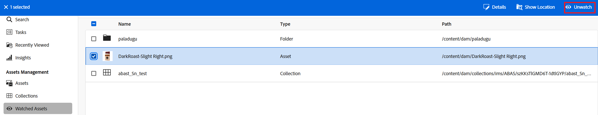

# Monitorar ativos, pastas e coleções {#watch-assets-folders}

As notificações de exibição do Assets permitem monitorar as operações realizadas nos ativos, pastas ou coleções disponíveis no repositório. Você precisa selecionar e assinar o conteúdo sobre o qual deseja receber notificações. Você também pode configurar as categorias para as quais receberá notificações.

## Assinar categorias de notificação {#subscribe-to-notification-categories}

Você pode assinar e escolher dentre uma lista de categorias para as quais receberá notificações. A visualização Assets envia notificações somente para as categorias selecionadas dentre as opções disponíveis:

<table>
    <tbody>
     <tr>
      <th><strong>Categoria de notificação</strong></th>
      <th><strong>Descrição</strong></th>
     </tr>
     <tr>
      <td>Solicitações</td>
      <td>Ao atribuir uma tarefa a um usuário, você recebe notificações quando esse usuário executa ações nessa tarefa.</td>
     </tr>
     <tr>
      <td>Atribuído a mim</td>
      <td>Você recebe uma notificação quando há uma tarefa atribuída a você por outro usuário.</td>
     </tr>
     <tr>
      <td>Comentário sobre o conteúdo assinado</td>
      <td>Você recebe uma notificação quando um usuário comenta no ativo que você assinou.</td>
     </tr>
     <tr>
      <td>Exclusão do conteúdo assinado</td>
      <td>Você recebe uma notificação quando um usuário exclui o ativo, pasta ou coleção que você assinou.</td>
     </tr>
     <tr>
      <td>Compartilhamento externo do conteúdo assinado</td>
      <td>Você recebe uma notificação quando um usuário gera um link público para o ativo, pasta ou coleção que você assinou.</td>
     </tr>
     <tr>
      <td>Modificação do conteúdo assinado</td>
      <td>Você recebe uma notificação quando um usuário cria uma nova versão do ativo que você assinou.</td>
     </tr>
     <tr>
      <td>Mover/renomear o conteúdo assinado</td>
      <td>Você recebe uma notificação quando um usuário move ou renomeia o ativo ou pasta que você assinou.</td>
     </tr>
     <tr>
      <td>Atualizações em pastas e coleções assinadas</td>
      <td>Você recebe uma notificação quando um usuário adiciona ou remove um ativo de uma pasta ou coleção que você assinou.</td>
     </tr>    
    </tbody>
   </table>

Para assinar as categorias de notificação:

1. Clique em  na extremidade direita da barra de menus da interface de usuário do Assets View.

1. Clique no  para visualizar a página [!UICONTROL Preferências da Experience Cloud].

1. Clique na opção **[!UICONTROL Notificações]** disponível no painel esquerdo.

1. Na seção **[!UICONTROL Notificações]**, navegue até a seção [!UICONTROL Modo de Exibição do Assets] e verifique se a opção está definida como ATIVADO.

   

1. Clique em **[!UICONTROL Personalizar]** para visualizar as categorias de notificação.
   

1. Selecione as categorias de notificação sobre as quais você precisa ser notificado.

## Observar e deixar de observar pastas, ativos ou coleções {#watch-unwatch-assets}

É possível observar e deixar de observar pastas, ativos ou coleções para se manter informado, permitindo uma melhor colaboração em torno dos ativos que você está monitorando.

Depois de [assinar as categorias de notificação](#subscribe-to-notification-categories), você deve assinar o conteúdo para começar a receber notificações.

>[!NOTE]
>
>* Para as categorias de notificação **[!UICONTROL Solicitações]** e **[!UICONTROL Atribuído a mim]**, não é necessário assinar o conteúdo após ter assinado as categorias de notificação. Você recebe notificações automaticamente sobre solicitações que criou e quando uma tarefa é atribuída a você.
>* A exibição do Assets envia notificações somente quando outros usuários executam ações no conteúdo assinado. Você não recebe notificações para ações que você executou no conteúdo assinado.

### Assinar o conteúdo {#subscribe-to-content}

Siga estas etapas para assinar pastas, ativos ou coleções:

1. Navegue pela pasta, ativo ou coleção que você deseja assinar e clique em **[!UICONTROL Observar]**.

1. A visualização Assets exibe uma mensagem de sucesso. Você pode clicar em **[!UICONTROL Ir para preferências de notificação]** na mensagem de êxito para editar sua [assinatura de categorias de notificação](#subscribe-to-notification-categories).

   

A visualização do Assets agora enviará notificações para as categorias que você assinou. Você também pode selecionar vários ativos, pastas ou coleções e clicar em **[!UICONTROL Observar]** para economizar tempo. No entanto, se você selecionar vários itens e alguns já tiverem assinado, a opção **[!UICONTROL Observar]** não será exibida.

### Exibir conteúdo da inscrição {#view-subscribed-content}

Para exibir o conteúdo assinado, siga estas etapas:

1. Navegue até **[!UICONTROL Assets]** assistido em [!UICONTROL Gerenciamento de ativos].

1. A visualização Assets exibe uma lista de ativos inscritos, incluindo nome, tipo e caminho. Selecione um ativo, pasta ou coleção na lista para exibir seus detalhes, local ou para [cancelar a inscrição](#unsubscribe-to-content).

   

### Exibir assinantes de conteúdo {#view-content-subscribers}

Para exibir seus assinantes de conteúdo, siga estas etapas:

1. Navegue pela pasta, ativo ou coleção e selecione **[!UICONTROL Detalhes]**.

1. Clique no olho no painel direito para ver uma lista de observadores do conteúdo.

   Como alternativa, clique em  no painel direito para ver os observadores de conteúdo.

### Cancelar inscrição no conteúdo {#unsubscribe-to-content}

Para cancelar a inscrição:

1. Vá para **[!UICONTROL Assets assistido]** em [!UICONTROL Gerenciamento de ativos].

1. Selecione o ativo, pasta ou coleção do qual deseja cancelar a inscrição e clique em **[!UICONTROL Deixar de observar]**.

   

Como alternativa, procure a pasta, ativo ou coleção em [!UICONTROL Gerenciamento de ativos]. Selecione o [ativo assinado](#subscribe-to-content) e clique em **[!UICONTROL Deixar de observar]**.

## Visualizar notificações {#view-notifications}

As notificações são exibidas na extremidade direita da barra de menus da interface de usuário de visualização do Assets.

Ao clicar em uma notificação, a visualização Assets navega até o ativo ou pasta apropriada que é referenciado na notificação.
