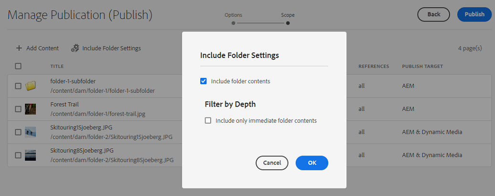

# Gerenciar publicação no Experience Manager Assets {#manage-publication-in-aem}

Como um [!DNL Adobe Experience Manager Assets] administrador, você pode publicar ativos e pastas que contêm ativos da instância do autor no [!DNL Experience Manager Assets], [!DNL Dynamic Media], e [!DNL Brand Portal]. Além disso, você pode agendar a publicação de um ativo ou pasta em uma data ou hora posterior. Após a publicação, os usuários podem acessar e distribuir os ativos para outros usuários. Por padrão, você pode publicar ativos e pastas em [!DNL Experience Manager Assets]. No entanto, é possível configurar [!DNL Experience Manager Assets] para ativar a publicação para [[!DNL Dynamic Media]](https://experienceleague.adobe.com/docs/experience-manager-cloud-service/content/assets/dynamicmedia/config-dm.html) e [[!DNL Brand Portal]](https://experienceleague.adobe.com/docs/experience-manager-cloud-service/content/assets/brand-portal/configure-aem-assets-with-brand-portal.html).

É possível publicar ou cancelar a publicação de ativos no nível do ativo ou da pasta, usando **[!UICONTROL Publicação rápida]** ou **[!UICONTROL Gerenciar publicação]** opção disponível no [!DNL Experience Manager Assets] interface. Se fizer modificações subsequentes no ativo ou pasta original no [!DNL Experience Manager Assets], as alterações não serão refletidas na instância de publicação até que você publique novamente a partir de [!DNL Experience Manager Assets]. Isso garante que as alterações de trabalho em andamento não estejam disponíveis na instância de publicação. Somente as alterações aprovadas publicadas por um administrador estão disponíveis na instância de publicação.

* [Publicar ativos usando a Publicação rápida](#quick-publish)
* [Publicar ativos usando Gerenciar publicação](#manage-publication)
* [Publicar ativos mais tarde](#publish-assets-later)
* [Publicar ativos no Dynamic Media](#publish-assets-to-dynamic-media)
* [Publicar ativos no Brand Portal](#publish-assets-to-brand-portal)
* [Solicitação para publicar](#request-publication)
* [Limitações e dicas](#limitations-and-tips)

## Publicar ativos usando a Publicação rápida {#quick-publish}

A Publicação rápida permite publicar imediatamente o conteúdo no destino selecionado. No [!DNL Experience Manager Assets] navegue até a pasta principal e selecione todos os ativos ou pastas que deseja publicar. Clique em **[!UICONTROL Publicação rápida]** na barra de ferramentas e selecione destino na lista suspensa onde deseja publicar os ativos.

## Publicar ativos usando Gerenciar publicação {#manage-publication}

Gerenciar publicação permite publicar ou desfazer a publicação de conteúdo de e para o destino selecionado, [adicionar conteúdo](#add-content) para a lista de publicação em todo o repositório DAM, [incluir configurações da pasta](#include-folder-settings) para publicar o conteúdo das pastas selecionadas e aplicar filtros, e [agendar publicação](#publish-assets-later) para uma data ou hora posterior.

No [!DNL Experience Manager Assets] navegue até a pasta principal e selecione todos os ativos ou pastas que deseja publicar. Clique em **[!UICONTROL Gerenciar publicação]** na barra de ferramentas. Se você não tiver [!DNL Dynamic Media] e [!DNL Brand Portal] configurado no [!DNL Experience Manager Assets] instância, você pode publicar ativos e pastas somente no [!DNL Experience Manager Assets].

As seguintes opções estão disponíveis no [!UICONTROL Gerenciar publicação] interface:

* [!UICONTROL Ações]
   * `Publish`: publicar ativos e pastas no destino selecionado
   * `Unpublish`: cancelar a publicação de ativos e pastas do destino

* [!UICONTROL Destino]
   * `Publish`: publicar ativos e pastas no [!DNL Experience Manager Assets] (`AEM`)
   * `Dynamic Media`: Publicar ativos no [!DNL Dynamic Media]
   * `Brand Portal`: publicar ativos e pastas no [!DNL Brand Portal]

* [!UICONTROL Programação]
   * `Now`: publicar ativos imediatamente
   * `Later`: publique ativos com base no `Activation` data ou hora

Para continuar, clique em **[!UICONTROL Próxima]**. Com base na seleção, a variável **[!UICONTROL Escopo]** reflete opções diferentes. As opções para **[!UICONTROL Adicionar conteúdo]** e **[!UICONTROL Incluir configurações da pasta]** estão disponíveis apenas para publicação de ativos e pastas no [!DNL Experience Manager Assets] (`Destination: Publish`).

### Adicionar conteúdo {#add-content}

Publicando em [!DNL Experience Manager Assets] permite adicionar mais conteúdo (ativos e pastas) à lista de publicação. Você pode adicionar mais ativos ou pastas à lista nos repositórios DAM. Clique em **[!UICONTROL Adicionar conteúdo]** botão para adicionar mais conteúdo.

É possível adicionar vários ativos de uma pasta ou adicionar várias pastas de uma vez. Mas não é possível adicionar ativos de várias pastas de uma vez.

### Incluir configurações de pasta {#include-folder-settings}

Por padrão, publicar uma pasta no [!DNL Experience Manager Assets] O publica todos os ativos, subpastas e suas referências.

Para filtrar o conteúdo da pasta que deseja publicar, clique em **[!UICONTROL Incluir configurações da pasta]**:

* `Include folder contents`

   * Ativado: todos os ativos da pasta selecionada, as subpastas (incluindo todos os ativos das subpastas) e as referências são publicadas.
   * Desativado: somente a pasta selecionada (vazia) e as referências são publicadas. Os ativos da pasta selecionada não são publicados.

* `Include folder contents` e `Include only immediate folder contents`

  Se ambas as opções forem selecionadas, todos os ativos da pasta selecionada, as subpastas (vazias) e as referências serão publicadas. Os ativos das subpastas não são publicados.

<!--
* [!UICONTROL Include only immediate folder contents]: Only the subfolders content and references are published. 

Only the selected folder content and references are published.
-->

Depois de aplicar os filtros, clique em **[!UICONTROL OK]** e clique em **[!UICONTROL Publish]**. Ao clicar no botão publicar, uma mensagem de confirmação `Resource(s) have been scheduled for publication` é exibida. E os ativos e (ou) pastas selecionados são publicados no destino definido com base no scheduler (`Now` ou `Later`). Faça logon na instância de publicação para verificar se os ativos e (ou) as pastas foram publicados com êxito.

Na ilustração acima, é possível ver diferentes valores para a variável **[!UICONTROL Destino de publicação]** atributo. Lembre-se de que você optou por publicar no [!DNL Experience Manager Assets] (`Destination: Publish`). Em seguida, por que ele mostra que apenas uma pasta e um ativo são publicados no `AEM`e os outros dois ativos são publicados para ambos `AEM` e `Dynamic Media`?

Aqui, você deve entender a função das propriedades da pasta. De uma pasta **[!UICONTROL Modo de publicação do Dynamic Media]** A propriedade desempenha um papel importante na publicação. Para exibir as propriedades de uma pasta, selecione uma pasta e clique em **[!UICONTROL Propriedades]** na barra de ferramentas. Para um ativo, consulte as propriedades da pasta principal.

A tabela a seguir explica como ocorre a publicação dependendo da definição de **[!UICONTROL Destino]** e **[!UICONTROL Modo de publicação do Dynamic Media]**:

| [!UICONTROL Destino] | [!UICONTROL Modo de publicação do Dynamic Media] | [!UICONTROL Direcionamento da publicação] | Conteúdo permitido |
| --- | --- | --- | --- |
| Publicação | Publicação seletiva | `AEM` | Ativos e/ou pastas |
| Publicação | Imediato | `AEM` e `Dynamic Media` | Ativos e/ou pastas |
| Publicação | Por ativação | `AEM` e `Dynamic Media` | Ativos e/ou pastas |
| Dynamic Media | Publicação seletiva | `Dynamic Media` | Assets |
| Dynamic Media | Imediato | `None` | Não é possível publicar os ativos |
| Dynamic Media | Por ativação | `None` | Não é possível publicar os ativos |

>[!NOTE]
>
>Somente os ativos são publicados em [!DNL Dynamic Media].
>
>Publicar uma pasta no [!DNL Dynamic Media] não é compatível.
>
>Se você selecionar uma pasta (`Selective Publish`) e escolha o [!DNL Dynamic Media] destino, o [!UICONTROL Destino de publicação] o atributo reflete `None`.

Vamos agora mudar o **[!UICONTROL Destino]** no caso de uso acima para **[!UICONTROL Dynamic Media]** e verifique os resultados. Ao fazê-lo, apenas o ativo de `Selective Publish` a pasta é publicada em [!DNL Dynamic Media]. Os ativos da `Immediate` e `Upon Activation` as pastas não são publicadas e refletem `None`.

>[!NOTE]
>
>Se [!DNL Dynamic Media] não está configurado no seu [!DNL Experience Manager Assets] instância e o **[!UICONTROL Destino]** é **[!UICONTROL Publish]**, os ativos e as pastas são sempre publicados no `AEM`.
>
>Publicando em [!DNL Brand Portal] é independente das propriedades da pasta. Todos os ativos, pastas e coleções podem ser publicados no Brand Portal. Consulte [publicar ativos no Brand Portal](#publish-assets-to-brand-portal).

>[!NOTE]
>
>Se você tiver personalizado o [!DNL Manage Publication] assistente, sua personalização continuará a funcionar com as funcionalidades existentes.
>
>No entanto, é possível remover a personalização existente para usar o novo [!DNL Manager Publication] recursos.

## Publicar ativos mais tarde {#publish-assets-later}

Para agendar o fluxo de trabalho de publicação de ativos para uma data ou hora posterior:

1. No [!UICONTROL Experience Manager Assets] console, navegue até a pasta principal e selecione todos os ativos ou pastas que deseja agendar para publicação.
1. Clique em **[!UICONTROL Gerenciar publicação]** na barra de ferramentas.
1. Clique em **[!UICONTROL Publish]** de **[!UICONTROL Ação]** e selecione a variável **[!UICONTROL Destino]** onde deseja publicar o conteúdo.
1. Selecione **[!UICONTROL Mais tarde]** em **[!UICONTROL Agendamento]**.
1. Selecione um **[!UICONTROL Data de ativação]** e especifique a data e a hora. Clique em **[!UICONTROL Avançar]**.

   

1. No **[!UICONTROL Escopo]** guia, **[!UICONTROL Adicionar conteúdo]** (se necessário) Clique em **[!UICONTROL Avançar]**.
1. No **[!UICONTROL Fluxos de trabalho]** especifique um título de Fluxo de trabalho. Clique em **[!UICONTROL Publicar mais tarde]**.

   

   Faça logon na instância de destino para verificar os ativos publicados (dependendo da data ou hora agendadas).

## Publicar ativos no Dynamic Media {#publish-assets-to-dynamic-media}

Somente os ativos são publicados em [!DNL Dynamic Media]. No entanto, o comportamento de publicação é diferente com base nas propriedades da pasta. Uma pasta pode ter **[!UICONTROL Modo de publicação do Dynamic Media]** configurado para publicação seletiva que pode ser qualquer um dos seguintes:

* `Selective Publish`
* `Immediate`
* `Upon Activation`

O processo de publicação de **[!UICONTROL Imediato]** e **[!UICONTROL Na ativação]** é consistente, no entanto, diferente para **[!UICONTROL Publicação seletiva]**. Consulte [configurar a publicação seletiva no nível da pasta no Dynamic Media](https://experienceleague.adobe.com/docs/experience-manager-cloud-service/content/assets/dynamicmedia/selective-publishing.html). Depois de configurar a publicação seletiva em uma pasta, siga um destes procedimentos:

* [Publicar ativos seletivamente no Dynamic Media ou no Experience Manager usando Gerenciar publicação](https://experienceleague.adobe.com/docs/experience-manager-cloud-service/content/assets/dynamicmedia/selective-publishing.html?lang=en#selective-publish-manage-publication)
* [Cancelar a publicação de ativos seletivamente do Dynamic Media ou do Experience Manager usando Gerenciar publicação](https://experienceleague.adobe.com/docs/experience-manager-cloud-service/content/assets/dynamicmedia/selective-publishing.html?lang=en#selective-unpublish-manage-publication)
* [Publicar ativos no Dynamic Media ou no Experience Manager usando a Publicação rápida](https://experienceleague.adobe.com/docs/experience-manager-cloud-service/content/assets/dynamicmedia/selective-publishing.html?lang=en#quick-publish-aem-dm)
* [Publicar ou cancelar a publicação de ativos de maneira seletiva por meio dos resultados da pesquisa](https://experienceleague.adobe.com/docs/experience-manager-cloud-service/content/assets/dynamicmedia/selective-publishing.html?lang=en#selective-publish-unpublish-search-results)

## Publicar ativos no Brand Portal {#publish-assets-to-brand-portal}

Você pode publicar ativos, pastas e coleções na [!DNL Experience Manager Assets Brand Portal] instância.

* [Publicar ativos no Brand Portal](https://experienceleague.adobe.com/docs/experience-manager-cloud-service/content/assets/brand-portal/publish-to-brand-portal.html?lang=en#publish-assets-to-bp)
* [Publicar pastas no Brand Portal](https://experienceleague.adobe.com/docs/experience-manager-cloud-service/content/assets/brand-portal/publish-to-brand-portal.html?lang=en#publish-folders-to-brand-portal)
* [Publicar coleções no Brand Portal](https://experienceleague.adobe.com/docs/experience-manager-cloud-service/content/assets/brand-portal/publish-to-brand-portal.html?lang=en#publish-collections-to-brand-portal)

## Solicitação para publicar {#request-publication}

A variável `Request Publication` ajuda na autenticação do fluxo de trabalho dos Assets antes de publicá-los no [!DNL AEM] Ambiente de ativos. [!DNL AEM] O fornece diferentes níveis de permissões para vários usuários. Você pode ser um *colaborador* que está fazendo upload de ativos, mas não pode publicá-los até que os uploads sejam verificados. Além disso, por ser um *Admin* é possível gerenciar para ler e gravar fluxos de trabalho dos Ativos.

A opção Solicitar publicação está disponível para os seguintes usuários:

* **Colaborador:** Se você for um usuário que pode contribuir com [!DNL AEM] ativos, você terá acesso limitado à [!DNL AEM] Fluxo de trabalho dos ativos. `Manage publication` está oculto para você. Como colaborador, você só pode contribuir adicionando Ativos, mas não pode publicá-los ou ter acesso de leitura ao fluxo de trabalho.

* **Usuário do fluxo de trabalho:** Esse usuário não pode publicar ativos, mas tem acesso de leitura ao fluxo de trabalho. Como usuário de workflow, você pode:
   * solicitar publicação
   * exibir `Manage publication` botão
   * agende o workflow e veja as opções `schedule now` e `schedule later`

* **Administrador:** Como um tipo de usuário administrador, você pode gerenciar as etapas gerais do fluxo de trabalho para os Ativos. `Manage publication` está visível para você. Se o destino `publish` for selecionada, será possível agendar um ativo para a etapa do fluxo de trabalho.

>[!NOTE]
>
>Se [!DNL Dynamic Media] for selecionada como destino, a etapa do fluxo de trabalho será desativada para **usuário do fluxo de trabalho** e **administrador** usuários.
>

## Limitações e dicas {#limitations-and-tips}

* `Manage publication` O está disponível para usuários que têm pelo menos permissões de Leitura para o fluxo de trabalho.
* Pastas vazias não são publicadas.
* Se você publicar um ativo que está sendo processado, somente o conteúdo original será publicado. As representações estão ausentes. Aguarde a conclusão do processamento e publique ou republique o ativo depois que o processamento for concluído.
* Ao desfazer a publicação de um ativo complexo, cancele a publicação somente do ativo. Evite desfazer a publicação das referências, pois elas podem ser referenciadas por outros ativos publicados.
