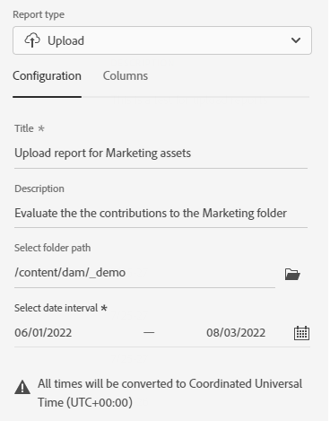
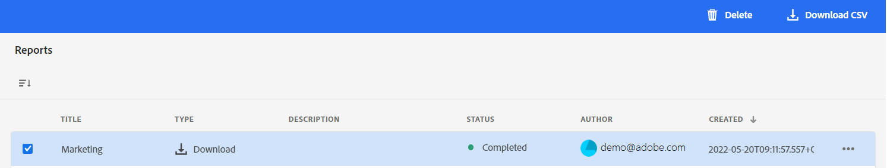

# Gerenciamento de relatórios {#manage-reports}

Os relatórios do Assets fornecem à administração a visibilidade das atividades do ambiente de visualização do Adobe Experience Manager Assets. Esses dados fornecem informações úteis sobre como os usuários interagem com o conteúdo e o produto. Todos os(as) usuários(as) podem acessar o painel Insights e aqueles que estiverem atribuídos(as) ao perfil de produto Administrador podem criar relatórios definidos pelo(a) usuário(a).

## Acessar relatórios {#access-reports}

Todos os usuários atribuídos ao perfil de produto de administradores da visualização do Assets podem acessar o painel Insights e criar relatórios definidos pelo usuário na visualização do Assets.

Para acessar os relatórios, navegue até **[!UICONTROL Relatórios]** em **[!UICONTROL Configurações]**.

<!--
In the **[!UICONTROL Reports]** screen, various components are shown in the tabular format which includes the following:

* **Title**: Title of the report
* **Type**: Determines whether the report is uploaded or downloaded to the repository
* **Description**: Provide details of the report that was given during uploading/downloading the report
* **Status**: Determines whether the report is completed, under progress, or deleted.
* **Author**: Provides email of the author who has uploaded/downloaded the report.
* **Created**: Gives information of the date when the report was generated.
-->

## Exibir o Insights {#view-live-statistics}

A visualização do Assets permite visualizar dados do seu ambiente da visualização do Assets em tempo real, por meio do painel Insights. Você pode visualizar métricas de evento em tempo real dos últimos 30 dias ou dos últimos 12 meses.

<!---->

Clique na opção **[!UICONTROL Insights]**, disponível no painel de navegação esquerdo, para exibir os seguintes gráficos gerados automaticamente:

* **Downloads**: o número de ativos baixados do ambiente de exibição do Assets nos últimos 30 dias ou 12 meses representados usando um gráfico de linhas.

* **Uploads**: o número de ativos carregados para o ambiente de exibição do Assets nos últimos 30 dias ou 12 meses representados usando um gráfico de linhas.

<!--* **Asset Count by Size**: The division of count of assets based on their range of various sizes from 0 MB to 100 GB.-->

* **Utilização do armazenamento**: o uso do armazenamento, em bytes, para o ambiente de exibição de Ativos representado por meio de um gráfico de barras.

<!--* **Delivery**: The graph depicts the count of assets as the delivery dates.-->

<!--* **Asset Count by Asset Type**: Represents count of various MIME types of the available assets. For example, application/zip, image/png, video/mp4, application/postscripte.-->

* **Principais Pesquisas**: visualize os principais termos pesquisados junto com o número de vezes que esses termos foram pesquisados no ambiente de visualização do Assets nos últimos 30 dias ou 12 meses representados em formato de tabela.

  <!--
   
   
   -->

## Criar um relatório de downloads {#create-download-report}

Para criar um relatório de downloads:

1. Navegue até **[!UICONTROL Configurações]** > **[!UICONTROL Relatórios]** e clique em **[!UICONTROL Criar relatório]**.

1. Na guia [!UICONTROL Configuração], especifique o tipo de relatório como **[!UICONTROL Baixar]**.

1. Especifique um título e uma descrição opcional para o relatório.

1. Selecione o caminho da pasta que compreende os ativos para os quais o relatório será criado, usando o campo **[!UICONTROL Selecionar caminho da pasta]**.

1. Selecione o intervalo de datas do relatório.

   >[!NOTE]
   >
   > A visualização do Assets converte todos os fusos horários locais para o Tempo Universal Coordenado (UTC).

1. Na guia [!UICONTROL Colunas], selecione os nomes das colunas que devem ser exibidas no relatório.

1. Clique em **[!UICONTROL Criar]**.

   

A tabela a seguir explica o uso de todas as colunas que você pode adicionar ao relatório:

<table>
    <tbody>
     <tr>
      <th><strong>Nome da coluna</strong></th>
      <th><strong>Descrição</strong></th>
     </tr>
     <tr>
      <td>Título</td>
      <td>O título do ativo.</td>
     </tr>
     <tr>
      <td>Caminho </td>
      <td>O caminho da pasta onde o ativo está disponível na visualização do Assets.</td>
     </tr>
     <tr>
      <td>Tipo MIME</td>
      <td>O tipo MIME do ativo.</td>
     </tr>
     <tr>
      <td>Tamanho</td>
      <td>O tamanho do ativo em bytes.</td>
     </tr>
     <tr>
      <td>Baixado por</td>
      <td>A ID do email do usuário que baixou o ativo.</td>
     </tr>
     <tr>
      <td>Data de download</td>
      <td>A data em que a ação de download do ativo foi executada.</td>
     </tr>
     <tr>
      <td>Autor</td>
      <td>O autor do ativo.</td>
     </tr>
     <tr>
      <td>Data de criação</td>
      <td>A data em que o ativo foi enviado para a visualização do Assets.</td>
     </tr>
     <tr>
      <td>Data da modificação</td>
      <td>A data em que o ativo foi modificado pela última vez.</td>
     </tr>
     <tr>
      <td>Expirado</td>
      <td>O status de expiração do ativo.</td>
     </tr>
     <tr>
      <td>Baixado por Nome de usuário</td>
      <td>O nome do usuário que baixou o ativo.</td>
     </tr>           
    </tbody>
   </table>

## Criar um relatório de uploads {#create-upload-report}

Para criar um relatório de uploads:

1. Navegue até **[!UICONTROL Configurações]** > **[!UICONTROL Relatórios]** e clique em **[!UICONTROL Criar relatório]**.

1. Na guia [!UICONTROL Configuração], especifique o tipo de relatório como **[!UICONTROL Fazer upload]**.

1. Especifique um título e uma descrição opcional para o relatório.

1. Selecione o caminho da pasta que compreende os ativos para os quais o relatório será criado, usando o campo **[!UICONTROL Selecionar caminho da pasta]**.

1. Selecione o intervalo de datas do relatório.

1. Na guia [!UICONTROL Colunas], selecione os nomes das colunas que devem ser exibidas no relatório.

1. Clique em **[!UICONTROL Criar]**.

   

A tabela a seguir explica o uso de todas as colunas que você pode adicionar ao relatório:

<table>
    <tbody>
     <tr>
      <th><strong>Nome da coluna</strong></th>
      <th><strong>Descrição</strong></th>
     </tr>
     <tr>
      <td>Título</td>
      <td>O título do ativo.</td>
     </tr>
     <tr>
      <td>Caminho </td>
      <td>O caminho da pasta onde o ativo está disponível na visualização do Assets.</td>
     </tr>
     <tr>
      <td>Tipo MIME</td>
      <td>O tipo MIME do ativo.</td>
     </tr>
     <tr>
      <td>Tamanho</td>
      <td>O tamanho do ativo.</td>
     </tr>
     <tr>
      <td>Autor</td>
      <td>O autor do ativo.</td>
     </tr>
     <tr>
      <td>Data de criação</td>
      <td>A data em que o ativo foi enviado para a visualização do Assets.</td>
     </tr>
     <tr>
      <td>Data da modificação</td>
      <td>A data em que o ativo foi modificado pela última vez.</td>
     </tr>
     <tr>
      <td>Expirado</td>
      <td>O status de expiração do ativo.</td>
     </tr>              
    </tbody>
   </table>

## Visualizar relatórios existentes {#view-report-list}

Depois de [criar o relatório](#create-download-report), é possível visualizar a lista de relatórios existentes e baixá-los em formato CSV ou excluí-los.

Para visualizar a lista de relatórios, navegue até **[!UICONTROL Configurações]** > **[!UICONTROL Relatórios]**.

É possível visualizar o título, o tipo, a descrição especificada durante a criação, o status, a ID de email do autor e a data de criação de cada relatório.

O status `Completed ` do relatório significa que ele está pronto para download.

## Baixar um relatório em formato CSV {#download-csv-report}

Para baixar um relatório no formato CSV:

1. Navegue até **[!UICONTROL Configurações]** > **[!UICONTROL Relatórios]**.

1. Selecione um relatório e clique em **[!UICONTROL Baixar CSV]**.

O relatório selecionado é baixado no formato CSV. As colunas exibidas no relatório CSV dependem das colunas selecionadas ao [criar o relatório](#create-download-report).

## Excluir um relatório {#delete-report}

Para excluir um relatório:

1. Navegue até **[!UICONTROL Configurações]** > **[!UICONTROL Relatórios]**.

1. Selecione um relatório e clique em **[!UICONTROL Excluir]**.

1. Clique em **[!UICONTROL Excluir]** novamente para confirmar.
