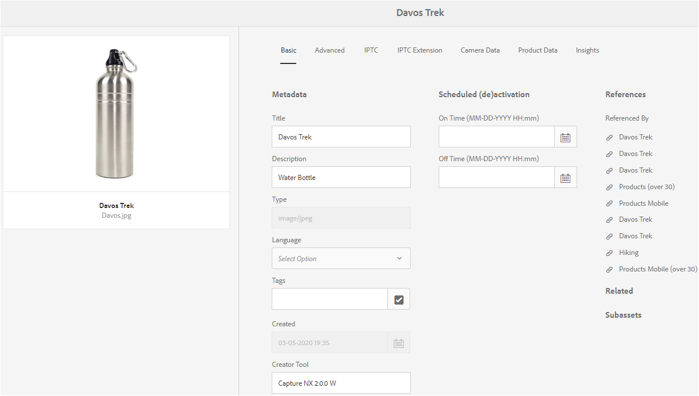

# Esquemas de metadados {#metadata-schemas}

| [Pesquisar Práticas Recomendadas](/help/assets/search-best-practices.md) | [Práticas recomendadas de metadados](/help/assets/metadata-best-practices.md) | [Content Hub](/help/assets/product-overview.md) | [Dynamic Media com recursos OpenAPI](/help/assets/dynamic-media-open-apis-overview.md) | [documentação para desenvolvedores do AEM Assets](https://developer.adobe.com/experience-cloud/experience-manager-apis/) |
| ------------- | --------------------------- |---------|----|-----|

| Versão | Link do artigo |
| -------- | ---------------------------- |
| AEM 6.5 | [Clique aqui](https://experienceleague.adobe.com/docs/experience-manager-65/assets/administer/metadata-schemas.html?lang=en) |
| AEM as a Cloud Service | Este artigo |

As organizações apresentam um modelo de metadados que aprimora a detecção de ativos, a utilização, a interoperabilidade e assim por diante. A aplicação correta de metadados é imperceptível para manter fluxos de trabalho e processos orientados por metadados. Para aderir à estratégia e aos padrões de metadados de toda a organização, você pode usar esquemas de metadados que ajudam os usuários do DAM a se alinharem. O [!DNL Adobe Experience Manager] permite métodos fáceis e flexíveis para criar, manter e aplicar esquemas de metadados.

Em [!DNL Adobe Experience Manager Assets], os esquemas contêm campos específicos para informações específicas a serem preenchidas. Ele também contém informações de layout para exibir campos de metadados de forma simples. As propriedades de metadados incluem título, descrição, tipos MIME, tags e muito mais. Você pode usar o editor [!UICONTROL Forms de Esquema de Metadados] para modificar os esquemas existentes ou adicionar esquemas de metadados personalizados.

Para exibir e editar a página de propriedades de um ativo, siga estas etapas:

1. Clique na opção **[!UICONTROL Propriedades de exibição]** das ações rápidas no bloco de ativos na exibição de cartão. Como alternativa, selecione um ativo e clique em **[!UICONTROL Propriedades]**  na barra de ferramentas.

1. É possível editar as várias propriedades de metadados editáveis nas guias disponíveis. No entanto, você não pode modificar o ativo [!UICONTROL Tipo] na guia [!UICONTROL Básico] da página de propriedades.

   

   *Figura: guia Básico no ativo [!UICONTROL Propriedades].*

   Para modificar o tipo MIME de um ativo, use um formulário de esquema de metadados personalizado ou modifique um formulário existente. Consulte [Editar Forms de esquema de metadados](#edit-metadata-schema-forms) para obter mais informações. Se você modificar o esquema de metadados de um tipo MIME, o layout da página de propriedades dos ativos e de todos os subtipos será modificado. Por exemplo, modificar um esquema jpeg em `default/image` modifica apenas o layout de metadados (propriedades do ativo) para ativos com tipo MIME `image/jpeg`. No entanto, se você editar o esquema padrão, suas alterações modificarão o layout de metadados para todos os tipos de ativos.

## Formulários de esquema de metadados {#default-metadata-schema-forms}

Para exibir uma lista de formulários ou modelos, na interface do [!DNL Experience Manager], navegue até **[!UICONTROL Ferramentas]** > **[!UICONTROL Assets]** > **[!UICONTROL Esquemas de Metadados]**.

[!DNL Experience Manager] fornece os seguintes modelos de formulário de esquema de metadados.

| Modelos | | Descrição |
|---|---|---|
| [!UICONTROL padrão] | | O formulário básico de esquema de metadados para ativos. |
| | Os seguintes formulários filhos herdam as propriedades do formulário [!UICONTROL padrão]: | |
| | <ul><li>[!UICONTROL dm_video]</li></ul> | Formulário de esquema para vídeos do Dynamic Media. |
| | <ul><li>[!UICONTROL imagem]</li></ul> | Formulário de esquema de imagens com o tipo MIME, como `image/jpeg` e `image/png`.   O formulário [!UICONTROL image] tem os seguintes modelos de formulário filho: <ul><li> [!UICONTROL jpeg]: formulário de esquema para ativos com subtipo [!UICONTROL jpeg].</li> <li>[!UICONTROL tiff]: formulário de esquema dos ativos com TIFF de subtipo.</li></ul> |
| | <ul><li>[!UICONTROL aplicativo]</li></ul> | Formulário de esquema para ativos com tipo MIME, como `application/pdf` e `application/zip`.  [!UICONTROL pdf]: formulário de esquema para ativos com PDF de subtipo. |
| | <ul><li>[!UICONTROL vídeo]</li></ul> | Formulário de esquema para ativos de vídeo com tipo MIME, como `video/avi` e `video/mp4`. |
| [!UICONTROL coleção] | | Formulário de esquema para coleções. |
| [!UICONTROL contentfragment] | | Formulário de esquema dos Fragmentos de conteúdo. |
| [!UICONTROL formulários] | | Este formulário de esquema está relacionado a [!DNL Adobe Experience Manager Forms]. |
| [!UICONTROL ugc_contentfragment] | | Formulário de esquema para partes de conteúdo gerado pelo usuário e ativos integrados no Experience Manager de redes sociais. |

>[!NOTE]
>
>Para exibir os formulários filhos de um formulário de esquema, clique no nome do formulário de esquema.

## Adicionar um formulário de esquema de metadados {#add-a-metadata-schema-form}

Para adicionar um formulário de esquema de metadados, siga estas etapas:

1. Para adicionar um modelo personalizado à lista, clique em **[!UICONTROL Criar]** na barra de ferramentas.

   >[!NOTE]
   >
   >Um símbolo de bloqueio é exibido com os modelos não editados. Se você personalizar um modelo, ele não estará bloqueado .

1. Na caixa de diálogo, forneça o título do formulário de esquema e clique em **[!UICONTROL Criar]** para concluir o processo de criação do formulário.

## Editar formulários de esquema de metadados {#edit-metadata-schema-forms}

Você pode editar um formulário de esquema de metadados recém-adicionado ou existente. O formulário de esquema de metadados inclui guias e itens de formulário em guias. Você pode mapear/configurar esses itens de formulário para um campo em um nó de metadados no repositório do CRX. Você pode adicionar guias ou itens de formulário ao formulário de esquema de metadados. As guias e os itens de formulário derivados do pai estão no estado bloqueado. Não é possível alterá-los no nível secundário.

1. Na página [!UICONTROL Forms de esquema de metadados], selecione um formulário e clique em **[!UICONTROL Editar]** na barra de ferramentas.

1. Na página **[!UICONTROL Editor do Formulário de Esquema de Metadados]**, personalize o formulário de metadados. Arraste os componentes necessários da guia **[!UICONTROL Criar Formulário]** para uma das guias.

   

   *Figura: Uma página [!UICONTROL Editor do Formulário de Esquema de Metadados] com guias disponíveis.*

1. Para configurar um componente, selecione-o e modifique suas propriedades na guia **[!UICONTROL Configurações]**.

### Componentes dentro da guia [!UICONTROL Criar formulário] {#components-within-the-build-form-tab}

A guia **[!UICONTROL Criar Formulário]** lista itens de formulário que você usa no formulário de esquema. A guia **[!UICONTROL Configurações]** fornece os atributos de cada item selecionado na guia **[!UICONTROL Formulário de compilação]**. A tabela a seguir lista os itens de formulário disponíveis na guia **[!UICONTROL Criar Formulário]**:

| Nome do componente | Descrição |
| -------------------------------- | ----------------------------------------------------------------------------------- |
| [!UICONTROL Cabeçalho da seção] | Adicione um cabeçalho de seção para obter uma lista de componentes comuns. |
| [!UICONTROL Texto em linha única] | Adicione uma propriedade de texto de linha única. Ele é armazenado como uma string. |
| [!UICONTROL Texto de vários valores] | Adicione uma propriedade de texto de vários valores. Ele é armazenado como uma matriz de sequência. |
| [!UICONTROL Número] | Adiciona um componente de número. |
| [!UICONTROL Data] | Adiciona um componente de data. |
| [!UICONTROL Lista suspensa] | Adiciona uma lista suspensa. |
| [!UICONTROL Marcas Padrão] | Adicione uma tag. |
| [!UICONTROL Tags inteligentes] | Adicione para aumentar os recursos de pesquisa inserindo tags de metadados automaticamente. |
| [!UICONTROL Campo oculto] | Adicione um campo oculto. Ele é enviado como um parâmetro POST quando o ativo é salvo. |
| [!UICONTROL Ativo Referenciado Por] | Adicione este componente para visualizar a lista de ativos referenciados pelo ativo. |
| [!UICONTROL Referenciando Ativo] | Adicionar para exibir uma lista de ativos que fazem referência ao ativo. |
| [!UICONTROL Referências de produtos] | Adicionar para mostrar a lista de produtos vinculados ao ativo. |
| [!UICONTROL Metadados contextuais] | Adicione para controlar a exibição de outras guias de metadados na página de propriedades dos ativos. |

<!-- TBD: Ratings are not available in Experience Manager as a Cloud Service. Removed via cqdoc-18089 ticket. 
| [!UICONTROL Asset Rating]        | Add to display options for rating the asset.                                       |
-->

#### Editar o componente de metadados {#edit-the-metadata-component}

Para editar as propriedades de um componente de metadados no formulário, clique no componente para editar todas ou um subconjunto das seguintes propriedades na guia **[!UICONTROL Configurações]**. É recomendável mapear apenas um campo para uma determinada propriedade no esquema de metadados. Caso contrário, o campo adicionado mais recente mapeado para a propriedade será escolhido pelo sistema.

**Rótulo do campo**: o nome da propriedade de metadados que é exibida na página de propriedades do ativo.

**Mapear para a Propriedade**: esta propriedade especifica o caminho relativo ou o nome do nó do ativo onde ele é salvo no repositório do CRX. Ele começa com `./` para indicar que o caminho está sob o nó do ativo.

Veja a seguir exemplos de valores válidos para uma propriedade:

* `./jcr:content/metadata/dc:title`: armazena o valor no nó de metadados do ativo como a propriedade `dc:title`.

* `./jcr:created`: armazena a data e a hora de criação de um ativo. É uma propriedade protegida. Se você configurar essas propriedades, o Adobe recomenda marcá-las como Desativar edição. Caso contrário, o erro &quot;Os ativos falharam ao serem modificados&quot; ocorre ao salvar as propriedades do ativo.

Para garantir que o componente seja exibido corretamente no formulário de esquema de metadados, o caminho da propriedade não deve incluir espaços.

* **Espaço reservado**: use essa propriedade para especificar texto de espaço reservado relevante em relação à propriedade de metadados.
* **Obrigatório**: use esta propriedade para marcar uma propriedade de metadados como obrigatória na página de propriedades.
* **Desabilitar Edição**: use esta propriedade para não permitir edições em uma propriedade na página de propriedades.
* **Mostrar Campo Vazio em Somente Leitura**: marque esta propriedade para exibir uma propriedade de metadados na página de propriedades, mesmo que ela não tenha valor. Por padrão, quando uma propriedade de metadados não tem valor, ela não é listada na página de propriedades.
* **Mostrar lista ordenada**: use essa propriedade para exibir uma lista ordenada de opções.
* **Opções**: use esta propriedade para especificar opções em uma lista.
* **Descrição**: use essa propriedade para adicionar uma descrição curta para o componente de metadados.
* **Classe**: classe de objeto à qual a propriedade está associada.
* **Excluir**: clique em [!UICONTROL Excluir] para excluir um componente do formulário de esquema.

>[!NOTE]
>
>O componente [!UICONTROL Campo oculto] não inclui esses atributos. Em vez disso, inclui propriedades, como Nome, Valor, Rótulo do campo e Descrição dos atributos. Os valores do componente Campo oculto são enviados como um parâmetro POST sempre que o ativo é salvo. Eles não podem ser salvos como metadados para o ativo.

Se você selecionar a opção **[!UICONTROL Obrigatório]**, poderá pesquisar por ativos sem metadados obrigatórios. No painel **[!UICONTROL Filtros]**, expanda o predicado **[!UICONTROL Validação de metadados]** e selecione a opção **[!UICONTROL Inválido]**. Os resultados de pesquisa exibem ativos que não têm metadados obrigatórios configurados por meio do formulário de esquema.

Se você adicionar o componente Metadados contextuais a qualquer guia de qualquer formulário de esquema, o componente aparecerá como uma lista na página de propriedades dos ativos aos quais o esquema específico é aplicado. A lista inclui todas as outras guias, exceto a guia à qual você aplicou o componente de Metadados contextuais. Atualmente, esse recurso fornece funcionalidade básica para controlar a exibição de metadados com base no contexto.

Para exibir qualquer guia na página de propriedades, além da guia na qual o componente de Metadados contextuais é aplicado, selecione a guia na lista. A guia é adicionada à página de propriedades.

### Especificar propriedades no arquivo JSON {#specify-properties-in-json-file}

Em vez de especificar propriedades para as opções na guia **[!UICONTROL Configurações]**, defina as opções em um arquivo JSON especificando pares de valores chave correspondentes. Especifique o caminho do arquivo JSON no campo **[!UICONTROL Caminho JSON]**.

#### Adicionar ou excluir uma guia no formulário de esquema {#add-delete-a-tab-in-the-schema-form}

O editor de esquema permite adicionar ou excluir uma guia. O formulário de esquema padrão inclui as guias **[!UICONTROL Básico]**, **[!UICONTROL Avançado]**, **[!UICONTROL IPTC]** e **[!UICONTROL Extensão do IPTC]**.

Clique em `+` para adicionar uma guia em um formulário de esquema. Por padrão, a nova guia tem o nome `Unnamed-1`. Você pode modificar o nome na guia **[!UICONTROL Configurações]**. Clique em `X` para excluir uma guia.

## Excluir formulários de esquema de metadados {#deleting-metadata-schema-forms}

Experience Manager permite excluir somente formulários de esquema personalizados. Isso não permite excluir os formulários/modelos de esquema padrão. No entanto, você pode excluir qualquer alteração personalizada nesses formulários.

Para excluir um formulário, selecione-o e clique no ícone excluir.

>[!NOTE]
>
>Depois de excluir alterações personalizadas em um formulário padrão, o ícone de bloqueio reaparece antes de ser exibido na interface do Esquema de metadados para indicar que o formulário foi revertido para seu estado padrão.

>[!NOTE]
>
>* Após excluir as alterações personalizadas de um formulário padrão, o bloqueio  reaparece antes do formulário. Indica que o formulário é revertido para seu estado padrão.
>* Não é possível excluir os formulários de esquema de metadados padrão em [!DNL Assets].

## Formulários de esquema para tipos MIME {#schema-forms-for-mime-types}

[!DNL Experience Manager] fornece formulários padrão para vários tipos MIME prontos para uso. No entanto, é possível adicionar formulários personalizados para ativos de vários tipos MIME.

### Adicionar novos formulários para tipos MIME {#adding-new-forms-for-mime-types}

Crie um formulário no tipo de formulário apropriado. Por exemplo, para adicionar um modelo para o subtipo `image/png`, crie o formulário nos formulários &quot;imagem&quot;. O título do formulário de esquema é o nome do subtipo. Nesse caso, o título é `png`.

#### Usar um modelo de esquema existente para vários tipos MIME {#use-an-existing-schema-template-for-various-mime-types}

Você pode usar um modelo existente para um tipo MIME diferente. Por exemplo, use o formulário `image/jpeg` para ativos do tipo MIME `image/png`.

Nesse caso, crie um nó em `/etc/dam/metadataeditor/mimetypemappings` no repositório do CRX. Especifique um nome para o nó e defina as seguintes propriedades:

| Nome | Descrição | Tipo | Valor |
|------|-------------|------|-------|
| `exposedmimetype` | Nome do formulário existente a ser mapeado | `String` | `image/jpeg` |
| `mimetypes` | Lista de tipos MIME que usam o formulário definido no atributo `exposedmimetype` | `String` | `image/png` |

[!DNL Assets] mapeia os seguintes tipos MIME e formulários de esquema:

| Formulário de esquema | Tipos MIME |
|---|---|
| image/jpeg | image/pjpeg |
| image/tiff | image/x-tiff |
| application/pdf | application/postscript |
| application/x-ImageSet | Multipart/Related; type=application/x-ImageSet |
| application/x-SpinSet | Multipart/Related; type=application/x-SpinSet |
| application/x-MixedMediaSet | Multipart/Related; type=application/x-MixedMediaSet |
| video/quicktime | video/x-quicktime |
| video/mpeg4 | video/mp4 |
| video/avi | video/avi, video/msvideo, video/x-msvideo |
| video/wmv | video/x-ms-wmv |
| video/flv | video/x-flv |

## Conceder acesso a esquemas de metadados {#grant-access-to-metadata-schemas}

O recurso Esquema de metadados está disponível somente para administradores. No entanto, os administradores podem fornecer acesso a não administradores modificando algumas permissões. Forneça permissões de criação, modificação e exclusão de usuários não administradores na pasta `/conf`.

## Aplicar metadados específicos da pasta {#applying-folder-specific-metadata}

[!DNL Assets] permite definir uma variante de um esquema de metadados e aplicá-la a uma pasta específica.

Por exemplo, você pode definir uma variante do esquema de metadados padrão e aplicá-la a uma pasta. Quando você aplica o esquema modificado, ele substitui o esquema de metadados padrão original aplicado aos ativos na pasta.

Somente os ativos carregados na pasta à qual esse esquema é aplicado estão em conformidade com os metadados modificados definidos no esquema de metadados de variante. [!DNL Assets] em outras pastas onde o esquema original é aplicado continua em conformidade com os metadados definidos no esquema original.

A herança de metadados por ativos tem como base o esquema aplicado à pasta de nível superior na hierarquia. O mesmo esquema é aplicado ou herdado pelas subpastas. Se um esquema diferente for aplicado no nível da subpasta, a herança será interrompida.

1. Na interface do [!DNL Experience Manager], navegue até **[!UICONTROL Ferramentas]** > **[!UICONTROL Assets]** > **[!UICONTROL Esquemas de Metadados]**. A página **[!UICONTROL Formulários de esquema de metadados]** é exibida.
1. Marque a caixa de seleção ao lado de um formulário, por exemplo, o formulário de metadados padrão, clique em **[!UICONTROL Copiar]** e salve-o como um formulário personalizado. Especifique um nome personalizado para o formulário, por exemplo, `my_default`. Como alternativa, você pode criar um formulário personalizado.

1. Na página **[!UICONTROL Forms de esquema de metadados]**, selecione o formulário `my_default` e clique em **[!UICONTROL Editar]**.
1. Na página **[!UICONTROL Editor de esquema de metadados]**, adicione um campo de texto ao formulário de esquema. Por exemplo, adicione um campo com o rótulo **[!UICONTROL Category]**.
1. Clique em **[!UICONTROL Salvar]**. O formulário modificado está listado na página **[!UICONTROL Forms de esquema de metadados]**.
1. Selecione **[!UICONTROL Aplicar a Pastas]** na barra de ferramentas para aplicar os metadados personalizados a uma pasta.
1. Selecione a pasta na qual aplicar o esquema modificado e selecione **[!UICONTROL Aplicar]**.
1. Se a pasta tiver o outro esquema de metadados aplicado, uma mensagem será exibida avisando que você está prestes a substituir o esquema de metadados existente. Clique em **Substituir**.
1. Clique em **OK** para fechar a mensagem de êxito.
1. Navegue até a pasta à qual você aplicou o esquema de metadados modificado.

## Definição de metadados obrigatórios {#defining-mandatory-metadata}

Você pode definir campos obrigatórios no nível da pasta, que é aplicado aos ativos que são carregados na pasta. Se você fizer upload de ativos com metadados ausentes para os campos obrigatórios definidos anteriormente, uma indicação visual para metadados ausentes será exibida nos ativos na exibição Cartão.

>[!NOTE]
>
>Um campo de metadados pode ser definido como obrigatório com base no valor de outro campo. Na visualização Cartões, o Experience Manager não exibe a mensagem de aviso sobre os metadados ausentes para esses campos de metadados obrigatórios.

1. Clique no logotipo do Experience Manager e navegue até **[!UICONTROL Ferramentas]** > **[!UICONTROL Assets]** > **[!UICONTROL Esquemas de metadados]**. A página **[!UICONTROL Formulários de esquema de metadados]** é exibida.
1. Salve o formulário de metadados padrão como um formulário personalizado. Por exemplo, salve como `my_default`.
1. Edite o formulário personalizado. Adicione um campo obrigatório. Por exemplo, adicione um campo **[!UICONTROL Categoria]** e torne o campo obrigatório.
1. Clique em **[!UICONTROL Salvar]**. O formulário modificado está listado na página **[!UICONTROL Forms de esquema de metadados]**. Selecione o formulário e, em seguida, **[!UICONTROL Aplicar às pastas]** na barra de ferramentas para aplicar os metadados personalizados a uma pasta.
1. Navegue até a pasta e faça upload de alguns ativos com metadados ausentes para o campo obrigatório adicionado ao formulário personalizado. Uma mensagem para os metadados ausentes do campo obrigatório é exibida na exibição Cartão do ativo.
1. (Opcional) Acessar `https://[server]:[port]/system/console/components/`. Configure e habilite o componente `com.day.cq.dam.core.impl.MissingMetadataNotificationJob` que está desabilitado por padrão. Defina uma frequência na qual o Experience Manager verifica a validade dos metadados nos ativos.

   Esta configuração adiciona uma propriedade `hasValidMetadata` a `jcr:content` de ativos. Usando essa propriedade, o Experience Manager pode filtrar resultados em uma pesquisa.

   >[!NOTE]
   >
   >Se um ativo for adicionado após a verificação agendada, ele não será sinalizado com `hasValidMetadata` até a próxima verificação agendada. Os ativos não aparecem nos resultados de pesquisa intermediários.

   >[!CAUTION]
   >
   >As verificações de validação de metadados consomem muitos recursos e podem afetar o desempenho do sistema. Agende as verificações de acordo. Se o servidor não conseguir lidar com a carga, tente desabilitar este trabalho

**Consulte também**

* [Traduzir ativos](translate-assets.md)
* [API HTTP de ativos](mac-api-assets.md)
* [Formatos de arquivo compatíveis com os ativos](file-format-support.md)
* [Pesquisar ativos](search-assets.md)
* [Ativos conectados](use-assets-across-connected-assets-instances.md)
* [Relatórios de ativos](asset-reports.md)
* [Baixar ativos](download-assets-from-aem.md)
* [Gerenciar metadados](manage-metadata.md)
* [Pesquisar aspectos](search-facets.md)
* [Gerenciar coleções](manage-collections.md)
* [Importação de metadados em massa](metadata-import-export.md)
* [Publish Assets para AEM e Dynamic Media](/help/assets/publish-assets-to-aem-and-dm.md)