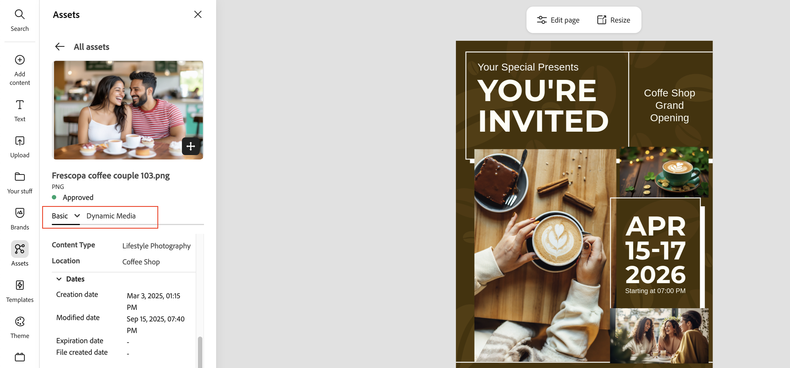

# Usar o Supervisor de conteúdo para acessar o AEM Assets no Adobe Express {#native-integration-adobe-express-using-content-advisor}

O Adobe Experience Manager (AEM) Assets integra-se nativamente ao Adobe Express, permitindo que você descubra, acesse e use ativos do AEM Assets diretamente na interface do Express usando o Supervisor de conteúdo.

O Supervisor de conteúdo transforma o modo como você detecta e usa ativos no Adobe Express, trazendo a detecção de ativos inteligente e sensível ao contexto diretamente para o fluxo de trabalho criativo. Em vez de pesquisar ativos digitando palavras-chave, o Supervisor de conteúdo exibe ativos relevantes e aprovados com base no conteúdo da tela, no resumo da campanha e na intenção, ajudando você a encontrar o ativo correto mais rapidamente.

Com sugestões inteligentes, acesso a representações do Dynamic Media e visibilidade total dos metadados de ativos, o Supervisor de conteúdo permite localizar, avaliar e usar ativos do AEM Assets com eficiência sem sair do Adobe Express. Isso garante a criação mais rápida de conteúdo, a reutilização aprimorada de ativos e o uso consistente de ativos aprovados e compatíveis com a marca.


Você também pode colocar ativos na tela do Express e salvar conteúdo novo ou editado de volta no AEM Assets, garantindo um gerenciamento e um controle centralizados de ativos. A integração nativa com o Adobe Express oferece os seguintes benefícios principais:

* Criação de conteúdo acelerada com detecção de ativos sensíveis ao contexto e recomendações.

* Maior reutilização de conteúdo ao editar ativos existentes e salvar novos ativos no AEM Assets.

* Acesso mais rápido a representações aprovadas e otimizadas para canais do Dynamic Media.

* Tempo e esforço reduzidos para criar novos ativos ou novas versões e, ao mesmo tempo, manter a consistência da marca.

## Pré-requisitos {#prerequisites}

Qualificações para acessar o Adobe Express e pelo menos um ambiente no AEM Assets. O ambiente pode ser qualquer um dos repositórios do Assets as a Cloud Service.

## Usar o AEM Assets no editor do Adobe Express {#use-aem-assets-in-express}

Execute as seguintes etapas para começar a usar o AEM Assets no editor do Adobe Express:

1. Abra o aplicativo web do Adobe Express.

2. Abra uma nova tela em branco carregando um novo modelo ou projeto ou criando um ativo.

3. Clique em **[!UICONTROL Assets]** disponível no painel de navegação esquerdo. O Adobe Express exibe o [Supervisor de Conteúdo](#intelligent-asset-discovery-content-advisor), que lista os repositórios aos quais você tem direito de acesso, juntamente com a lista de ativos e pastas disponíveis no nível raiz.

4. Procure ou pesquise ativos em seu repositório usando o [Supervisor de Conteúdo](#intelligent-asset-discovery-content-advisor) e, em seguida, arraste e solte-os na tela. Como alternativa, clique nos ativos para colocá-los na tela. Você também pode filtrar  ativos por vários critérios, como status de aprovação, tipo de arquivo, tipo MIME e dimensões.

   >[!NOTE]
   >
   >O filtro por dimensão não se aplica a vídeos.

   

## Detecção inteligente de ativos com o Content Advisor {#intelligent-asset-discovery-content-advisor}

O Supervisor de conteúdo ajuda você a descobrir ativos relevantes usando recomendações inteligentes com reconhecimento de contexto baseadas no conteúdo da tela ou no resumo da campanha. Ela também permite selecionar representações do Dynamic Media prontas para canal otimizadas para o seu caso de uso.


O Supervisor de Conteúdo exibe a lista de arquivos, pastas e coleções nas exibições de Lista e Grade. Ele permite adicionar ativos nos formatos PNG, JPEG, PSD, MP4, SVG e PDF à tela Express. Você também pode visualizar os arquivos PDF roláveis ou qualquer outro tipo de formato clicando no ícone  disponível no cartão de ativos.

Clique no ícone  para exibir também os metadados do ativo disponíveis na guia **[!UICONTROL Básico]** ou exibir as representações do Dynamic Media disponíveis na guia [Dynamic Media](#dynamic-media-renditions-content-advisor). Arraste e solte o conteúdo sugerido na tela. Como alternativa, clique no ativo para colocá-los automaticamente na tela.




>[!IMPORTANT]
> 
>Certifique-se de selecionar um repositório **autor** na lista suspensa **Repositório**. Um repositório de **entrega** não exibe recursos do Supervisor de Conteúdo.
>
> Além disso, o repositório **delivery** não tem ativos organizados em pastas e coleções. Todos os ativos são exibidos no nível raiz em uma estrutura simples.

O Supervisor de Conteúdo fornece os seguintes recursos principais:

* [Pesquisa com IA para detecção mais inteligente de ativos](#content-advisor-ai-search)

* [Sugestões inteligentes com base no contexto e na intenção](#smart-suggestions-content-advisor)

* [Resumos de campanha para descobrir ativos relevantes](#campaign-briefs-content-advisor)

* [Representações de ativos do Dynamic Media disponíveis para uso](#dynamic-media-renditions-content-advisor)

* [Acessar metadados de ativos consistentes com a visualização do Assets](#asset-metadata-content-advisor)

* [Filtros de acesso consistentes com a visualização do Assets](#filters-content-advisor)

* [Acessar e reutilizar pesquisas recentes e salvas](#saved-searches-content-advisor)

* [Pesquisar ativos entre e dentro de coleções](#search-collections-content-advisor)

### Pesquisa com IA para detecção mais inteligente de ativos {#content-advisor-ai-search}

O Supervisor de conteúdo usa um recurso de pesquisa avançada que entende o significado e a intenção por trás da consulta de um usuário, em vez de depender de correspondências exatas de palavras-chave. Ele usa a Inteligência artificial (IA) e o aprendizado de máquina para fornecer resultados mais precisos e com reconhecimento de contexto.

Ao contrário da pesquisa tradicional baseada em palavras-chave, que procura termos exatos, o Pesquisa com IA interpreta as relações entre palavras, conceitos e intenção do usuário. Isso garante que os usuários encontrem o que procuram, mesmo que a consulta seja redigida de forma diferente, contenha erros de digitação ou esteja em outro idioma.


Alguns, se seus principais benefícios incluírem:

* Suporte multilíngue: pesquise em vários idiomas sem exigir traduções exatas. Os usuários podem encontrar conteúdo relevante independentemente do idioma de consulta.

* Lida com erros ortográficos: interpreta erros de digitação e de ortografia, garantindo resultados precisos mesmo com informações imperfeitas.

* Entende sinônimos: fornece resultados para termos e frases relacionados, de modo que os usuários não precisam adivinhar a palavra-chave correta.

* Pesquisa sensível ao contexto: reconhece a intenção por trás de uma consulta, não apenas as palavras exatas.

>[!IMPORTANT]
> 
>* A versão mínima necessária do AEM para acessar Pesquisas com IA no Supervisor de Conteúdo é `21994`.


### Sugestões inteligentes com base no contexto e na intenção {#smart-suggestions-content-advisor}

O Supervisor de Conteúdo exibe sugestões inteligentes com base no contexto e na intenção do conteúdo na tela do Express. Isso ajuda você a descobrir e usar rapidamente os ativos que se alinham às suas necessidades de conteúdo sem a demorada pesquisa manual.


>[!IMPORTANT]
> 
>* O Supervisor de Conteúdo exibe sugestões inteligentes com base no contexto e na intenção do conteúdo disponível nas camadas de texto ou no título na tela Expressa. Ele não exibe resultados com base nas imagens disponíveis na tela.
>* Você deve assinar um GenAI Rider para acessar esse recurso no Supervisor de conteúdo. Para assinar o GenAI Rider, entre em contato com seu representante da Adobe.
>* A versão mínima necessária do AEM para acessar este recurso é `21994`.
>* As sugestões inteligentes não são atualizadas automaticamente à medida que você atualiza a tela. Clique no ícone de atualização no painel **Conteúdo sugerido** para exibir a lista atualizada de sugestões,

### Resumos de campanha para descobrir ativos relevantes {#campaign-briefs-content-advisor}

O Supervisor de conteúdo permite fazer upload de um documento de resumo da campanha para descobrir ativos relevantes sem inserir manualmente palavras-chave de pesquisa. O Supervisor de Conteúdo analisa as informações no resumo da campanha para entender a intenção da campanha e recomenda ativos relevantes disponíveis no AEM Assets.


>[!IMPORTANT]
>
>* O Supervisor de conteúdo analisa as informações disponíveis como texto no resumo da campanha para recomendar ativos relevantes. Não analisa as informações disponíveis como imagens no resumo da campanha.
>* Os tipos de arquivos compatíveis que você pode fazer upload como resumo da campanha incluem documentos PDF, DOCX e TXT.
>* Você deve assinar um GenAI Rider para acessar esse recurso no Supervisor de conteúdo. Para assinar o GenAI Rider, entre em contato com seu representante da Adobe.
>* A versão mínima necessária do AEM para acessar este recurso é `21994`.

### Representações de ativos do Dynamic Media disponíveis para uso {#dynamic-media-renditions-content-advisor}

As representações do Dynamic Media fornecem versões otimizadas de canal de ativos prontas para uso, incluindo [predefinições de imagem](/help/assets/dynamic-media/managing-image-presets.md), [Recortes inteligentes](/help/assets/dynamic-media/image-profiles.md), tipos de formato e perfis de cores. Essas representações ajudam a garantir que o ativo selecionado atenda aos requisitos de canal e design sem exigir edição manual ou duplicação de ativos.

Você também pode aplicar modificadores do Dynamic Media para visualizar ajustes em tempo real antes de colocar a representação na tela Expressa, permitindo uma seleção mais rápida da representação mais apropriada e, ao mesmo tempo, mantendo a consistência e a qualidade do ativo.

Clique no ícone  no cartão de ativos e selecione a guia **[!UICONTROL Dynamic Media]** para exibir as representações disponíveis para um ativo. Você pode optar por exibir representações do [Dynamic Media Scene7](/help/assets/dynamic-media/dynamic-media.md) ou do [Dynamic Media com OpenAPI](/help/assets/dynamic-media-open-apis-overview.md). Ao selecionar **[!UICONTROL OpenAPI]** para um ativo, as representações disponíveis serão exibidas somente se o ativo for aprovado e estiver disponível para Dynamic Media com OpenAPI.

Você deve ter uma licença válida do AEM Dynamic Media para exibir a guia Dynamic Media.


Clique no ícone de  para visualizar a representação ou clique no nome da representação para colocá-la automaticamente na tela. Você também pode visualizar a representação e, em seguida, arrastá-la e soltá-la para colocar a imagem na tela.


Clique em **[!UICONTROL Adicionar Modificadores]**, especifique um modificador na caixa de texto e pressione Enter para aplicar a transformação às representações em tempo real. Da mesma forma, é possível adicionar vários modificadores a uma representação e pré-visualizar essas transformações. Arraste e solte o ativo da visualização na tela. A representação após a aplicação desses modificadores não é salva. Consulte a lista de modificadores com suporte para [Dynamic Media Scene7](https://experienceleague.adobe.com/en/docs/dynamic-media-developer-resources/image-serving-api/image-serving-api/http-protocol-reference/command-reference/c-command-reference) e [Dynamic Media com OpenAPI](https://developer.adobe.com/experience-cloud/experience-manager-apis/api/stable/assets/delivery/#operation/getAssetSeoFormat).

>[!IMPORTANT]
> 
>O Dynamic Media ajuda a superar a limitação de tamanho do arquivo de upload de 80 MB no Adobe Express (Web) fornecendo representações otimizadas de grandes ativos. As representações do Dynamic Media reduzem significativamente o tamanho do arquivo, preservando a qualidade visual. Por exemplo, um ativo TIFF de 300 MB pode ser fornecido como uma representação de 2,5 MB sem comprometer a qualidade, permitindo o uso eficiente de ativos de alta resolução no Adobe Express.

### Acessar metadados de ativos consistentes com a visualização do Assets {#asset-metadata-content-advisor}

O Supervisor de conteúdo fornece acesso às propriedades de ativos definidas no AEM Assets, incluindo metadados disponíveis na visualização do Assets. O Supervisor de Conteúdo usa a mesma configuração de metadados que no Assets View, replicando a lista de guias de metadados e conteúdo na página exibir detalhes do ativo do Assets. Isso permite revisar os principais detalhes do ativo, como título, descrição, formato, tamanho e outros metadados, antes de selecionar um ativo. O acesso às propriedades do ativo ajuda a garantir que você escolha o ativo correto e aprovado para o seu conteúdo.


Clique no ícone  no cartão de ativos e selecione a guia **[!UICONTROL Básico]** para exibir os metadados do ativo. Também é possível exibir outras guias de metadados de ativos, como Produto, Campanha e Tags, consistentes com os metadados de ativos existentes na exibição do Assets.

O Supervisor de Conteúdo exibe propriedades (metadados) para arquivos em uma visualização somente leitura. As propriedades não são exibidas para coleções e pastas.

### Filtros de acesso consistentes com a visualização do Assets {#filters-content-advisor}

O Supervisor de conteúdo oferece os mesmos recursos de filtragem do Express que estão disponíveis na visualização do Assets, permitindo que você refine ativos usando filtros predefinidos. Os mesmos recursos de filtragem disponíveis na visualização Assets também se aplicam aos filtros específicos aos tipos de conteúdo, como arquivos, pastas e coleções. Isso garante uma experiência consistente de descoberta de ativos e ajuda a localizar com eficiência ativos relevantes no Adobe Express.

Se você não tiver filtros configurados na visualização do Assets por meio do esquema de filtro, o Supervisor de Conteúdo exibirá filtros prontos para uso, incluindo Tipo de arquivo, Formato de arquivo, Status do ativo, Tamanho do arquivo, Largura da imagem, Altura da imagem, Data de modificação e Data de criação.

### Acessar e reutilizar pesquisas recentes e salvas {#saved-searches-content-advisor}

Pesquisas salvas criadas na visualização do Assets também estão disponíveis, permitindo que você reutilize critérios de pesquisa predefinidos. Pesquisas salvas funcionam de forma consistente entre a visualização do Assets e o Supervisor de conteúdo nos navegadores. Isso ajuda a localizar ativos com eficiência usando padrões de pesquisa consistentes na AEM Assets e no Adobe Express.

Para salvar a pesquisa usada com frequência usando o Supervisor de Conteúdo:

1. Especifique um termo de pesquisa (opcional), clique no ícone de filtros e selecione as opções com base nos seus requisitos para criar uma consulta de pesquisa.

1. Clique em **[!UICONTROL Aplicar]** para exibir os resultados.

1. Clique no ícone de filtros > **Gerenciar pesquisas salvas** > **Criar nova Pesquisa Salva**.

1. Especifique o nome da pesquisa e clique em  para salvá-la. A pesquisa é exibida na lista de itens.

   

Para aplicar qualquer um dos itens de pesquisa salvos, clique no ícone de filtros, selecione o item de pesquisa na lista suspensa **[!UICONTROL Pesquisas Salvas]** e clique em **[!UICONTROL Aplicar]**.

O Supervisor de conteúdo salva as pesquisas recentes e permite salvar as pesquisas usadas com frequência para acesso rápido posteriormente. A lista de pesquisas recentes não é consistente entre a visualização do Assets e o Supervisor de conteúdo. O mesmo usuário pode ter um conjunto diferente de pesquisas recentes na visualização do Assets e no Supervisor de conteúdo. Se você estiver usando o modo Incógnito para acessar o Supervisor de Conteúdo, a lista de pesquisas recentes não estará disponível. Além disso, as pesquisas recentes não são compartilhadas em navegadores diferentes para o mesmo usuário e são específicas do ambiente do AEM.


O recurso Pesquisa salva padrão, disponível na visualização Assets, ainda não está disponível no Supervisor de conteúdo.

### Pesquisar ativos entre e dentro de coleções {#search-collections-content-advisor}

O Supervisor de conteúdo permite pesquisar ativos ou coleções em todas as coleções ou limitar a pesquisa a uma coleção específica. Isso ajuda a localizar e usar ativos de coleções com curadoria rapidamente, preservando o contexto organizacional pretendido.

## Substituir imagem usando o upload do AEM {#replace-image-using-aem-upload}

Além disso, você pode substituir as imagens adicionadas usando o **[!UICONTROL AEM Upload]**. Para fazer isso, execute as seguintes etapas:

1. Procure ou pesquise ativos e arraste e solte na tela.

1. Selecione a imagem que deseja substituir. Clique em **[!UICONTROL Substituir]** e selecione **[!UICONTROL AEM Assets]** entre várias outras opções.

   

1. [Supervisor de Conteúdo](#intelligent-asset-discovery-content-advisor) é aberto no painel de navegação esquerdo. O Adobe Express exibe a lista de repositórios que você está autorizado a acessar, juntamente com a lista de ativos e pastas disponíveis no nível raiz. Selecione um ativo para visualizar a substituição na tela e clique em **[!UICONTROL Substituir]** para confirmar.

   >[!NOTE]
   >
   > Os tipos de arquivo do SVG não são compatíveis.

## Salvar projetos do Adobe Express no AEM Assets {#save-express-projects-in-assets}

Depois de incorporar as modificações apropriadas na tela Express, você pode salvá-la no AEM Assets.

1. Clique em **[!UICONTROL Compartilhar]** para abrir a caixa de diálogo **[!UICONTROL Compartilhar]**.

   

2. Selecione **AEM Assets**. O Adobe Express exibe a caixa de diálogo de upload.

3. Selecione **Página atual** ou **Todas as páginas**. Especifique um nome e um formato para o(s) ativo(s) a ser(em) exportado(s). É possível exportar o conteúdo da tela de desenho nos formatos PNG, JPEG, PDF, MP4, MP4+PNG ou MP4+JPEG. O formato é ajustado automaticamente com base no(s) ativo(s) na(s) página(s) da tela.
Selecionar **Página atual** salva o ativo da página atual na pasta de destino. Se você selecionar **Todas as páginas** e o formato de exportação não for PDF, todas as páginas da tela serão salvas como arquivos separados em uma nova pasta dentro da pasta de destino. Se o formato de exportação for PDF, todas as páginas da tela de desenho serão salvas como um único arquivo PDF na pasta de destino.

4. Clique no ícone de pasta em **Pasta de destino** para selecionar um local e salvar o(s) ativo(s).

   

5. Opcional: Você pode adicionar metadados da campanha para o upload usando o campo **Nome do projeto ou da campanha**. Você pode usar um nome existente ou criar um novo. Você pode definir vários nomes de Projeto ou Campanha para o upload. Para registrar o nome, basta digitar o nome e pressionar Enter.
Como prática recomendada, a Adobe recomenda especificar valores no restante dos campos, bem como criar uma experiência de pesquisa aprimorada para os ativos carregados.

6. Da mesma forma, defina valores para os campos **[!UICONTROL Palavras-chave]** e **[!UICONTROL Canais]**.

7. Clique em **[!UICONTROL Carregar]** para carregar o(s) ativo(s) para o AEM Assets.

   >[!NOTE]
   >
   > Se você estiver salvando ativo(s) no repositório de delivery do Content Hub, o Nome do projeto ou da campanha será um campo obrigatório. Nesse caso, também não é necessário selecionar uma pasta de destino, pois ela é derivada automaticamente dos metadados.

## Formatos de arquivo compatíveis {#supported-file-formats-import-assets}

O Adobe Express oferece suporte nativo aos formatos disponíveis em [Revisar os requisitos mínimos de imagem](https://helpx.adobe.com/express/web/image-creation-and-editing/change-file-formats/image-requirements.html). No entanto, o AEM Assets oferece suporte aos seguintes tipos de formato:

| Formato compatível | Máximo de dimensões/resolução | Tamanho máximo do arquivo |
|------------------|---------------------------------------------|---------------|
| JPEG | 65 MP (por exemplo, 8K × 8K ou 16K × 4K) | Desktop de 80 MB, 40 MB para portáteis |
| PNG | 65 MP (por exemplo, 8K × 8K ou 16K × 4K) | Desktop de 80 MB, 40 MB para portáteis |
| SVG | — | 250 KB |
| MP4 | 3840 × 3840 pixels | 200 MB |
| PSD | 65 MP (por exemplo, 8K × 8K ou 16K × 4K) | Desktop de 80 MB, 40 MB para portáteis |
| PDF | — | — |


## Limitações {#limitations}

1. Para importar e exportar, o tipo de arquivo de vídeo compatível é MP4.

2. Para **importação de vídeo MP4**, não há suporte para vídeos com planos de fundo transparentes (canal alfa).
   <!--
   1. The maximum file size supported is 200 MB. If this limit exceeds, an alert message displays.
   2. The maximum supported resolution is 3840 X 3840 pixels.
   3. Videos with transparent backgrounds (alpha channel) are not supported.
   -->

3. Para **exportação de vídeo MP4**, o tamanho máximo de arquivo com suporte é 200 MB. Se esse limite for excedido, um alerta sugere cortar o vídeo para 200 MB ou menos, ou carregá-lo manualmente na pasta de destino do AEM Assets após baixá-lo.

<!--
## Content Advisor Properties {#content-advisor-props}

You can configure following properties for the content advisor:

* `featureSet` : This property enables the Content Advisor MFE.

    ```
    featureSet: [
        ...defaultFeatures, /* to include all default features */
        'advisor', /* enables Content Advisor features */
        'content-fragments', /* enables Content Fragments */
    ],
    ```

* `rail:true/false` : If marked true, Content Advisor is rendered in a left rail view. If it is marked false, the Content Advisor is rendered in modal view.

## Browse assets using Content Advisor {#browse-assets-content-advisor}

<!--In the Modal View of Content Advisor, you can access both [Assets](#using-assets-tab) and [Content Fragments](#using-content-fragments) within a unified interface.

### Assets tab{#assets-tab}

The **[!UICONTROL Assets]** tab allows you to browse or filter available assets, preview them before selection, and choose appropriate **[!UICONTROL Dynamic Media]** [renditions](renditions.md) or [smart crops](/help/assets/dynamic-media/image-profiles.md#creating-image-profiles) as needed. Assets, folders, and collections are presented together in a single, streamlined experience. The interface also provides contextual recommendations based on the integrated application context, helping you quickly identify relevant content.

Within assets tab, you can access content by browsing [Files and folders](#content-advisor-files-and-folders) or viewing [Collections](#content-advisor-collections).

### Files and Folders tab{#content-advisor-files-and-folders}

Browsing content using Files and Folders allows you navigate your assets in a familiar hierarchical structure, making it easy to locate assets within the repository. To browse assets within files and folders, navigate to the **[!UICONTROL Assets]** tab and select **[!UICONTROL Files & Folders]**. A hierarchical structure is then displayed, allowing you to easily locate and select the desired assets.


### Collections tab{#content-advisor-collections}

Browsing content using Collections allows you to access curated groups of assets within Collections. To browse assets within Collections, navigate to the **[!UICONTROL Assets]** tab and select **[!UICONTROL Collections]**. The interface then displays curated groups of assets, enabling you to browse the content you need.


<!--
### Content Fragments tab{#content-fragments}

The [Content Fragments](/help/assets/content-fragments/content-fragments.md) tab displays structured assets, allowing you to browse, search, and filter fragments efficiently within the same interface. To browse assets using Content Fragments, navigate to the **[!UICONTROL Content Fragments]** tab to access and explore the fragments available in the repository.


-->


