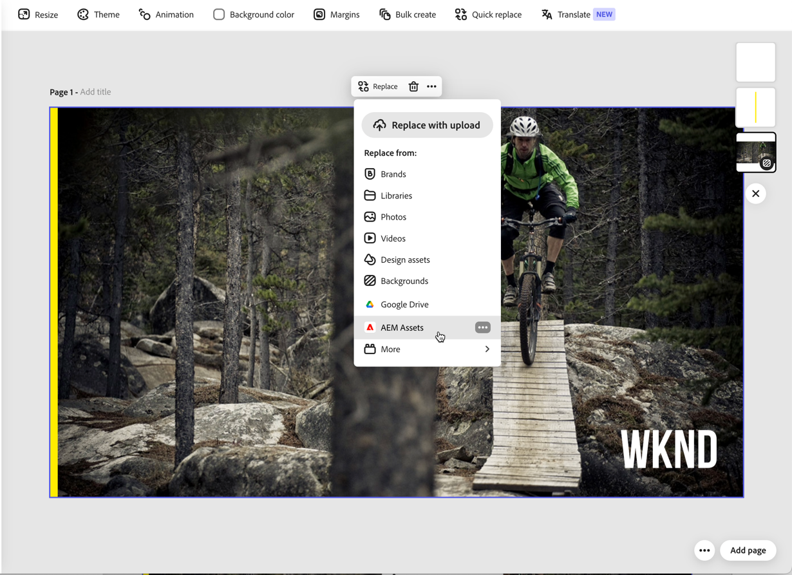

# Integração nativa com o Adobe Express {#native-integration-adobe-express}

O AEM Assets se integra nativamente ao Adobe Express, o que permite acessar diretamente os ativos armazenados no AEM Assets na interface do usuário do Adobe Express. Você pode colocar o conteúdo gerenciado no AEM Assets na tela Express e depois salvar o conteúdo novo ou editado em um repositório do AEM Assets. A integração oferece os seguintes benefícios principais:

* Maior reutilização de conteúdo ao editar e salvar novos ativos no AEM.

* Redução do tempo e esforço gerais para criar novos ativos ou novas versões de ativos existentes.

## Pré-requisitos {#prerequisites}

Qualificações para acessar o Adobe Express e pelo menos um ambiente no AEM Assets. O ambiente pode ser qualquer um dos repositórios no Assets as a Cloud Service ou no Assets Essentials.

## Usar o AEM Assets no editor do Adobe Express {#use-aem-assets-in-express}

Execute as seguintes etapas para começar a usar o AEM Assets no editor do Adobe Express:

1. Abra o aplicativo web do Adobe Express.

2. Abra uma nova tela em branco carregando um novo modelo ou projeto ou criando um ativo.

3. Clique em **[!UICONTROL Assets]** disponível no painel de navegação esquerdo. O Adobe Express exibe a lista de repositórios que você está autorizado a acessar, juntamente com a lista de ativos e pastas disponíveis no nível raiz.

4. Procure ou pesquise ativos no repositório e arraste-os e solte-os na tela. Como alternativa, clique nos ativos para colocá-los na tela. Também é possível filtrar ativos por vários critérios, como tipo de arquivo, tipo MIME e dimensões.

   >[!NOTE]
   >
   >O filtro por dimensão não se aplica a vídeos.

   

### Substituir imagem usando o upload do AEM {#replace-image-using-aem-upload}

Além disso, você pode substituir as imagens adicionadas usando o **[!UICONTROL AEM Upload]**. Para fazer isso, execute as seguintes etapas:

1. Procure ou pesquise ativos e arraste e solte na tela.

1. Selecione a imagem que deseja substituir. Clique em **[!UICONTROL Substituir]** e selecione **[!UICONTROL AEM Assets]** entre várias outras opções.

   

1. O painel **[!UICONTROL Upload do AEM]** é aberto no painel de navegação esquerdo. O Adobe Express exibe a lista de repositórios que você está autorizado a acessar, juntamente com a lista de ativos e pastas disponíveis no nível raiz. Selecione um ativo para visualizar a substituição na tela e clique em **[!UICONTROL Substituir]** para confirmar.

   >[!NOTE]
   >
   > Os tipos de arquivo do SVG não são compatíveis.

## Salvar projetos do Adobe Express no AEM Assets {#save-express-projects-in-assets}

Depois de incorporar as modificações apropriadas na tela Express, você pode salvá-la no repositório do AEM Assets.

1. Clique em **[!UICONTROL Compartilhar]** para abrir a caixa de diálogo **[!UICONTROL Compartilhar]**.

   

2. Na seção **[!UICONTROL Recomendado]** do painel direito, selecione **AEM Assets**. O Adobe Express exibe a caixa de diálogo de upload.

   

3. Selecione **Página atual** ou **Todas as páginas**. Especifique um nome e um formato para o(s) ativo(s) a ser(em) exportado(s). É possível exportar o conteúdo da tela de desenho nos formatos PNG, JPEG, PDF, MP4, MP4+PNG ou MP4+JPEG. O formato é ajustado automaticamente com base no(s) ativo(s) na(s) página(s) da tela.
Selecionar **Página atual** salva o ativo da página atual na pasta de destino. Se você selecionar **Todas as páginas** e o formato de exportação não for PDF, todas as páginas da tela serão salvas como arquivos separados em uma nova pasta dentro da pasta de destino. Se o formato de exportação for PDF, todas as páginas da tela de desenho serão salvas como um único arquivo PDF na pasta de destino.

4. Clique no ícone de pasta em **Pasta de destino** para selecionar um local e salvar o(s) ativo(s).

   

5. Opcional: Você pode adicionar metadados da campanha para o upload usando o campo **Nome do projeto ou da campanha**. Você pode usar um nome existente ou criar um novo. Você pode definir vários nomes de Projeto ou Campanha para o upload. Para registrar o nome, basta digitar o nome e pressionar Enter.
Como prática recomendada, a Adobe recomenda especificar valores no restante dos campos, bem como criar uma experiência de pesquisa aprimorada para os ativos carregados.

6. Da mesma forma, defina valores para os campos **[!UICONTROL Palavras-chave]** e **[!UICONTROL Canais]**.

7. Clique em **[!UICONTROL Carregar]** para carregar o(s) ativo(s) para o AEM Assets.

<table> 
    <tbody>
     <tr>
      <th><strong>Formatos compatíveis</strong></th>
      <th><strong>Tamanho</strong></th>
     </tr>
    </tr>
    <tr>
        <td>[!UICONTROL JPEG]</td>
        <td> 65 MP (por exemplo, 8K x 8K ou 16K x 4K) </td>
    </tr>
    <tr>
        <td>[!UICONTROL PNG]</td>
        <td> 65 MP (por exemplo, 8K x 8K ou 16K x 4K) </td>
    </tr>
    <tr>
        <td>[!UICONTROL SVG]</td>
        <td> Máximo de 250 KB</td>
    </tr>
    <tr>
        <td>[!UICONTROL MP4]</td>
        <td> 3840 X 3840 pixels, máximo de 200 MB</td>
    </tr>
    </tbody>
</table>

## Limitações {#limitations}

1. Para importar e exportar, o tipo de arquivo de vídeo compatível é MP4.

2. Para **importação de vídeo MP4**, não há suporte para vídeos com planos de fundo transparentes (canal alfa).
   <!--
   1. The maximum file size supported is 200 MB. If this limit exceeds, an alert message displays.
   2. The maximum supported resolution is 3840 X 3840 pixels.
   3. Videos with transparent backgrounds (alpha channel) are not supported.
   -->

3. Para **exportação de vídeo MP4**, o tamanho máximo de arquivo com suporte é 200 MB. Se esse limite for excedido, um alerta sugere cortar o vídeo para 200 MB ou menos, ou carregá-lo manualmente na pasta de destino do AEM Assets após baixá-lo.

