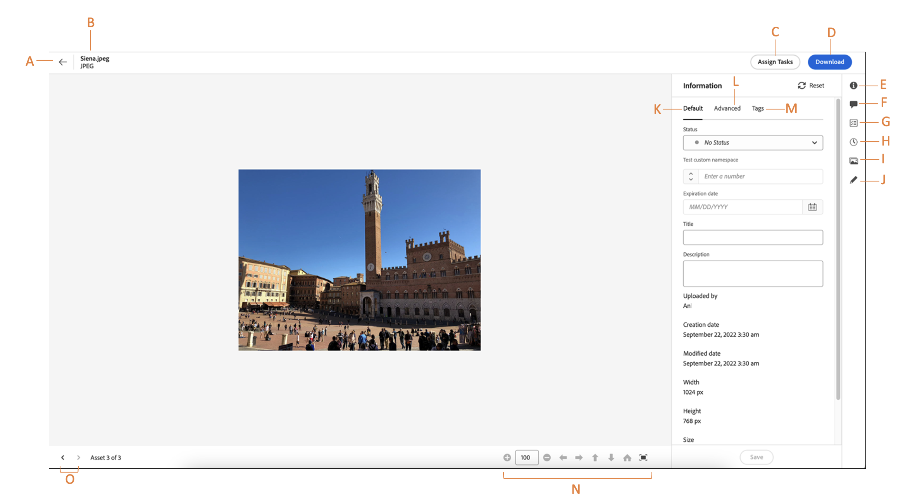

# Navegar para arquivos e pastas e exibir ativos {#view-assets-and-details}

<!-- TBD: Give screenshots of all views with many assets. Zoom out to showcase how the thumbnails/tiles flow on the UI in different views. -->

<!-- TBD: The options in left sidebar may change. Shared with me and Shared by me are missing for now. Update this section as UI is updated. -->

## Compreender a interface do [!DNL Assets view] {#understand-interface-navigation}

O [!DNL Assets view] oferece uma interface intuitiva e fácil de usar. A interface limpa facilita a localização e a memória dos ativos e informações relacionadas.

Ao fazer logon no [!DNL Assets view], você verá a seguinte interface.

![[!DNL Assets view]Interface](assets/assets-view-interface.png)

**A**: barra lateral esquerda para navegar pelo repositório e acessar algumas outras opções **B**: exibir ou recolher a barra lateral esquerda para aumentar a área de visualização de ativos **C**: filtrar os resultados de uma pesquisa **D**: selecionar todo o conteúdo da pasta selecionada **E**: opções de ordenação de ativos **F**: caixa de pesquisa **G**: upload ou arrastar e soltar arquivos com o botão `Add Assets` **H**: criar uma nova pasta **I**: alternar entre diferentes visualizações

<!-- TBD: Need an embedded video here with narration. It has to be hosted on MPC to be embeddable. -->

## Procurar e exibir ativos e pastas {#browse-repository}

Você pode navegar pelas pastas da interface do usuário principal ou da barra lateral esquerda. Ao navegar, você pode usar a interface para exibir miniaturas de ativos para navegar visualmente pelo repositório ou exibir detalhes do ativo para encontrar rapidamente o ativo que deseja. As opções disponíveis na barra lateral esquerda são:

* [Meu espaço de trabalho](/help/assets/my-workspace-assets-view.md): o Assets agora inclui um espaço de trabalho personalizável, que fornece widgets para acesso conveniente às principais áreas da interface do Assets, bem como as informações mais relevantes para você. Esta página serve como uma solução única para fornecer uma visão geral dos itens de trabalho e fornecer acesso rápido aos principais fluxos de trabalho. Um acesso mais conveniente a essas opções aumenta a eficiência e a velocidade do conteúdo.
* [Tarefas](/help/assets/my-workspace-assets-view.md): você pode visualizar as tarefas atribuídas a você na guia **Minhas tarefas**. Ao passo que as tarefas criadas por você podem ser visualizadas na guia **Tarefas atribuídas**. Além disso, as tarefas que você conclui estão localizadas em **Tarefas concluídas** guia.
* [Ativos](/help/assets/manage-organize-assets-view.md): lista de todas as pastas em uma exibição em árvore, à qual você tem acesso.
* **Visualizados recentemente**: lista de ativos que você visualizou recentemente. [!DNL Assets view] exibe somente os ativos que você visualiza. Ele não exibe os ativos que você percorre ao navegar pelos arquivos ou pastas do repositório.
* [Coleções](/help/assets/manage-collections-assets-view.md): uma coleção é um conjunto de ativos, pastas ou outras coleções na exibição do Adobe Experience Manager Assets. Use coleções para compartilhar ativos entre usuários. Diferente de pastas, uma coleção pode incluir ativos de locais diferentes. Você pode compartilhar várias coleções com um usuário. Cada coleção contém referências a ativos. A integridade referencial dos ativos é mantida entre as coleções.

* [Insights](/help/assets/manage-reports-assets-view.md#view-live-statistics): no [!DNL Assets view], você pode visualizar insights em tempo real no seu painel. A visualização do Assets permite visualizar dados do seu ambiente da visualização do Assets em tempo real, por meio do painel Insights. Você pode visualizar métricas de evento em tempo real dos últimos 30 dias ou dos últimos 12 meses.
* **Lixeira**: lista os ativos excluídos da pasta raiz **[!UICONTROL Ativos]**. É possível selecionar um ativo na pasta “Lixeira” e restaurá-lo para o local de origem ou excluí-lo permanentemente. Você pode especificar uma palavra-chave ou aplicar filtros, como status do ativo, tipo de arquivo, tipo de MIME, tamanho da imagem, criação de ativos, datas de modificação e vencimento, bem como filtrar por ativos descartados pelo usuário atual. Também é possível aplicar filtros personalizados para pesquisar ativos apropriados na pasta Lixeira. Para obter mais informações sobre o uso de filtros padrão e personalizados, consulte como [pesquisar ativos na exibição Ativos](/help/assets/search-assets-view.md).
* **Configurações**: é possível configurar várias opções de exibição de Ativos usando **Configurações**, como Formulários de metadados, Relatórios e Gerenciamento de taxonomia.

<!-- TBD: Not sure if we want to publish these right now. CC Libs are beta as per Greg.
* **Libraries**: Access to [!DNL Adobe Creative Cloud Team] (CCT) Libraries view. This view is visible only if the user is entitled to CCT Libraries.
-->

<!-- TBD: My Work Space shows task inbox and it is not visible on AEM Cloud Demos as of now. It is the source of truth server hence not documenting My Work Space option for now.
-->

É possível abrir ou recolher a barra lateral esquerda para aumentar a área de visualização de ativos disponível.

Em [!DNL Assets view], você pode exibir ativos, pastas e resultados de pesquisa em quatro tipos diferentes de layouts.

*  [!UICONTROL Visualização em lista]
*  [!UICONTROL Visualização em grade]
*  [!UICONTROL Visualização em galeria]
*  [!UICONTROL Visualização em cascata]

Para localizar um ativo, você pode classificar os ativos em ordem crescente ou decrescente de `Name`, `Relevancy`, `Size`, `Modified` e `Created`.

Para navegar em uma pasta, clique duas vezes nas miniaturas da pasta ou selecione a pasta na barra lateral esquerda. Para exibir detalhes de uma pasta, selecione-a e clique em Detalhes na barra de ferramentas na parte superior. Para navegar para cima e para baixo na hierarquia, use a barra lateral esquerda ou a navegação estrutural na parte superior.

*Figura: para navegar pela hierarquia, use a navegação estrutural na parte superior ou na barra lateral esquerda.*

## Visualizar ativos {#preview-assets}

Antes de usar, compartilhar ou baixar um ativo, é possível visualizá-lo mais detalhadamente. O recurso de visualização permite exibir não apenas as imagens, mas alguns outros tipos de ativos compatíveis.

Para visualizar um ativo, selecione-o e clique em [!UICONTROL Detalhes]  na barra de ferramentas na parte superior. Não é possível somente visualizar o ativo, mas também visualizar os metadados detalhados dele e realizar outras ações.

**A**: retornar à pasta atual ou ao resultado da pesquisa atual no repositório **B**: nome e formato do arquivo visualizado **C**: atribuir tarefas **D**: metadados avançados **E**: palavras-chave e tags inteligentes **F**: comentários e anotações **G**: visualizar tarefas relacionadas ao ativo selecionado **H**: visualizar e gerenciar versões **I**: visualizar versões da imagem **J**: editar imagem **K**: metadados básicos **L**: metadados avançados **M**: palavras-chave e tags inteligentes **N**: visualizar mais detalhadamente. Zoom, tela cheia e outras opções **O**: prosseguir para o ativo anterior ou passar para o próximo na pasta atual sem voltar à pasta

Você também pode visualizar vídeos.

Se você visualizar explicitamente um ativo, o [!DNL Assets view] o mostrará como um ativo exibido recentemente.

<!-- TBD: Describe the options.

Explicitly previewed assets are displayed as recently viewed assets. Give screenshot of this.
Other use cases after previewing.
-->

## Próximas etapas {#next-steps}

* Forneça feedback sobre o produto usando a opção [!UICONTROL Feedback] disponível na interface de visualização do Assets

* Forneça feedback sobre a documentação usando as opções [!UICONTROL Editar esta página]  ou [!UICONTROL Registrar um problema]  disponíveis na barra lateral direita

* Entre em contato com o [Atendimento ao cliente](https://experienceleague.adobe.com/pt-br?support-solution=General#support)

>[!MORELIKETHIS]
>
>* [Exibir versões de um ativo](/help/assets/manage-organize-assets-view.md#view-versions).
