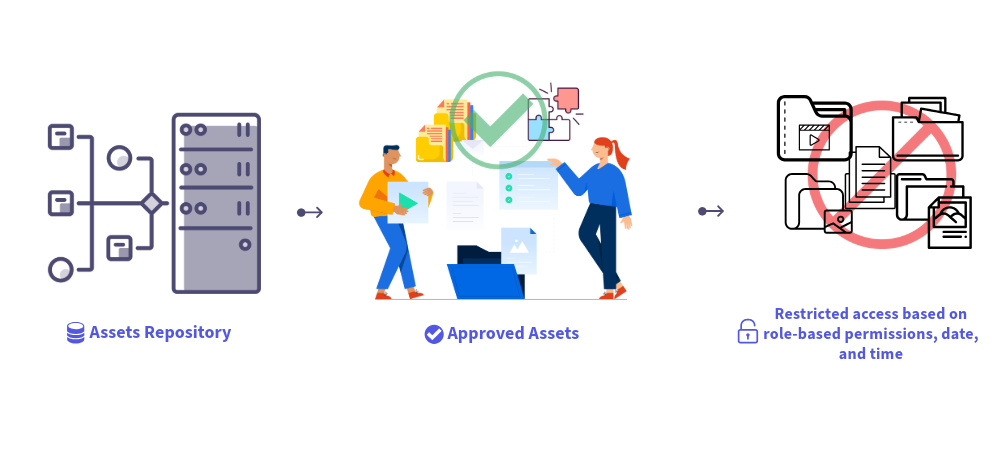

# Dynamic Media com recursos OpenAPI {#new-dynaminc-media-apis-overview}

No mundo digital veloz de hoje, explorar todo o potencial dos ativos digitais da sua marca é crucial para se manter à frente da concorrência. Uma solução holística de Gerenciamento de Assets digital (DAM) facilita a governança de ativos, promove a consistência da marca e acelera a entrega de conteúdo, garantindo a integridade da marca e experiências excepcionais para o cliente.

O Dynamic Media com recursos OpenAPI coloca o DAM no centro de um ecossistema ágil e eficiente de cadeia de fornecimento de conteúdo para garantir o controle e o delivery de ativos.

## Por que usar o Dynamic Media com recursos OpenAPI? {#new-dynamic-media-api-features}

O Dynamic Media com recursos OpenAPI oferece os seguintes benefícios principais:

* **Integrações perfeitas**: o Dynamic Media com recursos OpenAPI oferece um conjunto abrangente de APIs de pesquisa e entrega. Ele permite que seus desenvolvedores [integrem facilmente a entrega de ativos a seus aplicativos](/help/assets/integrate-new-dynamic-media-apis.md). Os aplicativos incluem o Adobe e aplicativos de terceiros. Além disso, fornece uma [interface de usuário do seletor de ativos de front-end do Micro](/help/assets/asset-selector.md) para pesquisar e selecionar ativos aprovados. O seletor pode ser facilmente integrado a qualquer aplicativo com base em estruturas JavaScript, como React JS, Angular JS e Vanilla JS.

* **Gerenciamento centralizado de ativos digitais**: o DAM é a única fonte da verdade para todos os ativos digitais. Seus ativos digitais são gerenciados centralmente no AEM Assets e entregues a aplicativos de consumo por referência usando URLs de entrega, sem copiar binários de ativos.

* **Atualizações em tempo real**: quaisquer alterações feitas em ativos aprovados no DAM, incluindo atualizações de versão e modificações de metadados, são refletidas automaticamente nas URLs de entrega. Com um valor curto de TTL (Time-to-Live) de 10 minutos configurado para o Dynamic Media com recursos OpenAPI via CDN, as atualizações ficam visíveis em todas as interfaces de criação e publicação em menos de 10 minutos.

* **Consistência da marca**: somente [ativos aprovados pela marca](/help/assets/approved-assets.md) são expostos aos aplicativos downstream. [Os gerentes de marca e profissionais de marketing mantêm controle rigoroso sobre os ativos da marca](/help/assets/restrict-assets-delivery.md). Somente as versões aprovadas e mais recentes do ativo estão disponíveis para uso, garantindo a consistência da marca em todos os canais e aplicativos.

* **Entrega otimizada para a Web**: os ativos digitais são entregues em formatos otimizados para a Web para aprimorar os Componentes principais da Web das suas experiências digitais. Isso inclui suporte para representações WebP para imagens, transmissão adaptável por meio de protocolos HLS ou DASH para vídeos e representações originais para documentos.

* **Transformação dinâmica de ativos**: nosso sistema permite a transformação instantânea de imagens usando parâmetros de URL conhecidos como modificadores de imagem. [Por exemplo, largura, altura, girar, virar, qualidade, recortar e formato](/help/assets/deliver-assets-apis.md). O Dynamic Media com recursos de OpenAPI também oferece suporte a recursos de recorte inteligente de imagem. As representações transformadas são geradas dinamicamente e entregues perfeitamente por meio da CDN.

* **Entrega segura de ativos**: o Dynamic Media com recursos OpenAPI fornece um mecanismo para controlar o acesso aos seus ativos digitais. Você pode especificar funções ou grupos de usuários como metadados para ativos que serão protegidos e definir um período predefinido durante o qual [somente usuários autorizados podem acessar esses ativos](/help/assets/restrict-assets-delivery.md). Os URLs de entrega dos ativos protegidos não são resolvidos para usuários não autorizados durante o período restrito.

* **Insights de dados para tomar decisões informadas**: além do gerenciamento de ativos e da entrega, ele captura insights de dados de entrega em entregas de ativos na CDN, permitindo que os gerentes de marca rastreiem as métricas de entrega entre canais. Ele permite que eles tomem decisões orientadas por dados para a otimização contínua da governança de ativos e estratégias de entrega.

## Pré-requisitos para acessar o Dynamic Media com recursos OpenAPI {#prerequisites-new-dynaminc-media-apis}

Para acessar o Dynamic Media com recursos OpenAPI, você deve ter licenças para:

* AEM Assets as a Cloud Service

* AEM Dynamic Media

## Como habilitar o Dynamic Media com recursos OpenAPI? {#enable-new-dynamic-media-apis}

Antes de enviar uma solicitação para ativar o Dynamic Media com recursos OpenAPI no AEM as a Cloud Service, verifique se ele ainda não está ativado. Para verificar se está ativado, execute as seguintes etapas:

1. A ser confirmado pela engenharia e pelo gerenciamento de produtos

Para habilitar o Dynamic Media com recursos OpenAPI no AEM as a Cloud Service, envie um tíquete de Suporte Adobe com os seguintes detalhes:

* ID do programa e do ambiente do Cloud Service

* Detalhes do caso de uso a ser resolvido com o Dynamic Media com integração de recursos OpenAPI

* Detalhes dos aplicativos downstream para integrar ao Dynamic Media com recursos de OpenAPI.

  >[!NOTE]
  >
  > Para integrar a um aplicativo não-Adobe, forneça nomes de domínio à lista de permissões onde o aplicativo está hospedado.

* Detalhes dos principais contatos do cliente envolvidos no projeto de integração.

Depois de enviar o tíquete de suporte, o Adobe habilita o Dynamic Media com recursos OpenAPI no ambiente Cloud Service e compartilha os detalhes, como ID do cliente IMS, para você prosseguir com a integração.

## Saiba mais sobre os principais recursos {#learn-more-key-capabilities}

<table>
<td>
   
   

      <a href="/help/assets/approved-assets.md">
      <strong>Aprovar ativos no Experience Manager Assets</strong>
      </a>
   

   

      <em>Aprove ativos no AEM Assets para simplificar o gerenciamento de ativos, garantindo um processo controlado e eficiente para manuseio de ativos.</em>
   

</td>
<td>
   
   

      <a href="/help/assets/integrate-new-dynamic-media-apis.md">
      <strong>Integrar o AEM Assets com aplicativos downstream</strong>
      </a>
   

   

      <em>Integre sua própria interface de usuário personalizada com o repositório do Experience Manager Assets usando as APIs de Pesquisa e Entrega ou use o Seletor de Ativos de Microfront-end do Adobe.</em>
   

</td>
<td>
   
   

      <a href="/help/assets/asset-selector.md">
      <strong>Seletor de ativos de front-end do Adobe</strong>
      </a>
   

   

      <em>Uma interface de usuário que interage com o repositório do AEM Assets para pesquisar ativos e usá-los na sua experiência de criação de aplicativos.</em>
   

</td>
</table>
<table>
<td>
   
   

      <a href="/help/assets/search-assets-api.md">
      <strong>Pesquisar ativos no repositório do Experience Manager Assets</strong>
      </a>
   

   

      <em>Pesquise ativos no repositório do AEM Assets para que eles possam ser entregues aos aplicativos downstream.</em>
   

</td>
<td>
   
   

      <a href="/help/assets/deliver-assets-apis.md">
      <strong>Enviar ativos para aplicativos downstream</strong>
      </a>
   

   

      <em>Entregar ativos para aplicativos downstream integrados usando uma URL de Entrega.</em>
   

</td>
<td>
   
   

      <a href="/help/assets/restrict-assets-delivery.md">
      <strong>Restringir o acesso a ativos no Experience Manager</strong>
      </a>
   

   

      <em> Os administradores do DAM ou gerentes de marca restringem o acesso configurando funções para ativos aprovados na instância de autor do AEM as a Cloud Service.</em>
   

</td>
</table>

