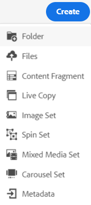

# Pasta privada em [!DNL Adobe Experience Manager Assets] {#private-folder}

| Versão | Link do artigo |
| -------- | ---------------------------- |
| AEM 6.5 | [Clique aqui](https://experienceleague.adobe.com/docs/experience-manager-65/assets/managing/private-folder.html?lang=en) |
| AEM as a Cloud Service | Este artigo |

Você pode criar uma pasta privada na variável [!DNL Adobe Experience Manager Assets] que está disponível exclusivamente para você. Você pode compartilhar essa pasta particular com outros usuários e atribuir vários privilégios a eles. Com base no nível de privilégio atribuído, os usuários podem executar várias tarefas na pasta, por exemplo, exibir ativos na pasta ou editar os ativos.

>[!NOTE]
>
>A pasta privada tem pelo menos um membro com a função Proprietário.
>
>Para criar uma pasta privada, é necessário `Read` e `Modify` permissões na pasta pai na qual você cria uma pasta privada. Se você não for um administrador, essas permissões não serão ativadas por padrão no `/content/dam`. Nesse caso, primeiro obtenha essas permissões para sua ID/grupo de usuários antes de tentar criar pastas privadas.

## Criar e compartilhar pasta privada  {#create-share-private-folder}

Para criar e compartilhar uma pasta privada:

1. No [!DNL Assets] clique no link **[!UICONTROL Criar]** na barra de ferramentas e selecione **[!UICONTROL Pasta]** no menu.

   

1. No **[!UICONTROL Criar pasta]** , insira um `Title` e `Name` (opcional) para a pasta.

   Selecione o **[!UICONTROL Privado]** e clique em **[!UICONTROL Criar]**.

   

   Uma pasta privada é criada. Agora você pode [adicionar ativos](add-assets.md#upload-assets) à pasta e compartilhe a pasta com outros usuários ou grupos. A pasta não estará visível para nenhum outro usuário até que você a compartilhe e atribua privilégios a ele.

1. Para compartilhar a pasta, selecione a pasta e clique em **[!UICONTROL Propriedades]** na barra de ferramentas.

1. No **[!UICONTROL Propriedades da pasta]** , selecione um usuário ou grupo na **[!UICONTROL Adicionar usuário]** , atribuir uma função (`Viewer`, `Editor`ou `Owner`) na sua pasta particular e clique em **[!UICONTROL Adicionar]**.

   

   É possível atribuir várias funções, como `Editor`, `Owner`ou `Viewer` ao usuário com quem você compartilha a pasta. Se você atribuir um `Owner` para o usuário, o usuário tem `Editor` privilégios na pasta. Além disso, o usuário pode compartilhar a pasta com outras pessoas. Se você atribuir um `Editor` usuário pode editar os ativos na sua pasta privada. Se você atribuir uma função de visualizador, o usuário só poderá visualizar os ativos na pasta privada.

   >[!NOTE]
   >
   >A pasta privada tem pelo menos um membro com `Owner` função. Portanto, o administrador não pode remover todos os membros proprietários de uma pasta privada. No entanto, para remover os proprietários existentes (e o próprio administrador) da pasta privada, o administrador deve adicionar outro usuário como proprietário.

1. Clique em **[!UICONTROL Salvar e fechar]**. Dependendo da função atribuída, o usuário recebe um conjunto de privilégios em sua pasta privada quando faz logon no [!DNL Assets].
1. Clique em **[!UICONTROL Ok]** para fechar a mensagem de confirmação.
1. O usuário com quem você compartilha a pasta recebe uma notificação de compartilhamento em sua interface do usuário.

1. Clique em [!UICONTROL Notificação] para abrir uma lista de notificações.

   

1. Clique na entrada da pasta privada compartilhada pelo administrador para abrir a pasta.

## Exclusão de pasta privada {#delete-private-folder}

É possível excluir uma pasta selecionando-a e, em seguida, [!UICONTROL Excluir] no menu superior ou usando a tecla Backspace em seu teclado.

>[!CAUTION]
>
>Se você excluir uma pasta privada do CRXDE Lite, os grupos de usuários redundantes serão deixados no repositório.

>[!NOTE]
>
>Se você excluir uma pasta usando o método acima na interface do usuário do, os grupos de usuários associados também serão excluídos.
>
>No entanto, os grupos de usuários redundantes, não utilizados e gerados automaticamente existentes podem ser removidos do repositório usando `clean` método no JMX na instância do autor (`http://[server]:[port]/system/console/jmx/com.day.cq.dam.core.impl.team%3Atype%3DClean+redundant+groups+for+Assets`).

**Consulte também**

* [Traduzir ativos](translate-assets.md)
* [API HTTP de ativos](mac-api-assets.md)
* [Formatos de arquivo compatíveis com os ativos](file-format-support.md)
* [Pesquisar ativos](search-assets.md)
* [Ativos conectados](use-assets-across-connected-assets-instances.md)
* [Relatórios de ativos](asset-reports.md)
* [Esquemas de metadados](metadata-schemas.md)
* [Baixar ativos](download-assets-from-aem.md)
* [Gerenciar metadados](manage-metadata.md)
* [Pesquisar aspectos](search-facets.md)
* [Gerenciar coleções](manage-collections.md)
* [Importação de metadados em massa](metadata-import-export.md)
