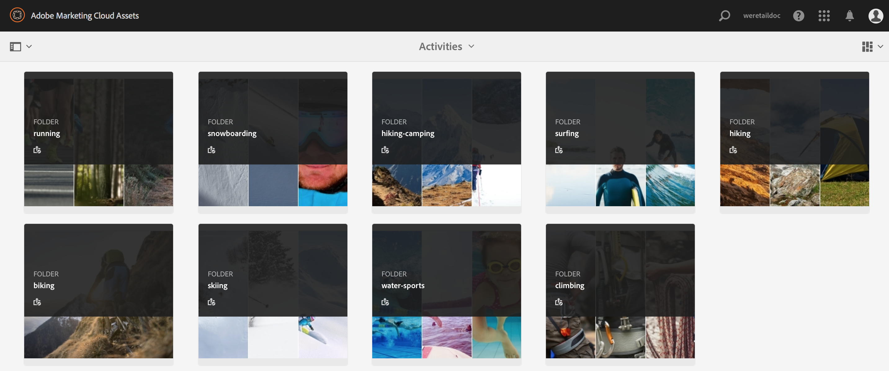

# Publicar ativos, pastas e coleções no Brand Portal {#publish-aem-assets-to-brand-portal}

Como administrador do Adobe Experience Manager (AEM) Assets, você pode publicar ativos, pastas e coleções na instância do AEM Assets Brand Portal. Além disso, você pode agendar o fluxo de trabalho de publicação de um ativo ou pasta para uma data ou hora posterior. Depois de publicados, os usuários do Brand Portal podem acessar e distribuir ainda mais os ativos, as pastas e as coleções para outros usuários.

No entanto, você deve primeiro configurar os ativos AEM com o Portal da marca. Para obter detalhes, consulte [Configurar ativos AEM com o Portal](configure-aem-assets-with-brand-portal.md)da marca.

Se você fizer modificações subsequentes no ativo, pasta ou coleção original nos ativos AEM, as alterações não serão refletidas no Portal de marcas até que você publique novamente nos ativos AEM. Esse recurso garante que as alterações do trabalho em andamento não estejam disponíveis no Brand Portal. Somente as alterações aprovadas publicadas por um administrador estão disponíveis no Brand Portal.

* [Publicar ativos no Brand Portal](#publish-assets-to-bp)
* [Publicar pastas no Brand Portal](#publish-folders-to-brand-portal)
* [Publicar coleções no Brand Portal](#publish-collections-to-brand-portal)

>[!NOTE]
>
>A Adobe recomenda uma publicação escalonada, de preferência durante horas que não sejam de pico, para que o autor do AEM não ocupe recursos excessivos.

## Publish assets to Brand Portal {#publish-assets-to-bp}

Veja a seguir as etapas para publicar ativos dos ativos AEM no Portal de marcas:

1. No console Ativos, abra a pasta pai e selecione todos os ativos que deseja publicar e clique na opção Publicação **** rápida na barra de ferramentas.

   

1. Estas são as duas maneiras de publicar ativos:
   * [Publicar agora](#publish-to-bp-now) (Publicar ativos imediatamente)
   * [Publicar mais tarde](#publish-to-bp-now) (agendar ativos de publicação)

### Publicar ativos agora {#publish-to-bp-now}

Para publicar os ativos selecionados no Brand Portal, execute um dos procedimentos a seguir:

* Na barra de ferramentas, selecione Publicação **[!UICONTROL rápida]**. No menu, clique em **[!UICONTROL Publicar no Brand Portal]**.

* Na barra de ferramentas, selecione **[!UICONTROL Gerenciar publicação]**.

   1. Em **[!UICONTROL Ação]**, selecione **[!UICONTROL Publicar no Brand Portal]** e, em **[!UICONTROL Agendamento]**, selecione **[!UICONTROL Agora]**. Clique em **[!UICONTROL Avançar]**.

   2. Confirme sua seleção no **[!UICONTROL Escopo]** e clique em **[!UICONTROL Publicar no portal]** da marca.

Será exibida uma mensagem informando que os ativos foram enfileirados para publicação no Brand Portal. Faça logon na interface do Brand Portal para ver os ativos publicados.

### Publicar ativos mais tarde {#publish-to-bp-later}

Para agendar a publicação dos ativos no Brand Portal para uma data ou hora posterior:

1. Selecione os ativos que deseja programar para publicação, selecione **[!UICONTROL Gerenciar publicação]** na barra de ferramentas na parte superior.

1. Na página **[!UICONTROL Gerenciar publicação]** , selecione **[!UICONTROL Publicar no portal]** da marca em **[!UICONTROL Ação]** e selecione **[!UICONTROL Mais tarde]** em **[!UICONTROL Agendamento]**.

   

1. Selecione uma data **de** Ativação e especifique a hora. Clique em **Avançar**.

1. Especifique um título **[!UICONTROL de]** Fluxo de trabalho em **[!UICONTROL Workflows]**. Clique em **[!UICONTROL Publicar mais tarde]**.

   

Faça logon na interface do Brand Portal para ver se os recursos publicados estão disponíveis.

<!--

End - Publish assets to Brand Portal
Start- Publish folders to Brand Portal
-->

## Publish folders to Brand Portal{#publish-folders-to-brand-portal}

Você pode publicar ou cancelar a publicação de pastas de ativos imediatamente ou agendar para uma data ou hora posterior.

### Publish folders to Brand Portal {#publish-folders-to-brand-portal-1}

1. No console Ativos, selecione as pastas que deseja publicar e clique na opção Publicação **** rápida na barra de ferramentas.

   

1. **Publicar pastas agora**

   Para publicar as pastas selecionadas no Brand Portal, execute um dos procedimentos a seguir:

   * Na barra de ferramentas, selecione Publicação **[!UICONTROL rápida]**. No menu, selecione **[!UICONTROL Publicar no Brand Portal]**.

   * Na barra de ferramentas, selecione **[!UICONTROL Gerenciar publicação]**.

      1. Em **[!UICONTROL Ação]**, selecione **[!UICONTROL Publicar no Brand Portal]**. Em **[!UICONTROL Agendamento]**, selecione **[!UICONTROL Agora]**. Clique em **[!UICONTROL Avançar]**.
      1. Confirme sua seleção no **[!UICONTROL Escopo]** e clique em **[!UICONTROL Publicar no portal]** da marca.
   Será exibida uma mensagem informando que a pasta foi colocada na fila para publicação no Brand Portal. Faça logon na interface do Brand Portal para ver a pasta publicada.

1. **Publicar pastas mais tarde**

   Para agendar a publicação das pastas de ativos para uma data ou hora posterior.

   1. Selecione as pastas que deseja agendar para publicação, selecione **[!UICONTROL Gerenciar publicação]** na barra de ferramentas na parte superior.
   1. Em **[!UICONTROL Ação]**, selecione **[!UICONTROL Publicar no Brand Portal]** e, em **[!UICONTROL Agendamento]** , selecione **[!UICONTROL Mais Tarde]**.

      

   1. Selecione uma data **[!UICONTROL de]** Ativação e especifique a hora. Clique em **[!UICONTROL Avançar]**.
   1. Confirme sua seleção no **[!UICONTROL Escopo]**. Clique em **[!UICONTROL Avançar]**.
   1. Especifique um título de Fluxo de trabalho em **[!UICONTROL Workflows]**. Clique em **[!UICONTROL Publicar mais tarde]**.

      

### Unpublish folders from Brand Portal {#unpublish-folders-from-brand-portal}

Você pode remover qualquer pasta de ativos publicada no Brand Portal, desfazendo a publicação da instância dos ativos AEM. Após desfazer a publicação da pasta original, a cópia não estará mais disponível para os usuários do Brand Portal.

Você pode cancelar a publicação de pastas de ativos do Brand Portal imediatamente ou agendá-la para uma data e hora posteriores.

Para cancelar a publicação de pastas de ativos do Portal de marcas:

1. No console Ativos AEM, selecione a pasta que deseja cancelar a publicação.

   

1. Na barra de ferramentas, clique em **[!UICONTROL Gerenciar publicação]**.

1. **Cancelar a publicação do Brand Portal agora**

   Para cancelar a publicação imediata da pasta selecionada no Portal de marcas:

   1. Na barra de ferramentas, selecione **Gerenciar publicação**.
   1. Em **Ação**, selecione **Cancelar a publicação no Portal** da Marca e, em **Agendamento**, selecione **Agora**. Clique em **Avançar.**
   1. Confirme sua seleção no **Escopo** e clique em **Cancelar publicação no Portal** da marca.
   

1. **Cancelar a publicação do Brand Portal mais tarde**

   Para agendar a despublicação de uma pasta do Brand Portal para uma data e hora posteriores:

   1. Na barra de ferramentas, selecione **Gerenciar publicação**.
   1. Em **Ação**, selecione **Cancelar a publicação no Portal** da Marca e, em **Agendamento** , selecione **Mais Tarde**.
   1. Selecione uma data **de** Ativação e especifique a hora. Clique em **Avançar**.
   1. Confirme sua seleção no **Escopo** e clique em **Avançar**.
   1. Especifique um título **de** Fluxo de trabalho em **Workflows**. Clique em **Cancelar publicação mais tarde.**

      

<!--
End - Publish folders to Brand Portal
Start- Publish Collections to Brand Portal

-->

## Publish collections to Brand Portal {#publish-collections-to-brand-portal}

Você pode publicar ou cancelar a publicação de coleções da instância dos ativos AEM.

>[!NOTE]
>
>Os fragmentos de conteúdo não podem ser publicados no Brand Portal. Portanto, se você selecionar fragmentos de conteúdo no AEM Asset, a ação **[!UICONTROL Publicar no Brand Portal]** não estará disponível.
>
>Se as coleções que contêm fragmentos de conteúdo forem publicadas do AEM Assets para o Brand Portal, todo o conteúdo da pasta, exceto fragmentos de conteúdo, será replicado para a interface do Brand Portal.

### Publicar coleções {#publish-a-collection-to-brand-portal}

Veja a seguir as etapas para publicar coleções dos ativos AEM no Portal de marcas:

1. Na interface do usuário do AEM Assets, clique no logotipo do AEM.
1. From **Navigation** page, go to **[!UICONTROL Assets]** > **[!UICONTROL Collections]**.
1. No console **Coleções** , selecione as coleções que deseja publicar no Brand Portal.

   

1. Na barra de ferramentas, clique em **[!UICONTROL Publicar no Brand Portal]**.
1. Na caixa de diálogo de confirmação, clique em **[!UICONTROL Publicar]**.
1. Feche a mensagem de confirmação.

   Faça logon no Brand Portal como administrador. A coleção publicada está disponível no console **[!UICONTROL Coleções]** .

   

## Cancelar publicação de coleções {#unpublish-collections}

Você pode remover qualquer coleção publicada no Brand Portal ao cancelar a publicação da sua instância do AEM Assets. Após desfazer a publicação da coleção original, a cópia não estará mais disponível para os usuários do Brand Portal.

Veja a seguir as etapas para cancelar a publicação de coleções:

1. No console Coleções da instância dos ativos AEM, selecione a coleção que deseja cancelar a publicação.

   

1. Na barra de ferramentas, clique no ícone **[!UICONTROL Remover do Brand Portal]** .
1. Na caixa de diálogo, clique em **[!UICONTROL Cancelar publicação]**.
1. Feche a mensagem de confirmação. A coleção é removida da interface do Brand Portal.

Consulte a documentação [do Portal de](https://docs.adobe.com/content/help/en/experience-manager-brand-portal/using/home.html) marca para obter mais informações sobre a distribuição de ativos, pastas e coleções para os usuários finais.

<!--

End - Publish Collections to Brand Portal

-->

