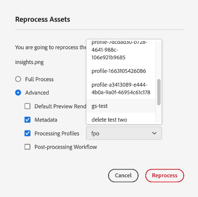

# Reprocessamento de ativos digitais {#reprocessing-digital-assets}

É possível reprocessar ativos em uma pasta que já tenha um perfil de metadados existente que você alterou posteriormente. Se quiser que a predefinição recém-editada seja reaplicada aos ativos existentes na pasta, reprocesse a pasta. Você pode reprocessar quantos ativos forem necessários.

Reprocessamento de ativos em uma pasta se você encontrar um dos dois cenários a seguir:

* Você deseja executar uma predefinição de conjunto de lotes em uma pasta de ativos existente que já tenha ativos carregados nela.
* Posteriormente, você pode editar uma predefinição de conjunto de lotes existente que foi aplicada anteriormente a uma pasta de ativos.

## Reprocessar ativos {#reprocessing-steps}

Para reprocessar ativos em uma pasta:

1. Entrada [!DNL Experience Manager], na página Ativos, selecione os ativos adicionados recentemente ou os ativos que deseja reprocessar.
Caso selecione uma pasta:

   * O fluxo de trabalho considera todos os arquivos na pasta selecionada de forma recursiva.
   * Se houver uma ou mais subpastas com ativos na pasta principal selecionada, o fluxo de trabalho reprocessará cada ativo na hierarquia de pastas.
   * Como prática recomendada, evite executar esse fluxo de trabalho em uma hierarquia de pastas com mais de 1000 ativos.

1. Selecionar **[!UICONTROL Reprocessar ativos]**. Escolha entre as duas opções:

   

   * **[!UICONTROL Processo completo]:** Selecione essa opção quando quiser executar o processo geral, incluindo o perfil padrão, o perfil personalizado, o processamento dinâmico (se configurado) e os fluxos de trabalho de pós-processamento.
   * **[!UICONTROL Avançado]:** Selecione essa opção para escolher o reprocessamento avançado.

     

     Selecione entre as seguintes opções avançadas:

      * **[!UICONTROL Representações de Visualização Padrão]:** Escolha essa opção quando quiser reprocessar as representações que são visualizadas por padrão.

      * **[!UICONTROL Metadados]:** Escolha essa opção quando quiser extrair informações de metadados e tags inteligentes para os ativos selecionados.

      * **[!UICONTROL Processamento de perfis]:** Escolha esta opção quando quiser reprocessar um perfil selecionado. Você pode escolher **[!UICONTROL Processo completo]** opção para incluir o processamento padrão e o perfil personalizado atribuído no nível da pasta.
        <!--When assets are uploaded to a folder, [!DNL Experience Manager] checks the containing folder's properties for a processing profile. If none is applied, a parent folder in the hierarchy is checked for a processing profile to apply.-->

      * **[!UICONTROL Fluxo de trabalho de pós-processamento]:** Escolha essa opção quando for necessário processamento adicional de ativos que não podem ser obtidos usando os perfis de processamento. Workflows de pós-processamento adicionais podem ser adicionados à configuração. O pós-processamento permite adicionar processamento totalmente personalizado além do processamento configurável usando microsserviços de ativos.

Consulte [usar microsserviços de ativos e perfis de processamento](https://experienceleague.adobe.com/docs/experience-manager-cloud-service/content/assets/manage/asset-microservices-configure-and-use.html?lang=en) para saber mais sobre perfis de processamento e fluxo de trabalho de pós-processamento.

Depois de selecionar as opções apropriadas, clique em **[!UICONTROL Reprocessar]**. A mensagem de sucesso é exibida.

## Cenários para reprocessar ativos digitais {#scenarios-reprocessing}

[!DNL Experience Manager] O permite o reprocessamento de ativos digitais para os seguintes componentes.

### Tags inteligentes {#reprocessing-smart-tags}

As organizações que lidam com ativos digitais usam cada vez mais vocabulário controlado por taxonomia em metadados de ativos. Basicamente, ele inclui uma lista de palavras-chave que funcionários, parceiros e clientes normalmente usam para consultar e pesquisar ativos digitais de uma classe específica. Marcar ativos com um vocabulário controlado por taxonomia garante que eles sejam facilmente identificados e recuperados.

Em comparação aos vocabulários de linguagem natural, marcar ativos digitais com base na taxonomia de negócios ajuda a alinhá-los aos negócios de uma empresa e garante que os ativos mais relevantes apareçam nas pesquisas.

Leia mais sobre [Tags inteligentes para ativos de vídeo](https://experienceleague.adobe.com/docs/experience-manager-cloud-service/content/assets/manage/smart-tags-video-assets.html?lang=en).

Leia mais sobre [Reprocessar tags de cores para imagens existentes no DAM](https://experienceleague.adobe.com/docs/experience-manager-cloud-service/content/assets/manage/color-tag-images.html?lang=en#color-tags-existing-images).

### Corte inteligente {#reprocessing-smart-crop}

Leia mais sobre [Corte inteligente do Dynamic Media](https://experienceleague.adobe.com/docs/experience-manager-cloud-service/content/assets/dynamicmedia/image-profiles.html?lang=en) que permite aplicar cortes específicos (**[!UICONTROL Corte inteligente]** e recorte de pixels) e a configuração de nitidez nos ativos carregados.

### Metadados {#reprocessing-metadata}

[!DNL Adobe Experience Manager Assets] O mantém metadados de cada ativo. Ele facilita a categorização e a organização de ativos e ajuda as pessoas que estão procurando um ativo específico. Com a capacidade de extrair metadados de arquivos carregados no Experience Manager Assets, o gerenciamento de metadados se integra ao fluxo de trabalho criativo. Com a capacidade de manter e gerenciar metadados com seus ativos, você pode organizar e processar ativos automaticamente com base nos metadados.

Leia mais sobre [Reprocessamento de perfis de metadados](https://experienceleague.adobe.com/docs/experience-manager-cloud-service/content/assets/manage/metadata-profiles.html?lang=en).

### Reprocessar ativos do Dynamic Media em uma pasta {#reprocessing-dynamic-media}

Você pode reprocessar ativos em uma pasta que já tenha um Perfil de imagem do Dynamic Media existente ou um Perfil de vídeo do Dynamic Media que você alterou posteriormente. Para obter mais informações, visite [reprocessar ativos do Dynamic Media em uma pasta.](https://experienceleague.adobe.com/docs/experience-manager-cloud-service/content/assets/admin/about-image-video-profiles.html?lang=en)

>[!NOTE]
>
>Você precisa configurar [!DNL Dynamic Media] no ambiente para ativar a caixa de diálogo Dynamic Media.
>

### Fluxos de trabalhos

Leia mais sobre [perfis de processamento e fluxos de trabalho de pós-processamento](https://experienceleague.adobe.com/docs/experience-manager-cloud-service/content/assets/manage/asset-microservices-configure-and-use.html?lang=en).

