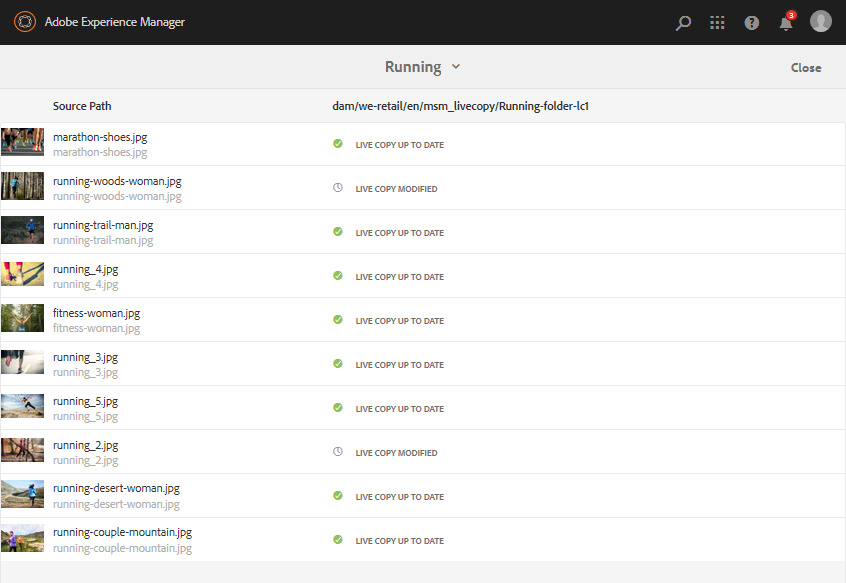

# Reutilizar ativos usando MSM para ativos{#reuse-assets-using-msm-for-assets}

A funcionalidade Multi Site Manager (MSM) no Adobe Experience Manager (AEM) permite que os usuários reutilizem o conteúdo criado uma vez e reutilizado em vários locais da Web. O mesmo está disponível para ativos digitais que a funcionalidade MSM para ativos. Usando o MSM para ativos, é possível:

* Crie ativos uma vez e faça cópias desses ativos para reutilizá-los em outras áreas do site.
* Mantenha várias cópias sincronizadas e atualize a cópia mestre original uma vez para encaminhar as alterações para as cópias secundárias.
* Faça alterações locais suspendendo temporária ou permanentemente a vinculação entre ativos pai e filho.

## Entenda os benefícios e os conceitos {#concepts}

### Como funciona e benefícios {#how-it-works-and-the-benefits}

O AEM mantém um link entre o ativo original e suas cópias vinculadas, chamadas de cópias ativas (LCs). A vinculação mantida permite que alterações centralizadas sejam enviadas para muitas cópias online. Isso permite atualizações mais rápidas, além de eliminar as limitações do gerenciamento de cópias duplicadas. A propagação das alterações é livre de erros e centralizada. A funcionalidade permite espaço para atualizações limitadas a cópias online selecionadas. Os usuários podem desanexar a vinculação, ou seja, interromper a herança, e fazer edições locais que não serão substituídas quando a próxima vez que a cópia mestre for atualizada e as alterações forem distribuídas. A desanexação pode ser feita para alguns campos de metadados selecionados ou para um ativo inteiro. Permite flexibilidade para atualizar localmente ativos que são originalmente herdados de uma cópia mestre.

O MSM mantém uma relação ao vivo entre o ativo de origem e suas cópias ao vivo para que:

* As alterações nos ativos de origem também são aplicadas (distribuídas) às cópias online, ou seja, as cópias online são sincronizadas com a fonte.
* É possível atualizar as cópias online suspendendo a relação ao vivo ou removendo a herança de alguns campos limitados. As modificações na fonte não são mais aplicadas à cópia online.

### Glossário de termos de MSM para ativos {#glossary}

**Origem** Os ativos ou pastas originais. Cópia principal da qual são derivadas cópias online.

**Live copy** A cópia dos ativos/pastas de origem que está sincronizada com a origem. As cópias online podem ser uma fonte de outras cópias online. Veja como criar LCs.

**Herança** Um link/referência entre um ativo/pasta de live copy e sua origem que o sistema usa para lembrar onde enviar as atualizações. A herança existe em um nível granular para campos de metadados. A herança pode ser removida para campos de metadados seletivos e, ao mesmo tempo, preservar a relação ao vivo entre a fonte e sua cópia ao vivo.

**Implantação** Uma ação que empurra as modificações feitas na fonte para downstream para suas cópias ativas. É possível atualizar uma ou mais cópias ao vivo de uma só vez usando a ação de implantação. Consulte implantação.

**Regras de configuração** de implantação que determinam quais propriedades são sincronizadas, como e quando. Essas configurações são aplicadas ao criar cópias ao vivo; podem ser editados posteriormente; e um filho pode herdar a configuração de implantação de seu ativo pai. Para o MSM for Assets, use apenas a configuração de implantação Padrão. As outras configurações de implantação não estão disponíveis para o MSM for Assets.

**Sincronizar** outra ação, além do lançamento, que traz paridade entre a origem e sua live copy enviando as atualizações da origem para as live copies. Uma sincronização é iniciada para uma cópia ativa específica e a ação extrai as alterações da origem. Usar essa ação é possível para atualizar apenas uma das cópias ativas. Consulte sincronizar ação.

**Suspender** Remova temporariamente a relação ativa entre uma live copy e seu ativo/pasta de origem. Você pode retomar a relação. Consulte ação de suspensão.

**Retomar** Retomar a relação ao vivo para que uma live copy comece a receber as atualizações da fonte. Consulte ação de retomada.

**A ação Redefinir** redefinir torna a live copy como uma réplica da origem, substituindo quaisquer alterações locais. Também remove cancelamentos de herança e redefine a herança em todos os campos de metadados. Para fazer modificações locais no futuro, você deve cancelar novamente a herança de campos específicos. Consulte modificações locais no LC.

**Desanexar** Irrevogavelmente remove a relação ativa de um ativo/pasta de cópia ativa. Depois de desanexar a ação, as cópias online nunca poderão receber atualizações da origem e ela deixará de ser uma cópia ativa. Consulte remover relacionamento.

## Criar cópia online de um ativo {#createlc}

Para criar uma live copy de um ou mais ativos ou pastas de origem, siga um destes procedimentos:

* Método 1: Selecione os ativos de origem e clique em **[!UICONTROL Criar > Live Copy]** na barra de ferramentas na parte superior.

* Método 2: Na interface do usuário do AEM, clique em **[!UICONTROL Criar > Live Copy]** no canto superior direito da interface.

Você pode criar cópias ao vivo de um ativo ou de uma pasta, uma de cada vez. Você pode criar cópias ao vivo que são derivadas de um ativo ou de uma pasta que seja uma cópia ao vivo.  Fragmentos de conteúdo (CFs) não são suportados no caso de uso. Ao tentar criar suas cópias online, os CFs são copiados como estão sem nenhum relacionamento. Os CFs copiados são um instantâneo no tempo e não são atualizados quando os CFs originais são atualizados.

Para criar cópias ao vivo usando o primeiro método, siga estas etapas:

1. Selecione os ativos ou pastas de origem. Na barra de ferramentas, clique em **[!UICONTROL Criar > Live Copy]**.

   

   Criar live copy a partir da interface do AEM

1. Selecione uma pasta de destino. Clique em **[!UICONTROL Avançar]**.
1. Forneça o título e o nome. Os ativos não têm filhos. Ao criar uma cópia ao vivo das pastas, você pode optar por incluir ou excluir filhos.
1. Selecione uma configuração de implantação. Clique em **[!UICONTROL Criar]**.

Para criar cópias ao vivo usando o segundo método, siga estas etapas:

1. Na interface do AEM, no canto superior direito, clique em **[!UICONTROL Criar > Live Copy]**.

   

   Criar live copy a partir da interface do AEM

1. Selecione o ativo ou pasta de origem. Clique em **[!UICONTROL Avançar]**.
1. Selecione a pasta de destino. Clique em **[!UICONTROL Avançar]**.
1. Forneça o título e o nome. Os ativos não têm filhos. Ao criar uma cópia ao vivo das pastas, você pode optar por incluir ou excluir filhos.
1. Selecione uma configuração de implantação. Clique em **[!UICONTROL Criar]**.

>[!NOTE]
>
>Quando uma origem ou uma cópia ao vivo é movida, os relacionamentos são mantidos. Quando uma live copy é excluída, os relacionamentos são removidos.

## Exibir várias propriedades e status de cópia de origem e live {#properties}

É possível exibir as informações e os status relacionados ao MSM da live copy, como relacionamento, sincronização, implantações e muito mais, das várias áreas da interface do usuário do AEM.

Os dois métodos a seguir funcionam para ativos e pastas:

* Selecione o ativo live copy e localize as informações na página Propriedades.
* Selecione a pasta de origem e localize as informações detalhadas de cada live copy no Console de Live Copy.

**Dica**: Para verificar o status de algumas cópias ativas separadas, use o primeiro método que estiver vendo a página Propriedades. Para verificar os status de muitas cópias ativas, use o segundo método, ou seja, consulte a página Status **[!UICONTROL do]** Relacionamento.

### Informações e status de uma live copy {#statuslcasset}

Para verificar as informações e os status de um ativo de live copy ou de uma pasta, siga estas etapas.

1. Selecione um ativo de live copy ou uma pasta. Click **[!UICONTROL Properties]** from the toolbar. Como alternativa, use o atalho de teclado `p`.
1. Clique em **[!UICONTROL Live Copy]**. Você pode verificar o caminho da origem, o status da suspensão, o status da sincronização, a data da última implantação e o usuário que realizou a última implantação.

   

   Informações e status do Live Copy

1. Você pode ativar ou desativar se os ativos filho pegarem a configuração da live copy emprestada.

1. Você pode escolher a opção para a live copy para herdar a configuração de implantação do pai ou alterar a configuração.

### Informações e status de todas as cópias online de uma pasta {#statuslcfolder}

O AEM fornece um console para verificar as estátuas de todas as cópias online de uma pasta de origem. Esse console exibe o status de todos os ativos filho.

1. Selecione uma pasta de origem. Click **[!UICONTROL Properties]** from the toolbar. Como alternativa, use o atalho de teclado `p`.
1. Clique em Fonte **** da Live Copy. Para abrir o console, clique em Visão geral **** da Live Copy. Este painel fornece um status de nível superior de todos os ativos filho.

   

   Exibir status de cópias online no Console Live Copy da origem

1. Para exibir as informações detalhadas sobre cada ativo na pasta live copy, selecione um ativo e clique em Status **[!UICONTROL do]** Relacionamento na barra de ferramentas.

   

   Informações e status detalhados de um ativo filho de uma live copy em uma pasta

**Dica**: Você pode ver rapidamente os status de cópias online de outras pastas sem precisar navegar muito. Basta alterar a pasta na lista pop-up na parte superior central da interface Visão geral **** da Live Copy.

### Ações rápidas do painel Referências para origem {#refrailsource}

Para um ativo ou pasta de origem, você pode ver as seguintes informações e realizar as seguintes ações diretamente do painel Referências:

* Veja os caminhos das cópias online.
* Abra ou revele uma cópia ativa específica na interface do usuário do AEM.
* Sincronize as atualizações com uma cópia ativa específica.
* Suspenda a relação ou altere a configuração de implantação de uma cópia ativa específica.
* Acesse o console de visão geral do live copy.

Selecione o ativo de origem ou a pasta, abra o painel esquerdo e clique em **[!UICONTROL Referências]**. Como alternativa, selecione um ativo ou pasta e use o atalho de teclado `Alt + 4`.  

Ações e informações disponíveis no painel Referências para a fonte selecionada

Para obter uma cópia online específica, clique em **[!UICONTROL Editar Live Copy]** para suspender a relação ou alterar a configuração de implantação.

Suspender relação ou alterar a configuração de implantação de uma cópia ativa específica

### Ações rápidas do painel Referências para live copy {#refraillc}

Para um ativo ou pasta live copy, você pode ver as seguintes informações e realizar as seguintes ações diretamente do painel Referências:

* Consulte o caminho de sua origem.
* Abra ou revele uma cópia ativa específica na interface do usuário do AEM.
* Implantar as atualizações.

Selecione um ativo ou uma pasta de live copy, abra o painel esquerdo e clique em **[!UICONTROL Referências]**. Como alternativa, selecione um ativo ou pasta e use o atalho de teclado `Alt + 4`.  

Ações disponíveis no painel Referências para a live copy selecionada

## Propagar modificações de cópias de origem para cópias online {#rolloutsync}

Depois que uma fonte é modificada, as alterações podem ser propagadas para as cópias online usando uma ação de sincronização ou uma ação de implantação. Para entender a diferença entre as duas ações, consulte o [glossário](#glossary).

### Ação de implantação {#rollout}

Você pode iniciar uma ação de implantação a partir do ativo de origem e atualizar todas ou algumas cópias ao vivo selecionadas.

1. Selecione um ativo de live copy ou uma pasta. Click **[!UICONTROL Properties]** from the toolbar. Como alternativa, use o atalho de teclado `p`.
1. Clique em Fonte **** da Live Copy. Clique em **[!UICONTROL Rollout]** na barra de ferramentas na parte superior.

1. Selecione as cópias online que deseja atualizar. Clique em **[!UICONTROL Rollout]**.

   Para implementar as atualizações feitas nos ativos filho, selecione Origem do **[!UICONTROL roll-out e Todos os filhos]**.

   

   Implantar as modificações da origem em algumas ou todas as cópias online

>[!NOTE]
>
>As modificações feitas em um ativo de origem são distribuídas somente para as cópias online diretamente relacionadas. Se uma live copy for derivada de outra live copy, as modificações não serão distribuídas para a live copy derivada.

Como alternativa, você pode iniciar uma ação de implantação do painel Referências depois de selecionar uma cópia ativa específica. Para obter mais informações, consulte Ações [rápidas no painel Referências para cópia](#refraillc)ativa. Neste método de implantação, somente a cópia ao vivo selecionada e, opcionalmente, seus filhos são atualizados.

Implantar as modificações da origem na live copy selecionada

### Sobre a ação de sincronização {#aboutsync}

Uma ação de sincronização puxa as modificações de uma fonte somente para a live copy selecionada. A ação de sincronização respeita e mantém as modificações locais feitas após cancelar a herança. As modificações locais não são substituídas e a herança cancelada não é restabelecida. É possível iniciar uma ação de sincronização de três maneiras.

<table>
 <tbody>
  <tr>
   <th><strong>Onde na interface do AEM</strong>  </th>
   <th><strong>Quando e por que usar</strong>  </th>
   <th><strong>Como usar</strong>  </th>
  </tr>
  <tr>
   <td>Painel Referências</td>
   <td>Sincronize rapidamente quando você já tiver a fonte selecionada.  </td>
   <td>Consulte Ações <a href="#refrailsource">rápidas do painel Referências para origem</a></td>
  </tr>
  <tr>
   <td>Barra de ferramentas na página Propriedades  </td>
   <td>Inicie uma sincronização quando você já tiver as propriedades de live copy abertas.  </td>
   <td>Consulte <a href="#synclc">Sincronizar uma live copy</a></td>
  </tr>
  <tr>
   <td>Console Visão geral do Live Copy</td>
   <td>Sincronize rapidamente vários ativos (não necessariamente todos) quando a pasta de origem estiver selecionada ou o console Visão geral da Live Copy já estiver aberto. A ação de sincronização é iniciada para um ativo de cada vez, mas é uma forma mais rápida de sincronizar vários ativos de uma só vez.  </td>
   <td>Consulte <a href="#bulkactions">Ações em muitos ativos em uma pasta live copy</a></td>
  </tr>
 </tbody>
</table>

### Sincronizar uma live copy {#synclc}

Para iniciar uma ação de sincronização, abra a página **[!UICONTROL Propriedades]** de uma live copy, clique em **[!UICONTROL Live Copy]** e clique na ação desejada na barra de ferramentas.

Para ver os status e as informações relacionadas a uma ação de sincronização, consulte [Informações e status de uma live copy](#statuslcasset) e [Informações e status de todas as live copies de uma pasta](#statuslcfolder).

A ação de sincronização puxa as alterações feitas na origem

>[!NOTE]
>
>Se a relação for suspensa, a ação de sincronização não estará disponível na barra de ferramentas. Embora a ação de sincronização esteja disponível no painel Referências, as modificações não são propagadas mesmo após uma implementação bem-sucedida.

## Suspender e retomar a relação {#suspendresume}

Você pode suspender temporariamente a relação para impedir que uma cópia ativa receba modificações feitas no ativo ou pasta de origem. A relação também pode ser retomada para que a live copy comece a receber as modificações da fonte.

Para suspender ou retomar, abra a página **[!UICONTROL Propriedades]** de uma live copy, clique em **[!UICONTROL Live Copy]** e clique na ação desejada na barra de ferramentas.

Como alternativa, você pode suspender ou retomar rapidamente as relações de vários ativos em uma pasta live copy a partir do console Visão geral **** do Live Copy. Consulte [Realizar ações em muitos ativos em pastas](#bulkactions)de live copy.

## Fazer modificações locais em uma live copy {#localmods}

Uma live copy é uma réplica da fonte original quando é criada. Os valores de metadados de uma live copy são herdados da fonte. Os campos de metadados mantêm a herança individualmente com os respectivos campos do ativo de origem.

Entretanto, você tem a flexibilidade de fazer modificações locais em uma live copy para alterar algumas propriedades selecionadas. Para fazer modificações locais, cancele a herança da propriedade desejada. Quando a herança de um ou mais campos de metadados é cancelada, a relação ao vivo do ativo e a herança dos outros campos de metadados são mantidas. Qualquer sincronização ou implementação não substitui as modificações locais. Para fazer isso, abra a página **[!UICONTROL Propriedades]** de um ativo de live copy, clique no ícone **[!UICONTROL cancelar herança]** ao lado de um campo de metadados.

Você pode desfazer todas as modificações locais e reverter o ativo para o estado de sua origem. A ação de redefinição substitui irrevogavelmente e instantaneamente todas as modificações locais e restabelece a herança em todos os campos de metadados. Para reverter, na página **[!UICONTROL Propriedades]** de um ativo de live copy, clique em **[!UICONTROL Redefinir]** na barra de ferramentas.

A ação de redefinição substitui as edições locais e traz a cópia online parcialmente com sua fonte.

## Remover relação ao vivo {#detach}

Você pode remover completamente a relação entre uma fonte e uma cópia ao vivo usando a ação Desanexar. A live copy torna-se um ativo ou pasta independente depois de ser desanexada. É exibido como um novo ativo na interface do AEM, imediatamente após a desanexação. Para desanexar uma live copy de sua origem, siga estas etapas.

1. Selecione um ativo ou pasta de cópia ativa. Click **[!UICONTROL Properties]** from the toolbar. Como alternativa, use o atalho de teclado `p`.

1. Clique em **[!UICONTROL Live Copy]**. Clique em **[!UICONTROL Desanexar]** na barra de ferramentas. Clique em **[!UICONTROL Desanexar]** na caixa de diálogo apresentada.

   

   A ação de desanexação remove completamente a relação entre a origem e a cópia ativa

   >[!CAUTION]
   >
   >A relação é removida imediatamente quando você clica em **[!UICONTROL Desanexar]** da caixa de diálogo. Não é possível desfazer isso clicando em **[!UICONTROL Cancelar]** na página Propriedades.

Como alternativa, você pode desanexar rapidamente vários ativos em uma pasta live copy do console Visão geral **** da Live Copy. Consulte [Realizar ações em muitos ativos em pastas](#bulkactions)de live copy.

## Execute ações em muitos ativos em uma pasta live copy {#bulkactions}

Se você tiver vários ativos em uma pasta live copy, iniciar ações em cada ativo pode ser tedioso. Você pode iniciar rapidamente as ações básicas em muitos ativos a partir do Console de Live Copy. Os métodos acima continuam a funcionar para ativos individuais.

1. Selecione uma pasta de origem. Click **[!UICONTROL Properties]** from the toolbar. Como alternativa, use o atalho de teclado `p`.
1. Clique em Fonte **** da Live Copy. Para abrir o console, clique em Visão geral **** da Live Copy.

1. Neste painel, selecione um ativo de live copy de uma pasta live copy. Clique nas ações desejadas na barra de ferramentas. As ações disponíveis são **[!UICONTROL Sincronizar]**, **[!UICONTROL Redefinir]**, **[!UICONTROL Suspender]** e **[!UICONTROL Desanexar]**.

   É possível iniciar rapidamente essas ações em qualquer ativo em qualquer número de pastas de live copy que estejam em um relacionamento ativo com a pasta de origem selecionada.

   

   Atualize facilmente muitos ativos em pastas de Live Copy do console Visão geral da Live Copy

<!--
## Extend MSM for Assets {#extendapi}

AEM allows you to extend the functionality using the MSM Java APIs. For Assets, the extending works just the same as it works with MSM for Site. For details, see [Extending the MSM](/help/sites-developing/extending-msm.md) and the following for information about specific tasks:

* [Overview of APIs](/help/sites-developing/extending-msm.md#overview-of-the-java-api)

* [Create a new synchronization action](/help/sites-developing/extending-msm.md#creating-a-new-synchronization-action)
* [Create a new rollout configuration](/help/sites-developing/extending-msm.md#creating-a-new-rollout-configuration)

* [Create and use a simple LiveActionFactory class](/help/sites-developing/extending-msm.md#creating-and-using-a-simple-liveactionfactory-class)

>[!NOTE]
>
>* Blueprint in MSM for Site is called Live Copy source in MSM for Assets.
>* Removing the chapters step in the create site wizard is not supported in MSM for Assets.
>* Configuring MSM locks on page properties (Touch-enabled UI) is not supported in MSM for Assets.

-->

## Impacto das tarefas de gerenciamento de ativos em cópias online {#manageassets}

As cópias online e as fontes são ativos ou pastas que podem ser gerenciados, até certo ponto, como ativos digitais. Algumas tarefas de gerenciamento de ativos no AEM têm um impacto específico nas cópias online.

* A cópia de uma live copy cria um ativo live copy com a mesma fonte da primeira live copy.
* Quando você move uma fonte ou sua cópia ao vivo, a relação ao vivo é mantida.
* A ação Editar não funciona para ativos de cópia ativa. Se a origem de uma live copy for uma live copy em si mesma, a ação de edição não funcionará para ela.
* A ação de check-out não está disponível para ativos de live copy.
* Para a pasta de origem, a opção para criar tarefas de revisão está disponível.
* Ao exibir a listagem de ativos na exibição de lista e de coluna, um ativo ou pasta de live copy exibe &#39;live copy&#39; em relação a ele. Isso ajuda a identificar facilmente cópias online em uma pasta.

## Comparar MSM para ativos e sites {#comparison}

Em mais cenários, o MSM for Assets corresponde ao comportamento da funcionalidade MSM for Sites. Algumas diferenças principais são:

* O Blueprint no MSM for Site é chamado de Live Copy source in MSM for Assets.
* Em Sites, você pode comparar um blueprint e sua cópia online, mas não é possível no Assets comparar uma fonte à sua cópia online.
* Não é possível editar uma cópia ativa em Ativos.
* Os sites geralmente têm filhos, mas os Ativos não. A opção para incluir ou excluir filhos não está presente ao criar cópias online de ativos individuais.
* A remoção da etapa de capítulos no assistente para criação de site não é compatível com o MSM for Assets.
* A configuração de bloqueios MSM nas propriedades da página (interface habilitada para toque) não é suportada no MSM para Ativos.
* Para o MSM for Assets, use apenas a configuração **[!UICONTROL de implantação]** Padrão. As outras configurações de implantação não estão disponíveis para o MSM for Assets.

## Best practices {#bestpractices}

Algumas práticas recomendadas para MSM são:

* Planeje os relacionamentos pai-filho dos ativos e fluxos de conteúdo antes de iniciar a implementação.
* 

## Limitações e problemas conhecidos do MSM para ativos {#limitations}

A seguir, há uma limitação do MSM para Ativos.

* Fragmentos de conteúdo (CFs) não são suportados no caso de uso. Ao tentar criar suas cópias online, os CFs são copiados como estão sem nenhum relacionamento. Os CFs copiados são um instantâneo no tempo e não são atualizados quando os CFs originais são atualizados.

