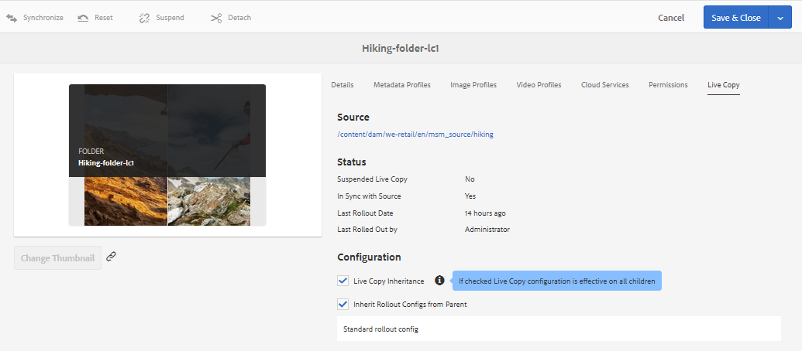

# Reutilizar ativos usando o MSM para [!DNL Assets] {#reuse-assets-using-msm-for-assets}

| Versão | Link do artigo |
| -------- | ---------------------------- |
| AEM 6.5 | [Clique aqui](https://experienceleague.adobe.com/docs/experience-manager-65/assets/using/reuse-assets-using-msm.html?lang=pt-BR) |
| AEM as a Cloud Service | Este artigo |

A funcionalidade do Gerenciador de Vários Sites (MSM) no [!DNL Adobe Experience Manager] permite que os usuários reutilizem conteúdo criado uma vez e reutilizado em vários locais da Web. A mesma funcionalidade está disponível para ativos digitais com o nome MSM para [!DNL Assets]. Ao usar o MSM para [!DNL Assets], você pode:

* Crie ativos uma vez e depois faça cópias desses ativos para reutilizar em outras áreas do site.
* Manter várias cópias em sincronização e atualizar a cópia principal original uma vez para enviar as alterações para as cópias secundárias.
* Faça alterações locais suspendendo temporária ou permanentemente a vinculação entre ativos pai e filho.

>[!NOTE]
>
>O MSM para a funcionalidade [!DNL Assets] inclui Fragmentos de conteúdo, que são armazenados como [!DNL Assets] (embora considerado um recurso do Sites).

>[!CAUTION]
>
>O MSM para fragmentos de conteúdo só está disponível ao usar fragmentos de conteúdo por meio do console **[!UICONTROL Assets]**.
>
>A funcionalidade do MSM é *não* disponível ao usar o console **[!UICONTROL Fragmentos de conteúdo]**.

## Entender os benefícios e os conceitos do MSM {#concepts}

### Como funciona e os benefícios {#how-it-works-and-the-benefits}

Para entender os cenários de uso para reutilizar o mesmo conteúdo (texto e ativos) em vários locais da Web, consulte [cenários possíveis do MSM](/help/sites-cloud/administering/msm/overview.md). [!DNL Experience Manager] mantém um vínculo entre o ativo original e suas cópias vinculadas, chamadas de Live Copies (LCs). A vinculação mantida permite que as alterações centralizadas sejam enviadas para muitas cópias ativas. Isso permite atualizações mais rápidas, eliminando as limitações do gerenciamento de cópias duplicadas. A propagação das alterações é centralizada e livre de erros. A funcionalidade permite espaço para atualizações limitadas a live copies selecionadas. Os usuários podem desanexar a vinculação, ou seja, interromper a herança, e fazer edições locais que não serão substituídas na próxima vez que a cópia principal for atualizada e as alterações forem implementadas. A desanexação pode ser feita para alguns campos de metadados selecionados ou para um ativo inteiro. Ela permite flexibilidade para atualizar localmente os ativos que foram originalmente herdados de uma cópia principal.

O MSM mantém um relacionamento dinâmico entre o ativo de origem e suas live copies para que:

* As alterações nos ativos de origem também são aplicadas (implantadas) às live copies, ou seja, as live copies são sincronizadas com a origem.
* Você pode atualizar as live copies, suspendendo o relacionamento dinâmico ou removendo a herança de alguns campos limitados. As modificações na origem não são mais aplicadas à live copy.

### Glossário do MSM para [!DNL Assets] termos {#glossary}

**Source:** os ativos ou pastas originais. Cópia principal da qual as live copies são derivadas.

**Live Copy:** a cópia dos ativos/pastas de origem que está em sincronização com sua origem. As Live Copies podem ser uma origem de mais Live Copies. Veja como criar LCs.

**Herança:** um link/referência entre um ativo/pasta de live copy e sua origem que o sistema usa para lembrar para onde enviar as atualizações. A herança existe em nível granular para campos de metadados, bem como para variações e campos de Fragmento de conteúdo. A herança pode ser removida dos itens selecionados, preservando o relacionamento dinâmico entre a origem e sua live copy.

**Implantação:** uma ação que envia as modificações feitas no downstream de origem para suas live copies. É possível atualizar uma ou mais live copies de uma só vez usando a ação de implantação. Consulte implantação.

**Configuração de implantação:** regras que determinam quais propriedades são sincronizadas, como e quando. Essas configurações são aplicadas ao criar live copies; podem ser editadas posteriormente; e um filho pode herdar a configuração de implantação de seu ativo principal. Para o MSM para [!DNL Assets], use somente a configuração de implantação padrão. As outras configurações de implantação não estão disponíveis para o MSM para [!DNL Assets].

**Sincronizar:** outra ação, além da implantação, que faz com que haja paridade entre a origem e sua live copy enviando as atualizações da origem para as live copies. Uma sincronização é iniciada para uma live copy específica e a ação extrai as alterações da origem. Com essa ação, é possível atualizar apenas uma das live copies. Consulte ação de sincronização.

**Suspender:** remova temporariamente a relação dinâmica entre uma live copy e seu ativo/pasta de origem. Você pode retomar o relacionamento. Consulte suspender ação.

**Retomar:** retoma a relação dinâmica para que uma live copy comece a receber as atualizações da origem novamente. Consulte retomar ação.

**Redefinir:** a ação de redefinição torna a live copy novamente uma réplica da origem, substituindo todas as alterações locais. Também remove os cancelamentos de herança e redefine a herança em todos os campos de metadados. Para fazer modificações locais no futuro, você deve cancelar novamente a herança de campos específicos. Consulte as modificações locais na LC.

**Desanexar:** Remova irrevogavelmente a relação dinâmica de um ativo/pasta de live copy. Após a ação de desconectar, as live copies nunca podem receber atualizações da origem, e deixam de ser uma live copy. Consulte remover relacionamento.

## Criar live copy de um ativo {#create-livecopy}

Para criar uma live copy de um ou mais ativos ou pastas de origem, siga um destes procedimentos:

* Método 1: selecione os ativos de origem e clique em **[!UICONTROL Criar]** > **[!UICONTROL Live Copy]** na barra de ferramentas na parte superior.
* Método 2: na interface de usuário do [!DNL Experience Manager], clique em **[!UICONTROL Criar]** > **[!UICONTROL Live Copy]** no canto superior direito da interface.

É possível criar live copies de um ativo ou pasta, uma por vez. É possível criar live copies derivadas de um ativo ou uma pasta que seja uma live copy.

Para criar live copies usando o primeiro método, siga estas etapas:

1. Selecione ativos ou pastas de origem. Na barra de ferramentas, clique em **[!UICONTROL Criar]** > **[!UICONTROL Live Copy]**.

   ![Criar live copy a partir da [!DNL Experience Manager] interface](assets/create_lc1.png)

   *Figura: criar live copy a partir da interface [!DNL Experience Manager].*

1. Selecione uma pasta de destino. Clique em **[!UICONTROL Avançar]**.
1. Forneça o título e o nome. O Assets não tem filhos. Ao criar uma live copy das pastas, você pode optar por incluir ou excluir pastas secundárias.
1. Selecione uma configuração de implantação. Clique em **[!UICONTROL Criar]**.

Para criar live copies usando o segundo método, siga estas etapas:

1. Na interface do [!DNL Experience Manager], no canto superior direito, clique em **[!UICONTROL Criar]** > **[!UICONTROL Live Copy]**.

   ![Criar live copy a partir da [!DNL Experience Manager] interface](assets/create_lc2.png)

   *Figura: criar live copy a partir da interface [!DNL Experience Manager].*

1. Selecione o ativo ou a pasta de origem. Clique em **[!UICONTROL Avançar]**.
1. Selecione a pasta de destino. Clique em **[!UICONTROL Avançar]**.
1. Forneça o título e o nome. O Assets não tem filhos. Ao criar uma live copy das pastas, você pode optar por incluir ou excluir pastas secundárias.
1. Selecione uma configuração de implantação. Clique em **[!UICONTROL Criar]**.

>[!NOTE]
>
>Quando uma origem ou uma live copy é movida, os relacionamentos são retidos. Quando uma live copy é excluída, os relacionamentos são removidos.

## Exibir várias propriedades e status da origem e da live copy {#properties}

Você pode visualizar as informações e os status relacionados ao MSM da live copy, como relação, sincronização, implantações e muito mais, das várias áreas da interface do usuário do [!DNL Experience Manager].

Os dois métodos a seguir funcionam para ativos e pastas:

* Selecione o ativo de live copy e localize as informações na página Propriedades.
* Selecione a pasta de origem e localize as informações detalhadas de cada live copy a partir do [!UICONTROL Console da Live Copy].

>[!TIP]
>
>Para verificar o status de algumas live copies separadas, use o primeiro método para verificar a página **[!UICONTROL Propriedades]**. Para verificar os status de muitas cópias ativas, use o segundo método para verificar a página **[!UICONTROL Status do relacionamento]**.

### Informações e status de uma live copy {#status-lc-asset}

Para verificar as informações e os status de um ativo de live copy ou de uma pasta, siga estas etapas.

1. Selecione um ativo de live copy ou uma pasta. Clique em **[!UICONTROL Propriedades]** na barra de ferramentas. Como alternativa, use o atalho de teclado `p`.
1. Clique em **[!UICONTROL Live Copy]**. Você pode verificar o caminho da origem, o status de suspensão, o status de sincronização, a data da última implantação e o usuário que fez a última implantação.

   

   *Figura: informações e status da Live Copy.*

1. Você pode ativar ou desativar se os ativos secundários pegarem emprestada a configuração da live copy.

1. Você pode escolher a opção para que a live copy herde a configuração de implantação do principal ou altere a configuração.

### Informações e status de todas as live copies de uma pasta {#status-lc-folder}

[!DNL Experience Manager] fornece um console para verificar os status de todas as live copies de uma pasta de origem. Esse console exibe o status de todos os ativos secundários.

1. Selecione uma pasta de origem. Clique em **[!UICONTROL Propriedades]** na barra de ferramentas. Como alternativa, use o atalho de teclado `p`.
1. Clique em **[!UICONTROL Origem da Live Copy]**. Para abrir o console, clique em **[!UICONTROL Visão geral da Live Copy]**. Esse painel fornece um status de nível superior de todos os ativos secundários.

   

   *Figura: exibir status de cópias dinâmicas no [!UICONTROL Console da Live Copy] da origem.*

1. Para exibir as informações detalhadas sobre cada ativo na pasta live copy, selecione um ativo e clique em **[!UICONTROL Status do relacionamento]** na barra de ferramentas.

   

   Informações detalhadas e status de um ativo filho de live copy em uma pasta

>[!TIP]
>
>Você pode ver rapidamente os status das live copies de outras pastas sem precisar navegar muito. Altere a pasta na parte superior intermediária da interface da **[!UICONTROL Visão geral da Live Copy]**.

### Ações rápidas do painel Referências para origem {#ref-rail-source}

Para um ativo ou pasta de origem, você pode ver as informações a seguir e realizar as seguintes ações diretamente no painel Referências:

* Consulte os caminhos das live copies.
* Abra ou revele uma live copy específica na interface do usuário do [!DNL Experience Manager].
* Sincronizar as atualizações a uma live copy específica.
* Suspender relacionamento ou alterar configuração de implantação para uma live copy específica.
* Acesse o console de visão geral da live copy.

Selecione o ativo ou pasta de origem, abra o painel à esquerda e clique em **[!UICONTROL Referências]**. Como alternativa, selecione um ativo ou pasta e use o atalho de teclado `Alt + 4`.

*Figura: ações e informações disponíveis no painel Referências para a origem selecionada.*

Para uma live copy específica, clique em **[!UICONTROL Editar Live Copy]** para suspender a relação ou alterar a configuração de implantação.

*Figura: Suspender relação ou alterar a configuração de implantação de uma live copy específica.*

### Ações rápidas do painel Referências para live copy {#ref-rail-lc}

Para um ativo ou pasta de live copy, você pode ver as seguintes informações e realizar as seguintes ações diretamente no painel Referências:

* Veja o caminho de sua origem.
* Abra ou revele uma live copy específica na interface do usuário do [!DNL Experience Manager].
* Implante as atualizações.

Selecione um ativo ou uma pasta de live copy, abra o painel à esquerda e clique em **[!UICONTROL Referências]**. Como alternativa, selecione um ativo ou pasta e use o atalho de teclado `Alt + 4`.

*Figura: ações disponíveis no painel Referências para a live copy selecionada.*

## Propagar modificações da origem para as live copies {#rollout-sync}

Depois que uma origem é modificada, as alterações podem ser propagadas para as live copies usando uma ação de sincronização ou de implantação. Para entender a diferença entre as duas ações, consulte [glossário](#glossary).

### Ação de implantação {#rollout}

É possível iniciar uma ação de implantação a partir do ativo de origem e atualizar todas ou algumas live copies selecionadas.

1. Selecione um ativo de live copy ou uma pasta. Clique em **[!UICONTROL Propriedades]** na barra de ferramentas. Como alternativa, use o atalho de teclado `p`.
1. Clique em **[!UICONTROL Origem da Live Copy]**. Clique em **[!UICONTROL Implantação]** na barra de ferramentas.
1. Selecione as live copies que deseja atualizar. Clique em **[!UICONTROL Implantação]**.
1. Para implantar as atualizações feitas nos ativos filho, selecione **[!UICONTROL Implantar Source e todos os filhos]**.

   

   *Figura: implante as modificações da origem em algumas ou todas as live copies.*

>[!NOTE]
>
>As modificações feitas em um ativo de origem são implantadas somente nas live copies diretamente relacionadas. Se uma live copy for derivada de outra live copy, as modificações não serão implementadas na live copy derivada.

Como alternativa, você pode iniciar uma ação de implantação no painel Referências depois de selecionar uma live copy específica. Para obter mais informações, consulte [Ações rápidas do painel Referências para live copy](#ref-rail-lc). Nesse método de implantação, somente a live copy selecionada e, opcionalmente, seus filhos, são atualizados.

*Figura: implante as modificações da origem na live copy selecionada.*

### Sobre a ação de sincronização {#about-sync}

Uma ação de sincronização extrai as modificações de uma origem somente para a live copy selecionada. A ação de sincronização respeita e mantém as modificações locais feitas após cancelar a herança. As modificações locais não são substituídas e a herança cancelada não é restabelecida. Você pode iniciar uma ação de sincronização de três maneiras.

| Onde na interface [!DNL Experience Manager] | Quando e por que usar | Como usar |
|---|---|---|
| Painel [!UICONTROL Referências] | Sincronizar rapidamente quando a origem já estiver selecionada. | Consulte [Ações rápidas do painel de Referências para a origem](#ref-rail-source) |
| Barra de ferramentas na página [!UICONTROL Propriedades] | Inicie uma sincronização quando as propriedades da live copy já estiverem abertas. | Consulte [Sincronizar uma live copy](#sync-lc) |
| Console da [!UICONTROL Visão geral da Live Copy] | Sincronize rapidamente vários ativos (não necessariamente todos) quando a pasta de origem estiver selecionada ou o console [!UICONTROL Visão geral da Live Copy] já estiver aberto. A ação de sincronização é iniciada para um ativo de cada vez, mas é uma maneira mais rápida de fazer a sincronização de vários ativos de uma só vez. | Ver [Ações em muitos ativos em uma pasta de live copy](#bulk-actions) |

### Sincronizar uma live copy {#sync-lc}

Para iniciar uma ação de sincronização, abra a página **[!UICONTROL Propriedades]** de uma live copy, clique em **[!UICONTROL Live Copy]** e na ação desejada da barra de ferramentas.

Para ver os status e as informações relacionadas a uma ação de sincronização, consulte [Informações e status de uma live copy](#status-lc-asset) e [Informações e status de todas as live copies de uma pasta](#status-lc-folder).

*Figura: a ação Sincronizar extrai as alterações feitas na origem.*

>[!NOTE]
>
>Se a relação for suspensa, a ação de sincronização não estará disponível na barra de ferramentas. Embora a ação de sincronização esteja disponível no painel Referências, as modificações não são propagadas mesmo após uma implantação bem-sucedida.

## Cancelar e reativar a herança de itens individuais {#canceling-reenabling-inheritance-individual-items}

Você pode cancelar a herança da Live Copy de:

* campo de metadados
* [Variação do fragmento de conteúdo](/help/assets/content-fragments/content-fragments-variations.md#inheritance)
* [Campo de dados do fragmento de conteúdo](/help/assets/content-fragments/content-fragments-variations.md#inheritance)

Isso significa que o item não será mais sincronizado com o componente de origem. Você pode ativar a herança em um ponto posterior, se necessário.

### Cancelar herança {#cancel-inheritance}

Para cancelar a herança:

1. Selecione o ícone **Cancelar Herança**, ao lado do item necessário:

   

1. Na caixa de diálogo Cancelar herança, confirme a ação com Sim.

### Reabilitar herança {#reenable-inheritance}

Para reativar a herança:

1. Para habilitar a herança de um item, selecione o ícone **Reabilitar herança** ao lado do item necessário:

   

   >[!NOTE]
   >
   >Quando você reativa a herança, o item não é sincronizado automaticamente com a origem. Você pode solicitar manualmente uma sincronização, se necessário.

## Suspender e retomar o relacionamento {#suspend-resume}

Você pode suspender temporariamente o relacionamento para impedir que uma live copy receba modificações feitas no ativo ou pasta de origem. A relação também pode ser retomada para que a live copy comece a receber as modificações da origem.

Para suspender ou retomar, abra a página **[!UICONTROL Propriedades]** de uma live copy, clique em **[!UICONTROL Live Copy]** e clique na ação desejada na barra de ferramentas.

Como alternativa, você pode suspender ou retomar rapidamente os relacionamentos de vários ativos em uma pasta de live copy a partir do console **[!UICONTROL Visão geral da Live Copy]**. Consulte [Realizar ações em muitos ativos nas pastas de live copy](#bulk-actions).

## Fazer modificações locais em uma live copy {#local-mods}

Uma live copy é uma réplica da origem original quando ela é criada. Os valores de metadados de uma live copy são herdados da origem. Os campos de metadados mantêm individualmente a herança com os respectivos campos do ativo de origem.

Entretanto, você tem a flexibilidade de fazer modificações locais em uma live copy para alterar algumas propriedades selecionadas. Para fazer modificações locais, cancele a herança da propriedade desejada. Quando a herança de um ou mais campos de metadados é cancelada, o relacionamento em tampo real do ativo e a herança dos outros campos de metadados são mantidas. Qualquer sincronização ou implementação não substitui as modificações locais. Para fazer isso, abra a página **[!UICONTROL Propriedades]** de um ativo de live copy, clique na opção **[!UICONTROL Cancelar herança]** ao lado de um campo de metadados.

Você pode desfazer todas as modificações locais e reverter o ativo para o estado de sua origem. A ação Redefinir substitui irrevogável e instantaneamente todas as modificações locais e restabelece a herança em todos os campos de metadados. Para reverter, na página **[!UICONTROL Propriedades]** de um ativo de live copy, clique em **[!UICONTROL Redefinir]** na barra de ferramentas.

*Figura: a ação de redefinição substitui as edições locais e traz a live copy na parte com sua origem.*

## Remover relacionamento ao vivo {#detach}

Você pode remover completamente a relação entre uma origem e uma live copy usando a ação Desconectar. A live copy se torna um ativo ou pasta independente depois de ser desanexada. Ele é exibido como um novo ativo na interface [!DNL Experience Manager], imediatamente após a desanexação. Para desanexar uma live copy da origem, siga estas etapas.

1. Selecione um ativo ou uma pasta de live copy. Clique em **[!UICONTROL Propriedades]** na barra de ferramentas. Como alternativa, use o atalho de teclado `p`.

1. Clique em **[!UICONTROL Live Copy]**. Clique em **[!UICONTROL Desanexar]** na barra de ferramentas. Clique em **[!UICONTROL Desanexar]** da caixa de diálogo apresentada.

   

   *Figura: a ação Desanexar remove completamente a relação entre a origem e a live copy.*

   >[!CAUTION]
   >
   >A relação é removida imediatamente quando você clica em **[!UICONTROL Desanexar]** da caixa de diálogo. Você não pode desfazer clicando em **[!UICONTROL Cancelar]** na página Propriedades.

Como alternativa, você pode desanexar rapidamente vários ativos em uma pasta de live copy a partir do console **[!UICONTROL Visão geral da Live Copy]**. Consulte [Realizar ações em muitos ativos nas pastas de live copy](#bulk-actions).

## Ações em massa em uma pasta de live copy {#bulk-actions}

Se você tiver vários ativos em uma pasta de live copy, iniciar ações em cada ativo pode ser cansativo. Você pode iniciar rapidamente as ações básicas em muitos ativos no [!UICONTROL Console da Live Copy]. Os métodos acima continuam a funcionar para ativos individuais.

1. Selecione uma pasta de origem. Clique em **[!UICONTROL Propriedades]** na barra de ferramentas. Como alternativa, use o atalho de teclado `p`.
1. Clique em **[!UICONTROL Origem da Live Copy]**. Para abrir o console, clique em **[!UICONTROL Visão geral da Live Copy]**.
1. Nesse painel, selecione um ativo de live copy de uma pasta live copy. Clique nas ações desejadas na barra de ferramentas. As ações disponíveis são **[!UICONTROL Sincronizar]**, **[!UICONTROL Redefinir]**, **[!UICONTROL Suspender]** e **[!UICONTROL Desanexar]**. É possível iniciar rapidamente essas ações em qualquer ativo em qualquer quantidade de pastas de live copy que estejam em um relacionamento dinâmico com a pasta de origem selecionada.

   

   *Figura: atualize facilmente muitos ativos nas pastas de live copy a partir do console [!UICONTROL Visão geral da Live Copy].*

<!-- TBD: Can MSM be extended using Java APIs in CS?

## Extend MSM for [!DNL Assets] {#extend-api}

[!DNL Experience Manager] lets you extend the functionality using the MSM Java APIs. For [!DNL Assets], the extending works just the same as it works with MSM for [!DNL Sites]. For details, see [Extending the MSM](/help/sites-developing/extending-msm.md) and the following for information about specific tasks:

* [Overview of APIs](/help/sites-developing/extending-msm.md#overview-of-the-java-api)
* [Create a synchronization action](/help/sites-developing/extending-msm.md#creating-a-new-synchronization-action)
* [Create a rollout configuration](/help/sites-developing/extending-msm.md#creating-a-new-rollout-configuration)
* [Create and use a simple LiveActionFactory class](/help/sites-developing/extending-msm.md#creating-and-using-a-simple-liveactionfactory-class)

-->

## Impacto das tarefas de gerenciamento de ativos nas live copies {#manage-assets}

Live copies e origens são ativos ou pastas que podem ser gerenciados, até certo ponto, como ativos digitais. Algumas tarefas de gerenciamento de ativos no [!DNL Experience Manager] têm um impacto específico nas live copies.

* Copiar uma live copy cria um ativo de live copy com a mesma origem da primeira live copy.
* Quando você move uma origem ou sua live copy, o relacionamento dinâmico é mantido.
* A ação de edição não funciona para ativos de live copy. Se a origem de uma live copy for uma live copy propriamente dita, a ação de edição não funcionará para ela.
* A ação de check-out não está disponível para ativos de live copy.
* Para a pasta de origem, a opção para criar tarefas de revisão está disponível.
* Ao visualizar a lista de ativos na exibição em lista e na exibição em coluna, um ativo ou pasta de live copy exibe uma &quot;live copy&quot; em relação a ele. Ele ajuda a identificar facilmente as live copies em uma pasta.

## Comparar o MSM para [!DNL Assets] e [!DNL Sites] {#comparison}

Em mais cenários, o MSM para [!DNL Assets] corresponde ao comportamento do MSM para a funcionalidade do Sites. Algumas diferenças importantes a serem observadas são:

* O blueprint no MSM para [!DNL Sites] é chamado de origem de Live Copy no MSM para [!DNL Assets].
* No Sites, você pode comparar um blueprint e sua live copy, mas não é possível no [!DNL Assets] comparar uma origem à sua live copy.
* Você não pode editar uma live copy em [!DNL Assets].
* Sites geralmente têm filhos, mas [!DNL Assets] não tem. A opção de incluir ou excluir secundários não está presente ao criar live copies de ativos individuais.
* A remoção da etapa de capítulos no assistente de criação de site não é suportada no MSM para [!DNL Assets].
* Não há suporte para a configuração de bloqueios MSM nas propriedades da página no MSM para [!DNL Assets].
* Para o MSM para [!DNL Assets], use apenas a **[!UICONTROL Configuração de implantação padrão]**. As outras configurações de implantação não estão disponíveis para o MSM para [!DNL Assets].

>[!NOTE]
>
>Lembre-se de que o MSM para fragmentos de conteúdo (acessados por meio do console **[!UICONTROL Assets]**) usa a funcionalidade do Assets; isso ocorre porque eles são armazenados como Assets (embora considerados um recurso do Sites).

## Limitações e problemas conhecidos do MSM para [!DNL Assets] {#limitations}

Veja a seguir as limitações do MSM para [!DNL Assets].

* O MSM não funciona com o write-back de metadados habilitado. No write-back, a herança é interrompida.

**Consulte também**

* [Traduzir ativos](translate-assets.md)
* [API HTTP de ativos](mac-api-assets.md)
* [Formatos de arquivo compatíveis com os ativos](file-format-support.md)
* [Pesquisar ativos](search-assets.md)
* [Ativos conectados](use-assets-across-connected-assets-instances.md)
* [Relatórios de ativos](asset-reports.md)
* [Esquemas de metadados](metadata-schemas.md)
* [Baixar ativos](download-assets-from-aem.md)
* [Gerenciar metadados](manage-metadata.md)
* [Pesquisar aspectos](search-facets.md)
* [Gerenciar coleções](manage-collections.md)
* [Importação de metadados em massa](metadata-import-export.md)
* [Trabalho com Fragmentos de conteúdo](/help/assets/content-fragments/content-fragments.md)
* [Publicar o Assets no AEM e no Dynamic Media](/help/assets/publish-assets-to-aem-and-dm.md)