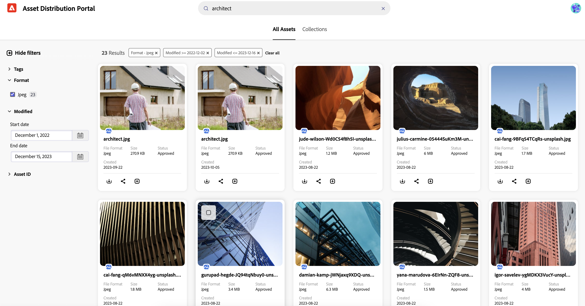
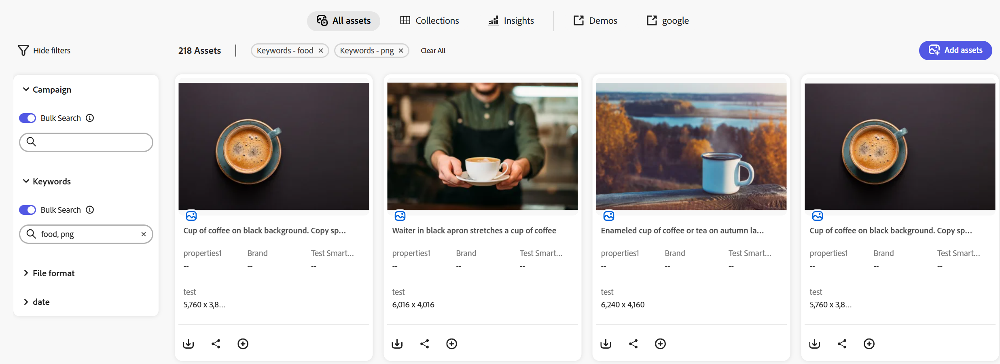

# Pesquisar Assets em [!DNL Content Hub] {#search-assets}

Quando você tem um grande número de ativos no repositório, pesquisar o ativo certo é demorado. A pesquisa do [!DNL The Content Hub] fornece a capacidade de procurar os ativos aprovados para que você possa executar ações adicionais neles, como baixar, compartilhar ou criar coleções. Você pode utilizar vários recursos para restringir os resultados da pesquisa, como executar pesquisa baseada em texto, usar filtros, executar tags ou pesquisa específica de tags inteligentes, pesquisar um formato de arquivo específico e assim por diante.

## Pré-requisitos {#prerequisites}

[Usuários do Content Hub](deploy-content-hub.md#onboard-content-hub-users) podem executar as ações mencionadas neste artigo.

## O que você pode pesquisar  {#what-you-can-search}

A pesquisa [!DNL Content Hub] fornece resultados baseados em:

* **Texto correspondente:** A pesquisa [!DNL Content Hub] permite procurar um ativo usando seu nome ou descrição. Você pode executar uma pesquisa baseada em palavras-chave, que compara a palavra-chave ao texto disponível nas propriedades de um ativo.

* **Contexto correspondente:** [!DNL Content Hub] a lista de resultados da pesquisa contém resultados aproximados de ativos que você obtém com base no contexto correspondente. Por exemplo, se você digitar `cool` na barra de pesquisa, os ativos relacionados a `winter`, `snow`, `cold surroundings` serão exibidos na lista de pesquisa.

* **Informações do ativo (título, marcas ou marcas inteligentes):** [!DNL Content Hub] usa o algoritmo de pesquisa inteligente para classificar os resultados da pesquisa com precisão e da forma mais relevante possível. [Os metadados](#asset-properties.md) são a coleção de todos os dados disponíveis para um ativo, mas eles podem não estar necessariamente contidos nesse ativo. [Isso ajuda a categorizar os ativos e é útil à medida que a quantidade de informações digitais cresce](/help/assets/configure-content-hub-ui-options.md##configure-metadata-search-content-hub).

* **Data da última modificação:** os ativos que foram modificados recentemente aparecem no topo da lista de resultados da pesquisa. Também é possível filtrar o intervalo de datas de acordo com sua necessidade.

* **Uso:** os ativos usados com frequência aparecem no topo da lista de pesquisa.

* **Histórico de pesquisa:** clique dentro da caixa de pesquisa sem digitar um caractere para obter seu histórico de pesquisa. Você também pode remover qualquer palavra-chave específica do histórico. O histórico de pesquisa é salvo na memória cache de um navegador da Web, o que significa que, se você acessar a pesquisa [!DNL Content Hub] em um navegador diferente ou limpar a memória cache do navegador, não poderá mais exibir o histórico de pesquisa.

* **Pesquise enquanto digita:** A pesquisa do [!DNL Content Hub] aprimora sua experiência de pesquisa ao fornecer sugestões de preenchimento automático quando você começa a digitar.

## Pesquisa básica {#basic-search}

Para realizar uma pesquisa básica no [!DNL the Content Hub], navegue até a barra de pesquisa e especifique a palavra-chave que precisa pesquisar. Navegue até os filtros disponíveis no painel esquerdo e aplique-os para restringir os resultados da pesquisa.

Por exemplo, pesquise por todas as imagens do **[!UICONTROL JPEG]** com a palavra-chave `architect`, que foi modificada no último ano. Para executar esse cenário, execute as seguintes etapas:

1. Especifique `architect` como a palavra-chave de pesquisa.

1. Navegue até o painel de filtros > **[!UICONTROL Formato]** > selecione **[!UICONTROL JPEG]**.

1. Navegue até **[!UICONTROL Modificado]** > especifique o intervalo de datas.

   

## Restringir os resultados da pesquisa usando filtros {#narrow-down-search-results}

Use o painel Filtros para pesquisar ativos com base em metadados. Você pode filtrar os resultados da pesquisa com base em vários predicados de pesquisa. Você pode selecionar todos os predicados apropriados para minimizar ou restringir os resultados da pesquisa. Você pode escolher mais de 10 predicados ao filtrar os resultados da pesquisa. Ao selecionar várias opções em um filtro, o Content Hub exibe os ativos que correspondem a qualquer uma das opções selecionadas em um filtro. No entanto, quando você seleciona várias opções em filtros, o Content Hub exibe somente os ativos que correspondem a todas as opções selecionadas em filtros para restringir os resultados da pesquisa.

Os filtros padrão incluem formato de arquivo, aprovado por, data de aprovação, ativos expirados e não expirados e data de expiração. Os administradores também podem configurar os filtros exibidos na lista de filtros. Para obter mais informações, consulte [Configurar a interface do usuário do Content Hub](configure-content-hub-ui-options.md#configure-filters-content-hub).

<!--

<table>
    <tbody>
     <tr>
      <th><strong>Search Predicate</strong></th>
      <th><strong>Description</strong></th>
      <th><strong>Properties</strong></th>
     </tr>
     <tr>
      <td> Campaigns </td>
      <td> Allows you to search using planned activity performed to take any particular action. For example, advertisement campaign run on Ferrari to know the understand the interests of people using number of clicks people perform.</td>
      <td>NA</td>
     </tr>
     <tr>
      <td> Channels </td>
      <td> Helps you to understand the path from where the asset is coming from. For example, web, social media, books, catalog, etc.</td>
      <td>NA</td>
     </tr>
     <tr>
      <td> Region </td>
      <td> Helps you to understand the location where the asset is created. For example, Japan, EMEA, Worldwide, etc.</td>
      <td>NA</td>
     </tr>
     <tr>
      <td> Keywords </td>
      <td> Keyword helps you search using terms or the words that you enter based on the topic. For example, images, low-resolution, etc.</td>
      <td>NA</td>
     </tr>
     <tr>
      <td> Timeframe </td>
      <td> Helps you search assets using timeline. For example, search by year 2024, Q3 2023, etc.</td>
      <td>NA</td>
     </tr>
     <tr>
      <td>File format</td>
      <td>Composition of an asset. The supported assets include image, document, video, printable media, and so on.</td>
      <td>
        <ul>
            <li>[!UICONTROL JPEG]</li> 
            <li>[!UICONTROL Quicktime]</li> 
            <li>[!UICONTROL PNG]</li> 
            <li>[!UICONTROL WebP]</li> 
            <li>[!UICONTROL MP4]</li> 
            <li>[!UICONTROL Plain]</li> 
            <li>[!UICONTROL PDF]</li>
            <li>[!UICONTROL SVG + XML]</li>
        </ul>
      </td>
     </tr>
     <tr>
      <td>Tags</td>
      <td>Tags help you categorize assets that can be browsed and searched more efficiently based on hierarchical taxonomies.</td>
      <td>
        <ul>
            <li>Field label</li>
            <li>Property name</li>
            <li>Path</li>
            <li>Description</li>
        </ul>
      </td>
     </tr>
     <!--<tr>
      <td>Subject</td>
      <td>Classification of assets based on their theme. For example, colorful, hiking, outdoors.</td>
      <td>NA</td>
     </tr>
          <tr>
      <td>Last modified</td>
      <td>Search assets based on their last modification. Specify the date range using the Start date and End date fields.</td>
      <td>
        <ul>
            <li>Range text (From)</li> 
            <li>Range text (To) </li>
        </ul>
      </td>
     </tr>    
     <!--<tr>
      <td>Asset ID</td>
      <td>Unique number that identifies the asset.</td>
      <td>NA</td>
     </tr>
     <tr>
      <td> Colors </td>
      <td> Helps you search assets using colors that are automatically identified in an asset using Adobe's Sensei AI capabilities.</td>
      <td>NA</td>
     </tr>  
    </tbody>
   </table>

-->

## Pesquisar em massa {#bulk-search}

A pesquisa em massa de ativos permite pesquisar vários ativos simultaneamente inserindo uma lista de identificadores (como nomes, formatos de arquivo, cores, tags e muito mais). Em vez de pesquisar ativos um por um, a [!DNL Content Hub] Pesquisa em massa agiliza a descoberta dos ativos necessários. Com esse recurso, você pode inserir vários valores para qualquer propriedade de filtro, separados por um delimitador (por exemplo, várias IDs de SKU), e recuperar instantaneamente todos os ativos correspondentes com uma única pesquisa.

Para pesquisar vários ativos de uma só vez, insira vários valores em uma única consulta separando-os com delimitadores ` [ , | \t | \r | \n | \r\n ]`. Também é possível adicionar mais delimitadores dependendo do caso de uso. Consulte [Configurar Pesquisa Em Massa](configure-content-hub-ui-options.md#bulk-search-configuration).

Para executar a Pesquisa em Massa no [!DNL Content Hub], execute as seguintes etapas:

1. Quando a Pesquisa em Massa estiver [configurada](configure-content-hub-ui-options.md#bulk-search-configuration), você poderá ver a opção Pesquisa em Massa nas propriedades de filtro [!DNL Content Hub] que você configurou. Você pode habilitá-lo ou desabilitá-lo de acordo com o requisito.

1. Adicione uma consulta de pesquisa contendo delimitadores especificados na configuração. A consulta de pesquisa deve conter uma string acompanhada de vários valores separados por vírgulas.

## Faça mais com a pesquisa {#do-more-with-search}

[!DNL The Content Hub] não está limitado à pesquisa. Em vez disso, permite que você execute ações adicionais, como [baixar](download-assets-content-hub.md), [compartilhar](share-assets-content-hub.md) e [adicionar ativos à coleção](collections-content-hub.md), diretamente da interface de pesquisa ou visualização. Selecione os ativos na página de resultados da pesquisa para exibir essas opções.

Saiba mais sobre [como configurar ativos no [!DNL Content Hub]](configure-content-hub-ui-options.md).

