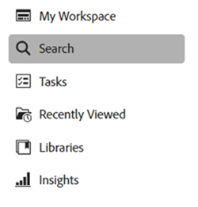

# Pesquisar ativos no [!DNL Assets view] {#search-assets}

>[!CONTEXTUALHELP]
>id="assets_search"
>title="Pesquisar ativos"
>abstract="Pesquise por ativos especificando uma palavra-chave na barra de pesquisa ou filtrando ativos com base no status, tipo de arquivo, tipo MIME, tamanho, criação, modificação e datas de expiração. Também é possível aplicar filtros personalizados, além dos filtros padrão. Você pode salvar os resultados filtrados como uma Pesquisa salva ou uma Coleção inteligente."
>additional-url="https://experienceleague.adobe.com/docs/experience-manager-assets-essentials/help/manage-collections.html?lang=pt-BR#manage-smart-collection" text="Criar coleções inteligentes"

O [!DNL Assets view] oferece uma pesquisa eficiente, que funciona por padrão. A pesquisa é abrangente, pois é uma pesquisa de texto completo. Essa eficiente funcionalidade de pesquisa permite descobrir rapidamente o ativo apropriado e ajuda a melhorar a velocidade do conteúdo. O [!DNL Assets view] fornece pesquisa de texto completo e até mesmo pesquisas por meio de metadados, como tags inteligentes, título, data de criação e direito autoral.

Para pesquisar ativos:

* Clique na caixa de pesquisa na parte superior da página. Por padrão, a pesquisa é feita na pasta em que você está navegando no momento. Siga uma das seguintes opções:

  

   * Pesquise usando uma palavra-chave e, opcionalmente, altere a pasta. Pressione Return.

   * Comece a trabalhar com um ativo visualizado recentemente procurando diretamente por ele. Clique na caixa de pesquisa e selecione um ativo visualizado recentemente a partir das sugestões.

## Filtrar os resultados da pesquisa {#refine-search-results}

Você pode filtrar os resultados da pesquisa com base nos seguintes parâmetros.

*Figura: filtre ativos pesquisados com base em vários parâmetros.*

* Status do ativo: filtre os resultados da pesquisa usando um status de ativo `Approved`, `Rejected` ou `No Status`.

* Tipo de arquivo: filtre os resultados da pesquisa pelos tipos de arquivos compatíveis, ou seja, `Images`, `Documents` e `Videos`.
* Tipo MIME: filtrar um ou mais formatos de arquivo compatíveis. <!-- TBD:  [supported file formats](/help/using/supported-file-formats.md). -->
* Tamanho da imagem: forneça um ou mais valores máximos e mínimos de dimensão para filtrar imagens. O tamanho é fornecido em valores de dimensão de pixel e não é o tamanho do arquivo das imagens.
* Data de criação: a data de criação do ativo fornecida pelos metadados. O formato de data padrão usado é `yyyy-mm-dd`.
* Data de modificação: a data da última modificação dos ativos. O formato de data padrão usado é `yyyy-mm-dd`.

* Data de expiração: filtre os resultados da pesquisa com base no status `Expired` de um ativo. Além disso, é possível especificar um intervalo de datas para a expiração dos ativos, permitindo filtrar ainda mais os resultados da pesquisa.

* Filtros Personalizados: [Adicione filtros personalizados](#custom-filters) à interface do usuário de exibição do Assets. Aplique filtros personalizados além dos filtros padrão para refinar os resultados da pesquisa.

E possível classificar os ativos pesquisados em ordem crescente ou decrescente de `Name`, `Relevance`, `Size`, `Modified` e `Created`. Os ativos pesquisados são classificados com base em `Relevance`, por padrão.

## Gerenciar filtros personalizados {#custom-filters}

**Permissões necessárias:** `Can Edit`, `Owner` ou Administrador.

A visualização Assets também permite adicionar filtros personalizados à interface. É possível aplicar esses filtros personalizados além dos [filtros padrão](#refine-search-results) para refinar os resultados da pesquisa.

A visualização Assets fornece os seguintes filtros personalizados:

<table>
    <tbody>
     <tr>
      <th><strong>Nome do filtro personalizado</strong></th>
      <th><strong>Descrição</strong></th>
     </tr>
     <tr>
      <td>Título</td>
      <td>Filtrar ativos usando o título do ativo. O título especificado nos critérios de pesquisa que diferenciam maiúsculas e minúsculas deve corresponder ao título exato do ativo a ser exibido nos resultados.</td>
     </tr>
     <tr>
      <td>Nome</td>
      <td>Filtre ativos usando o nome do arquivo de ativo. O nome especificado nos critérios de pesquisa que diferenciam maiúsculas e minúsculas deve corresponder ao nome exato do arquivo do ativo a ser exibido nos resultados.</td>
     </tr>
     <tr>
      <td>Tamanho do ativo</td>
      <td>Filtre ativos definindo um intervalo de tamanho, em bytes, nos critérios de pesquisa para um ativo ser exibido nos resultados.</td>
     </tr>
     <tr>
      <td>Tags previstas</td>
      <td>Filtrar ativos usando a tag inteligente de ativos. O nome da tag inteligente especificada nos critérios de pesquisa que diferenciam maiúsculas e minúsculas deve corresponder ao nome exato da tag inteligente do ativo a ser exibido nos resultados. Não é possível especificar várias tags inteligentes nos critérios de pesquisa.</td>
     </tr>    
    </tbody>
   </table>

<!--
   You can use a wildcard operator (*) to enable Assets view to display assets in the results that partially match the search criteria. For example, if you define <b>ma*</b> as the search criteria, Assets view displays assets with title, such as, market, marketing, man, manchester, and so on in the results.

   You can use a wildcard operator (*) to enable Assets view to display assets in the results that partially match the search criteria.

   You can use a wildcard operator (*) to enable Assets view to display assets in the results that partially match the search criteria. You can specify multiple smart tags separated by a comma in the search criteria.

   -->

### Adicionar filtros personalizados {#add-custom-filters}

Para adicionar filtros personalizados:

1. Clique em **[!UICONTROL Filtros]**.

1. Na seção **[!UICONTROL Filtros personalizados]**, clique em **[!UICONTROL Editar]** ou **[!UICONTROL Adicionar filtros]**.

   

1. Na caixa de diálogo **[!UICONTROL Gerenciamento de filtros personalizados]**, selecione os filtros que precisam ser adicionados à lista de filtros existente. Selecionar **[!UICONTROL Filtros personalizados]** para selecionar todos os filtros.

1. Clique em **[!UICONTROL Confirmar]** para adicionar os filtros à interface.

### Remover filtros personalizados {#remove-custom-filters}

Para remover filtros personalizados:

1. Clique em **[!UICONTROL Filtros]**.

1. Na seção **[!UICONTROL Filtros personalizados]**, clique em **[!UICONTROL Editar]**.

1. Na caixa de diálogo **[!UICONTROL Gerenciamento de filtros personalizados]**, desmarque os filtros que precisam ser removidos da lista de filtros existente.

1. Clique em **[!UICONTROL Confirmar]** para remover os filtros da interface.

## Pesquisa semântica {#semantic-search}

A Pesquisa semântica é um recurso de pesquisa avançada que entende o significado e a intenção por trás da consulta de um usuário, em vez de depender de correspondências exatas de palavras-chave. Ele usa inteligência artificial (IA), processamento de linguagem natural (NLP) e aprendizado de máquina para fornecer resultados mais precisos e sensíveis ao contexto.

Ao contrário da pesquisa tradicional baseada em palavras-chave, que procura termos exatos, a Pesquisa semântica interpreta as relações entre palavras, conceitos e intenção do usuário. Isso garante que os usuários encontrem o que procuram, mesmo que a consulta seja redigida de forma diferente, contenha erros de digitação ou esteja em outro idioma.

Alguns, se seus principais benefícios incluírem:

* **Suporte multilíngue**: pesquise em vários idiomas sem exigir traduções exatas. Os usuários podem encontrar conteúdo relevante independentemente do idioma de consulta.

* **Lida com erros ortográficos**: corrige automaticamente ou interpreta erros de digitação e de ortografia, garantindo resultados precisos mesmo com uma entrada imperfeita.

* **Entende sinônimos**: fornece resultados para termos e frases relacionados, de modo que os usuários não precisam adivinhar a palavra-chave correta.

* **Pesquisa sensível ao contexto**: reconhece a intenção por trás de uma consulta, não apenas as palavras.

>[!IMPORTANT]
>
> Especifique três ou mais palavras para que a Pesquisa semântica exiba os resultados apropriados.

### Exemplos para pesquisa semântica {#examples-semantic-search}

**Exemplo de prompt**: *Mulher tomando café*

A pesquisa tradicional baseada em palavras-chave procura correspondências exatas de metadados de ativos, como Mulher, Café e assim por diante, e retorna ativos que incluem essas palavras-chave.

No entanto, a Pesquisa Semântica procura palavras semelhantes, como `Girl`, `Lady` no caso de `Woman` e opções de café, como `Cappuccino` e `Latte` no caso de `Coffee`.

Da mesma forma, você pode especificar este prompt em espanhol ou digitar incorretamente `Woman` como `Wman` e ainda obter os mesmos resultados.

## Pesquisar ativos usando o [!DNL Adobe Firefly] {#search-firefly}

Você pode pesquisar um ativo que não está disponível em nenhuma das pastas de ativos utilizando o recurso de pesquisa de ativos do [!DNL Adobe Firefly] no [!DNL Experience Manager Assets]. Isso permite gerar ativos com eficiência em tempo real que não estão armazenados nas pastas de ativos.

### Antes de começar {#search-assets-firefly-prereqs}

Você precisa ter uma assinatura do [!DNL Adobe Express] ativa.

### Geração de ativos {#generate-assets-firefly}

Para gerar novos ativos usando o [!DNL Adobe Firefly]:

1. Navegue até o espaço de trabalho do [!DNL AEM Assets].

1. Digite o nome do ativo na barra de pesquisa. Por exemplo, você pode pesquisar um ativo usando a palavra-chave `Bugatti Type 57`. Ao pesquisar o ativo, nenhum resultado é encontrado porque o ativo não existe em nenhuma das pastas de ativos. Para gerar ativos usando a IA, clique em **[!UICONTROL Gerar com Firefly]**. A tela do [!DNL Adobe Firefly] é exibida.

   

   Os novos ativos foram gerados com sucesso. Além disso, você pode alterar a descrição da imagem digitando o novo prompt de texto na caixa de descrição. [Saiba como escrever um bom prompt de IA para gerar conteúdo extraordinário e relevante](https://helpx.adobe.com/br/firefly/using/tips-and-tricks.html). Como alternativa, você pode [editar a imagem com vários outros recursos, como alterar o estilo, as dimensões da imagem e muito mais](https://helpx.adobe.com/br/firefly/using/text-to-image.html).

   

1. Selecione uma imagem que deseja salvar. Clique em **[!UICONTROL Salvar]** e salve os ativos na pasta de sua preferência para facilitar o acesso.

1. O formulário Salvar ativo é exibido. Especifique os seguintes campos:

   * Insira um nome para o arquivo no campo **Salvar como**.
   * Selecione uma pasta de destino.
   * Forneça detalhes como o nome do projeto ou da campanha, palavras-chave, canais, intervalo de tempo e região.

   

1. Clique em **Salvar como novo ativo** para salvar o(s) ativo(s).

### Upload de ativos {#upload-assets-firefly}

Para fazer upload do ativo gerado para o repositório de ativos:

1. Clique em **[!UICONTROL Fazer upload]**.
1. Selecione a pasta de ativos para a qual você deseja fazer upload do ativo e clique em **[!UICONTROL Selecionar pasta]**.
   

## Pesquisas salvas {#saved-search}

A funcionalidade de pesquisa é bastante fácil de usar no [!DNL Assets view]. Na caixa de pesquisa, você pode digitar uma palavra-chave e pressionar Enter para ver os resultados, além disso, é possível pesquisar novamente por palavras-chave recentes de maneira rápida, com um único clique.

Também é possível filtrar os resultados da pesquisa com base em critérios específicos relacionados aos metadados e tipos de ativos. O [!DNL Assets view] também permite salvar os parâmetros de uma pesquisa para melhorar a experiência de busca de filtros usados com frequência. Em seguida, você pode selecionar a pesquisa salva para pesquisar e aplicar o filtro com apenas um clique.

Para criar uma pesquisa salva, pesquise por algum ativo, aplique um ou mais filtros e clique em **[!UICONTROL Salvar como]** > **[!UICONTROL Pesquisa salva]** no painel [!UICONTROL Filtros]. Você também pode clicar em **[!UICONTROL Salvar como]** e selecionar **[!UICONTROL Coleção inteligente]** para salvar os resultados como uma coleção inteligente. Consulte [Criar uma coleção inteligente](manage-collections.md#create-a-smart-collection) para obter mais detalhes.

<!-- TBD: Search behavior. Full-text search. Ranking and rank boosts. Hidden assets.
Report poor UX that users can only save a filtered search and not a simple search.
.
Are other supported files fully indexed and support full-text search? Eg. audio/videos files can at best have metadata indexed.
Anything about ranking of assets displayed in search results?

What about temporarily hiding an asset (suspending search on it) from the search results? If an asset is undergoing review collaboration, should it be used by others? Should it be hidden in search?

When userA is searching and userB add an asset that matches search results, will the asset display in search as soon as userA refreshes the page? Assuming indexing is near real-time. May not be so for bulk uploads.
-->

## Trabalhar com os resultados da pesquisa {#work-with-search-results}

Você pode selecionar os ativos exibidos nos resultados da pesquisa e realizar as seguintes ações:

* **Localizar imagem semelhante**: encontre ativos de imagem semelhantes na interface do Assets com base nos metadados e nas tags inteligentes.

* **Detalhes**: visualizar e editar as propriedades do ativo.

* **Baixar**: baixar um ativo.

* **Adicionar à coleção**: adicionar o ativo selecionado a uma coleção.

* **Fixar no Acesso rápido**: [fixar um ativo](my-workspace-assets-view.md) para agilizar o acesso quando precisar. Todos os itens fixados são exibidos na seção **Acesso rápido** do Meu espaço de trabalho.

* **Abrir no Adobe Express**: edite uma imagem no Adobe Express integrado na tela do Experience Manager Assets.

* **Editar**: editar a imagem usando o Adobe Express.

* **Compartilhar link**: [compartilhar links](share-links-for-assets-view.md) para um ativo com outros usuários, para que possam acessá-lo e baixá-lo.

* **Excluir**: excluir um ativo.

* **Copiar**: copiar um ativo para um local de pasta diferente.

* **Mover**: mover um ativo para um local de pasta diferente.

* **Renomear**: renomear um ativo.

* **Copiar para bibliotecas**: adicione um ativo à biblioteca.

* **Atribuir tarefas**: atribuir tarefas de um ativo a usuários.

* **Observar**: [monitorar as operações](https://experienceleague.adobe.com/pt-br/docs/experience-manager-cloud-service/content/assets/manage/search-assets) executadas em um ativo.

## Configurar a página inicial da pesquisa {#configuring-search-first-homepage}

A visualização do Assets permite selecionar a página de aterrissagem padrão da sua organização. Ao usar a opção “Pesquisar primeiro” como a página inicial, é possível personalizar a identidade visual da página, através da configuração das imagens de fundo e do logotipo que corresponde à sua marca.

Para configurar a primeira página de pesquisa, execute as etapas abaixo:

1. Navegue até **[!UICONTROL Configurações]** >; **[!UICONTROL Configurações gerais]**.
1. Selecione **[!UICONTROL Pesquisar primeiro]**. Isso abre mais configurações relacionadas à primeira pesquisa. Você pode configurar o [alinhamento](#setting-alignment-search-bar) ou [definir a imagem de fundo e o logotipo](#setting-background-image-and-logo) da sua página inicial.

### Configuração do alinhamento da barra de pesquisa {#setting-alignment-search-bar}

O [!DNL Assets view] permite alterar o alinhamento da barra de pesquisa. Você pode fazer a barra de pesquisa aparecer no centro ou na parte superior. Selecione o alinhamento apropriado e clique em **[!UICONTROL Salvar]**.

### Configuração da imagem de fundo e logotipo da página inicial {#setting-background-image-and-logo}

Você pode adicionar o logotipo da marca e a imagem de fundo à sua primeira página de pesquisa. Execute as seguintes etapas:

1. Navegue até a seção **[!UICONTROL Imagem de fundo e logotipo]** na **[!UICONTROL Página inicial]**.
1. Clique em **[!UICONTROL Substituir]** para procurar imagens do repositório de ativos.
1. Clique em **[!UICONTROL Salvar]**. [Visualize](#preview-configured-homepage) as alterações para revisar as modificações.

### Visualizar a página inicial configurada {#preview-configured-homepage}

Você pode visualizar o layout e a formatação da primeira página de pesquisa. Com a opção **[!UICONTROL Visualizar]**, é possível corrigir o layout ou fazer as modificações necessárias. Para visualizar a página inicial configurada, execute as etapas abaixo:

1. Clique em **[!UICONTROL Configurações gerais]** e selecione **[!UICONTROL Pesquisar primeiro]**.
1. Navegue até **[!UICONTROL Personalizar a primeira página de pesquisa]** e clique em **[!UICONTROL Visualizar]**. Alterne o botão **[!UICONTROL Tema escuro]** para visualizar a página inicial em um tema escuro ou claro.
1. Clique em **[!UICONTROL Fechar]** para fechar a janela de visualização.

   

## Pesquisa contextual {#contextual-search}

Também é possível pesquisar ativos disponíveis no repositório por meio de prompts de texto. O Experience Manager Assets transforma automaticamente esses prompts de texto em filtros de pesquisa e exibe os resultados da pesquisa. Você pode visualizar e modificar filtros automáticos usando o Painel de filtros para restringir ainda mais os resultados da pesquisa.

### Acessar a pesquisa contextual {#access-contextual-search}

Para acessar a pesquisa contextual no Experience Manager Assets:

1. Clique em **[!UICONTROL Pesquisar]** no painel esquerdo.

   

1. Insira o prompt de texto na caixa de texto Pesquisar e clique em **[!UICONTROL Pesquisa contextual]**.

   

   O [!DNL Experience Manager Assets] exibe os resultados da pesquisa.

### Filtros compatíveis {#supported-filters}

A pesquisa contextual é compatível com os seguintes filtros prontos para uso. Baseie os prompts de texto nesses filtros para obter resultados de pesquisa apropriados.

* Altura da imagem

* Largura da imagem

* Tipo de arquivo: imagem, documento, vídeo ou pasta.

* Tipo MIME: JPG, PNG, TIFF, GIF, MP4, PDF, PPTX, DOCX ou XLSX

* Data de criação

* Data de modificação

* Data de expiração

* Status do ativo: aprovado, rejeitado ou todos

* Ativos expirados

### Exemplos de prompts de texto {#text-prompts-examples}

**Exemplo 1**

**Prompt de texto**: imagens criadas neste mês.

O [!DNL Experience Manager Assets] aplica os seguintes filtros automaticamente e exibe os resultados da pesquisa:

**Exemplo 2**

**Prompt de texto**: imagens com pelo menos 200px de altura e 100px de largura com praia e céu limpo.

O [!DNL Experience Manager Assets] aplica os seguintes filtros automaticamente e exibe os resultados da pesquisa:

**Exemplo 3**

**Prompt de texto**: preciso de imagens de um céu azul com altura de 1500 e 2500 pixels, criadas no mês passado, que não tenham expirado nem sejam aprovadas.

O [!DNL Experience Manager Assets] aplica os seguintes filtros automaticamente e exibe os resultados da pesquisa:

O vídeo a seguir ilustra o processo completo, desde o acesso à interface da pesquisa contextual até a definição de prompts de texto e a visualização dos resultados da pesquisa.

>[!VIDEO](https://video.tv.adobe.com/v/3428407)

### Desabilitar pesquisa contextual {#disable-contextual-search}

Admins também têm a opção de desabilitar a pesquisa contextual para usuários da organização. Para desabilitá-la, siga estas etapas:

1. Navegue até **[!UICONTROL Configurações]** > **[!UICONTROL Configurações gerais]**.

1. Na seção [!UICONTROL Pesquisa contextual], desative o botão de alternância **[!UICONTROL Habilitar pesquisa contextual para a organização]** para desabilitar o recurso de pesquisa contextual para todos os usuários da organização.

### Feedback da pesquisa contextual {#contextual-search-feedback}

Se precisar fornecer feedback sobre o recurso de pesquisa contextual, clique no  e no ícone Feedback. Selecione o tipo de feedback, especifique o assunto e a descrição e clique em **[!UICONTROL Enviar]**.

## Próximas etapas {#next-steps}

* [Assista a um vídeo para pesquisar ativos no modo de exibição Assets](https://experienceleague.adobe.com/docs/experience-manager-learn/assets-essentials/basics/using.html?lang=pt-BR)

* Forneça feedback sobre o produto usando a opção [!UICONTROL Feedback] disponível na interface de visualização do Assets

* Forneça feedback sobre a documentação por meio das opções [!UICONTROL Editar esta página]  ou [!UICONTROL Registrar um problema]  disponíveis na barra lateral direita.

* Entre em contato com o [Atendimento ao cliente](https://experienceleague.adobe.com/pt-br?support-solution=General&lang=pt-BR#support)

