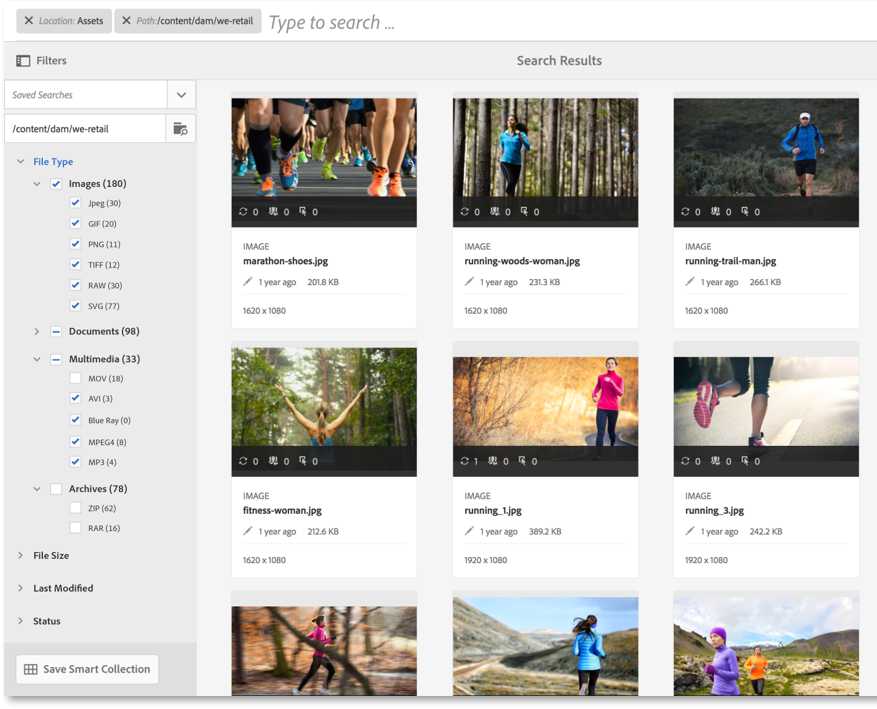
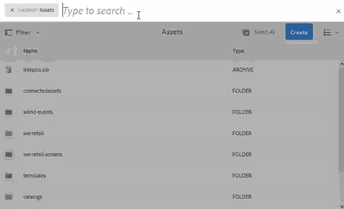

# Pesquisar ativos no AEM {#search-assets-in-aem}

| Versão | Link do artigo |
| -------- | ---------------------------- |
| AEM 6.5 | [Clique aqui](https://experienceleague.adobe.com/docs/experience-manager-65/assets/using/search-assets.html?lang=pt-BR) |
| AEM as a Cloud Service | Este artigo |

O [!DNL Adobe Experience Manager Assets] fornece métodos de pesquisa de ativos robustos que ajudam a alcançar maior velocidade do conteúdo. Suas equipes podem reduzir o tempo de entrada no mercado com uma experiência de pesquisa de ativos inteligente e contínua, usando funcionalidade pronta para uso e métodos personalizados. O recurso de pesquisa de ativos é fundamental para o uso de um sistema de gerenciamento de ativos digitais — seja para uso adicional por criadores, para o gerenciamento robusto de ativos pelos usuários empresariais e profissionais de marketing ou para administração por administradores de DAM. Pesquisas simples, avançadas e personalizadas que podem ser executadas por meio da interface do usuário do [!DNL Assets] ou por outros aplicativos e superfícies ajudam a atender a esses casos de uso.

A pesquisa de ativos no AEM é compatível com os seguintes casos de uso e este artigo descreve o uso, os conceitos, as configurações, as limitações e a solução de problemas para esses casos de uso.

| Pesquisar ativos | Configurar e administrar a funcionalidade de pesquisa | Trabalhar com resultados de pesquisa de ativos |
|---|---|---|
| [Pesquisas básicas](#searchbasics) | [Índice de pesquisa](#searchindex) | [Classificar resultados](#sort) |
| [Compreender a interface de pesquisa](#searchui) | [Extração de texto](#extracttextupload) | [Verificar propriedades e metadados de um ativo](#checkinfo) |
| [Pesquisar sugestões](#searchsuggestions) | [Metadados obrigatórios](#mandatorymetadata) | [Download](#download) |
| [Compreender os resultados e o comportamento da pesquisa](#searchbehavior) | [Modificar aspectos da pesquisa](#searchfacets) | [Atualizações de metadados em massa](#metadata-updates) |
| [Classificação e aumento de pesquisa](#searchrank) | [Predicados personalizados](#custompredicates) | [Coleções inteligentes](#collections) |
| [Pesquisa avançada: filtragem e escopo da pesquisa](#scope) | | [Compreender e solucionar problemas de resultados inesperados](#unexpected-results) |
| [Pesquisar de outras soluções e aplicativos](#search-assets-other-surfaces):<ul><li>[Adobe Asset Link](#aal)</li><li>[Brand Portal](#brand-portal)</li><li>[aplicativo de desktop do Experience Manager](#desktop-app)</li><li>[imagens do Adobe Stock](#adobe-stock)</li><li>[Ativos de mídia dinâmica](#search-dynamic-media-assets)</li></ul> | | |
| [Seletor de ativos](#asset-picker) | | |
| [Limitações](#limitations) e [Dicas](#tips) | | |
| [Exemplos ilustrados](#samples) | | |

Pesquise ativos usando o campo Omnisearch na parte superior da interface da Web do [!DNL Experience Manager]. Vá para **[!UICONTROL Assets]** > **[!UICONTROL Arquivos]** em [!DNL Experience Manager], clique em  na barra superior, insira a palavra-chave de pesquisa e selecione `Return`. Como alternativa, use o atalho de palavra-chave `/` (barra) para abrir o campo Omnisearch. `Location:Assets` é pré-selecionado para limitar as pesquisas a ativos DAM. `Path:/content/dam` também é exibido quando você está executando a pesquisa no nível raiz dentro da pasta **[!UICONTROL Arquivos]**. Se você navegar para qualquer outra pasta, `Path:/content/dam/<folder name>` será exibido no campo Omnisearch para limitar o escopo de pesquisa à pasta atual. [!DNL Experience Manager] fornece sugestões quando você começa a digitar uma palavra-chave de pesquisa.

Use o painel **[!UICONTROL Filtros]** para pesquisar ativos, pastas, marcas e metadados. Você pode filtrar os resultados da pesquisa com base nas várias opções (predicados), como tipo de arquivo, tamanho do arquivo, data da última modificação, status do ativo, dados de insights e licenciamento do Adobe Stock. Você pode personalizar o painel Filtros e adicionar ou remover predicados de pesquisa usando [aspectos de pesquisa](/help/assets/search-facets.md). O filtro [!UICONTROL Tipo de Arquivo] no painel [!UICONTROL Filtros] tem caixas de seleção de estado misto. Portanto, a menos que você selecione todos os predicados (ou formatos) aninhados, as caixas de seleção de primeiro nível são parcialmente marcadas.

O recurso de pesquisa [!DNL Experience Manager] dá suporte à pesquisa de coleções e de ativos em uma coleção. Consulte [pesquisar coleções](/help/assets/manage-collections.md).

## Entender a interface de pesquisa de ativos {#searchui}

Familiarize-se com a interface de pesquisa de ativos e as ações disponíveis.
<!--

-->

*Figura: Compreender a interface de resultados de pesquisa [!DNL Experience Manager Assets].*

**A.** Salve a pesquisa como uma coleção inteligente.
**B.** Filtros ou predicados para restringir os resultados da pesquisa.
**C.** Exiba arquivos, pastas ou ambos.
**D.** O local de pesquisa é DAM.
**E.** Acessar Pesquisas Salvas.
**F.** Clique em Filtros para abrir ou fechar o painel esquerdo.
**G.** Mostra o Assets como pesquisa padrão.
**H.** O local de pesquisa é DAM.
**I.** Campo Omnisearch com palavra-chave de pesquisa fornecida pelo usuário.
**J.** Selecione os resultados da pesquisa carregada.
**K.** Classificar por Criado, Modificado, Nome, Nenhum.
**L.** Classificar por ordem Crescente ou Decrescente.
**M.** Número de resultados de pesquisa exibidos do total de resultados de pesquisa. **N.** Feche a pesquisa.
**O.** alterne entre exibição de cartão e exibição de lista.

### Aspectos da pesquisa dinâmica {#dynamicfacets}

Você pode descobrir os ativos desejados mais rapidamente na página de resultados da pesquisa usando o número atualizado dinamicamente de resultados de pesquisa esperados nos aspectos de pesquisa. O número esperado de ativos é atualizado mesmo antes da aplicação do filtro de pesquisa. Ver a contagem esperada em relação ao filtro ajuda a navegar pelos resultados da pesquisa de forma rápida e eficiente.

*Figura: veja o número aproximado de ativos sem filtrar os resultados da pesquisa nas facetas de pesquisa.*

O Experience Manager Assets exibe contagens de facetas para duas propriedades por padrão:

* Tipo de ativo (jcr:content/metadata/dc:format)

* Status de aprovação (jcr:content/metadata/dam:status)

A partir de agosto de 2023, o Experience Manager Assets incluirá uma nova versão 9 do índice `damAssetLucene`. As versões anteriores, `damAssetLucene-8` e anteriores, usam o modo `statistical` para verificar o controle de acesso em uma amostra dos itens para cada contagem de facetas de pesquisa.

`damAssetLucene-9` altera o comportamento da contagem facetada da Consulta do Oak para não avaliar mais o controle de acesso nas contagens facetadas retornadas pelo índice de pesquisa subjacente, o que resulta em tempos de resposta de pesquisa mais rápidos. Como resultado, os valores de contagem de facetas podem ser apresentados aos usuários, o que inclui ativos aos quais eles não têm acesso. Esses usuários não podem acessar, baixar ou ler nenhum outro detalhe desses ativos, incluindo seus caminhos, ou obter mais informações sobre eles.

Se você precisar alternar para o comportamento anterior (modo `statistical`), consulte [Pesquisa e Indexação de Conteúdo](https://experienceleague.adobe.com/docs/experience-manager-cloud-service/content/operations/indexing.html?lang=pt-BR) para criar uma versão personalizada do índice `damAssetLucene-9`. A Adobe não recomenda alternar para o modo `secure` devido ao impacto nos tempos de resposta de pesquisa com conjuntos de resultados grandes.

Para obter mais informações sobre os recursos de facetas do Oak, incluindo uma descrição detalhada desses modos, consulte [Facetas - Documentação do Oak - Índice Lucene](https://jackrabbit.apache.org/oak/docs/query/lucene.html#facets).

## Pesquisar sugestões ao digitar {#searchsuggestions}

Quando você começa a digitar uma palavra-chave, o Experience Manager sugere as possíveis palavras-chave ou frases de pesquisa. As sugestões são baseadas nos ativos no Experience Manager. O Experience Manager indexa todos os campos de metadados para ajudar na pesquisa. Para fornecer sugestões de pesquisa, o sistema usa os valores dos poucos campos de metadados a seguir. Para fornecer sugestões de pesquisa, considere preencher os seguintes campos com palavras-chave apropriadas:

* Tags de ativos. (mapeia para `jcr:content/metadata/cq:tags`)
* Título do ativo. (mapeia para `jcr:content/metadata/dc:title`)
* Descrição do ativo. (mapeia para `jcr:content/metadata/dc:description`)
* Título no repositório JCR. O valor pode ser mapeado para o título do ativo. (mapeia para `jcr:content/jcr:title`)
* Descrição no repositório JCR. O valor pode ser mapeado para a Descrição do ativo. (mapeia para `jcr:content/jcr:description`)

## Compreender os resultados e o comportamento da pesquisa {#searchbehavior}

### Termos e resultados básicos de pesquisa {#searchbasics}

Você pode executar pesquisas por palavras-chave no campo OmniSearch. A pesquisa por palavra-chave não diferencia maiúsculas de minúsculas e é uma pesquisa de texto completo (nos campos de metadados populares). Se mais de uma palavra-chave for usada, `AND` será o operador padrão entre as palavras-chave.

Os resultados são classificados por relevância, começando com as correspondências mais próximas. Para várias palavras-chave, os resultados mais relevantes são os ativos que contêm ambos os termos em seus metadados. Nos metadados, as palavras-chave que aparecem como tags inteligentes estão classificadas em uma posição mais alta do que as palavras-chave que aparecem em outros campos de metadados. [!DNL Experience Manager] permite atribuir um peso maior a um termo de pesquisa específico. Além disso, é possível [aumentar a classificação](#searchrank) de alguns ativos direcionados para termos de pesquisa específicos.

Para encontrar rapidamente os ativos relevantes, a interface avançada fornece mecanismos de filtragem, classificação e seleção. Você pode filtrar os resultados com base em vários critérios e ver o número de ativos pesquisados para vários filtros. Como alternativa, você pode executar a pesquisa novamente alterando a consulta no campo Omnisearch. Quando você altera termos ou filtros de pesquisa, os outros filtros permanecem aplicados para preservar o contexto da pesquisa.

Quando os resultados são muitos ativos, o [!DNL Experience Manager] exibe os primeiros 100 na exibição de cartão e 200 na exibição de lista. À medida que os usuários rolam a tela, mais ativos são carregados. Isso é para melhorar o desempenho. Assista a uma demonstração em vídeo do [número de ativos exibidos](https://www.youtube.com/watch?v=LcrGPDLDf4o).

Às vezes, você pode ver alguns ativos inesperados nos resultados da pesquisa. Para obter mais informações, consulte [resultados inesperados](#unexpected-results).

O [!DNL Experience Manager] pode pesquisar muitos formatos de arquivo e os filtros de pesquisa podem ser personalizados para atender às necessidades da sua empresa. Entre em contato com o administrador para entender quais opções de pesquisa são disponibilizadas para o repositório DAM e quais restrições sua conta tem.

<!-- 
### Results with and without enhanced Smart Tags {#withsmarttags}

By default, [!DNL Experience Manager] search combines the search terms with an AND clause. For example, consider searching for keywords woman running. Only the assets with both woman and running keywords in the metadata appear in the search results by default. The same behavior is retained when special characters (periods, underscores, or dashes) are used with the keywords. The following search queries return the same results:

* `woman running`
* `woman.running`
* `woman-running`

However, the query `woman -running` returns assets without `running` in their metadata.
Using Smart Tags adds an extra `OR` clause to find any of the search terms as the applied smart tags. An asset tagged with either `woman` or `running` using Smart Tags also appear in such a search query. So the search results are a combination of,

* Assets with `woman` and `running` keywords in the metadata (default behavior).

* Assets smart tagged with either of the keywords (Smart Tags behavior).
-->

### Pesquisar classificação e aumento {#searchrank}

Os resultados da pesquisa que correspondem a todos os termos de pesquisa em campos de metadados são exibidos primeiro, seguido pelos resultados da pesquisa que correspondem a qualquer um dos termos de pesquisa nas tags inteligentes. No exemplo acima, a ordem aproximada de exibição dos resultados da pesquisa é:

1. Correspondências de `woman running` nos vários campos de metadados.
1. Correspondências de `woman running` em tags inteligentes.
1. Correspondências de `woman` ou de `running` nas marcas inteligentes.

Você pode melhorar a relevância de palavras-chave para ativos específicos para ajudar a impulsionar pesquisas com base nas palavras-chave. Em outras palavras, as imagens para as quais você promove palavras-chave específicas aparecem na parte superior dos resultados da pesquisa quando você pesquisa com base nessas palavras-chave.

1. Na interface de usuário do [!DNL Assets], abra a página de propriedades do ativo. Clique em **[!UICONTROL Avançado]** e em **[!UICONTROL Adicionar]** em **[!UICONTROL Elevar para palavras-chave de pesquisa]**.
1. Na caixa **[!UICONTROL Promover Pesquisa]**, especifique uma palavra-chave para a qual deseja impulsionar a pesquisa da imagem e clique em **[!UICONTROL Adicionar]**. Você pode especificar várias palavras-chave da mesma maneira.
1. Clique em **[!UICONTROL Salvar e fechar]**. O ativo que você promoveu para essa palavra-chave aparece entre os principais resultados da pesquisa.

Você pode usar isso a seu favor aumentando a classificação de alguns ativos nos resultados da pesquisa para a palavra-chave direcionada. Veja o vídeo de exemplo abaixo. Para obter informações detalhadas, consulte [pesquisar em [!DNL Experience Manager]](https://experienceleague.adobe.com/docs/experience-manager-learn/assets/search-and-discovery/search-boost.html?lang=pt-BR).

>[!VIDEO](https://video.tv.adobe.com/v/16766/?quality=6)

*Vídeo: Entenda como os resultados da pesquisa são classificados e como a classificação pode ser influenciada.*

## Configurar o tamanho do lote de ativos para exibir resultados de pesquisa {#configure-asset-batch-size}

Agora, os administradores podem configurar o tamanho do lote de ativos que são exibidos ao realizar uma pesquisa. Os resultados da pesquisa de ativos são exibidos em múltiplos do número de tamanho de lote configurado ao rolar a tela para baixo para carregar os resultados. Você pode selecionar entre os tamanhos de lote disponíveis de 200, 500 e 1000 ativos. Definir um número de tamanho de lote mais baixo resulta em tempos de resposta de pesquisa mais rápidos.

Por exemplo, se você definir o limite de contagem de resultados para um tamanho de lote de 200 ativos, o Experience Manager Assets exibirá um tamanho de lote de 200 ativos nos resultados da pesquisa quando você começar a executar a pesquisa. Ao rolar para baixo para navegar pelos resultados da pesquisa, o próximo lote de 200 ativos é exibido. O processo continua até que todos os ativos que correspondem à consulta de pesquisa sejam exibidos.

Para configurar o tamanho do lote de ativos:

1. Navegue até **[!UICONTROL Ferramentas]** > **[!UICONTROL Assets]** > **[!UICONTROL Configurações do Assets]** > **[!UICONTROL Configuração do Assets Omnisearch]**.

1. Selecione o limite de contagem de resultados e clique em **[!UICONTROL Salvar]**.

   

## Pesquisa avançada {#scope}

O [!DNL Experience Manager] fornece vários métodos, como filtros, que se aplicam aos ativos pesquisados, para ajudá-lo a localizar os ativos desejados mais rapidamente. Alguns métodos comumente usados são descritos abaixo. Alguns [exemplos ilustrados](#samples) estão compartilhados abaixo.

**Pesquisar arquivos ou pastas**: nos resultados da pesquisa, consulte arquivos, pastas ou ambos. No painel **[!UICONTROL Filtros]**, você pode selecionar a opção apropriada. Consulte [interface de pesquisa](#searchui).

**Pesquisar ativos em uma pasta**: é possível limitar a pesquisa a uma pasta específica. No painel **[!UICONTROL Filtros]**, adicione o caminho de uma pasta. Você pode selecionar apenas uma pasta por vez.

<!--

-->

*Figura: limite os resultados da pesquisa a uma pasta adicionando um caminho de pasta no painel Filtros.*

### Localizar imagens semelhantes {#visualsearch}

Para localizar imagens visualmente semelhantes a uma imagem selecionada pelo usuário, clique na opção **[!UICONTROL Localizar semelhante]** na exibição de cartão de uma imagem ou na barra de ferramentas. [!DNL Experience Manager] exibe as imagens com marcas inteligentes do repositório DAM que são semelhantes a uma imagem selecionada pelo usuário.

*Figura: encontre imagens semelhantes usando a opção no modo de exibição de cartão.*

### Imagens do Adobe Stock {#adobe-stock}

Na interface de usuário do [!DNL Experience Manager], os usuários podem pesquisar [ativos do Adobe Stock](/help/assets/aem-assets-adobe-stock.md) e licenciar os ativos necessários. Adicionar `Location: Adobe Stock` na barra Omnisearch. Você também pode usar o painel Filtros para localizar todos os ativos licenciados ou não licenciados ou pesquisar um ativo específico usando o número de arquivo do Adobe Stock.

### Ativos do Dynamic Media {#dmassets}

Você pode filtrar por imagens do Dynamic Media selecionando **[!UICONTROL Dynamic Media]** > **[!UICONTROL Conjuntos]** no painel **[!UICONTROL Filtros]**. Ele filtra e exibe ativos como conjuntos de imagens, carrosséis, conjuntos de mídia mista e conjuntos de rotação.

### Pesquisa GQL usando valores específicos em campos de metadados {#gql-search}

Você pode pesquisar ativos com base em valores exatos de campos de metadados, como título, descrição e criador. O recurso de pesquisa de texto completo do GQL busca apenas os ativos cujo valor de metadados corresponda exatamente à consulta de pesquisa. Os nomes das propriedades (Criador, Título etc.) e os valores fazem distinção entre maiúsculas e minúsculas.

| Campo de metadados | Valor e uso da faceta |
|---|---|
| Título | título:John |
| Criador | criador:John |
| Local | localização:NA |
| Descrição | description:&quot;Imagem de exemplo&quot; |
| Ferramenta do criador | creatortool:&quot;Adobe Photoshop&quot; |
| Proprietário de direitos autorais | copyrightowner:&quot;Adobe Systems&quot; |
| Contribuinte | colaborador:John |
| Termos de Uso  | usageterms:&quot;CopyRights Reserved&quot; |
| Criado | criado:YYYY-MM-DDTHH |
| Data de expiração | expira em :YYYY-MM-DDTHH |
| No prazo | a tempo:YYYY-MM-DDTHH |
| Tempo desligado | offtime:YYYY-MM-DDTHH |
| Intervalo de tempo(expira dateontime,offtime) | campo de faceta : limite inferior.limite superior |
| Caminho | /content/dam/&lt;nome da pasta> |
| Título do PDF | pdftitle:&quot;Documento do Adobe&quot; |
| Assunto | assunto: &quot;Treinamento&quot; |
| Tags | tags: &quot;Localização E Viagem&quot; |
| Tipo | type:&quot;image\png&quot; |
| Largura da imagem | largura:lowerbound..limite superior |
| Altura da imagem | altura:lowerbound..limite superior |
| Pessoa | pessoa:John |

As propriedades `path`, `limit`, `size` e `orderby` não podem ser combinadas usando o operador `OR` com qualquer outra propriedade.

<!-- TBD: Where are the limit, size, orderby properties defined?
-->

A palavra-chave para uma propriedade gerada pelo usuário é seu rótulo de campo no editor de propriedades em minúsculas, com espaços removidos.

Estes são alguns exemplos de formatos de pesquisa para consultas complexas:

* Para exibir todos os ativos com vários campos de facetas (por exemplo: title=John Doe e creator tool = Adobe Photoshop): `title:"John Doe" creatortool:Adobe*`
* Para exibir todos os ativos quando o valor das facetas não for uma única palavra, mas uma frase (por exemplo: title=Scott Reynolds): `title:"Scott Reynolds"`
* Para exibir ativos com vários valores de uma única propriedade (por exemplo: title=Scott Reynolds ou John Doe): `title:"Scott Reynolds" OR "John Doe"`
* Para exibir ativos com valores de propriedade começando com uma sequência específica (por exemplo: o título é Scott Reynolds): `title:Scott*`
* Para exibir ativos com valores de propriedade que terminam com uma sequência específica (por exemplo: o título é Scott Reynolds): `title:*Reynolds`
* Para exibir ativos com um valor de propriedade que contenha uma cadeia de caracteres específica (por exemplo: title = Sala de Reunião da Basileia): `title:*Meeting*`
* Para exibir ativos que contêm uma sequência específica e têm um valor de propriedade específico (por exemplo: procure por sequência Adobe em ativos com title=John Doe): `*Adobe* title:"John Doe"`

## Pesquisar ativos de outras ofertas ou interfaces do [!DNL Experience Manager] {#search-assets-other-surfaces}

O [!DNL Adobe Experience Manager] conecta o repositório DAM a várias outras soluções do [!DNL Experience Manager] para fornecer acesso mais rápido a ativos digitais e simplificar os fluxos de trabalho criativos. Qualquer descoberta de ativo começa com procurar ou pesquisar. O comportamento de busca permanece basicamente o mesmo em várias superfícies e soluções. Alguns métodos de pesquisa mudam conforme o público-alvo, os casos de uso e a interface do usuário variam nas soluções do [!DNL Experience Manager]. Os métodos específicos estão documentados para as soluções individuais nos links abaixo. As dicas e os comportamentos universalmente aplicáveis estão documentados neste artigo.

### Pesquisar ativos no painel Adobe Asset Link {#aal}

Com o Adobe Asset Link, os profissionais de criação agora podem acessar o conteúdo armazenado no [!DNL Experience Manager Assets], sem sair dos aplicativos Adobe Creative Cloud compatíveis. Os profissionais de criação podem navegar, pesquisar, sair e fazer check-in de ativos sem problemas usando o painel no aplicativo nos aplicativos [!DNL Adobe Creative Cloud]: [!DNL Adobe Photoshop], [!DNL Adobe Illustrator] e [!DNL Adobe InDesign]. O Asset Link também permite que os usuários pesquisem resultados visualmente semelhantes. Os resultados de exibição da pesquisa visual são alimentados pelos algoritmos de aprendizado de máquina do Adobe Sensei e ajudam os usuários a encontrar imagens esteticamente semelhantes. Consulte [pesquisar e procurar ativos](https://helpx.adobe.com/br/enterprise/using/manage-assets-using-adobe-asset-link.html#UseAdobeAssetLink) usando o Adobe Asset Link.

### Pesquisar ativos no aplicativo de desktop [!DNL Experience Manager] {#desktop-app}

Os profissionais da Creative usam o aplicativo de desktop para tornar o [!DNL Experience Manager Assets] facilmente pesquisável e disponível em seu desktop local (Win ou Mac). A criação pode revelar facilmente os ativos desejados no Mac Finder ou no Windows Explorer, abertos em aplicativos de desktop e alterados localmente. As alterações são salvas novamente no [!DNL Experience Manager] com uma nova versão criada no repositório. O aplicativo oferece suporte a pesquisas básicas usando uma ou mais palavras-chave, curingas `*` e `?` e o operador `AND`. Consulte [procurar, pesquisar e visualizar ativos](https://experienceleague.adobe.com/docs/experience-manager-desktop-app/using/using.html?lang=pt-BR#browse-search-preview-assets) no aplicativo de desktop.

### Pesquisar ativos no [!DNL Brand Portal] {#brand-portal}

Os usuários e profissionais de marketing de linha de negócios usam o Brand Portal para compartilhar com eficiência e segurança os ativos digitais aprovados com suas equipes internas estendidas, parceiros e revendedores. Consulte [pesquisar ativos no Brand Portal](https://experienceleague.adobe.com/docs/experience-manager-brand-portal/using/search-capabilities/brand-portal-searching.html?lang=pt-BR).

### Pesquisar [!DNL Adobe Stock] imagens {#adobe-stock1}

Na interface do usuário do [!DNL Experience Manager], os usuários podem pesquisar ativos do Adobe Stock e licenciar os ativos necessários. Adicionar `Location: Adobe Stock` no campo Omnisearch. Você também pode usar o painel **[!UICONTROL Filtros]** para localizar todos os ativos licenciados ou não licenciados ou pesquisar um ativo específico usando o número de arquivo do Adobe Stock. Consulte [gerenciar [!DNL Adobe Stock] imagens em [!DNL Experience Manager]](/help/assets/aem-assets-adobe-stock.md#usemanage).

### Pesquisar [!DNL Dynamic Media] ativos {#search-dynamic-media-assets}

Você pode filtrar por imagens do Dynamic Media selecionando **[!UICONTROL Dynamic Media]** > **[!UICONTROL Conjuntos]** no painel **[!UICONTROL Filtros]**. Isso filtra e exibe ativos como conjuntos de imagens, carrosséis, conjuntos de mídia mista e conjuntos de rotação. Ao criar páginas da Web, os autores podem pesquisar por conjuntos no Localizador de conteúdo. Há um filtro para conjuntos disponível em um menu pop-up.

### Pesquisar ativos no Localizador de conteúdo ao criar páginas da Web {#content-finder}

Os autores podem usar o Localizador de conteúdo para pesquisar o repositório DAM quanto aos ativos relevantes e usar os ativos nas páginas da Web que criam. Os autores também podem usar a funcionalidade Connected Assets para procurar ativos que estão disponíveis em uma implantação remota do [!DNL Experience Manager]. Os autores podem usar esses ativos em páginas da Web em uma implantação local do [!DNL Experience Manager]. Consulte [usar ativos remotos](/help/assets/use-assets-across-connected-assets-instances.md#use-remote-assets).

### Pesquisar coleções {#collections}

O recurso de pesquisa [!DNL Experience Manager] dá suporte à pesquisa de coleções e de ativos em uma coleção. Consulte [pesquisar coleções](/help/assets/manage-collections.md).

## Seletor de ativos {#asset-picker}

O [Seletor de ativos do AEM](/help/assets/overview-asset-selector.md) (chamado de seletor de ativos em versões anteriores do [!DNL Adobe Experience Manager]) permite pesquisar, filtrar e navegar pelos ativos DAM de maneira especial. O seletor de ativos está disponível em `https://[aem_server]:[port]/aem/assetpicker.html`. Você pode buscar os metadados dos ativos selecionados usando o seletor de ativos. Você pode iniciá-lo com parâmetros de solicitação compatíveis, como tipo de ativo (imagem, vídeo, texto) e modo de seleção (seleções únicas ou múltiplas). Esses parâmetros definem o contexto do seletor de ativos para uma instância de pesquisa específica e permanecem intactos durante toda a seleção.

O seletor de ativos usa a mensagem `Window.postMessage` do HTML5 para enviar dados do ativo selecionado para o destinatário. Funciona somente no modo de navegação e somente com a página de resultados Omnisearch.

Passe os seguintes parâmetros de solicitação em um URL para iniciar o seletor de ativos em um contexto específico:

| Nome | Valores | Exemplo | Propósito |
|---|---|---|---|
| sufixo do recurso (B) | Caminho da pasta como o sufixo do recurso na URL: [https://localhost:4502/aem/assetpicker.html/&lt;caminho_da_pasta>](https://localhost:4502/aem/assetpicker.html) | Para iniciar o seletor de ativos com uma pasta específica selecionada, por exemplo, com a pasta `/content/dam/we-retail/en/activities` selecionada, a URL deve estar no formato: `https://localhost:4502/aem/assetpicker.html/content/dam/we-retail/en/activities?assettype=images` | Se você precisar que uma determinada pasta seja selecionada quando o seletor de ativos for iniciado, você a passou como um sufixo de recurso. |
| `mode` | único, múltiplo | <ul><li>`https://localhost:4502/aem/assetpicker.html?mode=single`</li><li>`https://localhost:4502/aem/assetpicker.html?mode=multiple`</li></ul> | No modo múltiplo, é possível selecionar vários ativos simultaneamente usando o seletor de ativos. |
| `dialog` | verdadeiro, falso | [https://localhost:4502/aem/assetpicker.html?dialog=true](https://localhost:4502/aem/assetpicker.html?dialog=true) | Use esses parâmetros para abrir o seletor de ativos como uma caixa de diálogo do Granite. Essa opção só é aplicável quando você inicia o seletor de ativos por meio do Campo de caminho do Granite e o configura como URL do pickerSrc. |
| `root` | &lt;caminho_da_pasta> | `https://localhost:4502/aem/assetpicker.html?assettype=images&root=/content/dam/we-retail/en/activities` | Use essa opção para especificar a pasta raiz do seletor de ativos. Nesse caso, o seletor de ativos permite selecionar somente ativos secundários (diretos/indiretos) na pasta raiz. |
| `viewmode` | pesquisa | | Para iniciar o seletor de ativos no modo de pesquisa, com `assettype` e `mimetype` parâmetros. |
| `assettype` | Imagens, documentos, multimídia, arquivos. | <ul><li>`https://localhost:4502/aem/assetpicker.html?viewmode=search&assettype=images`</li><li> `https://localhost:4502/aem/assetpicker.html?viewmode=search&assettype=documents` </li><li> `https://localhost:4502/aem/assetpicker.html?viewmode=search&assettype=multimedia` </li><li> `https://localhost:4502/aem/assetpicker.html?viewmode=search&assettype=archives` </li></ul> | Use a opção para filtrar tipos de ativos com base no valor fornecido. |
| `mimetype` | Tipo MIME (`/jcr:content/metadata/dc:format`) de um ativo (o curinga também é compatível). | <ul><li>`https://localhost:4502/aem/assetpicker.html?mimetype=image/png`</li><li>`https://localhost:4502/aem/assetpicker.html?mimetype=*png`</li><li>`https://localhost:4502/aem/assetpicker.html?mimetype=*presentation`</li><li>`https://localhost:4502/aem/assetpicker.html?mimetype=*presentation&mimetype=*png`</li></ul> | Use-a para filtrar ativos com base no tipo MIME. |

Para acessar a interface do seletor de ativos, acesse `https://[aem_server]:[port]/aem/assetpicker`. Navegue até a pasta desejada e selecione um ou mais ativos. Como alternativa, pesquise o ativo desejado na caixa Omnisearch, aplique o filtro conforme necessário e selecione-o.

<!---->

*Figura: procure e selecione o ativo no seletor de ativos.*

## Limitações {#limitations}

O recurso de pesquisa em [!DNL Experience Manager Assets] tem as seguintes limitações:

* Não insira um espaço à esquerda na consulta de pesquisa, caso contrário, a pesquisa não funcionará.
* [!DNL Experience Manager] pode continuar a mostrar o termo de pesquisa após selecionar propriedades de um ativo nos resultados pesquisados e cancelar a pesquisa. <!-- (CQ-4273540) -->
* Ao pesquisar pastas ou arquivos e pastas, os resultados da pesquisa não podem ser classificados em nenhum parâmetro.
* Se você selecionar `Return` sem digitar na barra Omnisearch, [!DNL Experience Manager] retornará uma lista apenas de arquivos e não pastas. Se você pesquisar especificamente por pastas sem usar uma palavra-chave, [!DNL Experience Manager] não retornará nenhum resultado.
* Você pode executar a pesquisa de texto completo em pastas. Especifique um termo de pesquisa para que a pesquisa funcione.

A pesquisa visual ou pesquisa de semelhança tem as seguintes limitações:

* A pesquisa visual funciona melhor com um repositório grande. Embora não haja um número mínimo de imagens necessárias para bons resultados, a qualidade de correspondências com algumas imagens não é tão boa quanto as correspondências de um repositório grande.
* Você não pode alterar o modelo ou treinar [!DNL Experience Manager] para encontrar imagens semelhantes. Por exemplo, adicionar ou remover tags inteligentes a alguns ativos não altera o modelo. Os ativos são excluídos dos resultados de pesquisa visualmente semelhantes.

A funcionalidade de pesquisa pode ter limitações de desempenho nos seguintes cenários:

* A exibição de cartão tem um tempo de carregamento mais rápido em comparação à exibição de lista para exibir os resultados da pesquisa.

## Dicas de pesquisa {#tips}

* Ao monitorar o status de revisão de ativos, use a opção apropriada para encontrar quais ativos estão aprovados ou quais ativos estão pendentes de aprovação.
* Use o predicado Insights para pesquisar ativos compatíveis com base nas estatísticas de uso obtidas de vários aplicativos da Creative. Os dados de uso são agrupados em Pontuação de uso, Impressões, Cliques e Canais de mídia, onde os ativos aparecem como categorias.
* Use a caixa de seleção **[!UICONTROL Selecionar tudo]** para selecionar os ativos pesquisados. inicialmente, o [!DNL Experience Manager] exibe 100 ativos na exibição de cartão e 200 ativos na exibição de lista. Mais ativos são carregados à medida que você rola os resultados da pesquisa. Você pode selecionar mais ativos do que os ativos carregados. A contagem dos ativos selecionados é exibida no canto superior direito da página de resultados da pesquisa. Você pode operar na seleção, por exemplo, baixar os ativos selecionados, atualizar as propriedades de metadados em massa para os ativos selecionados ou adicionar os ativos selecionados a uma Coleção. Quando mais ativos são selecionados do que exibidos, uma ação é aplicada em todos os ativos selecionados ou uma caixa de diálogo exibe o número de ativos aos quais é aplicada. Para aplicar uma ação aos ativos que não foram carregados, verifique se todos os ativos estão explicitamente selecionados.
* Para pesquisar ativos que não contêm os metadados obrigatórios, consulte [metadados obrigatórios](#mandatorymetadata).
* A pesquisa usa todos os campos de metadados. Uma pesquisa genérica, como pesquisar por 12, geralmente retorna muitos resultados. Para obter melhores resultados, use aspas duplas (não simples) ou verifique se o número é contíguo a uma palavra sem um caractere especial (por exemplo, `shoe12`).
* A pesquisa de texto completo suporta operadores como `-` e `^`. Para pesquisar essas letras como literais de cadeia de caracteres, coloque a expressão de pesquisa entre aspas duplas. Por exemplo, use `"Notebook - Beauty"` em vez de `Notebook - Beauty`.
* Se os resultados da pesquisa forem muitos, limite o [escopo da pesquisa](#scope) para colocá-lo no zero nos ativos desejados. Funciona melhor quando você tem alguma ideia de como procurar melhor os ativos desejados, por exemplo, tipo de arquivo específico, local específico, metadados específicos e assim por diante.

* **Marcação**: as marcas ajudam a categorizar ativos que podem ser navegados e pesquisados com mais eficiência. A marcação ajuda a propagar a taxonomia apropriada para outros usuários e workflows. O [!DNL Experience Manager] oferece métodos para marcar ativos automaticamente usando os serviços artificialmente inteligentes da Adobe Sensei, que melhoram ainda mais a marcação de ativos com uso e treinamento. Ao pesquisar ativos, as tags inteligentes são fatoradas em. Funciona junto com a funcionalidade de pesquisa integrada. Consulte [comportamento de pesquisa](#searchbehavior). Para otimizar a ordem em que os resultados da pesquisa são exibidos, você pode [aumentar a classificação da pesquisa](#searchrank) de alguns ativos selecionados.

* **Indexação**: somente metadados e ativos indexados são retornados nos resultados da pesquisa. Para obter melhor cobertura e desempenho, garanta a indexação adequada e siga as práticas recomendadas. Consulte [indexação](#searchindex).

Veja mais [Práticas recomendadas de pesquisa](search-best-practices.md).

## Alguns exemplos ilustrando a pesquisa {#samples}

Use aspas duplas em palavras-chave para localizar ativos que contenham a frase exata na ordem exata, conforme especificado pelo usuário.

*Figura: Comportamento de pesquisa com e sem aspas.*

**Pesquisar com curinga de asterisco**: para ampliar a pesquisa, use um asterisco antes ou depois da palavra de pesquisa para corresponder a qualquer número de caracteres. Por exemplo, pesquisar por executar sem um asterisco não retorna ativos que contenham qualquer variação da palavra (incluindo nos metadados). Um asterisco substitui qualquer número de caracteres. Por exemplo,

* `run` retorna ativos com a palavra-chave exatamente run
* `run*` retorna ativos com `running`, `run`, `runaway` e assim por diante.
* `*run` retorna ativos com `outrun`, `rerun` e assim por diante.
* `*run*` retorna todas as combinações possíveis.

*Figura: ilustrando o uso do curinga asterisco na pesquisa de Ativos usando um exemplo.*

**Pesquisar com curinga de ponto de interrogação**: para ampliar a pesquisa, use um ou mais &#39;?&#39; caracteres para corresponder ao número exato de caracteres. Por exemplo, na ilustração a seguir,

* A consulta `run???` não corresponde a nenhum ativo.

* A consulta `run????` corresponde à palavra `running` com quatro caracteres após `run`.

* A consulta `??run` corresponde à palavra `rerun` com dois caracteres antes de `run`.

*Figura: ilustrando o uso do curinga de ponto de interrogação na pesquisa de Ativo usando um exemplo.*

**Excluir uma palavra-chave**: use o traço para procurar ativos que não contenham uma palavra-chave. Por exemplo, a consulta `running -shoe` retorna ativos que contêm `running`, mas não `shoe`. Da mesma forma, a consulta `camp -night` retorna ativos que contêm `camp`, mas não `night`. A consulta `camp-night` retorna ativos que contêm `camp` e `night`.

*Figura: uso de traço para pesquisar ativos que não contenham uma palavra-chave excluída.*

## Pesquisar com IA {#ai-search}

A Pesquisa de IA é um recurso de pesquisa avançada que entende o significado e a intenção por trás da consulta de um usuário, em vez de depender de correspondências exatas de palavras-chave. Ele usa inteligência artificial (IA) e aprendizado de máquina para fornecer resultados mais precisos e com reconhecimento de contexto.

Ao contrário da pesquisa tradicional baseada em palavras-chave, que procura termos exatos, a Pesquisa AI interpreta as relações entre palavras, conceitos e intenção do usuário. Isso garante que os usuários encontrem o que procuram, mesmo que a consulta seja redigida de forma diferente, contenha erros de digitação ou esteja em outro idioma.

Alguns, se seus principais benefícios incluírem:

* **Suporte multilíngue**: pesquise em vários idiomas sem exigir traduções exatas. Os usuários podem encontrar conteúdo relevante independentemente do idioma de consulta.

* **Lida com erros ortográficos**: interpreta erros de digitação e de ortografia, garantindo resultados precisos mesmo com uma entrada imperfeita.

* **Entende sinônimos**: fornece resultados para termos e frases relacionados, de modo que os usuários não precisam adivinhar a palavra-chave correta.

* **Pesquisa sensível ao contexto**: reconhece a intenção por trás de uma consulta, não apenas as palavras exatas.

### Exemplos para a pesquisa de IA {#examples-ai-search}

**Exemplo de prompt**: *Mulher tomando café*

A pesquisa tradicional baseada em palavras-chave procura correspondências exatas de metadados de ativos, como `Woman`, `drinking`, `Coffee`, e retorna ativos que incluem todos esses termos nos metadados.

No entanto, a Pesquisa de IA corresponde a palavras semelhantes, como `Girl`, `Lady` no caso de `Woman` e `Cappuccino` e `Latte` no caso de `Coffee`.

Da mesma forma, você pode especificar este prompt em espanhol ou digitar incorretamente `Woman` como `Wman` e ainda obter os mesmos resultados.

### Ativar ou desativar a pesquisa de IA no modo de exibição de Administração {#enable-disable-ai-search}

Execute as seguintes etapas para ativar ou desativar a Pesquisa de IA na exibição de Administrador:

1. Navegue até **[!UICONTROL Ferramentas]** >> **[!UICONTROL Assets]** >> **[!UICONTROL Configurações do Assets]** >> **[!UICONTROL Configuração do Assets Omnisearch]**.

1. Na seção **[!UICONTROL Pesquisa]**, selecione **[!UICONTROL Pesquisa de IA]** para habilitar a Pesquisa de IA ou **[!UICONTROL Palavra-chave]** para desabilitá-la.

   

1. Clique em **[!UICONTROL Salvar]**.

## Tarefas de configuração e administração relacionadas à funcionalidade de pesquisa {#configadmin}

### Pesquisar configurações de índice {#searchindex}

A descoberta de ativos depende da indexação de conteúdo do DAM, incluindo os metadados. A detecção de ativos mais rápida e precisa depende da indexação otimizada e das configurações apropriadas. Consulte [indexação](/help/operations/indexing.md).

### Metadados obrigatórios {#mandatorymetadata}

Usuários empresariais, administradores ou bibliotecários do DAM podem definir alguns metadados como metadados obrigatórios que são essenciais para o funcionamento dos processos comerciais. Por vários motivos, alguns ativos podem estar sem esses metadados, como ativos herdados ou ativos migrados em massa. O Assets com metadados ausentes ou inválidos é detectado e relatado com base na propriedade de metadados indexados. Para configurá-lo, consulte [metadados obrigatórios](/help/assets/metadata-schemas.md#defining-mandatory-metadata).

### Modificar aspectos da pesquisa {#searchfacets}

Para melhorar a velocidade de descoberta, o [!DNL Experience Manager Assets] oferece aspectos de pesquisa, com os quais você pode filtrar os resultados da pesquisa. Por padrão, o painel Filtros inclui algumas facetas padrão. Os administradores podem personalizar o painel Filtros para modificar os aspectos padrão usando os predicados incorporados. [!DNL Experience Manager] fornece uma boa coleção de predicados internos e um editor para personalizar os aspectos. Consulte [aspectos de pesquisa](/help/assets/search-facets.md).

### Extrair texto ao carregar ativos {#extracttextupload}

Você pode configurar o [!DNL Experience Manager] para extrair o texto dos ativos quando os usuários carregarem ativos, como arquivos do PSD ou do PDF. [!DNL Experience Manager] indexa o texto extraído e ajuda os usuários a pesquisarem esses ativos com base nesse texto. Consulte [carregar ativos](/help/assets/manage-digital-assets.md#uploading-assets).

### Predicados personalizados para filtrar os resultados da pesquisa {#custompredicates}

Os predicados são usados para criar facetas. Os administradores podem personalizar os aspectos de pesquisa no painel Filtros usando predicados pré-configurados. Esses predicados podem ser personalizados usando sobreposições. Consulte [criar predicados personalizados](/help/assets/search-facets.md).

Você pode pesquisar ativos digitais com base em uma ou mais das seguintes propriedades. Os filtros que se aplicam a algumas dessas propriedades estão disponíveis por padrão e alguns outros filtros podem ser criados de forma personalizada para serem aplicados a outras propriedades.

| Campo de pesquisa | Pesquisar valores de propriedade |
|-----------------|----------------------------------------------------------------------------------------------------------------------------------------|
| Tipos MIME | Imagens, Documentos, Multimídia, Arquivos ou Outros. |
| Última modificação | Hora, dia, semana, mês ou ano. |
| Tamanho do arquivo | Pequeno, Medium ou Grande. |
| Publicar status | Publicado ou não publicado. |
| Status Aprovado | Aprovado ou rejeitado. |
| Orientação | Horizontal, Vertical ou Quadrado. |
| Estilo | Colorido ou Preto e Branco. |
| Altura do vídeo | Especificado como um valor mínimo e máximo. O valor é armazenado somente nos metadados das representações de vídeo. |
| Largura do vídeo | Especificado como um valor mínimo e máximo. O valor é armazenado somente nos metadados das representações de vídeo. |
| Formato de vídeo | DVI, Flash, MPEG4, MPEG, OGG Theora, QuickTime, Windows Media. O valor é armazenado nos metadados do vídeo de origem e em qualquer representação. |
| Codec de vídeo | x 264. O valor é armazenado somente nos metadados das representações de vídeo. |
| Taxa de bits do vídeo | Especificado como um valor mínimo e máximo. O valor é armazenado somente nos metadados das representações de vídeo. |
| Codec de áudio | Libvorbis, MP3 imperfeito, codificação AAC. O valor é armazenado somente nos metadados das representações de vídeo. |
| Taxa de áudio | Especificado como um valor mínimo e máximo. O valor é armazenado somente nos metadados das representações de vídeo. |

## Trabalhar com resultados de pesquisa de ativos {#aftersearch}

Você pode fazer o seguinte com os ativos pesquisados em [!DNL Experience Manager]:

* Exibir propriedades de metadados e outras informações.
* Baixe um ou mais ativos.
* Use as Ações da área de trabalho para abrir esses ativos no aplicativo de área de trabalho.
* Criar coleções inteligentes.
* Criar uma versão
* Iniciar um fluxo de trabalho
* Relacionar ou não relacionar ativos
* Aplique filtros, usando o painel Filtros que é exibido automaticamente após a execução da pesquisa, para restringir os resultados da pesquisa.
* Navegar até o local do ativo

### Classificar resultados da pesquisa {#sort}

Classifique os resultados da pesquisa para descobrir os ativos necessários com mais rapidez. Você pode classificar os resultados da pesquisa na exibição de lista e somente ao selecionar **[[!UICONTROL Arquivos]](#searchui)** no painel **[!UICONTROL Filtros]**. O [!DNL Assets] usa a classificação do lado do servidor para classificar rapidamente todos os ativos (independente da quantidade) em uma pasta ou nos resultados de uma consulta de pesquisa. A classificação do lado do servidor fornece resultados mais rápidos e precisos do que a classificação do lado do cliente.

Na exibição em lista, você pode classificar os resultados da pesquisa da mesma maneira que classifica os ativos em qualquer pasta. A classificação funciona nessas colunas — Nome, Título, Status, Dimensões, Tamanho, Classificação, Uso, (Data) Criada, (Data) Modificada, (Data) Publicada, Fluxo de trabalho e Com Check-out.

<!--For limitations of sort functionality, see [limitations](#limitations).-->

### Verificar informações detalhadas de um ativo {#checkinfo}

Você pode verificar informações detalhadas de um ativo pesquisado na página de resultados da pesquisa.

Para ver todos os metadados de um ativo, selecione o ativo e clique em **[!UICONTROL propriedades]** na barra de ferramentas.

Para verificar os comentários em um ativo ou histórico de versão de um ativo, clique nele para abrir uma visualização de grande. Abra a linha do tempo no painel à esquerda e selecione **[!UICONTROL Comentários]** ou **[!UICONTROL Versões]**. Também é possível classificar a atividade da linha do tempo, como comentários ou versões em ordem cronológica.

*Figura: Classificar entradas da linha do tempo de um ativo de pesquisa.*

### Baixar ativos pesquisados {#download}

Você pode baixar os ativos pesquisados e suas representações da mesma forma que baixa os ativos comuns das pastas. Selecione um ou mais ativos nos resultados da pesquisa e clique em **[!UICONTROL Baixar]** na barra de ferramentas. Consulte [baixar ativos](/help/assets/download-assets-from-aem.md)

### Propriedades de metadados de atualização em massa {#metadata-updates}

É possível fazer atualizações em massa nos campos de metadados comuns de vários ativos. Nos resultados da pesquisa, selecione um ou mais ativos. Clique em **[!UICONTROL Propriedades]** na barra de ferramentas e atualize os metadados conforme necessário. Clique em **[!UICONTROL Salvar e fechar]** quando terminar. Os metadados existentes anteriormente nos campos atualizados são substituídos.

Para os ativos que estão disponíveis em uma única pasta ou coleção, é mais fácil [atualizar os metadados em massa](/help/assets/bulk-metadata-edit.md) sem usar a funcionalidade de pesquisa. Para os ativos que estão disponíveis em pastas ou correspondem a um critério comum, é mais rápido atualizar os metadados em massa por meio de pesquisa.

### Coleções inteligentes {#smart-collections}

Uma coleção é um conjunto ordenado de ativos que pode incluir ativos de locais diferentes, pois as coleções contêm apenas referências a esses ativos. As coleções são dos dois tipos a seguir:

* Uma lista de referência estática de ativos, pastas e outras coleções.
* Uma lista dinâmica (coleção inteligente) que preenche ativos na coleção com base em um critério de pesquisa.

Você pode criar coleções inteligentes com base nos critérios de pesquisa. No painel **[!UICONTROL Filtros]**, selecione **[!UICONTROL Arquivos]** e clique em **[!UICONTROL Salvar coleção inteligente]**. Consulte [gerenciar coleções](/help/assets/manage-collections.md).

### Criar uma versão {#create-version}

Crie uma versão para os ativos exibidos nos resultados da pesquisa. Selecione o ativo e clique em **[!UICONTROL Criar]** > **[!UICONTROL Versão]**. Adicione um rótulo opcional ou um comentário e clique em **[!UICONTROL Criar]**. Você também pode selecionar vários ativos e criar versões para eles simultaneamente.

### Criar um fluxo de trabalho {#create-workflow}

Semelhante ao recurso de criação de versão, também é possível criar um fluxo de trabalho para os ativos exibidos nos resultados da pesquisa. Selecione os ativos e clique em **[!UICONTROL Criar]** > **[!UICONTROL Fluxo de trabalho]**. Selecione o modelo de fluxo de trabalho, especifique um título para o fluxo de trabalho e clique em **[!UICONTROL Iniciar]**.

### Relacionar e não relacionar ativos {#relate-unrelate-assets}

Relacione e não relacione ativos exibidos nos resultados da pesquisa. Selecione os ativos e clique em **[!UICONTROL Relacionar]** ou **[!UICONTROL Não relacionar]**.

### Navegar até o local da pasta de ativos {#navigate-asset-folder-location}

Navegue até o local da pasta dos ativos exibidos nos resultados da pesquisa. Selecione o ativo e clique em **[!UICONTROL Mostrar localização do arquivo]**.

## Resultados e problemas de pesquisa inesperados {#unexpected-results}

<!--
**Partially related or unrelated search results**: Experience Manager may display seemingly partially related or unrelated assets, alongside the desired assets in the search results. If you enable Enhanced Smart Tags, the search behavior changes slightly. See how it changes [after smart tagging](#withsmarttags).
-->

| Erro, problemas, sintomas | Possível motivo | Possível correção ou compreensão do problema |
|---|---|---|
| Resultados incorretos ao pesquisar ativos com metadados ausentes. | Ao pesquisar por ativos sem os metadados obrigatórios, [!DNL Experience Manager] pode exibir alguns ativos com metadados válidos. Os resultados são baseados na propriedade de metadados indexados. | Depois que os metadados forem atualizados, a reindexação será necessária para refletir o estado correto dos metadados de ativos. Consulte [metadados obrigatórios](metadata-schemas.md#define-mandatory-metadata). |
| Muitos resultados de pesquisa. | Amplo parâmetro de pesquisa. | Considere limitar o [escopo da pesquisa](#scope). O uso de tags inteligentes pode gerar mais resultados de pesquisa do que o esperado. Consulte [pesquisar comportamento com tags inteligentes](#withsmarttags). |
| Resultados de pesquisa não relacionados ou parcialmente relacionados. | Pesquisar alterações de comportamento com a marcação inteligente. | Entenda [como a pesquisa muda após a marcação inteligente](#withsmarttags). |
| Não há sugestões de preenchimento automático para ativos. | Os ativos recém-carregados ainda não foram indexados. Os metadados não estão imediatamente disponíveis como sugestões quando você começa a digitar uma palavra-chave de pesquisa na barra Omnisearch. | [!DNL Experience Manager] aguarda até a expiração de um período de tempo limite (uma hora por padrão) antes de executar um trabalho em segundo plano para indexar os metadados de todos os ativos recém-carregados ou atualizados e, em seguida, adiciona os metadados à lista de sugestões. |
| Nenhum resultado de pesquisa. | <ul><li>O Assets correspondente à sua consulta não existe. </li><li> Espaço em branco adicionado antes da consulta de pesquisa. </li><li> O campo de metadados não compatível contém a palavra-chave que você pesquisou.</li><li> Pesquisa feita durante o período de inatividade de um ativo. </li></ul> | <ul><li>Pesquise usando uma palavra-chave diferente. Como alternativa, use a marcação inteligente ou a pesquisa de semelhança para melhorar os resultados da pesquisa. </li><li>[Limitação conhecida](#limitations).</li><li>Todos os campos de metadados não são considerados para pesquisas. Consulte [escopo](#scope).</li><li>Pesquise ou modifique os ativos necessários no momento da ativação e da desativação.</li></ul> |
| O filtro de pesquisa ou um predicado não está disponível. | <ul><li>O filtro de pesquisa não está configurado.</li><li>Não está disponível para o seu login.</li><li>(Menos provável) As opções de pesquisa não são personalizadas na implantação que você está usando.</li></ul> | <ul><li>Entre em contato com o administrador para verificar se as personalizações de pesquisa estão disponíveis ou não.</li><li>Entre em contato com o administrador para verificar se sua conta tem o privilégio/permissões para usar a personalização.</li><li>Contate o administrador e verifique as personalizações disponíveis para a implantação do [!DNL Assets] que você está usando.</li></ul> |
| Ao pesquisar por imagens visualmente semelhantes, uma imagem esperada não aparece. | <ul><li>Imagem não disponível em [!DNL Experience Manager].</li><li>Imagem não indexada. Normalmente, quando ele é carregado recentemente.</li><li>A imagem não tem tags inteligentes.</li></ul> | <ul><li>Adicionar a imagem a [!DNL Assets].</li><li>Entre em contato com o administrador para reindexar o repositório. Além disso, verifique se você está usando o índice apropriado.</li><li>Entre em contato com o administrador para adicionar uma tag inteligente aos ativos relevantes.</li></ul> |
| Ao pesquisar por imagens visualmente semelhantes, uma imagem irrelevante é exibida. | Comportamento de pesquisa visual. | [!DNL Experience Manager] exibe o máximo possível de ativos potencialmente relevantes. Imagens menos relevantes, se houver, são adicionadas aos resultados, mas com uma classificação de pesquisa mais baixa. A qualidade das correspondências e a relevância dos ativos pesquisados diminuem à medida que você rolar pelos resultados da pesquisa. |
| Ao selecionar e operar em resultados de pesquisa, nenhum ativo pesquisado é operado. | A opção [!UICONTROL Selecionar tudo] seleciona apenas os primeiros 100 resultados de pesquisa na exibição de cartão e os primeiros 200 resultados de pesquisa na exibição de lista. | |

**Consulte também**

* [Pesquisar práticas recomendadas](search-best-practices.md)
* [Traduzir ativos](translate-assets.md)
* [Formatos de arquivo compatíveis com os ativos](file-format-support.md)
* [Ativos conectados](use-assets-across-connected-assets-instances.md)
* [Relatórios de ativos](asset-reports.md)
* [Esquemas de metadados](metadata-schemas.md)
* [Baixar ativos](download-assets-from-aem.md)
* [Gerenciar metadados](manage-metadata.md)
* [Pesquisar aspectos](search-facets.md)
* [Gerenciar coleções](manage-collections.md)
* [Importação de metadados em massa](metadata-import-export.md)
* [Publicar o Assets no AEM e no Dynamic Media](/help/assets/publish-assets-to-aem-and-dm.md)

>[!MORELIKETHIS]
>
>* [[!DNL Experience Manager] guia de implementação de pesquisa](https://experienceleague.adobe.com/docs/experience-manager-learn/sites/developing/search-tutorial-develop.html?lang=pt-BR)
>* [Configuração avançada para impulsionar os resultados da pesquisa](https://experienceleague.adobe.com/docs/experience-manager-learn/assets/search-and-discovery/search-boost.html?lang=pt-BR)
