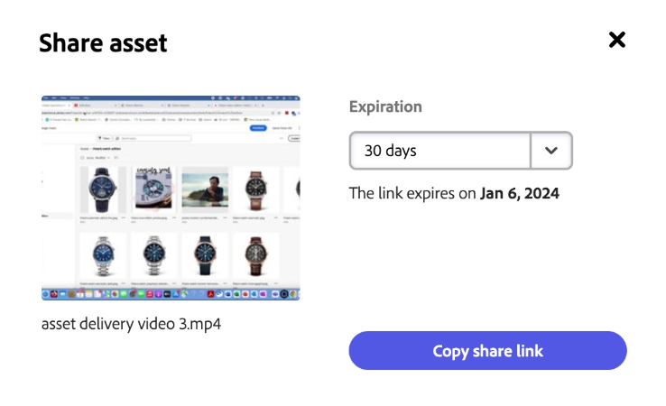

# Compartilhar ativos na Content Hub {#search-assets-as-a-link}

O compartilhamento de ativos por meio de um link é uma maneira conveniente de disponibilizar os recursos para o [!DNL the Content Hub] usuários. A funcionalidade permite que usuários autorizados acessem e baixem os ativos compartilhados com eles. Ao baixar ativos de um link compartilhado, [!DNL the Content Hub] O usa um serviço assíncrono que oferece download mais rápido e ininterrupto.

## Pré-requisitos {#prerequisites}

[Usuários do Content Hub](deploy-content-hub.md#onboard-content-hub-users) O pode executar as ações mencionadas neste artigo.

## Compartilhar um único ativo {#share-a-single-asset}

Você pode compartilhar um único ativo executando as seguintes etapas:

1. Selecione um ativo e clique no link  ícone para compartilhar um ativo.

   

1. Use o **[!UICONTROL Expiração]** para especificar uma data de expiração para o link. Selecione uma das opções disponíveis, como 24 horas, 1 semana, 30 dias, 90 dias, 1 ano ou especifique uma data personalizada.

1. Clique em **[!UICONTROL Copiar link de compartilhamento]**. Em seguida, você pode compartilhar o link copiado com o recipient.

## Compartilhar vários ativos {#share-multiple-assets}

[!DNL The Content Hub] O permite compartilhar vários ativos por meio de um link compartilhado. Execute as seguintes etapas:

1. Selecione os ativos que você precisa compartilhar com o recipient autorizado. Você pode selecionar vários ativos, um por um, ou clicar em **[!UICONTROL Selecionar tudo]** para selecionar todos os ativos disponíveis de uma só vez. A variável **[!UICONTROL Selecionar tudo]** é exibida somente quando você seleciona pelo menos um ativo.

1. Clique em  ícone.

   

1. Na seção de visualização, também é possível excluir ativos de acordo com suas necessidades. Use o **[!UICONTROL Expiração]** para especificar uma data de expiração para o link. Selecione uma das opções disponíveis, como 24 horas, 1 semana, 30 dias, 90 dias, 1 ano ou especifique uma data personalizada.

1. Clique em **[!UICONTROL Copiar link de compartilhamento]**. Em seguida, você pode compartilhar o link copiado com o recipient.

## Visualizar e compartilhar ativos {#preview-assets}

Você pode visualizar como é a aparência de um ativo digital que você compartilhará antes de compartilhá-lo com um recipient de link. Clique no ativo que precisa visualizar. A variável [!DNL Content Hub] exibe o [exibição detalhada do ativo](asset-properties-content-hub.md).

Clique em  ícone para compartilhar um ativo. Use o **[!UICONTROL Expiração]** para especificar uma data de expiração para o link. Selecione uma das opções disponíveis, como 24 horas, 1 semana, 30 dias, 90 dias, 1 ano ou especifique uma data personalizada. Clique em **[!UICONTROL Copiar link de compartilhamento]**. Em seguida, você pode compartilhar o link copiado com o recipient.

## Acessar os ativos compartilhados {#access-shared-assets}

Após compartilhar o link para os ativos, os recipients autorizados podem clicar no link para visualizar ou baixar os ativos compartilhados em um navegador da Web.

Clique no link compartilhado e no ícone de download disponível no cartão de ativos para baixar um ativo.  Você também pode selecionar vários ativos e clicar em **[!UICONTROL Baixar]**. <!--You can either download original assets or Original+Renditions of an asset.--> [!DNL The Content Hub] O baixa cada ativo um por um para o sistema de arquivos local.

