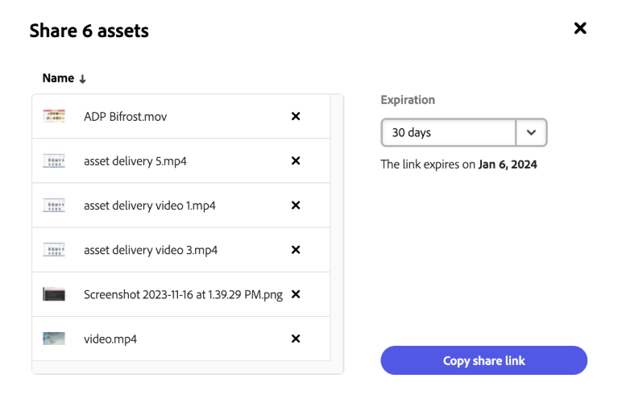

# Compartilhar ativos na Content Hub {#search-assets-as-a-link}

<table>
    <tr>
        <td>
            <i>Novo</i> <a href="/help/assets/dynamic-media/dm-prime-ultimate.md"><b>Dynamic Media Prime e Ultimate</b></a>
        </td>
        <td>
            <i>Novo</i> <a href="/help/assets/assets-ultimate-overview.md"><b>AEM Assets Ultimate</b></a>
        </td>
        <td>
            <i>Nova</i> <a href="/help/assets/integrate-aem-assets-edge-delivery-services.md"><b>integração do AEM Assets com o Edge Delivery Services</b></a>
        </td>
        <td>
            <i>Novo</i> <a href="/help/assets/aem-assets-view-ui-extensibility.md"><b>Extensibilidade da Interface do Usuário</b></a>
        </td>
          <td>
            <i>Novo</i> <a href="/help/assets/dynamic-media/enable-dynamic-media-prime-and-ultimate.md"><b>Habilitar o Dynamic Media Prime e o Ultimate</b></a>
        </td>
    </tr>
    <tr>
        <td>
            <a href="/help/assets/search-best-practices.md"><b>Pesquisar Práticas Recomendadas</b></a>
        </td>
        <td>
            <a href="/help/assets/metadata-best-practices.md"><b>Práticas recomendadas de metadados</b></a>
        </td>
        <td>
            <a href="/help/assets/product-overview.md"><b>Content Hub</b></a>
        </td>
        <td>
            <a href="/help/assets/dynamic-media-open-apis-overview.md"><b>Dynamic Media com recursos OpenAPI</b></a>
        </td>
        <td>
            <a href="https://developer.adobe.com/experience-cloud/experience-manager-apis/"><b>documentação para desenvolvedores do AEM Assets</b></a>
        </td>
    </tr>
</table>

>[!AVAILABILITY]
>
>O guia do Content Hub agora está disponível no formato PDF. Baixe o guia inteiro e use o Assistente de IA da Adobe Acrobat para responder às suas consultas.
>
>[!BADGE PDF do Guia do Content Hub]{type=Informative url="https://helpx.adobe.com/content/dam/help/en/experience-manager/aem-assets/content-hub.pdf"}

O compartilhamento de ativos por meio de um link é uma maneira conveniente de disponibilizar os recursos para [!DNL the Content Hub] usuários. A funcionalidade permite que usuários autorizados acessem e baixem os ativos compartilhados com eles. Ao baixar ativos de um link compartilhado, o [!DNL the Content Hub] usa um serviço assíncrono que oferece download mais rápido e ininterrupto.

## Pré-requisitos {#prerequisites}

[Usuários do Content Hub](deploy-content-hub.md#onboard-content-hub-users) podem executar as ações mencionadas neste artigo.

## Compartilhar um único ativo {#share-a-single-asset}

Você pode compartilhar um único ativo executando as seguintes etapas:

1. Selecione um ativo e clique no ícone  para compartilhar um ativo.

   

1. Use o campo **[!UICONTROL Expiration]** para especificar uma data de expiração para o link. Selecione uma das opções disponíveis, como 24 horas, 1 semana, 30 dias, 90 dias, 1 ano ou especifique uma data personalizada.

1. Clique em **[!UICONTROL Copiar link de compartilhamento]**. Em seguida, você pode compartilhar o link copiado com o recipient.

## Compartilhar vários ativos {#share-multiple-assets}

O [!DNL The Content Hub] permite compartilhar vários ativos por meio de um link compartilhado. Execute as seguintes etapas:

1. Selecione os ativos que você precisa compartilhar com o recipient autorizado. Você pode selecionar vários ativos um por um ou clicar em **[!UICONTROL Selecionar todos]** para selecionar todos os ativos disponíveis de uma só vez. A opção **[!UICONTROL Selecionar tudo]** é exibida somente quando você seleciona pelo menos um ativo.

1. Clique no ícone .

   

1. Na seção de visualização, também é possível excluir ativos de acordo com suas necessidades. Use o campo **[!UICONTROL Expiration]** para especificar uma data de expiração para o link. Selecione uma das opções disponíveis, como 24 horas, 1 semana, 30 dias, 90 dias, 1 ano ou especifique uma data personalizada.

1. Clique em **[!UICONTROL Copiar link de compartilhamento]**. Em seguida, você pode compartilhar o link copiado com o recipient.

## Visualizar e compartilhar ativos {#preview-assets}

Você pode visualizar como é a aparência de um ativo digital que você compartilhará antes de compartilhá-lo com um recipient de link. Clique no ativo que precisa visualizar. O [!DNL Content Hub] exibe a [exibição detalhada do ativo](asset-properties-content-hub.md).

Clique no ícone  para compartilhar um ativo. Use o campo **[!UICONTROL Expiration]** para especificar uma data de expiração para o link. Selecione uma das opções disponíveis, como 24 horas, 1 semana, 30 dias, 90 dias, 1 ano ou especifique uma data personalizada. Clique em **[!UICONTROL Copiar link de compartilhamento]**. Em seguida, você pode compartilhar o link copiado com o recipient.

## Acessar os ativos compartilhados {#access-shared-assets}

Após compartilhar o link para os ativos, os recipients autorizados podem clicar no link para visualizar ou baixar os ativos compartilhados em um navegador da Web.

Clique no link compartilhado e no ícone de download disponível no cartão de ativos para baixar um ativo.  Você também pode selecionar vários ativos e clicar em **[!UICONTROL Baixar]**. <!--You can either download original assets or Original+Renditions of an asset.--> O [!DNL The Content Hub] baixa cada ativo um por um para o sistema de arquivos local.

