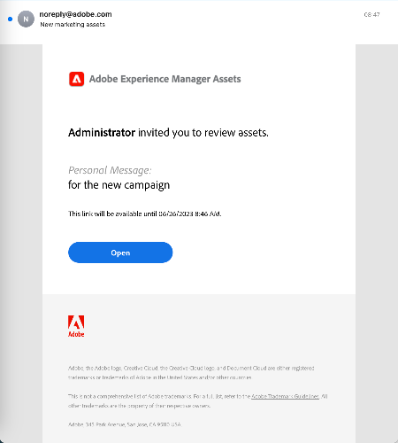

# Compartilhar e distribuir ativos gerenciados em [!DNL Experience Manager] {#share-assets-from-aem}

| Versão | Link do artigo |
| -------- | ---------------------------- |
| AEM 6.5 | [Clique aqui](https://experienceleague.adobe.com/docs/experience-manager-65/assets/administer/link-sharing.html?lang=en) |
| AEM as a Cloud Service | Este artigo |

[!DNL Adobe Experience Manager Assets] permite compartilhar ativos, pastas e coleções com membros de sua organização e entidades externas, incluindo parceiros e fornecedores. Use os seguintes métodos para compartilhar ativos do [!DNL Experience Manager Assets] como [!DNL Cloud Service]:

* [Compartilhar como um link](#sharelink).
* [Baixar ativos](/help/assets/download-assets-from-aem.md) e compartilhar separadamente.
* Compartilhar usando [[!DNL Experience Manager] aplicativo de desktop](https://experienceleague.adobe.com/docs/experience-manager-desktop-app/using/introduction.html?lang=pt-BR).
* Compartilhar usando [[!DNL Adobe Asset Link]](https://www.adobe.com/br/creativecloud/business/enterprise/adobe-asset-link.html).
* Compartilhar usando [[!DNL Brand Portal]](https://experienceleague.adobe.com/docs/experience-manager-brand-portal/using/introduction/brand-portal.html).

## Compartilhar ativos como um link {#sharelink}

O compartilhamento de ativos por meio de um link é uma maneira conveniente de disponibilizar os recursos para partes externas, profissionais de marketing e outros [!DNL Experience Manager] usuários. A funcionalidade permite que usuários anônimos acessem e baixem os ativos compartilhados com eles. Ao baixar ativos de um link compartilhado, [!DNL Experience Manager Assets] O usa um serviço assíncrono que oferece download mais rápido e ininterrupto. Os ativos a serem baixados são enfileirados em segundo plano em arquivos ZIP com tamanho de arquivo gerenciável. Para downloads grandes, o download é agrupado em vários arquivos de 100 GB por tamanho de arquivo.

<!--
Users with administrator privileges or with read permissions at `/var/dam/share` location are able to view the links shared with them. 
-->

>[!NOTE]
>
>* Você precisa de permissão Editar ACL na pasta ou no ativo que deseja compartilhar como um link.
>* [Ativar emails de saída](/help/implementing/developing/introduction/development-guidelines.md#sending-email) antes de compartilhar um link com os usuários.

Há duas maneiras de compartilhar os ativos usando a funcionalidade de compartilhamento de link:

1. Gerar um link compartilhado, [copiar e compartilhar o link de ativo](#copy-and-share-assets-link) com outros usuários. A hora de expiração padrão do link é de um dia. Não é possível alterar o tempo de expiração ao compartilhar o link copiado com outros usuários.

1. Gere um link compartilhado e [compartilhar o link do ativo por email](#share-assets-link-through-email). Nesse caso, é possível modificar os valores padrão, como data e hora de expiração, e permitir o download dos ativos originais e suas execuções. Você pode enviar emails para vários usuários adicionando seus endereços de email.

### Copiar e compartilhar o link de ativo{#copy-and-share-asset-link}

Para compartilhar ativos como um URL público:

1. Faça logon em [!DNL Experience Manager Assets] e navegue até **[!UICONTROL Arquivos]**.
1. Selecione os ativos ou a pasta que contém os ativos. Na barra de ferramentas, clique em **[!UICONTROL Compartilhar link]**.
1. O **[!UICONTROL Compartilhamento de link]** será exibida, contendo um link de ativo gerado automaticamente no **[!UICONTROL Compartilhar link]** campo.
1. Copie o link de ativo e compartilhe-o com os usuários.

### Compartilhar link de ativo por meio de notificação por email {#share-assets-link-through-email}

Para compartilhar ativos por email:

1. Selecione os ativos ou a pasta que contém os ativos. Na barra de ferramentas, clique em **[!UICONTROL Compartilhar link]**.
1. O **[!UICONTROL Compartilhamento de link]** será exibida, contendo um link de ativo gerado automaticamente no **[!UICONTROL Compartilhar link]** campo.

   * Na caixa Endereço de email, digite a ID do email do usuário com quem você deseja compartilhar o link. Você pode compartilhar o link com vários usuários. Se o usuário for membro de sua organização, selecione sua ID de email nas sugestões que aparecem na lista suspensa. Se o usuário for externo, digite a ID de email completa e pressione **[!UICONTROL Enter]**; a ID do email é adicionada à lista de usuários.

   * No **[!UICONTROL Assunto]** digite um assunto para especificar a finalidade dos ativos compartilhados.
   * No **[!UICONTROL Mensagem]** digite uma mensagem, se necessário.
   * No **[!UICONTROL Expiração]** , use o seletor de datas para especificar a data e a hora de expiração do link.
   * Ative o **[!UICONTROL Permitir download do arquivo original]** caixa de seleção para permitir que os recipients baixem a representação original.

1. Clique em **[!UICONTROL Compartilhar]**. Uma mensagem confirma que o link é compartilhado com os usuários. Os usuários recebem um email contendo o link compartilhado.

### Baixar ativos usando o link de ativo

Qualquer usuário que tenha acesso ao link de ativo compartilhado pode baixar os ativos agrupados em uma pasta zip. O processo de download é o mesmo, independentemente de um usuário estar acessando o link do ativo copiado ou usando o link do ativo compartilhado por meio do email.

* Clique no link do ativo ou cole o URL no navegador. O [!UICONTROL Compartilhamento de links] A interface do é aberta, onde você pode alternar para a [!UICONTROL Exibição de cartão] ou [!UICONTROL Exibição de lista].

* No [!UICONTROL Exibição de cartão], você pode passar o mouse sobre o ativo compartilhado ou a pasta de ativos compartilhados para selecionar os ativos ou colocá-los na fila para download.

* Por padrão, a interface do usuário mostra a variável **[!UICONTROL Baixar Caixa de entrada]** opção. Ele reflete a lista de todos os ativos ou pastas compartilhados que estão na fila para download, juntamente com seu status.

* Ao selecionar os ativos ou a pasta, uma **[!UICONTROL Download da fila]** será exibida na tela. Clique no botão **[!UICONTROL Download da fila]** para iniciar o processo de download.

   

* Enquanto o arquivo de download estiver preparado, clique no botão **[!UICONTROL Baixar Caixa de entrada]** para visualizar o status do download. Para downloads grandes, clique no botão **[!UICONTROL Atualizar]** para atualizar o status.

   

* Quando o processamento estiver concluído, clique no botão **[!UICONTROL Baixar]** para baixar o arquivo zip.

<!--
You can also copy the auto-generated link and share it with the users. The default expiration time for the link is one day.
-->

>[!NOTE]
>
>Se um ativo compartilhado for movido para um local diferente, seu link para de funcionar. Recrie o link e compartilhe-o com os usuários.

<!--
## Share assets as a link {#sharelink}

To generate the URL for assets you want to share with users, use the Link Sharing dialog. Users with administrator privileges or with read permissions at `/var/dam/share` location are able to view the links shared with them. Sharing assets through a link is a convenient way of making resources available to external parties without them having to first log in to Experience Manager Assets.

>[!NOTE]
>
>* You need Edit ACL permission on the folder or the asset that you want to share as a link.
>* Before you share a link with users, ensure that Day CQ Mail Service is configured. Otherwise, an error occurs.

1. In the Assets user interface, select the asset to share as a link.
1. From the toolbar, click/tap the **[!UICONTROL Share Link]**.

   An asset link is auto-created in the **[!UICONTROL Share Link]** field. Copy this link and share it with the users. The default expiration time for the link is one day.

   Alternatively, proceed to perform steps 3-7 of this procedure to add email recipients, configure the expiration time for the link, and send it from the dialog.

   >[!NOTE]
   >
   >If a shared asset is moved to a different location, its link stops working. Re-create the link and re-share with the users.

1. From the web console, open the **[!UICONTROL Day CQ Link Externalizer]** configuration and modify the following properties in the **[!UICONTROL Domains]** field with the values mentioned against each:

    * local
    * author
    * publish

   For the local and author properties, provide the URL for the local and author instance respectively. Both local and author properties have the same value if you run a single Experience Manager author instance. For publish, provide the URL for the publish instance.

1. In the email address box of the **[!UICONTROL Link Sharing]** dialog, type the email ID of the user you want to share the link with. You can also share the link with multiple users.

   If the user is a member of your organization, select the user's email ID from the suggested email IDs that appear in the list below the typing area. For an external user, type the complete email ID and then select it from the list.

   To enable emails to be sent out to users, configure the SMTP server details in [Day CQ Mail Service](/help/assets/configure-asset-sharing.md#configmailservice).

   >[!NOTE]
   >
   >If you enter an email ID of a user that is not a member of your organization, the words "External User" are prefixed with the email ID of the user.

1. In the **[!UICONTROL Subject]** box, enter a subject for the asset you want to share.
1. In the **[!UICONTROL Message]** box, enter an optional message.
1. In the **[!UICONTROL Expiration]** field, specify an expiration date and time for the link using the date picker. By default, the expiration date is set for a week from the date you share the link.
1. To let users download the original image along with the renditions, select **[!UICONTROL Allow download of original file]**.

   >[!NOTE]
   >
   >By default, users can only download the renditions of the asset that you share as a link.

1. Click **[!UICONTROL Share]**. A message confirms that the link is shared with the users through an email.
1. To view the shared asset, click/tap the link in the email that is sent to the user. The shared asset is displayed in the **[!UICONTROL Adobe Marketing Cloud]** page.

   To toggle to the list view, click/tap the layout icon in the toolbar.

1. To generate a preview of the asset, click/tap the shared asset. To close the preview and return to the **[!UICONTROL Marketing Cloud]** page, click/tap **[!UICONTROL Back]** in the toolbar. If you have shared a folder, click/tap **[!UICONTROL Parent Folder]** to return to the parent folder.

   >[!NOTE]
   >
   >Experience Manager supports generating the preview of assets of these MIME types: JPG, PNG, GIF, BMP, INDD, PDF, and PPT. You can only download the assets of the other MIME types.

1. To download the shared asset, click/tap **[!UICONTROL Select]** from the toolbar, click/tap the asset, and then click/tap **[!UICONTROL Download]** from the toolbar.
1. To view the assets you shared as links, go to the Assets user interface and click/tap the GlobalNav icon. Choose **[!UICONTROL Navigation]** from the list to display the Navigation pane.
1. From the Navigation pane, choose **[!UICONTROL Shared Links]** to display a list of shared assets.
1. To un-share an asset, select it and tap/click **[!UICONTROL Unshare]** from the toolbar.

A message confirms that you unshared the asset. In addition, the entry for the asset is removed from the list.
-->

## Baixar ativos e compartilhar separadamente {#download-and-share-assets}

Os usuários podem baixar os ativos necessários e compartilhá-los fora do [!DNL Experience Manager]. Para obter mais informações, consulte [como pesquisar ativos](/help/assets/search-assets.md), [como baixar ativos](/help/assets/download-assets-from-aem.md)e [como baixar coleções](manage-collections.md#download-a-collection)

## Compartilhar ativos com profissionais de criação {#share-with-creatives}

Os profissionais de marketing e os usuários de linha de negócios podem compartilhar facilmente os ativos aprovados com seus profissionais de criação usando o

* **Aplicativo de desktop do Experience Manager**: O aplicativo funciona no Windows e no Mac. Consulte [visão geral do aplicativo de desktop](https://experienceleague.adobe.com/docs/experience-manager-desktop-app/using/introduction.html?lang=pt-BR). Para saber como qualquer usuário autorizado de desktop pode acessar facilmente os ativos compartilhados, consulte [procurar, pesquisar e visualizar ativos](https://experienceleague.adobe.com/docs/experience-manager-desktop-app/using/using.html#browse-search-preview-assets). Os usuários da área de trabalho podem criar ativos e compartilhá-los com seus equivalentes que são usuários do Experience Manager, por exemplo, ao fazer upload de novas imagens. Consulte [fazer upload de ativos usando o aplicativo de desktop](https://experienceleague.adobe.com/docs/experience-manager-desktop-app/using/using.html#upload-and-add-new-assets-to-aem).

* **Adobe Asset Link**: Os profissionais criativos podem pesquisar e usar ativos diretamente de dentro [!DNL Adobe InDesign], [!DNL Adobe Illustrator]e [!DNL Adobe Photoshop].

## Configurar compartilhamento de ativos {#configure-sharing}

As diferentes opções para compartilhar os ativos exigem configuração específica e têm pré-requisitos específicos.

### Configurar compartilhamento de link de ativos {#asset-link-sharing}

<!-- TBD: Web Console is not there so how to configure Day CQ email service? Or is it not required now? -->

Para gerar o URL dos ativos que deseja compartilhar com os usuários, use a caixa de diálogo Compartilhamento de links . Usuários com privilégios de administrador ou com permissões de leitura em `/var/dam/share` Os locais podem exibir os links compartilhados com eles. O compartilhamento de ativos por meio de um link é uma maneira conveniente de disponibilizar recursos para terceiros, sem que eles precisem primeiro fazer logon no [!DNL Assets].

>[!NOTE]
>
>Se você quiser compartilhar links da sua instância de Autor com entidades externas, certifique-se de expor apenas os seguintes URLs para `GET` solicitações. Bloqueie outros URLs para garantir que a instância do Autor seja segura.
>
>* `[aem_server]:[port]/linkshare.html`
>* `[aem_server]:[port]/linksharepreview.html`
>* `[aem_server]:[port]/linkexpired.html`

<!--
## Configure Day CQ mail service {#configmailservice}

Before you can share assets as links, configure the email service.

1. Click or tap the Experience Manager logo, and then navigate to **[!UICONTROL Tools]** &gt; **[!UICONTROL Operations]** &gt; **[!UICONTROL Web Console]**.
1. From the list of services, locate **[!UICONTROL Day CQ Mail Service]**.
1. Click the **[!UICONTROL Edit]** icon beside the service, and configure the following parameters for **Day CQ Mail Service]** with the details mentioned against their names:

    * SMTP server host name: email server host name
    * SMTP server port: email server port
    * SMTP user: email server user name
    * SMTP password: email server password

1. Click/tap **[!UICONTROL Save]**.
-->

<!-- TBD: Commenting as Web Console is not available. Document the appropriate OSGi config method if available in CS.
### Configure maximum data size {#maxdatasize}

When you download assets from the link shared using the Link Sharing feature, Experience Manager compresses the asset hierarchy from the repository and then returns the asset in a ZIP file. However, in the absence of limits to the amount of data that can be compressed in a ZIP file, huge amounts of data is subjected to compression, which causes out of memory errors in JVM. To secure the system from a potential denial of service attack due to this situation, you can configure the maximum size of the downloaded files. If uncompressed size of the asset exceeds the configured value, asset download requests are rejected. The default value is 100 MB.

1. Click/Tap the Experience Manager logo and then go to **[!UICONTROL Tools]** &gt; **[!UICONTROL Operations]** &gt; **[!UICONTROL Web Console]**.
1. From the web console, locate the **[!UICONTROL Day CQ DAM Adhoc Asset Share Proxy Servlet]** configuration.
1. Open the configuration in edit mode, and modify the value of the **[!UICONTROL Max Content Size (uncompressed)]** parameter.
1. Save the changes.
-->

<!--
Add content or link about how to configure sharing via BP, DA, AAL, etc.
-->

### Ativar ações da área de trabalho para usar com o aplicativo da área de trabalho {#desktop-actions}

No [!DNL Assets] interface do usuário em um navegador, você pode explorar os locais dos ativos ou fazer check-out e abrir o ativo para edição em seu aplicativo de desktop. Essas opções são chamadas de ações da área de trabalho e, para ativá-las, consulte [ativar ações da área de trabalho em [!DNL Assets] interface da Web](https://experienceleague.adobe.com/docs/experience-manager-desktop-app/using/using.html#desktopactions-v2).

### Configurações a serem usadas [!DNL Adobe Asset Link] {#configure-asset-link}

O Adobe Asset Link simplifica a colaboração entre criadores e profissionais de marketing no processo de criação de conteúdo. Ele se conecta [!DNL Adobe Experience Manager Assets] com [!DNL Creative Cloud] aplicativos de desktop [!DNL Adobe InDesign], [!DNL Adobe Photoshop]e [!DNL Adobe Illustrator]. O [!DNL Adobe Asset Link] painel permite que os criadores acessem e modifiquem o conteúdo armazenado em [!DNL Assets] sem deixar os aplicativos criativos, eles são mais conhecidos.

Consulte [como configurar [!DNL Assets] para usá-lo com [!DNL Adobe Asset Link]](https://helpx.adobe.com/br/enterprise/using/configure-aem-assets-for-asset-link.html).

## Práticas recomendadas e solução de problemas {#bestpractices}

* As pastas ou coleções de ativos que contêm um espaço em branco no nome podem não ser compartilhadas.
* Se os usuários não conseguirem baixar os ativos compartilhados, verifique com o administrador do Experience Manager quais são os limites de download. O valor padrão é 100 MB.
* Para que um usuário visualize um vídeo que é compartilhado usando o compartilhamento de link, o vídeo deve ter uma representação de vídeo estática disponível em `/jcr:content/renditions` local no nó do vídeo no repositório. A visualização não depende da disponibilidade de um [!DNL Dynamic Media] representação.
* Ao baixar um ativo de vídeo por meio do compartilhamento de link, a variável [!DNL Dynamic Media] as representações não estão incluídas no arquivo baixado.

<!--
* If you cannot send email with links to shared assets or if the other users cannot receive your email, check with your Experience Manager administrator if the [email service](/help/assets/configure-asset-sharing.md#configmailservice) is configured or not. 
* If you cannot share assets using link sharing functionality, ensure that you have the appropriate permissions. See [share assets](#sharelink).
-->

<!-- TBD: Add content or link about how to share using Brand Portal when it is available on [!DNL Cloud Service].
-->

**Consulte também**

* [Traduzir ativos](translate-assets.md)
* [API HTTP de ativos](mac-api-assets.md)
* [Formatos de arquivo compatíveis com os ativos](file-format-support.md)
* [Pesquisar ativos](search-assets.md)
* [Ativos conectados](use-assets-across-connected-assets-instances.md)
* [Relatórios de ativos](asset-reports.md)
* [Esquemas de metadados](metadata-schemas.md)
* [Baixar ativos](download-assets-from-aem.md)
* [Gerenciar metadados](manage-metadata.md)
* [Pesquisar aspectos](search-facets.md)
* [Gerenciar coleções](manage-collections.md)
* [Importação de metadados em massa](metadata-import-export.md)
