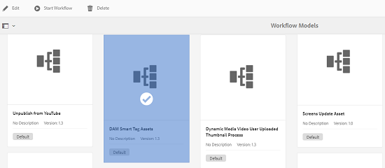

# Adicionar tags inteligentes a ativos no AEM {#smart-tags-assets-aem}

| Versão | Link do artigo |
| -------- | ---------------------------- |
| AEM 6.5 | [Clique aqui](https://experienceleague.adobe.com/docs/experience-manager-65/assets/using/enhanced-smart-tags.html?lang=en) |
| AEM as a Cloud Service | Este artigo |

As organizações que lidam com ativos digitais usam cada vez mais vocabulário controlado por taxonomia em metadados de ativos. Basicamente, ele inclui uma lista de palavras-chave que funcionários, parceiros e clientes normalmente usam para consultar e pesquisar por seus ativos digitais. Marcar ativos com um vocabulário controlado por taxonomia garante que eles possam ser facilmente identificados e recuperados em pesquisas.

Em comparação aos vocabulários de linguagem natural, a marcação com base na taxonomia comercial ajuda a alinhar os ativos aos negócios de uma empresa e garante que os ativos mais relevantes apareçam nas pesquisas. Por exemplo, um fabricante de carros pode marcar imagens de carro com nomes de modelo para que apenas imagens relevantes sejam exibidas quando pesquisadas para projetar uma campanha promocional.

Em segundo plano, a funcionalidade usa a estrutura artificialmente inteligente do [Adobe Sensei](https://business.adobe.com/why-adobe/experience-cloud-artificial-intelligence.html) para treinar o algoritmo de reconhecimento de imagem de acordo com sua estrutura de tags e sua taxonomia comercial. Essa inteligência de conteúdo é usada para aplicar tags relevantes em um conjunto diferente de ativos. Por padrão, o AEM aplica tags inteligentes automaticamente a ativos carregados.

<!-- TBD: Create a flowchart for how training works in CS.
 
-->

## Tipos de ativos compatíveis com tags inteligentes no AEM {#smart-tags-supported-file-formats}

Você pode marcar os seguintes tipos de ativos:

* **Imagens**: imagens em muitos formatos são marcadas usando os serviços de conteúdo inteligente do Adobe Sensei. Você [criar um modelo de treinamento](#train-model) e as imagens carregadas são marcadas automaticamente. As Tags inteligentes são aplicadas aos tipos de arquivos compatíveis que geram representações nos formatos JPG e PNG.
* **Ativos baseados em texto**: [!DNL Experience Manager Assets] marca automaticamente os ativos baseados em texto compatíveis quando carregados.
* **Ativos de vídeo**: a marcação de vídeo é ativada por padrão no [!DNL Adobe Experience Manager] as a [!DNL Cloud Service]. [Os vídeos são marcados automaticamente](/help/assets/smart-tags-video-assets.md) ao carregar vídeos novos ou reprocessar vídeos existentes.

| Imagens (tipos MIME) | Ativos baseados em texto (formatos de arquivo) | Ativos de vídeo (formatos de arquivo e codecs) |
|----|-----|------|
| image/jpeg | CSV | MP4 (H264/AVC) |
| image/tiff | DOC | MKV (H264/AVC) |
| image/png | DOCX | MOV (H264/AVC, JPEG de movimento) |
| image/bmp | HTML | AVI (indeo4) |
| image/gif | PDF | FLV (H264/AVC, vp6f) |
| image/pjpeg | PPT | WMV (WMV2) |
| image/x-portable-anymap | PPTX |  |
| image/x-portable-bitmap | RTF |  |
| image/x-portable-graymap | SRT |  |
| image/x-portable-pixmap | TXT |  |
| image/x-rgb | VTT |  |
| image/x-xbitmap |  |  |
| image/x-xpixmap |  |  |
| image/x-icon |  |  |
| image/photoshop |  |  |
| image/x-photoshop |  |  |
| image/psd |  |  |
| image/vnd.adobe.photoshop |  |  |

O AEM adiciona automaticamente as Tags inteligentes aos ativos baseados em texto e aos vídeos por padrão. Para adicionar tags inteligentes automaticamente a imagens, conclua as tarefas a seguir.

* [Entender modelos e diretrizes de tags](#understand-tag-models-guidelines).
* [Treinar o modelo](#train-model).
* [Marque seus ativos digitais](#tag-assets).
* [Gerenciar tags e pesquisas](#manage-smart-tags-and-searches).

## Entender modelos e diretrizes de tags {#understand-tag-models-guidelines}

Um modelo de tag é um grupo de tags relacionadas associadas a vários aspectos visuais das imagens que estão sendo marcadas. As tags estão relacionadas a aspectos visuais distintamente diferentes de imagens, de modo que, quando aplicadas, as tags ajudam a pesquisar tipos específicos de imagens. Por exemplo, uma coleção de sapatos pode ter tags diferentes, mas todas as tags estão relacionadas a sapatos e podem pertencer ao mesmo modelo de tag. Quando aplicadas, as tags ajudam a encontrar diferentes tipos de sapatos, por exemplo, por design ou uso. Para entender a representação do conteúdo de um modelo de treinamento em [!DNL Experience Manager], visualize um modelo de treinamento como uma entidade de nível superior composta de um grupo de tags adicionadas manualmente e imagens de exemplo para cada tag. Cada tag pode ser aplicada exclusivamente a uma imagem.

Antes de criar um modelo de tag e treinar o serviço, identifique um conjunto de tags exclusivas que descrevam melhor os objetos nas imagens no contexto de sua empresa. Verifique se os ativos do conjunto preparado estão em conformidade com [as diretrizes de treinamento](#training-guidelines).

### Diretrizes de treinamento {#training-guidelines}

Verifique se as imagens no conjunto de treinamento estão em conformidade com as seguintes diretrizes:

**Quantidade e tamanho:** Mínimo de 10 imagens e máximo de 50 imagens por tag.

**Coerência**: verifique se as imagens de uma tag são visualmente semelhantes. É melhor adicionar tags sobre os mesmos aspectos visuais (como o mesmo tipo de objetos em uma imagem) em um único modelo de tag. Por exemplo, não é uma boa ideia marcar todas essas imagens como `my-party` (para treinamento) porque não são visualmente semelhantes.

**Cobertura**: deve haver variedade suficiente nas imagens no treinamento. A ideia é fornecer alguns exemplos, mas razoavelmente diversos, para que [!DNL Experience Manager] O aprende a se concentrar nas coisas certas. Se você estiver aplicando a mesma tag em imagens visualmente diferentes, inclua pelo menos cinco exemplos de cada tipo. Por exemplo, para a tag *model-down-pose*, inclua mais imagens de treinamento semelhantes à imagem destacada abaixo para que o serviço identifique imagens semelhantes com mais precisão durante a marcação.

**Distração/obstrução**: O serviço treina melhor em imagens com menos distração (fundo proeminente, acompanhamento não relacionado, como objetos/pessoas com o assunto principal). Por exemplo, para a tag *sapato casual*, a segunda imagem não é um bom candidato para treinamento.

**Integridade:** se uma imagem se qualificar para mais de uma tag, adicione todas as tags aplicáveis antes de incluir a imagem para treinamento. Por exemplo, para tags, como *capa de chuva* e *perfil de modelo*, adicione ambas as tags ao ativo elegível antes de incluí-lo para treinamento.

**Número de tags**: o Adobe recomenda que você treine um modelo usando pelo menos duas tags distintas e pelo menos dez imagens diferentes para cada tag. Em um modelo de tag única, não adicione mais de 50 tags.

**Número de exemplos**: para cada tag, adicione pelo menos dez exemplos. No entanto, o Adobe recomenda cerca de 30 exemplos. Há suporte para no máximo 50 exemplos por tag.

**Evitar falsos positivos e conflitos**: o Adobe recomenda criar um modelo de tag única para um único aspecto visual. Estruturar os modelos de tags de forma a evitar a sobreposição de tags entre os modelos. Por exemplo, não use tags comuns como `sneakers` em dois nomes de modelos de tag diferentes `shoes` e `footwear`. O processo de treinamento substitui um modelo de tag treinado pelo outro para uma palavra-chave comum.

**Exemplos**: mais alguns exemplos para obter orientação:

* Crie um modelo de tag que inclua apenas,

   * As tags relacionadas aos modelos de carro.
   * As tags relacionadas a jaquetas para adultos e crianças.

* Não criar,

   * Um modelo de etiqueta que inclui modelos de carros lançados em 2019 e 2020.
   * Vários modelos de tag que incluem os mesmos poucos modelos de carro.

**Imagens usadas para treinar**: é possível usar as mesmas imagens para treinar modelos de tags diferentes. No entanto, não associe uma imagem a mais de uma tag em um modelo de tag. É possível marcar a mesma imagem com tags diferentes pertencentes a modelos de tags diferentes.

Não é possível desfazer o treinamento. As diretrizes acima devem ajudá-lo a escolher boas imagens para treinar.

## Treine o modelo para suas tags personalizadas {#train-model}

Para criar e treinar um modelo para suas tags específicas de negócios, siga estas etapas:

1. Crie as tags necessárias e a estrutura de tags apropriada. Faça upload das imagens relevantes no repositório DAM.
1. Entrada [!DNL Experience Manager] interface de usuário, acesso **[!UICONTROL Assets]** > **[!UICONTROL Treinamento de tag inteligente]**.
1. Clique em **[!UICONTROL Criar]**. Forneça um **[!UICONTROL Título]**, **[!UICONTROL Descrição]**.
1. Clique no ícone de pasta em **[!UICONTROL Tags]** campo. Uma janela pop-up é aberta.
1. Pesquise ou selecione as tags apropriadas nas tags existentes em `cq-tags` que deseja adicionar ao modelo. Clique em **[!UICONTROL Avançar]**.

   >[!NOTE]
   >
   >Você pode classificar a estrutura de tags em ordem crescente ou decrescente com base na variável **[!UICONTROL Nome]** (ordem alfabética), **[!UICONTROL Criado em]** data ou **[!UICONTROL Modificado]** data.

1. No **[!UICONTROL Selecionar ativos]** clique em **[!UICONTROL Adicionar ativos]** em cada tag. Pesquise no repositório DAM ou navegue pelo repositório para selecionar pelo menos 10 e no máximo 50 imagens. Selecione ativos, e não a pasta. Após selecionar as imagens, clique em **[!UICONTROL Selecionar]**.

   

1. Para visualizar as miniaturas das imagens selecionadas, clique no acordeão na frente de uma tag. Você pode modificar a seleção clicando em **[!UICONTROL Adicionar ativos]**. Quando estiver satisfeito com a seleção, clique em **[!UICONTROL Enviar]**. A interface do usuário exibe uma notificação na parte inferior da página indicando que o treinamento foi iniciado.
1. Verifique o status do treinamento no **[!UICONTROL Status]** para cada modelo de tag. Os possíveis status são [!UICONTROL Pending], [!UICONTROL Treinou], e [!UICONTROL Failed].

*Figura: etapas do fluxo de trabalho de treinamento para treinar o modelo de marcação.*

### Exibir status e relatório do treinamento {#training-status}

Para verificar se o serviço de Tags inteligentes é treinado em suas tags no conjunto de ativos de treinamento, revise o relatório de fluxo de trabalho de treinamento no console Relatórios.

1. Entrada [!DNL Experience Manager] , vá para **[!UICONTROL Ferramentas]** > **[!UICONTROL Assets]** > **[!UICONTROL Relatórios]**.
1. No **[!UICONTROL Relatórios de ativos]** clique em **[!UICONTROL Criar]**.
1. Selecione o **[!UICONTROL Treinamento de tags inteligentes]** e, em seguida, clique em **[!UICONTROL Próxima]** na barra de ferramentas.
1. Especifique um título e uma descrição para o relatório. Em **[!UICONTROL Agendar relatório]**, deixe a opção **[!UICONTROL Agora]** selecionada. Se desejar agendar o relatório para posteriormente, selecione **[!UICONTROL Posteriormente]** e especifique uma data e hora. Em seguida, clique em **[!UICONTROL Criar]** na barra de ferramentas.
1. Na página **[!UICONTROL Relatórios de ativos]**, selecione o relatório gerado. Para exibir o relatório, clique em **[!UICONTROL Exibir]** na barra de ferramentas.
1. Revise os detalhes do relatório. O relatório exibe o status do treinamento das tags que você treinou. A cor verde no campo **[!UICONTROL Status do treinamento]** indica que o serviço Tags inteligentes é treinado para a tag. A cor amarela indica que o serviço foi parcialmente treinado para uma tag específica. Para treinar o serviço completamente para uma tag, adicione mais imagens com a tag específica e execute o fluxo de trabalho de treinamento. Se você não vir suas tags neste relatório, execute o fluxo de trabalho de treinamento novamente para essas tags.Tags
1. Para baixar o relatório, selecione-o na lista e clique em **[!UICONTROL Baixar]** na barra de ferramentas. O relatório é baixado como uma planilha.

<!--
### Tag assets from the workflow console {#tagging-assets-from-the-workflow-console}

1. In [!DNL Experience Manager] interface, go to **[!UICONTROL Tools]** > **[!UICONTROL Workflow]** > **[!UICONTROL Models]**.
1. From the **[!UICONTROL Workflow Models]** page, select the **[!UICONTROL DAM Smart Tags Assets]** workflow and then click **[!UICONTROL Start Workflow]** from the toolbar.

   

1. In the **[!UICONTROL Run Workflow]** dialog, browse to the payload folder containing assets on which you want to apply your tags automatically.
1. Specify a title for the workflow and an optional comment. Click **[!UICONTROL Run]**.

   

   *Figure: Navigate to the asset folder and review the tags to verify whether your assets are tagged properly. For details, see [manage smart tags](#manage-smart-tags-and-searches).*

### Tag assets from the timeline {#tagging-assets-from-the-timeline}

1. From the [!DNL Assets] user interface, select the folder containing assets or specific assets to which you want to apply smart tags.
1. From upper-left corner, open the **[!UICONTROL Timeline]**.
1. Open actions from the bottom of the left sidebar and click **[!UICONTROL Start Workflow]**.

   

1. Select the **[!UICONTROL DAM Smart Tag Assets]** workflow, and specify a title for the workflow.
1. Click **[!UICONTROL Start]**. The workflow applies your tags on assets. Navigate to the asset folder and review the tags to verify that your assets are tagged properly. For details, see [manage smart tags](#manage-smart-tags-and-searches).

>[!NOTE]
>
>In the subsequent tagging cycles, only the modified assets are tagged again with newly trained tags. However, even unaltered assets are tagged if the gap between the last and current tagging cycles for the tagging workflow exceeds 24 hours. For periodic tagging workflows, unaltered assets are tagged when the time gap exceeds six months.

### Tag uploaded assets {#tag-uploaded-assets}

[!DNL Experience Manager] can automatically tag the assets that users upload to DAM. To do so, administrators configure a workflow to add an available step that tags assets. See [how to enable Smart Tags for uploaded assets](/help/assets/smart-tags-configuration.md#enable-smart-tagging-for-uploaded-assets).
-->

## Marcar ativos com tags inteligentes no AEM {#tag-assets}

Todos os tipos de ativos compatíveis são marcados automaticamente pelo [!DNL Experience Manager Assets] quando carregado. A marcação é ativada e funciona por padrão. O AEM aplica as tags inteligentes apropriadas em tempo quase real. <!-- TBD: You can also apply the tagging workflow on-demand. The workflow applies to both, assets and folders. -->

* Para imagens e vídeos, as Tags inteligentes se baseiam em algum aspecto visual.

* Para ativos baseados em texto, a eficácia das Tags inteligentes não depende da quantidade de texto no ativo, mas das palavras-chave ou entidades relevantes presentes no texto do ativo. Para ativos baseados em texto, as Tags inteligentes são as palavras-chave que aparecem no texto, mas as que melhor descrevem o ativo. Para ativos compatíveis, [!DNL Experience Manager] O já extrai o texto, que é indexado e usado para pesquisar os ativos. No entanto, as Tags inteligentes com base em palavras-chave no texto fornecem uma faceta de pesquisa dedicada, estruturada e de maior prioridade. O último ajuda a melhorar a descoberta de ativos em comparação a um índice de pesquisa.

## Gerenciar tags inteligentes e pesquisas de ativos {#manage-smart-tags-and-searches}

É possível preparar tags inteligentes para remover tags imprecisas que possam ter sido atribuídas aos ativos da marca, de forma que somente as tags mais relevantes sejam exibidas.

A moderação de tags inteligentes também ajuda a refinar pesquisas baseadas em tags para ativos, garantindo que seus ativos apareçam nos resultados da pesquisa para as tags mais relevantes. Basicamente, ajuda a eliminar as chances de ativos não relacionados aparecerem nos resultados da pesquisa.

Também é possível atribuir uma classificação mais alta a uma tag para aumentar a relevância da tag para o ativo. Promover uma tag para um ativo aumenta as chances do ativo aparecer nos resultados da pesquisa quando uma pesquisa é realizada com base na tag específica.

Para moderar as tags inteligentes dos ativos digitais:

1. No campo de pesquisa, pesquise por ativos digitais com base em uma tag.

1. Para identificar os ativos digitais que você não acha relevantes para a sua pesquisa, inspecione os resultados da pesquisa.

1. Selecione um ativo e  na barra de ferramentas.

1. No **[!UICONTROL Gerenciar tags]** página, inspecione as tags. Se não quiser que o ativo seja pesquisado com base em uma tag específica, selecione a tag e  na barra de ferramentas. Como alternativa, selecione `X` símbolo ao lado do rótulo.

1. Para atribuir uma classificação mais alta a uma tag, selecione a tag e  na barra de ferramentas. A tag promovida é movida para a tag **[!UICONTROL Tags]** seção.

1. Selecionar **[!UICONTROL Salvar]** e selecione **[!UICONTROL OK]** para fechar o [!UICONTROL Sucesso] diálogo.

1. Navegue até a [!UICONTROL Propriedades] página do ativo. Observe que a tag promovida recebe uma alta relevância e, portanto, aparece mais alta nos resultados da pesquisa.

### Compreender [!DNL Experience Manager] resultados da pesquisa com tags inteligentes {#understand-search}

Por padrão, [!DNL Experience Manager] a pesquisa combina os termos de pesquisa com uma `AND` Cláusula. O uso de tags inteligentes não altera esse comportamento padrão. O uso de tags inteligentes adiciona uma `OR` para localizar qualquer um dos termos de pesquisa nas tags inteligentes aplicadas. Por exemplo, considere pesquisar por `woman running`. Ativos com apenas `woman` ou apenas `running` por padrão, a palavra-chave nos metadados não aparece nos resultados da pesquisa. No entanto, um ativo marcado com `woman` ou `running` o uso de tags inteligentes aparece nessa consulta de pesquisa. Então os resultados da busca são uma combinação de,

* Ativos com `woman` e `running` nos metadados.

* Ativos inteligentes marcados com uma das palavras-chave.

Os resultados da pesquisa que correspondem a todos os termos de pesquisa em campos de metadados são exibidos primeiro, seguido pelos resultados da pesquisa que correspondem a qualquer um dos termos de pesquisa nas tags inteligentes. No exemplo acima, a ordem aproximada de exibição dos resultados da pesquisa é:

1. corresponde a `woman running` nos vários campos de metadados.
1. corresponde a `woman running` em tags inteligentes.
1. corresponde a `woman` ou de `running` em tags inteligentes.

## Limitações e práticas recomendadas relacionadas à marcação {#limitations}

A marcação inteligente aprimorada se baseia em modelos de aprendizagem de imagens e suas tags. Esses modelos nem sempre são perfeitos para identificar tags. A versão atual das Tags inteligentes tem as seguintes limitações:

* Incapacidade de reconhecer diferenças sutis nas imagens. Por exemplo, camisetas de tamanho magro versus camisetas de tamanho normal.
* Incapacidade de identificar tags com base em pequenos padrões ou partes de uma imagem. Por exemplo, logotipos em camisas.
* A marcação é compatível com os idiomas que [!DNL Experience Manager] suporta.
* As tags não tratadas estão relacionadas a:

   * Aspectos não visuais e abstratos. Por exemplo, o ano ou a temporada de lançamento de um produto, o humor ou a emoção evocada por uma imagem e uma conotação subjetiva de um vídeo.
   * Diferenças visuais refinadas em produtos, como camisas com e sem coleiras ou logotipos de produtos pequenos incorporados nos produtos.

Para treinar o modelo, use as imagens mais apropriadas. O treinamento não pode ser revertido ou o modelo de treinamento não pode ser removido. A precisão da marcação depende do treinamento atual, portanto, faça isso com cuidado.

<!-- TBD: Add limitations related to text files. -->

Para pesquisar arquivos com tags inteligentes (regular ou aprimorado), use o [!DNL Assets] pesquisa (pesquisa de texto completo). Não há predicado de pesquisa separado para tags inteligentes.

>[!NOTE]
>
>A capacidade das Tags inteligentes de treinar em suas tags e aplicá-las em outras imagens depende da qualidade de imagens usadas para treinamento.
>Para obter melhores resultados, a Adobe recomenda usar imagens visualmente semelhantes para treinar o serviço para cada tag.

**Consulte também**

* [Traduzir ativos](translate-assets.md)
* [API HTTP de ativos](mac-api-assets.md)
* [Formatos de arquivo compatíveis com os ativos](file-format-support.md)
* [Pesquisar ativos](search-assets.md)
* [Ativos conectados](use-assets-across-connected-assets-instances.md)
* [Relatórios de ativos](asset-reports.md)
* [Esquemas de metadados](metadata-schemas.md)
* [Baixar ativos](download-assets-from-aem.md)
* [Gerenciar metadados](manage-metadata.md)
* [Pesquisar aspectos](search-facets.md)
* [Gerenciar coleções](manage-collections.md)
* [Importação de metadados em massa](metadata-import-export.md)

>[!MORELIKETHIS]
>
>* [Entenda como as tags inteligentes ajudam a gerenciar arquivos digitais](https://medium.com/adobetech/efficient-asset-management-with-enhanced-smart-tags-887bd47dbb3f)
>* [Usar tags inteligentes para vídeos](smart-tags-video-assets.md)

