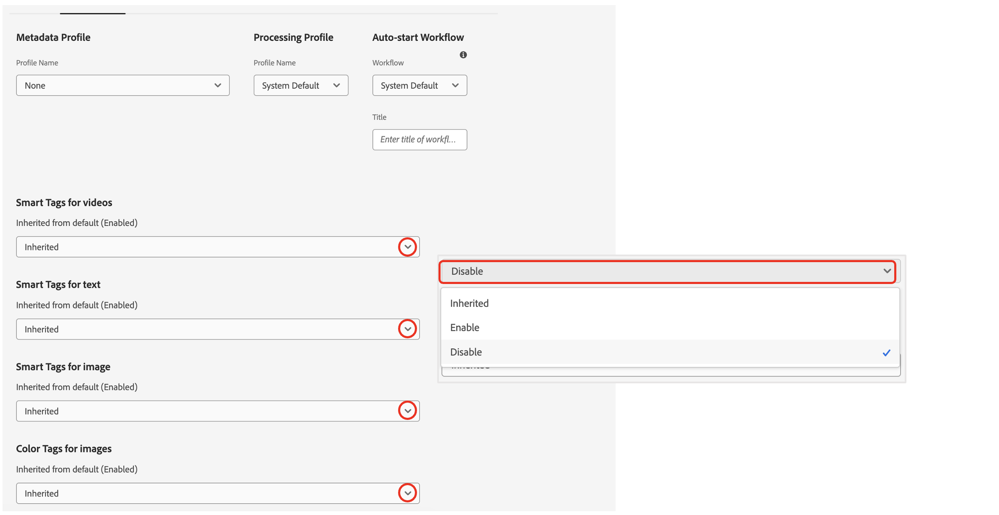

# Tags inteligentes para o AEM Assets {#using-smart-tags}

As organizações possuem vários ativos digitais, e esse número continua a crescer rapidamente. Pesquisar um ativo específico em meio a uma quantidade tão grande de dados representa um desafio significativo. Para resolver isso, `metadata` e `tags` são empregados para melhorar a capacidade de pesquisa de ativos digitais. As organizações usam vocabulários controlados por taxonomia em metadados de ativos. Normalmente, elas consistem em listas de palavras-chave que funcionários, parceiros e clientes geralmente usam para consultar e localizar ativos digitais.

As Tags inteligentes são palavras-chave que não só aparecem no texto, mas também descrevem melhor o ativo. Marcar ativos com um vocabulário controlado por taxonomia garante que eles possam ser facilmente identificados e recuperados por meio de pesquisa.

Por exemplo, palavras organizadas alfabeticamente em um dicionário são mais fáceis de encontrar do que as dispersas aleatoriamente. A marcação serve um propósito semelhante. Ele organiza os ativos de acordo com a taxonomia comercial, garantindo que os mais relevantes apareçam nos resultados da pesquisa. Por exemplo, um fabricante de automóveis pode marcar imagens de carros com nomes de modelos, de modo que apenas imagens relevantes sejam exibidas ao projetar uma campanha promocional. Independentemente de marcar &quot;corredores&quot; ou &quot;tênis de corrida&quot;, os usuários não precisam se preocupar com erros de digitação, variações de ortografia ou termos de pesquisa alternativos - as Tags inteligentes reconhecem tudo isso.

Em segundo plano, a funcionalidade usa a estrutura artificialmente inteligente do [Adobe Sensei](https://business.adobe.com/products/sensei/adobe-sensei.html) para aplicar automaticamente as Tags inteligentes aos ativos carregados, por padrão, juntamente com o texto alinhado à taxonomia comercial.

## Pré-requisitos e configuração {#smart-tags-prereqs-config}

As Tags Inteligentes são automaticamente provisionadas para [!DNL Adobe Experience Manager] como [!DNL Cloud Service] e, portanto, nenhuma configuração é necessária.

## Fluxo de trabalho de Tags inteligentes {#smart-tags-workflow}

A marcação inteligente habilitada do [!DNL Adobe Sensei] usa modelos de inteligência artificial para analisar conteúdo e adicionar marcas aos ativos. Dessa forma, reduz o tempo para que os usuários do DAM forneçam experiências avançadas aos clientes. As Tags inteligentes são exibidas em ordem decrescente de sua [pontuação de confiança](#confidence-score) nas propriedades do ativo.

* **Ativos baseados em imagem**
Para imagens, as Tags inteligentes se baseiam em algum aspecto visual. Imagens em muitos formatos são marcadas usando serviços de conteúdo inteligente. As Marcas Inteligentes são aplicadas aos [tipos de arquivos &#x200B;](#supported-file-formats) compatíveis que geram representações nos formatos JPG e PNG.

  <!-- -->

* **Ativos baseados em vídeo**
Para ativos baseados em vídeo, a marcação é habilitada por padrão no [!DNL Adobe Experience Manager] como um [!DNL Cloud Service]. Da mesma forma que tags baseadas em imagem e texto, os vídeos também são marcados automaticamente ao carregar novos vídeos ou reprocessar os existentes. O [!DNL Adobe Sensei] gera dois conjuntos de marcas para um vídeo: um conjunto corresponde a objetos, cenas e atributos nesse vídeo, enquanto o outro conjunto está relacionado a ações como beber, correr e correr. Marque também [recusar a marcação inteligente de vídeo](#opt-out-video-smart-tagging).

* **Ativos baseados em texto**
Para os ativos com suporte, o [!DNL Experience Manager] já extrai o texto, que é indexado e usado para procurar os ativos. No entanto, as Tags inteligentes com base em palavras-chave no texto fornecem uma faceta de pesquisa dedicada, estruturada e de maior prioridade. O último ajuda a melhorar a descoberta de ativos em comparação a um índice de pesquisa.
Para ativos baseados em texto, a eficácia das Tags inteligentes não depende da quantidade de texto no ativo, mas das palavras-chave ou entidades relevantes presentes no texto do ativo.

  

As Tags inteligentes são implementadas no AEM Assets usando o seguinte fluxo de trabalho:

1. Criar ou fazer upload de um ativo no AEM. As tags prontas para uso são geradas para imagem, vídeo e Assets baseada em texto.

1. Se você descobrir que tags específicas não são geradas, poderá treinar suas tags do tipo imagem de acordo. Consulte o [Treinamento de tags inteligentes](#smart-tags-training.md).

## Formatos de arquivo compatíveis com Tags inteligentes {#supported-file-formats}

| Imagens (tipos MIME) | Ativos baseados em texto (formatos de arquivo) | Ativos de vídeo (formatos de arquivo e codecs) |
|----|-----|------|
| image/jpeg | CSV | MP4 (H264/AVC) |
| image/tiff | DOC | MKV (H264/AVC) |
| image/png | DOCX | MOV (H264/AVC, Motion JPEG) |
| image/bmp | HTML | AVI (indeo4) |
| image/gif | PDF | FLV (H264/AVC, vp6f) |
| image/pjpeg | PPT | WMV (WMV2) |
| image/x-portable-anymap | PPTX |  |
| image/x-portable-bitmap | RTF |  |
| image/x-portable-graymap | SRT |  |
| image/x-portable-pixmap | TXT |  |
| image/x-rgb | VTT |  |
| image/x-xbitmap | |  |
| image/x-xpixmap | |  |
| image/x-icon |  |  |
| image/photoshop |  |  |
| image/x-photoshop |  |  |
| image/psd |  |  |
| image/vnd.adobe.photoshop |  |  |

## Preparação de um ativo para a marcação inteligente pronta para uso

Ao [carregar ativos](add-assets.md#upload-assets) para [!DNL Adobe Experience Manager] como [!DNL Cloud Service], os ativos carregados são processados. Após concluir o processamento, consulte a guia [!UICONTROL Básico] da página [!UICONTROL Propriedades] do ativo. As Tags inteligentes são adicionadas automaticamente aos ativos em [!UICONTROL Tags inteligentes]. Os microsserviços de ativos usam [!DNL Adobe Sensei] para criar essas Tags inteligentes.


<!--
The applied smart tags are sorted in descending order of [confidence score](#confidence-score), combined for object and action tags, within [!UICONTROL Smart Tags].
-->

>[!IMPORTANT]
>
>É recomendável revisar essas tags geradas automaticamente para garantir que estejam em conformidade com sua marca e seus valores.

## Assets não marcado no DAM {#smart-tag-existing-assets}

Os ativos existentes ou mais antigos no DAM não são marcados automaticamente com tags inteligentes. Você precisa [Reprocessar](https://experienceleague.adobe.com/docs/experience-manager-cloud-service/content/assets/admin/about-image-video-profiles.html?lang=en#adjusting-load) o Assets manualmente para gerar Tags inteligentes para eles. Depois que o processo for concluído, navegue até a página [!UICONTROL Propriedades] de qualquer ativo contido na pasta. As marcas adicionadas automaticamente são vistas na seção [!UICONTROL Tags inteligentes] da guia [!UICONTROL Básico]. Essas Tags Inteligentes aplicadas são classificadas em ordem decrescente de [pontuação de confiança](#confidence-score).

<!--
To smart tag assets, or folders (including subfolders) of assets that exist in assets repository, follow these steps:

1. Select the [!DNL Adobe Experience Manager] logo and then select assets from the [!UICONTROL Navigation] page.

1. Select [!UICONTROL Files] to display the Assets interface.

1. Navigate to the folder to which you want to apply Smart Tags.

1. Select the assets and click  [!UICONTROL Reprocess Assets] icon and select the [!UICONTROL Full Process] option.

-->

## Pontuação de confiança {#confidence-score}

Os resultados da pesquisa de ativos são classificados com base nas pontuações de confiança, que geralmente melhoram os resultados da pesquisa além do que uma inspeção das tags atribuídas de qualquer ativo sugere. Tags imprecisas geralmente têm pontuações de confiança baixas, de modo que raramente são exibidas na parte superior da lista de Tags inteligentes para ativos.
<!--
[!DNL Adobe Experience Manager] as a [!DNL Cloud Service] applies a minimum confidence threshold for object and action-smart tags to avoid having too many tags for each asset, which slows down indexing. 

The default threshold for action and object tags in [!DNL Adobe Experience Manager] for an image is 0.5 and for video it is 0.7 (should be value from 0 through 1). If some assets are not tagged by a specific tag, then it indicates that the algorithm is less than 70% confident in the predicted tags. The default threshold might not always be optimal for all the users. You can, therefore, change the confidence score value in OSGI configuration.

To add the confidence score OSGI configuration to the project deployed to [!DNL Adobe Experience Manager] as a [!DNL Cloud Service] through [!DNL Cloud Manager]:

In the [!DNL Adobe Experience Manager] project (`ui.config` since Archetype 24, or previously `ui.apps`) the `config.author` OSGi configuration, include a config file named `com.adobe.cq.assetcompute.impl.senseisdk.SenseiSdkImpl.cfg.json` with the following contents:

```json
{
  "minVideoActionConfidenceScore":0.5,
  "minVideoObjectConfidenceScore":0.5,
}
```
-->

>[!NOTE]
>
>As tags manuais recebem uma confiança de 100% (confiança máxima). Portanto, se houver ativos com tags manuais que correspondam à consulta de pesquisa, eles serão exibidos antes das Tags inteligentes que corresponderem à consulta de pesquisa.

## Moderar tags inteligentes {#moderate-smart-tags}

[!DNL Adobe Experience Manager] como [!DNL Cloud Service] permite preparar as Tags inteligentes para:

* remova as tags imprecisas atribuídas aos ativos da sua marca.

* refine pesquisas baseadas em tags para ativos, garantindo que seu ativo apareça nos resultados da pesquisa para as tags mais relevantes. Portanto, elimina as chances de ativos não relacionados aparecerem nos resultados da pesquisa.

* atribua uma classificação mais alta a uma tag para aumentar sua relevância com relação a um ativo. Promover uma tag para um ativo aumenta as chances de um ativo específico aparecer nos resultados da pesquisa quando uma pesquisa é realizada com base nessa tag.

Para saber mais sobre como moderar as Tags inteligentes para ativos, consulte [Gerenciar Tags inteligentes](smart-tags.md#manage-smart-tags-and-searches).


>[!NOTE]
>
>As tags moderadas usando as etapas em [Gerenciar tags inteligentes](smart-tags.md#manage-smart-tags-and-searches) não são lembradas no reprocessamento do ativo. Os conjuntos originais de tags são exibidos novamente.

## Gerenciar tags inteligentes e pesquisas de ativos {#manage-smart-tags-and-searches}

É possível preparar as Tags inteligentes para remover tags imprecisas que possam ter sido atribuídas aos ativos da marca, para que somente as tags mais relevantes sejam exibidas.

A moderação de tags inteligentes também ajuda a refinar pesquisas baseadas em tags para ativos, garantindo que seus ativos apareçam nos resultados da pesquisa para as tags mais relevantes. Basicamente, ajuda a eliminar as chances de ativos não relacionados aparecerem nos resultados da pesquisa.

Também é possível atribuir uma classificação mais alta a uma tag para aumentar a relevância da tag para o ativo. Promover uma tag para um ativo aumenta as chances do ativo aparecer nos resultados da pesquisa quando uma pesquisa é realizada com base na tag específica.

Para moderar as Tags inteligentes de seus ativos digitais:

1. No campo de pesquisa, pesquise por ativos digitais com base em uma tag.

1. Para identificar os ativos digitais que você não acha relevantes para a sua pesquisa, inspecione os resultados da pesquisa.

1. Selecione um ativo e, em seguida, selecione  na barra de ferramentas.

1. Na página **[!UICONTROL Gerenciar marcas]**, inspecione as marcas. Se você não quiser que o ativo seja pesquisado com base em uma tag específica, selecione a tag e selecione  na barra de ferramentas. Como alternativa, selecione  ao lado do rótulo.

1. Para atribuir uma classificação mais alta a uma marca, selecione a marca e o  na barra de ferramentas. A marca que você promover será movida para a seção **[!UICONTROL Marcas]**.

1. Selecione **[!UICONTROL Salvar]** e **[!UICONTROL OK]** para fechar a caixa de diálogo [!UICONTROL Êxito].

1. Navegue até a página [!UICONTROL Propriedades] do ativo. Observe que a tag promovida recebe uma alta relevância e, portanto, aparece mais alta nos resultados da pesquisa.

### Compreender os resultados da pesquisa de [!DNL Experience Manager] com as Tags inteligentes {#understand-search}

Por padrão, o [!DNL Experience Manager] combina os termos de pesquisa com uma cláusula `AND` ou `OR` para localizar qualquer um dos termos de pesquisa nas Tags Inteligentes aplicadas. O uso de tags inteligentes não altera esse comportamento padrão. Por exemplo, considere pesquisar por `woman running`. Por padrão, o Assets com apenas `woman` ou apenas `running` palavra-chave nos metadados não aparece nos resultados da pesquisa. No entanto, um ativo marcado com `woman` ou `running` usando Tags inteligentes aparece em tal consulta de pesquisa. Então os resultados da busca são uma combinação de,

* Assets com `woman` e `running` palavras-chave nos metadados.

* Assets inteligente marcada com uma das palavras-chave.

Os resultados da pesquisa que correspondem a todos os termos de pesquisa em campos de metadados são exibidos primeiro, seguido pelos resultados da pesquisa que correspondem a qualquer um dos termos de pesquisa nas Tags inteligentes. No exemplo acima, a ordem aproximada de exibição dos resultados da pesquisa é:

1. correspondências de `woman running` nos vários campos de metadados.
1. correspondências de `woman running` em Tags inteligentes.
1. correspondências de `woman` ou de `running` nas Tags inteligentes.

## Recusar a marcação inteligente {#opt-out-smart-tagging}

Como a marcação automática de ativos é executada em paralelo a outras tarefas de processamento de ativos, como criação de miniaturas e extração de metadados, pode ser demorada. Para acelerar o processamento de ativos, você pode recusar a marcação inteligente ao fazer upload no nível da pasta. Para recusar a geração de Tags inteligentes automatizadas para ativos carregados em uma pasta específica:

1. Abra a guia [!UICONTROL Processamento de ativos] na pasta [!UICONTROL Propriedades].
1. No menu [!UICONTROL Marcas inteligentes para vídeos], por exemplo, a opção [!UICONTROL Herdada] é selecionada por padrão e a marca inteligente de vídeo é habilitada.

   Quando a opção [!UICONTROL Herdado] está selecionada, o caminho de pasta herdado também fica visível, juntamente com as informações se ele está definido como [!UICONTROL Habilitar] ou [!UICONTROL Desabilitar].

   

1. Selecione [!UICONTROL Desabilitar] para recusar a marcação inteligente carregada na pasta.

1. Da mesma forma, você pode recusar a marcação inteligente para [!UICONTROL Marcas inteligentes para Texto], [!UICONTROL Marcas inteligentes para Imagem] e [!UICONTROL Marcas de cores para Imagens].

>[!IMPORTANT]
>
>Se você recusou a marcação em uma pasta no momento do carregamento e deseja marcar automaticamente o após o carregamento, **[!UICONTROL Habilite as Tags inteligentes]** na guia [!UICONTROL Processamento de ativos] da pasta [!UICONTROL Propriedades] e use a opção [[!UICONTROL Reprocessar ativos]](#smart-tag-existing-assets) para adicionar Tags inteligentes aos ativos.

<!--
## Benefits of Smart Tags to your assets {#benefits-of-smart-tags}

Following are the benefits of using Smart Tags in your AEM Assets:
*  Makes an asset searchable.
*  Smart Tags are generated automatically to your assets, thus, it minimizes your effort to perform tagging manually.
*  It allows the usage of the same vocabulary, tag structure, and taxonomy so that you need not to worry about tagging if by chance you miss tagging at first.
*  Whether you are tagging "runners" or "running" shoes, you do not need to worry about typos, wrong spellings, or alternative search terms as Smart Tags know it already!
*  Helps your assets to become organized and categorized.
-->

## Limitações e práticas recomendadas relacionadas às Tags inteligentes {#limitations-best-practices-smart-tags}

Esses modelos nem sempre são perfeitos para identificar tags. A versão atual das Tags inteligentes tem as seguintes limitações:

* Incapacidade de reconhecer diferenças sutis nas imagens. Por exemplo, camisetas de tamanho magro versus camisetas de tamanho normal.
* Incapacidade de identificar tags com base em pequenos padrões ou partes de uma imagem. Por exemplo, logotipos em camisas.
* As tags não tratadas estão relacionadas a:

   * Aspectos não visuais e abstratos. Por exemplo, o ano ou a temporada de lançamento de um produto, humor ou emoção evocados por uma imagem e uma conotação subjetiva de um vídeo.
   * Diferenças visuais refinadas em produtos, como camisas com e sem coleiras ou logotipos de produtos pequenos incorporados nos produtos.

* Somente os vídeos com tamanho menor que 300 MB são marcados automaticamente. O serviço [!DNL Adobe Sensei] ignora arquivos de vídeo maiores.
* Para pesquisar arquivos com Tags Inteligentes (regular ou aprimorado), use a pesquisa [!DNL Assets] (pesquisa de texto completo). Não há predicado de pesquisa separado para Tags inteligentes.
* Em comparação às tags gerais, os ativos marcados usando a taxonomia comercial são mais fáceis de identificar e recuperar por pesquisas baseadas em tags.

## Perguntas frequentes{#faq-smart-tags}

+++**Como as Tags inteligentes melhoram a experiência de pesquisa de um ativo?**

[!DNL Adobe] A Sensei marca os ativos automaticamente depois de carregá-los. O processo automatizado é executado tão rápido no back-end que você verá tags adicionadas em seus ativos após alguns segundos após a conclusão do upload.

+++

+++**O que acontece se a lista de Tags Inteligentes estiver imprecisa ou mostrando uma marca indesejada?**

Uma tag imprecisa ou indesejada pode ser removida da lista. Por exemplo, como um revendedor de automóveis, talvez você queira remover a tag &quot;danificada&quot; da lista.

+++

+++**Como você pode priorizar ativos que contêm as mesmas marcas?**

Sim, você pode priorizar ativos que contêm as mesmas tags. É possível promover uma tag na lista de Tags inteligentes de um ativo para executar a priorização. Promover uma tag permite priorizar as imagens que aparecem nos resultados da pesquisa para essa tag específica.

+++

+++**O aplicativo de Tags Inteligentes está limitado a uma pasta específica?**

As Tags inteligentes são configuráveis e podem ser aplicadas em qualquer pasta dentro do DAM.

+++

+++**Como posso saber se a marcação precisa de treinamento?**

Consulte [Determinando o requisito do treinamento de Tags inteligentes](#smart-tags-training.md#smart-tag-training-requirement).

+++

+++**Quais são os formatos de arquivo com suporte para marcar um ativo?**

Consulte [Formatos de arquivo com suporte](#supported-file-formats).

+++

+++**Em qual linguagem as marcas inteligentes são geradas?**

As tags inteligentes são geradas somente em inglês. Eles podem ser traduzidos para outros idiomas traduzindo todo o ativo, incluindo metadados.

+++

+++**Não desejo mais usar a Marcação Inteligente.**

Você pode [recusar a Marcação Inteligente](#opt-out-smart-tagging) sempre que desejar descontinuar.

+++
