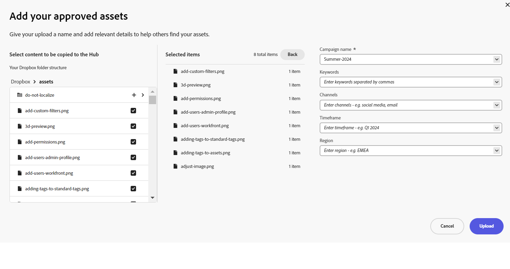

# Fazer upload de ativos aprovados pela marca para o Content Hub {#upload-brand-approved-assets-content-hub}

[Usuários do Content Hub com direito de adicionar ativos](/help/assets/deploy-content-hub.md#onboard-content-hub-users-add-assets) O pode adicionar ativos à Content Hub do sistema de arquivos local ou importar ativos de fontes de dados do OneDrive ou do Dropbox. Todos os ativos são exibidos no nível superior do Content Hub, independentemente da estrutura de pastas disponível no sistema de arquivos local ou nas fontes de dados do OneDrive e do Dropbox para aprimorar os recursos de pesquisa.

Para aprimorar ainda mais a pesquisa de ativos, o Content Hub permite:

* Defina os principais detalhes relevantes para o upload do seu ativo, como nome da campanha, palavras-chave, canais e assim por diante.

* Gere automaticamente mais propriedades para cada ativo após o upload bem-sucedido, como tamanho do arquivo, formato, resolução e algumas outras propriedades.

* Usar a inteligência artificial fornecida pelo [Adobe Sensei](https://www.adobe.com/br/sensei.html) para aplicar automaticamente tags relevantes a todos os ativos carregados. Essas tags, devidamente chamadas de Tags inteligentes, aumentam a velocidade do conteúdo de seus projetos, ajudando você a encontrar ativos relevantes rapidamente.

Certifique-se de fazer upload apenas do [ativos aprovados pela marca para a Content Hub](/help/assets/approve-assets.md).

## Pré-requisitos {#prerequisites-add-assets}

[Usuários do Content Hub com direito de adicionar ativos](/help/assets/deploy-content-hub.md#onboard-content-hub-users-add-assets) O pode fazer upload de ativos para o Content Hub.

## Adicionar ativos ao Content Hub a partir do sistema de arquivos local {#add-assets-local-file-system}

Para adicionar ativos ao Content Hub, execute as seguintes etapas:

1. Clique em **[!UICONTROL Adicionar o Assets]** para exibir o **[!UICONTROL Adicionar seus ativos aprovados]** que permite criar um upload.

1. No **[!UICONTROL Arraste arquivos ou pastas para cá]** disponível no painel direito, você pode arrastar os ativos do sistema de arquivos local ou clicar em **[!UICONTROL Procurar]** para selecionar manualmente arquivos ou pastas disponíveis no sistema de arquivos local. Essa lista de arquivos que fazem parte do upload está disponível como uma lista.

   Também é possível visualizar as imagens selecionadas usando as miniaturas e clicar no ícone X para remover qualquer imagem específica da lista. O ícone X é exibido somente quando você passa o mouse sobre o nome ou o tamanho da imagem. Você também pode clicar em **[!UICONTROL Remover tudo]** para excluir todos os itens da lista de upload.

   Para concluir o processo de upload e ativar o **[!UICONTROL Botão Carregar]**, você deve agrupar seus ativos em um nome de campanha.

   

1. Defina o nome do upload usando o **[!UICONTROL Nome da campanha]** campo. Você pode usar um nome existente ou criar um novo. À medida que você digita o nome, a Content Hub fornece mais opções. <!--You can define multiple Campaign names for your upload. While you are typing a name, either click anywhere else within the dialog box or press the `,` (Comma) key to register the name.-->

   Como prática recomendada, o Adobe recomenda especificar valores no restante dos campos, bem como criar uma experiência de pesquisa aprimorada para os ativos carregados.

1. Da mesma forma, defina valores para a variável **[!UICONTROL Palavras-chave]**, **[!UICONTROL Canais]**, **[!UICONTROL Cronograma]**, e **[!UICONTROL Região]** campos. Marcar e agrupar ativos por palavras-chave, canais e localização permite que todos que usam o conteúdo aprovado da empresa encontrem esses ativos e os mantenham organizados.

1. Clique em **[!UICONTROL Carregar]** para fazer upload de ativos para a Content Hub. [!UICONTROL Detalhes da revisão] confirmação será exibida. Clique em [!UICONTROL Continuar].

1. O Assets inicia o upload. Clique em [!UICONTROL Novo upload] para reiniciar o procedimento de upload. Clique em [!UICONTROL Concluído] para concluir o upload.

Os administradores também podem configurar os campos obrigatórios e opcionais exibidos durante o upload de ativos, como nome da campanha, palavras-chave, canais e assim por diante. Para obter mais informações, consulte [Configurar a interface do usuário do Content Hub](configure-content-hub-ui-options.md#configure-upload-options-content-hub).

## Adicionar ativos ao Content Hub a partir de fontes de dados do OneDrive ou do Dropbox {#add-assets-onedrive-dropbox}

Para adicionar ativos ao Content Hub a partir de fontes de dados do OneDrive ou Dropbox:

1. Clique em **[!UICONTROL Adicionar o Assets]** para exibir o **[!UICONTROL Adicionar seus ativos aprovados]** que permite importar ativos do OneDrive ou Dropbox.

1. Clique em **[!UICONTROL OneDrive]** ou **[!UICONTROL Dropbox]** para iniciar o processo de importação. O Content Hub solicita que você faça logon em sua conta do OneDrive ou do Dropbox e, em seguida, exibe sua estrutura de pastas do OneDrive ou do Dropbox no painel esquerdo.

1. Clique no ícone + adjacente ao arquivo ou ao nome da pasta para exibir o item na lista de Itens selecionados. Depois de selecionar todos os arquivos que precisam ser adicionados ao portal Content Hub, repita as etapas de 3 a 6 de [Adicionar ativos ao Content Hub a partir do sistema de arquivos local](#add-assets-local-file-system) para concluir o processo de upload.

   

Os administradores também podem configurar os campos obrigatórios e opcionais exibidos durante o upload de ativos, como nome da campanha, palavras-chave, canais e assim por diante. Para obter mais informações, consulte [Configurar a interface do usuário do Content Hub](configure-content-hub-ui-options.md#configure-upload-options-content-hub).

