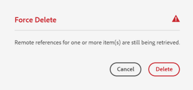

# Use o Connected Assets para compartilhar ativos do DAM no [!DNL Experience Manager Sites] {#use-connected-assets-to-share-dam-assets-in-aem-sites}

Em grandes empresa, a infraestrutura necessária para criar sites pode ser distribuída. Às vezes, os recursos de criação de sites e os ativos digitais usados para criar esses sites podem residir em diferentes implantações. Um motivo pode ser a distribuição geográfica de implantações existentes necessárias para trabalhar em conjunto. Outra razão pode ser as aquisições que levam a infraestruturas heterogêneas, incluindo diferentes [!DNL Experience Manager] versões, que a empresa pai deseja usar em conjunto.

A funcionalidade Ativos conectados oferece suporte ao caso de uso acima, integrando [!DNL Experience Manager Sites] e [!DNL Experience Manager Assets]. Os usuários podem criar páginas da Web em [!DNL Sites] que usam os ativos digitais de uma [!DNL Assets] implantações.

## Visão geral do Connected Assets {#overview-of-connected-assets}

Ao editar páginas em [!UICONTROL Editor de páginas] como destino, os autores podem pesquisar, navegar e incorporar facilmente ativos de um [!DNL Assets] implantação que atua como uma fonte de ativos. Os administradores criam uma integração única de uma implantação de [!DNL Experience Manager] com [!DNL Sites] com outra implantação de [!DNL Experience Manager] com [!DNL Assets] capacidade. Você também pode usar as imagens do Dynamic Media nas páginas da Web de seu site por meio do Connected Assets e aproveitar as funcionalidades do Dynamic Media, como recorte inteligente e predefinições de imagens.

Para o [!DNL Sites] autores, os ativos remotos estão disponíveis como ativos locais somente leitura. A funcionalidade suporta pesquisa e uso ininterruptos de alguns ativos remotos de cada vez. Para disponibilizar muitos ativos remotos em um [!DNL Sites] implantação de uma só vez, considere migrar os ativos em massa.

### Pré-requisitos e implantações compatíveis {#prerequisites}

Antes de usar ou configurar esse recurso, verifique o seguinte:

* Os usuários fazem parte dos grupos de usuários apropriados em cada implantação.
* Para [!DNL Adobe Experience Manager] tipos de implantação, um dos critérios compatíveis é atendido. [!DNL Experience Manager] as a Cloud Service [!DNL Assets] funciona com [!DNL Experience Manager] 6.5. Para obter mais informações sobre como essa funcionalidade funciona em [!DNL Experience Manager] 6.5, ver [Ativos conectados em [!DNL Experience Manager] 6,5 [!DNL Assets]](https://experienceleague.adobe.com/docs/experience-manager-65/assets/using/use-assets-across-connected-assets-instances.html).

   |  | [!DNL Sites] as a [!DNL Cloud Service] | [!DNL Experience Manager] 6,5 [!DNL Sites] no AMS | [!DNL Experience Manager] 6,5 [!DNL Sites] no local |
   |---|---|---|---|
   | **[!DNL Experience Manager Assets]como[!DNL Cloud Service]** | Compatível | Compatível | Compatível |
   | **[!DNL Experience Manager]6,5 [!DNL Assets] no AMS** | Compatível | Compatível | Compatível |
   | **[!DNL Experience Manager]6,5 [!DNL Assets] no local** | Incompatível | Incompatível | Incompatível |

### Formatos de arquivo não suportados {#mimetypes}

Os autores pesquisam imagens e os seguintes tipos de documentos no Localizador de conteúdo e usam os ativos pesquisados no Editor de páginas. Os documentos são adicionados ao `Download` componente e imagens para o `Image` componente. Os autores também adicionam os ativos remotos em qualquer [!DNL Experience Manager] componente que estende o padrão `Download` ou `Image` componentes. Os formatos compatíveis são:

* **Formatos de imagem**: Os formatos que a variável [Componente de imagem](https://www.aemcomponents.dev/content/core-components-examples/library/page-authoring/image.html) suporta.
* **Formatos de documento**: Consulte a [formatos de documento suportados](file-format-support.md#document-formats).

### Usuários e grupos envolvidos {#users-and-groups-involved}

As várias funções envolvidas para configurar e usar o recurso e seus grupos de usuários correspondentes são descritas abaixo. O escopo local é usado para o caso de uso em que um autor cria uma página da Web. O escopo remoto é usado para a implantação do DAM que hospeda os ativos necessários. O [!DNL Sites] O autor busca esses ativos remotos.

| Função | Escopo | Grupo de usuários | Nome do usuário na apresentação | Requisito |
|------|--------|-----------|-----|----------|
| [!DNL Sites] administrador | Local | [!DNL Experience Manager] `administrators` | `admin` | Configurar [!DNL Experience Manager] e configurar a integração com o controle remoto [!DNL Assets] implantação. |
| Usuário do DAM | Local | `Authors` | `ksaner` | Usado para exibir e duplicar os ativos pesquisados em `/content/DAM/connectedassets/`. |
| [!DNL Sites] author | Local | <ul><li>`Authors` (com acesso de leitura no DAM remoto e acesso de autor no local [!DNL Sites]) </li> <li>`dam-users` no local [!DNL Sites]</li></ul> | `ksaner` | Os usuários finais são [!DNL Sites] autores que usam essa integração para melhorar a velocidade do conteúdo. Os autores podem pesquisar e procurar ativos no DAM remoto usando [!UICONTROL Localizador de conteúdo] e usando as imagens necessárias em páginas da Web locais. As credenciais do usuário do DAM `ksaner` são usadas. |
| [!DNL Assets] administrador | Remoto | [!DNL Experience Manager] `administrators` | `admin` no modo remoto [!DNL Experience Manager] | Configure o CORS (Cross-Origin Resource Sharing). |
| Usuário do DAM | Remoto | `Authors` | `ksaner` no modo remoto [!DNL Experience Manager] | Função de autor no controle remoto [!DNL Experience Manager] implantação. Pesquise e procure ativos no Connected Assets usando o [!UICONTROL Localizador de conteúdo]. |
| Distribuidor do DAM (usuário técnico) | Remoto | <ul> <li> [!DNL Sites] `Authors`</li> <li> `connectedassets-assets-techaccts` </li> </ul> | `ksaner` no modo remoto [!DNL Experience Manager] | Esse usuário presente na implantação remota é usado por [!DNL Experience Manager] servidor local (não o [!DNL Sites] função de autor) para buscar os ativos remotos, em nome de [!DNL Sites] autor. Essa função não é igual às duas funções `ksaner` acima e pertence a um grupo de usuários diferente. |
| [!DNL Sites] usuário técnico | Local | `connectedassets-sites-techaccts` | - | Permite [!DNL Assets] implantação para procurar referências a ativos na [!DNL Sites] páginas da Web. |

### Arquitetura do Connected Assets {#connected-assets-architecture}

O Experience Manager permite conectar uma implantação remota do DAM como fonte para várias implantações do Experience Manager Sites. Você pode conectar um máximo de quatro implantações de Sites a um DAM remoto de origem. No entanto, você pode conectar uma implantação do Sites com apenas uma implantação remota do DAM.

Os diagramas a seguir ilustram os cenários compatíveis:

O diagrama a seguir ilustra um cenário não suportado:

## Configure uma conexão entre [!DNL Sites] e [!DNL Assets] implantações {#configure-a-connection-between-sites-and-assets-deployments}

Um [!DNL Experience Manager] O administrador pode criar essa integração. Depois de criadas, as permissões necessárias para usá-las são estabelecidas por meio de grupos de usuários. Os grupos de usuários são definidos na variável [!DNL Sites] e na implantação do DAM.

Para configurar o Connected Assets e o local [!DNL Sites] para conectividade, siga estas etapas:

1. Acessar um [!DNL Sites] implantação. Essa [!DNL Sites] a implantação é usada para criação de página da web, digamos em `https://[sites_servername]:port`. Como a criação de página acontece em [!DNL Sites] implantação, vamos chamar a função [!DNL Sites] implantação local da perspectiva de criação da página.

1. Acessar um [!DNL Assets] implantação. Essa [!DNL Assets] a implantação é usada para gerenciar ativos digitais, digamos em `https://[assets_servername]:port`.

1. Certifique-se de que os usuários e as funções com o escopo apropriado existam no [!DNL Sites] e na [!DNL Assets] implantação no AMS. Criar um usuário técnico em [!DNL Assets] implantação e adição ao grupo de usuários mencionado em [usuários e grupos envolvidos](/help/assets/use-assets-across-connected-assets-instances.md#users-and-groups-involved).

1. Acessar o local [!DNL Sites] implantação em `https://[sites_servername]:port`. Clique em **[!UICONTROL Ferramentas]** > **[!UICONTROL Ativos]** > **[!UICONTROL Configuração do Connected Assets]** e forneça os seguintes valores:

   1. A **[!UICONTROL Título]** da configuração.
   1. **[!UICONTROL URL do DAM remoto]** é o URL do [!DNL Assets] localização no formato `https://[assets_servername]:[port]`.
   1. Credenciais de um distribuidor do DAM (usuário técnico).
   1. No **[!UICONTROL Ponto de montagem]** , insira o local [!DNL Experience Manager] caminho onde [!DNL Experience Manager] busca os ativos. Por exemplo, pasta `connectedassets`. Os ativos que são obtidos do DAM são armazenados nesta pasta na [!DNL Sites] implantação.
   1. **[!UICONTROL URL de sites locais]** é a localização da variável [!DNL Sites] implantação. [!DNL Assets] a implantação usa esse valor para manter referências aos ativos digitais buscados por essa [!DNL Sites] implantação.
   1. Credenciais de [!DNL Sites] usuário técnico.
   1. O valor de **[!UICONTROL Limite de otimização da transferência do binário original]** especifica se os ativos originais (incluindo as representações) são transferidos de forma síncrona ou não. Os ativos com tamanho de arquivo menor podem ser buscados prontamente, enquanto os ativos com tamanho de arquivo relativamente maior são sincronizados melhor de forma assíncrona. O valor depende dos recursos de rede.
   1. Selecione **[!UICONTROL Datastore compartilhado com o Connected Assets]**, se você usar um datastore para armazenar seus ativos e se o Datastore for o armazenamento comum entre as duas implantações do Nesse caso, o limite não importa, pois os binários de ativos reais estão disponíveis no armazenamento de dados e não são transferidos.

   

   *Figura: Uma configuração típica para a funcionalidade Ativos conectados.*

1. Os ativos digitais existentes no [!DNL Assets] a implantação já é processada e as renderizações são geradas. Essas representações são buscadas usando essa funcionalidade, de modo que não há necessidade de regenerar as representações. Desative os inicializadores do fluxo de trabalho para impedir a regeneração de representações. Ajuste as configurações do iniciador no ([!DNL Sites]) para excluir a `connectedassets` pasta (os ativos são buscados nesta pasta).

   1. Ligado [!DNL Sites] implantação, clique em **[!UICONTROL Ferramentas]** > **[!UICONTROL Fluxo de trabalho]** > **[!UICONTROL Lançadores]**.

   1. Procure Iniciadores com fluxos de trabalho como **[!UICONTROL Ativo de atualização do DAM]** e **[!UICONTROL Writeback de metadados do DAM]**.

   1. Selecione o iniciador do fluxo de trabalho e clique em **[!UICONTROL Propriedades]** na barra de ações.

   1. No [!UICONTROL Propriedades] assistente, altere o **[!UICONTROL Caminho]** campos como os seguintes mapeamentos para atualizar suas expressões regulares para excluir o ponto de montagem **[!UICONTROL ativos conectados]**.

   | Antes | Depois |
   | ------ | ------------ |
   | `/content/dam(/((?!/subassets).)*/)renditions/original` | `/content/dam(/((?!/subassets)(?!connectedassets).)*/)renditions/original` |
   | `/content/dam(/.*/)renditions/original` | `/content/dam(/((?!connectedassets).)*/)renditions/original` |
   | `/content/dam(/.*)/jcr:content/metadata` | `/content/dam(/((?!connectedassets).)*/)jcr:content/metadata` |

   >[!NOTE]
   >
   >Todas as representações disponíveis na implantação remota do são buscadas, quando os autores buscam um ativo. Se você quiser criar mais representações de um ativo buscado, pule esta etapa de configuração. O [!UICONTROL Ativo de atualização DAM] O fluxo de trabalho é acionado e cria mais execuções. Essas representações estão disponíveis somente no local [!DNL Sites] implantação e não na implantação remota do DAM.

1. Adicione o [!DNL Sites] implantação como uma origem permitida na configuração do CORS na [!DNL Assets] implantação. Para obter mais informações, consulte [entender o CORS](https://experienceleague.adobe.com/docs/experience-manager-learn/foundation/security/understand-cross-origin-resource-sharing.html).

1. Configurar [mesmo suporte a cookies do site](/help/security/same-site-cookie-support.md).

Você pode verificar a conectividade entre o [!DNL Sites] implantações e [!DNL Assets] implantação.

![Teste de conexão do Connected Assets configurado [!DNL Sites]](assets/connected-assets-multiple-config.png)
*Figura: Teste de conexão do Connected Assets configurado [!DNL Sites].*

<!-- TBD: Check if Launchers are to be disabled on CS instances. Is this option even available to the users on CS? -->

## Configure uma conexão entre [!DNL Sites] e [!DNL Dynamic Media] implantações {#sites-dynamic-media-connected-assets}

Você pode configurar uma conexão entre [!DNL Sites] implantação e [!DNL Dynamic Media] implantação que permite que autores de páginas da Web usem [!DNL Dynamic Media] imagens em suas páginas da Web. Ao criar páginas da Web, a experiência de usar ativos remotos e [!DNL Dynamic Media] as implantações permanecem as mesmas. Isso permite que você aproveite a [!DNL Dynamic Media] por meio do recurso Connected Assets, por exemplo, recorte inteligente e predefinições de imagens.

Para configurar a conexão, siga estas etapas:

1. Criar a configuração do Connected Assets conforme descrito acima, exceto ao configurar a funcionalidade, selecione **[!UICONTROL Buscar a representação original do Dynamic Media Connected Assets]** opção.

1. Configurar [!DNL Dynamic Media] no local [!DNL Sites] e remota [!DNL Assets] implantações. Siga as instruções para [configure [!DNL Dynamic Media]](/help/assets/dynamic-media/config-dm.md#configuring-dynamic-media-cloud-services).

   * Use o mesmo nome de empresa em todas as configurações.
   * No local [!DNL Sites], em [!UICONTROL Modo de sincronização Dynamic Media], selecione **[!UICONTROL Desabilitado por padrão]**. O [!DNL Sites] a implantação deve ter acesso somente leitura ao [!DNL Dynamic Media] conta.
   * No local [!DNL Sites]no **[!UICONTROL Publicar ativos]** , selecione **[!UICONTROL Publicação seletiva]**. Não selecionar **[!UICONTROL Sincronizar todo o conteúdo]**.
   * No remoto [!DNL Assets] implantação, em [!UICONTROL Modo de sincronização Dynamic Media], selecione **[!UICONTROL Ativado por padrão]**.

1. Habilitar [[!DNL Dynamic Media] suporte no Componente principal de imagem](https://experienceleague.adobe.com/docs/experience-manager-core-components/using/components/image.html#dynamic-media). Esse recurso ativa o padrão [Componente de imagem](https://www.aemcomponents.dev/content/core-components-examples/library/page-authoring/image.html) para exibir [!DNL Dynamic Media] imagens ao [!DNL Dynamic Media] imagens são usadas por autores em páginas da Web locais [!DNL Sites] implantação.

## Use ativos remotos {#use-remote-assets}

Os autores do site usam o Localizador de conteúdo para se conectar à implantação do DAM. Os autores podem procurar, buscar e arrastar os ativos remotos em um componente. Para autenticar no DAM remoto, mantenha acessíveis as credenciais do usuário do DAM fornecidas pelo administrador.

Os autores podem usar os ativos disponíveis no DAM local e na implantação remota do DAM, em uma única página da Web. Use o Localizador de conteúdo para alternar entre a pesquisa no DAM local ou a pesquisa no DAM remoto.

Somente as tags de ativos remotos são buscadas e têm uma tag exata correspondente junto com a mesma hierarquia de taxonomia, disponível no local [!DNL Sites] implantação. Quaisquer outras tags são descartadas. Os autores podem pesquisar ativos remotos usando todas as tags presentes no controle remoto [!DNL Experience Manager] , pois oferece uma pesquisa em texto completo.

### Apresentação do uso {#walk-through-of-usage}

Use a configuração acima para ter uma experiência de criação a fim de entender a funcionalidade. Use documentos ou imagens de sua escolha na implantação remota do DAM.

1. Navegue até o [!DNL Assets] interface na implantação remota acessando **[!UICONTROL Ativos]** > **[!UICONTROL Arquivos]** from [!DNL Experience Manager] espaço de trabalho. Como alternativa, acesse `https://[assets_servername_ams]:[port]/assets.html/content/dam` em um navegador. Carregue os ativos de sua escolha.

1. No [!DNL Sites] , no ativador de perfil no canto superior direito, clique em **[!UICONTROL Representar como]**. Forneça `ksaner` como nome de usuário, selecione a opção fornecida e clique em **[!UICONTROL OK]**.

1. Abra um `We.Retail` página do site em **[!UICONTROL Sites]** > **[!UICONTROL We.Retail]** > **[!UICONTROL us]** > **[!UICONTROL en]**. Edite a página. Como alternativa, acesse `https://[aem_server]:[port]/editor.html/content/we-retail/us/en/men.html` em um navegador para editar uma página.

   Clique em **[!UICONTROL Alternar painel lateral]** no canto superior esquerdo da página.

1. Abra o [!UICONTROL Ativos] e clique em **[!UICONTROL Faça logon no Connected Assets]**.

1. Forneça as credenciais - `ksaner` como nome de usuário e `password` como senha. Esse usuário tem permissões de criação em [!DNL Experience Manager] implantações.

1. Procure o ativo que você adicionou ao DAM. Os ativos remotos são exibidos no painel esquerdo. Filtre por imagens ou documentos e filtre também por tipos de documentos compatíveis. Arraste as imagens em um componente `Image` e os documentos em um componente `Download`.

   Os ativos buscados são somente leitura no local [!DNL Sites] implantação. Ainda é possível usar as opções fornecidas pela [!DNL Sites] componentes para editar o ativo buscado. A edição por componentes não é destrutiva.

   

   *Figura: opções para filtrar tipos de documentos e imagens ao pesquisar ativos no DAM remoto.*

1. Um autor do site será notificado se ocorrer uma busca assíncrona de ativo e uma falha na tarefa de busca. Durante a criação ou até mesmo após a criação, os autores podem ver informações detalhadas sobre as tarefas de busca e erros no [trabalhos assíncronos](/help/operations/asynchronous-jobs.md) interface do usuário.

   

   *Figura: notificação sobre a busca assíncrona de ativos que ocorre em segundo plano.*

1. Ao publicar uma página, [!DNL Experience Manager] exibe uma lista completa de ativos que são usados na página. Verifique se os ativos remotos foram buscados com êxito no momento da publicação. Para verificar o status de cada ativo buscado, consulte [trabalhos assíncronos](/help/operations/asynchronous-jobs.md) interface do usuário.

   >[!NOTE]
   >
   >Mesmo se um ou mais ativos remotos não forem buscados, a página será publicada. O componente que usa o ativo remoto é publicado vazio. O [!DNL Experience Manager] a área de notificação exibe uma notificação para erros que são mostrados na página de trabalhos assíncronos.

>[!CAUTION]
>
>Uma vez usados em uma página da Web, os ativos remotos buscados podem ser pesquisados e usados por qualquer pessoa com permissões para acessar a pasta local. Os ativos buscados são armazenados na pasta local (`connectedassets` na apresentação acima). Os ativos também podem ser pesquisados e visualizados no repositório local por meio do [!UICONTROL Localizador de conteúdo].

Os ativos buscados podem ser usados como qualquer outro ativo local, exceto se os metadados associados não puderem ser editados.

### Verificar o uso de um ativo em páginas da Web {#asset-usage-references}

[!DNL Experience Manager] permite que usuários do DAM verifiquem todas as referências a um ativo. Ajuda a entender e gerenciar o uso de um ativo no modo remoto [!DNL Sites] e em ativos compostos. Muitos autores de páginas da Web em [!DNL Experience Manager Sites] a implantação pode usar um ativo em um DAM remoto em diferentes páginas da Web. Para simplificar o gerenciamento de ativos e não levar a referências quebradas, é importante que os usuários do DAM verifiquem o uso de um ativo em páginas da Web locais e remotas. O [!UICONTROL Referências] em um ativo [!UICONTROL Propriedades] lista as referências locais e remotas do ativo.

Para exibir e gerenciar referências no [!DNL Assets] , siga estas etapas:

1. Selecione um ativo em [!DNL Assets] Console e clique em **[!UICONTROL Propriedades]** na barra de ferramentas.
1. Clique em **[!UICONTROL Referências]** guia . Consulte **[!UICONTROL Referências locais]** para uso do ativo no [!DNL Assets] implantação. Consulte **[!UICONTROL Referências remotas] para uso do ativo em [!DNL Sites] implantação em que o ativo foi buscado usando a funcionalidade Ativos conectados.

   

1. As referências para [!DNL Sites] as páginas exibem a contagem total de referências para cada local [!DNL Sites]. Pode levar algum tempo para localizar todas as referências e exibir o número total de referências.
1. A lista de referências é interativa e os usuários do DAM podem clicar em uma referência para abrir a página de referência. Se referências remotas não puderem ser buscadas por algum motivo, uma notificação será exibida informando o usuário sobre a falha.
1. Os usuários podem mover ou excluir o ativo. Ao mover ou excluir um ativo, o número total de referências de todos os ativos/pastas selecionados é exibido em uma caixa de diálogo de aviso. Ao excluir um ativo para o qual as referências ainda não são exibidas, uma caixa de diálogo de aviso é exibida.

   

### Gerenciar atualizações em ativos no DAM remoto {#handling-updates-to-remote-assets}

Depois [configuração de uma conexão](#configure-a-connection-between-sites-and-assets-deployments) entre implantações remotas de DAM e Sites, os ativos no DAM remoto são disponibilizados na implantação do Sites. Em seguida, você pode executar as operações de atualização, exclusão, renomeação e movimentação nos ativos ou pastas remotos do DAM. As atualizações, com algum atraso, estão disponíveis automaticamente na implantação do Sites. Além disso, se um ativo no DAM remoto for usado em uma página local do Experience Manager Sites, as atualizações do ativo no DAM remoto serão exibidas na página Sites .

Ao mover um ativo de um local para outro, assegure-se de [ajustar referências](manage-digital-assets.md) para que o ativo seja exibido na página Sites . Se você mover um ativo para um local que não está acessível a partir da implantação local do Sites, o ativo não será exibido na implantação do Sites.

Você também pode atualizar as propriedades de metadados de um ativo no DAM remoto e as alterações estão disponíveis na implantação local do Sites.

Os autores do Sites podem visualizar as atualizações disponíveis na implantação do Sites e republicar as alterações para torná-las disponíveis na instância de publicação do AEM.

Experience Manager exibe um `expired` indicador visual de status em ativos no Localizador de conteúdo de ativos remotos para impedir que os autores do site usem o ativo em uma página Sites . Se você usar um ativo com um `expired` em uma página Sites, o ativo não é exibido na instância de publicação do Experience Manager.

>[!NOTE]
>
>As atualizações para ativos no DAM remoto são disponibilizadas para a implantação do Sites somente se as implantações remotas do DAM e do Sites estiverem no Experience Manager as a Cloud Service.

## Limitações e práticas recomendadas {#tip-and-limitations}

* Para obter insights sobre o uso do ativo, configure a variável [Insight de ativos](/help/assets/assets-insights.md) no [!DNL Sites] instância.

### Permissões e gerenciamento de ativos {#permissions-and-managing-assets}

* Os ativos locais não são sincronizados com os ativos originais na implantação remota. As edições, exclusões ou revogação de permissões na implantação do DAM não são propagadas para a jusante.
* Os ativos locais são cópias somente leitura. [!DNL Experience Manager]Os componentes do fazem edições não destrutivas nos ativos. Nenhuma outra edição é permitida.
* Os ativos buscados localmente estão disponíveis apenas para fins de criação. Os fluxos de trabalho de atualização de ativos não podem ser aplicados e os metadados não podem ser editados.
* Ao usar [!DNL Dynamic Media] em [!DNL Sites] páginas em que o ativo original não é buscado e armazenado na implantação local. O `dam:Asset` , os metadados e as representações geradas por [!DNL Assets] todas as implantações são buscadas no [!DNL Sites] implantação.
* Somente as imagens e os formatos de documento listados são compatíveis. [!DNL Content Fragments] e [!DNL Experience Fragments] não são compatíveis.
* [!DNL Experience Manager] não busca os esquemas de metadados. Significa que nem todos os metadados buscados podem ser exibidos. Se o schema for atualizado separadamente na [!DNL Sites] implantação e todas as propriedades de metadados são exibidas.
* Todos [!DNL Sites] os autores têm permissões de leitura nas cópias buscadas, mesmo se não puderem acessar a implantação remota do DAM.
* Não há suporte de API para personalizar a integração.
* A funcionalidade suporta pesquisa e uso ininterruptos de ativos remotos. Para disponibilizar muitos ativos remotos em uma só implantação local, você pode migrar os ativos.
* Não é possível usar um ativo remoto como miniatura de página no [!UICONTROL Propriedades da página] interface do usuário. É possível definir uma miniatura de uma página da Web em [!UICONTROL Propriedades da página] interface do usuário do [!UICONTROL Miniatura] clicando em [!UICONTROL Selecionar imagem].

### Configuração e licenciamento {#setup-licensing}

* [!DNL Assets] implantação em [!DNL Adobe Managed Services] é compatível.
* [!DNL Sites] pode se conectar a um único [!DNL Assets] repositório de cada vez.
* Uma licença de [!DNL Assets] é necessário trabalhar como repositório remoto.
* Uma ou mais licenças de [!DNL Sites] é necessário trabalhar como implantação de criação local.

### Uso {#usage}

* Os usuários podem pesquisar ativos remotos e arrastá-los para a página local durante a criação. Nenhuma outra funcionalidade é compatível.
* A operação de busca expira após 5 segundos. Os autores podem ter problemas ao buscar ativos, digamos se houver problemas de rede. Os autores podem tentar novamente, arrastando o ativo remoto de [!UICONTROL Localizador de conteúdo] para [!UICONTROL Editor de páginas].
* Edições simples que não são destrutivas e a edição compatível por meio do componente `Image` do podem ser realizadas nos ativos buscados. Os ativos são somente leitura.
* O único método para recuperar o ativo é arrastá-lo para uma página. Não há suporte para API ou outros métodos para buscar novamente um ativo para atualizá-lo.
* Se os ativos forem descontinuados do DAM, eles continuarão a ser usados em [!DNL Sites] páginas.
* As entradas de referência remota de um ativo são buscadas de forma assíncrona. As referências e a contagem total não estão em tempo real e pode haver alguma diferença se uma [!DNL Sites] O autor usa o ativo enquanto um usuário do DAM está visualizando a referência. Os usuários do DAM podem atualizar a página e tentar novamente em alguns minutos para obter a contagem total.

## Solução de problemas {#troubleshoot}

Para solucionar erros comuns, siga estas etapas:

* Caso não seja possível pesquisar ativos remotos no [!UICONTROL Localizador de conteúdo], verifique se as funções e permissões necessárias estão em vigor.

* Um ativo buscado no DAM remoto pode não ser publicado em uma página da Web por um ou mais motivos. Ele não existe no servidor remoto, falta de permissões apropriadas para buscá-lo ou falha de rede pode ser o motivo. Certifique-se de que o ativo não seja removido do DAM remoto. Verifique se as permissões apropriadas estão em vigor e se os pré-requisitos foram atendidos. Tente adicionar o ativo novamente à página e publique-o novamente. Verifique a [lista de trabalhos assíncronos](/help/operations/asynchronous-jobs.md) quanto a erros na busca de ativos.

* Se você não conseguir acessar a implantação remota do DAM a partir do local [!DNL Sites] , garanta que os cookies entre sites sejam permitidos e [mesmo suporte a cookies do site](/help/security/same-site-cookie-support.md) está configurado. Se os cookies entre sites estiverem bloqueados, as implantações de [!DNL Experience Manager] não pode autenticar. Por exemplo, [!DNL Google Chrome] no modo Incógnito pode bloquear cookies de terceiros. Para permitir cookies no [!DNL Chrome] no navegador, clique no ícone &quot;olho&quot; na barra de endereços, navegue até **Site não está funcionando** > **Bloqueio**, selecione a URL do DAM remoto e permita o cookie do token de login. Como alternativa, consulte [como ativar cookies de terceiros](https://support.google.com/chrome/answer/95647).

   

* Se referências remotas não forem recuperadas e resultarem em uma mensagem de erro, verifique se [!DNL Sites] a implantação está disponível e verifique se há problemas de conectividade de rede. Tente novamente mais tarde para verificar. [!DNL Assets] a implantação tenta duas vezes estabelecer a conexão com o [!DNL Sites] e, em seguida, relata uma falha.

   
