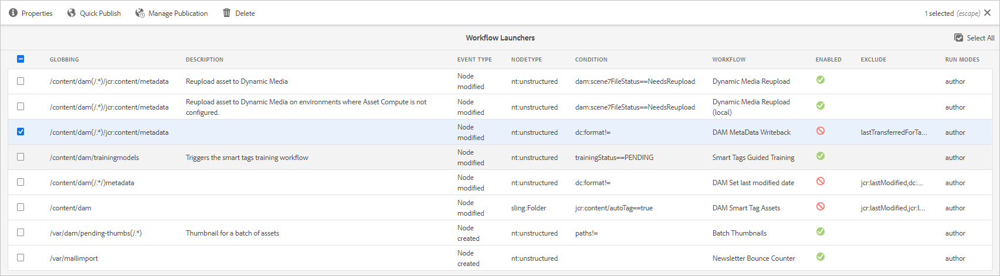

# Metadados XMP {#xmp-metadata}

XMP (Plataforma de metadados extensível) é o padrão de metadados usado pelo Experience Manager Assets para todo o gerenciamento de metadados. O XMP fornece um formato padrão para a criação, o processamento e o intercâmbio de metadados para uma grande variedade de aplicativos.

Além de oferecer a codificação de metadados universais que podem ser incorporados em todos os formatos de arquivo, o XMP fornece uma [modelo de conteúdo](#xmp-core-concepts) e [suportado pelo Adobe](#advantages-of-xmp) e outras empresas, de modo a que os utilizadores de XMP em combinação com [!DNL Assets] tenha uma plataforma poderosa para desenvolver.

## Visão geral XMP e ecossistema {#xmp-ecosystem}

[!DNL Assets] suporta nativamente o padrão de metadados de XMP. XMP é um padrão para processar e armazenar metadados padronizados e proprietários em ativos digitais. O XMP foi projetado para ser o padrão comum que permite que vários aplicativos funcionem com metadados de maneira eficaz.

Os profissionais de produção, por exemplo, usam o suporte XMP integrado nos aplicativos Adobe para transmitir informações em vários formatos de arquivo. O [!DNL Assets] O repositório extrai os metadados de XMP e os usa para gerenciar o ciclo de vida do conteúdo e oferece a capacidade de criar workflows de automação.

XMP padroniza como os metadados são definidos, criados e processados fornecendo um modelo de dados, um modelo de armazenamento e esquemas. Todos esses conceitos são abordados nesta seção.

Todos os metadados herdados do EXIF, ID3 ou Microsoft Office são traduzidos automaticamente para o XMP, que pode ser estendido para oferecer suporte ao esquema de metadados específico do cliente, como catálogos de produtos.

Os metadados no XMP consistem em um conjunto de propriedades. Estas propriedades estão sempre associadas a uma entidade específica designada por recurso; ou seja, as propriedades são &quot;sobre&quot; o recurso. No caso de XMP, o recurso é sempre o ativo.

O XMP define um modelo de [metadados](https://pt.wikipedia.org/wiki/Metadados) que pode ser usado com qualquer conjunto definido de itens de metadados. O XMP também define [esquemas](https://en.wikipedia.org/wiki/XML_schema) específicos de propriedades básicas úteis para gravar o histórico de um recurso à medida que ele passa por várias etapas de processamento, de ser fotografado, [digitalizado](https://pt.wikipedia.org/wiki/Digitalizador) ou criado como texto, até etapas de edição de fotos (como [recorte](https://en.wikipedia.org/wiki/Cropping_%28image%29) ou ajuste de cor), para montagem em uma imagem final. O XMP permite que cada programa de software ou dispositivo ao longo do caminho adicione suas próprias informações a um recurso digital, que pode ser retido no arquivo digital final.

O XMP geralmente é serializado e armazenado usando um subconjunto do [W3C](https://pt.wikipedia.org/wiki/World_Wide_Web_Consortium) [Resource Description Framework](https://pt.wikipedia.org/wiki/Resource_Description_Framework) (RDF), que por sua vez é expresso em [XML](https://pt.wikipedia.org/wiki/XML).

### Vantagens do XMP {#advantages-of-xmp}

XMP tem as seguintes vantagens em relação a outros padrões e esquemas de codificação:

* Metadados baseados em XMP são muito avançados e otimizados.
* XMP permite ter vários valores para uma propriedade.
* XMP tem codificação padronizada, que permite a troca fácil de metadados.
* XMP é extensível. É possível adicionar mais informações aos ativos.

O padrão de XMP foi projetado para ser extensível, permitindo adicionar tipos personalizados de metadados aos dados de XMP. Por outro lado, EXIF não - tem uma lista fixa de propriedades que não pode ser estendida.

>[!NOTE]
>
>XMP geralmente não permite que tipos de dados binários sejam incorporados. Para carregar dados binários no XMP, por exemplo, imagens em miniatura, eles devem ser codificados em um formato compatível com XML, como `Base64`.

### XMP conceitos principais {#xmp-core-concepts}

**Namespaces e schemata**

Um esquema de XMP é um conjunto de nomes de propriedade em um namespace XML comum que inclui o tipo de dados e as informações descritivas. Um esquema de XMP é identificado por seu URI de namespace XML. O uso de namespaces impede conflitos entre propriedades em esquemas diferentes que tenham o mesmo nome, mas um significado diferente.

Por exemplo, a variável **Criador** em dois esquemas projetados de forma independente, pode significar a pessoa que criou o ativo ou o aplicativo que criou o ativo (por exemplo, Adobe Photoshop).

**Propriedades e valores de XMP**

XMP pode incluir propriedades de um ou mais schemas. Por exemplo, um subconjunto típico usado por muitos aplicativos Adobe pode incluir o seguinte:

* Esquema principal de Dublin: `dc:title`, `dc:creator`, `dc:subject`, `dc:format`, `dc:rights`
* XMP esquema básico: `xmp:CreateDate`, `xmp:CreatorTool`, `xmp:ModifyDate`, `xmp:metadataDate`
* XMP schema de gerenciamento de direitos: `xmpRights:WebStatement`, `xmpRights:Marked`
* XMP schema de gerenciamento de mídia: `xmpMM:DocumentID`

**Alternativas linguísticas**

O XMP oferece a capacidade de adicionar uma `xml:lang` propriedade do texto para especificar o idioma do texto.

## XMP gravação em representações {#xmp-writeback-to-renditions}

Este recurso de write-back de XMP em [!DNL Adobe Experience Manager Assets] replica as alterações de metadados nas representações do ativo original.
Ao alterar os metadados de um ativo de dentro do [!DNL Assets] ou durante o upload do ativo, as alterações são armazenadas inicialmente no nó de metadados na hierarquia do ativo. O recurso de write-back permite propagar as alterações de metadados para todas as representações ou representações específicas do ativo. O recurso grava somente as propriedades de metadados que usam `jcr` namespace, ou seja, uma propriedade chamada `dc:title` é gravado de volta, mas uma propriedade chamada `mytitle` não é.

Por exemplo, considere um cenário em que você modifica a variável [!UICONTROL Título] propriedade do ativo intitulado `Classic Leather` para `Nylon`.

Nesse caso, [!DNL Assets] salva as alterações no **[!UICONTROL Título]** na `dc:title` para os metadados do ativo armazenados na hierarquia de ativos.

>[!IMPORTANT]
>
>Por padrão, o recurso de write-back não está ativado em [!DNL Assets]. Veja como [ativar o write-back de metadados](#enable-xmp-writeback). O MSM para ativos digitais não funciona com o write-back de metadados habilitado. Após o write-back, a herança é interrompida.

### Ativar XMP write-back {#enable-xmp-writeback}

[!UICONTROL Writeback de metadados DAM] é usado para gravar os metadados de um ativo. Para ativar o write-back, siga qualquer um dos três métodos a seguir:

* Use Iniciadores.
* Iniciar manualmente `DAM MetaData Writeback` fluxo de trabalho.
* Configure o workflow para fazer parte do pós-processamento.

Para usar o Launchers, siga estas etapas:

1. Como administrador, acesse **[!UICONTROL Ferramentas]** > **[!UICONTROL Fluxo de trabalho]** > **[!UICONTROL Lançadores]**.
1. Selecione o [!UICONTROL Iniciador] em que **[!UICONTROL Fluxo de trabalho]** exibições de coluna **[!UICONTROL Writeback de MetaData do DAM]**. Clique em **[!UICONTROL Propriedades]** na barra de ferramentas.

   

1. Selecionar **[!UICONTROL Ativar]** no **[!UICONTROL Propriedades do Iniciador]** página. Clique em **[!UICONTROL Salvar e fechar]**.

Para aplicar manualmente o fluxo de trabalho a um ativo apenas uma vez, aplique [!UICONTROL Writeback de metadados DAM] fluxo de trabalho do painel esquerdo.

Para aplicar o fluxo de trabalho a todos os ativos carregados, adicione o fluxo de trabalho a um perfil de pós-processamento.

<!-- Commenting for now. Need to document how to enable metadata writeback. See CQDOC-17254.

### Enable XMP writeback {#enable-xmp-writeback}

To enable the metadata changes to be propagated to the renditions of the asset when uploading it, modify the **[!UICONTROL Adobe CQ DAM Rendition Maker]** configuration in Configuration Manager.

1. To open Configuration Manager, access `https://[aem_server]:[port]/system/console/configMgr`.
1. Open the **[!UICONTROL Adobe CQ DAM Rendition Maker]** configuration.
1. Select the **[!UICONTROL Propagate XMP]** option, and then save the changes.

### Enable XMP write-back for specific renditions {#enable-xmp-writeback-for-specific-renditions}

To let the XMP write-back feature propagate metadata changes to select renditions, specify these renditions to the [!UICONTROL XMP Writeback Process] workflow step of DAM Metadata WriteBack workflow. By default, this step is configured with the original rendition.

For the XMP write-back feature to propagate metadata to the rendition thumbnails 140.100.png and 319.319.png, perform these steps.

1. Tap/click the Experience Manager logo, and then navigate to **[!UICONTROL Tools]** &gt; **[!UICONTROL Workflow]** &gt; **[!UICONTROL Models]**.
1. From the Models page, open the **[!UICONTROL DAM Metadata Writeback]** workflow model.
1. In the **[!UICONTROL DAM Metadata Writeback]** properties page, open the **[!UICONTROL XMP Writeback Process]** step.
1. In the **[!UICONTROL Step Properties]** dialog box, tap/click the **[!UICONTROL Process]** tab.
1. In the **[!UICONTROL Arguments]** box, add `rendition:cq5dam.thumbnail.140.100.png,rendition:cq5dam.thumbnail.319.319.png`, and then tap/click **[!UICONTROL OK]**.

   

1. Save the changes.
1. To regenerate the Pyramid TIFF (PTIFF) renditions for Dynamic Media images with the new attributes, add the **[!UICONTROL Dynamic Media Process Image Assets]** step to the DAM Metadata write-back workflow. PTIFF renditions are only created and stored locally in a Dynamic Media Hybrid implementation.

1. Save the workflow.

The metadata changes are propagated to the renditions renditions thumbnail.140.100.png and thumbnail.319.319.png of the asset, and not the others.
-->

**Consulte também**

* [Traduzir ativos](translate-assets.md)
* [API HTTP de ativos](mac-api-assets.md)
* [Formatos de arquivo compatíveis com os ativos](file-format-support.md)
* [Pesquisar ativos](search-assets.md)
* [Ativos conectados](use-assets-across-connected-assets-instances.md)
* [Relatórios de ativos](asset-reports.md)
* [Esquemas de metadados](metadata-schemas.md)
* [Baixar ativos](download-assets-from-aem.md)
* [Gerenciar metadados](manage-metadata.md)
* [Pesquisar aspectos](search-facets.md)
* [Gerenciar coleções](manage-collections.md)
* [Importação de metadados em massa](metadata-import-export.md)
