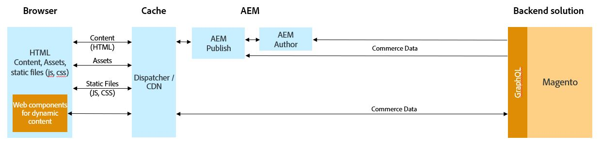

# Integração do AEM e da Magento usando a Commerce Integration Framework {#aem-magento-framework}

O AEM e a Magento se integram perfeitamente usando a Commerce Integration Framework (CIF). A CIF permite que o AEM acesse uma instância da Magento e estabeleça uma comunicação via GraphQL. Ela também permite que os autores do AEM usem seletores de produtos e categorias e o console de produtos para navegar pelos dados de produto e categoria obtidos da Magento sob demanda. Além disso, a CIF fornece uma loja pronta para uso que agiliza projetos de comércio.

>[!NOTE]
>
>O GraphQL é usado atualmente em dois cenários (separados) no Adobe Experience Manager (AEM) como Cloud Service:
>
>* O AEM Commerce consome dados de uma plataforma de comércio via GraphQL.
>* [AEM Fragmentos de conteúdo trabalham com a API GraphQL AEM (uma implementação personalizada, com base no GraphQL padrão), para fornecer conteúdo estruturado para uso em seus aplicativos](/help/assets/content-fragments/graphql-api-content-fragments.md).

## Visão geral da arquitetura {#overview}

Esta é a arquitetura geral:

A CIF tem como base o suporte para GraphQL. O principal canal de comunicação entre o AEM e a Magento é a [API GraphQL](https://devdocs.magento.com/guides/v2.4/graphql/) da Magento. Há diferentes maneiras de configurar a comunicação entre o AEM as a Cloud Service e a Magento. Consulte a página [Introdução](../getting-started.md) para obter detalhes.

A CIF oferece suporte para padrões de comunicação do lado do servidor e do lado do cliente.
As chamadas de API do lado do servidor são implementadas usando o [cliente GraphQL](https://github.com/adobe/commerce-cif-graphql-client) integrado e genérico junto com um [conjunto de modelos de dados gerados](https://github.com/adobe/commerce-cif-magento-graphql) para o esquema GraphQL da Magento. Além disso, podem ser usados qualquer consulta ou mutação GraphQL no formato GQL.

Para os componentes do lado do cliente, que são criados usando o [React](https://reactjs.org/), o [cliente Apollo](https://www.apollographql.com/docs/react/) é usado.

## Arquitetura dos Componentes principais da CIF do AEM {#cif-core-components}

Os [Componentes principais da CIF do AEM](https://github.com/adobe/aem-core-cif-components) seguem padrões de design e práticas recomendadas muito semelhantes aos dos [Componentes principais do WCM no AEM](https://github.com/adobe/aem-core-wcm-components).

A lógica de negócios e a comunicação de back-end com a Magento para os Componentes principais da CIF do AEM são implementadas nos Modelos do Sling. Caso seja necessário personalizar essa lógica para atender aos requisitos específicos do projeto, o padrão de delegação para Modelos do Sling pode ser usado.

>[!TIP]
>
>A página [Personalizar os Componentes principais da CIF do AEM](../customizing/customize-cif-components.md) tem um exemplo detalhado e oferece as práticas recomendadas para personalizar os componentes principais da CIF.

Nos projetos, os Componentes principais da CIF do AEM e os componentes do projeto personalizado podem recuperar facilmente o cliente configurado para uma loja da Magento associada a uma página do AEM por meio da configuração com reconhecimento de contexto do Sling.
